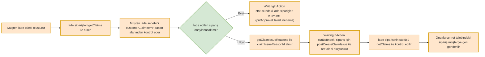
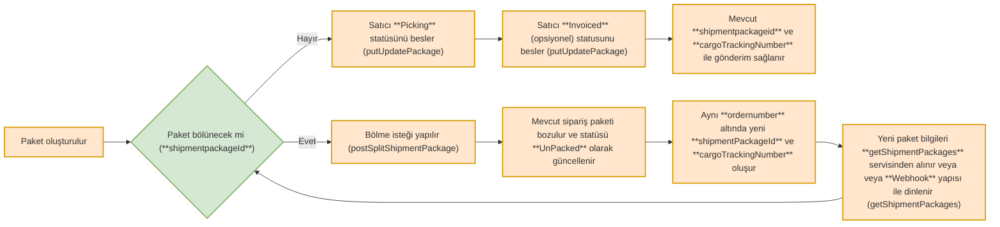
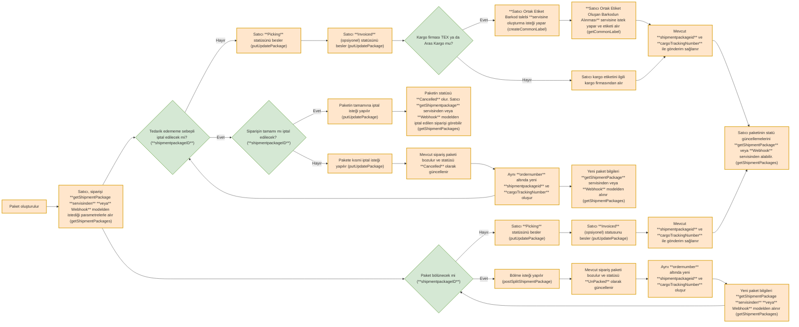
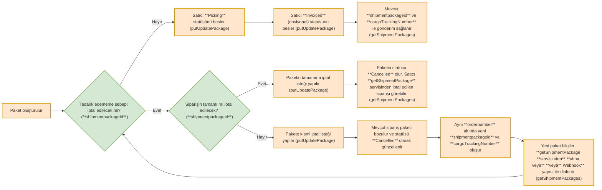

# Trendyol Marketplace API — Tam Referans

> Kaynak: https://developers.trendyol.com — indirilme: 2026-08-31

---

# Integration Documentation Documentation

> Documentation for Integration Documentation

Append .md to any documentation page URL to get its markdown version.

## Guides
- [Pazaryeri İş Modelleri](https://developers.trendyol.com/docs/pazaryeri-i̇ş-modelleri-1.md)
- [Entegrasyon Servislerine Genel Bakış](https://developers.trendyol.com/docs/getting-started.md): Trendyol Marketplace API ve Webhook entegrasyonları hakkında genel bilgiler ve örnek Postman koleksiyonları.
- [1. Servis Limitleri](https://developers.trendyol.com/docs/1-servis-limitleri.md): Servis limitleri ve entegrasyon servisleri hakkında detaylı bilgi.
- [2. Authorization](https://developers.trendyol.com/docs/2-authorization.md)
- [3. Canlı-Test Ortam Bilgileri](https://developers.trendyol.com/docs/3-canlı-test-ortam-bilgileri.md): Bilgiler ve yönergeler: Trendyol canlı ve test ortamları için IP yetkilendirmesi ve erişim detayları.
- [4. Sıkça Sorulan Sorular](https://developers.trendyol.com/docs/5-sıkça-sorulan-sorular.md)
- [5. Nasıl Bildirim Oluşturabilirim](https://developers.trendyol.com/docs/6-nasıl-bildirim-oluşturabilirim.md)
- [Hata Kodları](https://developers.trendyol.com/docs/hata-kodları.md): **Marketplace entegrasyonundaki hata kodlarına aşağıdan ulaşabilirsiniz**
- [Ürün V1- API Endpoint](https://developers.trendyol.com/docs/ürün-api-endpoint.md): Ürün Servisleri ile ilgili kullanmanız gereken API listesi
- [Trendyol Kargo Şirketleri Listesi (getProviders)](https://developers.trendyol.com/docs/trendyol-kargo-şirketleri-listesi-getproviders.md)
- [Trendyol Marka Listesi (getBrands)](https://developers.trendyol.com/docs/trendyol-marka-listesi-getbrands.md): Trendyol marka bilgilerini almak için kullanılan API detayları.
- [Trendyol Kategori Listesi (getCategoryTree)](https://developers.trendyol.com/docs/trendyol-kategori-listesi-getcategorytree.md): Trendyol kategori bilgileri ve getCategoryTree servisi hakkında detaylı bilgi.
- [Trendyol Kategori - Özellik Listesi V1 (getCategoryAttributes)](https://developers.trendyol.com/docs/trendyol-kategori-özellik-listesi-getcategoryattributes.md): Trendyol kategori özelliklerini almak için gerekli API bilgileri ve örnekler.
- [Ürün Aktarma V1 (createProducts)](https://developers.trendyol.com/docs/ürün-aktarma-v2createproducts.md): Trendyol sistemine ürün aktarımı ve varyantlama işlemleri hakkında detaylı bilgi.
- [Ürün Bilgisi Güncelleme V1 (updateProduct)](https://developers.trendyol.com/docs/ürün-bilgisi-güncelleme-updateproduct.md): Trendyol mağazanızda ürün bilgilerini güncelleme servisi hakkında detaylı bilgi.
- [Stok ve Fiyat Güncelleme (updatePriceAndInventory)](https://developers.trendyol.com/docs/stok-ve-fiyat-güncelleme-updatepriceandinventory.md): Trendyol ürünlerinin fiyat ve stok bilgilerini güncelleme kılavuzu. Maksimum 1000 SKU güncellenebilir.
- [Ürün Silme](https://developers.trendyol.com/docs/ürün-silme.md): Trendyol sisteminden ürün silme işlemi hakkında detaylı bilgi ve örnekler.
- [Toplu İşlem Kontrolü (getBatchRequestResult)](https://developers.trendyol.com/docs/toplu-i̇şlem-kontrolü-getbatchrequestresult.md)
- [Ürün Filtreleme V1 (filterProducts)](https://developers.trendyol.com/docs/ürün-filtreleme-filterproducts.md)
- [Ürün Arşivleme (archiveProducts)](https://developers.trendyol.com/docs/ürün-arşivleme.md)
- [Ürün Buybox Kontrol Servisi](https://developers.trendyol.com/docs/ürün-buybox-kontrol-servisi.md)
- [Ürün Kilit Kaldırma Servisi](https://developers.trendyol.com/docs/ürün-kilit-kaldırma-servisi.md)
- [Sipariş Süreci Akışı](https://developers.trendyol.com/docs/sipariş-süreci-akışı.md)
- [Test Siparişi Oluşturma](https://developers.trendyol.com/docs/test-siparişi-oluşturma.md)
- [Sipariş Paketlerini Çekme (getShipmentPackages)](https://developers.trendyol.com/docs/sipariş-paketlerini-çekme-getshipmentpackages.md)
- [Sipariş Paketlerini Akış ile Çekme (getShipmentPackagesStream)](https://developers.trendyol.com/docs/sipariş-paketlerini-akış-ile-çekme.md)
- [Paket Statü Bildirimi (updatePackage)](https://developers.trendyol.com/docs/paket-statü-bildirimi-updatepackage.md)
- [Tedarik Edememe Bildirimi (updatePackage)](https://developers.trendyol.com/docs/tedarik-edememe-bildirimi-updatepackage.md)
- [Sipariş Paketlerini Bölme (splitShipmentPackage)](https://developers.trendyol.com/docs/sipariş-paketlerini-bölme-splitshipmentpackage.md)
- [Desi ve Koli Bilgisi Bildirimi (updateBoxInfo)](https://developers.trendyol.com/docs/desi-ve-koli-bilgisi-bildirimi-updateboxinfo.md)
- [Alternatif Teslimat İle Gönderim](https://developers.trendyol.com/docs/alternatif-teslimat-i̇le-gönderim.md)
- [Yetkili Servis İle Gönderim](https://developers.trendyol.com/docs/yetkili-servis-i̇le-gönderim.md)
- [Paket Kargo Firması Değiştirme(changeCargoProvider)](https://developers.trendyol.com/docs/paket-kargo-firması-değiştirmechangecargoprovider.md)
- [Depo Bilgisi Güncelleme](https://developers.trendyol.com/docs/depo-bilgisi-güncelleme.md)
- [Test Siparişlerinde Statü Güncellemeleri](https://developers.trendyol.com/docs/test-siparişlerinde-statü-güncellemeleri.md)
- [Adres Bilgileri](https://developers.trendyol.com/docs/adres-bilgileri.md)
- [İşçilik Bedeli Tutarı Gönderme](https://developers.trendyol.com/docs/i̇şçilik-bedeli-tutarı-gönderme.md)
- [Kargo Firmaları](https://developers.trendyol.com/docs/kargo-firmaları.md)
- [Sipariş Paketlerini Çekme Servisindeki İndirim Gösterimleri](https://developers.trendyol.com/docs/sipariş-paketlerini-çekme-servisindeki-i̇ndirim-gösterimleri.md)
- [Webhook Model](https://developers.trendyol.com/docs/webhook-model.md)
- [Webhook Yaratma](https://developers.trendyol.com/docs/webhook-yaratma.md)
- [Webhook Listeleme](https://developers.trendyol.com/docs/webhook-listeleme.md)
- [Webhook Güncelleme](https://developers.trendyol.com/docs/webhook-güncelleme.md)
- [Webhook Silme](https://developers.trendyol.com/docs/webhook-silme.md)
- [Webhook Aktife/Pasife Alma](https://developers.trendyol.com/docs/webhook-aktifpasif-alma.md)
- [Ortak Etiket Barkod Talebi (createCommonLabel)](https://developers.trendyol.com/docs/ortak-etiket-barkod-talebi-createcommonlabel.md)
- [Ortak Etiket Oluşan Barkodun Alınması (getCommonLabel)](https://developers.trendyol.com/docs/ortak-etiket-oluşan-barkodun-alınması-getcommonlabel.md)
- [AB Ürün Etiketi ile Birlikte Ortak Etiket Barkodun Alınması](https://developers.trendyol.com/docs/ab-ürün-etiketi-ile-birlikte-ortak-etiket-barkodun-alınması.md)
- [Tazmin Entegrasyonu](https://developers.trendyol.com/docs/tazmin-entegrasyonu.md)
- [İade Süreci Akışı](https://developers.trendyol.com/docs/i̇ade-süreci-akışı.md)
- [İadesi Oluşturulan Siparişleri Çekme (getClaims)](https://developers.trendyol.com/docs/i̇adesi-oluşturulan-siparişleri-çekme-getclaims.md)
- [İade Sebepleri](https://developers.trendyol.com/docs/i̇ade-sebepleri.md)
- [İade Siparişleri Onaylama (approveClaimLineItems)](https://developers.trendyol.com/docs/i̇ade-siparişleri-onaylama-approveclaimlineitems.md)
- [İade Red Sebeplerini Çekme (getClaimsIssueReasons)](https://developers.trendyol.com/docs/i̇ade-red-sebeplerini-çekme-getclaimsissuereasons.md)
- [İade Siparişlerinde Ret Talebi Oluşturma (createClaimIssue)](https://developers.trendyol.com/docs/i̇ade-siparişlerinde-ret-talebi-oluşturma-createclaimissue.md)
- [İade Audit Bilgilerini Çekme](https://developers.trendyol.com/docs/i̇ade-audit-bilgilerini-çekme.md)
- [İade Talebi Oluşturma (createClaim)](https://developers.trendyol.com/docs/i̇ade-talebi-oluşturma-createclaim.md)
- [Müşteri Sorularını Çekme](https://developers.trendyol.com/docs/müşteri-sorularını-çekme.md)
- [Müşteri Sorularını Cevaplama](https://developers.trendyol.com/docs/müşteri-sorularını-cevaplama.md)
- [Stage Ortamda Müşteri Sorusu Oluşturma](https://developers.trendyol.com/docs/stage-ortamda-müşteri-sorusu-oluşturma.md): Stage ortamdaki testlerinizi ilerletebilmek için aşağıdaki servis ile ürün sorusu oluşturabilirsiniz.
- [İade ve Sevkiyat Adres Bilgileri (getSuppliersAddresses)](https://developers.trendyol.com/docs/i̇ade-ve-sevkiyat-adres-bilgileri-getsuppliersaddresses.md): İade ve sevkiyat adres bilgilerini almak için kullanılan getSuppliersAddresses servisi hakkında bilgi.
- [Fatura Linki Gönderme (sendInvoiceLink)](https://developers.trendyol.com/docs/fatura-linki-gönderme-sendinvoicelink.md)
- [Fatura Linki Silme](https://developers.trendyol.com/docs/fatura-linki-silme.md)
- [Fatura Dosyası Gönderme](https://developers.trendyol.com/docs/fatura-dosyası-gönderme.md)
- [Ürün V2- API Servisleri](https://developers.trendyol.com/docs/ürün-v2-api-endpoint.md)
- [Ürün Yaratma Akışı](https://developers.trendyol.com/docs/ürün-yaratma-akışı.md)
- [Trendyol Kargo Şirketleri Listesi (getProviders)](https://developers.trendyol.com/docs/trendyol-kargo-şirketleri-listesi-getproviders-1.md)
- [Trendyol Marka Listesi (getBrands)](https://developers.trendyol.com/docs/trendyol-marka-listesi-getbrands-1.md)
- [Trendyol Kategori Listesi (getCategoryTree)](https://developers.trendyol.com/docs/trendyol-kategori-listesi-getcategorytree-1.md): Trendyol kategori bilgileri ve getCategoryTree servisi hakkında detaylı bilgi.
- [Kategori Özellik Listesi v2](https://developers.trendyol.com/docs/kategori-özellik-listesi-v2.md)
- [Kategori Özellik Değerleri Listesi v2](https://developers.trendyol.com/docs/kategori-özellik-değerleri-listesi-v2.md)
- [Ürün Yaratma v2](https://developers.trendyol.com/docs/ürün-yaratma-v2.md)
- [Ürün Güncelleme - Onaysız Ürün v2](https://developers.trendyol.com/docs/ürün-güncelleme-onaysız-ürün-v2.md)
- [Ürün Güncelleme - Onaylı Ürün v2](https://developers.trendyol.com/docs/ürün-güncelleme-onaylı-ürün-v2.md): Trendyol mağazanızda bulunan onaylı ürünlerin content, varyant ve teslimat bilgilerini güncelleme yöntemleri.
- [Stok ve Fiyat Güncelleme (updatePriceAndInventory)](https://developers.trendyol.com/docs/stok-ve-fiyat-güncelleme-updatepriceandinventory-1.md): Trendyol ürünlerinin fiyat ve stok bilgilerini güncelleme kılavuzu. Maksimum 1000 SKU güncellenebilir.
- [Toplu İşlem Kontrolü (getBatchRequestResult)](https://developers.trendyol.com/docs/toplu-i̇şlem-kontrolü-getbatchrequestresult-1.md)
- [Ürün Silme](https://developers.trendyol.com/docs/ürün-silme-1.md): Trendyol sisteminden ürün silme işlemi hakkında detaylı bilgi ve örnekler.
- [Ürün Filtreleme - Temel Bilgiler v2](https://developers.trendyol.com/docs/ürün-filtreleme-temel-bilgiler-v2.md)
- [Ürün Filtreleme - Onaysız Ürün v2](https://developers.trendyol.com/docs/ürün-filtreleme-onaysız-ürün-v2.md)
- [Ürün Filtreleme - Onaylı Ürün v2](https://developers.trendyol.com/docs/ürün-filtreleme-onaylı-ürün-v2.md)
- [Ürün Filtreleme – Onaylı Ürün V2 Stok ve Fiyat](https://developers.trendyol.com/docs/ürün-filtreleme-onaylı-ürün-v2-stok-ve-fiyat.md)
- [Ürün Arşivleme (archiveProducts)](https://developers.trendyol.com/docs/ürün-arşivleme-archiveproducts.md)
- [Ürün Buybox Kontrol Servisi](https://developers.trendyol.com/docs/ürün-buybox-kontrol-servisi-1.md)
- [Ürün Kilit Kaldırma Servisi](https://developers.trendyol.com/docs/ürün-kilit-kaldırma-servisi-1.md)
- [Video Oluşturma / Listeleme Servisi](https://developers.trendyol.com/docs/seller-integration-video-api.md)
- [Menşei Değerleri Listesi](https://developers.trendyol.com/docs/ürün-menşei-değerleri.md)
- [Marka Yaratma Servisi](https://developers.trendyol.com/docs/marka-yaratma-servisi.md)
- [Ürün Bilgileri Güncelleme Sonucu Kontrol Servisi](https://developers.trendyol.com/docs/ürün-bilgileri-güncelleme-sonucu-kontrol-servisi.md)
- [Kargo Firması Filtreleme Servisi](https://developers.trendyol.com/docs/kargo-firması-filtreleme-servisi.md)
- [Garanti Belgesi Gönderimi](https://developers.trendyol.com/docs/garanti-belgesi-gönderimi.md)
- [Test Ortam IP Whitelist Yönetimi](https://developers.trendyol.com/docs/test-ortam-ip-whitelist-yönetimi.md)
- [Cari Hesap Ekstresi Entegrasyonu](https://developers.trendyol.com/docs/cari-hesap-ekstresi-entegrasyonu.md)
- [Kargo Faturası Detayları](https://developers.trendyol.com/docs/kargo-faturası-detayları.md)
- [8. Trendyol Akademi](https://developers.trendyol.com/docs/10-trendyol-akademi.md)
- [9. Trendyol E-Faturam Entegrasyonu](https://developers.trendyol.com/docs/11-trendyol-e-faturam-entegrasyonu.md)
- [10. Taleplerim](https://developers.trendyol.com/docs/support-request.md)
- [Api HealthCheck](https://developers.trendyol.com/docs/api-status.md): Sistemlerimizin anlık çalışma durumunu takip edebilir ve servislerimizin erişilebilirliğini buradan kontrol edebilirsiniz.

## API Reference
- [Sipariş Paketlerini Çekme - getShipmentPackages](https://developers.trendyol.com/reference/getshipmentpackages.md): Müşteriler tarafından verilen her sipariş hakkındaki sipariş paketlerini çekebilirsiniz.
- [Sipariş Paketlerini Akış ile Çekme - getShipmentPackagesStream](https://developers.trendyol.com/reference/getshipmentpackagesstream.md): Müşteriler tarafından verilen sipariş paketlerini cursor tabanlı sayfalama kullanarak çekebilirsiniz. Bu yöntem, sayfa numarası tabanlı sayfalamaya kıyasla daha verimli ve güvenilir bir sipariş paketi çekme deneyimi sunar. Veriler sabit bir sıralama ile döner: lastModifiedDate yeniden eskiye (DESC).
- [Paket Statü Bildirimi - updatePackage](https://developers.trendyol.com/reference/updatepackagestatus.md): Siparişlerin paketlerini Picking veya Invoiced statüsüne güncelleyebilirsiniz.
- [Tedarik Edememe Bildirimi - updatePackage](https://developers.trendyol.com/reference/cancelorderpackageitem.md): Sipariş Paketindeki bir veya daha fazla ürünü iptal etmek için bu metodu kullanabilirsiniz.
- [Desi ve Koli Bilgisi Bildirimi - updateBoxInfo](https://developers.trendyol.com/reference/updateboxinfo.md): Bu servis ile UPS Kargo ve CEVA Lojistik firmalarının sipariş paketleriniz için desi ve koli miktarını besleyebilirsiniz.
- [Yetkili Servis ile Gönderim - deliveredByService](https://developers.trendyol.com/reference/deliveredbyservice.md): Ürünlerini yetkili servise gönderen satıcılari mızın bu servisi çağırması gerekmektedir.
- [Paket Kargo Firmasi Değiştirme - changeCargoProvider](https://developers.trendyol.com/reference/changecargoprovider.md): Bu servis paketlerin kargo firmasıni değiştirmek için kullanılır.
- [Depo Bilgisi Güncelleme - updateWarehouse](https://developers.trendyol.com/reference/updatewarehouse.md): Bu servis ile Picking Sipariş Paketlerini Çekme servisinden dönen WarehouseId alanı güncellenecektir.
- [Ek Tedarik Süresi Tanımlama - agreedDeliveryDate](https://developers.trendyol.com/reference/extendagreeddeliverydate.md): Satıcılari miz sipariş paketleri için ek tedarik süreleri tanımlayabilir.
- [İşçilik Maliyeti Güncelleme - laborCosts](https://developers.trendyol.com/reference/updatelaborcosts.md): İşçilik maliyeti tutarını beslemek için bu servisi kullanabilirsiniz.
- [Sipariş Paketlerini Barkod Bazlı Bölme - splitMultiPackageByQuantity](https://developers.trendyol.com/reference/splitmultipackagesbyquantity.md): Bu metod ile sipariş paketindeki ürünleri miktar ve orderLineId değerleri ile bölebilirsiniz.
- [Sipariş Paketlerini Bölme - splitShipmentPackage](https://developers.trendyol.com/reference/splitshipmentpackage.md): Bu servisi kullandiktan sonra sipariş numarasına bağlı yeni paketler asenkron olarak oluşturulacaktir.
- [Sipariş Paketlerini Birden Fazla Barkod İle Bölme - splitShipmentPackageByQuantity](https://developers.trendyol.com/reference/splitshipmentpackagebyquantity.md): Bu servisi kullandiktan sonra sipariş numarasına bağlı yeni paketler asenkron olarak oluşturulacaktir.
- [Sipariş Paketlerini Birden Fazla Barkod İle Bölme - multiSplitShipmentPackage](https://developers.trendyol.com/reference/multisplitshipmentpackage.md): Bu servisi kullandiktan sonra sipariş numarasına bağlı yeni paketler asenkron olarak oluşturulacaktir.
- [Kargo Linki ile Gönderim - processAlternativeDelivery](https://developers.trendyol.com/reference/processalternativedelivery.md): Sipariş paketini gönderdikten sonra, sahip olduğunuz kargo takip linki veya telefon numarası ile besleyebilirsiniz. Bu isteği başarıyla gönderdikten sonra sipariş otomatik olarak Shipped statüsüne geçecektir.
- [Dijital Ürün Teslimati ile Alternatif Teslimat - processAlternativeDelivery](https://developers.trendyol.com/reference/processalternativedeliverydigital.md): Bu servisi çağırdığınızda, sağladığınız bilgiler müşterilere sms ve e-posta yoluyla otomatik olarak gönderilecektir.
- [Paket Numarasi ile Teslim - manualDeliverByPackageId](https://developers.trendyol.com/reference/manualdeliverbypackageid.md): Paket ID ile manuel teslimat bildirimi
- [Kargo Takip Numarasi ile Teslim - manualDeliverByTrackingNumber](https://developers.trendyol.com/reference/manualdeliverbytrackingnumber.md): Kargo takip numarası ile manuel teslimat bildirimi
- [Kargo Takip Numarasi ile İade - manualReturnByTrackingNumber](https://developers.trendyol.com/reference/manualreturnbytrackingnumber.md): Shipped statüsünde olan ve müşteriye teslim edilemeyen siparişlerin deponuza iade edilmesi durumunda bu servisi kullanabilirsiniz.
- [Paket Numarasi ile İade - manualReturnByPackageId](https://developers.trendyol.com/reference/manualreturnbypackageid.md): Shipped statüsünde olan ve müşteriye teslim edilemeyen siparişlerin deponuza iade edilmesi durumunda bu servisi kullanabilirsiniz.
- [Ülke Bilgisi](https://developers.trendyol.com/reference/getcountries.md): Aşağıdaki servisten ülke bilgisini alabilirsiniz.
- [GULF ve CEE Ülkeleri için Şehir Bilgisi](https://developers.trendyol.com/reference/getcitiesbycountry.md): GULF ve CEE bölgesi için şehir bilgisini aşağıdaki servisten alabilirsiniz.
- [GULF Ülkeleri için İlçe Bilgisi](https://developers.trendyol.com/reference/getdistrictsbycity.md): GULF ülkeleri için ilçe bilgisini aşağıdaki servisten alabilirsiniz.
- [Azerbaycan için Şehir Bilgisi](https://developers.trendyol.com/reference/getazerbaijancities.md): Azerbaycan için şehir bilgisini aşağıdaki servisten alabilirsiniz.
- [Azerbaycan için İlçe Bilgisi](https://developers.trendyol.com/reference/getazerbaijandistricts.md): Azerbaycan için ilçe bilgisini aşağıdaki servisten alabilirsiniz.
- [Türkiye için Şehir Bilgisi](https://developers.trendyol.com/reference/gettürkeycities.md): Türkiye için şehir bilgisini aşağıdaki servisten alabilirsiniz.
- [Türkiye için İlçe Bilgisi](https://developers.trendyol.com/reference/gettürkeydistricts.md): Türkiye için ilçe bilgisini aşağıdaki servisten alabilirsiniz.
- [Türkiye için Mahalle Bilgisi](https://developers.trendyol.com/reference/gettürkeyneighborhoods.md): Türkiye için mahalle bilgisini aşağıdaki servisten alabilirsiniz.
- [İadesi Oluşturulan Siparişleri Çekme - getClaims](https://developers.trendyol.com/reference/getclaims.md): Bu metod ile Trendyol sisteminden iade edilen siparişler hakkındaki bilgileri çekebilirsiniz.
- [İade Talebi Oluşturma - createClaim](https://developers.trendyol.com/reference/createclaim.md): İade kodu olmadan gelen sipariş paketleri için iade talebi paketleri oluşturmak için kullanabilirsiniz.
- [İade Siparişleri Onaylama - approveClaimLineItems](https://developers.trendyol.com/reference/approveclaimlineitems.md): Trendyol sisteminde deponuza iade edilen iade siparişlerini bu metod ile onaylayabilirsiniz.
- [İade Siparişlerde Ret Talebi Oluşturma - createClaimIssue](https://developers.trendyol.com/reference/createclaimissue.md): Trendyol sisteminde deponuzdaki iade siparişleri için ret talebi oluşturabilirsiniz. İadeye ait ekleri (pdf, jpeg vb.) "form-data (file)" olarak eklemeniz gerekmektedir.
- [İade Red Sebeplerini Çekme - getClaimIssueReasons](https://developers.trendyol.com/reference/getclaimissuereasons.md): createClaimIssue servisine gönderilecek claimIssueReasonId değerine bu servisi kullanarak ulaşabilirsiniz.
- [İade Audit Bilgilerini Çekme - getClaimItemAudits](https://developers.trendyol.com/reference/getclaimitemaudits.md): Bu servis ile iade siparişinin statü ilerlemesini, güncelleme tarihini, işlemi yapan kişiyi kontrol edebilirsiniz.
- [Test Siparişi Oluşturma](https://developers.trendyol.com/reference/createtestorder.md): Test siparişi oluşturma servisi STAGE ortamında talep edilen senaryolarda test siparişi oluşturulması için kullanılacaktır.
- [Test Siparişlerinde Statü Güncellemeleri](https://developers.trendyol.com/reference/updatetestorderstatus.md): Test senaryolarınızı gerçekleştirmek adına stage ortamda vermiş olduğunuz siparişler için statüleri güncelleyebilirsiniz.
- [İade Test Siparişlerini WaitingInAction Statüsüne Çekme](https://developers.trendyol.com/reference/updatetestclaimtowaitinginaction.md): Test senaryolarınızı gerçekleştirmek adına stage ortamda vermiş olduğunuz siparişler için yaratmış olduğunuz iade talepleri sonrasında iade statüsünü waitinginaction'a çekmek için kullanabilirsiniz.
- [Webhook Yaratma - createWebhook](https://developers.trendyol.com/reference/createwebhook.md): Bu servis ile sipariş paketleriniz için webhook yapısı kurabilirsiniz.
- [Webhook Listeleme - getWebhook](https://developers.trendyol.com/reference/getwebhooks.md): Bu servis ile daha önce yaratmış olduğunuz webhook methodlarını listeleyebilirsiniz.
- [Webhook Güncelleme - updateWebhook](https://developers.trendyol.com/reference/updatewebhook.md): Bu servis ile daha önce yaratmış olduğunuz webhook methodlarını güncelleyebilirsiniz.
- [Webhook Silme - deleteWebhook](https://developers.trendyol.com/reference/deletewebhook.md): Bu servis ile daha önce yaratmış olduğunuz webhook methodlarını silebilirsiniz.
- [Webhook Aktife Alma - activate](https://developers.trendyol.com/reference/activatewebhook.md): Bu servis ile pasif durumunda olan webhook methodlarını aktife alabilirsiniz.
- [Webhook Pasife Alma - deactivate](https://developers.trendyol.com/reference/deactivatewebhook.md): Bu servis aktif durumunda olan webhook methodlarını pasife alabilirsiniz.
- [Fatura Linki Gönderme - sendInvoiceLink](https://developers.trendyol.com/reference/sendinvoicelink.md): Tedarikçi tarafından kendi sisteminde yaratılmış e-Arşiv ya da e-Fatura bilgisinin LİNK detayını Trendyol sistemine transfer etmek için bu method kullanılacaktır.
- [Fatura Linki Silme - deleteInvoiceLink](https://developers.trendyol.com/reference/deleteinvoicelink.md): Daha önce hatalı beslenen faturalar bu servis üzerinden silinip, fatura linki gönderme servisi ile tekrar beslenebilmektedir.
- [Fatura Dosyası Gönderme - uploadInvoiceFile](https://developers.trendyol.com/reference/uploadinvoicefile.md): Satıcıların sipariş paketleri için fatura dosyalarını (PDF, JPEG, PNG) yüklemelerini sağlar.
- [İade, Sevkiyat ve Fatura Adres Bilgileri - getSuppliersAddresses](https://developers.trendyol.com/reference/getsuppliersaddresses.md): createProduct V2 servisine yapılacak isteklerde gönderilecek iade, sevkiyat ve fatura adres bilgileri  ile kargo firma bilgileri ve bu bilgilere ait ID değerleri bu servis kullanılarak alınacaktır.  **ÖNEMLİ:** "SATICI BAŞVURU SÜRECİM" tam olarak tamamlanmadı ise bu servisi kullanmamanız gerekir.
- [Ortak Etiket Barkod Talebi - createCommonLabel](https://developers.trendyol.com/reference/createcommonlabel.md): Ortak barkod süreci TEX, Aras Kargo için Trendyol öder gönderilerde kullanılabilmektedir. Bu servis ile ortak etiket sürecindeki siparişler için ilgili kargo numarasına ait barkod talebi yapabilirsiniz. Barkod oluştuktan sonra sizlere ZPL formatında Ortak Etiket Oluşan Barkodun Alınması Servisinden dönecektir.  **Önemli Notlar:** - Barkod talebini ilgili sipariş paketine PICKING veya INVOICED statüsü besledikten sonra yapmanız tavsiye edilmektedir. - Format olarak şu an için sadece ZPL formatı bulunmaktadır.
- [Ortak Etiket Oluşan Barkodun Alınması - getCommonLabel](https://developers.trendyol.com/reference/getcommonlabel.md): Ortak barkod süreci TEX, Aras Kargo için Trendyol öder gönderilerde kullanılabilmektedir. Bu servis ile createCommonLabel servisinden talep edilen barkodu alabilirsiniz.  **Önemli Notlar:** - Tarafınıza çoklu koliler için birden fazla etiket dönecektir. Tek koli olması durumunda tek ZPL dönecektir.
- [Trendyol Express siparişlerindeki tazmin istekleri çekme - getCompensationTickets](https://developers.trendyol.com/reference/getcompensationtickets.md): Trendyol Express siparişlerinizdeki tazmin işlemlerinin durumlarını çekebilirsiniz.
- [Müşteri Sorularını Filtreleme](https://developers.trendyol.com/reference/getquestionfilter.md): Satıcıya gelen soruları çeşitli kriterlere göre filtreleyerek listeler.  Pagination yapısı mevcuttur.
- [Soru Detayını Getirme](https://developers.trendyol.com/reference/getquestion.md): ID bilgisi verilen tek bir sorunun tüm detaylarını getirir.
- [Soruyu Cevaplama](https://developers.trendyol.com/reference/answerquestion.md): Müşteriden gelen bir soruya cevap verilir. Cevap metni değerlendirildikten sonra yayınlanır.
- [Settlements Servisi](https://developers.trendyol.com/reference/getsettlements.md): Satış, iade, indirim, kupon, provizyon işlemlerinin detaylarına ulaşabilirsiniz. Transaction Type, SellerRevenuePositive ve CommissionNegative birlikte değerlendirilmelidir. Transaction Type, SellerRevenueNegative ve CommissionPositive birlikte değerlendirilmelidir. Transaction Type, SellerRevenuePositiveCancel ve CommissionNegativeCancel birlikte değerlendirilmelidir. Transaction Type, SellerRevenueNegativeCancel ve CommissionPositiveCancel birlikte değerlendirilmelidir.
- [Other Financials Servisi](https://developers.trendyol.com/reference/getotherfinancials.md): Tedarikçi finansmanı, virman, ödemeler (hakediş), faturalar (Trendyoldan tedarikçiye), tedarikçi faturaları (Tedarikçiden Trendyola), gelen havale, komisyon mutabakat faturaları işlemlerinin detaylarına ulaşabilirsiniz.
- [Payment Order List Servisi](https://developers.trendyol.com/reference/getpaymentorder.md): Satıcının PAID ödeme emirlerini sayfalı listeler (varsayılan/maksimum size=10). Cevap bir ödeme emri listesidir. id alanı paymentOrderId, tarih alanı payoutDate'tir.
- [Kargo Faturası Detayları Servisi](https://developers.trendyol.com/reference/getcargoinvoiceitems.md): Trendyol tarafından satıcılara kesilen kargo faturalarının detaylarına ulaşabilirsiniz.  Kargo faturasının seri numarasını bulmak için Cari Hesap Ekstresi Entegrasyonu üzerinden transactionType='DeductionInvoices' responsundan dönen data içerisindeki alanlardan transactionType değeri "Kargo Faturası" yada "Kargo Fatura" olan kayıtların "Id" değerini kullanınız.
- [Ürün Oluşturma V2](https://developers.trendyol.com/reference/autoft-create-products-v2.md): Trendyol Pazaryeri'nde onaylanmış ürünleri ihracata açmak için kullanılır.  Satıcı Paneli'nde oluşturulmayan ürünler, İhracat Merkezi'nde oluşturulamaz.  > Barkod bazında günde **1** kez fiyat güncelleme işlemi yapılmaktadır.
- [Ürün Listeleme](https://developers.trendyol.com/reference/autoft-list-products.md): Trendyol'da ihracata açılmış ürünleri listelemek için kullanılır.  > **Not:** Döviz türü (currency) bilgisi ihracat merkezine başvuru sırasında satıcı tarafından seçilmektedir.
- [Menşei Listesi](https://developers.trendyol.com/reference/autoft-get-origins.md): [Ürün Oluşturma V2](../reference/autoft-create-products-v2) adımında, request modelde istenen origin değerleri bu endpointten liste olarak alınır.
- [Materyal Bileşenleri](https://developers.trendyol.com/reference/autoft-get-compositions.md): [Ürün Oluşturma V2](../reference/autoft-create-products-v2) adımında, request modelde istenen composition değerleri bu endpointten liste olarak alınır.
- [Yıkama Talimatları](https://developers.trendyol.com/reference/autoft-get-care-instructions.md): [Ürün Oluşturma V2](../reference/autoft-create-products-v2) adımında, request modelde istenen yıkama talimatları değerleri bu endpointten liste olarak alınır.
- [Kategoriye Göre Zorunlu Özellik Listesi](https://developers.trendyol.com/reference/autoft-get-category-attributes.md): [Ürün Oluşturma V2](../reference/autoft-create-products-v2) adımında, request modelde istenen zorunlu özellik listesi bu endpointten alınır.
- [Barkod ile Kategori Bilgisi Listeleme](https://developers.trendyol.com/reference/autoft-get-categories-by-barcodes.md): [Ürün Oluşturma V2](../reference/autoft-create-products-v2) adımında, zorunlu özellik listesini elde etmek için gerekli olan  categoryId bilgisi barkod bilgisi ile bu endpointten listelenebilir.
- [Ürün Stok Bilgisi Güncelleme](https://developers.trendyol.com/reference/autoft-update-stocks.md): İhracata açık olan ürünlerin stok bilgilerinin güncellenmesi ve geri beslenmesi için kullanılır.  Ürünlerin öncelikle Ürün Oluşturma adımında oluşturulduğundan emin olunmalıdır.  Eğer talep edilirse stok yönetimi Trendyol Satıcı Panel ile ortak yapılabilir.  Ortak stok yönetimi yapan satıcılar bu endpointi kullanamazlar.  > **Not:** İşlem sonucunda dönen batch ID ile sonucu mutlaka kontrol etmeniz tavsiye edilir.
- [Fiyat Güncelleme](https://developers.trendyol.com/reference/autoft-update-prices.md): İhracata açık olan ürünlerin fiyat bilgilerinin güncellenmesi ve geri beslenmesi için kullanılır.  Burada belirlenen fiyat KDV dahil Trendyol'a satış fiyatı olmalıdır.  > Barkod bazında günde **1** kez fiyat güncelleme işlemi yapılmaktadır.
- [Paket Listeleme V2](https://developers.trendyol.com/reference/autoft-list-packages-v2.md): Gün içerisinde oluşan yeni paketlerinizi buradan takip edebilirsiniz. Sipariş almanız durumunda her gün 08:00 - 08:15 saatleri arasında yeni bir paketiniz oluşacaktır. Paketleri günlük olarak takip etmeniz ve gün içerisinde Trendyol'a göndermeniz gerekmektedir.Paket listeme adımında yeni bir paketiniz olduğunu sorguladığınızda, paket içerisinde tedarik beklenen ürün bilgisine erişmek için [Paket Detayı V2](../reference/autoft-get-package-items-v2) servisi kullanılmalıdır.
- [Paket Detayı V2](https://developers.trendyol.com/reference/autoft-get-package-items-v2.md): İlgili paket içerisinde bulunan ürünlerin detayları buradan alınmalıdır.  Henüz oluşmayan ve bir sonraki gün oluşturulacak olan paketleriniz için bu servisi kullanabilir (status = new)  ve tedarik beklenecek olan adetleri önceden görerek stoklarınızı yönetebilirsiniz.  **⚠️ ÖNEMLİ:** - **new** durumunda bulunan ürünler iptal edildiğinde, newQuantity değeri azalır ve cancelledQuantity değişmez. - **pending** durumunda bulunan ürünler iptal edildiğinde, pendingQuantity değeri azalır ve cancelledQuantity artar.
- [Paket Listeleme V3](https://developers.trendyol.com/reference/autoft-list-packages-v3.md): Paket Listeleme ve Paket Detay için iki ayrı API kullanmak istemeyen iş ortaklarımız tek endpoint olarak kullanabilir.  **⚠️ ÖNEMLİ:** - **new** durumunda bulunan ürünler iptal edildiğinde, newQuantity değeri azalır ve cancelledQuantity değişmez. - **pending** durumunda bulunan ürünler iptal edildiğinde, pendingQuantity değeri azalır ve cancelledQuantity artar.
- [Batch ID ile İşlem Sonucu Sorgulama](https://developers.trendyol.com/reference/autoft-check-batch-status.md): Response olarak batchId aldığınız işlemlerin sonuçlarını bu endpoint üzerinden takip edebilirsiniz.  > **Not:** İşlemler sonucunda dönen batchId **24 saat** sonra sistemden silinecektir.
- [Marka Listesi (getBrands)](https://developers.trendyol.com/reference/getbrands.md): createProduct servisine yapılacak isteklerde gönderilecek brandId bilgisi bu servis kullanılarak alınır. Bir sayfada minimum 1000 adet brand bilgisi alınabilmektedir.
- [Marka Arama (getBrandsByName)](https://developers.trendyol.com/reference/getbrandsbyname.md): İsme göre marka arama. BÜYÜK/küçük harf ayrımına dikkat edilmelidir.
- [Marka Yaratma Servisi (createBrand)](https://developers.trendyol.com/reference/createbrand.md): Trendyol Marka Listesi'nde bulunmayan markaların yaratılması için kullanılır. İstek JSON body ile değil form-data ile gönderilir. Marka ismi "name" alanı ile text olarak, marka görselleri "images" alanı ile file olarak iletilmelidir. Minimum 1, maksimum 3 görsel gönderilebilir.
- [Kategori Listesi (getCategoryTree)](https://developers.trendyol.com/reference/getcategorytree.md): createProduct servisine yapılacak isteklerde gönderilecek categoryId bilgisi bu servis kullanılarak alınır. En alt seviyedeki kategori ID bilgisi kullanılmalıdır. Kategori ağacı belirli aralıklarla güncellenmektedir, haftalık olarak güncel listeyi almanız önerilir.
- [Kategori Özellik Listesi (getCategoryAttributes)](https://developers.trendyol.com/reference/getcategoryattributes.md): Ürün Yaratma servisine yapılacak isteklerde gönderilecek attributes bilgileri bu servis kullanılarak alınır. allowMultipleAttributeValues alanı ile çoklu değer desteği kontrol edilir. En alt seviyedeki kategori ID kullanılmalıdır.
- [Kategori Özellik Değerleri Listesi (getCategoryAttributeValues)](https://developers.trendyol.com/reference/getcategoryattributevalues.md): Ürün Yaratma servisine yapılacak isteklerde gönderilecek attributes values bilgileri bu servis kullanılarak alınır.
- [Ürün Yaratma V2 (createProducts)](https://developers.trendyol.com/reference/createproducts.md): Ürünleri Trendyol sistemine yükler. Attribute yapısında attributeValueIds (array) veya attributeValue (string) kullanılır. Her istek içerisinde gönderilebilecek maksimum item sayısı 1.000'dir. listPrice, salePrice'tan küçük olamaz. İşlem asenkrondur ve dönen batchRequestId ile sonuç kontrol edilmelidir.
- [Ürün Filtreleme - Temel Bilgiler (getProductBase)](https://developers.trendyol.com/reference/getproductbase.md): Trendyol mağazanızdaki ürününüzün temel durum bilgisini döner.
- [Ürün Filtreleme - Onaysız Ürün (filterUnapprovedProducts)](https://developers.trendyol.com/reference/filterunapprovedproducts.md): Trendyol mağazanızdaki onaysız (draft) ürünleri listeler. Onay süreci devam eden ve reddedilen ürünleri içerir. nextPageToken 10.000'den fazla onaysız barcode olması halinde kullanılır. page x size maksimum 10.000 değerini alabilir.
- [Ürün Filtreleme - Onaylı Ürün (filterApprovedProducts)](https://developers.trendyol.com/reference/filterapprovedproducts.md): Trendyol mağazanızdaki onaylı ürünleri listeler. Content bazlı yapıda döner, her content altında variants dizisi bulunur. nextPageToken 10.000'den fazla content olması halinde kullanılır. page x size maksimum 10.000 değerini alabilir.
- [Ürün Filtreleme - Onaylı Ürün Stok ve Fiyat (filterApprovedProductsInventoryAndPrice)](https://developers.trendyol.com/reference/filterapprovedproductsinventoryandprice.md): Onaylı ürünlerin yalnızca stok ve fiyat bilgilerini döner. nextPageToken 10.000'den fazla onaylı content olması halinde kullanılır. page x size maksimum 10.000 değerini alabilir. stockLastModifiedDate alanı yalnızca ürüne stok güncellemesi yapılmışsa değer döner, aksi halde null döner.
- [Ürün Silme (deleteProducts)](https://developers.trendyol.com/reference/deleteproducts.md): Ürünleri Trendyol sisteminden kaldırır. Tekli ve çoklu ürün silme işlemini destekler. Onay bekleyen ürünler ve arşivde bir günden fazla bulunmuş, Trendyol tarafından satışa durdurulmamış onaylı ürünler silinebilir.
- [Ürün Arşivleme (archiveProducts)](https://developers.trendyol.com/reference/archiveproducts.md): Ürünleri Trendyol sisteminde arşivler veya arşivden çıkarır. Tekli ve çoklu ürün arşivleme işlemlerini destekler. Her istek içerisinde gönderilebilecek maksimum item sayısı 1.000'dir.
- [Ürün Buybox Kontrol Servisi (getBuyboxInformation)](https://developers.trendyol.com/reference/getbuyboxinformation.md): Ürünlerin buybox bilgisini döner: buybox sırası, buybox fiyatı ve birden fazla satıcı olup olmadığı. Maksimum 10 barcode gönderilebilir. Servis limiti 1000 req/min.
- [Ürün Kilit Kaldırma Servisi (unlockProducts)](https://developers.trendyol.com/reference/unlockproducts.md): Kilitli ürünlerin kilidini kaldırır. Düşük/yüksek fiyatlandırma, kritik fiyat hatası veya tedarik edememe sebepleriyle satışı durdurulan ürünlerin kilitleri bu servis ile açılabilir.
- [Ürün Güncelleme - Onaysız Ürün (updateUnapprovedProducts)](https://developers.trendyol.com/reference/updateunapprovedproducts.md): Trendyol mağazanızdaki onaysız ürünleri günceller. Her istek içerisinde gönderilebilecek maksimum item sayısı 1.000'dir.
- [Ürün Güncelleme - Onaylı Content (updateContentBulk)](https://developers.trendyol.com/reference/updatecontentbulk.md): Onaylı ürünlerin content bilgilerini günceller. Attribute değerleri hariç partial update desteklenir. Attribute'lardan herhangi biri güncellenecekse tüm attribute ve değerleri gönderilmelidir. Her istek içerisinde maksimum 1.000 item.
- [Ürün Güncelleme - Onaylı Varyant (updateVariantBulk)](https://developers.trendyol.com/reference/updatevariantbulk.md): Onaylı ürünlerin varyant bilgilerini günceller. barcode alanı hariç tüm alanlar güncellenebilir. Partial update desteklenmez. Maksimum 1.000 item.
- [Ürün Güncelleme - Teslimat Bilgisi (updateDeliveryInfoBulk)](https://developers.trendyol.com/reference/updatedeliveryinfobulk.md): Onaylı ürünlerin teslimat bilgilerini günceller. barcode alanı hariç tüm alanlar güncellenebilir. Maksimum 1.000 item.
- [Ürün Bilgileri Güncelleme Sonucu Kontrol Servisi (getUpdateAudits)](https://developers.trendyol.com/reference/getupdateaudits.md): Ürün bilgilerini güncelleme servislerinden yapılan ve başarılı sonuçlanan isteklerin, ürün kontrol adımı sonucunu döner. Güncelleme reddedilmişse rejectReasons alanı ile red sebepleri iletilir. Dönen updates alanının içeriği güncelleme tipine (type) göre değişir.
- [Stok ve Fiyat Güncelleme (updatePriceAndInventory)](https://developers.trendyol.com/reference/updatepriceandinventory.md): Trendyol'a aktarılan ve onaylanan ürünlerin fiyat ve stok bilgilerini günceller. Aynı isteği 15 dakika boyunca tekrarlı olarak atamazsınız. Maksimum 1000 item, ürün başına maksimum 20.000 stok.
- [Toplu İşlem Kontrolü (getBatchRequestResult)](https://developers.trendyol.com/reference/getbatchrequestresult.md): batchRequestId ile alınan işlemlerin sonuç kontrolü yapılır. status alanı kontrol edilerek toplu işlemin tamamlanıp tamamlanmadığı kontrol edilir. Batch request sonuçları 4 saat sonrasına kadar görüntülenebilir.
- [Kargo Firması Filtreleme Servisi (getCargoProviders)](https://developers.trendyol.com/reference/getcargoproviders.md): Kullanılabilecek kargo sağlayıcılarını listeler. Dönen code değerleri ürün yaratma ve güncelleme isteklerindeki cargoProviders alanında gönderilebilir. Liste storefront bilgisine göre değişir; storefrontcode header'ı gönderilmezse varsayılan olarak TR kullanılır.

## Changelog
- [Changelog](https://developers.trendyol.com/changelog/changelog.md)

---

# SAYFA DETAYLARI

<!-- KAYNAK: https://developers.trendyol.com/docs/10-trendyol-akademi.md -->

---
updatedAt: 2026-06-24T07:28:12.000Z
---

Fetch the complete documentation index at: https://developers.trendyol.com/llms.txt. Use this file to discover all available pages before exploring further. Append .md to any documentation page URL to get its markdown version.

# 8. Trendyol Akademi

**Trendyol Akademi'ye [buradan](https://akademi.trendyol.com/) ulaşabilirsiniz.**
---

<!-- KAYNAK: https://developers.trendyol.com/docs/11-trendyol-e-faturam-entegrasyonu.md -->

---
updatedAt: 2026-06-24T07:28:20.000Z
---

Fetch the complete documentation index at: https://developers.trendyol.com/llms.txt. Use this file to discover all available pages before exploring further. Append .md to any documentation page URL to get its markdown version.

# 9. Trendyol E-Faturam Entegrasyonu

**Trendyol E-Faturam entegrasyonunu ile ilgili detaylara [buradan](https://developers.trendyolefaturam.com) ulaşabilirsiniz.**
---

<!-- KAYNAK: https://developers.trendyol.com/docs/1-servis-limitleri.md -->

---
updatedAt: 2026-08-25T10:14:44.000Z
---

Fetch the complete documentation index at: https://developers.trendyol.com/llms.txt. Use this file to discover all available pages before exploring further. Append .md to any documentation page URL to get its markdown version.

# 1. Servis Limitleri

Servis limitleri ve entegrasyon servisleri hakkında detaylı bilgi. 

<Tabs>
  <Tab title={<span style={{ color: '#000' }}>Ürün Servisleri</span>}>

**14 Eylül 2026 tarihinden itibaren geçerli olacak ürün servis limitleri aşağıdaki gibi olacaktır.**

Rate limitler, tekil endpoint bazlı değil, aşağıdaki servis grupları bazında ortak uygulanır.

Örneğin **Product Integration Write** grubu için dakikada toplam **200 istek** limiti varsa; **Ürün Aktarma**, **Ürün Güncelleme** ve **Ürün Silme** servislerinden aynı dakika içinde toplamda en fazla **200 istek** yapılabilir.
Bu durumda `50 Ürün Aktarma + 100 Ürün Güncelleme + 50 Ürün Silme` sonrasında aynı dakika içinde bu gruba ait yeni bir istek gönderilemez.

## Listeleme Limitleri

| Ürün Listeleme Limiti Seviyeleri |
| :-------------------------------- |
| 50.000 ürün |
| 75.000 ürün |
| 150.000 ürün |
| 500.000 ürün |
| Limitsiz |

## 14 Eylül 2026 Sonrası Geçerli Ürün Servis Limitleri

| Alan | Limit Grubu | Kapsam | Limit 50.000 | Limit 75.000 | Limit 150.000 | Limit 500.000 | Limitsiz |
| :--- | :---------- | :----- | :----------- | :----------- | :------------ | :------------ | :------- |
| Ürün | Product Integration Read | Ürün okuma ve sorgulama servislerinin toplamı | 1000 req/min | 1250 req/min | 1500 req/min | 1750 req/min | 2000 req/min |
| Ürün | Product Integration Write | Ürün yaratma, güncelleme, silme ve diğer yazma servislerinin toplamı | 200 req/min | 300 req/min | 400 req/min | 500 req/min | 600 req/min |
| Ürün | Inventory & Price Write | Stok ve fiyat güncelleme servislerinin toplamı | 350 req/min | 500 req/min | 1000 req/min | 1500 req/min | 2000 req/min |

* Fiyat güncelleme isteği için barkod bazlı 30 req/min limiti bulunmaktadır. Aynı barkod  için dakikada 30'dan fazla fiyat güncelleme isteği atmanız halinde, Batch Result servisinde ilgili barkod için hata dönecektir. 

## Product Integration Read Kapsamındaki Servisler

Aşağıdaki servisler, **Product Integration Read** limiti altında ortak değerlendirilir.

| Servis Grubu | Entegrasyon Servisi |
| :----------- | :------------------ |
| Product Integration Read | Ürün Filtreleme |
| Product Integration Read | Toplu İşlem Kontrolü |
| Product Integration Read | İade ve Sevkiyat Adres Bilgileri |
| Product Integration Read | Marka Listesi |
| Product Integration Read | Kategori Listesi |
| Product Integration Read | Kategori Özellik Listesi |
| Product Integration Read | Kategori Özellik Değerleri Listesi |
| Product Integration Read | Ürün Bilgileri Güncelleme Sonucu Kontrol Servisi |

## Product Integration Write Kapsamındaki Servisler

Aşağıdaki servisler, **Product Integration Write** limiti altında ortak değerlendirilir.

| Servis Grubu | Entegrasyon Servisi |
| :----------- | :------------------ |
| Product Integration Write | Ürün Aktarma |
| Product Integration Write | Ürün Güncelleme |
| Product Integration Write | Ürün Buybox Bilgisi Kontrol Servisi |
| Product Integration Write | Marka Yaratma |
| Product Integration Write | Ürün Arşivleme |
| Product Integration Write | Ürün Kilit Kaldırma |
| Product Integration Write | Ürün Silme |

## Inventory & Price Write Kapsamındaki Servisler

Aşağıdaki servisler, **Inventory & Price Write** limiti altında ortak değerlendirilir.

| Servis Grubu | Entegrasyon Servisi |
| :----------- | :------------------ |
| Inventory & Price Write | Stok ve Fiyat Güncelleme |

## Örnek Kullanım Senaryoları

Aşağıdaki örnekler, rate limitlerin servis grubu bazında ortak uygulandığını göstermek için hazırlanmıştır.

### Örnek 1 — Product Integration Write Limiti

**Limit 50.000** grubundaki bir satıcı için **Product Integration Write** limiti dakikada **200 istek**tir.

Bu satıcı aynı dakika içinde aşağıdaki işlemleri yaparsa:

| Servis | İstek Sayısı |
| :----- | :----------- |
| Ürün Aktarma | 50 |
| Ürün Güncelleme | 100 |
| Ürün Silme | 50 |
| **Toplam** | **200** |

Bu durumda **Product Integration Write** limiti dolmuş olur. Aynı dakika içinde **Ürün Aktarma**, **Ürün Güncelleme**, **Ürün Silme** veya bu gruba dahil başka bir yazma servisine yeni istek gönderilemez.

<br />

Aşağıdaki tablo üzerinden **14 Eylül 2026 tarihine kadar geçerli** ürün servis limitlerini kontrol edebilirsiniz.

| Alan | Entegrasyon Servisi | Rate Limitation |
| :--- | :------------------ | :-------------- |
| Ürün | Ürün Aktarma | 1000 req/min |
| Ürün | Ürün Güncelleme | 1000 req/min |
| Ürün | Stok ve Fiyat Güncelleme | NO LIMIT |
| Ürün | Toplu İşlem Kontrolü | 1000 req/min |
| Ürün | Ürün Filtreleme | 2000 req/min |
| Ürün | Ürün Silme | 100 req/min |
| Ürün | İade ve Sevkiyat Adres Bilgileri | 1 req/hour |
| Ürün | TY Marka Listesi | 50 req/min |
| Ürün | TY Marka İsme Göre Filtreleme | 50 req/min |
| Ürün | TY Kategori Listesi | 50 req/min |
| Ürün | TY Kategori - Özellik Listesi | 50 req/min |
| Ürün | Ürün Buybox Kontrol Servisi | 1000 req/min |
| Ürün | Ürün Filtreleme Onaylı Ürün V2 Stok ve Fiyat | 2000 req/min |
| Ürün | Ürün Bilgileri Güncelleme Sonucu Kontrol Servisi | 100 req/min |

  </Tab>

  <Tab title={<span style={{ color: '#000' }}>Sipariş Servisleri</span>}>

**Sipariş servislerimize ait ürün listeleme limitleri baz alınarak belirlenen mevcut servis limitleri aşağıdaki gibidir.**

**Listeleme limitlerine aşağıdan ulaşabilirsiniz**

* Listeleme limitleri 50000 ürün olan satıcılarımız -> Limit 50000
* Listeleme limitleri 75000 ürün olan satıcılarımız -> Limit 75000
* Listeleme limitleri 150000 ürün olan satıcılarımız -> Limit 150000
* Listeleme limitleri 500000 ürün olan satıcılarımız -> Limit 500000
* Listeleme limitleri olmayan satıcılarımız (Sınırsız) -> Limit Limitsiz

| Alan | Entegrasyon Servisi | Limit 50000 | Limit 75000 | Limit 150000 | Limit 500000 | Limitsiz |
| :--- | :------------------ | :---------- | :---------- | :----------- | :----------- | :------- |
| Sipariş | Sipariş Paketlerini Çekme | 30 req/min | 40 req/min | 50 req/min | 100 req/min | 100 req/min |
| Sipariş | Kargo Takip Kodu Bildirme | 300 req/min | 300 req/min | 500 req/min | NO LIMIT | NO LIMIT |
| Sipariş | Paket Statü Bildirimi | 300 req/min | 300 req/min | 500 req/min | NO LIMIT | NO LIMIT |
| Sipariş | Tedarik Edememe Bildirimi | 100 req/min | 100 req/min | 200 req/min | NO LIMIT | NO LIMIT |
| Sipariş | Sipariş Paketlerini Bölme /split | 100 req/min | 100 req/min | 200 req/min | NO LIMIT | NO LIMIT |
| Sipariş | Sipariş Paketlerini Bölme /multi-split | 100 req/min | 100 req/min | 200 req/min | NO LIMIT | NO LIMIT |
| Sipariş | Sipariş Paketlerini Bölme /quantity-split | 100 req/min | 100 req/min | 200 req/min | NO LIMIT | NO LIMIT |
| Sipariş | Sipariş Paketlerini Bölme /split-packages | 100 req/min | 100 req/min | 200 req/min | NO LIMIT | NO LIMIT |
| Sipariş | Desi ve Koli Bilgisi Bildirimi | 100 req/min | 100 req/min | 200 req/min | NO LIMIT | NO LIMIT |
| Sipariş | Alternatif Teslimat İle Gönderim | 300 req/min | 300 req/min | 500 req/min | NO LIMIT | NO LIMIT |
| Sipariş | Alternatif Teslimat İle Gönderim - Teslim edildi | 1000 req/min | 1000 req/min | 1500 req/min | NO LIMIT | NO LIMIT |
| Sipariş | Alternatif Teslimat İle Gönderim - İade | 1000 req/min | 1000 req/min | 1500 req/min | NO LIMIT | NO LIMIT |
| Sipariş | Yetkili Servis İle Gönderim | 100 req/min | 100 req/min | 200 req/min | NO LIMIT | NO LIMIT |
| Sipariş | Paket Kargo Firması Değiştirme | 100 req/min | 100 req/min | 200 req/min | NO LIMIT | NO LIMIT |
| Sipariş | Depo Bilgisi Güncelleme | 300 req/min | 300 req/min | 500 req/min | NO LIMIT | NO LIMIT |
| Sipariş | Ek Tedarik Süresi Tanımlama | 100 req/min | 100 req/min | 200 req/min | NO LIMIT | NO LIMIT |
| Sipariş | İşçilik Bedeli Tutarı Gönderme | - | - | - | - | - |

  </Tab>

  <Tab title={<span style={{ color: '#000' }}>Ortak Etiket Servisleri</span>}>

Aşağıdaki tablo üzerinden ortak etiket servislerimizin limitlerini kontrol edebilirsiniz.

| Alan | Entegrasyon Servisi | Rate Limitation |
| :--- | :------------------ | :-------------- |
| Ortak Etiket | Barkod Talebi | 100 req/min |
| Ortak Etiket | Oluşan Barkodun Alınması | 100 req/min |

  </Tab>

  <Tab title={<span style={{ color: '#000' }}>İade Servisleri</span>}>

Aşağıdaki tablo üzerinden iade servislerimizin limitlerini kontrol edebilirsiniz.

| Alan | Entegrasyon Servisi | Rate Limitation |
| :--- | :------------------ | :-------------- |
| İade | İadesi Oluşturulan Siparişleri Çekme | 1000 req/min |
| İade | İade Siparişleri Onaylama | 5 req/min |
| İade | İade Siparişlerinde Ret Talebi Oluşturma | 5 req/min |
| İade | İade Audit Bilgilerini Çekme | 1000 req/min |

  </Tab>

  <Tab title={<span style={{ color: '#000' }}>Muhasebe ve Finans Servisleri</span>}>

Aşağıdaki tablo üzerinden muhasebe ve finans servislerimizin limitlerini kontrol edebilirsiniz.

| Alan | Entegrasyon Servisi | Rate Limitation |
| :--- | :------------------ | :-------------- |
| Finans | Cari Hesap Ekstresi Entegrasyonu | 100 req/min |
| Finans | Kargo Faturası Detayları | 100 req/min |

  </Tab>

  <Tab title={<span style={{ color: '#000' }}>Soru & Cevap Servisleri</span>}>

Aşağıdaki tablo üzerinden müşteri soru & cevap servislerimizin limitlerini kontrol edebilirsiniz.

| Alan | Entegrasyon Servisi | Rate Limitation |
| :--- | :------------------ | :-------------- |
| Soru & Cevap | Müşteri Sorularını Çekme | 1000 req/min |
| Soru & Cevap | Müşteri Sorularını Cevaplama | 500 req/min |

  </Tab>
</Tabs>
---

<!-- KAYNAK: https://developers.trendyol.com/docs/2-authorization.md -->

---
updatedAt: 2026-04-27T11:32:19.000Z
---

Fetch the complete documentation index at: https://developers.trendyol.com/llms.txt. Use this file to discover all available pages before exploring further. Append .md to any documentation page URL to get its markdown version.

# 2. Authorization

## API Bağlantısının Kurulması (Authorization)

<Callout icon="❗️" theme="error">
  **DİKKAT**

  API bilgileri üzerinden tüm entegrasyon işlemleri gerçekleştirileceğinden, **API key bilgilerinizin** herhangi bir açık platformda (github, gitlab vb.) **paylaşılmaması** önemlidir.
</Callout>

* Entegrasyon servislerine gönderilecek istekler, temel kimlik doğrulama yöntemi olan "basic authentication" ile yetkilendirilmelidir.

* Basic Authentication için kullanılan **supplierid** , **API KEY** ve **API SECRET KEY** bilgileri satıcı panelinde yer alan "Hesap Bilgilerim" bölümündeki "Entegrasyon Bilgileri" [sayfasından](https://partner.trendyol.com/account/info?tab=integrationInformation) alınmalıdır. Bu bilgiler, yalnızca master user (admin rolü) ile giriş yapılması halinde görünmektedir.

* Authentication bilgileri **PROD** ve **STAGE** ortamlarında değişiklik gösterebilir. Kullanılan endpoint ve ortama göre bilgiler revize edilmelidir.

* **Hatalı authorization yapılması durumunda** status: 401 , "exception": "ClientApiAuthenticationException" mesajı dönecektir.

## Auth ve User-Agent Kullanımı

* Trendyol Partner API'ye yapılacak tüm isteklerde, Auth ve User-Agent bilgileri Header'da bulunmalıdır. User-Agent bilgisi olmayan istekler, 403 hatası alarak engellenecektir.

* Eğer bir aracı firma ile çalışılıyorsa User-Agent bilgisi olarak "Satıcı Id - {'{Entegrasyon Firması İsmi}'}" olarak, entegrasyon yazılımı firmaya aitse "Satıcı Id - SelfIntegration" olarak gönderilmelidir.

* Entegratör firma ismi alfanumerik karakterlerle maksimum 30 karakter uzunluğunda gönderilmelidir.

**Örnek 1 :**

* SatıcıId : 1234
* Entegratör firma ismi : TrendyolSoft
* Gönderilecek user-agent bilgisi : "1234 - TrendyolSoft"

**Örnek 2 :**

* SatıcıId : 4321
* Entegratör firma yok. Yazılım firmaya ait.
* Gönderilecek user-agent bilgisi : "4321 - SelfIntegration"

## Trendyol API Servis İstek Sınırlaması

Trendyol Partner API'ye yapacağınız tüm isteklerde aynı endpointe 10 saniye içerisinde maksimum 50 request atabilirsiniz. 51. requesti denediğiniz an sizlere **"429 status code and it say too.many.requests"** hatası dönecektir.
---

<!-- KAYNAK: https://developers.trendyol.com/docs/3-canlı-test-ortam-bilgileri.md -->

---
updatedAt: 2026-07-13T06:21:20.000Z
---

Fetch the complete documentation index at: https://developers.trendyol.com/llms.txt. Use this file to discover all available pages before exploring further. Append .md to any documentation page URL to get its markdown version.

# 3. Canlı-Test Ortam Bilgileri

Bilgiler ve yönergeler: Trendyol canlı ve test ortamları için IP yetkilendirmesi ve erişim detayları.

<Callout icon="👍" theme="okay">
  ###

  **İPUCU**

  Satıcı ID ve API Key bilgilerinize Trendyol Satıcı Paneli üzerinden sağ üstte bulunan Mağaza Adınıza > Hesap Bilgilerim menüsüne tıklayarak ulaşabilirsiniz.
</Callout>

Trendyol test ortamına erişim için IP yetkilendirmesi gerekmektedir. Prod ortamında herhangi bir IP yetkilendirmesine gerek yoktur ancak IP'niz bazı nedenlerden dolayı engellenmiş olabilir. Hem test hem de prod ortamında herhangi bir erişim sorunuyla karşılaşmanız durumunda IP adresiniz ile birlikte satıcı paneli üzerinden bildirim oluşturabilirsiniz.

### CANLI ORTAM BİLGİLERİ

Canlı ortamda herhangi bir IP yetkilendirmesine gerek bulunmamaktadır.

<NoLinkCallout icon="📘" theme="info">
  **ENDPOINT**

  [https://apigw.trendyol.com](https://apigw.trendyol.com)
</NoLinkCallout>

<br />

### TEST ORTAMI BİLGİLERİ

Test ortamı hesap ve API bilgileriniz canlı ortam bilgilerinizden tamamen farklıdır.

**1. Adım :** Test ortamına erişebilmek için uygulama sunucularının IP bilgileri Trendyol tarafına bildirilerek erişim tanımı yapılmalıdır.
Birden fazla IP tanımı yapılabilir, tanımlanan IP'ler daha sonra bildirilmesi halinde güncellenebilir. Ağ çıkış adresiniz olan IP adresini iletmeniz gerekmektedir. Statik IP'ler için yetkilendirme sağlanamamaktadır.

* Test ortamı talebi ve IP yetkilendirmesi işlemleri için 0850 258 58 00 numaralı çağrı merkezi üzerinden satıcı bildirimi oluşturmanız gerekmektedir.

* Test ortamında alacağınız 503 hatası IP yetkilendirmesi olmamasından kaynaklıdır.

**2. Adım (IP yetkilendirmesi gerektirmektedir) :** Test ortamı için ortak test hesabını kullanabilir veya özel test hesabı talebinizi Seller Center üzerinden destek ekibine iletebilirsiniz. Özel test hesabı bilgileriniz için test ortamına giriş yapacağınız email adresi, telefon numarası ve şirketinize ait tckn/vkn değerini talebinizin içerisinde iletmeniz yeterli olacaktır.

* Ortak test hesabı bilgileri için 0850 258 58 00 numaralı çağrı merkezi üzerinden satıcı bildirimi oluşturmanız gerekmektedir.

* API bilgilerinize stage partner sayfasınızda her alan "Hesap Bilgilerim" bölümünden ulaşabilirsiniz.

- **TEST ORTAMI PANELİ:** **<https://stagepartner.trendyol.com/account/login>**

<NoLinkCallout icon="📘" theme="info">
  **ENDPOINT**

  [https://stageapigw.trendyol.com](https://stageapigw.trendyol.com)
</NoLinkCallout>

<br />

---

<!-- KAYNAK: https://developers.trendyol.com/docs/5-sıkça-sorulan-sorular.md -->

---
updatedAt: 2026-04-09T07:39:19.000Z
---

Fetch the complete documentation index at: https://developers.trendyol.com/llms.txt. Use this file to discover all available pages before exploring further. Append .md to any documentation page URL to get its markdown version.

# 4. Sıkça Sorulan Sorular

<Accordion title="Sipariş paketleri webhook modelim pasif statüye geçtiğinde ne yapmalıyım?" icon="fa-question-circle">
  <h6 align="right"> 09.04.2026 </h6>
  Webhook servislerinde 13 kez hata alınması durumunda, sistem otomatik olarak aksiyon alacak olup ilgili webhook isteğini pasife alacaktır, bu kapsamda satıcılarımıza iki adet mail iletiyor olacağız.

  1.Mailde hata alınan webhook ID ile ilgili bilgileri paylaşıyor olup, bu servise istek atmaya devam edeceğimiz süreyi sizinle paylaşıyor olacağız.
  2.Mailde ise ilgili sürenin sonuna geldiğimizi ve hata alınan webhook ID nin pasife alındığını sizlere bildirmiş olacağız.
  Pasife alınan webhooklarınızı servisinizdeki sorunu giderdikten sonra Webhook aktife alma servisinden aktife alabilirsiniz.
</Accordion>

<Accordion title="Siparişlerimi servise istek atarak çekmek yerine webhook modeli ile takip edebilir miyim?" icon="fa-question-circle">
  <h6 align="right"> 09.04.2026 </h6>
  Webhook ( web kancaları ) ile birlikte , belirli bir olay ve ya işlem gerçekleştiğinde başka bir uygulamayı otomatik olarak bilgilendirilebilmektedir.
  Siparişlerinizi çekmek için kullandığınız getshipmentpackage servisini kullanarak veri almak yerine , webhook ile (web kancaları ile) ,olayın meydana geldiği zaman tetiklenen, sizin paylaştığınız özel bir URL’ye istek gönderen bir mekanizma kullanılmaktadır. Model ile ilgili detaylara, Webhook (Sipariş Paketleri) sekmesinden ulaşabilirsiniz.
</Accordion>

<Accordion title="Siparişlerimin mikro ihracat siparişi olduğunu nasıl anlayabilirim?" icon="fa-question-circle">
  <h6 align="right"> 31.12.2025 </h6>
  Sipariş paketlerini çekme servisi ile dönen sipariş içerisindeki "micro" alanı True ise ilgili sipariş mikro ihracat siparişi anlamına gelmektedir. Micro alanı countryCode alanından bağımsız bir alandır. Ülke bilgisi farklılık gösterebilir. Micro alanın True ya da False değer alması ile countryCode alanını eşleştirmemenizi rica ederiz.
</Accordion>

<Accordion title="Mikro ihracat siparişleri için faturalarda KDV oranı ne şekilde olmalıdır?" icon="fa-file-invoice-dollar">
  <h6 align="right"> 31.12.2025 </h6>
  Mikro İhracat kapsamında, firmanız tarafından gerçek kişilere düzenlenecek E-Arşiv fatura formatında "KDV Oranı” kısmı yer almakta olup, 3065 sayılı KDV Kanunu’nun 11/1-a maddesi uyarınca mal ihracatları KDV’den muaf olduğundan faturadaki oran kısmının %0 olarak gözükmesi gerekecektir. Buna ek olarak, firmanızca düzenlenecek olan e-arşiv faturada fatura tipini “İstisna” seçerek 301- 11/1-a Mal İhracatı kodu ile faturanızı düzenleyebilirsiniz.
</Accordion>

<Accordion title="Mikro ihracat siparişleri için faturaları hangi yöntemle aktarabilirim?" icon="fa-upload">
  <h6 align="right"> 31.12.2025 </h6>
  Mikro ihracat siparişleriniz için fatura gönderimlerinizi satıcı panelinde "Sipariş & Kargo -> Kargo Aşamasındaki Siparişleriniz için Fatura İşlemleri -> Fatura Yükle" butonu ile mikro ihracat faturalarını yükleyerek ya da fatura linki gönderme servisimizi kullanarak yapmanız gerekmektedir. Fatura linki gönderme servisimizde “invoiceNumber” ve “invoiceDateTime” alanları mikro ihracat paketleri için zorunlu ancak diğer paket türleri için opsiyonel alanlardır.
</Accordion>

<Accordion title="API bilgilerime nasıl erişebilirim?" icon="fa-key">
  <h6 align="right"> 31.12.2025 </h6>
  API Key bilgilerinizi Trendyol Satıcı Paneli üzerinden sağ üstte bulunan Mağaza Adınıza > Hesap Bilgilerim > Entegrasyon Bilgileri menüsüne tıklayarak erişebilirsiniz.
</Accordion>

<Accordion title="Test ortamına nasıl erişebilirim?" icon="fa-flask">
  <h6 align="right"> 31.12.2025 </h6>
  Test ortamına erişim IP yetkilendirmesi ile gerçekleşmektedir. IP yetkilendirmesi talep etmek için satıcı paneli üzerinden bildirim oluşturmanız gerekmektedir.
</Accordion>

<Accordion title="Kod desteği vermekte misiniz?" icon="fa-code">
  <h6 align="right"> 31.12.2025 </h6>
  Hayır, Kod desteği sağlamamaktayız.
</Accordion>

<Accordion title="Test siparişi oluşturabilir miyim?" icon="fa-shopping-cart">
  <h6 align="right"> 31.12.2025 </h6>
  Test Siparişi oluşturmak için, test ortamımızı kullanabilirsiniz. Test siparişi oluşturmak için Test Siparişi Oluşturma servis dökümanımızı incelemenizi rica ederiz.
  [Test Siparişi Oluşturma Servis Dökümanı](/docs/marketplace/siparis-entegrasyonu/test-siparisi-olusturma)
</Accordion>

<Accordion title="Ürün Yaratma, Ürün Güncelleme, Stok-Fiyat Güncelleme işlemleri sonrası ne yapmam gerekiyor?" icon="fa-sync-alt">
  <h6 align="right"> 31.12.2025 </h6>
  Ürün Yaratma, Ürün Güncelleme, Stok Fiyat Güncelleme işlemleri sonrasında response içerisinde sizlere dönen batchId ile yapmış olduğunuz işlem sonucunu toplu işlem kontrolu servisimizi kullanarak kontrol etmeniz gerekmektedir. Response içerisinde batchId dönmesi yapmış olduğunuz işlemin başarılı sonuçlandığı anlamına gelmemektedir.
  [Toplu İşlem Kontrolü Servis Dökümanı](/docs/marketplace/urun-entegrasyonu/toplu-islem-kontrolu)
</Accordion>

<Accordion title="Güncel kategori listesini nasıl çekebilirim?" icon="fa-list-ul">
  <h6 align="right"> 31.12.2025 </h6>
  Güncel kategori bilgilerini Trendyol Kategori Listesi servisi üzerinden çekebilirsiniz.
  [Trendyol Kategori Listesi Servis Dökümanı](/docs/marketplace/urun-entegrasyonu/trendyol-kategori-listesi)
</Accordion>

<Accordion title="Güncel kategori-özellik listesini nasıl çekebilirim?" icon="fa-tags">
  <h6 align="right"> 31.12.2025 </h6>
  Güncel kategori-özellik bilgilerini Trendyol Kategori - Özellik Listesi servisi üzerinden çekebilirsiniz.
  [Trendyol Kategori - Özellik Listesi Servis Dökümanı](/docs/marketplace/urun-entegrasyonu/trendyol-kategori-ozellik-listesi)
</Accordion>

<Accordion title="Güncel marka listesini nasıl çekebilirim?" icon="fa-copyright">
  <h6 align="right"> 31.12.2025 </h6>
  Güncel marka bilgilerini Trendyol Kategori - Özellik Listesi servisi üzerinden çekebilirsiniz.
  [Trendyol Marka Listesi Servis Dökümanı](/docs/marketplace/urun-entegrasyonu/trendyol-marka-listesi)
</Accordion>

<Accordion title="Varyantlı ürün aktarımını nasıl yapabilirim?" icon="fa-layer-group">
  <h6 align="right"> 31.12.2025 </h6>
  Ürünlerinizi varyantlı bir şekilde aktarmak için ürün aktarma servisimizde bulunan payloadda productMainId değeri aynı olacak şekilde, ilgili kategorieye ait varyantlanabilir attribute alanını değiştirerek farklı barkod ve farklı stok kodu ile yaratmanız gerekmektedir.
  [Ürün Aktarma Servis Dökümanı](/docs/marketplace/urun-entegrasyonu/trendyol-marka-listesi)
</Accordion>

<Accordion title="Fatura linki besleme servisinde 409 hatası alıyorum. Ne yapabilirim?" icon="fa-exclamation-triangle">
  <h6 align="right"> 31.12.2025 </h6>
  409 hatasının iki sebebi bulunmaktadır:

  1. Gönderilen ShipmentPackageId'ye ait bir fatura zaten beslenmiş olabilir.
  2. Gönderilen link daha önce başka bir ShipmentPackageId'ye zaten beslenmiş olabilir.
     Gerekli kontrolleri sağlamanızı rica ederiz.
     [Fatura Linki Gönderme Servis Dökümanı](/docs/marketplace/siparis-entegrasyonu/fatura-linki-gonderme)
</Accordion>

---

<!-- KAYNAK: https://developers.trendyol.com/docs/6-nasıl-bildirim-oluşturabilirim.md -->

---
updatedAt: 2026-03-09T08:36:20.000Z
---

Fetch the complete documentation index at: https://developers.trendyol.com/llms.txt. Use this file to discover all available pages before exploring further. Append .md to any documentation page URL to get its markdown version.

# 5. Nasıl Bildirim Oluşturabilirim

Entegrasyon ile ilgili yaşadığınız sorunlarda sizlere destek olabilmemiz için **[Taleplerim](https://integration-documentation-udwy.readme.io/docs/12-taleplerim)** sayfası üzerinden bildirim oluşturabilirsiniz.

* Satıcı panelinizde yer alan Entegrasyon Bilgileri menüsüne "Entegrasyon Referans Kodu" alanı eklenmiştir. Entegrasyon referans kodu, Entegratörünüzün veya yazılım ekibinizin, Trendyol ekiplerinden destek almak için kullanmak zorunda oldukları koddur. Bu kod güvenlik açısından kritik öneme sahip bir kimlik doğrulama anahtarıdır. Tıpkı API anahtarınız gibi gizli tutulmalı ve yalnızca yetkili kişilerle paylaşılmalıdır.
  * "Entegrasyon Referans Kodu" bilgisine Trendyol Satıcı Paneli üzerinden sağ üstte bulunan Mağaza Adınıza > Hesap Bilgilerim > Entegrasyon Bilgileri menüsüne tıklayarak ulaşabilirsiniz

### API Entegrasyon Destek Talebi (Bildirim Genel Bilgiler)

* Postman üzerinden Authorization sekmesinde Type olarak Basic Auth seçmeniz gerekmektedir.
* Basic Authentication için kullanılan supplierid , API KEY ve API SECRET KEY bilgilerini satıcı panelinde yer alan "Hesap Bilgilerim" altında "Entegrasyon Bilgileri" sayfasından alınmalıdır.
* Username için API KEY , Password için ise API SECRET bilgisini kullanarak istek atabilirsiniz.
* Test ortamına erişim IP yetkilendirmesi ile gerçekleşmektedir. Bildirim oluşturarak ilettiğiniz IP adresi 24 saat içerisinde tanımlanacaktır. IP adresinizde bir değişiklik olursa bildirim oluşturarak iletebilirsiniz.
* Atılan isteklerde hata alınması durumunda sorun yaşadığınız servisi endpointi, istek bodysi ve aldığınız hatayı detaylı olarak iletmenizi rica ederiz.

### Taleplerim Sayfasına Kayıt Olma ve Giriş Yapma

* Üyelik oluşturma formunu doldurarak kayıt olmanız gerekmektedir.
* Üyelik oluşturduktan sonra, sisteme üyelik oluşturduğunuz mail adresi ve şifre ile giriş sağlamanız gerekmektedir.

### Taleplerim Sayfası Üzerinden Bildirim Oluşturma

* Başarılı giriş sağladıktan sonra, bildirim oluştur tuşuna basarak, talep edilen bilgileri doğru bir şekilde doldurmanız beklenmektedir.

---

<!-- KAYNAK: https://developers.trendyol.com/docs/ab-ürün-etiketi-ile-birlikte-ortak-etiket-barkodun-alınması.md -->

---
updatedAt: 2026-07-02T11:28:38.000Z
---

Fetch the complete documentation index at: https://developers.trendyol.com/llms.txt. Use this file to discover all available pages before exploring further. Append .md to any documentation page URL to get its markdown version.

# AB Ürün Etiketi ile Birlikte Ortak Etiket Barkodun Alınması

<Callout icon="📘" theme="info">
  ###

  **ÖNEMLİ BİLGİ**

  Yalnızca **Trendyol Yurt Dışı Aracılığı** siparişleri için kullanılmalıdır.
</Callout>

* Trendyol Yurt Dışı Aracılığı modelinde, sipariş paketinin içinde veya ürünün üstünde **AB Ürün Etiketi / Avrupa Birliği Ürün Etiketi** olması gerekmektedir.
* Bu etiketin yer almaması, ürünün ürün güvenliği standartlarına uygunsuz olduğu sonucunu doğurabilir ve ürünün gümrük idareleri tarafından yapılacak denetimler neticesinde reddine sebep olabilir.
* Fatura oluşturulmadan kargo etiketi bastırılamamaktadır ama ürün etiketi bastırılabilir.
* Sipariş paketinin içinde birden fazla farklı ürün olması durumunda birden fazla AB ürün etiketi dönecektir.
  * **Trendyol öder** modeli ile çalışan satıcıların **TEX** veya **Aras kargo gönderileri** için **Kargo Etiketi ve AB Ürün Etiketi beraber** dönecektir. Kargo etiketinin alınmasında hata olması durumunda, yalnızca AB ürün etiketi dönecektir.
  * **Satıcı öder** modeli ile çalışan satıcılar ve **Trendyol öder ile çalışan satıcıların TEX veya Aras harici gönderileri** için servisten **yalnızca AB Ürün Etiketi** dönecektir. Kargo etiketini satıcımızın kendisi çıkarması beklenmektedir.
* **AB ürün etiketi ile birlikte kargo etiketi de almak** isteyen satıcılarımızın önce [createCommonLabel servisinden ](https://developers.trendyol.com/docs/ortak-etiket-barkod-talebi-createcommonlabel)ortak etiket barkodu talep etmesi gerekmektedir. **Yalnızca AB ürün etiketi alacak satıcılarımızın bu servise istek atması yeterli olacaktır**.
* AB ürün etiketi, query parametresinde belirttiğiniz formata uygun olacak şekilde ZPL veya PDF olarak dönecektir. Kargo etiketi yalnızca ZPL formatta dönmektedir. Etiketlerin ölçüleri 100 mm genişlik, 130 mm yükseklik, 8 dpi olacaktır.
* AB ürün etiketi için bazı kategori ve markalarda muafiyet bulunmaktadır. AB ürün etiketinin Trendyol servisinden alınması zorunlu olmayan ürünler için "message" alanında, "Bu ürün için AB ürün etiketi gerekmemektedir." dönecektir.
* Stage ortamda test için seller id: 2738, Order number: 1238522676, Cargo tracking number: 7260000167037306 olan siparişi kullanabilirsiniz.

### **GET** ProductLabelWithCommonLabel

<NoLinkCallout type="info" title="PROD">
  [https://apigw.trendyol.com/integration/sellers/\{sellerId\}/common-labels/\{cargoTrackingNumber\}/with-product-labels?productLabelType=\{ZPL](https://apigw.trendyol.com/integration/sellers/\{sellerId\}/common-labels/\{cargoTrackingNumber\}/with-product-labels?productLabelType=\{ZPL) veya PDF girilmelidir\}
</NoLinkCallout>

<NoLinkCallout type="info" title="STAGE">
  [https://stageapigw.trendyol.com/integration/sellers/\{sellerId\}/common-labels/\{cargoTrackingNumber\}/with-product-labels?productLabelType=\{ZPL](https://stageapigw.trendyol.com/integration/sellers/\{sellerId\}/common-labels/\{cargoTrackingNumber\}/with-product-labels?productLabelType=\{ZPL) veya PDF girilmelidir\}
</NoLinkCallout>

**Servis Parametreleri**

| Parametre        | Parametre Değer | Açıklama                                                                    | Tip    |
| :--------------- | --------------- | --------------------------------------------------------------------------- | ------ |
| productLabelType | PDF veya ZPL    | AB ürün etiketinin belirtilen formatta dönmesi için kullanılması zorunludur | string |

**Örnek Servis Cevabı**

```json
{
    "data": [
        {
            "label": "^XA^POI^FS^FX Barkod alanı^BY3,3,130 ^FX Barkod boyutu^FO143,40  ^FX Konum değişkenleri (x,y)^BC^FD1022069492243^FS^FWN,0^FO40,220^GB650,280,3  ^FX Çerçeve konum ve kalınlığı^FS^CFA,20^FO160,170^FD^FS^FX Adres alanı^CFA,22^FO50,250^FDKHALID BIN AL WALEED RD 43AL KARAMA ^FS^CFA,22^FO50,280^FD^FS^CFA,22^FO50,310^FD^FS^A0N,22,22^FO50,470^FDINDUSTRIAL CITY/RIYADH^FS^FX Yan barkod alanı^BY3,3,250^FO720,220^BCB,200,N,N,N^FD${barcode}^FS^A0N,40,40^FO40,450^FD^FX Alıcı adı alanı^FO40,535 ^FX Çerçeve konumu^GB650,95,3 ^FX Çerçeve konum ve kalınlığı^FS^CFA,22^FO50,560^FDABDULREZZAK TRAORE^FS^FX Sipariş numarası alanı^CFA,22^FO50,650^FD1238497642^FS^CFA,22^FO50,680^FD1022069492243^XZ",
            "format": "ZPL",
            "labelType": "CARGO"
        },
        {
            "labelType": "PRODUCT",
            "barcode": "868171180178431",
            "message": "Bu üründe AB ürün etiketi için gerekli ürün özellik bilgileri eksik ya da yanlıştır. AB ürün etiketi basılamamaktadır."
        },
        {
            "labelType": "PRODUCT",
            "barcode": "868171180178432",
            "message": "Ürün barkodu alınırken bir hata oluştu"
        },
        {
            "labelType": "PRODUCT",
            "barcode": "868171180178433",
            "message": "Bu ürün için AB ürün etiketi gerekmemektedir."
        },
        {
            "label": "https://cdn.dsmcdn.com/public-delivery-partner/product-label/35_2738_8681711801785.pdf",
            "format": "PDF",
            "labelType": "PRODUCT",
            "barcode": "868171180178434"
        }
    ]
}
```

**Hata Kodları**

| Status Code | Reason                                                                              |
| ----------- | ----------------------------------------------------------------------------------- |
| 401         | Authorization bilgileri yanlış ya da eksiktir.                                      |
| 400         | productLabelType query parametresi eksiktir.                                        |
| 404         | Belirttiğiniz  cargoTrackingNumber ile ilişkili bir sipariş paketi bulunmamaktadır. |
| 500         | Sunucu Hatası (Internal server error)                                               |

<br />

---

<!-- KAYNAK: https://developers.trendyol.com/docs/adres-bilgileri.md -->

---
updatedAt: 2026-01-22T11:34:23.000Z
---

Fetch the complete documentation index at: https://developers.trendyol.com/llms.txt. Use this file to discover all available pages before exploring further. Append .md to any documentation page URL to get its markdown version.

# Adres Bilgileri

Sipariş paketlerini çekme servisinden dönen adres bilgilerine aşağıdaki servisler üzerinden ulaşabilirsiniz.

### Ülke Bilgisi

**HTTP METHOD: GET**

Ülke bilgisine aşağıdaki servisten ulaşabilirsiniz.

**Servis Endpointleri**

<NoLinkCallout type="info" title="PROD">
 https://apigw.trendyol.com/integration/member/countries
</NoLinkCallout>

<NoLinkCallout type="info" title="STAGE">
 https://stageapigw.trendyol.com/integration/member/countries
</NoLinkCallout>

### GULF ve CEE Ülkeleri İçin İl Bilgisi

**HTTP METHOD: GET**

Gulf ve Cee ülkeleri için ilgili ülke kodu ile o ülkenin il bilgisine aşağıdaki servisten ulaşabilirsiniz.

* CountryCode bilgisini ülke bilgisi servisinden dönen "code" alanından almalısınız.

**Servis Endpointleri**

<NoLinkCallout type="info" title="PROD">
 https://apigw.trendyol.com/integration/member/countries/{CountryCode}/cities
</NoLinkCallout>

<NoLinkCallout type="info" title="STAGE">
 https://stageapigw.trendyol.com/integration/member/countries/{CountryCode}/cities
</NoLinkCallout>

* CEE ülkeleri için ilçe bilgisi servisimizde bulunmamaktadır.

### GULF Ülkeleri İçin İlçe Bilgisi

**HTTP METHOD: GET**

Gulf ülkeleri için ilçe bilgilerine aşağıdaki servisten ulaşabilirsiniz.

* CityCode bilgisini il bilgisi servisinden dönen "id" alanından almalısınız.

**Servis Endpointleri**

<NoLinkCallout type="info" title="PROD">
 https://apigw.trendyol.com/integration/member/countries/{CountryCode}/cities/{cityId}/districts
</NoLinkCallout>

<NoLinkCallout type="info" title="STAGE">
https://stageapigw.trendyol.com/integration/member/countries/{CountryCode}/cities/{cityId}/districts
</NoLinkCallout>

### Azerbaycan İçin İl Bilgisi

**HTTP METHOD: GET**

Azerbaycan için il bilgilerine aşağıdaki servisten ulaşabilirsiniz.

**Servis Endpointleri**

<NoLinkCallout type="info" title="PROD">
 https://apigw.trendyol.com/integration/member/countries/domestic/AZ/cities
</NoLinkCallout>

<NoLinkCallout type="info" title="STAGE">
 https://stageapigw.trendyol.com/integration/member/countries/domestic/AZ/cities
</NoLinkCallout>

### Azerbaycan İçin İlçe Bilgisi

**HTTP METHOD: GET**

Azerbaycan için ilçe bilgilerine aşağıdaki servisten ulaşabilirsiniz.

* CityCode bilgisini il bilgisi servisinden dönen "id" alanından almalısınız.

**Servis Endpointleri**

<NoLinkCallout type="info" title="PROD">
 https://apigw.trendyol.com/integration/member/countries/domestic/AZ/cities/{cityCode}/districts
</NoLinkCallout>

<NoLinkCallout type="info" title="STAGE">
 https://stageapigw.trendyol.com/integration/member/countries/domestic/AZ/cities/{cityCode}/districts
</NoLinkCallout>

### Türkiye İçin İl Bilgisi

**HTTP METHOD: GET**

Türkiye için il bilgisine aşağıdaki servisten ulaşabilirsiniz.

**Servis Endpointleri**

<NoLinkCallout type="info" title="PROD">
 https://apigw.trendyol.com/integration/member/countries/domestic/TR/cities
</NoLinkCallout>

<NoLinkCallout type="info" title="STAGE">
 https://stageapigw.trendyol.com/integration/member/countries/domestic/TR/cities
</NoLinkCallout>

### Türkiye İçin İlçe Bilgisi

**HTTP METHOD: GET**

Türkiye için ilçe bilgilerine aşağıdaki servisten ulaşabilirsiniz.

* CityCode bilgisini il bilgisi servisinden dönen "id" alanından almalısınız.

**Servis Endpointleri**

<NoLinkCallout type="info" title="PROD">
  https://apigw.trendyol.com/integration/member/countries/domestic/TR/cities/{CityCode}/districts
</NoLinkCallout>

<NoLinkCallout type="info" title="STAGE">
 https://stageapigw.trendyol.com/integration/member/countries/domestic/TR/cities/{CityCode}/districts
</NoLinkCallout>

### Türkiye İçin Mahalle Bilgisi

**HTTP METHOD: GET**

Türkiye için mahalle bilgilerine aşağıdaki servisten ulaşabilirsiniz.

* CityCode bilgisini il bilgisi servisinden dönen "id" alanından almalısınız.
* DistrictCode bilgisini ilçe bilgisi servisinden dönen "id" alanından almalısınız.

**Servis Endpointleri**

<NoLinkCallout type="info" title="PROD">
https://apigw.trendyol.com/integration/member/countries/domestic/TR/cities/{CityCode}/districts/{DistrictCode}/neighborhoods
</NoLinkCallout>

<NoLinkCallout type="info" title="STAGE">
https://stageapigw.trendyol.com/integration/member/countries/domestic/TR/cities/{CityCode}/districts/{DistrictCode}/neighborhoods
</NoLinkCallout>

<br />
---

<!-- KAYNAK: https://developers.trendyol.com/docs/alternatif-teslimat-i̇le-gönderim.md -->

---
updatedAt: 2026-03-23T14:31:27.000Z
---

Fetch the complete documentation index at: https://developers.trendyol.com/llms.txt. Use this file to discover all available pages before exploring further. Append .md to any documentation page URL to get its markdown version.

# Alternatif Teslimat İle Gönderim

Oluşturularan sipariş paketinin müşteriye teslim etmek için alternatif gönderim seçeneklerinin kullanıldığı ve bu işlemleri Trendyol'a aşağıdaki servisler ile iletebilirsiniz.\*

### **PUT** processAlternativeDelivery (Kargo Linki ile Gönderim)

Sipariş paketini gönderdikten sonra elinizde olan kargo takip linki ile besleme yapabilirsiniz. Bu isteği başarılı bir şekilde ilettikten sonra sipariş otomatik olarak "Shipped" (Taşıma Durumunda) statüsüne geçecektir.

<NoLinkCallout type="info" title="PROD">
  [https://apigw.trendyol.com/integration/order/sellers/\{sellerId}/shipment-packages/\{packageId}/alternative-delivery](https://apigw.trendyol.com/integration/order/sellers/\{sellerId}/shipment-packages/\{packageId}/alternative-delivery)
</NoLinkCallout>

<NoLinkCallout type="info" title="STAGE">
  [https://stageapigw.trendyol.com/integration/order/sellers/\{sellerId}/shipment-packages/\{packageId}/alternative-delivery](https://stageapigw.trendyol.com/integration/order/sellers/\{sellerId}/shipment-packages/\{packageId}/alternative-delivery)
</NoLinkCallout>

**Örnek Servis İsteği**

```json
{
"isPhoneNumber": false,
"trackingInfo": "http://tex....", //Kargo firmasının takip linki paylaşılmalıdır.
"params": {}
}
```

### **PUT** processAlternativeDelivery (Telefon Numarası ile Gönderim)

Sipariş paketini gönderdikten sonra siparişin durumu ile alakalı müşterilerin bilgi alabileceği bir telefon numarası ile besleme yapabilirsiniz. Bu isteği başarılı bir şekilde ilettikten sonra sipariş otomatik olarak "Shipped" (Taşıma Durumunda) statüsüne geçecektir.

<NoLinkCallout type="info" title="PROD">
  [https://apigw.trendyol.com/integration/order/sellers/\{sellerId}/shipment-packages/\{packageId}/alternative-delivery](https://apigw.trendyol.com/integration/order/sellers/\{sellerId}/shipment-packages/\{packageId}/alternative-delivery)
</NoLinkCallout>

<NoLinkCallout type="info" title="STAGE">
  [https://stageapigw.trendyol.com/integration/order/sellers/\{sellerId}/shipment-packages/\{packageId}/alternative-delivery](https://stageapigw.trendyol.com/integration/order/sellers/\{sellerId}/shipment-packages/\{packageId}/alternative-delivery)
</NoLinkCallout>

**Örnek Servis İsteği**

```json
{
"isPhoneNumber": true,
"trackingInfo": "5555555555",
"params":{},
"boxQuantity": 1,
"deci": 1.4
}
```

**Data Tipleri**

| Alan          | Data Tipi | Açıklama                               | Zorunluluk |
| :------------ | :-------- | :------------------------------------- | :--------- |
| isPhoneNumber | bool      | her zaman "true" olmalıdır             | Zorunlu    |
| trackingInfo  | string    | Teslim edecek kişinin telefon numarası | Zorunlu    |
| params        | map       | Her zaman boş olmalıdır                | Zorunlu    |
| boxQuantity   | int       | Kutu Sayısı                            | Opsiyonel  |
| deci          | float64   | Paketin Desi miktarı                   | Opsiyonel  |

**Örnek Servis Cevapları**

200 cevabını aldıktan sonra sipariş paketlerini çekme servisinden güncel cargoTrackingNumber değerine ulaşabilir ve bu değer ile müşteri siparişi teslim aldıktan sonra bu değeri bize iletebilirsiniz.

```json
"200 OK";
```

### **PUT** manualDeliver - Kargo Takip Numarası (Alternatif Teslimat ile Gönderilmiş Paketi Teslim Etme)

Bu isteği yaparken bir JSON body ihtiyacı yoktur. İsteği attıktan sonra size 200 OK cevabı dönecektir.

<NoLinkCallout type="info" title="PROD">
  [https://apigw.trendyol.com/integration/order/sellers/\{sellerId}/manual-deliver/\{cargoTrackingNumber}](https://apigw.trendyol.com/integration/order/sellers/\{sellerId}/manual-deliver/\{cargoTrackingNumber})
</NoLinkCallout>

<NoLinkCallout type="info" title="STAGE">
  [https://stageapigw.trendyol.com/integration/order/sellers/\{sellerId}/manual-deliver/\{cargoTrackingNumber}](https://stageapigw.trendyol.com/integration/order/sellers/\{sellerId}/manual-deliver/\{cargoTrackingNumber})
</NoLinkCallout>

### **PUT** manualDeliver - Paket Numarası (Alternatif Teslimat ile Gönderilmiş Paketi Teslim Etme)

Bu isteği yaparken bir JSON body ihtiyacı yoktur. İsteği attıktan sonra size 200 OK cevabı dönecektir.

<NoLinkCallout type="info" title="PROD">
  [https://apigw.trendyol.com/integration/order/sellers/\{sellerId}/shipment-packages/\{packageId}/manual-deliver](https://apigw.trendyol.com/integration/order/sellers/\{sellerId}/shipment-packages/\{packageId}/manual-deliver)
</NoLinkCallout>

<NoLinkCallout type="info" title="STAGE">
  [https://stageapigw.trendyol.com/integration/order/sellers/\{sellerId}/shipment-packages/\{packageId}/manual-deliver](https://stageapigw.trendyol.com/integration/order/sellers/\{sellerId}/shipment-packages/\{packageId}/manual-deliver)
</NoLinkCallout>

### Alternatif Teslimat İle İade Gerçekleştirme

### **PUT** manualReturn - Kargo Takip Numarası (Alternatif Teslimat ile Gönderilmiş Paketin Iade Edilmesi)

Bu servisi, tarafınızdan "shipped" statüsüne geçirilip müşteriye teslim edilemediği durumda deponuza geri dönen ve bu sebeple "delivered" statüsüne geçirilemeyen siparişler için kullanabilirsiniz.
Bu isteği yaparken bir JSON body ihtiyacı yoktur. İsteği attıktan sonra size 200 OK cevabı dönecektir.

<NoLinkCallout type="info" title="PROD">
  [https://apigw.trendyol.com/integration/order/sellers/\{sellerId}/manual-return/\{cargoTrackingNumber}](https://apigw.trendyol.com/integration/order/sellers/\{sellerId}/manual-return/\{cargoTrackingNumber})
</NoLinkCallout>

<NoLinkCallout type="info" title="STAGE">
  [https://stageapigw.trendyol.com/integration/order/sellers/\{sellerId}/manual-return/\{cargoTrackingNumber}](https://stageapigw.trendyol.com/integration/order/sellers/\{sellerId}/manual-return/\{cargoTrackingNumber})
</NoLinkCallout>

### **PUT** manualReturn - Paket Numarası (Alternatif Teslimat ile Gönderilmiş Paketin İade Edilmesi)

Bu servisi, tarafınızdan "shipped" statüsüne geçirilip müşteriye teslim edilemediği durumda deponuza geri dönen ve bu sebeple "delivered" statüsüne geçirilemeyen siparişler için kullanabilirsiniz.
Bu isteği yaparken bir JSON body ihtiyacı yoktur. İsteği attıktan sonra size 200 OK cevabı dönecektir.

<NoLinkCallout type="info" title="PROD">
  [https://apigw.trendyol.com/integration/order/sellers/\{sellerId}/shipment-packages/\{packageId}/manual-return](https://apigw.trendyol.com/integration/order/sellers/\{sellerId}/shipment-packages/\{packageId}/manual-return)
</NoLinkCallout>

<NoLinkCallout type="info" title="STAGE">
  [https://stageapigw.trendyol.com/integration/order/sellers/\{sellerId}/shipment-packages/\{packageId}/manual-return](https://stageapigw.trendyol.com/integration/order/sellers/\{sellerId}/shipment-packages/\{packageId}/manual-return)
</NoLinkCallout>

### Alternatif Teslimat İle Dijital Ürün Gönderimi

### **PUT** processAlternativeDelivery (Dijital Ürün Teslimatı)

Bu servisi çağırdığınız zaman verdiğiniz bilgiler müşterilere otomatik olarak sms ve e-mail olarak iletilecektir.

* digitalCode alanı 6-120 karakter arasında olmalıdır.
* Sipariş paketleri çekme servisi ya da webhook modelde businessUnit alanı "Digital Goods" olmayan bir sipariş paketi için dijital kod gönderimi yapılmak istendiği durumda; sistem tarafından "digital.good.business.unit.not.valid" hatası dönecektir.

<NoLinkCallout type="info" title="PROD">
  [https://apigw.trendyol.com/integration/order/sellers/\{sellerId}/shipment-packages/\{packageId}/alternative-delivery](https://apigw.trendyol.com/integration/order/sellers/\{sellerId}/shipment-packages/\{packageId}/alternative-delivery)
</NoLinkCallout>

<NoLinkCallout type="info" title="STAGE">
  [https://stageapigw.trendyol.com/integration/order/sellers/\{sellerId}/shipment-packages/\{packageId}/alternative-delivery](https://stageapigw.trendyol.com/integration/order/sellers/\{sellerId}/shipment-packages/\{packageId}/alternative-delivery)
</NoLinkCallout>

**Örnek Servis İsteği**

Dijital ürünler için var olan bu serviste siparişin teslim edildi bilgisi Trendyol tarafından otomatik iletilecektir.

```json
{
"isPhoneNumber": true,
"trackingInfo": "5555555555",
"params":
{
    "digitalCode": "AX4567fasdf"
}
}
```

---

<!-- KAYNAK: https://developers.trendyol.com/docs/api-status.md -->

---
updatedAt: 2026-02-03T06:52:46.000Z
---

Fetch the complete documentation index at: https://developers.trendyol.com/llms.txt. Use this file to discover all available pages before exploring further. Append .md to any documentation page URL to get its markdown version.

# Api HealthCheck

Sistemlerimizin anlık çalışma durumunu takip edebilir ve servislerimizin erişilebilirliğini buradan kontrol edebilirsiniz.

<ApiStatus />
---

<!-- KAYNAK: https://developers.trendyol.com/docs/cari-hesap-ekstresi-entegrasyonu.md -->

---
updatedAt: 2026-08-25T09:48:58.000Z
---

Fetch the complete documentation index at: https://developers.trendyol.com/llms.txt. Use this file to discover all available pages before exploring further. Append .md to any documentation page URL to get its markdown version.

# Cari Hesap Ekstresi Entegrasyonu

**Trendyol sisteminde oluşan muhasebesel kayıtlarınızı bu servis aracılığı ile entegrasyon üzerinden çekebilirsiniz.**

* Finansal kayıtlar sipariş teslim edildikten sonra oluşmaktadır.
* transactionType veya transactionTypes girilmesi zorunludur:
  * transactionType için 1 istekte yalnızca 1 type girilebilir.
  * transactionTypes girilmesi halinde 1 istekte birden fazla type girilebilir. Örnek: transactionTypes=Type1, Type2
  * transactionType ve transactionTypes beraber girilmesi durumunda transactionTypes için girilen değerler geçerli kabul edilir.
* paymentOrderId siparişin ödemesi yapıldıktan sonra oluşmaktadır. İstisnalar hariç, her çarşamba, ilgili haftada vadesi gelen siparişler için ödeme emri oluşur.
* paymentOrderId ile sipariş ve ödemelerinizi eşleştirebilirsiniz.
* Tarih filtresi için **startDate+endDate**, **paymentDate** veya **paymentOrderId** gönderilmelidir. startDate ve endDate arasındaki süre **15** günden uzun **olamaz**. paymentDate (`yyyy-MM-dd`) gönderildiğinde kayıtlar işlem tarihi yerine ödeme/vade tarihine göre filtrelenir.
* Store bilgileri Marketplace satıcıları için "null" olarak dönecektir.
* "affiliate" alanı "TRENDYOLTR" yada "TRENDYOLAZJV" dönebilir.

**Kullanılacak olan servisler (settlements, otherfinancials, payment-order) birbirinden ayrı işlem kayıtlarını vermektedir.**

* "Settlements" servisinden satış, iade, indirim, kupon, provizyon işlemlerinin detaylarına ulaşabilirsiniz.

  * Transaction Type, SellerRevenuePositive ve CommissionNegative birlikte değerlendirilmelidir.
  * Transaction Type, SellerRevenueNegative ve CommissionPositive birlikte değerlendirilmelidir.
  * Transaction Type, SellerRevenuePositiveCancel ve CommissionNegativeCancel birlikte değerlendirilmelidir.
  * Transaction Type, SellerRevenueNegativeCancel ve CommissionPositiveCancel birlikte değerlendirilmelidir.

* "Other Financial" servisinden ise tedarikçi finansmanı, virman, ödemeler (hakediş), faturalar (Trendyoldan tedarikçiye) , tedarikçi faturaları (Tedarikçiden Trendyola), gelen havale, komisyon mutabakat faturaları işlemlerinin detaylarına ulaşabilirsiniz.

* "Payment Order" servisinden satıcının PAID ödeme emirlerini sayfalı olarak listeleyebilirsiniz. Her sayfada en fazla 10 kayıt döner. Satıcı listeden `id` seçer; bu değer `paymentOrderId` olarak settlements / otherfinancials sorgusunda kullanılır.

### Ödeme gününe göre sorgulama

Bir ödeme günündeki muhasebe kayıtlarını çekmek için akış iki adımdır:

1. `payment-order` servisini çağırın (`page`, `size`; varsayılan size=10, maksimum 10). Dönen `content` bir **ödeme emri listesidir**; listedeki **`id` alanı `paymentOrderId` değeridir.** Satıcı listeden ilgili kaydı seçer.
2. Seçilen `id` değerini `settlements` ve `otherfinancials` isteklerinde **`paymentOrderId`** query parametresi olarak kullanın. `startDate` / `endDate` göndermeniz zorunlu değildir.

Liste birden fazla ödeme emri içerebilir; her `id` için ayrı `settlements` / `otherfinancials` isteği atılmalıdır.

> **Dikkat:** Trendyol tarafından hakediş ödeme emirleriniz oluşturulduktan sonra settlements ve otherfinancials verilerinde güncellemeler zaman alabilir. Önerilen akış: bir sonraki gün `paymentOrderId` ile sorgulayın.

**Önerilen sıralama**

PAID ödeme emirlerini sayfalı listeler.

<NoLinkCallout type="info" title="PROD">
  [https://apigw.trendyol.com/integration/finance/che/sellers/\{sellerId}/payment-order?page=0\&size=10](https://apigw.trendyol.com/integration/finance/che/sellers/\{sellerId}/payment-order?page=0\&size=10)
</NoLinkCallout>

Seçilen `paymentOrderId` için satış, iade ve diğer settlement kayıtlarını getirir.

<NoLinkCallout type="info" title="PROD">
  [https://apigw.trendyol.com/integration/finance/che/sellers/\{sellerId}/settlements?paymentOrderId=\{paymentOrderId}\&transactionType=\{Type}\&page=0\&size=500](https://apigw.trendyol.com/integration/finance/che/sellers/\{sellerId}/settlements?paymentOrderId=\{paymentOrderId}\&transactionType=\{Type}\&page=0\&size=500)
</NoLinkCallout>

Seçilen `paymentOrderId` için hakediş, fatura ve diğer financial kayıtlarını getirir.

<NoLinkCallout type="info" title="PROD">
  [https://apigw.trendyol.com/integration/finance/che/sellers/\{sellerId}/otherfinancials?paymentOrderId=\{paymentOrderId}\&transactionType=\{Type}\&page=0\&size=500](https://apigw.trendyol.com/integration/finance/che/sellers/\{sellerId}/otherfinancials?paymentOrderId=\{paymentOrderId}\&transactionType=\{Type}\&page=0\&size=500)
</NoLinkCallout>

### **GET** settlements

<NoLinkCallout type="info" title="PROD">
  [https://apigw.trendyol.com/integration/finance/che/sellers/\{sellerId}/settlements](https://apigw.trendyol.com/integration/finance/che/sellers/\{sellerId}/settlements)
</NoLinkCallout>

<NoLinkCallout type="info" title="STAGE">
  [https://stageapigw.trendyol.com/integration/finance/che/sellers/\{sellerId}/settlements](https://stageapigw.trendyol.com/integration/finance/che/sellers/\{sellerId}/settlements)
</NoLinkCallout>

**Önerilen Endpoint'ler**

<NoLinkCallout type="info" title="PROD">
  [https://apigw.trendyol.com/integration/finance/che/sellers/\{sellerId}/settlements?endDate=\{endDate}\&startDate=\{startDate}\&transactionType=\{Type}\&page=0\&size=500](https://apigw.trendyol.com/integration/finance/che/sellers/\{sellerId}/settlements?endDate=\{endDate}\&startDate=\{startDate}\&transactionType=\{Type}\&page=0\&size=500)
</NoLinkCallout>

veya paymentDate ile:

<NoLinkCallout type="info" title="PROD">
  [https://apigw.trendyol.com/integration/finance/che/sellers/\{sellerId}/settlements?paymentDate=\{paymentDate}\&transactionType=\{Type}\&page=0\&size=500](https://apigw.trendyol.com/integration/finance/che/sellers/\{sellerId}/settlements?paymentDate=\{paymentDate}\&transactionType=\{Type}\&page=0\&size=500)
</NoLinkCallout>

<br />

| Parametre                             | Parametre Değer                                                                                                                                                                                                                                                                                                                                                                                                                             | Açıklama                                                                                                            | Tip             | Zorunlu |
| :------------------------------------ | :------------------------------------------------------------------------------------------------------------------------------------------------------------------------------------------------------------------------------------------------------------------------------------------------------------------------------------------------------------------------------------------------------------------------------------------ | ------------------------------------------------------------------------------------------------------------------- | --------------- | ------- |
| transactionType veya transactionTypes | Sale, Return, Discount, DiscountCancel, Coupon, CouponCancel, ProvisionPositive, ProvisionNegative, ManualRefund, ManualRefundCancel, TyDiscount, TyDiscountCancel, TyCoupon, TyCouponCancel, SellerRevenuePositive, SellerRevenueNegative, CommissionPositive, CommissionNegative, SellerRevenuePositiveCancel, SellerRevenueNegativeCancel, CommissionPositiveCancel, CommissionNegativeCancel, DeliveryFee, DeliveryFeeCancel, PayByLink | Finansal işlem türüdür.                                                                                             | string          | Evet    |
| startDate                             |                                                                                                                                                                                                                                                                                                                                                                                                                                             | İşlem tarihi aralığının başlangıcı. Timestamp milisecond olarak gönderilmelidir. paymentDate yoksa zorunludur.      | long            | Hayır   |
| endDate                               |                                                                                                                                                                                                                                                                                                                                                                                                                                             | İşlem tarihi aralığının bitişi. Timestamp milisecond olarak gönderilmelidir. Aralık 15 günden uzun olamaz.          | long            | Hayır   |
| page                                  |                                                                                                                                                                                                                                                                                                                                                                                                                                             | Sadece belirtilen sayfadaki bilgileri döndürür                                                                      | int             | Hayır   |
| size                                  | 500 ve 1000 değerlerini alabilir. (Default=500)                                                                                                                                                                                                                                                                                                                                                                                             | Bir sayfada listelenecek maksimum adeti belirtir.                                                                   | int             | Hayır   |
| supplierId                            |                                                                                                                                                                                                                                                                                                                                                                                                                                             | İlgili tedarikçinin ID bilgisi gönderilmelidir                                                                      | long            | Evet    |
| paymentDate                           | yyyy-MM-dd (Europe/Istanbul)                                                                                                                                                                                                                                                                                                                                                                                                                | Ödemeye girebileceği en erken tarih. Gönderildiğinde startDate/endDate yerine ödeme/vade tarihine göre filtreler.   | string          | Hayır   |
| paymentOrderId                        |                                                                                                                                                                                                                                                                                                                                                                                                                                             | payment-order servisinden dönen id. Hakediş dönemindeki kayıtları startDate/endDate olmadan çekmek için kullanılır. | integer (int64) | Hayır   |

#### **transactionType için kullanılabilecek işlem türlerinin açıklamaları aşağıdaki gibidir**

| transactionType                 | Açıklama                                                                                                                                                                       |
| :------------------------------ | :----------------------------------------------------------------------------------------------------------------------------------------------------------------------------- |
| **Sale**                        | Siparişlere ait satış kayıtlarını verir                                                                                                                                        |
| **Return**                      | Siparişlere ait iade kayıtlarını verir                                                                                                                                         |
| **Discount**                    | Tedarikçi tarafından karşılanan indirim tutarını gösterir.                                                                                                                     |
| **DiscountCancel**              | Ürün iptal veya iade olduğunda atılan kayıttır. İndirim kaydının tersi olarak düşünülebilir                                                                                    |
| **Coupon**                      | Tedarikçi tarafından karşılanan kupon tutarını gösterir.                                                                                                                       |
| **CouponCancel**                | Ürün iptal veya iade olduğunda atılan kayıttır. Kupon kaydının tersi olarak düşünülebilir                                                                                      |
| **ProvisionPositive**           | Gramaj farkından dolayı oluşan tutarlar Provizyon kaydı olarak atılır. Sipariş iptal veya iade olduğunda birbirinin tersi olarak kayıt atılır.                                 |
| **ProvisionNegative**           | Gramaj farkından dolayı oluşan tutarlar Provizyon kaydı olarak atılır. Sipariş iptal veya iade olduğunda birbirinin tersi olarak kayıt atılır.                                 |
| **ManualRefund**                | Kısmi iade durumunda atılan kayıttır. Bir ürün için ürün tutarından daha az olacak şekilde iade kaydı oluşturuluyor ise bu kayıt atılmaktadır.                                 |
| **ManualRefundCancel**          | Kısmi iade olan bir ürün için ürün tamamen iade olduğunda, kısmi iadenin iptali amacıyla bu kayıt atılır. Böylece, daha önceden atılan kısmi iade tutarı için mahsuplaşılır.   |
| **TyDiscount**                  | Kurumsal faturalı alışverişlerde, Trendyol’un karşıladığı indirimler için bu kayıt atılır. Bu tutar, ay sonlarında satıcıdan talep edilen fatura ile satıcıya ödenir.          |
| **TyDiscountCancel**            | Kurumsal faturalı alışverişlerde, Trendyol’un karşıladığı indirimler için atılan TyDiscount kaydına istinaden atılır. Ürünün iptal veya iade olması durumunda bu kayıt atılır. |
| **TyCoupon**                    | Kurumsal faturalı alışverişlerde, Trendyol’un karşıladığı kuponlar için bu kayıt atılır. Bu tutar, ay sonlarında satıcıdan talep edilen fatura ile satıcıya ödenir.            |
| **TyCouponCancel**              | Kurumsal faturalı alışverişlerde, Trendyol’un karşıladığı kuponlar için atılan TyCoupon kaydına istinaden atılır. Ürünün iptal veya iade olması durumunda bu kayıt atılır.     |
| **SellerRevenuePositive**       | Hakediş Pozitif Düzeltme                                                                                                                                                       |
| **SellerRevenueNegative**       | Hakediş Negatif Düzeltme                                                                                                                                                       |
| **CommissionPositive**          | Komisyon Pozitif Düzeltme                                                                                                                                                      |
| **CommissionNegative**          | Komisyon Negatif Düzeltme                                                                                                                                                      |
| **SellerRevenuePositiveCancel** | Hakediş Pozitif Düzeltme İptal                                                                                                                                                 |
| **SellerRevenueNegativeCancel** | Hakediş Negatif Düzeltme İptal                                                                                                                                                 |
| **CommissionPositiveCancel**    | Komisyon Pozitif Düzeltme İptal                                                                                                                                                |
| **CommissionNegativeCancel**    | Komisyon Negatif Düzeltme İptal                                                                                                                                                |
| **DeliveryFee**                 | Teslimat ücreti kayıtlarını verir.                                                                                                                                             |
| **DeliveryFeeCancel**           | Ürün iptal veya iade olduğunda atılan teslimat ücreti iptal kaydıdır.                                                                                                          |
| **PayByLink**                   | Pay by Link ile yapılan siparişlere ait satış kayıtlarını verir.                                                                                                               |

#### Örnek Servis Cevabı (transactionType=Sale kullanılmıştır)

```json
{
    "page": 0,
    "size": 500,
    "totalPages": 878,
    "totalElements": 438974,
    "content": [
        {
            "id": "725041340",
            "transactionDate": 1613397671561,  // İşlem Tarihi
            "barcode": "8681385952874",
            "transactionType": "Satış",
            "receiptId": 48376618,             // Dekont No
            "description": "Satış",
            "debt": 0.0,                       // Borç
            "credit": 449.99,                  // Alacak
            "paymentPeriod": 30,               // Vade Süresi
            "commissionRate": 15.0,            // Siparişteki Ürüne Ait Komisyon Oranı
            "commissionAmount": 67.4985,       // Trendyol Komisyon Tutarı
            "commissionInvoiceSerialNumber": null,
            "sellerRevenue": 382.4915,         // Satıcı Hakediş Tutarı
            "orderNumber": "501915861",
            "paymentOrderId": 112360,          // Ödeme Numarası
            "paymentDate": 1615989671561,      // Ödeme Tarihi
            "sellerId": 123456,
            "storeId": null,
            "storeName": null,
            "storeAddress": null,
            "country": "Türkiye",
            "orderDate": 1720107451532,
            "affiliate": "TRENDYOLTR",
            "shipmentPackageId": 1111111111 // sipariş paket numarası
        },
        {
            "id": "725041335",
            "transactionDate": 1613397671557,
            "barcode": "8681387147421",
            "transactionType": "Satış",
            "receiptId": 48376618,
            "description": "Satış",
            "debt": 0.0,
            "credit": 699.99,
            "paymentPeriod": 28,
            "commissionRate": 15.0,
            "commissionAmount": 104.9985,
            "commissionInvoiceSerialNumber": null,
            "sellerRevenue": 594.9915,
            "orderNumber": "501915861",
            "paymentOrderId": 112360,
            "paymentDate": 1615989671557,
            "sellerId": 123456,
            "storeId": null,
            "storeName": null,
            "storeAddress": null,
            "country": "Türkiye",
            "orderDate": 1720107451532,
            "affiliate": "TRENDYOLTR",
            "shipmentPackageId": 1111111111
        }
        ]
}
```

### **GET** otherfinancials

<NoLinkCallout type="info" title="PROD">
  [https://apigw.trendyol.com/integration/finance/che/sellers/\{sellerId}/otherfinancials](https://apigw.trendyol.com/integration/finance/che/sellers/\{sellerId}/otherfinancials)
</NoLinkCallout>

<NoLinkCallout type="info" title="STAGE">
  [https://stageapigw.trendyol.com/integration/finance/che/sellers/\{sellerId}/otherfinancials](https://stageapigw.trendyol.com/integration/finance/che/sellers/\{sellerId}/otherfinancials)
</NoLinkCallout>

**Önerilen Endpoint'ler**

<NoLinkCallout type="info" title="PROD">
  [https://apigw.trendyol.com/integration/finance/che/sellers/\{sellerId}/otherfinancials?endDate=\{endDate}\&startDate=\{startDate}\&transactionType=\{Type}\&page=0\&size=500](https://apigw.trendyol.com/integration/finance/che/sellers/\{sellerId}/otherfinancials?endDate=\{endDate}\&startDate=\{startDate}\&transactionType=\{Type}\&page=0\&size=500)
</NoLinkCallout>

veya

<NoLinkCallout type="info" title="PROD">
  [https://apigw.trendyol.com/integration/finance/che/sellers/\{sellerId}/otherfinancials?endDate=\{endDate}\&startDate=\{startDate}\&transactionTypes=\{Type1,Type2}\&page=0\&size=500](https://apigw.trendyol.com/integration/finance/che/sellers/\{sellerId}/otherfinancials?endDate=\{endDate}\&startDate=\{startDate}\&transactionTypes=\{Type1,Type2}\&page=0\&size=500)
</NoLinkCallout>

**Yalnızca Platform Hizmet Bedeli kayıtlarını filtrelemek için önerilen endpoint**

<NoLinkCallout type="info" title="PROD">
  [https://apigw.trendyol.com/integration/finance/che/sellers/\{sellerId}/otherfinancials?transactionType=DeductionInvoices\&transactionSubType=PlatformServiceFee\&startDate=\{startDate}\&endDate=\{endDate}](https://apigw.trendyol.com/integration/finance/che/sellers/\{sellerId}/otherfinancials?transactionType=DeductionInvoices\&transactionSubType=PlatformServiceFee\&startDate=\{startDate}\&endDate=\{endDate})
</NoLinkCallout>

<br />

| Parametre                             | Parametre Değer                                                                                                                                  | Açıklama                                                                                                                                                                                                           | Tip             | Zorunlu |
| :------------------------------------ | :----------------------------------------------------------------------------------------------------------------------------------------------- | :----------------------------------------------------------------------------------------------------------------------------------------------------------------------------------------------------------------- | :-------------- | :------ |
| transactionType veya transactionTypes | Stoppage, CashAdvance, WireTransfer, IncomingTransfer, ReturnInvoice, CommissionAgreementInvoice, PaymentOrder, DeductionInvoices, FinancialItem | Finansal işlem türüdür.                                                                                                                                                                                            | string          | Evet    |
| transactionSubType                    | PlatformServiceFee                                                                                                                               | Platform hizmet bedeli kayıtlarını filtrelemek için kullanılır. Bu parametreyi kullanmak için transactionType=DeductionInvoices ya da transactionTypes içinde DeductionInvoices olacak şekilde istek yapılmalıdır. | string          | Hayır   |
| startDate                             |                                                                                                                                                  | İşlem tarihi aralığının başlangıcı. Timestamp millisecond olarak gönderilmelidir. paymentDate yoksa zorunludur.                                                                                                    | long            | Hayır   |
| endDate                               |                                                                                                                                                  | İşlem tarihi aralığının bitişi. Timestamp millisecond olarak gönderilmelidir. Aralık 15 günden uzun olamaz.                                                                                                        | long            | Hayır   |
| page                                  |                                                                                                                                                  | Sadece belirtilen sayfadaki bilgileri döndürür                                                                                                                                                                     | int             | Hayır   |
| size                                  | 500 ve 1000 değerlerini alabilir. (Default=500)                                                                                                  | Bir sayfada listelenecek maksimum adeti belirtir.                                                                                                                                                                  | int             | Hayır   |
| supplierId                            |                                                                                                                                                  | İlgili tedarikçinin ID bilgisi gönderilmelidir                                                                                                                                                                     | long            | Evet    |
| paymentDate                           | yyyy-MM-dd (Europe/Istanbul)                                                                                                                     | Ödemeye girebileceği en erken tarih. Gönderildiğinde startDate/endDate yerine ödeme/vade tarihine göre filtreler.                                                                                                  | string          | Hayır   |
| paymentOrderId                        |                                                                                                                                                  | payment-order servisinden dönen id. Hakediş dönemindeki kayıtları startDate/endDate olmadan çekmek için kullanılır.                                                                                                | integer (int64) | Hayır   |

#### **transactionType için kullanılabilecek işlem türlerinin açıklamaları aşağıdaki gibidir.**

| transactionType                | Açıklama                                                                                                                                 |
| :----------------------------- | :--------------------------------------------------------------------------------------------------------------------------------------- |
| **CashAdvance**                | Vadesi henüz gelmemiş hakedişler için erken ödeme alındığında atılan kayıttır.                                                           |
| **WireTransfer**               | Trendyol ile Tedarikçi arasında yapılan virman için atılan kayıttır.                                                                     |
| **IncomingTransfer**           | Borçlu durumundaki tedarikçiden, Trendyola yapılan ödemeler için atılan kayıttır                                                         |
| **ReturnInvoice**              | Tedarikçiden Trendyola kesilen iade faturalarıdır. Bakiyeyi + olarak etkiler.                                                            |
| **CommissionAgreementInvoice** | Tedarikçinin mahsuplaşma yapılacak alacağı olmadığı durumda, iade gelen ürünler için tedarikçiden alınan komisyon mutabakat faturasıdır. |
| **PaymentOrder**               | Vadesi gelen işlemlerden hesaplanarak tedarikçiye yapılan hakediş ödemesidir                                                             |
| **DeductionInvoices**          | Trendyol tarafından sağlanan hizmetler için tedarikçiye kesilen faturadır.                                                               |
| **FinancialItem**              | Trendyol tarafından atılan düzeltme kayıtlarıdır.                                                                                        |
| **Stoppage**                   | Bu işlem tipiyle gelindiğinde ilgili tarih aralığındaki E-ticaret Stopajı ve E-ticaret Stopaj İptali kalemleri listelenecek.             |

#### Örnek Servis Cevabı (transactionType=PaymentOrder kullanılmıştır)

```json
{
    "page": 0,
    "size": 500,
    "totalPages": 1,
    "totalElements": 2,
    "content": [
        {
            "id": "1639160",
            "transactionDate": 1613062815995,
            "barcode": null,
            "transactionType": "Ödeme",
            "receiptId": null,
            "description": null,
            "debt": 8754732.06,
            "credit": 0.0,
            "paymentPeriod": null,
            "commissionRate": null,
            "commissionAmount": null,
            "commissionInvoiceSerialNumber": null,
            "sellerRevenue": null,
            "orderNumber": null,
            "paymentOrderId": 112360,
            "paymentDate": null,
            "sellerId": 123456,
            "storeId": null,
            "storeName": null,
            "storeAddress": null,
            "country": "Türkiye",
            "orderDate": 1720107451532,
            "affiliate": "TRENDYOLTR",
            "shipmentPackageId": 1111111111

        },
        {
            "id": "1576967",
            "transactionDate": 1612458029832,
            "barcode": null,
            "transactionType": "Ödeme",
            "receiptId": null,
            "description": null,
            "debt": 5707246.85,
            "credit": 0.0,
            "paymentPeriod": null,
            "commissionRate": null,
            "commissionAmount": null,
            "commissionInvoiceSerialNumber": null,
            "sellerRevenue": null,
            "orderNumber": null,
            "paymentOrderId": 1576967,
            "paymentDate": null,
            "sellerId": 123456,
            "storeId": null,
            "storeName": null,
            "storeAddress": null,
            "country": "Türkiye",
            "orderDate": 1720107451532,
            "affiliate": "TRENDYOLTR",
            "shipmentPackageId": 1111111111
        }
    ]
}
```

### **GET** payment-order

Satıcının PAID ödeme emirlerini sayfalı listeler. Cevap bir **ödeme emri listesidir**. Listedeki **`id`**, `settlements` ve `otherfinancials` servislerinde kullanılacak **`paymentOrderId`** değeridir. Tarih alanı **`payoutDate`**'tir.

<NoLinkCallout type="info" title="PROD">
  [https://apigw.trendyol.com/integration/finance/che/sellers/\{sellerId}/payment-order](https://apigw.trendyol.com/integration/finance/che/sellers/\{sellerId}/payment-order)
</NoLinkCallout>

<NoLinkCallout type="info" title="STAGE">
  [https://stageapigw.trendyol.com/integration/finance/che/sellers/\{sellerId}/payment-order](https://stageapigw.trendyol.com/integration/finance/che/sellers/\{sellerId}/payment-order)
</NoLinkCallout>

**Önerilen Endpoint**

<NoLinkCallout type="info" title="PROD">
  [https://apigw.trendyol.com/integration/finance/che/sellers/\{sellerId}/payment-order?page=0\&size=10](https://apigw.trendyol.com/integration/finance/che/sellers/\{sellerId}/payment-order?page=0\&size=10)
</NoLinkCallout>

<br />

| Parametre | Parametre Değer | Açıklama                                    | Tip     | Zorunlu |
| :-------- | :-------------- | :------------------------------------------ | :------ | :------ |
| sellerId  |                 | İlgili satıcının ID bilgisi                 | long    | Evet    |
| page      | 0               | Sayfa numarası (0'dan başlar)               | integer | Hayır   |
| size      | 10              | Sayfa boyutu. Varsayılan ve maksimum **10** | integer | Hayır   |

#### Payment Order List Alımı

```json
{
    "page": 0,
    "size": 10,
    "totalPages": 1,
    "totalElements": 1,
    "content": [
        {
            "id": 112360,
            "status": "PAID",
            "amount": 8754732.06,
            "payoutDate": 1736460000000,
            "paymentType": "PAYMENT",
            "sellerId": 123456,
            "regionId": 1,
            "regionName": "Türkiye",
            "regionCode": "TR"
        }
    ]
}
```

Bu örnekteki `id` (112360) değeri, `settlements` ve `otherfinancials` isteklerinde `paymentOrderId=112360` olarak kullanılır.

| TransactionType             |  MP | Türkçe                                | ÖdemeTipi  |
| :-------------------------- | :-: | :------------------------------------ | ---------- |
| Sale                        |  +  | Satış                                 | Alacak (+) |
| Return                      |  +  | İade                                  | Borç (-)   |
| Discount                    |  +  | İndirim                               | Borç (-)   |
| Discount Cancel             |  +  | İndirim İptal                         | Alacak (+) |
| Coupon                      |  +  | Kupon                                 | Alacak (+) |
| Coupon Cancel               |  +  | Kupon İptal                           | Borç (-)   |
| Provision Positive          |  -  | Provizyon +                           | Alacak (+) |
| Provision Negative          |  -  | Provizyon -                           | Borç (-)   |
| TyDiscount                  |  +  | Kurumsal Fatura - TY Promosyon        | Borç (-)   |
| TyDiscountCancel            |  +  | Kurumsal Fatura - TY Promosyon İptali | Alacak (+) |
| TyCoupon                    |  +  | Kurumsal Fatura - TY Kupon            | Borç (-)   |
| TyCoupon Cancel             |  +  | Kurumsal Fatura - TY Kupon İptali     | Alacak (+) |
| ManuelRefund                |  -  | Kısmi İade                            | Borç (-)   |
| ManuelRefundCancel          |  -  | Kısmi İade İptal                      | Alacak (+) |
| SellerRevenuePositive       |  +  | Hakediş Pozitif Düzeltme              | Alacak (+) |
| SellerRevenueNegative       |  -  | Hakediş Negatif Düzeltme              | Borç (-)   |
| CommissionPositive          |  -  | Komisyon Pozitif Düzeltme             | Borç (-)   |
| CommissionNegative          |  +  | Komisyon Negatif Düzeltme             | Alacak (+) |
| SellerRevenuePositiveCancel |  -  | Hakediş Pozitif Düzeltme İptal        | Borç (-)   |
| SellerRevenueNegativeCancel |  +  | Hakediş Negatif Düzeltme İptal        | Alacak (+) |
| CommissionPositiveCancel    |  +  | Komisyon Pozitif Düzeltme İptal       | Alacak (+) |
| CommissionNegativeCancel    |  -  | Komisyon Negatif Düzeltme İptal       | Borç (-)   |
| DeliveryFee                 |  +  | Teslimat Ücreti                       | Alacak (+) |
| DeliveryFeeCancel           |  +  | Teslimat Ücreti İptal                 | Borç (-)   |
| PayByLink                   |  +  | Satış                                 | Alacak (+) |

| Parametre                   | comissionAmount | sellerRevenue |
| :-------------------------- | :-------------: | :-----------: |
| Sale                        |        -        |       +       |
| Return                      |        +        |       -       |
| Discount                    |        +        |       -       |
| Discount Cancel             |        -        |       +       |
| Coupon                      |        +        |       -       |
| Coupon Cancel               |        -        |       +       |
| Provision Positive          |        -        |       +       |
| Provision Negative          |        +        |       -       |
| TyDiscount                  |        +        |       -       |
| TyDiscountCancel            |        -        |       +       |
| TyCoupon                    |        +        |       -       |
| TyCoupon Cancel             |        -        |       +       |
| ManuelRefund                |        +        |       -       |
| ManuelRefundCancel          |        -        |       +       |
| SellerRevenuePositive       |        0        |       +       |
| SellerRevenueNegative       |        0        |       -       |
| CommissionPositive          |        +        |       0       |
| CommissionNegative          |        -        |       0       |
| SellerRevenuePositiveCancel |        0        |       -       |
| SellerRevenueNegativeCancel |        0        |       +       |
| CommissionPositiveCancel    |        -        |       0       |
| CommissionNegativeCancel    |        +        |       0       |
| DeliveryFee                 |        -        |       +       |
| DeliveryFeeCancel           |        +        |       -       |
| PayByLink                   |        -        |       +       |
---

<!-- KAYNAK: https://developers.trendyol.com/docs/depo-bilgisi-güncelleme.md -->

---
updatedAt: 2026-01-22T11:27:44.000Z
---

Fetch the complete documentation index at: https://developers.trendyol.com/llms.txt. Use this file to discover all available pages before exploring further. Append .md to any documentation page URL to get its markdown version.

# Depo Bilgisi Güncelleme

Bu servis sadece Trendyol Express kullanan satıcılarımız için geçerli olacaktır. Bu servis ile Sipariş Paketlerini Çekme servisinden dönen "WarehouseId" alanı güncellenebilecektir.

* Eğer sevkiyat adresi eklenmesi isteniyor ise satıcı paneli üzerinden ekleme yapılabilmektedir.

### **PUT** updateWarehouse

<NoLinkCallout type="info" title="PROD">
 https://apigw.trendyol.com/integration/order/sellers/{sellerId}/shipment-packages/{packageId}/warehouse
</NoLinkCallout>

<NoLinkCallout type="info" title="STAGE">
 https://stageapigw.trendyol.com/integration/order/sellers/{sellerId}/shipment-packages/{packageId}/warehouse
</NoLinkCallout>

**Örnek Servis İsteği**

```json
{
	“warehouseId”: int
}
```

**Başarılı Servis Cevabı**

```json
"200 OK";
```

**Hatalı Servis Cevabı**

```json
"400 Bad Request"; // paket statusu update etmeye uygun değilse (Created, Invoiced, Picking dışında ise)
```

---

<!-- KAYNAK: https://developers.trendyol.com/docs/desi-ve-koli-bilgisi-bildirimi-updateboxinfo.md -->

---
updatedAt: 2026-01-22T11:12:44.000Z
---

Fetch the complete documentation index at: https://developers.trendyol.com/llms.txt. Use this file to discover all available pages before exploring further. Append .md to any documentation page URL to get its markdown version.

# Desi ve Koli Bilgisi Bildirimi (updateBoxInfo)

Bu servis ile Horoz ve CEVA Lojistik firmalarına ait sipariş paketleriniz için desi ve koli bilgisi besleyebilirsiniz.

* Horoz ve CEVA Lojistik için "boxQuantity" ve "deci" değerleri zorunludur.

### **PUT** updateBoxInfo

<NoLinkCallout type="info" title="PROD">
 https://apigw.trendyol.com/integration/order/sellers/{sellerId}/shipment-packages/{packageId}/box-info
</NoLinkCallout>

<NoLinkCallout type="info" title="STAGE">
 https://stageapigw.trendyol.com/integration/order/sellers/{sellerId}/shipment-packages/{packageId}/box-info
</NoLinkCallout>

**Örnek Servis İsteği**

```json
{
  "boxQuantity": 4,
  "deci": 4.4
}
```
---

<!-- KAYNAK: https://developers.trendyol.com/docs/fatura-dosyası-gönderme.md -->

---
updatedAt: 2026-07-01T06:12:17.000Z
---

Fetch the complete documentation index at: https://developers.trendyol.com/llms.txt. Use this file to discover all available pages before exploring further. Append .md to any documentation page URL to get its markdown version.

# Fatura Dosyası Gönderme

* Dosya boyutu 10 MB dan büyük olamaz.
* İleri tarihli fatura eklenemez
* Gönderi paketi başka satıcıya aitse; hata şu şekilde dönecektir; Gönderi paketi, belirtilen satıcıya ait değil.sellerId:
* Faturası oluşmuş bir pakete yüklenmek istediğinde; hata şu şekilde dönecektir; (paketNo)numaralı pakete ait fatura önceden gönderilmiş
* Girilen paket No ile paket yoksa; hata şu şekilde dönecektir; (paketNo) Idli kargo paketi bulunamadı.
* Dosya formatı invalidse; hata şu şekilde dönecektir; Dosya türü (.txt) desteklenmiyor. Desteklenen dosya türleri: application/pdf,image/jpeg,image/png
* File gönderilmeden istek atılırsa; hata şu şekilde dönecektir; Dosya gönderilmedi. Lütfen fatura dosyasını seçip tekrar deneyin.
* Mikro da fatura numarası girilmediğinde; hata şu şekilde dönecektir; Micro export type'lari icin fatura bilgisi zorunludur.
* Mikro da tarih girilmediğinde; hata şu şekilde dönecektir; Micro export type'lari icin fatura bilgisi zorunludur.
* **Trendyol Yurt Dışı Aracıılığı modeli siparişlerinde, E-Arşiv fatura gönderilemez. E-fatura kesilmelidir. E-Arşiv fatura DSM’in gelen kutusuna düşmediği için kontrol/onay sürecine girmez.**

### **POST** TR sellerInvoiceFile

<NoLinkCallout type="info" title="PROD">
  [https://apigw.trendyol.com/integration/sellers/\{sellerId}/seller-invoice-file](https://apigw.trendyol.com/integration/sellers/\{sellerId}/seller-invoice-file)
</NoLinkCallout>

<NoLinkCallout type="info" title="STAGE">
  [https://stageapigw.trendyol.com/integration/sellers/\{sellerId}/seller-invoice-file](https://stageapigw.trendyol.com/integration/sellers/\{sellerId}/seller-invoice-file)
</NoLinkCallout>

**Örnek Servis İsteği**

* Herhangi bir JSON request body bulunmamaktadır.
* Siparişe ait paket numarasını "shipmentPackageId" adı ile "form-data (Text)" olarak eklemeniz gerekmektedir.
* Siparişe ait faturayı "file" adı ile (pdf, jpeg, png) "form-data (file)" olarak eklemeniz gerekmektedir.

### **POST** Mikro sellerInvoiceFile

<NoLinkCallout type="info" title="PROD">
  [https://apigw.trendyol.com/integration/sellers/\{sellerId}/seller-invoice-file](https://apigw.trendyol.com/integration/sellers/\{sellerId}/seller-invoice-file)
</NoLinkCallout>

<NoLinkCallout type="info" title="STAGE">
  [https://stageapigw.trendyol.com/integration/sellers/\{sellerId}/seller-invoice-file](https://stageapigw.trendyol.com/integration/sellers/\{sellerId}/seller-invoice-file)
</NoLinkCallout>

**Örnek Servis İsteği**

* Herhangi bir JSON request body bulunmamaktadır.
* Siparişe ait paket numarasını "shipmentPackageId" adı ile "form-data (Text)" olarak eklemeniz gerekmektedir.
* Mikro ihracat ve Trendyol Yurt Dışı Aracılığı siparişleri için "invoiceDateTime" ve "invoiceNumber" alanları "form-data (Text)" olarak eklemeniz gerekmektedir.
* Siparişe ait faturayı (pdf, jpeg, png) "form-data (file)" olarak eklemeniz gerekmektedir.

---

<!-- KAYNAK: https://developers.trendyol.com/docs/fatura-linki-gönderme-sendinvoicelink.md -->

---
updatedAt: 2026-07-01T06:11:45.000Z
---

Fetch the complete documentation index at: https://developers.trendyol.com/llms.txt. Use this file to discover all available pages before exploring further. Append .md to any documentation page URL to get its markdown version.

# Fatura Linki Gönderme (sendInvoiceLink)

* **“invoiceNumber”** ve **“invoiceDateTime”** alanları **Mikro İhracat** ve **Trendyol Yurt Dışı Aracılığı** paketleri için **zorunlu** ancak diğer paket türleri için opsiyoneldir.

* **Trendyol Yurt Dışı Aracıılığı modeli siparişlerinde, E-Arşiv fatura gönderilemez. E-fatura kesilmelidir. E-Arşiv fatura DSM’in gelen kutusuna düşmediği için kontrol/onay sürecine girmez.**

* Azerbaycan ve GULF ülkelerinin sipariş faturaları için entegrasyondan yapacağınız yüklemelerde, fatura üzerinde yazılı olan fatura numarası ile sistem üzerinden ileteceğiniz fatura numarası aynı olmalıdır. Örneğin; fatura üzerinde ABC2024000000001 yazılı ise, entegrasyondan üzerinden de bu numara iletilmelidir.

  * “invoiceDateTime” -> long data tipinde 0'dan büyük, 10 haneli(saniye) veya 13 haneli(milisaniye) olmalıdır.

  * “invoiceNumber” -> string

* Fatura numarasının geçerli olabilmesi için aşağıdaki koşullara uyması gerekmektedir.

  * İlk üç hane; alfa numeric olmalı. (Harf veya rakam)
  * Dört, beş altı ve yedinci hane; bir yıla eşit olmalı. 2020'den 2099'a kadar olabilir.
  * Sekizinci haneden itibaren(son dokuz hane) numeric olmalı.

  \[3 digit(alphanumeric)]\[13 digit(numeric)]) Örnek invoiceNumber değerlerini aşağıdan inceleyebilirsiniz.

  * FRY2024567890123 -> Geçerli
  * FR12024567890123 -> Geçerli
  * F1Y2024567890123 -> Geçerli
  * 1RY2024567890123 -> Geçerli
  * 12Y2024567890123 -> Geçerli
  * 1232024567890123 -> Geçerli
  * F232024567890123 -> Geçerli
  * FRY12345 -> Geçerli Değil

<Callout icon="❗️" theme="error">
  **YASAL ZORUNLULUK**

  Bu servis ile gönderilen fatura bağlantılarının hukuki zorunluluk gereği 10 yıl boyunca erişilebilir durumda olması gereklidir.
</Callout>

Tedarikçi tarafından kendi sisteminde yaratılmış e-Arşiv ya da e-Fatura bilgisinin LİNK detayını Trendyol sistemine transfer etmek için bu method kullanılacaktır.

* Eğer ilgili siparişe ait fatura gönderimini siparişteki kriptolu mail adresine **PDF** ekleyerek gönderim **yapamıyorsanız** bu servisi kullanmanız gerekmektedir.
* Bu servisin tetiklenmesi ile birlikte ilgili sipariş paketi için Trendyol müşterilerine e-Fatura linki kontrol edilerek gönderilir.
* Kriptolu mail adresleri müşteri bazlı sabit değildir, her sipariş için unique mail üretilmektedir.

### **POST** sendInvoiceLink

<NoLinkCallout type="info" title="PROD">
  [https://apigw.trendyol.com/integration/sellers/\{sellerId}/seller-invoice-links](https://apigw.trendyol.com/integration/sellers/\{sellerId}/seller-invoice-links)
</NoLinkCallout>

<NoLinkCallout type="info" title="STAGE">
  [https://stageapigw.trendyol.com/integration/sellers/\{sellerId}/seller-invoice-links](https://stageapigw.trendyol.com/integration/sellers/\{sellerId}/seller-invoice-links)
</NoLinkCallout>

**Örnek Servis İsteği**

```json
{
  "invoiceLink": "https://extfatura.faturaentegratoru.com/324523-34523-52345-3453245.pdf",
  "shipmentPackageId": 435346,
  "invoiceDateTime": 1678788898,
  "invoiceNumber": "TY4874324"
}
```

**Örnek Servis Cevabı**

```json
"HTTP 201";
```

**Data Types**

| Field             | Data Type |
| :---------------- | :-------- |
| invoiceLink       | String    |
| shipmentPackageId | long      |
| invoiceDateTime   | long      |
| invoiceNumber     | String    |

**"HTTP 409" Hatası**

409 hatasının iki sebebi bulunmaktadır.

* Gönderilen ShipmentPackageId'ye ait bir fatura zaten beslenmiş olabilir.
* Gönderilen link daha önce başka bir ShipmentPackageId'ye zaten beslenmiş olabilir.

---

<!-- KAYNAK: https://developers.trendyol.com/docs/fatura-linki-silme.md -->

---
updatedAt: 2026-08-14T10:42:42.000Z
---

Fetch the complete documentation index at: https://developers.trendyol.com/llms.txt. Use this file to discover all available pages before exploring further. Append .md to any documentation page URL to get its markdown version.

# Fatura Linki Silme

Daha önce hatalı beslenen faturalar bu servis üzerinden silinip, fatura linki gönderme servisi ile tekrar beslenebilmektedir.

### **METHOD: POST**

<NoLinkCallout type="info" title="PROD">
  https://apigw.trendyol.com/integration/sellers/{sellerId}/seller-invoice-links/delete
</NoLinkCallout>

<NoLinkCallout type="info" title="STAGE">
  https://stageapigw.trendyol.com/integration/sellers/{sellerId}/seller-invoice-links/delete
</NoLinkCallout>

**Örnek Servis İsteği**

```json
{
  "serviceSourceId": 88787, // shipmentPackageId
  "channelId": 1, // her zaman 1 olarak gönderilmelidir.
  "customerId": 888888888 // sipariş paketleri çekme servisinden kontrol edilmelidir.
}
```

**Örnek Servis Cevabı**

```json
"HTTP 202";
```
---

<!-- KAYNAK: https://developers.trendyol.com/docs/garanti-belgesi-gönderimi.md -->

---
updatedAt: 2026-07-27T13:19:46.000Z
---

Fetch the complete documentation index at: https://developers.trendyol.com/llms.txt. Use this file to discover all available pages before exploring further. Append .md to any documentation page URL to get its markdown version.

# Garanti Belgesi Gönderimi

Bu servis, siparişinizdeki ürünlere ait garanti belgelerinin gönderilmesini sağlar.

Aşağıdaki endpoint üzerinden ilgili siparişteki ürünle ilişkilendirilir

Başarılı işlem sonucunda istek gönderilen ürün için müşteri uygulamasında sipariş detay ekranlarında "Garanti Belgesini Gör" butonu aktif olur. Müşteri bu butona tıklayarak gönderdiğiniz garanti belgesi PDF'ine erişebilir.

Şu an için Satıcı Paneli veya entegrasyon servisleri üzerinden gönderdiğiniz Garanti Belgesinin detaylarını göremezsiniz.&#x20;

### **POST** Warranty Documents Service

<NoLinkCallout type="info" title="PROD">
  [https://apigw.trendyol.com/integration/sellers/\{sellerId}/warranty-documents](https://apigw.trendyol.com/integration/sellers/\{sellerId}/warranty-documents)
</NoLinkCallout>

<NoLinkCallout type="info" title="STAGE">
  https://stageapigw.trendyol.com/integration/sellers/{sellerId}/warranty-documents
</NoLinkCallout>

**Örnek Servis İsteği**

* Herhangi bir JSON request body bulunmamaktadır.
* Siparişe ait paket numarasını "shipmentPackageId" adı ile "form-data (Text)" olarak eklemeniz gerekmektedir. Bu bilgi zorunludur.
* Siparişin içinde garanti belgesi göndereceğiniz ürüne ait lineId'yi "form-data (Text)" olarak eklemeniz gerekmektedir. Bu bilgiye sipariş paketlerini çekme servisinden ulaşabilirsiniz. Bu bilgiler zorunludur.
* Garanti belgesini "file" adı ile (pdf formatında) "form-data (file)" olarak eklemeniz gerekmektedir. Bu bilgi zorunludur.

<br />

<br />

---

<!-- KAYNAK: https://developers.trendyol.com/docs/getting-started.md -->

---
updatedAt: 2026-07-13T06:00:38.000Z
---

Fetch the complete documentation index at: https://developers.trendyol.com/llms.txt. Use this file to discover all available pages before exploring further. Append .md to any documentation page URL to get its markdown version.

# Entegrasyon Servislerine Genel Bakış

Trendyol Marketplace API ve Webhook entegrasyonları hakkında genel bilgiler ve örnek Postman koleksiyonları.

### Trendyol Marketplace Entegrasyonu

Trendyol Marketplace API Entegrasyonu, Trendyol Partner Programı’na katılan firmaların Trendyol API servisleri aracılığıyla Trendyol mağazalarını kendi e-ticaret sistemlerine bağlayarak **[ürün aktarımı](https://integration-documentation-udwy.readme.io/docs/%C3%BCr%C3%BCn-aktarma-v2createproducts), [stok ve fiyat güncellemesi](https://integration-documentation-udwy.readme.io/docs/stok-ve-fiyat-g%C3%BCncelleme-updatepriceandinventory), [sipariş işlemleri](https://integration-documentation-udwy.readme.io/docs/sipari%C5%9F-paketlerini-%C3%A7ekme-getshipmentpackages), [fatura gönderimi](https://integration-documentation-udwy.readme.io/docs/fatura-linki-g%C3%B6nderme-sendinvoicelink) ,[müşteri soruları işlemleri](https://integration-documentation-udwy.readme.io/docs/m%C3%BC%C5%9Fteri-sorular%C4%B1n%C4%B1-%C3%A7ekme)** gibi bir çok işlemi yapmasına olanak sağlar.

<br />
---

<!-- KAYNAK: https://developers.trendyol.com/docs/hata-kodları.md -->

---
updatedAt: 2026-05-06T19:50:09.000Z
---

Fetch the complete documentation index at: https://developers.trendyol.com/llms.txt. Use this file to discover all available pages before exploring further. Append .md to any documentation page URL to get its markdown version.

# Hata Kodları

**Marketplace entegrasyonundaki hata kodlarına aşağıdan ulaşabilirsiniz**

| HATA KODU                  | DETAY                                                                                                                                                                                                                     |
| :------------------------- | :------------------------------------------------------------------------------------------------------------------------------------------------------------------------------------------------------------------------ |
| 200 OK                     | Yaptığınız istek Trendyol tarafından başarıyla işlendi.                                                                                                                                                                   |
| 201 Created                | Yaptığınız istek yerine getirildi ve yeni bir kaynak oluşturuldu.                                                                                                                                                         |
| 202 Accepted               | Yaptığınız istek kabul edildi ancak henüz işleme koyulmadı.                                                                                                                                                               |
| 204 No Content             | Yaptığınız istek kabul edildi ancak içerik döndürülmeyecek.                                                                                                                                                               |
| 400 Bad Request            | Yaptığınız istek geçerli bir istek değildir, zorunlu alanlar doldurulmamış ya da yapılan isteğin içinde Trendyol'un kabul etmediği değerler mevcut.                                                                       |
| 401 Unauthorized           | Gerekli kimlik doğrulama bilgileri istekte yok veya yanlış, Yetkilendirmeyi tekrar kontrol edin.                                                                                                                          |
| 403 Forbidden              | Sunucu isteğe yanıt vermeyi reddediyor. Hatalı bir endpoint veya servis parametresi ile istek yapılması durumunda genellikle bu durum yaşanır.                                                                            |
| 404 Not Found              | İstenilen kaynak bulunamadı veya olmayan bir yere istek gönderildi.                                                                                                                                                       |
| 405 Method Not Allowed     | Yapılan istek doğru metod ile yapılmadı. GET/POST isteğinizin doğru olduğunu kontrol edin.                                                                                                                                |
| 409 Resource Conflict      | İstekteki çakışma nedeniyle istenen kaynak işlenemedi. Örneğin, istenen kaynak beklenen durumda olmayabilir.                                                                                                              |
| 414 URI Too Long           | Sunucu, sağlanan Tekdüzen Kaynak Tanımlayıcısı (URI) çok uzun olduğundan isteği kabul etmeyi reddediyor.                                                                                                                  |
| 415 Unsupported Media Type | Yük biçimi desteklenmeyen bir format olduğundan sunucu isteği kabul etmeyi reddediyor.                                                                                                                                    |
| 429 Too Many Requests      | Yapılan istek sayısı, Trendyol'un belirlediği sınırı aştığı için talep kabul edilmedi. Trendyol'un API oranı sınırları hakkında daha fazla bilgi edinin.                                                                  |
| 500 Internal Server Error  | Trendyol sisteminde bir hata oluştu. İsteğinizi yeniden deneyin. Sorun devam ederse lütfen tüm hata kodlarını ve işlemlerinizi kaydedin, Trendyol personelinin araştırabilmesi için Çağrı Merkezimiz ile iletişime geçin. |
| 502 Bad Gateway            | Trendyol sisteminde bir hata oluştu. İsteğinizi yeniden deneyin.                                                                                                                                                          |
| 503 Service Unavailable    | Trendyol sisteminde bir hata var ve şu anda kullanılamıyor. Bildirilen hizmet kesintileri için Trendyol bildirimlerinizi kontrol edin.                                                                                    |
| 504 Gateway Timeout        | Yaptığınız istek zamanında tamamlanamadı. Yaptığınız istek çok büyükse, bunu birden fazla küçük isteğe bölmeyi deneyin.                                                                                                   |

---

<!-- KAYNAK: https://developers.trendyol.com/docs/i̇ade-audit-bilgilerini-çekme.md -->

---
updatedAt: 2026-08-14T10:42:42.000Z
---

Fetch the complete documentation index at: https://developers.trendyol.com/llms.txt. Use this file to discover all available pages before exploring further. Append .md to any documentation page URL to get its markdown version.

# İade Audit Bilgilerini Çekme

Trendyol sisteminde iadesi oluşan siparişlerin süreç ve statü geçiş durumlarını tarih, işlem yapılan platform ve işlem yapan kişi bazında bu servis üzerinden kontrol edebilirsiniz.

* Entegrasyon ile işlem yapılırsa; executorApp: "SellerIntegrationApi" şekilde görünür.
* Satıcı panelinden işlem yapılırsa; executorApp: "Seller Center Orders BFF" şekilde görünür.
* Bu logların dısındakiler sizler tarafından işlem yapılmamıs anlamına gelmektedir. executeruserda işlem yaparken ilettiğiniz kullanıcı bilgileri dönülür.

### **GET** getClaimAudits

<NoLinkCallout type="info" title="PROD">
 https://apigw.trendyol.com/integration/order/sellers/{sellerId}/claims/items/{claimItemsId}/audit
</NoLinkCallout>

<NoLinkCallout type="info" title="STAGE">
 https://stageapigw.trendyol.com/integration/order/sellers/{sellerId}/claims/items/{claimItemsId}/audit
</NoLinkCallout>

**Örnek Servis Cevabı**

```json
[
  {
    claimId: "6101ceca-1743-4d4e-bad2-d476c22542ca",
    claimItemId: "f369b0a2-1461-4c9c-b3cc-12824d65e5e6",
    previousStatus: "",
    newStatus: "Created",
    userInfoDocument: {
      executorId: "328e8073-d898-11eb-b199-d6f52af37563",
      executorApp: "Seller Center Orders BFF",
      executorUser: 6666666
    },
    date: 1624943376430,
  },
  {
    claimId: "6101ceca-1743-4d4e-bad2-d476c22542ca",
    claimItemId: "f369b0a2-1461-4c9c-b3cc-12824d65e5e6",
    previousStatus: "WaitingInAction", //İadenin bir önceki statüsü
    newStatus: "Accepted", //İadenin yeni statüsü
    userInfoDocument: {
      executorId: "41038394-d898-11eb-9b23-caa176587e6c",
      executorApp: "SellerIntegrationApi", //İşlemin hangi platformdan yapıldığı gösterir
      executorUser: 6666666
    },
    date: 1624943400249, //Statü geçiş tarihi
  },
  {
    claimId: "6101ceca-1743-4d4e-bad2-d476c22542ca",
    claimItemId: "f369b0a2-1461-4c9c-b3cc-12824d65e5e6",
    previousStatus: "Created",
    newStatus: "WaitingInAction",
    userInfoDocument: {
      executorId: "328e8073-d898-11eb-b199-d6f52af37563",
      executorApp: "Seller Center Orders BFF",
      executorUser: 6666666
    },
    date: 1624943381690,
  },
];
```

<a href="D4FhK5WJenL8xEIvit0l"> alk </a>

---

<!-- KAYNAK: https://developers.trendyol.com/docs/i̇ade-red-sebeplerini-çekme-getclaimsissuereasons.md -->

---
updatedAt: 2026-01-22T11:44:30.000Z
---

Fetch the complete documentation index at: https://developers.trendyol.com/llms.txt. Use this file to discover all available pages before exploring further. Append .md to any documentation page URL to get its markdown version.

# İade Red Sebeplerini Çekme (getClaimsIssueReasons)

[createClaimIssue](https://integration-documentation-udwy.readme.io/docs/i%CC%87ade-sipari%C5%9Flerinde-ret-talebi-olu%C5%9Fturma-createclaimissue) servisine yapılacak olan isteklerde gönderilecek claimIssueReasonId değerine bu servisi kullanarak ulaşabilirsiniz.

* 1651 numaralı talep nedeni için, iade WaitingInAction statusune geçtikten ilk 24 saat içinde bu reason seçilemez.

### **GET** getClaimsIssueReasons

<NoLinkCallout type="info" title="PROD">
 https://apigw.trendyol.com/integration/order/claim-issue-reasons
</NoLinkCallout>

<NoLinkCallout type="info" title="STAGE">
https://stageapigw.trendyol.com/integration/order/claim-issue-reasons
</NoLinkCallout>

**Örnek Servis Cevabı**

```json
[
    {
        "id": 1,
        "name": "İade gelen ürün sahte"
    },
    ...
    ..
    .
]
```

---

<!-- KAYNAK: https://developers.trendyol.com/docs/i̇ade-sebepleri.md -->

---
updatedAt: 2026-08-17T10:51:56.000Z
---

Fetch the complete documentation index at: https://developers.trendyol.com/llms.txt. Use this file to discover all available pages before exploring further. Append .md to any documentation page URL to get its markdown version.

# İade Sebepleri

[getClaims servisinden](https://integration-documentation-udwy.readme.io/docs/i%CC%87adesi-olu%C5%9Fturulan-sipari%C5%9Fleri-%C3%A7ekme-getclaims) dönen response içerisinde yer alan customerClaimItemReason verileri aşağıdaki şekilde olacaktır.

* Müşteri tarafından kullanılan iade sebepleri tabloda "Müşteri" olarak, Trendyol tarafından kullanılan iade sebepleri tabloda "Trendyol" olarak belirtilmiştir

| Id   | Açıklama                                                                                                                                    | Müşteri/Trendyol |
| :--- | :------------------------------------------------------------------------------------------------------------------------------------------ | :--------------- |
| 51   | Sebep Yok                                                                                                                                   | Trendyol         |
| 101  | Depo Kayıp                                                                                                                                  | Trendyol         |
| 151  | Çapraz Hatalı                                                                                                                               | Trendyol         |
| 201  | Müşteri İade Kayıp                                                                                                                          | Trendyol         |
| 251  | Modelini beğenmedim                                                                                                                         | Müşteri          |
| 301  | Kusurlu ürün gönderildi                                                                                                                     | Müşteri          |
| 351  | Yanlış ürün gönderildi                                                                                                                      | Müşteri          |
| 401  | Vazgeçtim                                                                                                                                   | Müşteri          |
| 451  | Diğer                                                                                                                                       | Müşteri          |
| 501  | Bedeni küçük geldi                                                                                                                          | Müşteri          |
| 551  | Bedeni büyük geldi                                                                                                                          | Müşteri          |
| 651  | Ürün belirtilen özelliklere sahip değil                                                                                                     | Müşteri          |
| 701  | Yanlış sipariş verdim                                                                                                                       | Müşteri          |
| 751  | Diğer - Fraud Kaynaklı                                                                                                                      | Trendyol         |
| 1651 | Kalitesini beğenmedim                                                                                                                       | Müşteri          |
| 1701 | Kargo Teslimatı Gecikmesi                                                                                                                   | Trendyol         |
| 2000 | Cezalı Onay                                                                                                                                 | Trendyol         |
| 2001 | Cezasız Onay                                                                                                                                | Trendyol         |
| 2002 | Teknik Servis Desteği Gerekiyor                                                                                                             | Trendyol         |
| 2003 | Kullanılmış Ürün Sebepli Red                                                                                                                | Trendyol         |
| 2004 | Hijyenik Sebepli Red                                                                                                                        | Trendyol         |
| 2005 | Analiz sonucu üretimden kaynaklı sorun yok                                                                                                  | Trendyol         |
| 2006 | Analiz Değişim                                                                                                                              | Trendyol         |
| 2007 | Analiz Tamirat                                                                                                                              | Trendyol         |
| 2008 | Üründe adet/aksesuar eksiği                                                                                                                 | Trendyol         |
| 2009 | Firmaya ait olmayan ürün                                                                                                                    | Trendyol         |
| 2010 | Tekrar Sevk                                                                                                                                 | Trendyol         |
| 2011 | Satıcı Tarafından Aksiyona Çekilen                                                                                                          | Trendyol         |
| 2012 | İade Süresi Geçmiş                                                                                                                          | Trendyol         |
| 2013 | Ürün Müşteride (Not: Bu kodla iade edilen paketler, müşteriye geri gönderilememektedir. getClaims servisinde dontShipBack alanı true döner) | Trendyol         |
| 2014 | Analize Gönder                                                                                                                              | Trendyol         |
| 2015 | Teslim edilemeyen gönderi                                                                                                                   | Trendyol         |
| 2017 | Tazmin                                                                                                                                      | Trendyol         |
| 2030 | Daha iyi bir fiyat mevcut                                                                                                                   | Müşteri          |
| 2042 | Beğenmedim                                                                                                                                  | Müşteri          |
| 2043 | Ürünümün parçası/aksesuarı eksik gönderildi                                                                                                 | Müşteri          |

---

<!-- KAYNAK: https://developers.trendyol.com/docs/i̇adesi-oluşturulan-siparişleri-çekme-getclaims.md -->

---
updatedAt: 2026-08-17T10:55:42.000Z
---

Fetch the complete documentation index at: https://developers.trendyol.com/llms.txt. Use this file to discover all available pages before exploring further. Append .md to any documentation page URL to get its markdown version.

# İadesi Oluşturulan Siparişleri Çekme (getClaims)

Trendyol sisteminde iadesi oluşan siparişleri bu metot yardımıyla çekebilirsiniz.

**Red Edilen Paket Bilgileri:**

* İade red paketi bilgileri, response içerisinde "rejectedpackageinfo" alanına eklenmiştir.
* Eğer müşterinin iade talebi reddedildiyse ve geri gönderilmek üzere iade red paketi oluşturulmuşsa, bu paket bilgileri "rejectedpackageinfo" alanından tarafınıza dönecektir.Iade red paketi oluşmamışsa, bu alan görünmeyecektir.
* "rejectedpackageinfo.packageId" bilgisi, iade red paketine ait benzersiz bir ID'yi temsil eder. Bu Id'yi kullanarak kendi kargo anlaşmanız (kendi kargo kodlarınız) ile çıkış yaparak, kargo kodu besleme servisinden tarafımıza bildirebilirsiniz.

**Kullanılabilen Statüler ve Statü Güncellemeleri:**

* Kullanılabilinecek statüler şunlardır; Created, WaitingInAction, Accepted, Cancelled, Rejected, Unresolved, InAnalysis.
* suppliers/(supplierid)/claims?claimItemStatus=Created gibi bir query ile de paket statülerine göre sorgulama yapılabilir.
* İade servislerinde statüsü güncellenen iade paketleriniz, servis üzerinden tarafınıza **lastModifiedDate** sırasına göre dönecektir.
* Yeni oluşmuş paketleri çekmek için **Created** olarak sorgulama yapılmalıdır.

**Tarih Bilgisi:**

* **claimDate** bilgisi, Timestamp (milliseconds) formatında GMT olarak iletilmektedir.
* Tarih bilgisini satıcı paneli ile eşlemek için GMT+3 olarak işlem yapmanız gerekmektedir.

**İade Kargo Takip Linki:**

* **rejectedpackageinfo.cargoTrackingLink** alanı, iade kargo paketi yola çıktığında dönen bilgidir.
* Kendi kargo anlaşmasıyla çalışan satıcılar, kargo sürecini bu link üzerinden kontrol edebilirler.

### **GET** getClaims

<NoLinkCallout type="info" title="PROD">
  [https://apigw.trendyol.com/integration/order/sellers/\{sellerId\}/claims](https://apigw.trendyol.com/integration/order/sellers/\{sellerId\}/claims)
</NoLinkCallout>

<NoLinkCallout type="info" title="STAGE">
  [https://stageapigw.trendyol.com/integration/order/sellers/\{sellerId\}/claims](https://stageapigw.trendyol.com/integration/order/sellers/\{sellerId\}/claims)
</NoLinkCallout>

**Servis Parametreleri**

* claimIds parametresi verildiği zaman diğer tüm parametreler işleme alınmayarak sadece ilgili claimId'ye ait değerler dönecektir.
* "orderShipmentPackageId" değeri iade paketinin id değeridir.

| Parametre       | Açıklama                                                                      | Tip     |
| :-------------- | :---------------------------------------------------------------------------- | ------- |
| claimIds        | Tekil veya çoğul olarak ilgili iade paketlerinin detaylarına ulaşabilirsiniz. | string  |
| claimItemStatus | İade itemin statüsüdür.                                                       | string  |
| endDate         | İade paketinin oluşturulma tarihine göre çalışır.                             | integer |
| startDate       | İade paketinin oluşturulma tarihine göre çalışır.                             | integer |
| orderNumber     | İade paketinin sipariş numarasıdır.                                           | string  |
| size            | Bir sayfada listelenecek maksimum adeti belirtir.                             | integer |
| page            | Sadece belirtilen sayfadaki bilgileri döndürür.                               | integer |

### Örnek Servis Cevabı

```json
{
    "totalElements": 2099,
    "totalPages": 2099,
    "page": 0,
    "size": 1,
    "content": [
        {
            "id": "f9da2317-876b-4b86-b8f7-0535c3b65731", //claimId
            "claimId": "f9da2317-876b-4b86-b8f7-0535c3b65731",
            "channelId": 25, //1 ise TR core, 25 ise luxury kanalından gelen sipariştir.
            "orderNumber": "65745805",
            "orderDate": 1524826343886,
            "customerFirstName": "John", //Trendyol Yurt Dışı Aracılığı siparişleri için "DSM Grup Danışmanlık" olarak dönecektir.
            "customerLastName": "Doe", //Trendyol Yurt Dışı Aracılığı siparişleri için "İletişim ve Satış Ticaret A.Ş." olarak dönecektir.
            "claimDate": 1525844162827,
            "cargoTrackingNumber": 72602420957047272632,
            "cargoTrackingLink": "https://kargotakip.araskargo.com.tr/mainpage.aspx?code=90909090909",
            "cargoSenderNumber": "8106459254413",
            "cargoProviderName": "Aras Kargo Marketplace",
            "orderShipmentPackageId": 3853354,
            "replacementOutboundpackageinfo": {
                "cargoTrackingNumber": 72602420957047272632,
                "cargoProviderName": "Aras Kargo Marketplace",
                "cargoSenderNumber": "733861966410",
                "cargoTrackingLink": "https://kargotakip.araskargo.com.tr/mainpage.aspx?code=90909090909",
                "packageid": 28717254, //değişim paket id bilgisidir
                "items": [
                    "b71461e3-d1a0-4c1d-9a6d-18ecbcb5432d" //claimItem.Id
                ]
            },
            "rejectedPackageInfo": {
            "cargoTrackingNumber": 2207284754,
            "packageId": 92248304,
            "cargoProviderName": "ARAS",
            "cargoTrackingLink": "https://stage-tracking.trendyol.com/?trackingId=f78aee0b-6755-3c89-bf8c-129c4304ec71",
            "items": [
          	   "26889877-203a-468a-abb8-6b8e05497c9M"
        ],
            "shipmentAddress": {
            "address1": "John Doe's House",
            "address2": "John Doe's House",
            "city": "Test",
            "district": ""
        },
        "dontShipBack": false, // Sadece 2013 iade sebebi kodu ile iade edilen paketler müşteriye geri gönderilemez. Bu durumda bu alan true döner.
        "sellerOtp": "",// Türkiye Marketplace için her zaman null döner
        "sellerDeliveryMethod": ""// Türkiye Marketplace için her zaman null döner
      },
            "items": [
                {
                    "orderLine": {
                        "id": 28717254,
                        "productName": "Erkek Bebek Sandalet 8S5280Z1/GREEN CS4, 21",
                        "barcode": "99999999999",
                        "merchantSku": "2083667",
                        "productColor": "GREEN CS4",
                        "productSize": " 21",
                        "price": 12.95,
                        "vatBaseAmount": 8,
                        "vatRate": 8,
                        "salesCampaignId": 183631,
                        "productCategory": "Sandalet"
                    },
                    "claimItems": [
                        {
                            "id": "b71461e3-d1a0-4c1d-9a6d-18ecbcb5158c", //claimLineItemIdList
                            "orderLineItemId": 29815493,
                            "customerClaimItemReason": {
                                "id": "451", //claimIssueReasonId
                                "name": "Diğer",
                                "externalReasonId": 23,
                                "code": "UNFIT"
                            },
                            "trendyolClaimItemReason": {
                                "id": "451",
                                "name": "Diğer",
                                "externalReasonId": 23,
                                "code": "UNFIT"
                            },
                            "claimItemStatus": {
                                "name": "Created"
                            },
                            "note": "",
                            "customerNote": "Müşteri notu",
                            "resolved": false,
                            "autoAccepted": false,
                            "acceptedBySeller": true
                        }
                    ]
                },
                {
                    "orderLine": {
                        "id": 28717255,
                        "productName": "Erkek Bebek Soket Çorap 4'lü 8S7346Z1/MIX YARN DYED K00, 6-12 Ay",
                        "barcode": "99999999999",
                        "merchantSku": "2052551",
                        "productColor": "MIX YARN DYED K00",
                        "productSize": " 17-18 (6-12 Ay)",
                        "price": 9.95,
                        "vatBaseAmount": 8,
                        "vatRate": 8,
                        "salesCampaignId": 183631,
                        "productCategory": "Çorap"
                    },
                    "claimItems": [
                        {
                            "id": "b71461e3-d1a0-4c1d-9a6d-18ecbcb5432d", //claimLineItemIdList
                            "orderLineItemId": 29815494,
                            "customerClaimItemReason": {
                                "id": "451",
                                "name": "Diğer",
                                "externalReasonId": 23,
                                "code": "UNFIT"
                            },
                            "trendyolClaimItemReason": {
                                "id": "451",
                                "name": "Diğer",
                                "externalReasonId": 23,
                                "code": "UNFIT"
                            },
                            "claimItemStatus": {
                                "name": "Rejected"
                            },
                            "note": "",
                            "customerNote": "Müşteri notu",
                            "resolved": false,
                            "autoAccepted": false, //48 saat boyunca aksiyon alınmayan iadeler, otomatik olarak kabul edilir, ve bu alandan kontrol edilebilir.
                            "acceptedBySeller": true //Satıcı tarafından kabul edilen iadeler, bu alandan kontrol edilebilir.
                        }
                    ]
                }
            ],
            "lastModifiedDate": 1723275767111,
            "orderOutboundPackageId": 58835111,
            "sellerOtp": "", // Türkiye marketplace için her zaman null döner
            "sellerDeliveryMethod": "",// Türkiye marketplace için her zaman null döner
            "sellerCollectionPointDetails": {
                "collectionPointId": ""// Türkiye marketplace için her zaman null döner
            }
        }
    ]
}

```

| Servis                | Açıklama                                                                                                                   |
| :-------------------- | :------------------------------------------------------------------------------------------------------------------------- |
| **Created**           | İadesi oluşan siparişlerin ilk statüsüdür. Bu aşamada müşteri iade butonuna bastığı zaman oluşmaktadır.                    |
| **WaitingInAction**   | İadesi oluşturulan sipariş tedarikçimize ulaştığı zaman bu statü dönmektedir.                                              |
| **WaitingFraudCheck** | İadesi onaylanan sipariş fraud kontrolune uğradığı durumda bu statü dönmektedir.                                           |
| **Unresolved**        | İhtilaflı statüsündeki iade siparişleridir. Sorun bildir işlemi yapıldıktan sonra sipariş ihtilaflı statüsüne geçmektedir. |
| **Rejected**          | İadesi reddedilen siparişler için kullanılır.                                                                              |
| **Accepted**          | İadesi kabul edilen siparişler için kullanılır.                                                                            |
| **Cancelled**         | İadesi iptal edilmiş siparişler için kullanılır.                                                                           |
| **InAnalysis**        | Analizde olan siparişler için kullanılır.                                                                                  |

---

<!-- KAYNAK: https://developers.trendyol.com/docs/i̇ade-siparişlerinde-ret-talebi-oluşturma-createclaimissue.md -->

---
updatedAt: 2026-01-22T11:43:39.000Z
---

Fetch the complete documentation index at: https://developers.trendyol.com/llms.txt. Use this file to discover all available pages before exploring further. Append .md to any documentation page URL to get its markdown version.

# İade Siparişlerinde Ret Talebi Oluşturma (createClaimIssue)

Trendyol Paneli üzerinden iade siparişlerine ret talebi oluşturma işlemini, artık Trendyol API servisini kullanarakta yapabilirsiniz. Ekran görüntüsünü aşağıda görebilirsiniz.

Trendyol sisteminde iadesi oluşarak deponuza ulaşan iade siparişleri bu method yardımıyla ret talebi oluşturabilirsiniz.

* Sadece "WaitingInAction" statüsündeki siparişleri için Ret Talebi oluşturabilirsiniz.

* İadeye ait ekleri (pdf, jpeg vb.) "form-data (file)" olarak eklemeniz gerekmektedir.

* "claimId" ve "claimLineItemIdList" değerine [**İadesi Oluşturulan Siparişleri Çekme**](https://integration-documentation-udwy.readme.io/docs/i%CC%87adesi-olu%C5%9Fturulan-sipari%C5%9Fleri-%C3%A7ekme-getclaims) servisimizi kullanarak bu değerlere ulaşabilirsiniz ve sadece "WaitingInAction" statüsündeki iade siparişlerine ret talebi oluşturabilirsiniz.

* "claimIssueReasonId" değerine İade Red Sebeplerini Çekme servisimizi kullanarak ilgili ID değerlerine ulaşabilirsiniz.

* "description" değerini freetext olarak maksimum 500 karakter olarak yazabilirsiniz.

* Aşağıda ki iade sebepleri için file yüklemenize gerek bulunmamaktadır. Bu iki iade sebebi dışında bütün sebepler için file yüklemek zorunludur.
  * 1651: “Müşterinin yolladığı iade paketi elime ulaşmadı”
  * 451: “Müşteriden gelen ürünü analize göndereceğim”
  * 2101: "Sipariş sorusundan gelen değişim talebi (müşterinin talebi yoksa kullanılmamalı)"

### **POST** createClaimIssue

<NoLinkCallout type="info" title="PROD">
 https://apigw.trendyol.com/integration/order/sellers/{sellerId}/claims/{claimId}/issue?claimIssueReasonId={claimIssueReasonId}&claimItemIdList={claimItemIdList}&description={test}
</NoLinkCallout>

<NoLinkCallout type="info" title="STAGE">
 https://stageapigw.trendyol.com/integration/order/sellers/{sellerId}/claims/{claimId}/issue?claimIssueReasonId={claimIssueReasonId}&claimItemIdList={claimItemIdList}&description={test}
</NoLinkCallout>

**Örnek Servis Cevabı**

```json
"HTTP 200";
```

---

<!-- KAYNAK: https://developers.trendyol.com/docs/i̇ade-siparişleri-onaylama-approveclaimlineitems.md -->

---
updatedAt: 2026-01-22T11:42:50.000Z
---

Fetch the complete documentation index at: https://developers.trendyol.com/llms.txt. Use this file to discover all available pages before exploring further. Append .md to any documentation page URL to get its markdown version.

# İade Siparişleri Onaylama (approveClaimLineItems)

Trendyol Paneli üzerinden iade siparişleri onaylama işlemini, artık Trendyol API servisini kullanarakta yapabilirsiniz. Ekran görüntüsünü aşağıda görebilirsiniz.

Trendyol sisteminde iadesi oluşarak deponuza ulaşan iade siparişleri bu method yardımıyla onaylayabilirsiniz.

* Sadece "WaitingInAction" statüsündeki siparişleri onaylayabilirsiniz.
* "claimId" ve "claimLineItemIdList" değerine [**İadesi Oluşturulan Siparişleri Çekme**](https://integration-documentation-udwy.readme.io/docs/i%CC%87adesi-olu%C5%9Fturulan-sipari%C5%9Fleri-%C3%A7ekme-getclaims) servisimizi kullanarak bu değere ulaşabilirsiniz.
* İadesi onaylanan siparişler, belirli kurallar çerçevesinde fraud kontrolüne girebilmekte olup, İadesi onaylanan siparişler, “Accepted” Statüsüne geçmeden önce “WaitingFraudCheck” statüsünde görüntülenecektir.

### **PUT** approveClaimLineItems

<NoLinkCallout type="info" title="PROD">
 https://apigw.trendyol.com/integration/order/sellers/{sellerId}/claims/{claimId}/items/approve
</NoLinkCallout>

<NoLinkCallout type="info" title="STAGE">
 https://stageapigw.trendyol.com/integration/order/sellers/{sellerId}/claims/{claimId}/items/approve
</NoLinkCallout>

**Örnek Servis İsteği**

```json
{
  "claimLineItemIdList": [
   "f9da2317-876b-4b86-b8f7-0535c3b65731"
  ],
  "params": {}
}
```

**Örnek Servis Cevabı**

```json
"HTTP 200";
```

---

<!-- KAYNAK: https://developers.trendyol.com/docs/i̇ade-süreci-akışı.md -->

---
updatedAt: 2026-07-20T08:34:40.000Z
---

Fetch the complete documentation index at: https://developers.trendyol.com/llms.txt. Use this file to discover all available pages before exploring further. Append .md to any documentation page URL to get its markdown version.

# İade Süreci Akışı



---

<!-- KAYNAK: https://developers.trendyol.com/docs/i̇ade-talebi-oluşturma-createclaim.md -->

---
updatedAt: 2026-08-14T10:42:42.000Z
---

Fetch the complete documentation index at: https://developers.trendyol.com/llms.txt. Use this file to discover all available pages before exploring further. Append .md to any documentation page URL to get its markdown version.

# İade Talebi Oluşturma (createClaim)

İade kodu olmadan gelen sipariş paketleri için iade talebi oluşturmak için bu servisi kullanabilirsiniz. Bu servisle bir paket oluşturduktan sonra,İade Edilen Siparişleri Alma servisi ile iade paketlerini alabilirsiniz.

* Oluşturacağınız iade talebi **"Created"** statüsünde oluşturulacaktır. **"createClaim"** servisini sadece **"Approved"** iade talepleriniz için kullanabilirsiniz.

### **POST** createClaim

<NoLinkCallout type="info" title="PROD">
 https://apigw.trendyol.com/integration/order/sellers/{sellerId}/claims/create
</NoLinkCallout>

<NoLinkCallout type="info" title="STAGE">
 https://stageapigw.trendyol.com/integration/order/sellers/{sellerId}/claims/create
</NoLinkCallout>

**Örnek Servis İsteği**

```json
{
  "claimItems": [
    {
      "barcode": "string",
      "customerNote": "string",
      "quantity": 0,
      "reasonId": 401
    }
  ],
  "customerId": 888888888,
  "excludeListing": true,
  "forcePackageCreation": true,
  "orderNumber": "string",
  "shipmentCompanyId": 4
}
```

**Örnek Servis Cevabı**

```json
{
    "claimId": "string",
    "cargoTrackingNumber": 733xxxxxxx,
    "claimItemIds": [
        "string"
    ]
}
```

| Parametre         | Açıklama                                                                                                                               |
| :---------------- | :------------------------------------------------------------------------------------------------------------------------------------- |
| barcode           | Siparişteki ürünün barkod bilgisidir.                                                                                                  |
| customerNote      | Müşterilerin yazdığı alandır. İsterseniz bu alanı "İade kodu olmadan iade" gibi bir metinle besleyebilirsiniz.                         |
| quantity          | İade talebi oluşturmak istediğiniz ürünün adet bilgisidir.                                                                             |
| reasonId          | trendyol.com'da müşterilerin seçtiği iade nedenleridir. Bu id değerini şimdilik 401 id değeriyle "vazgeçtim" olarak besleyebilirsiniz. |
| customerId        | Trendyol üzerinden sipariş alan müşterinin id değeridir.                                                                               |
| orderNumber       | Siparişin numarası.                                                                                                                    |
| shipmentCompanyId | Çalıştığınız kargo firmasının id değerini kullanabilirsiniz.                                                                           |

---

<!-- KAYNAK: https://developers.trendyol.com/docs/i̇ade-ve-sevkiyat-adres-bilgileri-getsuppliersaddresses.md -->

---
updatedAt: 2026-08-14T10:42:42.000Z
---

Fetch the complete documentation index at: https://developers.trendyol.com/llms.txt. Use this file to discover all available pages before exploring further. Append .md to any documentation page URL to get its markdown version.

# İade ve Sevkiyat Adres Bilgileri (getSuppliersAddresses)

İade ve sevkiyat adres bilgilerini almak için kullanılan getSuppliersAddresses servisi hakkında bilgi.

[createProduct V2](https://integration-documentation-udwy.readme.io/docs/%C3%BCr%C3%BCn-aktarma-v2createproducts) servisine yapılacak isteklerde gönderilecek sipariş ve sevkiyat kargo firma bilgileri ve bu bilgilere ait ID değerleri bu servis kullanılarak alınacaktır.

* **"SATICI BAŞVURU SÜRECİM"** tam olarak tamamlanmadı ise bu servisi kullanmamanız gerekir.

### **GET** getSuppliersAddresses

<NoLinkCallout type="info" title="PROD">
  https://apigw.trendyol.com/integration/sellers/{sellerId}/addresses
</NoLinkCallout>

<NoLinkCallout type="info" title="STAGE">
  https://stageapigw.trendyol.com/integration/sellers/{sellerId}/addresses
</NoLinkCallout>

**Örnek Servis Cevabı**

```json
{
    "supplierAddresses": [
        {
            "id": 1,
            "addressType": "Shipment",
            "country": "Country-0",
            "city": "Kocaeli",
            "cityCode": 0,
            "district": "Gebze",
            "districtId": 0,
            "postCode": "post-code-0",
            "address": "Address-0",
            "isReturningAddress": false,
            "fullAddress": "John Doe's House",
            "isShipmentAddress": true,
            "isInvoiceAddress": false,
            "isDefault": true
        },
        {
            "id": 2,
            "addressType": "Invoice",
            "country": "Country-2",
            "city": "Ankara",
            "cityCode": 0,
            "district": "Mamak",
            "districtId": 0,
            "postCode": "post-code-2",
            "address": "Address-2",
            "isReturningAddress": false,
            "fullAddress": "John Doe's House",
            "isShipmentAddress": false,
            "isInvoiceAddress": true,
            "isDefault": true
        },
        {
            "id": 3,
            "addressType": "Returning",
            "country": "Country-3",
            "city": "Bursa",
            "cityCode": 0,
            "district": "Teleferik",
            "districtId": 0,
            "postCode": "post-code-3",
            "address": "Address-3",
            "isReturningAddress": true,
            "fullAddress": "John Doe's House",
            "isShipmentAddress": false,
            "isInvoiceAddress": false,
            "isDefault": true
        },
        {
            "id": 4,
            "addressType": "Returning",
            "country": "Country-4",
            "city": "İzmir",
            "cityCode": 0,
            "district": "Bornova",
            "districtId": 0,
            "postCode": "post-code-4",
            "address": "Address-4",
            "isReturningAddress": true,
            "fullAddress": "John Doe's House",
            "isShipmentAddress": false,
            "isInvoiceAddress": false,
            "isDefault": false
        }
    ],
    "defaultShipmentAddress": {
        "id": 0,
        "addressType": "Shipment",
        "country": "Country-0",
        "city": "Kocaeli",
        "cityCode": 0,
        "district": "Gebze",
        "districtId": 0,
        "postCode": "post-code-0",
        "address": "Address-0",
        "isReturningAddress": false,
        "fullAddress": "John Doe's House",
        "isShipmentAddress": true,
        "isInvoiceAddress": false,
        "isDefault": true
    },
    "defaultInvoiceAddress": {
        "id": 2,
        "addressType": "Invoice",
        "country": "Country-2",
        "city": "Ankara",
        "cityCode": 0,
        "district": "Mamak",
        "districtId": 0,
        "postCode": "post-code-2",
        "address": "Address-2",
        "isReturningAddress": false,
        "fullAddress": "John Doe's House",
        "isShipmentAddress": false,
        "isInvoiceAddress": true,
        "isDefault": true
    },
    "defaultReturningAddress": {
        "present": true
    }
}
```

<a href="qTacCh9OK7axr8uKLOGF"> abc </a>

---

<!-- KAYNAK: https://developers.trendyol.com/docs/i̇şçilik-bedeli-tutarı-gönderme.md -->

---
updatedAt: 2026-01-22T11:35:41.000Z
---

Fetch the complete documentation index at: https://developers.trendyol.com/llms.txt. Use this file to discover all available pages before exploring further. Append .md to any documentation page URL to get its markdown version.

# İşçilik Bedeli Tutarı Gönderme

İşçilik bedeli tutarını beslemek için bu servisi kullanmanız gerekmektedir.

* "laborCostPerItem" alanı line üzerindeki tek bir item için işçilik bedeline karşılık gelmektedir.
* Paket statusu "delivered" olana kadar bu besleme yapılabilir, "delivered" statusu sonrası güncelleme yapılamaz.
* "laborCostPerItem" 0'dan küçük olamaz, itemin faturalandırılacak tutarından büyük olamaz.
* Yalnızca belirli kategorid'ler için beslenebilir, kategori id listesine aşağıdaki tablodan ulaşabilirsiniz.
* Bu servis ile paket statusu "delivered" olana kadar güncellenebilir.
* "laborCostPerItem" beslenmesi zorunlu değildir.
* Girilen değerler sipariş paketlerini çekme servisinden ilerleyen dönemde dönecektir. ("lines" alanı altından.)

### İşçilik Bedeli Tutarı Gönderme

**HTTP METHOD: PUT**

<NoLinkCallout type="info" title="PROD">
 https://apigw.trendyol.com/integration/order/sellers/{sellerId}/shipment-packages/{packageId}/labor-costs
</NoLinkCallout>

<NoLinkCallout type="info" title="STAGE">
 https://stageapigw.trendyol.com/integration/order/sellers/{sellerId}/shipment-packages/{packageId}/labor-costs
</NoLinkCallout>

**Örnek Servis İsteği**

```json
[
  {
    orderLineId: 3653527482,
    laborCostPerItem: 32.12,
  },
  {
    orderLineId: 3653527483,
    laborCostPerItem: 78.65,
  },
];
```

**Başarılı Servis Cevabı**

```json
"200 OK";
```

**İşcilik Bedeli Beslenmesi Gereken Kategori Listesi**

| MainCategory | SubCategory              | CategoryId |
| :----------- | :----------------------- | :--------- |
| Mücevher     | Altın Bileklik           | 1238       |
| Mücevher     | Pırlanta Bileklik        | 1240       |
| Mücevher     | Altın Kolye              | 1246       |
| Mücevher     | Pırlanta Kolye           | 1248       |
| Mücevher     | Altın Küpe               | 1254       |
| Mücevher     | Pırlanta Küpe            | 1256       |
| Mücevher     | Altın Yüzük              | 1258       |
| Mücevher     | Pırlanta Yüzük           | 1260       |
| Mücevher     | Altın Set & Takım        | 1264       |
| Mücevher     | Pırlanta Set & Takım     | 1266       |
| Mücevher     | Altın Kıkırdak Küpe      | 3418       |
| Mücevher     | Pırlanta Kıkırdak Küpe   | 3419       |
| Mücevher     | Altın Halhal             | 3501       |
| Mücevher     | Altın Şahmeran           | 3504       |
| Mücevher     | Elmas Bileklik           | 3883       |
| Mücevher     | Elmas Kolye              | 3884       |
| Mücevher     | Elmas Küpe               | 3885       |
| Mücevher     | Elmas Yüzük              | 3886       |
| Mücevher     | Elmas Set & Takım        | 3887       |
| Mücevher     | Altın Kolye Ucu          | 5255       |
| Sarrafiye    | Tam Altın                | 1229       |
| Sarrafiye    | Yarım Altın              | 1230       |
| Sarrafiye    | Çeyrek Altın             | 1231       |
| Sarrafiye    | Gram Altın               | 1232       |
| Sarrafiye    | Cumhuriyet Altını        | 1234       |
| Sarrafiye    | Reşat Altın              | 1236       |
| Sarrafiye    | Ata Altın                | 1237       |
| Sarrafiye    | Yatırımlık Altın Bilezik | 3017       |
| Sarrafiye    | Gram Gümüş               | 4050       |
| Sarrafiye    | Sarrafiyeli Takılar      | 5317       |
| Takı         | Gümüş Bileklik           | 1239       |
| Takı         | Gümüş Halhal             | 3499       |
| Takı         | Gümüş Kıkırdak Küpe      | 3416       |
| Takı         | Gümüş Kolye              | 1247       |
| Takı         | Gümüş Küpe               | 1255       |
| Takı         | Gümüş Şahmeran           | 3502       |
| Takı         | Gümüş Set & Takım        | 1265       |
| Takı         | Gümüş Yüzük              | 1259       |
| Takı         | İnci Bileklik            | 3171       |
| Takı         | İnci Kolye               | 3168       |
| Takı         | İnci Küpe                | 3170       |
| Takı         | İnci Set Takım           | 5209       |
| Takı         | İnci Yüzük               | 3169       |
| Mücevher     | Altın Alyans             | 5597       |
| Takı         | Gümüş Alyans             | 5598       |

---

<!-- KAYNAK: https://developers.trendyol.com/docs/kargo-faturası-detayları.md -->

---
updatedAt: 2026-07-29T11:54:03.000Z
---

Fetch the complete documentation index at: https://developers.trendyol.com/llms.txt. Use this file to discover all available pages before exploring further. Append .md to any documentation page URL to get its markdown version.

# Kargo Faturası Detayları

**Trendyol tarafından satıcılara kesilen kargo faturalarını detayına bu servis üzerinden ulaşabilirsiniz.**

-**Kargo Faturasının seri numarasını nasıl bulurum ?**

Cari Hesap Ekstresi Entegrasyonu üzerinden transactionType='DeductionInvoices' responsundan dönen data içerisinde ki alanlardan transactionType değeri "Kargo Faturası" yada "Kargo Fatura" olan kayıtların "Id" değeri "invoiceSerialNumber" değeridir.

### **GET** cargo-invoice

<NoLinkCallout type="info" title="PROD">
  https://apigw.trendyol.com/integration/finance/che/sellers/{sellerId}/cargo-invoice/{invoiceSerialNumber}/items
</NoLinkCallout>

<NoLinkCallout type="info" title="STAGE">
  https://stageapigw.trendyol.com/integration/finance/che/sellers/{sellerId}/cargo-invoice/{invoiceSerialNumber}/items
</NoLinkCallout>

**Örnek Servis Cevabı**

```json
{
    "page": 0,
    "size": 500,
    "totalPages": 1,
    "totalElements": 25,
    "content": [
        {
            "shipmentPackageType": "Gönderi Kargo Bedeli",
            "parcelUniqueId": 7260001151141191,
            "orderNumber": "2111681160",
            "amount": 34.24,
            "desi": 1
        },
        {
            "shipmentPackageType": "İade Kargo Bedeli",
            "parcelUniqueId": 7265609146531138,
            "orderNumber": "2111161312",
            "amount": 34.24,
            "desi": 1
        }
    ]
}
```

<br />

| Field İsmi          | Type             | Açıklama                                                             |
| :------------------ | ---------------- | :------------------------------------------------------------------- |
| shipmentPackageType | string           | Kargo paketi türü (örn. "Gönderi Kargo Bedeli", "İade Kargo Bedeli") |
| parcelUniqueId      | long             | Kargo paketi benzersiz kimliği                                       |
| orderNumber         | string           | Sipariş numarası                                                     |
| amount              | number (decimal) | Kargo bedeli tutarı                                                  |
| desi                | int              | Kargo desi değeri                                                    |

<br />

---

<!-- KAYNAK: https://developers.trendyol.com/docs/kargo-firmaları.md -->

---
updatedAt: 2026-04-28T14:57:41.000Z
---

Fetch the complete documentation index at: https://developers.trendyol.com/llms.txt. Use this file to discover all available pages before exploring further. Append .md to any documentation page URL to get its markdown version.

# Kargo Firmaları

<br />

<Tabs>
  <Tab title="TY Pays">
    Trendyol anlaşmalı kargo firmalarına buradan ulaşabilirsiniz.

    | Kargo Firması      |
    | :----------------- |
    | Aras Kargo         |
    | Horoz Lojistik     |
    | DHL eCommerce      |
    | Sürat Kargo        |
    | Yurtiçi Kargo      |
    | PTT Kargo          |
    | Kolay Gelsin Kargo |
    | Ceva Tedarik       |
  </Tab>

  <Tab title="Seller Pays">
    Satıcı anlaşmalı kargo firmalarına buradan ulaşabilirsiniz.

    | Kargo Firması      |
    | :----------------- |
    | DHL eCommerce      |
    | Sürat Kargo        |
    | Horoz Lojistik     |
    | PTT Kargo          |
    | Yurtiçi Kargo      |
    | Kolay Gelsin Kargo |
    | Aras Kargo         |
  </Tab>
</Tabs>

---

<!-- KAYNAK: https://developers.trendyol.com/docs/kargo-firması-filtreleme-servisi.md -->

---
updatedAt: 2026-08-13T11:28:55.000Z
---

Fetch the complete documentation index at: https://developers.trendyol.com/llms.txt. Use this file to discover all available pages before exploring further. Append .md to any documentation page URL to get its markdown version.

# Kargo Firması Filtreleme Servisi

### **GET&#x20;**&#x43;argo Providers

* Method: `GET`
* Kullanılabilir kargo sağlayıcılarını (`code` / `name`) olarak listeler. Dönen `code` değerlerini ürün create/update isteklerindeki `cargoProviders` alanında gönderebilirsiniz.

<NoLinkCallout type="info" title="PROD">
  [https://apigw.trendyol.com/integration/product/lookup/cargo-providers](https://apigw.trendyol.com/integration/product/lookup/cargo-providers)
</NoLinkCallout>

<NoLinkCallout type="info" title="STAGE">
  [https://stageapigw.trendyol.com/integration/product/lookup/cargo-providers](https://stageapigw.trendyol.com/integration/product/lookup/cargo-providers)
</NoLinkCallout>

<br />

### Örnek Servis Cevabı

```json
[
    {
        "code": "KOLAYGELSINMP",
        "name": "Kolay Gelsin"
    },
    {
        "code": "CEVATEDARIK",
        "name": "Ceva Tedarik"
    },
    {
        "code": "YKMP",
        "name": "Yurtiçi Kargo"
    },
    {
        "code": "SURATMP",
        "name": "Sürat Kargo"
    },
    {
        "code": "DHLECOMMP",
        "name": "DHL eCommerce"
    },
    {
        "code": "PTTMP",
        "name": "PTT Kargo"
    },
    {
        "code": "CEVAMP",
        "name": "CEVA Lojistik"
    }
]
```

<br />

### Alan açıklamaları

| Alan   | Tip      | Nullable | Açıklama                                                            |
| ------ | -------- | -------- | ------------------------------------------------------------------- |
| `code` | `string` | Hayır    | Kargo sağlayıcı kodu. `cargoProviders` alanına bu değer gönderilir. |
| `name` | `string` | Hayır    | Kargo sağlayıcının görünen adı.                                     |

---

<!-- KAYNAK: https://developers.trendyol.com/docs/kategori-özellik-değerleri-listesi-v2.md -->

---
updatedAt: 2026-03-25T14:49:19.000Z
---

Fetch the complete documentation index at: https://developers.trendyol.com/llms.txt. Use this file to discover all available pages before exploring further. Append .md to any documentation page URL to get its markdown version.

# Kategori Özellik Değerleri Listesi v2

Ürün Yaratma servisine yapılacak isteklerde gönderilecek **attributes values** bilgileri bu servis kullanılarak alınacaktır.

* Yeni kategorileri özellik değerleri eklenebileceği sebebiyle güncel kategori özellik listesini haftalık olarak almanızı öneririz.

<Callout icon="🚧" theme="warn">
  **İPUCU**

  Ürün kategori ağacı belirli aralıklarla güncellenmektedir. Güncel olmayan bir kategori ağacı kullanmanız durumunda **eksik veya hatalı veri girişi yapabilirsiniz.** Bu sebep ile her işlem öncesinde `en güncel kategori ağacını` kullanmanız gerekmektedir.
</Callout>

### **GET** getCategoryAttributeValues

<NoLinkCallout type="info" title="PROD">
  [https://apigw.trendyol.com/integration/product/categories/\{categoryId}/attributes/\{attributeId}/values](https://apigw.trendyol.com/integration/product/categories/\{categoryId}/attributes/\{attributeId}/values)
</NoLinkCallout>

<NoLinkCallout type="info" title="STAGE">
  [https://stageapigw.trendyol.com/integration/product/categories/\{categoryId}/attributes/\{attributeId}/values](https://stageapigw.trendyol.com/integration/product/categories/\{categoryId}/attributes/\{attributeId}/values)
</NoLinkCallout>

**Örnek Servis Cevabı**

```json
{
    "totalElements": 1,
    "totalPages": 1,
    "page": 0,
    "size": 10,
    "content": [
        {
            "attributeValueId": 4872,
            “attributeValue”: "Tek Ebat"
        },
        {
            "attributeValueId": 4873,
            “attributeValue”: "S"
        }
    ]
}
```

**Filtre Parametreleri**

| Parametre |                                      Açıklama                                      |
| :-------- | :--------------------------------------------------------------------------------: |
| **size**  | Bir sayfada listelenecek maksimum adeti belirtir. Maksimum 1000 değerini alabilir. |
| **page**  |  Sadece belirtilen sayfadaki bilgileri döndürür. Maksimum 1000 değerini alabilir.  |

---

<!-- KAYNAK: https://developers.trendyol.com/docs/kategori-özellik-listesi-v2.md -->

---
updatedAt: 2026-05-05T14:20:10.000Z
---

Fetch the complete documentation index at: https://developers.trendyol.com/llms.txt. Use this file to discover all available pages before exploring further. Append .md to any documentation page URL to get its markdown version.

# Kategori Özellik Listesi v2

* createProduct yapmak için en alt seviyedeki kategori ID bilgisi kullanılmalıdır. Seçtiğiniz kategorinin alt kategorileri var ise bu kategori bilgisi ile ürün aktarımı yapamazsınız.
* Yeni kategorileri özellikleri eklenebileceği sebebiyle güncel kategori özellik listesini haftalık olarak almanızı öneririz.

<Callout icon="🚧" theme="warn">
  **İPUCU** Ürün kategori ağacı belirli aralıklarla güncellenmektedir. Güncel olmayan bir kategori ağacı kullanmanız durumunda **eksik veya hatalı veri girişi yapabilirsiniz.** Bu sebep ile her işlem öncesinde `en güncel kategori ağacını` kullanmanız gerekmektedir.
</Callout>

### **GET** getCategoryAttributes

<NoLinkCallout type="info" title="PROD">
  [https://apigw.trendyol.com/integration/product/categories/\{categoryId}/attributes](https://apigw.trendyol.com/integration/product/categories/\{categoryId}/attributes)
</NoLinkCallout>

<NoLinkCallout type="info" title="STAGE">
  [https://stageapigw.trendyol.com/integration/product/categories/\{categoryId}/attributes](https://stageapigw.trendyol.com/integration/product/categories/\{categoryId}/attributes)
</NoLinkCallout>

**Örnek Servis Cevabı**

```json
{
    "id": 14609,
    "name": "Muay Thai Kaskı",
    "displayName": "Muay Thai Kaskı",
    "categoryAttributes": [
        {
            "allowCustom": false,
            "attribute": {
                "id": 293,
                "name": "Beden"
            },
            "categoryId": 14609,
            "required": true,
            "varianter": true,
            "slicer": false,
            "allowMultipleAttributeValues": false
        },
        {
            "allowCustom": false,
            "attribute": {
                "id": 294,
                "name": "Yaş Grubu"
            },
            "categoryId": 14609,
            "required": false,
            "varianter": false,
            "slicer": false,
            "allowMultipleAttributeValues": false
        },
        {
            "allowCustom": false,
            "attribute": {
                "id": 296,
                "name": "Cinsiyet"
            },
            "categoryId": 14609,
            "required": false,
            "varianter": false,
            "slicer": false,
            "allowMultipleAttributeValues": false
        },
        {
            "allowCustom": false,
            "attribute": {
                "id": 295,
                "name": "Web Color"
            },
            "categoryId": 14609,
            "required": true,
            "varianter": false,
            "slicer": false,
            "allowMultipleAttributeValues": false
        },
        {
            "allowCustom": true,
            "attribute": {
                "id": 47,
                "name": "Renk"
            },
            "categoryId": 14609,
            "required": true,
            "varianter": false,
            "slicer": true,
            "allowMultipleAttributeValues": false
        }
    ]
}
```

**Filtre Parametreleri**

<Table align={["left","center"]}>
  <thead>
    <tr>
      <th>
        Parametre
      </th>

      <th>
        Açıklama
      </th>
    </tr>
  </thead>

  <tbody>
    <tr>
      <td>
        **required**
      </td>

      <td>
        true veya false alabilir.  
        Eğer true ise sadece zorunlu attribute'ları getirir. Eğer false ise sadece zorunlu olmayan attribute'ları getirir.
      </td>
    </tr>
  </tbody>
</Table>

**Alan Açıklamaları**

| Parametre                        |                                                  Açıklama                                                 |
| :------------------------------- | :-------------------------------------------------------------------------------------------------------: |
| **name**                         |                                   Kategorinin Trendyol sistemindeki Adı                                   |
| **displayName**                  |                           Kategorinin Trendyol sistemindeki Adı- Önyüzde görünen                          |
| **attribute.id**                 |                                      Kategorideki özellik ID bilgisi                                      |
| **attribute.name**               |                                          Kategorideki özellik adı                                         |
| **allowCustom**                  |             true ise createProduct yapılırken ID yerine freetext-string gönderim yapılmalıdır.            |
| **required**                     | true ise createProduct yapılırken ilgili attributes, attributeValues alanında gönderilmesi gerekmektedir. |
| **slicer**                       |                      true ise trendyol.com üzerinde ayrı bir ürün kartı oluşturulur.                      |
| **varianter**                    |     Trendyol.com'da ürünü görünürken bu özellik bilgisi bir varyant bilgisi olup olmadığını ifade eder    |
| **allowMultipleAttributeValues** |                 true olması durumunda, ilgili attribute birden fazla value alabilmektedir.                |

---

<!-- KAYNAK: https://developers.trendyol.com/docs/marka-yaratma-servisi.md -->

---
updatedAt: 2026-06-09T13:04:52.000Z
---

Fetch the complete documentation index at: https://developers.trendyol.com/llms.txt. Use this file to discover all available pages before exploring further. Append .md to any documentation page URL to get its markdown version.

# Marka Yaratma Servisi

Bu Entegrasyon servisi aracılığıyla Trendyol Marka Listesi'nde olmayan markaları yaratabilirsiniz.

### **POST** BrandCreate

<NoLinkCallout type="info" title="PROD">
  [https://apigw.trendyol.com/integration/product/sellers/\{sellerId}/brands](https://apigw.trendyol.com/integration/product/sellers/\{sellerId}/brands)
</NoLinkCallout>

<NoLinkCallout type="info" title="STAGE">
  [https://stageapigw.trendyol.com/integration/product/sellers/\{sellerId}/brands](https://stageapigw.trendyol.com/integration/product/sellers/\{sellerId}/brands)
</NoLinkCallout>

**Örnek Servis İsteği**

* Herhangi bir JSON request body bulunmamaktadır.
* Markaya ait marka ismini  "name" adı ile "form-data (Text)" olarak eklemeniz gerekmektedir.
* Markaya ait görselleri "images" adı ile "form-data (file)" olarak eklemeniz gerekmektedir. Minimum 1 maksimum 3 images iletebilirsiniz.
---

<!-- KAYNAK: https://developers.trendyol.com/docs/müşteri-sorularını-çekme.md -->

---
updatedAt: 2026-08-14T10:42:42.000Z
---

Fetch the complete documentation index at: https://developers.trendyol.com/llms.txt. Use this file to discover all available pages before exploring further. Append .md to any documentation page URL to get its markdown version.

# Müşteri Sorularını Çekme

Trendyol üzerinden müşterilerin iş ortaklarımıza sormuş olduğu soruların tümünü bu servis aracılığı ile çekebilirsiniz.

### **GET** questionsFilter

Herhangi bir tarih parametresi vermeden aşağıdaki endpoint ile istek atmanız halinde son bir hafta içerisindeki sorularınız sizlere gösterilecektir. startDate ve endDate parametrelerini eklemeniz halinde verilebilecek maksimum aralık iki hafta olacaktır.

<NoLinkCallout type="info" title="PROD">
  [https://apigw.trendyol.com/integration/qna/sellers/\{sellerId}/questions/filter](https://apigw.trendyol.com/integration/qna/sellers/\{sellerId}/questions/filter)
</NoLinkCallout>

<NoLinkCallout type="info" title="STAGE">
  [https://stageapigw.trendyol.com/integration/qna/sellers/\{sellerId}/questions/filter](https://stageapigw.trendyol.com/integration/qna/sellers/\{sellerId}/questions/filter)
</NoLinkCallout>

**Önerilen Endpoint**

<NoLinkCallout type="info" title="PROD">
  [https://apigw.trendyol.com/integration/qna/sellers/\{sellerId}/questions/filter?startDate=\{startDate}\&endDate=\{endDate}\&status=WAITING\_FOR\_ANSWER](https://apigw.trendyol.com/integration/qna/sellers/\{sellerId}/questions/filter?startDate=\{startDate}\&endDate=\{endDate}\&status=WAITING_FOR_ANSWER)
</NoLinkCallout>

**Servis Parametreleri**

* **supplierId** zorunlu alan olarak istekte gönderilmelidir

| Parametre        | Parametre Değer                                                | Açıklama                                                                                      | Tip    |
| :--------------- | -------------------------------------------------------------- | --------------------------------------------------------------------------------------------- | ------ |
| barcode          |                                                                | Belirli barcode değerine ait olan sorular için kullanılabilir.                                | string |
| page             |                                                                | Sadece belirtilen sayfadaki bilgileri döndürür                                                | int    |
| size             | Varsayılan: 20, Maksimum: 50                                   | Bir sayfada listelenecek maksimum adeti belirtir.                                             | int    |
| supplierId       |                                                                | İlgili tedarikçinin ID bilgisi gönderilmelidir                                                | long   |
| endDate          |                                                                | Belirtilen tarihe kadar olan soruları getirir. Timestamp(millisecond) olarak gönderilmelidir. | long   |
| startDate        |                                                                | Belirtilen tarihten sonraki soruları getirir. Timestamp(millisecond) olarak gönderilmelidir.  | long   |
| status           | WAITING\_FOR\_ANSWER, ANSWERED, REPORTED, REJECTED, UNANSWERED | Soruların statülerine göre bilgilerini getirir.                                               | string |
| orderByField     | LastModifiedDate                                               | Son güncellenme tarihini baz alır.                                                            | string |
| orderByField     | CreatedDate                                                    | Sorunun oluşma tarihini baz alır                                                              | string |
| orderByDirection | ASC                                                            | Eskiden yeniye doğru sıralar.                                                                 | string |
| orderByDirection | DESC                                                           | Yeniden eskiye doğru sıralar.                                                                 | string |

<br />

| Status               | Açıklama                                               |
| :------------------- | :----------------------------------------------------- |
| WAITING\_FOR\_ANSWER | Müşteri sorusu satıcı tarafından cevaplanmayı bekliyor |
| ANSWERED             | Soru cevaplanmış ve yayınlanmış                        |
| REPORTED             | Satıcı tarafından raporlanmış soru                     |
| REJECTED             | Satıcının cevabı reddedilmiş                           |
| UNANSWERED           | Cevaplanmamış soru (cevaplama süresi dolmuş)           |

<br />

### Örnek Servis Cevabı

```json
{
  "content": [
    {
      "answer": {
        "creationDate": 0, //Cevabın verildiği tarih
        "hasPrivateInfo": true,
        "id": 0,
        "reason": "string",
        "text": "string"
      },
      "answeredDateMessage": "string",
      "creationDate": 0,
      "customerId": 888888888,
      "id": 0, //Sorunun id'si
      "imageUrl": "string",
      "productName": "string",
      "public": true,
      "reason": "string",
      "rejectedAnswer": {
        "creationDate": 0, //En son red edilen cevabın oluşturulma tarihi
        "id": 0,
        "reason": "string",
        "text": "string"
      },
      "rejectedDate": 0,
      "reportReason": "string",
      "reportedDate": 0,
      "showUserName": true,
      "status": "string",
      "text": "string",
      "userName": "string",
      "webUrl": "string",
    }
  ],
  "page": 10,
  "size": 2,
  "totalElements": 864,
  "totalPages": 432
}
```

### **GET** questionsFilterById

<NoLinkCallout type="info" title="PROD">
  [https://apigw.trendyol.com/integration/qna/sellers/\{sellerId}/questions/\{id}](https://apigw.trendyol.com/integration/qna/sellers/\{sellerId}/questions/\{id})
</NoLinkCallout>

<NoLinkCallout type="info" title="STAGE">
  [https://stageapigw.trendyol.com/integration/qna/sellers/\{sellerId}/questions/\{id}](https://stageapigw.trendyol.com/integration/qna/sellers/\{sellerId}/questions/\{id})
</NoLinkCallout>

Yukarıdaki servisten dönen sorunun id değeri ile soruları tekil olarak çekip işlem yapabilirsiniz.

| Field İsmi          | Açıklama                                                                                                    |
| :------------------ | :---------------------------------------------------------------------------------------------------------- |
| id                  | Sorunun benzersiz kimlik numarasıdır.                                                                       |
| text                | Müşterinin sorduğu soru metnidir.                                                                           |
| customerId          | Müşterinin trendyol.com üzerinde kayıtlı id değeridir.                                                      |
| userName            | Müşterinin adıdır. (showUserName false ise boş döner)                                                       |
| showUserName        | Müşterinin adının trendyol.com üzerinden görünüp görünmediğini ileten parametredir.                         |
| status              | Sorunun statüsüdür.                                                                                         |
| creationDate        | Müşterinin trendyol.com üzerinde soruyu sorduğu tarih. (timestamp millisecond)                              |
| public              | Sorunun trendyol.com'da gösterilip gösterilmeyeceğini gösteren değerdir.                                    |
| reason              | Eğer soru reddedilmiş ise red sebebidir.                                                                    |
| reportReason        | Satıcının soruyu raporlarken yazdığı açıklamadır. Bu işlem sadece Trendyol Satıcı Panelinden yapılmaktadır. |
| reportedDate        | Satıcının soruyu raporladığı tarihtir. (timestamp millisecond)                                              |
| rejectedDate        | Sorunun reddedilme tarihidir. (timestamp millisecond)                                                       |
| answeredDateMessage | Sorunun cevaplanma süresi mesajıdır.                                                                        |
| imageUrl            | Sorusu sorulan ürünün görsel linki değeridir.                                                               |
| productName         | Sorusu sorulan ürünün isim değeridir.                                                                       |
| productMainId       | Ürünün model kodudur.                                                                                       |
| webUrl              | Ürünün web sayfası linkidir.                                                                                |
| answer              | Sorunun aktif cevabıdır. (varsa)                                                                            |
| rejectedAnswer      | Sorunun en son reddedilmiş cevabının detaylarıdır.                                                          |

<br />

**Answer Object Alanları**

| Field İsmi     | Açıklama                                                   |
| :------------- | :--------------------------------------------------------- |
| id             | Cevabın benzersiz kimlik numarasıdır.                      |
| text           | Cevap metnidir.                                            |
| creationDate   | Cevabın verildiği tarihtir. (timestamp millisecond)        |
| hasPrivateInfo | Cevabın özel bilgi içerip içermediğidir.                   |
| reason         | Cevabın reddedilme sebebidir. (sadece rejectedAnswer için) |

<br />

<Callout icon="❗️">
  Tarih Aralığı Sınırlaması startDate ve endDate parametreleri kullanıldığında, maksimum tarih aralığı 2 hafta ile sınırlıdır. Bu süreyi aşan isteklerde endDate otomatik olarak startDate + 2 hafta şeklinde ayarlanır.
</Callout>

<Callout icon="📘" theme="info">
  Sayfalama Sayfalama 0'dan başlar. İlk sayfa için page=0 kullanılmalıdır. Maksimum sayfa boyutu 50'dir.
</Callout>

---

<!-- KAYNAK: https://developers.trendyol.com/docs/müşteri-sorularını-cevaplama.md -->

---
updatedAt: 2026-03-31T06:20:51.000Z
---

Fetch the complete documentation index at: https://developers.trendyol.com/llms.txt. Use this file to discover all available pages before exploring further. Append .md to any documentation page URL to get its markdown version.

# Müşteri Sorularını Cevaplama

[Trendyol Müşteri Sorularını Çekme Servisi](https://integration-documentation-udwy.readme.io/docs/m%C3%BC%C5%9Fteri-sorular%C4%B1n%C4%B1-%C3%A7ekme) üzerinden çekmiş olduğunuz sorulara bu servis aracılığı ile cevap verebilirsiniz.

* Cevap mesajı minimum 10, maksimum 2000 karakter aralığında olmalıdır.
* Cevaplar yasaklı kelime kontrolünden geçirilir. Yasaklı kelime içeren cevaplar reddedilir.

### **POST** createAnswer

<NoLinkCallout type="info" title="PROD">
  [https://apigw.trendyol.com/integration/qna/sellers/\{sellerId}/questions/\{id}/answers](https://apigw.trendyol.com/integration/qna/sellers/\{sellerId}/questions/\{id}/answers)
</NoLinkCallout>

<NoLinkCallout type="info" title="STAGE">
  [https://stageapigw.trendyol.com/integration/qna/sellers/\{sellerId}/questions/\{id}/answers](https://stageapigw.trendyol.com/integration/qna/sellers/\{sellerId}/questions/\{id}/answers)
</NoLinkCallout>

**Örnek Servis İsteği**

```json
{
  "text": "string"
}
```

**Örnek Servis Cevabı**

```json
{
  "answerId": 0
}
```

**Field Açıklamaları:**

| Field İsmi | Açıklama                                                               |
| :--------- | :--------------------------------------------------------------------- |
| id         | Ürün sorusunun id'sidir. Ürün sorularını çekme servisinden alınabilir. |
| text       | Cevap metnidir                                                         |
| sellerId   | İlgili tedarikçinin id bilgisidir..                                    |

**Hata Durumları:**

Cevaplama işlemi sırasında aşağıdaki hata durumları ile karşılaşabilirsiniz:

| Hata Durumu                   | Açıklama                                                                        |
| :---------------------------- | :------------------------------------------------------------------------------ |
| Soru daha önce cevaplanmış    | Bu soru daha önce cevaplandı. Cevaplanmış sorular tekrar cevaplanamaz.          |
| Süre limiti aşılmış           | Belirtilen süre içinde cevap vermediğiniz için soru kapatılmıştır.              |
| Yasaklı kelime limiti aşılmış | Cevabınızda yasaklı kelime kullanma limitini aştığınız için soru kapatılmıştır. |
| Cevap çok kısa                | Cevabınız 10 karakterden uzun olmalıdır.                                        |
| Cevap çok uzun                | Cevabınız 2000 karakterden uzun olamaz.                                         |
| Cevap boş                     | Bir cevap giriniz.                                                              |

**Hangi Statüdeki Sorular Cevaplanabilir?**

| Statü                | Cevaplanabilir mi? | Açıklama                                                                                   |
| :------------------- | :----------------- | :----------------------------------------------------------------------------------------- |
| WAITING\_FOR\_ANSWER | Evet               | Sadece bu statüdeki sorular cevaplanabilir.                                                |
| ANSWERED             | Hayır              | Soru cevaplanmış.                                                                          |
| REPORTED             | Hayır              | Soru raporlanmış, admin değerlendirmesi bekleniyor.                                        |
| REJECTED             | Hayır              | Soru reddedilmiş ve kapatılmış.                                                            |
| UNANSWERED           | Hayır              | 3 iş günü içinde yanıtlanmama veya yasaklı kelime limitinin aşılması nedeniyle kapatılmış. |

<br />

<Callout icon="📘" theme="info">
  **ÖNEMLİ NOTLAR:**

  * Cevap verdikten sonra cevabınız yasaklı kelime kontrolünden geçirilir.
  * Yasaklı kelime tespit edilirse cevabınız reddedilir ve soru tekrar **WAITING_FOR_ANSWER** statüsüne döner.
  * Belirli sayıda yasaklı kelime içeren cevap verirseniz, soru **UNANSWERED** statüsüne geçer ve bir daha cevaplayamazsınız.
</Callout>

---

<!-- KAYNAK: https://developers.trendyol.com/docs/ortak-etiket-barkod-talebi-createcommonlabel.md -->

---
updatedAt: 2026-02-02T08:15:24.000Z
---

Fetch the complete documentation index at: https://developers.trendyol.com/llms.txt. Use this file to discover all available pages before exploring further. Append .md to any documentation page URL to get its markdown version.

# Ortak Etiket Barkod Talebi (createCommonLabel)

<Image align="center" border={false} src="https://files.readme.io/f3fca2d6aac4567e45916cbab2fa72710b0c42b03096c5f73b43676cb825cc4f-Ortak_Barkod.jpg" />

Ortak barkod süreci TEX ,Aras Kargo için trendyol öder gönderilerde kullanılabilmektedir.

Bu servis ile ortak etiket sürecindeki siparişler için ilgili kargo numarasına ait barkod talebi yapabilirsiniz. Barkod oluştuktan sonra sizlere ZPL formatında Ortak Etiket Oluşan Barkodun Alınması Servisinden dönecektir.

* Barkod talebini ilgili sipariş paketine picking veya invoiced statüsü besledikten sonra yapmanız tavsiye edilmektedir.
* Format olarak şu an için sadece ZPL formatı bulunmaktadır.

### **POST** createCommonLabel

<NoLinkCallout type="info" title="PROD">
  [https://apigw.trendyol.com/integration/sellers/\{sellerId}/common-label/\{cargoTrackingNumber}](https://apigw.trendyol.com/integration/sellers/\{sellerId}/common-label/\{cargoTrackingNumber})
</NoLinkCallout>

<NoLinkCallout type="info" title="STAGE">
  [https://stageapigw.trendyol.com/integration/sellers/\{sellerId}/common-label/\{cargoTrackingNumber}](https://stageapigw.trendyol.com/integration/sellers/\{sellerId}/common-label/\{cargoTrackingNumber})
</NoLinkCallout>

**Örnek Servis İsteği**

```json
{
        "format": "ZPL", //required
        "boxQuantity": 5,
        "volumetricHeight": 3.5
}
```

**Örnek Servis Cevapları**

| Status Code |                                Açıklama                               |
| :---------- | :-------------------------------------------------------------------: |
| **200**     |                       Success - No response body                      |
| **400**     | Error - İletmiş olduğunuz cargoTrackingNumber değerini kontrol ediniz |
| **401**     |    Error - Girdiğiniz API bilgilerini kontrol etmeniz gerekmektedir   |
---

<!-- KAYNAK: https://developers.trendyol.com/docs/ortak-etiket-oluşan-barkodun-alınması-getcommonlabel.md -->

---
updatedAt: 2026-01-22T11:39:34.000Z
---

Fetch the complete documentation index at: https://developers.trendyol.com/llms.txt. Use this file to discover all available pages before exploring further. Append .md to any documentation page URL to get its markdown version.

# Ortak Etiket Oluşan Barkodun Alınması (getCommonLabel)

Bu servis ile createCommonLabel servisinden talep edilen barkodu alabilirsiniz.

* Tarafınıza çoklu koliler için birden fazla etiket dönecektir. Tek koli olması durumunda tek ZPL dönecektir.

### **GET** getCommonLabel

<NoLinkCallout type="info" title="PROD">
 https://apigw.trendyol.com/integration/sellers/{sellerId}/common-label/{cargoTrackingNumber}
</NoLinkCallout>

<NoLinkCallout type="info" title="STAGE">
 https://stageapigw.trendyol.com/integration/sellers/{sellerId}/common-label/{cargoTrackingNumber}
</NoLinkCallout>

**Örnek Servis Cevabı**

```json
{
    "data": [
        {
            "label": "^XA.......^XZ",
            "format": "ZPL"
        }
    ]
}
```

**Servis Hata Mesajları**

| Status Code |                                Açıklama                               |
| :---------- | :-------------------------------------------------------------------: |
| **400**     | Error - İletmiş olduğunuz cargoTrackingNumber değerini kontrol ediniz |
| **401**     |    Error - Girdiğiniz API bilgilerini kontrol etmeniz gerekmektedir   |

---

<!-- KAYNAK: https://developers.trendyol.com/docs/paket-kargo-firması-değiştirmechangecargoprovider.md -->

---
updatedAt: 2026-01-22T11:26:55.000Z
---

Fetch the complete documentation index at: https://developers.trendyol.com/llms.txt. Use this file to discover all available pages before exploring further. Append .md to any documentation page URL to get its markdown version.

# Paket Kargo Firması Değiştirme(changeCargoProvider)

Bu metod sipariş paketlerinin kargo firmalarının değiştirilmesi için kullanılmaktadır.

* Bu işlem bir paket için 5 dakika içerisinde yalnızca 1 kere yapılabilir.
* Kargo değişiminden sonra ilgili paketi [**sipariş servisimizden**](https://integration-documentation-udwy.readme.io/docs/sipari%C5%9F-paketlerini-%C3%A7ekme-getshipmentpackages) tekrar çekerek kontrol etmeniz gerekmektedir.
* Kargo firması TEX olarak gönderilen güncelleme istekleri satıcının TEX kotasının dolduğu durumlarda geçersiz olacaktır.

### **PUT** changeCargoProvider (Paket Kargo Firması Değiştirme)

<NoLinkCallout type="info" title="PROD">
 https://apigw.trendyol.com/integration/order/sellers/{sellerId}/shipment-packages/{packageId}/cargo-providers
</NoLinkCallout>

<NoLinkCallout type="info" title="STAGE">
 https://stageapigw.trendyol.com/integration/order/sellers/{sellerId}/shipment-packages/{packageId}/cargo-providers
</NoLinkCallout>

**Örnek Servis İsteği**

```json
{
  "cargoProvider": "string"
}
```

**cargoProvider değeri için kullanılabilecek değerler aşağıdaki gibidir :**

* “YKMP”
* “ARASMP”
* “SURATMP”
* “HOROZMP”
* “DHLECOMMP”
* “PTTMP”
* “CEVAMP”
* “TEXMP”
* "KOLAYGELSINMP"
* "CEVATEDARIK"

---

<!-- KAYNAK: https://developers.trendyol.com/docs/paket-statü-bildirimi-updatepackage.md -->

---
updatedAt: 2026-01-22T11:08:17.000Z
---

Fetch the complete documentation index at: https://developers.trendyol.com/llms.txt. Use this file to discover all available pages before exploring further. Append .md to any documentation page URL to get its markdown version.

# Paket Statü Bildirimi (updatePackage)

Siparişe ait paketi sadece 2 paket statüsü ile güncelleyebilirsiniz. Bu statüler haricindekiler sistem tarafından otomatik olarak pakete aktarılmaktadır. Aşağıda statülerle ilgili detaylı bilgiye ulaşabilirsiniz.

* Statü beslemelerini yaparken önce "Picking" sonra "Invoiced" statü beslemesi yapmanız gerekmektedir.

### **PUT** updatePackage (Toplanmaya Başlandı Bildirimi - Picking)

Picking statüsü beslediğiniz an Trendyol panelinde "Sipariş İşleme Alınmıştır" ifadesi gözükecektir. Bu statü ile kendi tarafınızda siparişlerinize ait durumu kontrol edebilirsiniz.

<NoLinkCallout type="info" title="PROD">
 https://apigw.trendyol.com/integration/order/sellers/{sellerId}/shipment-packages/{packageId}
</NoLinkCallout>

<NoLinkCallout type="info" title="STAGE">
  https://stageapigw.trendyol.com/integration/order/sellers/{sellerId}/shipment-packages/{packageId}
</NoLinkCallout>

**Örnek Servis İsteği**

```json
{
    "lines": [
        {
        "lineId": {lineId}, // long gönderilmelidir.
        "quantity": 3 // int gönderilmelidir.
        }
    ],
    "params": {},
    "status": "Picking"
}
```

### **PUT** updatePackage (Fatura Kesme Bildirimi - Invoiced)

Invoiced statüsü beslediğiniz an Trendyol panelinde "Sipariş İşleme Alınmıştır" ifadesi gözükecektir. Bu statü ile kendi tarafınızda siparişlerinize ait durumu kontrol edebilirsiniz.

<NoLinkCallout type="info" title="PROD">
 https://apigw.trendyol.com/integration/order/sellers/{sellerId}/shipment-packages/{packageId}
</NoLinkCallout>

<NoLinkCallout type="info" title="STAGE">
  https://stageapigw.trendyol.com/integration/order/sellers/{sellerId}/shipment-packages/{packageId}
</NoLinkCallout>

**Örnek Servis İsteği**

```json
{
    "lines": [
        {
        "lineId": {lineId}, // long gönderilmelidir.
        "quantity": 3 // int gönderilmelidir.
    }
    ],
    "params": {
        "invoiceNumber": "EME2018000025208"
    },
    "status": "Invoiced"
}
```

---

<!-- KAYNAK: https://developers.trendyol.com/docs/pazaryeri-i̇ş-modelleri-1.md -->

---
updatedAt: 2026-06-26T11:58:16.000Z
---

Fetch the complete documentation index at: https://developers.trendyol.com/llms.txt. Use this file to discover all available pages before exploring further. Append .md to any documentation page URL to get its markdown version.

# Pazaryeri İş Modelleri

<br />

<Table align={["left","left","center","left"]}>
  <thead>
    <tr>
      <th style={{ textAlign: "left" }}>
        İşlem Türü
      </th>

      <th style={{ textAlign: "left" }}>
        Türkiye Pazaryeri
      </th>

      <th style={{ textAlign: "center" }}>
        Mikro İhracat Modeli
      </th>

      <th style={{ textAlign: "left" }}>
        Trendyol Yurt Dışı Aracılığı
      </th>
    </tr>
  </thead>

  <tbody>
    <tr>
      <td style={{ textAlign: "left" }}>
        Açıklama
      </td>

      <td style={{ textAlign: "left" }}>
        Türkiye'deki satıcıların Türkiye pazarındaki ürün listeleme ve satış operasyolarını kapsar.
      </td>

      <td style={{ textAlign: "center" }}>
        600 kilogram ağırlığı ve 30 bin Avro değeri geçmeyen, kat-i ve satış amacıyla yapılan (ticari olan), kısıtlaması olmayan ve farklı bir rejimi gerektirmeyen ihracat işlemlerinin, Elektronik Ticaret Gümrük Beyanı (ETGB) ile yapılmasıdır. Mikro İhracat ülkeleri aşağıdaki gibidir:

        * **Körfez Ülkeleri:** Suudi Arabistan, Birleşik Arap Emirlikleri, Katar, Kuveyt, Umman, Bahreyn
        * **Avrupa Ülkeleri:** Romanya, Bulgaristan, Yunanistan, Ukrayna, Moldova, Sırbistan
        * Azerbaycan
      </td>

      <td style={{ textAlign: "left" }}>
        Avrupa dışından gelen paketlere Avrupa bölgesinde uygulanmaya başlanan ek ücretler sebebiyle, müşterilerimize daha uygun fiyatlar sunmaya devam edebilmek ve iş ortaklarımıza bu ek ücretler kaynaklı olası ek maliyet yaratmamak için hayata geçirilen iş modelidir.                              Müşterilerden sipariş geldikçe, sipariş bazında tarafınızdan **Trendyol’a fatura kesilmesi beklenmekte** ve **siparişlerin, gümrük işlemleri ve ihracat süreçleri Trendyol tarafından** gerçekleştirilecektir.                                  - İlk aşamada sadece **Romanya** için geçerlidir.
      </td>
    </tr>

    <tr>
      <td style={{ textAlign: "left" }}>
        Ürün Listeleme
      </td>

      <td style={{ textAlign: "left" }}>
        1. Satıcı Paneli: Ürün > Ürün Ekle > Yöntem seçip ve ürünlerinizi ekleyebilirsiniz
        2. Entegrasyon: Ürünlerinizin Trendyol sisteminde oluşturulması için Ürün Yaratma servisi kullanılır.
      </td>

      <td style={{ textAlign: "center" }}>
        Mikro ihracata ürün açmak için ayrı bir entegrasyon servisi bulunmamaktadır. Türkiye ürün listenizde yer alan ürünlerinizi mikro ihracata aşağıdaki şekilde açabilirsiniz:

        1)Satıcı Paneli -> Mikro İhracat menüsünden ya da Ürün -> İhracat Ürünleri sayfasındaki adımları takip ederek istediğiniz ülkelerde Mikro İhracat yapmak istediğinize dair onay vererek başlayabilirsiniz. Azerbaycan ve Avrupa bölgelerinde satış yapmak için sözleşme onay sürecini Firma Bilgileri menüsünden tamamladıktan sonra ihracat onayı vermeniz gerekmektedir. 2.1) Ürün Listesi -> İhracat Ürünleri ekranında bulunan İhracata Açabileceğiniz Ürünler alanından ürünlerinizi mikro ihracata açabilirsiniz. Ürünün satışa açılabilmesi için ürün bilgilerinde yer alan GTIP Kodun ve menşei bilgisinin girilmesi gerekmektedir. GTIP kod Gümrük Tarife İstatistik pozisyonunun kısaltmasıdır. Trendyol ürünleriniz için GTIP kodunu önermektedir ancak GTİP kodun doğruluğu sizin sorumluluğunuzdadır. GTİP kodu Türkiye Cumhuriyeti Ticaret bakanlığı arama sitesinden veya Türkiye ihracatçılar meclisi web sayfasından bulabilirsiniz.

        2.2) Ürünlerinizi Excel ile de toplu şekilde Mikro İhracat’a açabilirsiniz. -Ürün > Ürün Listesi > İhracat Ürünleri > İhracata Açabileceğiniz Ürünler sekmesine gidin -Excel ile İndir’ e tıklayın -İndirilen excel dosyasında ürünlerin HSCode'larını, menşei bilgilerini kontrol edin, boş olanları tamamlayın -Dosyayı Ürün > Toplu Ürün İşlemlerinden “İhracat Ürünleri Açma” şablon tipini seçerek yükleyin
      </td>

      <td style={{ textAlign: "left" }}>
        Trendyol Yurt Dışı Aracılığı modeline ürün açmak için ayrı bir entegrasyon servisi bulunmamaktadır. Türkiye ürün listenizde yer alan ürünlerinizi Satıcı Paneli'nden aşağıdaki şekilde açabilirsiniz:                                          - Ürün > İhracat Ürünleri > Satışa Açabileceğiniz Ürünler kısmında Romanya seçtiğinizde Trendyol Yurt Dışı Aracılığı'na açabileceğiniz ürünler listelenecektir Ürünlerin açılabilmesi için gerekli bilgileri doldurduktan sonra ürünleri satışa açabilirsiniz.             - Trendyol Yurt Dışı Aracılığı ürün açılışında zorunlu ürün bilgilerini toplu olarak Satıcı Paneli’nde Ürün > Toplu Ürün İşlemleri üzerinden AB Ürün Etiketi Eksik Bilgileri Düzenle exceli ile güncelleyebilirsiniz. İlgili şablonda tüm kategorilere dair herhangi bir eksik ürün bilgisi olan ürünleriniz listelenmektedir.
      </td>
    </tr>

    <tr>
      <td style={{ textAlign: "left" }}>
        Ürün Filtreleme
      </td>

      <td style={{ textAlign: "left" }}>
        1)Satıcı Paneli: Ürün > Ürün Listesi altında listelenebilir

        2)Entegrasyon: Product Filter servisinden çekilebilir
      </td>

      <td style={{ textAlign: "center" }}>
        Satıcı panelinde İhracat Ürünleri sekmesi altında listelenebilir. Entegrasyon üzerinde Ürün filtreleme servisinde mikro ihracat kapsamındaki ürünler için herhangi bir belirteç veya etiket bulunmamaktadır
      </td>

      <td style={{ textAlign: "left" }}>
        Entegrasyon üzerinde Ürün filtreleme servisinde Trendyol Yurt Dışı Aracılığı kapsamındaki ürünler için herhangi bir belirteç veya etiket bulunmamaktadır. Trendyol Yurt Dışı Aracılığındaki ürünler, Satıcı panelinde listelenebilir.
      </td>
    </tr>

    <tr>
      <td style={{ textAlign: "left" }}>
        Ürün Fiyat & Stok Güncelleme
      </td>

      <td style={{ textAlign: "left" }}>
        1)Satıcı Paneli: 1.1. Ürün > Toplu İşlemler > Stok ve Fiyat Güncelleme 1.2. Ürün > Ürün listesi > Tekil ürün güncellemesi için ürün detay sayfası

        2)Entegrasyon: Fiyat ve stok güncellemeleri için Stok ve Fiyat Güncelleme servisi kullanılır.
      </td>

      <td style={{ textAlign: "center" }}>
        Entegrasyon servisi ya da satıcı panelinden güncelleme yapabilirsiniz. Türkiye ürün listesindeki ürünlerinize yapılan güncellemeler otomatik olarak mikro ürünlerinize yansıyacaktır. Mikro ihracat ürünleri için ayrı bir stok&fiyat güncelleme endpoint servisi bulunmamaktadır.
      </td>

      <td style={{ textAlign: "left" }}>
        Entegrasyon servisi ya da satıcı panelinden güncelleme yapabilirsiniz. Türkiye ürün listesindeki ürünlerinize yapılan güncellemeler otomatik olarak Trendyol Yurt Dışı Aracılığı ürünlerinize yansıyacaktır. Trendyol Yurt Dışı Aracılığı  ürünleri için ayrı bir stok&fiyat güncelleme endpoint servisi bulunmamaktadır.
      </td>
    </tr>

    <tr>
      <td style={{ textAlign: "left" }}>
        Sipariş Paketlerinin Çekilmesi
      </td>

      <td style={{ textAlign: "left" }}>
        1)Satıcı Paneli: Siparişler, "Sipariş & Kargo" menüsünde "Kargo Aşamasındakiler" altından listelenebilir. İptal edilen siparişler "İptal Edilenler", İade edilen siparişler "İade İşlemleri" sekmesi altında listelenir.

        2)Entegrasyon: Sipariş Paketlerini Çekme servisinden çekilebilir. İade edilen siparişler için İadesi Oluşturulan Siparişleri Çekme servisi kullanılmalıdır.
      </td>

      <td style={{ textAlign: "center" }}>
        1)Satıcı Paneli: Siparişlerinizi satıcı paneli Sipariş > Kargo Aşamasındakiler sekmesinden takip edebilirsiniz. Siparişinizin yanında ülke bayrağı bulunan siparişler mikro ihracat siparişleridir. Siparişiniz için etiket yazdırmadan önce mutlaka faturasını oluşturmanız gerekmektedir.

        2)Entegrasyon: Sipariş paketlerini çekme servisi ve webhook modelde mikro ihracat siparişleriniz "micro"=true olarak dönmektedir. Hangi ülke siparişi olduğu, "countryCode" alanından kontrol edilebilir.
      </td>

      <td style={{ textAlign: "left" }}>
        1. Satıcı Peneli: Sipariş & Kargo > Kargo Aşamasındakiler ekranlarında siparişlerinizi takip edebilirsiniz. Fatura filtresinden "Trendyol Yurt Dışı Aracılığı Faturalı" olarak filtreleyebilirsiniz.
        2. Entegrasyon: Sipariş paketlerini çekme servisi ve webhook modelde Trendyol Yurt Dışı Aracılığı siparişleriniz "is4P"=true olarak dönecektir. Fatura adresi "DSM Grup Danışmanlık"'ın bilgileri olacaktır. Fatura, DSM'nin bilgileri ile oluşturulmalıdır.
      </td>
    </tr>

    <tr>
      <td style={{ textAlign: "left" }}>
        Fatura Gönderimi
      </td>

      <td style={{ textAlign: "left" }}>
        Satıcı paneli ve entegrasyon servisleri üzerinden fatura gönderilebilir.
      </td>

      <td style={{ textAlign: "center" }}>
        Satıcı paneli ve entegrasyon servisleri üzerinden fatura gönderilebilir. Entegrasyon servisi üzerinden fatura gönderimlerinde "invoiceDateTime" ve "invoiceNumber" alanlarının gönderimi zorunludur.

        Fatura oluşturulmadan kargo etiketi bastırılamamaktadır.
      </td>

      <td style={{ textAlign: "left" }}>
        Edönüşüm kullanan satıcıların faturaları, Trendyol Yurt Dışı Aracılığı modelinde Edönüşüm tarafından otomatik oluşturulacaktır.               Edönüşüm kullanmayan satıcılar, Entegrasyon Servisleri üzerinden fatura gönderilebilir. **E-Arşiv fatura DSM’in gelen kutusuna düşmediği için kontrol/onay sürecine girmez.** Entegrasyon servisi üzerinden fatura gönderimlerinde "invoiceDateTime" ve "invoiceNumber" alanlarının gönderimi zorunludur.                                 15 Haziran 2026 itibari ile Entegrasyon Servisi üzerinden yüklenen faturalar için kontrol adımı eklenecektir. Onaylanan fatura için sipariş paketlerini çekme servisinde "invoiceStatus" alanı "Invoiced" değerini alacaktır. Hata alan faturalar için "invoiceStatus" alanı "Rejected" olacak olup; faturanın hata sebebi "invoiceRejectedReasonKeys" alanı altından kontrol edilmeli ve doğru fatura sipariş paketine yüklenmelidir. invoiceStatus: Invoiced olmadığı sürece kargo etiketi alınamayacaktır.  Fatura üzerindeki alanların kontrolü birkaç saniyeyi geçmeyecektir. Ancak fatura GIB'e ulaşıp başarılı statüsüne geçtiğinde (status code:1300) kargo etiketi ve AB ürün etiketi adımına geçilebileceği için süre GIB sistemlerine de bağlı olarak 10-30 dakikayı bulabilmektedir.
      </td>
    </tr>

    <tr>
      <td style={{ textAlign: "left" }}>
        Dikkat edilmesi gereken bilgiler
      </td>

      <td style={{ textAlign: "left" }}>

      </td>

      <td style={{ textAlign: "center" }}>
        Fatura oluşturulmadan kargo etiketi bastırılamamaktadır.
      </td>

      <td style={{ textAlign: "left" }}>
        1. Sipariş paketinin içinde veya ürünün üstünde **AB Ürün Etiketi / Avrupa Birliği Ürün Etiketi** olması gerekmektedir. Bu etiketin yer almaması, ürünün ürün güvenliği standartlarına uygunsuz olduğu sonucunu doğurabilir ve ürünün gümrük idareleri tarafından yapılacak denetimler neticesinde reddine sebep olabilir.
        2. Bu etiket Satıcı Paneli veya **AB Ürün Etiketi & Kargo Etiketi entegrasyon servisinden** alınabilir. Entegrasyon servisi, Trendyol öder modeli ile çalışan satıcıların TEX veya Aras kargo gönderileri için Kargo Etiketi ve AB Ürün Etiketini beraber dönecektir. Satıcı öder modeli ile çalışan satıcılar ve Trendyol öder ile çalışan satıcıların TEX veya Aras harici gönderileri için servisten yalnızca AB Ürün Etiketi dönecektir.
        3. Fatura, "DSM Grup Danışmanlık"ın bilgileri ile oluşturulmalıdır.
        4. İade edilen siparişleri çekme servisinde customerFirstName ve customerLastName sabit şekilde "DSM Grup Danışmanlık"ın bilgileri ile dönecektir.
        5. Fatura onaylanmadan kargo etiketi bastırılamamaktadır.
        6. Sipariş paketi statüsü "Invoiced" olan siparişler müşteriler tarafından iptal edilemeyecektir.
      </td>
    </tr>
  </tbody>
</Table>

<br />

---

<!-- KAYNAK: https://developers.trendyol.com/docs/seller-integration-video-api.md -->

---
updatedAt: 2026-07-03T07:18:02.000Z
---

Fetch the complete documentation index at: https://developers.trendyol.com/llms.txt. Use this file to discover all available pages before exploring further. Append .md to any documentation page URL to get its markdown version.

# Video Oluşturma / Listeleme Servisi

Entegrasyon servisleri aracılığıyla satıcıların/entegratörlerin ürünler için video içeriği oluşturması ve videoların alınması için bu servisi kullanabilirsiniz.

* Bir satıcı aynı productContentId için sadece 1 aktif (silinmemiş ve reddedilmemiş) video oluşturabilir.
* isApproved: true olana kadar video son kullanıcıya gösterilmez.
* Tüm config değerleri (dosya boyutu limiti, süre limitleri, timeout) dinamik olarak yönetilir ve değiştirilebilir.
* Video başarıyla indirilip (SUCCESS) optimize edildikten sonra otomatik olarak aynı productContentId'ye sahip eski videolardan bu ürün ilişkisi kaldırılır.

<br />

<Callout icon="❗️" theme="error">
  **TOPLU İŞLEM KONTROLÜ**

  Video oluşturma işlemi sonrasında response içerisinde yer alan videoId ile videolarınızın işleminin durumunu Videoları Listeleme / Sorgulama servisi üzerinden kontrol etmeniz gerekmektedir.
</Callout>

<br />

### **1. POST** Video Oluşturma

Video içeriği oluşturma işlemini başlatır. Video, verilen URL'den indirilir ve arka planda işlenir. 200 req/min rate limit belirlenmiştir.

<NoLinkCallout type="info" title="PROD">
  <code>{`https://apigw.trendyol.com/integration/video/sellers/{sellerId}/videos`}</code>
</NoLinkCallout>

<br />

**Request Body**

| Alan              | Tip    | Zorunlu | Açıklama                                                                                                            |
| :---------------- | :----- | :------ | :------------------------------------------------------------------------------------------------------------------ |
| title             | string | Evet    | Video başlığı. 3-50 karakter arası olmalıdır.                                                                       |
| description       | string | Hayır   | Video açıklaması. En fazla 500 karakter olabilir.                                                                   |
| videoUrl          | string | Evet    | İndirilecek video dosyasının URL'i. http\:// veya https\:// ile başlamalıdır. Geçerli bir URL formatında olmalıdır. |
| productContentIds | string | Evet    | Bir content id'ye yalnızca 1 video yüklenebilir, aynı video maksimum 100 content id'ye yüklenebilir.                |
| videoContentType  | string | Hayır   | Video içerik tipi. Gönderilmezse PRODUCT\_PROMOTION olarak atanır.                                                  |

<br />

**Geçerli** **videoContentType** değerleri:

| Değer                           | Açıklama                   |
| :------------------------------ | :------------------------- |
| PRODUCT\_PROMOTION              | Ürün Tanıtımı (varsayılan) |
| ASSEMBLY\_AND\_INSTALLATION     | Montaj & Kurulum           |
| PACKAGING                       | Operasyon (Paketleme)      |
| STORE\_PROMOTION                | Mağaza Tanıtım             |
| ADVERTISEMENT                   | Reklam                     |
| PRODUCT\_USAGE\_AND\_EXPERIENCE | Ürün Kullanımı & Deneyimi  |

<br />

### **Örnek Servis İsteği - Video Oluşturma**

```json
{
    "title": "Ürün Tanıtım Videosu",
    "description": "Yeni sezon ürün tanıtımı",
    "videoUrl": "https://cdn.example.com/video.mp4",
    "productContentIds": ["123456", "789012"],
    "videoContentType": "PRODUCT_PROMOTION"
  }
```

<br />

### **Başarılı Response (200)**

Video içeriği oluşturulur ve videoId döner. Videonun indirilmesi ve işlenmesi arka planda devam eder.

```json
{
  "videoId": "627b8a1b-7bad-4eaf-9abb-99a9958540c2"
}
```

| Alan    | Tip    | Açıklama                                                                               |
| :------ | :----- | :------------------------------------------------------------------------------------- |
| videoId | string | Oluşturulan video içeriğin UUID'si. Bu ID ile GET endpoint'inden durum sorgulanabilir. |

<br />

### **Hata Kodları**

İstek validasyonlarından kaynaklanan hatalar. HTTP Status: 400

| Kod                                             | Mesaj                                                                                     |
| :---------------------------------------------- | :---------------------------------------------------------------------------------------- |
| seller.integration.title.required               | Başlık zorunludur.                                                                        |
| seller.integration.title.length                 | Başlık 3 ile 50 karakter arasında olmalıdır.                                              |
| seller.integration.description.length           | Açıklama en fazla 500 karakter olmalıdır.                                                 |
| seller.integration.video.url.required           | Video URL zorunludur.                                                                     |
| seller.integration.video.url.invalid            | Video URL http\:// veya https\:// ile başlamalıdır.                                       |
| seller.integration.product.content.ids.required | En az bir ürün içerik ID'si gereklidir.                                                   |
| seller.integration.product.content.ids.max      | Ürün içerik ID listesi en fazla 100 eleman içerebilir.                                    |
| seller.integration.body.required                | Zorunlu alanlar eksik.                                                                    |
| seller.integration.invalid.status               | Geçersiz sellerIntegrationStatus değeri. Geçerli değerler: IN\_PROGRESS, SUCCESS, FAILED. |
| seller.integration.invalid.store.front.code     | Geçersiz storeFrontCode değeri.                                                           |

<br />

### **2. GET** Videoları Listeleme / Sorgulama

Satıcının entegrasyon videolarını listeler. Opsiyonel filtrelerle belirli bir video ID veya status'e göre sorgulama yapılabilir. 1000 req/min rate limit belirlenmiştir.

<br />

<NoLinkCallout type="info" title="PROD">
  <code>{`https://apigw.trendyol.com/integration/video/sellers/{sellerId}/videos`}</code>
</NoLinkCallout>

**Query Parametreleri**

| Parametre               | Tip    | Zorunlu | Varsayılan | Açıklama                             |
| :---------------------- | :----- | :------ | :--------- | :----------------------------------- |
| id                      | string | Hayır   | -          | Belirli bir video ID ile sorgulama   |
| sellerIntegrationStatus | string | Hayır   | -          | Entegrasyon durumuna göre filtreleme |
| page                    | number | Hayır   | 0          | Sayfa numarası (0'dan başlar)        |
| size                    | number | Hayır   | 10         | Sayfa başına kayıt sayısı            |

<br />

**Geçerli sellerIntegrationStatus değerleri**:

| Değer        | Açıklama                            |
| :----------- | :---------------------------------- |
| IN\_PROGRESS | Video indiriliyor veya işleniyor    |
| SUCCESS      | Video başarıyla indirildi           |
| FAILED       | Video indirme işlemi başarısız oldu |

<br />

### **Örnek Servis Cevabı - Video Listeleme**

```json
{
  "meta": {
    "page": 0,
    "total": 2,
    "totalPage": 1,
    "size": 10
  },
  "data": [
    {
      "id": "627b8a1b-7bad-4eaf-9abb-99a9958540c2",
      "title": "Ürün Tanıtım Videosu",
      "description": "Yeni sezon ürün tanıtımı",
      "status": "SUCCESS",
      "videoUrl": "https://cdn.example.com/video.mp4",
      "productContentIds": ["123456"],
      "optimizedVideoUrl": "https://video-content.dsmcdn.com/.../video_hd.mp4",
      "isApproved": true
    },
    {
      "id": "a1b2c3d4-e5f6-7890-abcd-ef1234567890",
      "title": "Montaj Videosu",
      "description": "",
      "status": "FAILED",
      "videoUrl": "https://cdn.example.com/montaj.avi",
      "productContentIds": ["789012"],
      "errorCode": "video.content.api.seller.integration.video.format.invalid",
      "isApproved": false
    }
  ]
}
```

<br />

**Response Alanları**

| Alan              | Tip           | Açıklama                                                                                   |
| :---------------- | :------------ | :----------------------------------------------------------------------------------------- |
| id                | string        | Video içerik ID (UUID)                                                                     |
| title             | string        | Video başlığı                                                                              |
| description       | string        | Video açıklaması                                                                           |
| status            | string        | Entegrasyon durumu: IN\_PROGRESS, SUCCESS, FAILED                                          |
| videoUrl          | string        | Verilen orijinal video URL'i                                                               |
| productContentIds | string\[]     | İlişkilendirilen ürün içerik ID'leri                                                       |
| errorCode         | string        | Hata durumunda hata kodu (sadece FAILED durumunda)                                         |
| optimizedVideoUrl | string \ null | Optimize edilmiş video URL'i (sadece SUCCESS ve işleme tamamlandıysa)                      |
| isApproved        | boolean       | Videonun onay durumu. true ise video yayında, false ise henüz onaylanmamış veya işleniyor. |

<br />

**status ve isApproved ilişkisi:**

| status       | isApproved | Anlam                                                  |
| :----------- | :--------- | :----------------------------------------------------- |
| IN\_PROGRESS | false      | Video indiriliyor veya işleniyor                       |
| SUCCESS      | false      | Video indirildi, optimizasyon/onay süreci devam ediyor |
| SUCCESS      | true       | Video tamamen hazır ve yayında                         |
| FAILED       | false      | Video işleme başarısız oldu                            |

<br />

## **Video Dosyası Gereksinimleri**

| Kural                 | Değer                 |
| :-------------------- | :-------------------- |
| Desteklenen formatlar | .mp4, .mov            |
| Maksimum dosya boyutu | 500 MB                |
| Minimum süre          | 8 saniye              |
| Maksimum süre         | 120 saniye (2 dakika) |

Video dosyası uzantısı ve içeriği (magic bytes) kontrol edilir. Uzantı .mp4 olan bir dosyanın gerçek içeriği de MP4 formatında olmalıdır.

<br />

### **Hata Kodları**

Video indirme ve işleme sürecinde oluşan hatalar. errorCode alanında döner.

| Kod                                       | Mesaj                                                              |
| :---------------------------------------- | :----------------------------------------------------------------- |
| seller.integration.video.url.invalid      | Video URL is invalid or empty.                                     |
| seller.integration.video.format.invalid   | Video format is invalid. Only .mp4 and .mov formats are supported. |
| seller.integration.video.size.exceeded    | Video size exceeds the maximum allowed limit.                      |
| seller.integration.video.download.timeout | Video download timed out.                                          |
| seller.integration.video.download.failed  | Video download failed.                                             |
| seller.integration.video.duration.invalid | Video duration must be between 8 and 120 seconds.                  |
---

<!-- KAYNAK: https://developers.trendyol.com/docs/sipariş-paketlerini-akış-ile-çekme.md -->

---
updatedAt: 2026-08-14T10:42:42.000Z
---

Fetch the complete documentation index at: https://developers.trendyol.com/llms.txt. Use this file to discover all available pages before exploring further. Append .md to any documentation page URL to get its markdown version.

# Sipariş Paketlerini Akış ile Çekme (getShipmentPackagesStream)

getShipmentPackagesStream, sipariş paketlerini cursor tabanlı (stream) olarak çekmenizi sağlayan endpoint'tir.

<Callout icon="⚠️" theme="warn">
  ### **ÖNEMLİ**

  [Mevcut `getShipmentPackages` endpoint’i](https://developers.trendyol.com/docs/sipari%C5%9F-paketlerini-%C3%A7ekme-getshipmentpackages) büyük veri setlerini tarama (scanning) amacıyla optimize edilmemiştir.

  Bu endpoint için:

  - Maksimum erişilebilir kayıt sayısı: **10.000**
  - Yüksek hacimli veri çekimlerinde sistem üzerinde yük oluşabilir
  - Rate limit kısıtlarına daha hızlı takılınabilir

  Bu nedenle aşağıdaki senaryolarda **getShipmentPackagesStream kullanılması önerilir**:

  ✔ Büyük veri tarama (full scan) ✔ Periyodik senkronizasyon (polling / cron) ✔ Tüm siparişleri export etme

  ✅ Response yapısı aynıdır, sadece pagination ile ilgili alanlar dönmeyecektir. (totalElements, totalPages, page) ❗ Pagination mekanizması değişmiştir (**cursor tabanlı**)
</Callout>

***

## 📦 Veri Kapsamı & Tarih Kısıtları

> * Bu endpoint üzerinden **son 3 aylık veri** erişilebilir
>
> ❗ Zaman aralığı maksimum **2 hafta (14 gün)** ile sınırlandırılmıştır:
>
> * `lastModifiedStartDate` ve `lastModifiedEndDate` gönderilmezse → sistem otomatik olarak **son 2 hafta** ile sınırlar.

## ❗ Response Farkı

> getShipmentPackagesStream endpoint’inin response yapısı mevcut endpoint ile aynıdır; sadece aşağıdaki alanlar **artık dönmemektedir**:
>
> * `totalElements`
> * `totalPages`
> * `page`
>
> Bunun yerine aşağıdaki alanlar kullanılır:
>
> * `hasMore`
> * `nextCursor`
> * `size`
>
> Bu nedenle page tabanlı pagination kullanan entegrasyonların, cursor tabanlı yapıya geçmesi gerekmektedir.

<Callout icon="💡" theme="default">
  ### **Migration Notu**

  - `page++` yerine → `nextCursor` kullanılır
  - `totalPages` kontrolü yerine → `hasMore` kontrol edilir
</Callout>

***

## Stream Servisi vs. Mevcut Servis

| Özellik                | Mevcut Servis ([getShipmentPackages](https://developers.trendyol.com/docs/sipari%C5%9F-paketlerini-%C3%A7ekme-getshipmentpackages)) | Stream Servisi ([getShipmentPackagesStream](https://developers.trendyol.com/docs/sipari%C5%9F-paketlerini-ak%C4%B1%C5%9F-ile-%C3%A7ekme)) |
| ---------------------- | ----------------------------------------------------------------------------------------------------------------------------------- | ----------------------------------------------------------------------------------------------------------------------------------------- |
| Kullanım Amacı         | Küçük / anlık sorgular                                                                                                              | Büyük veri tarama & senkronizasyon                                                                                                        |
| Pagination             | Page tabanlı (page, totalPages)                                                                                                     | Cursor tabanlı (nextCursor, hasMore)                                                                                                      |
| Maksimum Veri Erişimi  | ⚠️ 10.000 kayıt ile sınırlı                                                                                                         | ✅ Yüksek limitli akış                                                                                                                     |
| Büyük Veri Performansı | ⚠️ Sınırlı                                                                                                                          | ✅ Optimize                                                                                                                                |

***

## Cursor Tabanlı Sayfalama Nasıl Çalışır?

Cursor mekanizması, klasik page mantığından farklıdır:

* `page` yerine **akış pointer’ı (cursor)** kullanılır
* Her istek, bir önceki kaldığı yerden devam eder
* Büyük veri setlerinde stabil ve verimli ilerleme sağlar

### Akış

1. İlk istekte `nextCursor` gönderilmez
2. Yanıtta `hasMore = true` ise devam edilir
3. `nextCursor`değeri alınır ve sonraki istekte kullanılır
4. `hasMore = false` olduğunda akış tamamlanır

***

## ⚠️ Kritik Kurallar

* `nextCursor` **opaque** bir değerdir → parse edilmemelidir, değiştirilmemelidir.
* Aynı cursor değeri kullanırken daha önce başlatılan filtreler **değiştirilmemelidir**
* Filtre değişirse → **400 Bad Request** alınır
* Sıralama sabittir, Last Modified Date'e göre DESC olarak sonuç döner
* Yeni filtre ile çalışmak için → **yeni akış başlatılmalıdır**

### Önerilen kullanım:

* Önerilen kullanım**minimum 5 saniye aralıklarda** istek atılmasıdır.

**Adres Bilgilerine Erişim**

* Mikro ihracat ve Yurt Dışı Aracılığı Modeli siparişlerindeki shipment adres alanları bazı durumlarda boş dönebilir. İlgili siparişler için tekrar istek attığınızda adres alanları dolu gelecektir.
* "defectiveClaimListingInsight" kusurlu/eksik/yanlış reasonla iadesi onaylanan ürünleri tespit edip, yeni sipariş geldiğinde satıcıya o ürün özelinde müşteride nasıl bir problem yarattığını ifade eden bir alandır. Bu sayede yeni gelen siparişte de aynı durumu yaşamamak için satıcının proaktif davranmasını ve ürünleri hazırlar\&kargolarken önlemlerini almasını, satıcı kaynaklı defective sebeplerle iade edilme oranlarını düşürmeyi hedefliyoruz.

**Servis Parametreleri**

| Parametre             | Parametre Değer                                                                                                           | Açıklama                                                                                                                                                                                 | Tip    |
| :-------------------- | ------------------------------------------------------------------------------------------------------------------------- | ---------------------------------------------------------------------------------------------------------------------------------------------------------------------------------------- | ------ |
| supplierId            |                                                                                                                           | İlgili tedarikçinin ID bilgisi gönderilmelidir                                                                                                                                           | long   |
| packageItemStatuses   | Created, Picking, Invoiced, Shipped ,Cancelled, Delivered, UnDelivered, Returned, AtCollectionPoint, UnPacked, UnSupplied | Siparişlerin statülerine göre bilgileri getirir.                                                                                                                                         | string |
| lastModifiedStartDate |                                                                                                                           | Son güncellenme tarihi belirli bir tarihten sonra olan siparişleri getirir. Timestamp (milliseconds) ve GMT +3 olarak gönderilmelidir.                                                   | long   |
| lastModifiedEndDate   |                                                                                                                           | Son güncellenme tarihi belirtilen tarihe kadar olan siparişleri getirir. Timestamp (milliseconds) ve GMT +3 olarak gönderilmelidir.                                                      | long   |
| size                  | size verilmezse default 50 kabul edilir, maksimum 200 değerini alabilir.                                                  | Bir sayfada listelenecek maksimum adeti belirtir.                                                                                                                                        | int    |
| nextCursor            |                                                                                                                           | İlk istekte nextCursor gönderilmez. Yanıtta hasMore = true ise devam edilir.<br />nextCursordeğeri alınır ve sonraki istekte kullanılır.<br />hasMore = false olduğunda akış tamamlanır. | string |

## Endpoint

### PROD

```json
GET https://apigw.trendyol.com/integration/order/sellers/{sellerId}/orders/stream
```

### STAGE

```json
GET https://stageapigw.trendyol.com/integration/order/sellers/{sellerId}/orders/stream
```

<br />

**Örnek Servis Cevabı**

```json

{
    "hasMore": true,
    "nextCursor": "609ca79b-1fdf-4c4e-a814-498ce9c1c039",
    "size": 50,
    "content": [
        {
            "shipmentAddress": {
                "id": 11111111,
                "firstName": "John",
                "lastName": "Doe",
                "company": "",
                "address1": "John Doe's House",
                "address2": "John Doe's House",
                "city": "İstanbul",
                "cityCode": 34,
                "district": "Sarıyer",
                "districtId": 54,
                "countyId": 0, // CEE bölgesi için gelecektir.
                "countyName": "", // CEE bölgesi için gelecektir.
                "shortAddress": "", // GULF bölgesi için gelecektir.
                "stateName": "", // GULF bölgesi için gelecektir.
                "addressLines": {
                    "addressLine1": "John Doe's House",
                    "addressLine2": "John Doe's House"
                },
                "postalCode": "34200",
                "countryCode": "TR",
                "neighborhoodId": 21111,
                "neighborhood": "Maslak Mahallesi",
                "phone": "333333333",
                "fullAddress": "John Doe's House",
                "fullName": "John Doe"
            },
            "orderNumber": "10654411111",
            "orderCountryCode": "TR", // müşterinin bulunduğu , sipariş verdiği ülke
            "packageGrossAmount": 498.90, // Paketin toplam brüt tutarı (indirimsiz)
            "packageSellerDiscount": 0.00, // Satıcı indirim tutarı
            "packageTyDiscount": 0.00, // commercial true olduğu durumda dolu gelebilir, false olduğu durumda 0 dönecektir.
            "packageTotalDiscount": 0.00, // Toplam indirim tutarı (packageSellerDiscount + packageTyDiscount)
            "discountDisplays": [
                {
                    "displayName": "Sepette %20 İndirim",
                    "discountAmount": 100
                }
            ],
            "taxNumber": null,
            "invoiceAddress": { // Trendyol Yurt Dışı Aracılığı siparişleri için "DSM Grup Danışmanlık" bilgileri dönecektir.
                "id": 11111112,
                "firstName": "John",
                "lastName": "Doe",
                "company": "", // GULF bölgesi siparişlerinde boş gelebilir.
                "address1": "John Doe's House",
                "address2": "John Doe's House",
                "city": "İstanbul",
                "cityCode": 0,
                "district": "Sarıyer", // GULF bölgesi siparişlerinde boş gelebilir.
                "districtId": 54,
                "countyId": 0, // CEE bölgesi için gelecektir.
                "countyName": "", // CEE bölgesi için gelecektir.
                "shortAddress": "", // GULF bölgesi için gelecektir.
                "stateName": "", // GULF bölgesi için gelecektir.
                "addressLines": {
                    "addressLine1": "John Doe's House",
                    "addressLine2": "John Doe's House"
                },
                "postalCode": "", // GULF bölgesi siparişlerinde boş gelebilir.
                "sector": "",
                "countryCode": "TR",
                "neighborhoodId": 0,
                "phone": "333333333",
                "latitude": "11.111111",
                "longitude": "22.222222",
                "fullAddress": "John Doe's House",
                "fullName": "John Doe",
                "taxOffice": "Company of OMS's Tax Office", // Kurumsal fatura olmadığı durumda (commercial=false ise) body içerisinde dönmeyecektir.
                "taxNumber": "Company of OMS's Tax Number" // Kurumsal fatura olmadığı durumda (commercial=false ise) body içerisinde dönmeyecektir.
            },
            "customerFirstName": "John",
            "customerEmail": "pf+j2jm8x99@trendyolmail.com",
            "customerId": 888888888,
            "supplierId": 99999999,
            "customerLastName": "Doe",
            "channelId": 25, // 1 ise TR core,25 ise luxury kanalından gelen sipariştir.
            "shipmentPackageId": 3330111111, // Paket ID'si
            "cargoTrackingNumber": 7280027504111111,
            "cargoTrackingLink": "https://tracking.trendyol.com/?id=111111111-1111-1111-1111-11111111",
            "cargoSenderNumber": "210090111111",
            "sellerDeliveryMethod": "", // Türkiye marketplace için her zaman null gelir
            "sellerOtpCode": "", // Türkiye marketplace için her zaman null gelir
            "cargoProviderName": "Trendyol Express",
            "lines": [
                {
                    "quantity": 1,
                    "salesCampaignId": 11,
                    "productSize": "Tek Ebat",
                    "stockCode": "111111", // Satıcı stok kodu
                    "productName": "Kuş ve Çiçek Desenli Tepsi - Yeşil / Altın Sarısı - 49 cm, 01SYM134, Tek Ebat",
                    "contentId": 1239111111,
                    "productOrigin": "TR",
                    "sellerId": 2738, // Satıcı ID'si
                    "lineGrossAmount": 498.90, // Ürünün birim brüt fiyatı (indirimsiz)
                    "lineTotalDiscount": 0.00, // Birim toplam indirim (lineSellerDiscount + lineTyDiscount)
                    "lineSellerDiscount": 0.00, // Birim satıcı indirimi (item'ların ortalaması)
                    "lineTyDiscount": 0.00, // Birim Trendyol indirimi (item'ların ortalaması)
                    "discountDetails": [ // Her bir adet (item) için ayrı indirim detayı
                        {
                            "lineItemPrice": 498.90, // İndirimli birim fiyat (lineGrossAmount - lineItemSellerDiscount - lineItemTyDiscount)
                            "lineItemSellerDiscount": 0.00, // Bu item'a uygulanan satıcı indirimi
                            "lineItemTyDiscount": 0.00 // Bu item'a uygulanan Trendyol indirimi
                        }
                    ],
                    "currencyCode": "TRY",
                    "productColor": "Yeşil",
                    "lineId": 4765111111, // Sipariş satır ID'si
                    "vatRate": 20.00, // KDV oranı
                    "barcode": "8683772071724",
                    "orderLineItemStatusName": "Delivered",
                    "lineUnitPrice": 498.90, // Net birim fiyat (lineGrossAmount - lineSellerDiscount - lineTyDiscount)
                    "fastDeliveryOptions": [],
                    "productCategoryId": 2710,
                    "commission": 13, // Komisyon oranı
                    "businessUnit": "Sports Shoes",
                    "cancelledBy": "", // İptal eden taraf
                    "cancelReason": "", // İptal nedeni
                    "cancelReasonCode": 0, // İptal neden kodu
                    "defectiveClaimListingInsight": "Kırık ve akma sorunları var" //new field
                }
            ],
            "orderDate": 1762253333685,
            "identityNumber": "11111111111",
            "currencyCode": "TRY",
            "packageHistories": [
                {
                    "createdDate": 1762242537624,
                    "status": "Created"
                }
            ],
            "shipmentPackageStatus": "Delivered",
            "status": "Delivered",
            "whoPays": 1, // Eğer satıcı anlaşması ise 1 gelir, trendyol anlaşması ise alan gelmez
            "deliveryType": "normal",
            "timeSlotId": 0,
            "estimatedDeliveryStartDate": 1762858136000,
            "estimatedDeliveryEndDate": 1763030936000,
            "packageTotalPrice": 498.90, // Paketin toplam net fiyatı (indirimli)
            "deliveryAddressType": "Shipment",
            "agreedDeliveryDate": 1762376340000,
            "fastDelivery": false,
            "originShipmentDate": 1762242537619,
            "lastModifiedDate": 1762865408581,
            "commercial": false,
            "fastDeliveryType": "",
            "deliveredByService": false,
            "warehouseId": 372389,
            "invoiceLink": "https://efatura01.evidea.com/11111111111",
            "micro": true, // micro ihracat siparişleri için true olarak dönecektir.
            "giftBoxRequested": false,
            "3pByTrendyol": false,
            "etgbNo": "25341453EX025864", // micro true olduğunda etgbNo alanı için bilgi dönecektir.
            "etgbDate": 1762646400000, // micro true olduğunda etgbDate alanı için bilgi dönecektir.
            "containsDangerousProduct": false, // micro ihracat siparişlerinde satıcıya gelen siparişte paket içerisinde herhangi bir tehlikeli ürün varsa pil, parfüm vb. gibi, true dönecektir.
            "cargoDeci": 10,
            "isCod": false,
            "createdBy": "order-creation", // Paketin nasıl oluşturulduğunu gösterir, "order-creation", "split", "cancel" veya "transfer" olabilir
            "originPackageIds": null, // Bu alan iptal veya bölme işlemlerinden sonra doldurulur ve bu işlemlerden sonra ilk paketin packageid'sini verir.
            "hsCode": "711111000000", // Bu alan mikro siparişler için string olarak dönecektir.
            "shipmentNumber": 606404425,
            "is4P": true // Trendyol Yurt Dışı Aracılığı siparişleri için true olarak dönecektir.
        }
    ]
}
 
   
```

<br />

**15 Haziran 2026 itibari ile Trendyol Yurt Dışı Aracılığı ile modeli için servis cevabına aşağıdaki alanlar da eklenecektir:**

**"invoiceRejectedReasonKeys" alanı yalnızca is4P:true siparişler ve invoiceStatus=Rejected ise dönmektedir.**

```json
"invoiceNumber": "1255141" 
"invoiceStatus": "NotInvoiced" 
"invoiceRejectedReasonKeys: [
{	
"INVOICE_NUMBER_ALREADY_EXISTS",
"INVOICE_TOTAL_MISMATCH"    
}
]

```

**"invoiceStatus" alanı değerleri açıklamaları:**

| invoiceStatus   | Açıklama                                                                                                                                                                                                                                                                                                                                                                                                                                                                                                                     |
| :-------------- | :--------------------------------------------------------------------------------------------------------------------------------------------------------------------------------------------------------------------------------------------------------------------------------------------------------------------------------------------------------------------------------------------------------------------------------------------------------------------------------------------------------------------------- |
| **NotInvoiced** | Sipariş paketine ait faturanın beslenmediğini gösterir.                                                                                                                                                                                                                                                                                                                                                                                                                                                                      |
| **Received**    | Sipariş paketine ait fatura beslenmiştir ve kontrol aşamasındadır.                                                                                                                                                                                                                                                                                                                                                                                                                                                           |
| **Rejected**    | Sipariş paketine ait fatura, kontroller sonucu hatalı bulunmuştur. Bu statüdeki sipariş paketleri için; Türkiye Pazaryerindeki bir sipariş ise hatalı faturanın sipariş üzerinden silinip, tekrar gönderilmesi gerekmektedir. Sipariş Mikro İhracat veya Trendyol Yurtdışı Aracılığı siparişi ise aynı sipariş paketine fatura silme isteği yapılmadan yeni bir fatura beslenmelidir. is4P:true olan Trendyol Yurt Dışı Aracılığı siparişleri için invoiceStatus=Rejected ise "invoiceRejectedReasonKeys" alanı dönmektedir. |
| **Invoiced**    | Sipariş paketine ait fatura yapılan kontroller sonucu doğru bulunmuştur. Sipariş paketine ait "invoiceLink" alanı yalnızca bu statüye geçen sipariş paketinlerinde dolu olarak dönecektir. Bu statüye geçmeyen Mikro İhracat ve Trendyol Yurt Dışı Aracılığı sipariş paketleri için kargo etiketi entegrasyon servisimizden dönmeyecektir.                                                                                                                                                                                   |

**"invoiceRejectedReasonKeys" alanı değerleri açıklamaları:**

| invoiceRejectedReasonKeys            | Açıklama                                                                                                                                          |
| :----------------------------------- | :------------------------------------------------------------------------------------------------------------------------------------------------ |
| **INVOICE\_LINE\_MISMATCH**          | Siparişinizde yer alan her bir ürün çeşidi için; ürün miktarı, birim fiyat ve KDV bilgileri uyuşan bir kalem bulunması gerekmektedir.             |
| **INVOICE\_TOTAL\_MISMATCH**         | Faturanızdaki dip toplam tutarın siparişteki toplam tutar ile eşleşmesi gerekmektedir.                                                            |
| **INVOICE\_LINE\_NUMBER\_MISMATCH**  | Faturanızdaki kalem sayısı ile siparişteki ürün çeşidi sayısı eşleşmelidir.                                                                       |
| **INVOICE\_TYPE\_MISMATCH**          | Faturanızdaki fatura tipi satış olmalıdır.                                                                                                        |
| **SENDER\_VKN\_MISMATCH**            | Faturanızdaki VKN bilginiz sistemdeki tanımlı VKN ile aynı olmalıdır.                                                                             |
| **RECEIPENT\_VKN\_MISMATCH**         | Faturanızdaki alıcı VKN bilgisi Trendyol VKN bilgisi olmalıdır.                                                                                   |
| **INVOICE\_NUMBER\_MISMATCH**        | Faturanızdaki fatura numarası sipariş için beslediğiniz fatura numarası ile aynı olmalıdır.                                                       |
| **INVOICE\_DATE\_MISMATCH**          | Faturanızdaki fatura tarihi sipariş tarihinden sonra olmalıdır.                                                                                   |
| **INVOICE\_SCENARIO\_MISMATCH**      | Faturanızdaki fatura senaryosu temel veya ticari olmalıdır.                                                                                       |
| **INVOICE\_NOT\_FOUND\_IN\_MAILBOX** | Fatura Trendyol gelen kutusunda bulunamamaktadır. Yeni bir fatura iletmeniz beklenmektedir.                                                       |
| **INVOICE\_NUMBER\_ALREADY\_EXISTS** | Daha önce gönderilen bir "invoiceNumber" farklı bir sipariş paketi için tekrar gönderilmektedir. Fatura numarasının değiştirilmesi gerekmektedir. |

---

<!-- KAYNAK: https://developers.trendyol.com/docs/sipariş-paketlerini-bölme-splitshipmentpackage.md -->

---
updatedAt: 2026-07-20T07:44:45.000Z
---

Fetch the complete documentation index at: https://developers.trendyol.com/llms.txt. Use this file to discover all available pages before exploring further. Append .md to any documentation page URL to get its markdown version.

# Sipariş Paketlerini Bölme (splitShipmentPackage)

Bu servis ile Trendyol üzerinde oluşmuş siparişlerinizi birden fazla paket haline getirebilirsiniz. Bu servisi kulandıktan sonra sipariş numarasına bağlı yeni paketler "UnPacked" statüsünde, asenkron olarak oluşacaktır. Bu nedenle [Sipariş Paketlerini Çekme](https://integration-documentation-udwy.readme.io/docs/sipari%C5%9F-paketlerini-%C3%A7ekme-getshipmentpackages) servisinden tekrar güncel paketleri çekmelisiniz.

<div class="diagram-zoomable-tr" tabindex={0}>
  <DiagramDownload />



</div>

<br />

<br />

<br />

<div style={{position: "relative", width: "100%", maxWidth: "900px"}}>
  <video controls playsInline style={{width: "100%", height: "auto", borderRadius: "12px"}}>
    <source src="https://video-content.dsmcdn.com/prod/720p/2019922/2022913/2035874/4666d9c5-c8ae-4cbb-ac9a-3aa815dfe28d.mp4" type="video/mp4" />

    Your browser does not support the video tag.
  </video>
</div>

<Callout icon="🤖" theme="default">
  ###

  Not: Bu videodaki seslendirme ve içerikler, dokümantasyon kaynaklarımız kullanılarak Google NotebookLM yapay zekası ile oluşturulmuştur.
</Callout>

<br />

#### Sipariş Paketlerini Birden Fazla Barkod İle Bölme

Bu servisi kulandıktan sonra sipariş numarasına bağlı yeni paketler asenkron olarak oluşacaktır. Bu nedenle [Sipariş Paketlerini Çekme](https://integration-documentation-udwy.readme.io/docs/sipari%C5%9F-paketlerini-%C3%A7ekme-getshipmentpackages) servisinden tekrar güncel paketleri çekmelisiniz.

Bu method ile bir sipariş paketinin içerisinde olan ürünleri miktar ve ilgili barkodun orderLineId değeri ile pakette toplayarak işlem yapabilirsiniz.

* Eğer istek atarken dışarıda bıraktığınız bir ürün/ler olursa o ürün/ler ayrı ve yeni bir pakette oluşacaktır.

### **POST** splitMultiPackageByQuantity

<NoLinkCallout type="info" title="PROD">
  [https://apigw.trendyol.com/integration/order/sellers/\{sellerId}/shipment-packages/\{packageId}/split-packages](https://apigw.trendyol.com/integration/order/sellers/\{sellerId}/shipment-packages/\{packageId}/split-packages)
</NoLinkCallout>

<NoLinkCallout type="info" title="STAGE">
  [https://stageapigw.trendyol.com/integration/order/sellers/\{sellerId}/shipment-packages/\{packageId}/split-packages](https://stageapigw.trendyol.com/integration/order/sellers/\{sellerId}/shipment-packages/\{packageId}/split-packages)
</NoLinkCallout>

**Örnek Servis İsteği**

```json
{
  "splitPackages": [
    {
      "packageDetails": [
        {
          "orderLineId": 12345,
          "quantities": 2
        },
        {
          "orderLineId": 123456,
          "quantities": 1
        }
      ]
    },
    {
      "packageDetails": [
        {
          "orderLineId": 123,
          "quantities": 1
        },
        {
          "orderLineId": 1234,
          "quantities": 1
        }
      ]
    }
  ]
}
```

### **POST** splitShipmentPackage

<NoLinkCallout type="info" title="PROD">
  [https://apigw.trendyol.com/integration/order/sellers/\{sellerId}/shipment-packages/\{packageId}/split](https://apigw.trendyol.com/integration/order/sellers/\{sellerId}/shipment-packages/\{packageId}/split)
</NoLinkCallout>

<NoLinkCallout type="info" title="STAGE">
  [https://stageapigw.trendyol.com/integration/order/sellers/\{sellerId}/shipment-packages/\{packageId}/split](https://stageapigw.trendyol.com/integration/order/sellers/\{sellerId}/shipment-packages/\{packageId}/split)
</NoLinkCallout>

**Örnek Servis İsteği**

```json
{
 "orderLineIds": [{orderLineId}]
}
```

#### Sipariş Paketlerini Bölme (Tek Request İle Birden Fazla Paket Oluşturma)

Bu servisi kulandıktan sonra sipariş numarasına bağlı yeni paketler asenkron olarak oluşacaktır. Bu nedenle [Sipariş Paketlerini Çekme](https://integration-documentation-udwy.readme.io/docs/sipari%C5%9F-paketlerini-%C3%A7ekme-getshipmentpackages) servisinden tekrar güncel paketleri çekmelisiniz.

### **POST** splitShipmentPackage

<NoLinkCallout type="info" title="PROD">
  [https://apigw.trendyol.com/integration/order/sellers/\{sellerId}/shipment-packages/\{packageId}/multi-split](https://apigw.trendyol.com/integration/order/sellers/\{sellerId}/shipment-packages/\{packageId}/multi-split)
</NoLinkCallout>

<NoLinkCallout type="info" title="STAGE">
  [https://stageapigw.trendyol.com/integration/order/sellers/\{sellerId}/shipment-packages/\{packageId}/multi-split](https://stageapigw.trendyol.com/integration/order/sellers/\{sellerId}/shipment-packages/\{packageId}/multi-split)
</NoLinkCallout>

**Örnek Servis İsteği**

Örnekte paket içerisineki 3,5,6 orderLine’ları için bir paket, 7,8,9 orderLine’ları için başka bir paket ve kalan orderLine’lar için de bir tane olmak üzere 3 paket oluşacaktır.

* Bir paket üzerinde üzerindeki bütün orderLine’lar bu servis gönderilmemelidir. Kalan orderLine’lar için otomatik paket zaten sistem tarafından yaratılacaktır.

```json
{
    "splitGroups": [{
            "orderLineIds": [
                3, 5, 6
            ]
        },
        {
            "orderLineIds": [
                7, 8, 9
            ]
        }

    ]
}
```

#### Sipariş Paketlerini Barkod Bazlı Bölme

Bu servisi kulandıktan sonra sipariş numarasına bağlı yeni paketler asenkron olarak oluşacaktır. Bu nedenle [Sipariş Paketlerini Çekme](https://integration-documentation-udwy.readme.io/docs/sipari%C5%9F-paketlerini-%C3%A7ekme-getshipmentpackages) servisinden tekrar güncel paketleri çekmelisiniz.

### **POST** splitShipmentPackageByQuantity

<NoLinkCallout type="info" title="PROD">
  [https://apigw.trendyol.com/integration/order/sellers/\{sellerId}/shipment-packages/\{packageId}/quantity-split](https://apigw.trendyol.com/integration/order/sellers/\{sellerId}/shipment-packages/\{packageId}/quantity-split)
</NoLinkCallout>

<NoLinkCallout type="info" title="STAGE">
  [https://stageapigw.trendyol.com/integration/order/sellers/\{sellerId}/shipment-packages/\{packageId}/quantity-split](https://stageapigw.trendyol.com/integration/order/sellers/\{sellerId}/shipment-packages/\{packageId}/quantity-split)
</NoLinkCallout>

**Örnek Servis İsteği**

```json
{
  "quantitySplit": [
    {
      "orderLineId": 0,
      "quantities": [
       2,2
       ]
    }
  ]
}
```

<br />

---

<!-- KAYNAK: https://developers.trendyol.com/docs/sipariş-paketlerini-çekme-getshipmentpackages.md -->

---
updatedAt: 2026-08-21T06:07:27.000Z
---

Fetch the complete documentation index at: https://developers.trendyol.com/llms.txt. Use this file to discover all available pages before exploring further. Append .md to any documentation page URL to get its markdown version.

# Sipariş Paketlerini Çekme (getShipmentPackages)

<br />

<br />

<Callout icon="⚠️" theme="warning">
  ### **ÖNEMLİ GÜNCELLEME (15 Ekim 2026 Tarihinde v2 Endpointi ile Devreye Alınacaktır)**

  `getShipmentPackages` endpoint’i için aşağıdaki değişiklikler planlanmaktadır:

  \- Maksimum erişilebilir kayıt sayısı **10.000 (maxQueryWindowResult)** ile sınırlandırılacaktır _(ilerleyen dönemlerde bu limit daha da düşürülebilir)_
  \- **10.000 limiti shipment package ID bazındadır.**

  \- Sayaç, orderNumber üzerinden çalışmaz.
  \- **shipmentPackageId** üzerinden çalışır.Aynı sipariş birden fazla pakete bölünmüşse her paket ayrı sayılır. Paket içindeki lines veya ürün adedi sayılmaz.
  **Limit Nasıl Uygulanır?**<br />Tek bir istekte en fazla size=200 paket döner. 10.000 limiti tek response boyutu değil, sayfalama ile erişilebilen maksimum kayıt penceresidir.<br />Sayfalama sıfır tabanlıdır:

  page=0\&size=200: 1–200<br />page=1\&size=200: 201–400<br />page=49\&size=200: 9.801–10.000<br />Bu nedenle güvenli erişim aralığı page=0 ile page=49 arasındadır.<br />Filtre sonucunun 10.000’den fazla olduğu nasıl anlaşılır?<br />Response içindeki totalElements, filtreyle eşleşen toplam paket sayısını gösterir.<br />

  **Örnek:**<br /><br />"totalElements": 12540,<br />"totalPages": 63,<br />"page": 0,<br />"size": 200,<br />"content": \[]

  **Bu response şu anlama gelir:**

  \- Filtreyle eşleşen 12.540 paket vardır.
  \- Mevcut response yalnızca ilk 200 paketi içerir.
  \- v2/orders ile ilk 10.000 kayda kadar erişilebilir.
  \- Kalan 2.540 kayıt aynı geniş filtreyle alınamaz.
  **Kontrol şu şekilde yapılmalıdır:**
  totalElements > 10000
  totalPages 50’den büyük görünebilir; ancak bu, bütün sayfaların v2/orders üzerinden erişilebilir olduğu anlamına gelmez.

  **10.000’den fazla sonuç varsa ne yapılmalı?**

  1\. **Sipariş Paketlerini Akış ile Çekme servisi kullanılabilir:**
  Tüm paketlerin alınması gerekiyorsa Sipariş Paketlerini Akış ile Çekme servisi kullanılmalıdır. Her response’taki nextCursor sonraki isteğe gönderilir; hasMore=false olana kadar devam edilir.
  2\. **Tarih aralığı küçültülebilir:**
  startDate ve endDate kullanılarak sorgu daha küçük zaman aralıklarına bölünebilir.

  Örnek:

  \- İlk sorgu: 1–2 Ağustos&#x20;
  \- İkinci sorgu: 3–4 Ağustos&#x20;
  \- Üçüncü sorgu: 5–6 Ağustos
  Her parçanın totalElements değeri ayrıca kontrol edilmelidir.
  3\. **Filtre daraltılabilir:**<br />İhtiyaca göre şu alanlar kullanılabilir:

  \- status
  \- orderNumber
  \- barcode
  \- shipmentPackageIds
  \- storeFrontCode
  \- startDate/endDate
  \- Erişilebilir veri kapsamı **son 1 ay** ile sınırlandırılacaktır
  \- Rate limit değerleri güncellenecek olup, yüksek hacimli isteklerde daha sık **429 (Too Many Requests)** hatası alınabilecektir

  Bu değişiklikler, büyük veri setlerini tarama (scanning) senaryolarında mevcut endpoint’in kullanımını sınırlayacaktır.

  ***

  🚀 **Önerilen Aksiyon**

  Büyük veri çekme ve senkronizasyon işlemleri için **getShipmentPackagesStream** endpoint’ine geçiş yapmanız önerilir.

  Stream endpoint:

  \- Cursor tabanlı pagination ile çalışır
  \- Büyük veri setleri için optimize edilmiştir
  \- Rate limit açısından daha verimli kullanım sağlar

  ***

  💡 **Not**

  Mevcut `getShipmentPackages` endpoint’i kullanılmaya devam edilebilir, ancak:

  \- Büyük veri tarama (full scan)
  \- Periyodik senkronizasyon (polling)

  gibi senaryolar için uygun değildir.
</Callout>

<br />

Trendyol sistemine ilettiğiniz ürünler ile müşteriler tarafından verilen ve ödeme kontrolünde olan her siparişin bilgisini bu method yardımıyla alabilirsiniz. Sistem tarafından ödeme kontrolünden sonra otomatik paketlenerek sipariş paketleri oluşturulur.

**Sipariş Sorgulama ve Sıralama:**

\- Bu servise 1 dakika içinde en fazla 1000 adet istek atabilirsiniz.
\- Servise atılan isteklerde, PackageLastModifiedDate sıralamasına göre bir response alırsınız.
\- suppliers/(supplierid)/orders?status=Created gibi bir query ile paket statülerine göre sorgulama yapılabilir. Kullanılabilen statüler: Created, Picking, Invoiced, Shipped, Cancelled, Delivered, UnDelivered, Returned, Repack, UnSupplied.
\- Sipariş bilgilerini çekerken, ürünün createProducts ile gönderilen Barkod değerlerine göre paketleme ve işlemler yapılmalıdır.
\- Maksimum 1 aylık geçmişe dönük sipariş sorgularını bu servis üzerinden yapabilirsiniz.

**Alanlar, Veri Tipleri ve Karakter Sayıları:**

\- Body içindeki değerlerin karakter sayıları ve veri tipleri, sipariş sayısının doğal artışıyla birlikte değişebilir. Sisteminizi buna uygun şekilde kurmanız önerilir.
\- Sipariş datasında bulunan orderNumber, Trendyol sistemindeki ana sipariş numarasını temsil eder. İlgili seviyede yer alan id değeri, oluşturulmuş Sipariş Paketini temsil eder.
\- customerId, Trendyol müşteri hesabına tanımlı unique bir değerdir.
\- deliveryAddressType, "Shipment" veya "CollectionPoint" olarak dönebilir. "CollectionPoint" ise sipariş teslimat noktası siparişidir.
\- orderDate, Timestamp (milliseconds) formatında GMT +3 olarak iletilir. createdDate bilgileri ise GMT formatında iletilir. Convert işlemi yaparken bu bilgiye dikkat edilmelidir.
\- Hızlı teslimat bilgisi için kullanılan fastDeliveryType alanı, "TodayDelivery", "SameDayShipping", "FastDelivery" değerlerini alabilir.
\- Trendyol Satıcı Panelinde cargoTrackingNumber değeri için kullanılan barkod CODE128 formatındadır.
\- Trendyol İhracat Partnerliği kapsamında sipariş paketlerini çekme servisimize yeni bir alan olarak 3pByTrendyol alanını ekledik. Alan boolean bir alandır. Alan değeri true olduğunda ;
\- micro alanı false değer alacaktır.
\- invoiceAddress datasında Trendyol’a ait şirket bilgileri yer alacak olup faturalar da buradaki bilgilere göre kesilecektir.
\- "defectiveClaimListingInsight" kusurlu/eksik/yanlış reasonla iadesi onaylanan ürünleri tespit edip, yeni sipariş geldiğinde satıcıya o ürün özelinde müşteride nasıl bir problem yarattığını ifade eden bir alandır. Bu sayede yeni gelen siparişte de aynı durumu yaşamamak için satıcının proaktif davranmasını ve ürünleri hazırlar\&kargolarken önlemlerini almasını, satıcı kaynaklı defective sebeplerle iade edilme oranlarını düşürmeyi hedefliyoruz.

**Sipariş Statüleri İle İlgili Bilgiler:**

\- **Awaiting** statüsündeki siparişleri sadece **stok** işlemleri için kullanabilirsiniz. Bu statüdeki siparişler ile ilgili farklı bir işlem **yapmamanız** gerekmektedir. Şu an bu statüdeki siparişler için sizlere servis cevabında gerekli veriler iletilmektedir. İlerleyen günlerde bu veriler sizlere dönmeyecektir.Bu statüdeki siparişleri kargoya teslim ettiğinizde, yaşanabilecek sipariş iptali işlemlerinin olabileceğini ve Trendyol olarak bu konuda bir sorumluluk kabul etmediklerini belirtmek isteriz.
\- İptal olan siparişler için status=Cancelled,UnSupplied parametresi kullanılabilir.
\- Bölünmüş siparişler için status=UnPacked parametresi kullanılabilir.
\- Bir sipariş paketi içindeki bir ya da birden fazla kalem iptal edilirse, orderNumber aynı kalarak sipariş paketi bozulur ve yeni bir id değeri ve kargo barkodu oluşturulur.

**Adres Bilgilerine Erişim:**

\- Sipariş paketlerini çekme servisi tarafından dönen **Türkiye, Azerbaycan ve GULF** bölgelerinin adres alanlarının id değerlerine (city, district, neighbourhood) [Adres Bilgileri Servislerinden](https://integration-documentation-udwy.readme.io/docs/adres-bilgileri) ulaşabilirsiniz.

\- **GULF Bölgesi**(Suudi Arabistan, Bahreyn, Katar, Kuveyt, Birleşik Arap Emirlikleri ve Umman) siparişlerindeki adres alanları bazı durumlarda boş dönebilir. Özellikle ilçe bilgisi ile ilgili sistemlerinizde kontroller varsa kaldırmanızı rica ederiz.

\- Mikro ihracat ve Yurt Dışı Aracılığı Modeli siparişlerindeki shipment adres alanları bazı durumlarda boş dönebilir. İlgili siparişler için tekrar istek attığınızda adres alanları dolu gelecektir.

**Menşei Bilgisi:**

\- Mikro ihracat siparişlerinde oluşan paketlerde faturalara menşei bilgisi eklenmesi gerekmektedir. Menşei bilgisi “lines” alanı altından "productOrigin" datası üzerinden dönecektir.

**Altın, Gübre ve Yüksek Tutarlı Siparişler:**

\- Altın, gübre veya 5000₺ üzeri siparişlere ait TCKN numarası "IdentityNumber" alanında iletilir.

**Kurumsal Faturalı Siparişler**

\- Siparişin kurumsal olup olmadığını belirlemek için sipariş datasındaki **commercial** değerini kontrol ediniz.

\- Eğer "commercial" değeri "true" olarak dönerse, kurumsal bir sipariş olduğunu belirtir.

\- Eğer "commercial" değeri "false" olarak dönerse, siparişin bireysel bir müşteriye ait olduğunu belirtir.

\- **Kurumsal Fatura Bilgileri:** Eğer sipariş kurumsal bir müşteriye aitse (commercial=true), aşağıdaki bilgileri **invoiceAddress** alanından alabilirsiniz:

\- "company": Kurumun adı

\- "taxNumber": Kurumun vergi numarası

\- "taxOffice": Kurumun bağlı olduğu vergi dairesi

\- **E-Fatura Mükellefi Kontrolü:** Kurumsal müşterinin e-fatura mükellefi olup olmadığını kontrol etmek için invoiceAddress alanındaki **eInvoiceAvailable** değerini kullanabilirsiniz.

\- Eğer "eInvoiceAvailable" değeri "true" ise, müşteri e-fatura mükellefidir.

\- Eğer "eInvoiceAvailable" değeri "false" ise, müşteri e-fatura mükellefi değildir.

**"createdBy" aşağıdaki değerleri alabilir:**

\- "order-creation" -> Paket, gelen siparişle doğrudan oluşturulur
\- "cancel" -> Paket, kısmi iptalden sonra oluşturulur
\- "split" -> Paket, paket bölünmesine göre oluşturulur
\- "transfer" -> Siparişi alan satıcının ürünü olmaması nedeniyle Trendyol tarafından başka bir satıcıya yönlendirilen siparişler.

### **GET** getShipmentPackages

Herhangi bir tarih parametresi vermeden aşağıdaki endpoint ile istek atmanız halinde son bir hafta içerisindeki siparişleriniz sizlere gösterilecektir. startDate ve endDate parametrelerini eklemeniz halinde verilebilecek maksimum aralık iki hafta olacaktır.

<Callout icon="❗️" theme="success">
  ### **Order V2 Servisleri**

  **Aşağıdaki v2 endpoint servisinin 15 Ekim 2026 tarihi itibari ile kullanımı zorunlu olacaktır. İşlemlerinize devam edebilmek için güncel olan aşağıdaki endpoint servisini kullanmanız gerekmektedir. V2 endpoint servisi ile birlikte:**<br />**Maksimum erişilebilir kayıt (ShipmentPackageId) sayısı 10.000 (maxQueryWindowResult) ile sınırlandırılacaktır.&#x20;**
</Callout>

<NoLinkCallout type="info" title="PROD">
  [https://apigw.trendyol.com/integration/order/sellers/\{sellerId\}/v2/orders](https://apigw.trendyol.com/integration/order/sellers/\{sellerId\}/v2/orders)
</NoLinkCallout>

<NoLinkCallout type="info" title="STAGE">
  [https://stageapigw.trendyol.com/integration/order/sellers/\{sellerId\}/v2/orders](https://stageapigw.trendyol.com/integration/order/sellers/\{sellerId\}/v2/orders)
</NoLinkCallout>

<br />

<Callout icon="❗️" theme="error">
  ### UYARI

  **Aşağıdaki endpoint servisleri 15 Ekim 2026 tarihi itibari ile kullanım dışı olacaktır. Bu tarihe kadar Order V2 endpoint servislerine geçiş yapmanız gerekmektedir.&#x20;**
</Callout>

<NoLinkCallout type="info" title="PROD">
  [https://apigw.trendyol.com/integration/order/sellers/\{sellerId\}/orders](https://apigw.trendyol.com/integration/order/sellers/\{sellerId\}/orders)
</NoLinkCallout>

<NoLinkCallout type="info" title="STAGE">
  [https://stageapigw.trendyol.com/integration/order/sellers/\{sellerId\}/orders](https://stageapigw.trendyol.com/integration/order/sellers/\{sellerId\}/orders)
</NoLinkCallout>

**Önerilen Endpoint**

<NoLinkCallout type="info" title="PROD">
  [https://apigw.trendyol.com/integration/order/sellers/\{sellerId\}/v2/orders?status=Created\&startDate=\{startDate\}\&endDate=\{endDate\}\&orderByField=PackageLastModifiedDate\&orderByDirection=DESC\&size=50](https://apigw.trendyol.com/integration/order/sellers/\{sellerId\}/v2/orders?status=Created\&startDate=\{startDate\}\&endDate=\{endDate\}\&orderByField=PackageLastModifiedDate\&orderByDirection=DESC\&size=50)
</NoLinkCallout>

**Servis Parametreleri**

| Parametre          | Parametre Değer                                                                                                           | Açıklama                                                                                                     | Tip    |
| :----------------- | ------------------------------------------------------------------------------------------------------------------------- | ------------------------------------------------------------------------------------------------------------ | ------ |
| startDate          |                                                                                                                           | Belirli bir tarihten sonraki siparişleri getirir. Timestamp (milliseconds) ve GMT +3 olarak gönderilmelidir. | long   |
| endDate            |                                                                                                                           | Belirtilen tarihe kadar olan siparişleri getirir. Timestamp (milliseconds) ve GMT +3 olarak gönderilmelidir. | long   |
| page               |                                                                                                                           | Sadece belirtilen sayfadaki bilgileri döndürür                                                               | int    |
| size               | Maksimum 200                                                                                                              | Bir sayfada listelenecek maksimum adeti belirtir.                                                            | int    |
| supplierId         |                                                                                                                           | İlgili tedarikçinin ID bilgisi gönderilmelidir                                                               | long   |
| orderNumber        |                                                                                                                           | Sadece belirli bir sipariş numarası verilerek o siparişin bilgilerini getirir                                | string |
| status             | Created, Picking, Invoiced, Shipped ,Cancelled, Delivered, UnDelivered, Returned, AtCollectionPoint, UnPacked, UnSupplied | Siparişlerin statülerine göre bilgileri getirir.                                                             | string |
| orderByField       | PackageLastModifiedDate                                                                                                   | Son güncellenme tarihini baz alır.                                                                           | string |
| orderByDirection   | ASC                                                                                                                       | Eskiden yeniye doğru sıralar.                                                                                | string |
| orderByDirection   | DESC                                                                                                                      | Yeniden eskiye doğru sıralar.                                                                                | string |
| shipmentPackageIds |                                                                                                                           | Paket numarasıyla sorgu atılır.                                                                              | lon    |

**Örnek Servis Cevabı**

```json

{
    "totalElements": 1,
    "totalPages": 1,
    "page": 0,
    "size": 1,
    "content": [
        {
            "shipmentAddress": {
                "id": 11111111,
                "firstName": "John",
                "lastName": "Doe",
                "company": "",
                "address1": "John Doe's House",
                "address2": "John Doe's House",
                "city": "İstanbul",
                "cityCode": 34,
                "district": "Sarıyer",
                "districtId": 54,
                "countyId": 0, // CEE bölgesi için gelecektir.
                "countyName": "", // CEE bölgesi için gelecektir.
                "shortAddress": "", // GULF bölgesi için gelecektir.
                "stateName": "", // GULF bölgesi için gelecektir.
                "addressLines": {
                    "addressLine1": "John Doe's House",
                    "addressLine2": "John Doe's House"
                },
                "postalCode": "34200",
                "countryCode": "TR",
                "neighborhoodId": 21111,
                "neighborhood": "Maslak Mahallesi",
                "phone": "333333333",
                "fullAddress": "John Doe's House",
                "fullName": "John Doe"
            },
            "orderNumber": "10654411111",
            "orderCountryCode":"TR", // müşterinin bulunduğu , sipariş verdiği ülke
            "packageGrossAmount": 498.90, // Paketin toplam brüt tutarı (indirimsiz)
            "packageSellerDiscount": 0.00, // Satıcı indirim tutarı
            "packageTyDiscount": 0.00, // commercial true olduğu durumda dolu gelebilir, false olduğu durumda 0 dönecektir.
            "packageTotalDiscount": 0.00, // Toplam indirim tutarı (packageSellerDiscount + packageTyDiscount)
            "discountDisplays": [
                {
                    "displayName": "Sepette %20 İndirim",
                    "discountAmount": 100
                }
            ],
            "taxNumber": null,
            "invoiceAddress": { // Trendyol Yurt Dışı Aracılığı siparişleri için "DSM Grup Danışmanlık" bilgileri dönecektir.
                "id": 11111112,
                "firstName": "John",
                "lastName": "Doe",
                "company": "", // GULF bölgesi siparişlerinde boş gelebilir.
                "address1": "John Doe's House",
                "address2": "John Doe's House",
                "city": "İstanbul",
                "cityCode": 0,
                "district": "Sarıyer", // GULF bölgesi siparişlerinde boş gelebilir.
                "districtId": 54,
                "countyId": 0, // CEE bölgesi için gelecektir.
                "countyName": "", // CEE bölgesi için gelecektir.
                "shortAddress": "", // GULF bölgesi için gelecektir.
                "stateName": "", // GULF bölgesi için gelecektir.
                "addressLines": {
                    "addressLine1": "John Doe's House",
                    "addressLine2": "John Doe's House"
                },
                "postalCode": "", // GULF bölgesi siparişlerinde boş gelebilir.
                "sector": "",
                "countryCode": "TR",
                "neighborhoodId": 0,
                "phone": "333333333",
                "latitude": "11.111111",
                "longitude": "22.222222",
                "fullAddress": "John Doe's House",
                "fullName": "John Doe",
                "taxOffice": "Company of OMS's Tax Office", // Kurumsal fatura olmadığı durumda (commercial=false ise) body içerisinde dönmeyecektir.
                "taxNumber": "Company of OMS's Tax Number" // Kurumsal fatura olmadığı durumda (commercial=false ise) body içerisinde dönmeyecektir.
            },
            "customerFirstName": "John",
            "customerEmail": "pf+j2jm8x99@trendyolmail.com",
            "customerId": 888888888,
            "supplierId": 99999999,
            "customerLastName": "Doe",
            "channelId": 25, //1 ise TR core,25 ise luxury kanalından gelen sipariştir.
            "shipmentPackageId": 3330111111, // Paket ID'si
            "cargoTrackingNumber": 7280027504111111,
            "cargoTrackingLink": "https://tracking.trendyol.com/?id=111111111-1111-1111-1111-11111111",
            "cargoSenderNumber": "210090111111",
            "sellerDeliveryMethod": "", // Türkiye marketplace için her zaman null gelir
            "sellerOtpCode": "", // Türkiye marketplace için her zaman null gelir
            "cargoProviderName": "Trendyol Express",
            "lines": [
                {
                    "quantity": 1,
                    "salesCampaignId": 11,
                    "productSize": "Tek Ebat",
                    "stockCode": "111111", // Satıcı stok kodu
                    "productName": "Kuş ve Çiçek Desenli Tepsi - Yeşil / Altın Sarısı - 49 cm, 01SYM134, Tek Ebat",
                    "contentId": 1239111111,
                    "productOrigin": "TR",
                    "sellerId": 2738, // Satıcı ID'si
                    "lineGrossAmount": 498.90, // Ürünün birim brüt fiyatı (indirimsiz)
                    "lineTotalDiscount": 0.00, // Birim toplam indirim (lineSellerDiscount + lineTyDiscount)
                    "lineSellerDiscount": 0.00, // Birim satıcı indirimi (item'ların ortalaması)
                    "lineTyDiscount": 0.00, // Birim Trendyol indirimi (item'ların ortalaması)
                    "discountDetails": [ // Her bir adet (item) için ayrı indirim detayı
                        {
                            "lineItemPrice": 498.90, // İndirimli birim fiyat (lineGrossAmount - lineItemSellerDiscount - lineItemTyDiscount)
                            "lineItemSellerDiscount": 0.00, // Bu item'a uygulanan satıcı indirimi
                            "lineItemTyDiscount": 0.00 // Bu item'a uygulanan Trendyol indirimi
                        }
                    ],
                    "currencyCode": "TRY",
                    "productColor": "Yeşil",
                    "lineId": 4765111111, // Sipariş satır ID'si
                    "vatRate": 20.00, // KDV oranı
                    "barcode": "8683772071724",
                    "orderLineItemStatusName": "Delivered",
                    "lineUnitPrice": 498.90, // Net birim fiyat (lineGrossAmount - lineSellerDiscount - lineTyDiscount)
                    "fastDeliveryOptions": [],
                    "productCategoryId": 2710,
                    "commission": 13, // Komisyon oranı
                    "businessUnit": "Sports Shoes",
                    "cancelledBy": "", // İptal eden taraf
                    "cancelReason": "", // İptal nedeni
                    "cancelReasonCode": 0, // İptal neden kodu
                    "defectiveClaimListingInsight": "Kırık ve akma sorunları var" //new field
                }
            ],
            "orderDate": 1762253333685,
            "identityNumber": "11111111111",
            "currencyCode": "TRY",
            "packageHistories": [
                {
                    "createdDate": 1762242537624,
                    "status": "Created"
                }
            ],
            "shipmentPackageStatus": "Delivered",
            "status": "Delivered",
            "whoPays": 1, // Eğer satıcı anlaşması ise 1 gelir, trendyol anlaşması ise alan gelmez
            "deliveryType": "normal",
            "timeSlotId": 0,
            "estimatedDeliveryStartDate": 1762858136000,
            "estimatedDeliveryEndDate": 1763030936000,
            "packageTotalPrice": 498.90, // Paketin toplam net fiyatı (indirimli)
            "deliveryAddressType": "Shipment",
            "agreedDeliveryDate": 1762376340000,
            "fastDelivery": false,
            "originShipmentDate": 1762242537619,
            "lastModifiedDate": 1762865408581,
            "commercial": false,
            "fastDeliveryType": "",
            "deliveredByService": false,
            "warehouseId": 372389,
            "invoiceLink": "https://efatura01.evidea.com/11111111111",
            "invoiceNumber": "1255141",
            "invoiceStatus": "NotInvoiced",
            "invoiceRejectedReasonKeys: "" // Yalnızca Trendyol Yurt Dışı Aracılığı modelindeki invoiveStatus=Rejected olan siparişleri için bu alan dönecektir.
            "micro": true, // micro ihracat siparişleri için true olarak dönecektir.
            "giftBoxRequested": false,
            "3pByTrendyol": false,
            "etgbNo": "25341453EX025864", // micro true olduğunda etgbNo alanı için bilgi dönecektir.
            "etgbDate": 1762646400000, // micro true olduğunda etgbDate alanı için bilgi dönecektir.
            "containsDangerousProduct": false, // micro ihracat siparişlerinde satıcıya gelen siparişte paket içerisinde herhangi bir tehlikeli ürün varsa pil, parfüm vb. gibi, true dönecektir.
            "cargoDeci": 10,
            "isCod": false,
            "createdBy": "order-creation", // Paketin nasıl oluşturulduğunu gösterir, "order-creation", "split", "cancel" veya "transfer" olabilir
            "originPackageIds": null, // Bu alan iptal veya bölme işlemlerinden sonra doldurulur ve bu işlemlerden sonra ilk paketin packageid'sini verir.
            "hsCode": "711111000000", // Bu alan mikro siparişler için string olarak dönecektir.
            "shipmentNumber": 606404425,
            "is4P": true // Trendyol Yurt Dışı Aracılığı siparişleri için true olarak dönecektir.
        }
    ]
}
```

<br />

**15 Haziran 2026 itibari ile Trendyol Yurt Dışı Aracılığı ile modeli için servis cevabına aşağıdaki alanlar da eklenecektir:**

**"invoiceRejectedReasonKeys" alanı yalnızca is4P:true siparişler ve invoiceStatus=Rejected ise dönmektedir.**

```json
"invoiceNumber": "1255141" 
"invoiceStatus": "NotInvoiced" 
"invoiceRejectedReasonKeys: [
{	
"INVOICE_NUMBER_ALREADY_EXISTS",
"INVOICE_TOTAL_MISMATCH"    
}
]

```

**"invoiceStatus" alanı değerleri açıklamaları:**

| invoiceStatus   | Açıklama                                                                                                                                                                                                                                                                                                                                                                                                                                                                                                                     |
| :-------------- | :--------------------------------------------------------------------------------------------------------------------------------------------------------------------------------------------------------------------------------------------------------------------------------------------------------------------------------------------------------------------------------------------------------------------------------------------------------------------------------------------------------------------------- |
| **NotInvoiced** | Sipariş paketine ait faturanın beslenmediğini gösterir.                                                                                                                                                                                                                                                                                                                                                                                                                                                                      |
| **Received**    | Sipariş paketine ait fatura beslenmiştir ve kontrol aşamasındadır.                                                                                                                                                                                                                                                                                                                                                                                                                                                           |
| **Rejected**    | Sipariş paketine ait fatura, kontroller sonucu hatalı bulunmuştur. Bu statüdeki sipariş paketleri için; Türkiye Pazaryerindeki bir sipariş ise hatalı faturanın sipariş üzerinden silinip, tekrar gönderilmesi gerekmektedir. Sipariş Mikro İhracat veya Trendyol Yurtdışı Aracılığı siparişi ise aynı sipariş paketine fatura silme isteği yapılmadan yeni bir fatura beslenmelidir. is4P:true olan Trendyol Yurt Dışı Aracılığı siparişleri için invoiceStatus=Rejected ise "invoiceRejectedReasonKeys" alanı dönmektedir. |
| **Invoiced**    | Sipariş paketine ait fatura yapılan kontroller sonucu doğru bulunmuştur. Sipariş paketine ait "invoiceLink" alanı yalnızca bu statüye geçen sipariş paketinlerinde dolu olarak dönecektir. Bu statüye geçmeyen Mikro İhracat ve Trendyol Yurt Dışı Aracılığı sipariş paketleri için kargo etiketi, entegrasyon servisimizden dönmeyecektir.                                                                                                                                                                                  |

Stage ortamda seller id: 2738 satıcısı için aşağıdaki sipariş paketlinde onaylanan fatura statüsünü görebilirsiniz:

\- shipment package Id : 92087137 - order number: 1238560700

Stage ortamda seller id: 2738 satıcısı için aşağıdaki sipariş paketlerinde reddedilen fatura statü ve reddedilme sebeplerini örnek olarak kullanabilirsiniz:

\- shipment package Id : 92083563 - order number: 710581601
\- shipment package Id: 92083587 - order number: 714285493
\- shipment package Id: 92083589 - order number: 776411193
\- shipment package Id: 92083603 - order number: 791289440
\- shipment package Id: 92083577 - order number: 785513075

\*\***"invoiceRejectedReasonKeys" alanı için dönen değerlerin açıklamaları aşağıdaki gibidir:**

| invoiceRejectedReasonKeys            | İlgili İş Modeli             | Açıklama                                                                                                                                          |
| :----------------------------------- | :--------------------------- | :------------------------------------------------------------------------------------------------------------------------------------------------ |
| **INVOICE\_LINE\_MISMATCH**          | Trendyol Yurt Dışı Aracılığı | Siparişinizde yer alan her bir ürün çeşidi için; ürün miktarı, birim fiyat ve KDV bilgileri uyuşan bir kalem bulunması gerekmektedir.             |
| **INVOICE\_TOTAL\_MISMATCH**         | Trendyol Yurt Dışı Aracılığı | Faturanızdaki dip toplam tutarın siparişteki toplam tutar ile eşleşmesi gerekmektedir.                                                            |
| **INVOICE\_LINE\_NUMBER\_MISMATCH**  | Trendyol Yurt Dışı Aracılığı | Faturanızdaki kalem sayısı ile siparişteki ürün çeşidi sayısı eşleşmelidir.                                                                       |
| **INVOICE\_TYPE\_MISMATCH**          | Trendyol Yurt Dışı Aracılığı | Faturanızdaki fatura tipi satış olmalıdır.                                                                                                        |
| **SENDER\_VKN\_MISMATCH**            | Trendyol Yurt Dışı Aracılığı | Faturanızdaki VKN bilginiz sistemdeki tanımlı VKN ile aynı olmalıdır.                                                                             |
| **RECEIPENT\_VKN\_MISMATCH**         | Trendyol Yurt Dışı Aracılığı | Faturanızdaki alıcı VKN bilgisi Trendyol VKN bilgisi olmalıdır.                                                                                   |
| **INVOICE\_NUMBER\_MISMATCH**        | Trendyol Yurt Dışı Aracılığı | Faturanızdaki fatura numarası sipariş için beslediğiniz fatura numarası ile aynı olmalıdır.                                                       |
| **INVOICE\_DATE\_MISMATCH**          | Trendyol Yurt Dışı Aracılığı | Faturanızdaki fatura tarihi sipariş tarihinden sonra olmalıdır.                                                                                   |
| **INVOICE\_SCENARIO\_MISMATCH**      | Trendyol Yurt Dışı Aracılığı | Faturanızdaki fatura senaryosu temel veya ticari olmalıdır.                                                                                       |
| **INVOICE\_NOT\_FOUND\_IN\_MAILBOX** | Trendyol Yurt Dışı Aracılığı | Fatura Trendyol gelen kutusunda bulunamamaktadır. Yeni bir fatura iletmeniz beklenmektedir.                                                       |
| **INVOICE\_NUMBER\_ALREADY\_EXISTS** | Trendyol Yurt Dışı Aracılığı | Daha önce gönderilen bir "invoiceNumber" farklı bir sipariş paketi için tekrar gönderilmektedir. Fatura numarasının değiştirilmesi gerekmektedir. |

<br />

**Paket Statüleri**

| Statü                 | Açıklama                                                                                                                                                                                                                                                                                               |
| :-------------------- | :----------------------------------------------------------------------------------------------------------------------------------------------------------------------------------------------------------------------------------------------------------------------------------------------------- |
| **orderDate**         | Müşterinin trendyol.com üzerinde siparişi oluşturduğu zaman dönmektedir.                                                                                                                                                                                                                               |
| **Awaiting**          | Müşterinin trendyol.com üzerinde siparişi oluşturduktan sonra ödeme onayından bekleyen siparişler için bu statü dönmektedir. **(Bu statüdeki siparişler "Created" statüsüne geçene kadar herhangi bir işlem yapmamanız gerekmektedir. Sadece stok güncellemeleri için bu statüyü kullanabilirsiniz.)** |
| **Created**           | Sipariş gönderime hazır statüsünde olduğu zaman dönmektedir.                                                                                                                                                                                                                                           |
| **Picking**           | Sizin tarafınızdan iletilebilecek bir statüdür. Siparişi toplamaya başladığınız zaman veya paketi hazırlamaya başladığınız zaman iletebilirsiniz.                                                                                                                                                      |
| **Invoiced**          | Siparişin faturasını kestiğiniz zaman bize iletebileceğiniz statüdür.                                                                                                                                                                                                                                  |
| **Shipped**           | Taşıma durumuna geçen siparişler bu statüde belirtilmektedir.                                                                                                                                                                                                                                          |
| **AtCollectionPoint** | Ürün ilgili PUDO teslimat noktasındadır. Müşterinin PUDO noktasına giderek teslim alması beklenmektedir.                                                                                                                                                                                               |
| **Cancelled**         | İptal edilen siparişlerdir. Unsupplied siparişleri de kapsar.                                                                                                                                                                                                                                          |
| **UnPacked**          | Paketi bölünmüş olan siparişlerdir.                                                                                                                                                                                                                                                                    |
| **Delivered**         | Teslim edilen siparişlerdir. Bu statüden sonra herhangi bir statü değişikliği yapılamaz.                                                                                                                                                                                                               |
| **UnDelivered**       | Sipariş müşteriye ulaştırılamadığı zaman dönen bilgisidir.                                                                                                                                                                                                                                             |
| **Returned**          | Müşteriye ulaşmayan siparişin tedarikçiye geri döndüğü bilgisidir. Bu statüden sonra herhangi bir statü değişikliği yapılamaz                                                                                                                                                                          |

**Mikro ihracat siparişleri için ülke kodu bilgileri**

| Ülke                      | Ülke Kodu |
| :------------------------ | :-------- |
| Suudi Arabistan           | SA        |
| Birleşik Arap Emirlikleri | AE        |
| Katar                     | QA        |
| Kuveyt                    | KW        |
| Umman                     | OM        |
| Bahreyn                   | BH        |
| Azerbaycan                | AZ        |
| Slovakya                  | SK        |
| Romanya                   | RO        |
| Çekya                     | CZ        |

---

<!-- KAYNAK: https://developers.trendyol.com/docs/sipariş-paketlerini-çekme-servisindeki-i̇ndirim-gösterimleri.md -->

---
updatedAt: 2026-07-20T05:25:27.000Z
---

Fetch the complete documentation index at: https://developers.trendyol.com/llms.txt. Use this file to discover all available pages before exploring further. Append .md to any documentation page URL to get its markdown version.

# Sipariş Paketlerini Çekme Servisindeki İndirim Gösterimleri

## Sipariş İndirimlerini Anlama Kılavuzu

`getShipmentPackages` servisindeki indirim alanları — hangi indirim satıcı kaynaklı, hangisi Trendyol kaynaklı, nasıl okunur.

> **Temel Kural:** `lineItemSellerDiscount` satıcı tarafından karşılanan indirimi, `lineItemTyDiscount` ise Trendyol tarafından karşılanan indirimi gösterir. İkisi birbirinden tamamen bağımsızdır.
>
> Net ödenen tutar: `lineItemPrice = lineGrossAmount − lineItemSellerDiscount − lineItemTyDiscount`

***

## Alan Hiyerarşisi

### Paket Seviyesi

Siparişin tamamını özetler.

| Alan                    | Açıklama                                      |
| ----------------------- | --------------------------------------------- |
| `packageGrossAmount`    | İndirimsiz toplam tutar                       |
| `packageSellerDiscount` | Satıcı indirim toplamı                        |
| `packageTyDiscount`     | Trendyol indirim toplamı \*                   |
| `packageTotalDiscount`  | Toplam indirim (Satıcı + TY)                  |
| `packageTotalPrice`     | Net ödenecek tutar (Faturalandırılacak tutar) |
| `discountDisplays[]`    | Kampanya isimleri ve tutarları                |

* `packageTyDiscount` yalnızca `commercial=true` siparişlerde dolu gelebilir.

### Ürün Satır Seviyesi — `lines[]`

Her ürün tipi için birim toplamı.

| Alan                 | Açıklama                       |
| -------------------- | ------------------------------ |
| `lineGrossAmount`    | Birim brüt fiyat (indirimsiz)  |
| `lineSellerDiscount` | Satıcı indirimi (item toplamı) |
| `lineTyDiscount`     | TY indirimi (item toplamı)     |
| `lineTotalDiscount`  | Toplam birim indirim           |
| `lineUnitPrice`      | Net birim fiyat                |

### Kalem Seviyesi — `discountDetails[]`

Her adet için ayrı indirim satırı. `quantity=N` olan her ürün satırında `discountDetails` N elemanlı dizi döner.

| Alan                     | Açıklama                            |
| ------------------------ | ----------------------------------- |
| `lineItemPrice`          | Net fiyat = Brüt − Satıcı − TY      |
| `lineItemSellerDiscount` | Bu kaleme uygulanan satıcı indirimi |
| `lineItemTyDiscount`     | Bu kaleme uygulanan TY indirimi     |

***

## Senaryo Örnekleri

### 1. İndirim Yok (Baseline)

Hiçbir indirim uygulanmamış standart sipariş. Tüm indirim alanları sıfır, `discountDisplays` boş dizi olarak döner.

```json
{
  "packageGrossAmount": 498.90,
  "packageSellerDiscount": 0.00,
  "packageTyDiscount": 0.00,
  "packageTotalDiscount": 0.00,
  "packageTotalPrice": 498.90,
  "discountDisplays": [],
  "lines": [
    {
      "lineGrossAmount": 498.90,
      "lineSellerDiscount": 0.00,
      "lineTyDiscount": 0.00,
      "lineTotalDiscount": 0.00,
      "lineUnitPrice": 498.90,
      "discountDetails": [
        {
          "lineItemPrice": 498.90,
          "lineItemSellerDiscount": 0.00,
          "lineItemTyDiscount": 0.00
        }
      ]
    }
  ]
}
```

### 2. Satıcı İndirimi ("350 TL'ye %15 İndirim")

Satıcının Trendyol Satıcı Paneli üzerinden tanımladığı kampanya. 52.50 TL satıcı tarafından karşılanır.

```json
{
  "packageGrossAmount": 350.00,
  "packageSellerDiscount": 52.50,
  "packageTyDiscount": 0.00,
  "packageTotalDiscount": 52.50,
  "packageTotalPrice": 297.50,
  "discountDisplays": [
    {
      "displayName": "350 TL'ye %15 İndirim",
      "discountAmount": 52.50
    }
  ],
  "lines": [
    {
      "lineGrossAmount": 350.00,
      "lineSellerDiscount": 52.50,
      "lineTyDiscount": 0.00,
      "lineTotalDiscount": 52.50,
      "lineUnitPrice": 297.50,
      "discountDetails": [
        {
          "lineItemPrice": 297.50,
          "lineItemSellerDiscount": 52.50,
          "lineItemTyDiscount": 0.00
        }
      ]
    }
  ]
}
```

### 3. Trendyol Kuponu

Müşterinin ödeme adımında kullandığı Trendyol kuponu. İndirim tutarı Trendyol tarafından karşılanır; satıcıya yansıtılmaz.

```json
{
  "packageGrossAmount": 500.00,
  "packageSellerDiscount": 0.00,
  "packageTyDiscount": 75.00,
  "packageTotalDiscount": 75.00,
  "packageTotalPrice": 425.00,
  "discountDisplays": [
    {
      "displayName": "75 TL Kupon",
      "discountAmount": 75.00
    }
  ],
  "lines": [
    {
      "lineGrossAmount": 500.00,
      "lineSellerDiscount": 0.00,
      "lineTyDiscount": 75.00,
      "lineTotalDiscount": 75.00,
      "lineUnitPrice": 425.00,
      "discountDetails": [
        {
          "lineItemPrice": 425.00,
          "lineItemSellerDiscount": 0.00,
          "lineItemTyDiscount": 75.00
        }
      ]
    }
  ]
}
```

### 4. Trendyol Kampanyası (Flash Sale / Deals)

Trendyol tarafından organize edilen Flash Sale, Deals veya "Sepette %20 İndirim" gibi platform kampanyaları. Tüm indirim Trendyol tarafından finanse edilir.

```json
{
  "packageGrossAmount": 800.00,
  "packageSellerDiscount": 0.00,
  "packageTyDiscount": 160.00,
  "packageTotalDiscount": 160.00,
  "packageTotalPrice": 640.00,
  "discountDisplays": [
    {
      "displayName": "Sepette %20 İndirim",
      "discountAmount": 160.00
    }
  ],
  "lines": [
    {
      "lineGrossAmount": 800.00,
      "lineSellerDiscount": 0.00,
      "lineTyDiscount": 160.00,
      "lineTotalDiscount": 160.00,
      "lineUnitPrice": 640.00,
      "discountDetails": [
        {
          "lineItemPrice": 640.00,
          "lineItemSellerDiscount": 0.00,
          "lineItemTyDiscount": 160.00
        }
      ]
    }
  ]
}
```

### 5. Birleşik İndirim (Satıcı + Trendyol)

Satıcı kampanyası ile Trendyol kuponu aynı siparişe birlikte uygulandığında her iki alan da dolu gelir.

```json
{
  "packageGrossAmount": 600.00,
  "packageSellerDiscount": 60.00,
  "packageTyDiscount": 50.00,
  "packageTotalDiscount": 110.00,
  "packageTotalPrice": 490.00,
  "discountDisplays": [
    {
      "displayName": "%10 Satıcı İndirimi",
      "discountAmount": 60.00
    },
    {
      "displayName": "50 TL Kupon",
      "discountAmount": 50.00
    }
  ],
  "lines": [
    {
      "lineGrossAmount": 600.00,
      "lineSellerDiscount": 60.00,
      "lineTyDiscount": 50.00,
      "lineTotalDiscount": 110.00,
      "lineUnitPrice": 490.00,
      "discountDetails": [
        {
          "lineItemPrice": 490.00,
          "lineItemSellerDiscount": 60.00,
          "lineItemTyDiscount": 50.00
        }
      ]
    }
  ]
}
```

### 6. Çoklu Adet (quantity > 1)

Aynı üründen 2 adet sipariş edildiğinde `discountDetails` dizisi her kalem için ayrı bir eleman içerir. `lineSellerDiscount` ise item'ların toplamıdır.

```json
{
  "packageGrossAmount": 700.00,
  "packageSellerDiscount": 70.00,
  "packageTyDiscount": 0.00,
  "packageTotalDiscount": 70.00,
  "packageTotalPrice": 630.00,
  "discountDisplays": [
    {
      "displayName": "%10 Satıcı İndirimi",
      "discountAmount": 70.00
    }
  ],
  "lines": [
    {
      "quantity": 2,
      "lineGrossAmount": 350.00,
      "lineSellerDiscount": 35.00,
      "lineTyDiscount": 0.00,
      "lineTotalDiscount": 35.00,
      "lineUnitPrice": 315.00,
      "discountDetails": [
        {
          "lineItemPrice": 315.00,
          "lineItemSellerDiscount": 35.00,
          "lineItemTyDiscount": 0.00
        },
        {
          "lineItemPrice": 315.00,
          "lineItemSellerDiscount": 35.00,
          "lineItemTyDiscount": 0.00
        }
      ]
    }
  ]
}
```

<br />

---

<!-- KAYNAK: https://developers.trendyol.com/docs/sipariş-süreci-akışı.md -->

---
updatedAt: 2026-07-20T07:44:13.000Z
---

Fetch the complete documentation index at: https://developers.trendyol.com/llms.txt. Use this file to discover all available pages before exploring further. Append .md to any documentation page URL to get its markdown version.

# Sipariş Süreci Akışı

<div class="diagram-zoomable-tr" tabindex={0}>
  <DiagramDownload />



</div>

<br />

---

<!-- KAYNAK: https://developers.trendyol.com/docs/stage-ortamda-müşteri-sorusu-oluşturma.md -->

---
updatedAt: 2026-06-26T08:39:09.000Z
---

Fetch the complete documentation index at: https://developers.trendyol.com/llms.txt. Use this file to discover all available pages before exploring further. Append .md to any documentation page URL to get its markdown version.

# Stage Ortamda Müşteri Sorusu Oluşturma

Stage ortamdaki testlerinizi ilerletebilmek için aşağıdaki servis ile ürün sorusu oluşturabilirsiniz.

Belirli bir ürün için yeni bir müşteri sorusu oluşturmak amacıyla bu servisi kullanabilirsiniz.

* Soru metni boş olmamalıdır.
* Oluşturulan soru Trendyol'da yayınlanmadan önce değerlendirilir.

**POST CreateQuestion**

<NoLinkCallout type="info" title="STAGE">
  [https://stageapigw.trendyol.com/integration/qna/sellers/\{sellerId}/questions](https://stageapigw.trendyol.com/integration/qna/sellers/\{sellerId}/questions)
</NoLinkCallout>

**Örnek Servis İsteği**

```json
{
  "text": "Bu ürünün kumaşı pamuk mu?",
  "contentId": 2397814,
  "userId": 4147346,
  "userFullName": "Test Kullanıcı",
  "showUserName": false,
  "channelId": 1
}
```

**Örnek Servis Yanıtı**

```json
{
  "questionId": 42
}
```

**Field Açıklamaları**

| Field İsmi   | Field Açıklaması                                                                                     |
| ------------ | ---------------------------------------------------------------------------------------------------- |
| sellerId     | Trendyol'da kayıtlı satıcının benzersiz kimlik numarasıdır. Path parametresi olarak gönderilmelidir. |
| text         | Oluşturulacak sorunun metnidir.                                                                      |
| contentId    | Sorunun sorulacağı ürünün içerik ID'sidir.                                                           |
| userId       | Soruyu soran kullanıcının ID'sidir. Servis isteği örneğindeki ID'yi (4147346) girebilirsiniz.        |
| userFullName | Soruyu soran kullanıcının adı soyadıdır.                                                             |
| showUserName | Kullanıcı adının gösterilip gösterilmeyeceğini belirten parametredir.                                |
| channelId    | Kanal ID bilgisidir.                                                                                 |
| questionId   | Oluşturulan sorunun benzersiz kimlik numarasıdır.                                                    |

**Zorunlu Alanlar**

| Field İsmi   | Zorunluluk Bilgisi |
| ------------ | ------------------ |
| sellerId     | Evet               |
| text         | Evet               |
| contentId    | Evet               |
| userId       | Evet               |
| showUserName | Evet               |
| userFullName | Hayır              |
| channelId    | Hayı               |

<br />

**Hata Durumları:**

Soru oluşturma sürecinde aşağıdaki hatalarla karşılaşabilirsiniz:

| Hata Durumu        | Açıklama                       |
| ------------------ | ------------------------------ |
| Boş soru metni     | Lütfen bir soru metni giriniz. |
| contentId eksik    | contentId zorunludur.          |
| userId eksik       | userId zorunludur.             |
| showUserName eksik | showUserName zorunludur.       |
| sellerId eksik     | sellerId zorunludur.           |

**ÖNEMLİ NOTLAR:**

* sellerId path parametresi olarak gönderilmelidir.
* userFullName ve channelId opsiyonel alanlardır.
* channelId için 1 değerini gönderebilirsiniz.

---

<!-- KAYNAK: https://developers.trendyol.com/docs/stok-ve-fiyat-güncelleme-updatepriceandinventory.md -->

---
updatedAt: 2026-08-07T13:33:06.000Z
---

Fetch the complete documentation index at: https://developers.trendyol.com/llms.txt. Use this file to discover all available pages before exploring further. Append .md to any documentation page URL to get its markdown version.

# Stok ve Fiyat Güncelleme (updatePriceAndInventory)

Trendyol ürünlerinin fiyat ve stok bilgilerini güncelleme kılavuzu. Maksimum 1000 SKU güncellenebilir.

Trendyol'a aktarılan ve onaylanan ürünlerin fiyat ve stok bilgileri eş zamana yakın güncellenir. Stok ve fiyat bilgilerini istek içerisinde ayrı ayrı gönderebilirsiniz.

* Stok-fiyat güncelleme işlemlerinde request body içerisinde değişiklik yapmadan aynı isteği tekrar atmanız halinde, sizlere hata mesajı dönecektir. Hata mesajı olarak "**15 dakika boyunca aynı isteği tekrarlı olarak atamazsınız!"** göreceksiniz. Sadece değişen stok-fiyatlarınızı istek atacak şekilde sistemlerinizi düzeltmeniz gerekmektedir.
* Quantity alanında gönderdiğiniz stok, satılabilir stok bilgisidir. Satılabilir stok bilgisi sipariş alındığında ya da tarafınızdan yeniden stok gönderildiğinde güncellenir.
* Stok-fiyat update işlemlerinde maksimum 1000 item(sku) güncellemesi yapabilirsiniz.
* Ürünleriniz için maksimum 20 Bin adet stok ekleyebilirsiniz.
* Sadece stok veya fiyat bilgilerinden biri güncelleneceği zaman diğer alanın gönderilmesi zorunlu değildir.
* listPrice; Ürün liste fiyatı(Satış fiyatı düşük olunca üstü çizilen fiyat) PSF'dir.
* salePrice; Ürün satış fiyatı TSF'dir.

<Callout icon="❗️" theme="error">
  **TOPLU İŞLEM KONTROLÜ**

  Bu method kullanarak yaptığınız işlemlerin durumunu **[getBatchRequestResult](/docs/marketplace/urun-entegrasyonu/toplu-islem-kontrolu)** üzerinden kontrol etmelisiniz.
</Callout>

### **POST** updatePriceAndInventory

<NoLinkCallout type="info" title="PROD">
    https://apigw.trendyol.com/integration/inventory/sellers/{sellerId}/products/price-and-inventory
</NoLinkCallout>

<NoLinkCallout type="info" title="STAGE">
https://stageapigw.trendyol.com/integration/inventory/sellers/{sellerId}/products/price-and-inventory
</NoLinkCallout>

**Örnek Servis İsteği**

```json
{
  "items": [
    {
      "barcode": "8680000000",
      "quantity": 100,
      "salePrice": 112.85,
      "listPrice": 113.85
    }
  ]
}
```

**Örnek Servis Cevabı**

```json
{
    "batchRequestId": "fa75dfd5-6ce6-4730-a09e-97563500000-1529854840"
}
```

---

<!-- KAYNAK: https://developers.trendyol.com/docs/stok-ve-fiyat-güncelleme-updatepriceandinventory-1.md -->

---
updatedAt: 2026-08-07T13:33:30.000Z
---

Fetch the complete documentation index at: https://developers.trendyol.com/llms.txt. Use this file to discover all available pages before exploring further. Append .md to any documentation page URL to get its markdown version.

# Stok ve Fiyat Güncelleme (updatePriceAndInventory)

Trendyol ürünlerinin fiyat ve stok bilgilerini güncelleme kılavuzu. Maksimum 1000 SKU güncellenebilir.

Trendyol'a aktarılan ve onaylanan ürünlerin fiyat ve stok bilgileri eş zamana yakın güncellenir. Stok ve fiyat bilgilerini istek içerisinde ayrı ayrı gönderebilirsiniz.

* Stok-fiyat güncelleme işlemlerinde request body içerisinde değişiklik yapmadan aynı isteği tekrar atmanız halinde, sizlere hata mesajı dönecektir. Hata mesajı olarak "**15 dakika boyunca aynı isteği tekrarlı olarak atamazsınız!"** göreceksiniz. Sadece değişen stok-fiyatlarınızı istek atacak şekilde sistemlerinizi düzeltmeniz gerekmektedir.
* Quantity alanında gönderdiğiniz stok, satılabilir stok bilgisidir. Satılabilir stok bilgisi sipariş alındığında ya da tarafınızdan yeniden stok gönderildiğinde güncellenir.
* Stok-fiyat update işlemlerinde maksimum 1000 item(sku) güncellemesi yapabilirsiniz.
* Ürünleriniz için maksimum 20 Bin adet stok ekleyebilirsiniz.
* Sadece stok veya fiyat bilgilerinden biri güncelleneceği zaman diğer alanın gönderilmesi zorunlu değildir.
* listPrice; Ürün liste fiyatı(Satış fiyatı düşük olunca üstü çizilen fiyat) PSF'dir.
* salePrice; Ürün satış fiyatı TSF'dir.

<Callout icon="❗️" theme="error">
  **TOPLU İŞLEM KONTROLÜ**

  Bu method kullanarak yaptığınız işlemlerin durumunu **[getBatchRequestResult](https://developers.trendyol.com/docs/toplu-i%CC%87%C5%9Flem-kontrol%C3%BC-getbatchrequestresult-1)** üzerinden kontrol etmelisiniz.
</Callout>

### **POST** updatePriceAndInventory

<NoLinkCallout type="info" title="PROD">
    [https://apigw.trendyol.com/integration/inventory/sellers/\{sellerId}/products/price-and-inventory](https://apigw.trendyol.com/integration/inventory/sellers/\{sellerId}/products/price-and-inventory)
</NoLinkCallout>

<NoLinkCallout type="info" title="STAGE">
    [https://stageapigw.trendyol.com/integration/inventory/sellers/\{sellerId}/products/price-and-inventory](https://stageapigw.trendyol.com/integration/inventory/sellers/\{sellerId}/products/price-and-inventory)
</NoLinkCallout>

**Örnek Servis İsteği**

```json
{
  "items": [
    {
      "barcode": "8680000000",
      "quantity": 100,
      "salePrice": 112.85,
      "listPrice": 113.85
    }
  ]
}
```

**Örnek Servis Cevabı**

```json
{
    "batchRequestId": "fa75dfd5-6ce6-4730-a09e-97563500000-1529854840"
}
```

---

<!-- KAYNAK: https://developers.trendyol.com/docs/support-request.md -->

---
updatedAt: 2026-06-24T07:28:31.000Z
---

Fetch the complete documentation index at: https://developers.trendyol.com/llms.txt. Use this file to discover all available pages before exploring further. Append .md to any documentation page URL to get its markdown version.

# 10. Taleplerim

<HTMLBlock>{`
<div style="position: relative; padding-bottom: 75%; height: 0; overflow: hidden;">
  <iframe
    src="https://developers-tdesk-support-ui.trendyol.com/tdesk-support?locale=tr-TR&cacheBuster=1769079134947&platform=ty&region=domestic"
    class="ty-tdesk-iframe"
    style="position: absolute; top: 0; left: 0; width: 100%; height: 100%; border: none;"
    loading="lazy"
    referrerpolicy="no-referrer"
  ></iframe>
</div>
`}</HTMLBlock>

<br />
---

<!-- KAYNAK: https://developers.trendyol.com/docs/tazmin-entegrasyonu.md -->

---
updatedAt: 2026-01-22T11:40:16.000Z
---

Fetch the complete documentation index at: https://developers.trendyol.com/llms.txt. Use this file to discover all available pages before exploring further. Append .md to any documentation page URL to get its markdown version.

# Tazmin Entegrasyonu

Bu servis ile kargo firması TEX olan sipariş paketleriniz için tazmin işlemlerinizi takip edebilirsiniz.

* "startDate" ve "endDate" parametreleri createDate alanına göre DESC sıralanmaktadır.

### **GET** Tazmin Entegrasyonu (tickets)

<NoLinkCallout type="info" title="PROD">
 https://apigw.trendyol.com/integration/tex/compensation/sellers/{sellerId}/tickets
</NoLinkCallout>

<NoLinkCallout type="info" title="STAGE">
 https://stageapigw.trendyol.com/integration/tex/compensation/sellers/{sellerId}/tickets
</NoLinkCallout>

**Servis Parametreleri**

| Parametre | Değer | Açıklama                                                                                                |  Tip |
| :-------- | :---- | :------------------------------------------------------------------------------------------------------ | ---: |
| page      |       | Sadece belirtilen sayfadaki bilgileri döndürür                                                          |  int |
| size      |       | Bir sayfada listelenecek maksimum adeti belirtir. Maksimum 100 değerini alabilir (dafult değeri 10'dur) |  int |
| startDate |       | Belirli bir tarihten sonraki tazmin işlemlerini getirir. Timestamp ve GMT +3 olarak gönderilmelidir.    | long |
| endDate   |       | Belirtilen tarihe kadar olan tazmin işlemlerini getirir. Timestamp ve GMT +3 olarak gönderilmelidir.    | long |

**Örnek Servis Cevabı**

```json
{
    "data": [
        {
            "cargoProvider": "TEX",
            "compensateReason": "Kayıp",
            "createDate": 1000999888777,
            "currentState": "IN_PROGRESS",
            "deliveryNumber": "7332222222222222",
            "itemDetails": [],
            "orderNumber": "11111111111",
            "requestedBy": "TEX",
            "stateMessage": "Tazmin talebiniz inceleniyor",
            "totalItemsAmount": ""
        },
        {
            "cargoProvider": "TEX",
            "compensateReason": "Kayıp",
            "createDate": 2000999888777,
            "currentState": "IN_PROGRESS",
            "deliveryNumber": "7331111111111111",
            "itemDetails": [],
            "orderNumber": "11111111112",
            "requestedBy": "TEX",
            "stateMessage": "Tazmin talebiniz inceleniyor",
            "totalItemsAmount": ""
        }
    ],
    "totalCount": 2
}
```

**CurrentState Değerleri**

| Değer                                             | Açıklama                                                                                                                                                                       |
| :------------------------------------------------ | :----------------------------------------------------------------------------------------------------------------------------------------------------------------------------- |
| Empty                                             | Tazmin talebiniz yapılan incelemelere göre reddedilmiştir,                                                                                                                     |
| MarkInCompensation                                | Tazmin talebiniz inceleniyor,                                                                                                                                                  |
| OpenedForRefund                                   | Tazmin talebiniz inceleniyor,                                                                                                                                                  |
| StartCompensationFinanceProgress                  | Tazmin talebiniz onaylanmıştır. Faturalandırılacak tutar en geç 15 iş günü içerisinde Finans> Fatura Listeleme> Trendyol'a Kesmem Gereken Faturalar sayfasına aktarılacaktır., |
| StartCompensationInApprovalProgress               | Tazmin talebiniz onaylanmıştır. Faturalandırılacak tutar en geç 15 iş günü içerisinde Finans> Fatura Listeleme> Trendyol'a Kesmem Gereken Faturalar sayfasına aktarılacaktır., |
| CompensationApproved                              | Tazmin talebiniz onaylanmıştır. Faturalandırılacak tutar en geç 15 iş günü içerisinde Finans> Fatura Listeleme> Trendyol'a Kesmem Gereken Faturalar sayfasına aktarılacaktır., |
| CompensationRejected                              | Tazmin talebiniz onaylanmıştır. Faturalandırılacak tutar en geç 15 iş günü içerisinde Finans> Fatura Listeleme> Trendyol'a Kesmem Gereken Faturalar sayfasına aktarılacaktır., |
| FoundAfterCompensationComplete                    | Gönderiniz bulundu, iade edilecektir,                                                                                                                                          |
| NotCompensationCase                               | Tazmin talebiniz yapılan incelemelere göre reddedilmiştir,                                                                                                                     |
| FoundInCompensation                               | Gönderiniz bulundu, iade edilecektir,                                                                                                                                          |
| FoundInvestigationProgress                        | Gönderiniz bulundu, iade edilecektir,                                                                                                                                          |
| MarkCompensationCancel                            | Tazmin talebiniz yapılan incelemelere göre reddedilmiştir,                                                                                                                     |
| CreateCompensationTicket                          | Tazmin talebiniz inceleniyor,                                                                                                                                                  |
| FinalizeCompensation                              | Tazmin talebiniz onaylanmıştır. Faturalandırılacak tutar en geç 15 iş günü içerisinde Finans> Fatura Listeleme> Trendyol'a Kesmem Gereken Faturalar sayfasına aktarılacaktır., |
| CloseCompensationTicket                           | Gönderiniz bulundu, iade edilecektir,                                                                                                                                          |
| FoundInvestigationProgressDeliveredToCustomer     | Gönderiniz bulundu, müşteriye teslim edilecektir,                                                                                                                              |
| FoundInCompensationDeliveredToCustomer            | Gönderiniz bulundu, müşteriye teslim edilecektir,                                                                                                                              |
| FoundAfterCompensationCompleteDeliveredToCustomer | Gönderiniz bulundu, müşteriye teslim edilecektir,                                                                                                                              |
---

<!-- KAYNAK: https://developers.trendyol.com/docs/tedarik-edememe-bildirimi-updatepackage.md -->

---
updatedAt: 2026-07-20T07:44:35.000Z
---

Fetch the complete documentation index at: https://developers.trendyol.com/llms.txt. Use this file to discover all available pages before exploring further. Append .md to any documentation page URL to get its markdown version.

# Tedarik Edememe Bildirimi (updatePackage)

Tedarikçinin paket içerisindeki ürünlerden bir ya da birkaçını Tedarik Edememe kaynaklı iptal etmesi için kullanılır. Bu method yardımıyla yapılan bir iptal sonrası, iptal edilen paket bozularak yeni ID’li bir paket oluşturulacaktır.

* Tedarik edememe bildirimi yapıldıktan sonra Trendyol Order Management System tarafından aynı orderNumber üzerinde yeni bir ShipmentPackageID oluşturulmakta ve daha önceki shipmentpackage iptal edilmektedir. Bu durumda Tedarik Edememe kaydı yapıldıktan sonra tekrar [Sipariş Paketlerini Çekme](https://integration-documentation-udwy.readme.io/docs/sipari%C5%9F-paketlerini-%C3%A7ekme-getshipmentpackages) işlemi yapılması gerekmektedir.

<div class="diagram-zoomable-tr" tabindex={0}>
  <DiagramDownload />



</div>

### **PUT** updatePackage

<NoLinkCallout type="info" title="PROD">
  [https://apigw.trendyol.com/integration/order/sellers/\{sellerId}/shipment-packages/\{packageId}/items/unsupplied](https://apigw.trendyol.com/integration/order/sellers/\{sellerId}/shipment-packages/\{packageId}/items/unsupplied)
</NoLinkCallout>

<NoLinkCallout type="info" title="STAGE">
  [https://stageapigw.trendyol.com/integration/order/sellers/\{sellerId}/shipment-packages/\{packageId}/items/unsupplied](https://stageapigw.trendyol.com/integration/order/sellers/\{sellerId}/shipment-packages/\{packageId}/items/unsupplied)
</NoLinkCallout>

**Örnek Servis İsteği**

```json
{
 "lines": [
   {
     "lineId": 0,
     "quantity": 0
   }
 ],
"reasonId":0
 }
```

**Tedarik Edememe Nedenleri**

| reasonId | name                      | description                                                                                                                   |
| :------- | :------------------------ | :---------------------------------------------------------------------------------------------------------------------------- |
| 500      | Stok tükendi              | Ürünün stoğu tükenmesi ve gönderimin gecikmesi gibi sebeplerle tedarik edilememesi durumunda seçilmelidir.                    |
| 501      | Kusurlu/Defolu/Bozuk Ürün | Ürün kusurlu/defolu/bozuk olduğu için gönderilememesi durumunda seçilmelidir.                                                 |
| 502      | Hatalı Fiyat              | Yanlış fiyat beslenmesi durumunda seçilmelidir.                                                                               |
| 504      | Entegrasyon Hatası        | Entegrasyon firmasından kaynaklı olarak hatalı fiyat ya da stok aktarımında yaşanan sorunlarda seçilmelidir.                  |
| 505      | Toplu Alım                | Üründe yapılan indirim sonrası tek bir üründen ve aynı müşteri tarafından toplu olarak satın alınması durumunda seçilmelidir. |
| 506      | Mücbir Sebep              | Doğal afet, hastalık, cenaze vb. durumlarda seçilmelidir                                                                      |

<br />
---

<!-- KAYNAK: https://developers.trendyol.com/docs/test-ortam-ip-whitelist-yönetimi.md -->

---
updatedAt: 2026-08-18T12:26:45.000Z
---

Fetch the complete documentation index at: https://developers.trendyol.com/llms.txt. Use this file to discover all available pages before exploring further. Append .md to any documentation page URL to get its markdown version.

# Test Ortam IP Whitelist Yönetimi

Bu servisler ile STAGE ortamına erişim için satıcı hesabınıza ait IP whitelist kayıtlarını listeleyebilir, yeni IPv4<br />adresi ekleyebilir ve mevcut bir IP kaydını silebilirsiniz. Whitelist’te tanımlı IP’ler üzerinden stage<br />entegrasyon erişimi yönetilir.

###

### Servis Kuralları

* Bu servis stage ortamına erişim için IP yetkilendirmesi sağlamak amacıyla kullanılır.
* Tüm endpoint’ler Basic Authentication ile çağrılmalıdır.
* Path’teki sellerId, satıcı panelindeki satıcı ID bilgisidir ve zorunludur.
* Yalnızca IPv4 adresleri desteklenir (örn. 203.0.113.10). IPv6 kabul edilmez.
* Whitelist’e maksimum 7 adet IP eklenebilir.
* Günlük en fazla 7 adet IP oluşturma (ekleme) isteği gönderilebilir.
* Eklenen IP’ler için sistem bir son geçerlilik tarihi (expiresAt) üretir; süre dolunca kayıt geçersiz olur.
* İşlem veya tanımlı IP sayısı limiti aşıldığında 429 döner. <br />

### 1-IP Whitelist Listeleme

<br />Satıcıya ait, stage ortam erişimi için tanımlı aktif IP whitelist kayıtlarını listeler.

• Query parametresi yoktur; satıcıya ait tüm whitelist kayıtları döner.
• Her kayıt için IP adresi ve son geçerlilik tarihi (expiresAt) döner.
• Kayıt yoksa ips boş dizi olarak dönebilir.
• Whitelist’te aynı anda en fazla 7 IP bulunabilir

### GET ip-whitelists

<NoLinkCallout type="info" title="PROD">
`https://apigw.trendyol.com/integration/product/sellers/{sellerId}/ip-whitelists`
</NoLinkCallout>

<br />

### Servis Parametresi

| Parametre |                Açıklama               |  Tip | Zorunlu |
| :-------- | :-----------------------------------: | ---: | ------- |
| sellerId  | Canlı Ortamdaki  satıcının ID bilgisi | long | Evet    |

<br />

### **Örnek Servis Cevabı**

```json
{
"sellerId": "123456",
"ips": [
{
"ip": "203.0.113.10",
"expiresAt": "2026-08-16T08:19:53.084130217Z"
}
]
}
```

<br />

### Alan Açıklamaları (Response)

| Parametre        |                      Açıklama                     |    Tip | Zorunlu                |
| :--------------- | :-----------------------------------------------: | -----: | ---------------------- |
| sellerId         |       Canlı Ortamdaki  satıcının ID bilgisi       | string | Evet                   |
| ips              |   Whitelist’teki IP kayıtları listesi (maks. 7)   |  array | Zorunlu (boş olabilir) |
| ips\[].ip        |          Whitelist’te tanımlı IPv4 adresi         | string | Evet                   |
| ips\[].expiresAt | IP kaydının son geçerlilik tarihi (ISO-8601, UTC) | string | Evet                   |

<br />

### Hata Senaryoları

| HTTP |                 Key                |                                Mesaj | **Açıklama**                             |
| :--- | :--------------------------------: | -----------------------------------: | ---------------------------------------- |
| 401  |                  -                 |                         Unauthorized | Basic Auth bilgisi eksik/hatalı          |
| 429  |     ip.whitelist.limit.exceeded    |          İşlem veya IP limit aşıldı. | Rate limit veya IP sayısı limiti aşıldı  |
| 500  | ip.whitelist.unexpected.server.err | Beklenmeyen bir sunucu hatası oluştu | Beklenmeyen sunucu hatası                |
| 502  |  ip.whitelist.network.unreachable  |            Ağ servisine erişilemiyor | Downstream ağ<br />servisine ulaşılamadı |

<br />

### 2-IP Whitelist Ekleme

Stage ortamına erişim için satıcı whitelist’ine yeni bir IPv4 adresi ekler.

<br />

### Servis Kuralları

* Request body’de yalnızca ip alanı gönderilir.
* IP zorunludur ve geçerli bir IPv4 olmalıdır.
* Whitelist’te maksimum 7 adet IP tutulabilir; bu limit aşıldığında istek reddedilir.
* Günlük en fazla 7 adet IP oluşturma isteği gönderilebilir; günlük limit aşıldığında istek reddedilir.
* Aynı IP zaten aktifse 409 döner.
* Güvenlik kontrolü başarısız olursa 422 döner.
* Limit aşımında (maks. 7 IP veya günlük 7 ekleme) 429 döner.
* Başarılı işlemde HTTP 201 ve eklenen kaydın expiresAt bilgisi döner.

### POST ip-whitelists

<NoLinkCallout type="info" title="PROD">
`https://apigw.trendyol.com/integration/product/sellers/{sellerId}/ip-whitelists`
</NoLinkCallout>

### Servis Parametresi

| Parametre |                Açıklama               |  Tip | Zorunlu |
| :-------- | :-----------------------------------: | ---: | ------- |
| sellerId  | Canlı Ortamdaki  satıcının ID bilgisi | long | Evet    |

<br />

### **Örnek Servis İsteği**

```json
{
  "ip": "1.1.1.1"
}
```

### Alan Açıklamaları (Request)

| Parametre |              Açıklama             |    Tip | Zorunlu |
| :-------- | :-------------------------------: | -----: | ------- |
| ip        | Whitelist’e eklenecek IPv4 adresi | string | Zorunlu |

<br />

### **Örnek Servis Cevabı&#x20;**&#x48;TTP 201

```json
{
  "sellerId": "123456",
  "ip": "203.0.113.10",
  "expiresAt": "2026-08-16T08:19:53.084130217Z"
}
```

### Alan Açıklamaları (Response)

| Parametre |                      Açıklama                     |    Tip | Zorunlu                |
| :-------- | :-----------------------------------------------: | -----: | ---------------------- |
| sellerId  |       Canlı Ortamdaki  satıcının ID bilgisi       | string | Evet                   |
| ip        |                Eklenen IPv4 adresi                | string | Zorunlu (boş olabilir) |
| expiresAt | IP kaydının son geçerlilik tarihi (ISO-8601, UTC) | string | Evet                   |

### Hata Senaryoları

| HTTP |                 Key                |                                        Mesaj | **Açıklama**                             |
| :--- | :--------------------------------: | -------------------------------------------: | ---------------------------------------- |
| 400  |      ip.whitelist.ip.required      |                        IP adresi zorunludur. | ip alanı boş/gönderilmemiş               |
| 400  |   ip.whitelist.ip.must.be.string   |          IP adresi metin (string) olmalıdır. | ip tipi string değil                     |
| 400  |       ip.whitelist.ip.invalid      | IP adresi geçerli bir IPv4 adresi olmalıdır. | Geçersiz IPv4 / IPv6 gönderilmiş         |
| 401  |                  -                 |                                 Unauthorized | Basic Auth bilgisi eksik/hatalı          |
| 409  |     ip.whitelist.already.active    |                    Bu IP adresi zaten aktif. | Aynı IP zaten whitelist’te               |
| 422  | ip.whitelist.security.check.failed |                 Güvenlik kontrolü başarısız. | IP güvenlik kontrolünden geçemedi        |
| 429  |     ip.whitelist.limit.exceeded    |                  İşlem veya IP limit aşıldı. | Rate limit veya IP sayısı limiti aşıldı  |
| 500  | ip.whitelist.unexpected.server.err |         Beklenmeyen bir sunucu hatası oluştu | Beklenmeyen sunucu hatası                |
| 502  |  ip.whitelist.network.unreachable  |                    Ağ servisine erişilemiyor | Downstream ağ<br />servisine ulaşılamadı |

<br />

### 3- IP Whitelist Silme

Satıcı whitelist’inden belirtilen IPv4 adresini siler; stage erişim yetkisi ilgili IP için kaldırılır.

* Silinecek IP path parametresi olarak gönderilir.
* Başarılı silmede HTTP 204 döner; response body yoktur.
* Silinmek istenen IP bulunamazsa 404 döner.
* Limit aşımında 429 döner.
* Silinen IP, maksimum 7 IP kotasında yer açar; günlük oluşturma limiti (7/gün) silme ile sıfırlanmaz.

### DELETE  ip-whitelist

<NoLinkCallout type="info" title="PROD">
`https://apigw.trendyol.com/integration/product/sellers/{sellerId}/ip-whitelists`/(ip)
</NoLinkCallout>

### Servis Parametresi

| Parametre |              Açıklama              |    Tip | Zorunlu |
| :-------- | :--------------------------------: | -----: | ------- |
| sellerId  | İlgili satıcının ID bilgisi (path) |   long | Evet    |
| ip        |    Silinecek IPv4 adresi (path)    | string | Evet    |

<br />

### Hata Senaryoları

| HTTP |                 Key                |                                  Mesaj | **Açıklama**                             |
| :--- | :--------------------------------: | -------------------------------------: | ---------------------------------------- |
| 401  |                  -                 |                           Unauthorized | Basic Auth bilgisi eksik/hatalı          |
| 404  |       ip.whitelist.not.found       | Silinmek istenen IP adresi bulunamadı. | IP whitelist’te yok                      |
| 429  |     ip.whitelist.limit.exceeded    |            İşlem veya IP limit aşıldı. | Rate limit veya IP sayısı limiti aşıldı  |
| 500  | ip.whitelist.unexpected.server.err |   Beklenmeyen bir sunucu hatası oluştu | Beklenmeyen sunucu hatası                |
| 502  |  ip.whitelist.network.unreachable  |              Ağ servisine erişilemiyor | Downstream ağ<br />servisine ulaşılamadı |

<br />

<br />

---

<!-- KAYNAK: https://developers.trendyol.com/docs/test-siparişi-oluşturma.md -->

---
updatedAt: 2026-08-14T10:42:42.000Z
---

Fetch the complete documentation index at: https://developers.trendyol.com/llms.txt. Use this file to discover all available pages before exploring further. Append .md to any documentation page URL to get its markdown version.

# Test Siparişi Oluşturma

Test siparişi oluşturma servisi STAGE ortamında talep edilen senaryolarda test siparişi oluşturulması için kullanılacaktır.

* İstek yaparken, "SellerID" bilgisini Header içinde göndermelisiniz. Bu değer, kullanılan test satıcısının satıcı ID si olmalıdır.
* Header içerisinde göndermiş olduğunuz satıcıId ile basic authentication yapmanız gerekmektedir.
* Test ortamı bilgilerini edinmek için [Canlı-Test Ortam Bilgileri](https://integration-documentation-udwy.readme.io/docs/3-canl%C4%B1-test-ortam-bilgileri) bölümünü inceleyebilirsiniz.
* İstek başarıyla tamamlandığında, tarafınıza gönderilen response içinde "orderNumber" değeri yer alacaktır. Bu sipariş numarasını kullanarak ilgili işlemleri gerçekleştirebilirsiniz.

### Kurumsal Faturalı Test Siparişi Oluşturma

Kurumsal faturalı test siparişi oluşturmak için aşağıda yer alan request body içerisinde "commercial" alanı true olarak gönderilmelidir. "commercial" alanının true olduğu durumda, "invoiceAddress" altında bulunan "company", "invoiceTaxNumber" ve "invoiceTaxOffice" alanlarını doldurmanız gerekmektedir.

### Mikro İhracat Test Siparişi Oluşturma

Mikro ihracat test siparişi oluşturmak için aşağıda yer alan request body içerisinde "microRegion" alanı doldurulmalıdır.

* Eğer Azerbaycan mikro ihracat test siparişi oluşturulmak isteniyorsa "microRegion" alanı "AZ" olarak doldurulmalıdır.
* Eğer Gulf bölgesi mikro ihracat test siparişi oluşturulmak isteniyorsa "microRegion" alanı "GULF" olarak doldurulmalıdır.

### **POST**

<NoLinkCallout title="STAGE" type="info">
  [https://stageapigw.trendyol.com/integration/test/order/orders/core](https://stageapigw.trendyol.com/integration/test/order/orders/core)
</NoLinkCallout>

**Örnek Servis İsteği**

```json
{
  "customer": {
    "customerFirstName": "John",
    "customerLastName": "Doe"
  },
  "invoiceAddress": {
    "addressText": "test deneme adresi",
    "city": "İzmir",
    "company": "",
    "district": "Bornova",
    "invoiceFirstName": "John",
    "invoiceLastName": "Doe",
    "latitude": "string",
    "longitude": "string",
    "neighborhood": "",
    "phone": "333333333",
    "postalCode": "",
    "email": "pf+j2jm8x99@trendyolmail.com",
    "invoiceTaxNumber": "Firma Tax Number",
    "invoiceTaxOffice": "Firma Tax Office"
  },
  "lines": [
    {
      "barcode": "9900000000486",
      "quantity": 2,
      "discountPercentage": 50,
      "trendyolDiscountPercentage":30
    }
  ],
  "seller": {
    "sellerId": 2738
  },
  "shippingAddress": {
    "addressText": "test deneme adresi",
    "city": "İzmir",
    "company": "",
    "district": "Bornova",
    "latitude": "string",
    "longitude": "string",
    "neighborhood": "",
    "phone": "333333333",
    "postalCode": "",
    "shippingFirstName": "John",
    "shippingLastName": "Doe",
    "email": "pf+j2jm8x99@trendyolmail.com"
  },
   "commercial":false,
   "microRegion": "String"
}
```

---

<!-- KAYNAK: https://developers.trendyol.com/docs/test-siparişlerinde-statü-güncellemeleri.md -->

---
updatedAt: 2026-01-22T11:29:30.000Z
---

Fetch the complete documentation index at: https://developers.trendyol.com/llms.txt. Use this file to discover all available pages before exploring further. Append .md to any documentation page URL to get its markdown version.

# Test Siparişlerinde Statü Güncellemeleri

Test senaryolarınızı gerçekleştirmek adına stage ortamda vermiş olduğunuz siparişler için statüleri aşağıdaki servis aracılığıyla "Shipped", "AtCollectionPoint", "Delivered", "UnDelivered" ve "Returned" olarak güncelleyebilirsiniz.

* Bu servis sadece stage ortamı için kullanılmaktadır.
* Header içinde SellerID gönderilmelidir. Değeri ise kullanmış olduğunuz test satıcısının satıcıId si olmalıdır.
* Header içerisinde göndermiş olduğunuz satıcıId ile basic authentication yapmanız gerekmektedir.
* Statüler sıralı ilerlemektedir. Örneğin "Delivered" olan bir paket "AtCollectionPoint" ve "Shipped" statüsüne geri çekilemez.

| Status            | Açıklama                                                       |
| :---------------- | :------------------------------------------------------------- |
| Shipped           | Paket kargoya verildi                                          |
| AtCollectionPoint | Paket kargo firmasının dağıtım noktasına ulaştı                |
| Delivered         | Paket teslimat noktasına ulaştı                                |
| UnDelivered       | Paket teslim edilemedi (kargonun dağıtım merkezine geri döndü) |
| Returned          | Paket geri gönderildi                                          |

### **Method PUT**

<NoLinkCallout type="info" title="STAGE">
  https://stageapigw.trendyol.com/integration/test/order/sellers/{sellerId}/shipment-packages/{packageId}/status
</NoLinkCallout>

**Örnek Servis İsteği**

```json
{
    "lines": [
        {
            "lineId": 4944785,
            "quantity": 1
        }
    ],
    "params": {
    },
    "status": "Delivered"
}
```

**Başarılı Servis Cevabı**

```json
"200 OK";
```

## İade Test Siparişlerini WaitingInAction Statüsüne Çekme

Test senaryolarınızı gerçekleştirmek adına stage ortamda vermiş olduğunuz siparişler için yaratmış olduğunuz iade talepleri sonrasında iade statüsünü waitinginaction'a çekmek için aşağıdaki servisi kullanabilirsiniz.

* Bu servis sadece stage ortamı için kullanılmaktadır.

### **Method PUT**

<Callout icon="📘" theme="info">
  **STAGE**

  <a class="disabled-link">[https://stageapigw.trendyol.com/integration/test/order/sellers/{'{'}sellerId{'}'}/claims/waiting-in-action](https://stageapigw.trendyol.com/integration/test/order/sellers/{'{'}sellerId{'}'}/claims/waiting-in-action)</a>
</Callout>

**Örnek Servis İsteği**

```json
{
    "shipmentPackageId": 56526451 // getClaims servisinden dönen "orderShipmentPackageId" değerine karşılık gelmektedir,
}
```

**Başarılı Servis Cevabı**

```json
"200 OK";
```

---

<!-- KAYNAK: https://developers.trendyol.com/docs/toplu-i̇şlem-kontrolü-getbatchrequestresult.md -->

---
updatedAt: 2026-08-14T10:42:42.000Z
---

Fetch the complete documentation index at: https://developers.trendyol.com/llms.txt. Use this file to discover all available pages before exploring further. Append .md to any documentation page URL to get its markdown version.

# Toplu İşlem Kontrolü (getBatchRequestResult)

createProducts, updatePriceAndInventory, updateProduct, archiveProduct, productDelete, unlockProduct methodları servise yapılan istekler kuyruğa atarak işlendiği için, servise yapılan her başarlı istek sonucunda bir adet **batchRequestId** bilgisi dönülmektedir. Bu method yardımıyla batchRequestId ile alınan işlemlerin sonucunun kontrolü yapılabilir. Servis dönüşündeki "status" alanı kontrol edilerek toplu işlemin tamamlanıp tamamlanmadığı kontrol edilebilir. Eğer toplu işlem sonucunda bir ya da birden fazla item için hata oluşmuş ise failureReasons alanı kontrol edilerek sebebi bulunabilir.

* Ürün Aktarma ve Ürün Güncelleme servisleri, stok ve fiyat güncellemelerinde sizlere dönen batch requesti 4 saat sonrasına kadar görüntüleyebilirsiniz.
* Stok Fiyat güncelleme işlemleri sonrasında sorguladığınız batchId için item bazlı status alanlarını kontrol etmeniz gerekmektedir. Batch status alanı tarafınıza dönmeyecektir.

### **GET** getBatchRequestResult (BatchRequest Sonucu)

<NoLinkCallout type="info" title="PROD">
`https://apigw.trendyol.com/integration/product/sellers/{sellerId}/products/batch-requests/{batchRequestId}`
</NoLinkCallout>

<NoLinkCallout type="info" title="STAGE">
`https://stageapigw.trendyol.com/integration/product/sellers/{sellerId}/products/batch-requests/{batchRequestId}`
</NoLinkCallout>

### **Örnek Servis Cevabı - Ürün Yaratma**

```json
{
	"batchRequestId": "76e55c53-e0a4-473c-b4e1-1a008c02a9ab-1736179465",
	"items": [
    {
        "requestItem": {
            "product": {
                "barcode": "11111122222",
                "title": "Test Product Title",
                "productMainId": "11111122222test",
                "brandId": 187803,
                "categoryId": 91266,
                "quantity": 50,
                "stockCode": "STK-test",
                "origin": "AD",
                "dimensionalWeight": 2,
                "description": "Test Product Description",
                "currencyType": "TRY",
                "listPrice": 6,
                "salePrice": 6,
                "vatRate": 20,
                "images": [
                    {
                        "url": "https://cdn.ae1stcry.com/brainbees/images/products/zoom/3453114a.jpg"
                    }
                ],
                "attributes": [
                    {
                        "attributeId": 293,
                        "attributeValueId": 2904,
                        "customAttributeValue": null
                    },
                    {
                        "attributeId": 47,
                        "attributeValueId": null,
                        "customAttributeValue": "White"
                    },
                    {
                        "attributeId": 17620,
                        "attributeValueId": null,
                        "customAttributeValue": "Metal"
                    },
                    {
                        "attributeId": 294,
                        "attributeValueId": 2878,
                        "customAttributeValue": null
                    },
                    {
                        "attributeId": 296,
                        "attributeValueId": 2873,
                        "customAttributeValue": null
                    },
                    {
                        "attributeId": 295,
                        "attributeValueId": 2893,
                        "customAttributeValue": null
                    }
                ],
                "cargoCompanyId": 10,
                "shipmentAddressId": null,
                "returningAddressId": null
            },
            "barcode": "11111122222"
        },
        "status": "SUCCESS",
        "failureReasons": []
    }
],
"status": "COMPLETED",
"creationDate": 1736154265337,
"lastModification": 1736154266924,
"sourceType": "API",
"itemCount": 1,
"failedItemCount": 0,
"batchRequestType": "ProductV2OnBoarding"
}
```

### **Örnek Servis Cevabı - Ürün Güncelleme**

```json
{
	"batchRequestId": "abfdc055-239d-44ed-a601-627116169390-1736413589",
	"items": [
    {
        "requestItem": {
            "product": {
                "barcode": "11111122222",
                "title": "Test Product Title Updated",
                "productMainId": "11111122222test",
                "brandId": 187803,
                "categoryId": 91266,
                "stockCode": "STK-test",
                "origin": "AD",
                "dimensionalWeight": 2,
                "description": "Test Product Description Updated",
                "vatRate": 20,
                "images": [
                    {
                        "url": "https://cdn.ae1stcry.com/brainbees/images/products/zoom/3453114a.jpg"
                    }
                ],
                "attributes": [
                    {
                        "attributeId": 293,
                        "attributeValueId": 2904,
                        "customAttributeValue": null
                    },
                    {
                        "attributeId": 47,
                        "attributeValueId": null,
                        "customAttributeValue": "White"
                    },
                    {
                        "attributeId": 17620,
                        "attributeValueId": null,
                        "customAttributeValue": "Metal"
                    },
                    {
                        "attributeId": 294,
                        "attributeValueId": 2878,
                        "customAttributeValue": null
                    },
                    {
                        "attributeId": 296,
                        "attributeValueId": 2873,
                        "customAttributeValue": null
                    },
                    {
                        "attributeId": 295,
                        "attributeValueId": 2893,
                        "customAttributeValue": null
                    }
                ],
                "cargoCompanyId": 10,
                "shipmentAddressId": null,
                "returningAddressId": null,
                "deliveryDuration": null,
                "deliveryOption": null,
                "contentId": null
            },
            "barcode": "11111122222"
        },
        "status": "SUCCESS",
        "failureReasons": []
    }
],
"status": "COMPLETED",
"creationDate": 1736154389249,
"lastModification": 1736154390806,
"sourceType": "API",
"itemCount": 1,
"failedItemCount": 0,
"batchRequestType": "ProductV2Update"
}
```

### **Örnek Servis Cevabı - Stock Fiyat Güncelleme**

```json
{
    "batchRequestId": "c57e3453-2c00-11f0-aa3a-be9298facace-1746718627",
    "items": [
        {
            "requestItem": {
                "updateRequestDate": "2025-05-08T11:37:07.950+00:00",
                "quantity": 100,
                "salePrice": 100,
                "barcode": "11111111111",
                "listPrice": 100
            },
            "status": "SUCCESS",
            "failureReasons": []
        }
    ],
    "creationDate": 1746704227943,
    "lastModification": 1746704227943,
    "sourceType": "API",
    "itemCount": 1,
    "failedItemCount": 0,
    "batchRequestType": "ProductInventoryUpdate"
}
```

### **Örnek Servis Cevabı - Ürün Arşivleme**

```json
{
  "batchRequestId": "8e12d3fe-2d72-4ed0-b1e5-a4e4d7290bd5-1754145895",
  "items": [
    {
      "requestItem": {
        "archived": true,
        "supplierId": 99999999,
        "barcode": "smoketest-379996"
      },
      "status": "SUCCESS",
      "failureReasons": [],
      "batchRequestLogId": "1ebea453-6ed2-4638-8977-1713bb34845d"
    }
  ],
  "status": "COMPLETED",
  "creationDate": 1753886695467,
  "lastModification": 1753886695467,
  "sourceType": "WEB",
  "itemCount": 1,
  "failedItemCount": 0,
  "batchRequestType": "ProductArchiveUpdate",
  "notes": null
}
```

### **Örnek Servis Cevabı - Ürün Silme**

```json
{
  "batchRequestId": "8e0fbad0-ea9d-4fca-ac8c-1837062ea6bf-1757328512",
  "items": [
    {
      "requestItem": {
        "barcode": "PMPGJ8X734OVJ69R88"
      },
      "status": "SUCCESS",
      "failureReasons": []
    }
  ],
  "status": "COMPLETED",
  "creationDate": 1757314112508,
  "lastModification": 1757314114851,
  "sourceType": "API",
  "itemCount": 1,
  "failedItemCount": 0,
  "batchRequestType": "ProductDeletion"
}
```

---

<!-- KAYNAK: https://developers.trendyol.com/docs/toplu-i̇şlem-kontrolü-getbatchrequestresult-1.md -->

---
updatedAt: 2026-08-14T10:42:42.000Z
---

Fetch the complete documentation index at: https://developers.trendyol.com/llms.txt. Use this file to discover all available pages before exploring further. Append .md to any documentation page URL to get its markdown version.

# Toplu İşlem Kontrolü (getBatchRequestResult)

createProducts, updatePriceAndInventory, updateProduct, archiveProduct, productDelete, unlockProduct methodları servise yapılan istekler kuyruğa atarak işlendiği için, servise yapılan her başarlı istek sonucunda bir adet **batchRequestId** bilgisi dönülmektedir. Bu method yardımıyla batchRequestId ile alınan işlemlerin sonucunun kontrolü yapılabilir. Servis dönüşündeki "status" alanı kontrol edilerek toplu işlemin tamamlanıp tamamlanmadığı kontrol edilebilir. Eğer toplu işlem sonucunda bir ya da birden fazla item için hata oluşmuş ise failureReasons alanı kontrol edilerek sebebi bulunabilir.

* Ürün Aktarma ve Ürün Güncelleme servisleri, stok ve fiyat güncellemelerinde sizlere dönen batch requesti 4 saat sonrasına kadar görüntüleyebilirsiniz.
* Stok Fiyat güncelleme işlemleri sonrasında sorguladığınız batchId için item bazlı status alanlarını kontrol etmeniz gerekmektedir. Batch status alanı tarafınıza dönmeyecektir.

### **GET** getBatchRequestResult (BatchRequest Sonucu)

<NoLinkCallout type="info" title="PROD">
`https://apigw.trendyol.com/integration/product/sellers/{sellerId}/products/batch-requests/{batchRequestId}`
</NoLinkCallout>

<NoLinkCallout type="info" title="STAGE">
`https://stageapigw.trendyol.com/integration/product/sellers/{sellerId}/products/batch-requests/{batchRequestId}`
</NoLinkCallout>

### **Örnek Servis Cevabı - Ürün Yaratma**

```json
{
    "batchRequestId": "string",
    "status": "IN_PROGRESS | COMPLETED",
    "creationDate": 0,
    "lastModification": 0,
    "sourceType": "API",
    "itemCount": 0,
    "failedItemCount": 0,
    "batchRequestType": "ProductV2OnBoarding",
    "items": [
        {
            "requestItem": {
                "barcode": "string",
                "product": {
                    "barcode": "string",
                    "title": "string",
                    "productMainId": "string",
                    "brandId": 0,
                    "categoryId": 0,
                    "quantity": 0,
                    "stockCode": "string",
                    "origin": "AD",
                    "dimensionalWeight": 0.0,
                    "specialConsumptionTax": 0.0,
                    "description": "string",
                    "currencyType": "string",
                    "listPrice": 0.0,
                    "salePrice": 0.0,
                    "vatRate": 0,
                    "images": [
                        {
                            "url": "string"
                        }
                    ],
                    "attributes": [
                        {
                            "attributeId": 0,
                            "attributeValueId": 0,
                            "customAttributeValue": "string"
                        }
                    ],
                    "cargoCompanyId": 0,
                    "shipmentAddressId": 0,
                    "returningAddressId": 0,
                    "lotNumber": "string"
                }
            },
            "status": "SUCCESS | FAILED",
            "failureReasons": [
                "string"
            ]
        }
    ]
}
```

### **Örnek Servis Cevabı - Onaysız Ürün Güncelleme**

```json
{
    "batchRequestId": "string",
    "status": "IN_PROGRESS | COMPLETED",
    "creationDate": 0,
    "lastModification": 0,
    "sourceType": "API",
    "itemCount": 0,
    "failedItemCount": 0,
    "batchRequestType": "ProductV2Update",
    "items": [
        {
            "requestItem": {
                "barcode": "string",
                "product": {
                    "barcode": "string",
                    "title": "string",
                    "productMainId": "string",
                    "brandId": 0,
                    "categoryId": 0,
                    "stockCode": "string",
                    "origin": "AD",
                    "dimensionalWeight": 0.0,
                    "specialConsumptionTax": 0.0,
                    "description": "string",
                    "vatRate": 0,
                    "images": [
                        {
                            "url": "string"
                        }
                    ],
                    "attributes": [
                        {
                            "attributeId": 0,
                            "attributeValueId": 0,
                            "customAttributeValue": "string"
                        }
                    ],
                    "cargoCompanyId": 0,
                    "shipmentAddressId": 0,
                    "returningAddressId": 0,
                    "deliveryDuration": 0,
                    "deliveryOption": {
                        "deliveryDuration": 0,
                        "fastDeliveryType": "string"
                    },
                    "contentId": 0,
                    "locationBasedDelivery": "ENABLED|DISABLED|null",
                    "lotNumber": "string"
                }
            },
            "status": "SUCCESS | FAILED",
            "failureReasons": [
                "string"
            ]
        }
    ]
}
```

### **Örnek Servis Cevabı - Onaylı Ürün Content Güncelleme**

```json
{
    "batchRequestId": "string",
    "status": "IN_PROGRESS | COMPLETED",
    "creationDate": 0,
    "lastModification": 0,
    "sourceType": "API",
    "itemCount": 0,
    "failedItemCount": 0,
    "batchRequestType": "ApprovedProductContentUpdate",
    "items": [
        {
            "requestItem": {
                "supplierId": 99999999,
                "updateRequest": {
                    "contentId": 0,
                    "categoryId": 0,
                    "brandId": 0,
                    "title": "string",
                    "description": "string",
                    "images": [
                        {
                            "url": "string"
                        }
                    ],
                    "attributes": [
                        {
                            "attributeId": 0,
                            "attributeValueId": 0,
                            "customAttributeValue": "string"
                        }
                    ]
                }
            },
            "status": "SUCCESS | FAILED",
            "failureReasons": [
                "string"
            ]
        }
    ]
}
```

### **Örnek Servis Cevabı - Onaylı Ürün Varyant Güncelleme**

```json
{
    "batchRequestId": "string",
    "status": "IN_PROGRESS | COMPLETED",
    "creationDate": 0,
    "lastModification": 0,
    "sourceType": "API",
    "itemCount": 0,
    "failedItemCount": 0,
    "batchRequestType": "ApprovedProductVariantUpdate",
    "items": [
        {
            "requestItem": {
                "supplierId": 99999999,
                "updateRequest": {
                    "barcode": "string",
                    "stockCode": "string",
                    "origin": "AD",
                    "vatRate": 0,
                    "shipmentAddressId": 0,
                    "returningAddressId": 0,
                    "dimensionalWeight": 0.0,
                    "lotNumber": "string",
                    "locationBasedDelivery": "string",
                    "specialConsumptionTax": 0.0
                }
            },
            "status": "SUCCESS | FAILED",
            "failureReasons": [
                "string"
            ]
        }
    ]
}
```

### **Örnek Servis Cevabı - Onaylı Ürün Teslimat Bilgisi Güncelleme**

```json
{
    "batchRequestId": "string",
    "status": "IN_PROGRESS | COMPLETED",
    "creationDate": 0,
    "lastModification": 0,
    "sourceType": "API",
    "itemCount": 0,
    "failedItemCount": 0,
    "batchRequestType": "ProductDeliveryOptionUpdate",
    "items": [
        {
            "requestItem": {
                "supplierId": 99999999,
                "barcode": "string",
                "storeFrontCode": "TR",
                "storeFrontId": 1,
                "request": {
                    "barcode": "string",
                    "deliveryOption": {
                        "deliveryDuration": 0,
                        "fastDeliveryType": "string"
                    }
                }
            },
            "status": "IN_PROGRESS | SUCCESS | FAILED",
            "failureReasons": [
                "string"
            ]
        }
    ]
}
```

### **Örnek Servis Cevabı - Stock & Price Güncelleme**

```json
{
    "batchRequestId": "c57e3453-2c00-11f0-aa3a-be9298facace-1746718627",
    "items": [
        {
            "requestItem": {
                "updateRequestDate": "2025-05-08T11:37:07.950+00:00",
                "quantity": 100,
                "salePrice": 100,
                "barcode": "11111111111",
                "listPrice": 100
            },
            "status": "SUCCESS",
            "failureReasons": []
        }
    ],
    "creationDate": 1746704227943,
    "lastModification": 1746704227943,
    "sourceType": "API",
    "itemCount": 1,
    "failedItemCount": 0,
    "batchRequestType": "ProductInventoryUpdate"
}
```

### **Örnek Servis Cevabı - Ürün Arşivleme**

```json
{
  "batchRequestId": "8e12d3fe-2d72-4ed0-b1e5-a4e4d7290bd5-1754145895",
  "items": [
    {
      "requestItem": {
        "archived": true,
        "supplierId": 99999999,
        "barcode": "smoketest-379996"
      },
      "status": "SUCCESS",
      "failureReasons": [],
      "batchRequestLogId": "1ebea453-6ed2-4638-8977-1713bb34845d"
    }
  ],
  "status": "COMPLETED",
  "creationDate": 1753886695467,
  "lastModification": 1753886695467,
  "sourceType": "WEB",
  "itemCount": 1,
  "failedItemCount": 0,
  "batchRequestType": "ProductArchiveUpdate",
  "notes": null
}
```

### **Örnek Servis Cevabı - Ürün Silme**

```json
{
  "batchRequestId": "8e0fbad0-ea9d-4fca-ac8c-1837062ea6bf-1757328512",
  "items": [
    {
      "requestItem": {
        "barcode": "PMPGJ8X734OVJ69R88"
      },
      "status": "SUCCESS",
      "failureReasons": []
    }
  ],
  "status": "COMPLETED",
  "creationDate": 1757314112508,
  "lastModification": 1757314114851,
  "sourceType": "API",
  "itemCount": 1,
  "failedItemCount": 0,
  "batchRequestType": "ProductDeletion"
}
```

### **Örnek Servis Cevabı - Ürün Kilit Kaldırma**

```json
{
    "batchRequestId": "string",
    "status": "IN_PROGRESS | COMPLETED",
    "creationDate": 0,
    "lastModification": 0,
    "sourceType": "API",
    "itemCount": 0,
    "failedItemCount": 0,
    "batchRequestType": "ProductUnlockUpdate",
    "items": [
        {
            "requestItem": {
                "barcode": "string"
            },
            "status": "IN_PROGRESS | SUCCESS | FAILED",
            "failureReasons": [
                "string"
            ]
        }
    ]
}
```

---

<!-- KAYNAK: https://developers.trendyol.com/docs/trendyol-kargo-şirketleri-listesi-getproviders.md -->

---
updatedAt: 2026-07-27T06:01:02.000Z
---

Fetch the complete documentation index at: https://developers.trendyol.com/llms.txt. Use this file to discover all available pages before exploring further. Append .md to any documentation page URL to get its markdown version.

# Trendyol Kargo Şirketleri Listesi (getProviders)

### Trendyol Kargo Şirket Bilgileri

[createProduct V2](https://integration-documentation-udwy.readme.io/docs/%C3%BCr%C3%BCn-aktarma-v2createproducts) servisine yapılacak isteklerde gönderilecek kargo firma bilgileri ve bu bilgilere ait ID değerleri aşağıdaki tablo üzerindedir. Bu değerleri kullanılarak gerekli bilgileri sistemlerinize entegre etmeniz gerekmektedir.

* Ürün gönderimi yaparken gönderdiğiniz kargo şirketleri, Trendyol sözleşmenizde onayladığınız kargo firmasından farklı olmamalıdır. Bu durum ürünlerinizi yayına çıkmasını engelleyecektir.

### Kargo Şirket Bilgileri

| Id     | Code          | Name                         | Tax Number |
| :----- | :------------ | :--------------------------- | :--------- |
| **38** | KOLAYGELSINMP | Kolay Gelsin Marketplace     | 2910804196 |
| **30** | CEVATEDARIK   | Ceva Tedarik Marketplace     | 1800038254 |
| **10** | DHLECOMMP     | DHL eCommerce Marketplace    | 6080712084 |
| **19** | PTTMP         | PTT Kargo Marketplace        | 7320068060 |
| **9**  | SURATMP       | Sürat Kargo Marketplace      | 7870233582 |
| **17** | TEXMP         | Trendyol Express Marketplace | 8590921777 |
| **6**  | HOROZMP       | Horoz Kargo Marketplace      | 4630097122 |
| **20** | CEVAMP        | CEVA Marketplace             | 8450298557 |
| **4**  | YKMP          | Yurtiçi Kargo Marketplace    | 3130557669 |
| **7**  | ARASMP        | Aras Kargo Marketplace       | 720039666  |

<br />

---

<!-- KAYNAK: https://developers.trendyol.com/docs/trendyol-kargo-şirketleri-listesi-getproviders-1.md -->

---
updatedAt: 2026-02-02T06:45:24.000Z
---

Fetch the complete documentation index at: https://developers.trendyol.com/llms.txt. Use this file to discover all available pages before exploring further. Append .md to any documentation page URL to get its markdown version.

# Trendyol Kargo Şirketleri Listesi (getProviders)

### Trendyol Kargo Şirket Bilgileri

[createProduct V2](https://developers.trendyol.com/docs/%C3%BCr%C3%BCn-yaratma-v2) servisine yapılacak isteklerde gönderilecek kargo firma bilgileri ve bu bilgilere ait ID değerleri aşağıdaki tablo üzerindedir. Bu değerleri kullanılarak gerekli bilgileri sistemlerinize entegre etmeniz gerekmektedir.

* Ürün gönderimi yaparken gönderdiğiniz kargo şirketleri, Trendyol sözleşmenizde onayladığınız kargo firmasından farklı olmamalıdır. Bu durum ürünlerinizi yayına çıkmasını engelleyecektir.

### Kargo Şirket Bilgileri

| Id     | Code        | Name                         | Tax Number |
| :----- | :---------- | :--------------------------- | :--------- |
| **38** | SENDEOMP    | Kolay Gelsin Marketplace     | 2910804196 |
| **30** | CEVATEDARIK | Ceva Tedarik Marketplace     | 1800038254 |
| **10** | DHLECOMMP   | DHL eCommerce Marketplace    | 6080712084 |
| **19** | PTTMP       | PTT Kargo Marketplace        | 7320068060 |
| **9**  | SURATMP     | Sürat Kargo Marketplace      | 7870233582 |
| **17** | TEXMP       | Trendyol Express Marketplace | 8590921777 |
| **6**  | HOROZMP     | Horoz Kargo Marketplace      | 4630097122 |
| **20** | CEVAMP      | CEVA Marketplace             | 8450298557 |
| **4**  | YKMP        | Yurtiçi Kargo Marketplace    | 3130557669 |
| **7**  | ARASMP      | Aras Kargo Marketplace       | 720039666  |

---

<!-- KAYNAK: https://developers.trendyol.com/docs/trendyol-kategori-listesi-getcategorytree.md -->

---
updatedAt: 2026-07-31T14:49:53.000Z
---

Fetch the complete documentation index at: https://developers.trendyol.com/llms.txt. Use this file to discover all available pages before exploring further. Append .md to any documentation page URL to get its markdown version.

# Trendyol Kategori Listesi (getCategoryTree)

Trendyol kategori bilgileri ve getCategoryTree servisi hakkında detaylı bilgi.

<Callout icon="❗️" theme="error">
  \*\*Aşağıdaki Ürün V1 endpoint servisleri **15 Eylül 2026 itibari ile kullanım dışı olacaktır.** Bu tarihe kadar **[Product V2 servis geliştirmelerini](https://developers.trendyol.com/docs/%C3%BCr%C3%BCn-yaratma-ak%C4%B1%C5%9F%C4%B1)** yapmanız gerekmektedir.
</Callout>

### Trendyol Kategori Bilgileri

[createProduct V2](https://integration-documentation-udwy.readme.io/docs/%C3%BCr%C3%BCn-aktarma-v2createproducts) servisine yapılacak isteklerde gönderilecek categoryId bilgisi bu servis kullanılarak alınacaktır.

* createProduct yapmak için en alt seviyedeki kategori ID bilgisi kullanılmalıdır. Seçtiğiniz kategorinin alt kategorileri var ise bu kategori bilgisi ile ürün aktarımı yapamazsınız.
* Yeni kategoriler eklenebileceği sebebiyle güncel kategori listesini haftalık olarak almanızı öneririz.

<Callout icon="👍" theme="okay">
  **İPUCU**

  Ürün kategori ağacı belirli aralıklarla güncellenmektedir. Güncel olmayan bir kategori ağacı kullanmanız durumunda **eksik veya hatalı veri girişi yapabilirsiniz.** Bu sebep ile her işlem öncesinde **en güncel kategori ağacını** kullanmanız gerekmektedir.
</Callout>

### **GET** getCategoryTree

<NoLinkCallout icon="📘" theme="info">
  **PROD**

  [https://apigw.trendyol.com/integration/product/product-categories](https://apigw.trendyol.com/integration/product/product-categories)
</NoLinkCallout>

<NoLinkCallout icon="📘" theme="info">
  **STAGE**

  <a class="disabled-link">[https://stageapigw.trendyol.com/integration/product/product-categories](https://stageapigw.trendyol.com/integration/product/product-categories)</a>
</NoLinkCallout>

**Örnek Servis Cevabı**

```json
              {
                    "id": 1162,
                    "name": "Atkı & Bere & Eldiven",
                    "parentId": 368,
                    "subCategories": [
                        {
                            "id": 382,
                            "name": "Atkı",
                            "parentId": 1162,
                            "subCategories": []
                        },
                        {
                            "id": 1805,
                            "name": "Atkı & Bere & Eldiven Set",
                            "parentId": 1162,
                            "subCategories": []
                        },
                        {
                            "id": 384,
                            "name": "Bere",
                            "parentId": 1162,
                            "subCategories": []
                        },
                        {
                            "id": 962,
                            "name": "Boyunluk",
                            "parentId": 1162,
                            "subCategories": []
                        },
                        {
                            "id": 385,
                            "name": "Eldiven",
                            "parentId": 1162,
                            "subCategories": []
                        }
                    ]
                }
            ...
            ..
```

<br />

**Filtre Parametresi**

| Parametre |     Açıklama    |
| :-------- | :-------------: |
| **name**  | Kategorinin adı |

Belirli bir anahtar kelimeyle kategorileri filtrelemek istediğinizde name parametresini kullanabilirsiniz.  Girmiş olduğunuz kelimenin geçtiği tüm seviyelerdeki kategori isimleri response'da dönecektir.

<NoLinkCallout icon="📘" theme="info">
  **PROD**

  [https://apigw.trendyol.com/integration/product/product-categories?name=saat](https://apigw.trendyol.com/integration/product/product-categories?name=saat)
</NoLinkCallout>

**Alan Açıklamaları**

| Parametre         |                      Açıklama                     |
| :---------------- | :-----------------------------------------------: |
| **Id**            |    Kategorinin Trendyol sistemindeki ID bilgisi   |
| **ParentId**      | Kategorinin bağlı olduğu bir üst kategori bilgisi |
| **Name**          |                  Kategorinin adı                  |
| **SubCategories** |  Eğer alt kategori yoksa SubCategories:false olur |

<br />
---

<!-- KAYNAK: https://developers.trendyol.com/docs/trendyol-kategori-listesi-getcategorytree-1.md -->

---
updatedAt: 2026-04-28T11:08:16.000Z
---

Fetch the complete documentation index at: https://developers.trendyol.com/llms.txt. Use this file to discover all available pages before exploring further. Append .md to any documentation page URL to get its markdown version.

# Trendyol Kategori Listesi (getCategoryTree)

Trendyol kategori bilgileri ve getCategoryTree servisi hakkında detaylı bilgi.

### Trendyol Kategori Bilgileri

[createProduct V2](https://developers.trendyol.com/docs/%C3%BCr%C3%BCn-yaratma-v2) servisine yapılacak isteklerde gönderilecek categoryId bilgisi bu servis kullanılarak alınacaktır.

* createProduct yapmak için en alt seviyedeki kategori ID bilgisi kullanılmalıdır. Seçtiğiniz kategorinin alt kategorileri var ise bu kategori bilgisi ile ürün aktarımı yapamazsınız.
* Yeni kategoriler eklenebileceği sebebiyle güncel kategori listesini haftalık olarak almanızı öneririz.

<Callout icon="👍" theme="okay">
  **İPUCU**

  Ürün kategori ağacı belirli aralıklarla güncellenmektedir. Güncel olmayan bir kategori ağacı kullanmanız durumunda **eksik veya hatalı veri girişi yapabilirsiniz.** Bu sebep ile her işlem öncesinde **en güncel kategori ağacını** kullanmanız gerekmektedir.
</Callout>

### **GET** getCategoryTree

<NoLinkCallout icon="📘" theme="info">
  **PROD**

  [https://apigw.trendyol.com/integration/product/product-categories](https://apigw.trendyol.com/integration/product/product-categories)
</NoLinkCallout>

<NoLinkCallout icon="📘" theme="info">
  **STAGE**

  <a class="disabled-link">[https://stageapigw.trendyol.com/integration/product/product-categories](https://stageapigw.trendyol.com/integration/product/product-categories)</a>
</NoLinkCallout>

**Örnek Servis Cevabı**

```json
              {
                    "id": 1162,
                    "name": "Atkı & Bere & Eldiven",
                    "parentId": 368,
                    "subCategories": [
                        {
                            "id": 382,
                            "name": "Atkı",
                            "parentId": 1162,
                            "subCategories": []
                        },
                        {
                            "id": 1805,
                            "name": "Atkı & Bere & Eldiven Set",
                            "parentId": 1162,
                            "subCategories": []
                        },
                        {
                            "id": 384,
                            "name": "Bere",
                            "parentId": 1162,
                            "subCategories": []
                        },
                        {
                            "id": 962,
                            "name": "Boyunluk",
                            "parentId": 1162,
                            "subCategories": []
                        },
                        {
                            "id": 385,
                            "name": "Eldiven",
                            "parentId": 1162,
                            "subCategories": []
                        }
                    ]
                }
            ...
            ..
```

**Filtre Parametresi**

| Parametre |     Açıklama    |
| :-------- | :-------------: |
| **name**  | Kategorinin adı |

Belirli bir anahtar kelimeyle kategorileri filtrelemek istediğinizde name parametresini kullanabilirsiniz.  Girmiş olduğunuz kelimenin geçtiği tüm seviyelerdeki kategori isimleri response'da dönecektir.

<NoLinkCallout icon="📘" theme="info">
  **PROD**

  [https://apigw.trendyol.com/integration/product/product-categories?name=saat](https://apigw.trendyol.com/integration/product/product-categories?name=saat)
</NoLinkCallout>

<br />

**Alan Açıklamaları**

| Parametre         |                      Açıklama                     |
| :---------------- | :-----------------------------------------------: |
| **Id**            |    Kategorinin Trendyol sistemindeki ID bilgisi   |
| **ParentId**      | Kategorinin bağlı olduğu bir üst kategori bilgisi |
| **Name**          |                  Kategorinin adı                  |
| **SubCategories** |  Eğer alt kategori yoksa SubCategories:false olur |
---

<!-- KAYNAK: https://developers.trendyol.com/docs/trendyol-kategori-özellik-listesi-getcategoryattributes.md -->

---
updatedAt: 2026-07-31T14:50:03.000Z
---

Fetch the complete documentation index at: https://developers.trendyol.com/llms.txt. Use this file to discover all available pages before exploring further. Append .md to any documentation page URL to get its markdown version.

# Trendyol Kategori - Özellik Listesi V1 (getCategoryAttributes)

Trendyol kategori özelliklerini almak için gerekli API bilgileri ve örnekler.

<Callout icon="❗️" theme="error">
  \*\*Aşağıdaki Ürün V1 endpoint servisleri **15 Eylül 2026 itibari ile kullanım dışı olacaktır.** Bu tarihe kadar **[Product V2 servis geliştirmelerini](https://developers.trendyol.com/docs/%C3%BCr%C3%BCn-yaratma-ak%C4%B1%C5%9F%C4%B1)** yapmanız gerekmektedir.
</Callout>

[createProduct](https://integration-documentation-udwy.readme.io/docs/%C3%BCr%C3%BCn-aktarma-v2createproducts) servisine yapılacak isteklerde gönderilecek **attributes** bilgileri ve bu bilgilere ait detaylar bu servis kullanılarak alınacaktır.

* createProduct yapmak için en alt seviyedeki kategori ID bilgisi kullanılmalıdır. Seçtiğiniz kategorinin alt kategorileri var ise bu kategori bilgisi ile ürün aktarımı yapamazsınız.
* Yeni kategorileri özellikleri eklenebileceği sebebiyle güncel kategori özellik listesini haftalık olarak almanızı öneririz.

<Callout icon="👍" theme="okay">
  **İPUCU**

  Ürün kategori ağacı belirli aralıklarla güncellenmektedir. Güncel olmayan bir kategori ağacı kullanmanız durumunda **eksik veya hatalı veri girişi yapabilirsiniz.** Bu sebep ile her işlem öncesinde **en güncel kategori ağacını** kullanmanız gerekmektedir.
</Callout>

### **GET** getCategoryAttributes

<NoLinkCallout type="info" title="PROD">
  [https://apigw.trendyol.com/integration/product/product-categories/\{categoryId}/attributes](https://apigw.trendyol.com/integration/product/product-categories/\{categoryId}/attributes)
</NoLinkCallout>

<NoLinkCallout type="info" title="STAGE">
  [https://stageapigw.trendyol.com/integration/product/product-categories/\{categoryId}/attributes](https://stageapigw.trendyol.com/integration/product/product-categories/\{categoryId}/attributes)
</NoLinkCallout>

**Örnek Servis Cevabı**

```json
{
    "id": 411,
    "name": "Casual Ayakkabı",
    "displayName": "Casual Ayakkabı",
    "categoryAttributes": [
        {
        "categoryId": 411,
        "attribute": {
            "id": 14,
            "name": "Materyal"
        },
        "required": false,
        "allowCustom": false,
        "varianter": false,
        "slicer": false,
        "attributeValues": [
            {
            "id": 82,
            "name": "Deri"
            },
            {
            "id": 85,
            "name": "Hakiki Deri"
            },
            {
            "id": 105,
            "name": "Suni Deri"
            },
            {
            "id": 107,
            "name": "Süet"
            },
            {
            "id": 109,
            "name": "Tekstil"
            },
            {
            "id": 685,
            "name": "Rugan"
            },
            {
            "id": 715,
            "name": "Nubuk"
            }
        ]
        },
        {
        "categoryId": 411,
        "attribute": {
            "id": 207,
            "name": "Malzeme Tipi"
        },
        "required": false,
        "allowCustom": false,
        "varianter": false,
        "slicer": false,
        "attributeValues": [
            {
            "id": 2214,
            "name": "Hakiki"
            },
            {
            "id": 2215,
            "name": "Suni"
            }
        ]
    },
}
```

**Filtre Parametreleri**

| Parametre                |                                                  Açıklama                                                 |
| :----------------------- | :-------------------------------------------------------------------------------------------------------: |
| **name**                 |                                   Kategorinin Trendyol sistemindeki Adı                                   |
| **displayName**          |                          Kategorinin Trendyol sistemindeki Adı- Ön yüzde görünen                          |
| **attribute.id**         |                                      Kategorideki özellik ID bilgisi                                      |
| **attribute.name**       |                                          Kategorideki özellik adı                                         |
| **allowCustom**          |             true ise createProduct yapılırken ID yerine freetext-string gönderim yapılmalıdır.            |
| **required**             | true ise createProduct yapılırken ilgili attributes, attributeValues alanında gönderilmesi gerekmektedir. |
| **slicer**               |                      true ise trendyol.com üzerinde ayrı bir ürün kartı oluşturulur.                      |
| **varianter**            |     Trendyol.com'da ürünü görünürken bu özellik bilgisi bir varyant bilgisi olup olmadığını ifade eder    |
| **attributeValues.id**   |                         Kategorideki özelliği için girilebilecek değer ID bilgisi                         |
| **attributeValues.name** |                             Kategorideki özelliği için girilebilecek değer adı                            |

<br />

---

<!-- KAYNAK: https://developers.trendyol.com/docs/trendyol-marka-listesi-getbrands.md -->

---
updatedAt: 2026-07-30T12:08:38.000Z
---

Fetch the complete documentation index at: https://developers.trendyol.com/llms.txt. Use this file to discover all available pages before exploring further. Append .md to any documentation page URL to get its markdown version.

# Trendyol Marka Listesi (getBrands)

Trendyol marka bilgilerini almak için kullanılan API detayları.

### Trendyol Marka Bilgileri

[createProduct V2](https://integration-documentation-udwy.readme.io/docs/%C3%BCr%C3%BCn-aktarma-v2createproducts) servisine yapılacak isteklerde gönderilecek brandId bilgisi bu servis kullanılarak alınacaktır.

* Bir sayfada minumum 1000 adet brand bilgisi alınabilmektedir.
* Marka araması yaparken servise page parametresini kullanarak query oluşturmanız gerekmektedir.

### **GET** getBrands

<NoLinkCallout theme="info">
  **PROD**

  [https://apigw.trendyol.com/integration/product/brands](https://apigw.trendyol.com/integration/product/brands)
</NoLinkCallout>

<NoLinkCallout theme="info">
  **STAGE**

  [https://stageapigw.trendyol.com/integration/product/brands](https://stageapigw.trendyol.com/integration/product/brands)
</NoLinkCallout>

**Filtre Parametreleri**

| Parametre |                              Açıklama                              |
| :-------- | :----------------------------------------------------------------: |
| **page**  | Servis cevabınında hangi sayfadaki markaların getirileceği bilgisi |
| **size**  |            Bir servis cevabında yer alacak Marka sayısı            |

**Örnek Servis Cevabı**

```json
{
  "brands": [
    {
      "id": 10,
      "name": "TrendyolMilla",
      "luxe": false
    },
    {
      "id": 19,
      "name": "Milla",
      "luxe": true
    },
    {
      "id": 20,
      "name": "Trendyol",
      "luxe": false
    }
    ]
}
```

### **GET** getBrandsName

* BÜYÜK / küçük harf ayrımına dikkat etmelisiniz.

<NoLinkCallout type="info" title="PROD">
  [https://apigw.trendyol.com/integration/product/brands/by-name?name=\{brand-name}](https://apigw.trendyol.com/integration/product/brands/by-name?name=\{brand-name})
</NoLinkCallout>

<NoLinkCallout type="info" title="STAGE">
  [https://stageapigw.trendyol.com/integration/product/brands/by-name?name=\{brand-name}](https://stageapigw.trendyol.com/integration/product/brands/by-name?name=\{brand-name})
</NoLinkCallout>

**Örnek Servis Cevabı**

```json
[
  {
    "id": 40,
    "name": "TRENDYOLMİLLA",
    "luxe": false
  },
];
```

<br />
---

<!-- KAYNAK: https://developers.trendyol.com/docs/trendyol-marka-listesi-getbrands-1.md -->

---
updatedAt: 2026-07-30T12:09:45.000Z
---

Fetch the complete documentation index at: https://developers.trendyol.com/llms.txt. Use this file to discover all available pages before exploring further. Append .md to any documentation page URL to get its markdown version.

# Trendyol Marka Listesi (getBrands)

### Trendyol Marka Bilgileri

[createProduct V2](https://developers.trendyol.com/docs/%C3%BCr%C3%BCn-yaratma-v2) servisine yapılacak isteklerde gönderilecek brandId bilgisi bu servis kullanılarak alınacaktır.

* Bir sayfada minumum 1000 adet brand bilgisi alınabilmektedir.
* Marka araması yaparken servise page parametresini kullanarak query oluşturmanız gerekmektedir.

### **GET** getBrands

<NoLinkCallout type="info" title="PROD">
  `https://apigw.trendyol.com/integration/product/brands`
</NoLinkCallout>

<NoLinkCallout type="info" title="STAGE">
  `https://stageapigw.trendyol.com/integration/product/brands`
</NoLinkCallout>

**Filtre Parametreleri**

| Parametre |                              Açıklama                              |
| :-------- | :----------------------------------------------------------------: |
| **page**  | Servis cevabınında hangi sayfadaki markaların getirileceği bilgisi |
| **size**  |            Bir servis cevabında yer alacak Marka sayısı            |

**Örnek Servis Cevabı**

```json
{
  "brands": [
    {
      "id": 10,
      "name": "TrendyolMilla",
      "luxe": false
    },
    {
      "id": 19,
      "name": "Milla",
      "luxe": true
    },
    {
      "id": 20,
      "name": "Trendyol",
      "luxe": false
    }
    ]
}
```

### **GET** getBrandsName

* BÜYÜK / küçük harf ayrımına dikkat etmelisiniz.

<br />

<NoLinkCallout type="info" title="PROD">
  [https://apigw.trendyol.com/integration/product/brands/by-name?name=\{brand-name}](https://apigw.trendyol.com/integration/product/brands/by-name?name=\{brand-name})
</NoLinkCallout>

<NoLinkCallout type="info" title="STAGE">
  [https://stageapigw.trendyol.com/integration/product/brands/by-name?name=\{brand-name}](https://stageapigw.trendyol.com/integration/product/brands/by-name?name=\{brand-name})
</NoLinkCallout>

**Örnek Servis Cevabı**

```json
[
  {
    "id": 40,
    "name": "TRENDYOLMİLLA",
    "luxe": false
  },
];
```

<br />
---

<!-- KAYNAK: https://developers.trendyol.com/docs/ürün-aktarma-v2createproducts.md -->

---
updatedAt: 2026-08-13T11:29:25.000Z
---

Fetch the complete documentation index at: https://developers.trendyol.com/llms.txt. Use this file to discover all available pages before exploring further. Append .md to any documentation page URL to get its markdown version.

# Ürün Aktarma V1 (createProducts)

Trendyol sistemine ürün aktarımı ve varyantlama işlemleri hakkında detaylı bilgi.

<Callout icon="❗️" theme="error">
  \*\*Aşağıdaki Ürün V1 endpoint servisleri **15 Eylül 2026 itibari ile kullanım dışı olacaktır.** Bu tarihe kadar **[Product V2 servis geliştirmelerini](https://developers.trendyol.com/docs/%C3%BCr%C3%BCn-yaratma-ak%C4%B1%C5%9F%C4%B1)** yapmanız gerekmektedir.
</Callout>

### Ürün Aktarımı V1

Ürünleriniz Trendyol sistemine yüklenirken bu metod kullanılmaktadır. Tekli ve çoklu ürün gönderimini desteklemektedir.

* Bu method ile ürün aktarımı sağlanmadan önce Trendyol Marka Liste ve Kategori/Kategori Özellik bilgileri servisleri üzerinden ilgili detaylar alınmalıdır.
* Her bir istek içerisinde gönderilebilecek maksimum item sayısı 1.000'dir.
* fastDeliveryType alanında tanımlama yapabilmek için deliveryDuration alanını 1 olarak girilmesi gerekmektedir.
* Product yaratma servisinde bulunan "stockCode" alanı, sipariş paketlerini çekme servisinden dönen "merchantSku" alanına gelmektedir. getShipmentPackages servisi üzerinden kontrol edilebilir.
* Ürün aktarma isteğinizin başarılı olması durumunda ürünleriniz ürün onay sürecine girer. Onay süreci devam eden ya da reddedilen ürünler yayına çıkmaz. Ürününüzün yayına çıkmaması durumunda, statüsünü productFilter servisinden kontrol etmeniz önerilmektedir.

<Callout icon="❗️" theme="error">
  **TOPLU İŞLEM KONTROLÜ**

  Ürün aktarım işlemi sonrasında response içerisinde yer alan batchRequestId ile ürünlerinizin ve aktarım işleminin durumunu **[getBatchRequestResult](https://integration-documentation-udwy.readme.io/docs/toplu-i%CC%87%C5%9Flem-kontrol%C3%BC-getbatchrequestresult)** servisi üzerinden kontrol etmeniz gerekmektedir.
</Callout>

### **POST** createProducts (Tekli Örnek)

<NoLinkCallout type="info" title="PROD">
    [https://apigw.trendyol.com/integration/product/sellers/\{sellerId}/products](https://apigw.trendyol.com/integration/product/sellers/\{sellerId}/products)
</NoLinkCallout>

<NoLinkCallout type="info" title="STAGE">
    [https://stageapigw.trendyol.com/integration/product/sellers/\{sellerId}/products](https://stageapigw.trendyol.com/integration/product/sellers/\{sellerId}/products)
</NoLinkCallout>

**Parametre Açıklamaları & Kuralları**

| Parametre          | Zorunluluk | Açıklama                                                                                                                                                                                                                                                                                                                                                                                                                                                                                                                                    | Veri Tipi                                                                | Max. Karakter Sayısı |
| :----------------- | :--------- | :------------------------------------------------------------------------------------------------------------------------------------------------------------------------------------------------------------------------------------------------------------------------------------------------------------------------------------------------------------------------------------------------------------------------------------------------------------------------------------------------------------------------------------------ | :----------------------------------------------------------------------- | :------------------- |
| barcode            | Evet       | Özel karakter olarak yalnızca "." nokta , "-" tire , "\_" alt tire kullanılabilir. Türkçe karakterlerin(ğ, Ğ, Ş, ş, İ, Ü vb) kullanılması uygundur. Barkodunuzun ortasında boşluk varsa birleştirilerek içeri alınır. Stok-fiyat güncellemelerinizi de içeri alınan barkoda göre yapmanız gerekmektedir.                                                                                                                                                                                                                                    | string                                                                   | 40                   |
| title              | Evet       | Ürün ismi                                                                                                                                                                                                                                                                                                                                                                                                                                                                                                                                   | string                                                                   | 100                  |
| productMainId      | Evet       | Satıcı tarafından belirlenen, ana ürün kodudur. Ürün varyantlamak için kullanılmaktadır. Satıcı panelindeki karşılığı Model Kodudur.                                                                                                                                                                                                                                                                                                                                                                                                        | string                                                                   | 40                   |
| brandId            | Evet       | Trendyol Marka ID Bilgisi. Marka bilgilerini çekeceğiniz servise [buradan](https://integration-documentation-udwy.readme.io/docs/trendyol-marka-listesi-getbrands) ulaşabilirsiniz.                                                                                                                                                                                                                                                                                                                                                         | integer                                                                  | -                    |
| categoryId         | Evet       | Trendyol Kategori ID Bilgisi. Kategori bilgilerini çekeceğiniz servise [buradan](https://integration-documentation-udwy.readme.io/docs/trendyol-kategori-listesi-getcategorytree) ulaşabilirsiniz.                                                                                                                                                                                                                                                                                                                                          | integer                                                                  | -                    |
| quantity           | Evet       | Stok miktarı                                                                                                                                                                                                                                                                                                                                                                                                                                                                                                                                | integer                                                                  | -                    |
| stockCode          | Evet       | Tedarikçi iç sistemindeki unique stok kodu                                                                                                                                                                                                                                                                                                                                                                                                                                                                                                  | string                                                                   | 100                  |
| dimensionalWeight  | Evet       | Desi miktarı                                                                                                                                                                                                                                                                                                                                                                                                                                                                                                                                | number                                                                   | -                    |
| origin             | Hayır      | Ürünün menşei bilgisi. Menşei için girebileceğiniz değerlere [buradan](https://developers.trendyol.com/docs/men%C5%9Fei-de%C4%9Ferleri) ulaşabilirsiniz.                                                                                                                                                                                                                                                                                                                                                                                    | string                                                                   | 2                    |
| description        | Evet       | Ürün açıklama bilgileridir.                                                                                                                                                                                                                                                                                                                                                                                                                                                                                                                 | HTML - string                                                            | 30.000               |
| currencyType       | Evet       | Ürün liste fiyatı para birimidir.                                                                                                                                                                                                                                                                                                                                                                                                                                                                                                           | string                                                                   | -                    |
| listPrice          | Evet       | Ürün liste fiyatı(Satış fiyatı düşük olunca üstü çizilen fiyat) PSF                                                                                                                                                                                                                                                                                                                                                                                                                                                                         | number                                                                   | -                    |
| salePrice          | Evet       | Ürün satış fiyatı TSF                                                                                                                                                                                                                                                                                                                                                                                                                                                                                                                       | number                                                                   | -                    |
| cargoCompanyId     | Evet       | Trendyol Kargo Firması Bilgisi. Kargo bilgilerini çekeceğiniz servise [buradan](https://integration-documentation-udwy.readme.io/docs/trendyol-kargo-%C5%9Firketleri-listesi-getproviders) ulaşabilirsiniz.                                                                                                                                                                                                                                                                                                                                 | integer                                                                  | -                    |
| deliveryDuration   | Hayır      | Sevkiyat Süresi (Operasyon ekiplerimiz tarafından belirtilen aralıklarda barkod bazlı sevkiyat süresi girebilirsiniz. Göndermediğiniz taktirde varsayılan termin süreniz barkod üzerinde işletilecektir.).<br />**Mevcut durumda:&#x20;**<br />Bugün Kargoda ve En Geç Yarın Kargoda tanımı için 1 girilmesi gerekmektedir.<br />**Ağustos 2026 itibari ile (değişikliğin geçerli olacağı gün bilgisi güncellenecektir):**<br />Bugün Kargoda tanımı için 0 ve<br />En Geç Yarın Kargoda tanımı için 1 değerinin gönderilmesi gerekecektir. | integer                                                                  | -                    |
| deliveryOption     | Hayır      | Hızlı teslimat seçeneklerinin girilmesini sağlar. SAME\_DAY\_SHIPPING veya FAST\_DELIVERY değerleri "fastDeliveryType" alanından girilebilir. <br />**Mevcut durumda:&#x20;**<br />Bugün Kargoda tanımı için "SAME\_DAY\_SHIPPING"<br />En Geç Yarın Kargoda tanımı için "FAST\_DELIVERY" girilmesi gerekmektedir.<br />**Ağustos 2026 itibari ile (değişikliğin geçerli olacağı gün bilgisi güncellenecektir):&#x20;**<br />Bu alan altından değer gönderilmesine gerek kalmayacaktır.                                                     | string                                                                   | -                    |
| images             | Evet       | Ürün görsellerine ait URL adresi listesidir. Görsel url adresleri SSL sertifikalı "https" formatında adresler olmalıdır. Bir barkod için maksimum 8 adet görsel eklenebilir.Ürünlere ait görsellerin boyutlarının 1200x1800 ve 96dpi olması gerekmektedir.                                                                                                                                                                                                                                                                                  | List                                                                     | -                    |
| vatRate            | Evet       | Ürün KDV oranı 0,1,10,20 gibi olmalı                                                                                                                                                                                                                                                                                                                                                                                                                                                                                                        | integer                                                                  | -                    |
| lotNumber          | Hayır      | İlgili mevzuat kapsamında "Parti/Lot/SKT Bilgisi" alanını kullanarak ürününüze ait ilgili bilgileri sisteme girmeniz gerekmektedir. Ör: Parti No: 011220, Seri No: M00A59153, SKT: 12/12/2012, Lot No: 0301A79                                                                                                                                                                                                                                                                                                                              | string(max: 100 karakter, A-Z, a-z, 0-9, ",", "-", ".", ":", "/") / null | 100                  |
| shipmentAddressId  | Hayır      | Ürün Trendyol sistemindeki sevkiyat depo adresi ID bilgisi                                                                                                                                                                                                                                                                                                                                                                                                                                                                                  | integer                                                                  | -                    |
| returningAddressId | Hayır      | Ürün Trendyol sistemindeki iade depo adresi ID bilgisi                                                                                                                                                                                                                                                                                                                                                                                                                                                                                      | integer                                                                  | -                    |
| attributes         | Evet       | Ürünün, Kategori bilgisi için gönderilebilecek özellik (Spesification/Attribute) bilgileridir. Özellik bilgilerini çekeceğiniz servise [buradan](https://integration-documentation-udwy.readme.io/docs/trendyol-kategori-%C3%B6zellik-listesi-getcategoryattributes) ulaşabilirsiniz. Renk bilgisi 50 karakterden fazla olamaz.                                                                                                                                                                                                             | List                                                                     | -                    |
| cargoProviders     | Hayır      | Barcode bazlı bir kargo firması tanımlamak istiyorsanız. [Linkteki](https://developers.trendyol.com/docs/kargo-firmas%C4%B1-filtreleme-servisi) servisten dönen kargo firmalarından birini kullanabilirsiniz.                                                                                                                                                                                                                                                                                                                               | string                                                                   | -                    |

**Örnek Servis İsteği**

```json
{
  "items": [
    {
        "barcode": "barkod-1234",
        "title": "Bebek Takımı Pamuk",
        "productMainId": "1234BT",
        "brandId": 1791,
        "categoryId": 411,
        "quantity": 100,
        "stockCode": "STK-345",
        "origin": "AD",
        "dimensionalWeight": 2,
        "description": "Ürün açıklama bilgisi",
        "currencyType": "TRY",
        "listPrice": 250.99,
        "salePrice": 120.99,
        "vatRate": 18,
        "cargoCompanyId": 10,
        "lotNumber": "string",
        "cargoProviders": ["kargo firması kodu"],
        "deliveryOption": {
            "deliveryDuration": 1,
            "fastDeliveryType": "SAME_DAY_SHIPPING|FAST_DELIVERY"
        },
      "images": [
            {
                "url": "https://www.sampleadress/path/folder/image_1.jpg"
            }
        ],
        "attributes": [
            {
                "attributeId": 338,
                "attributeValueId": 6980
            },
            {
                "attributeId": 47,
                "customAttributeValue": "PUDRA"
            },
            {
                "attributeId": 346,
                "attributeValueId": 4290
            }
        ]
    }
]
}
```

**Birden fazla depo ile çalışıyorsanız aşağıdaki json'ı kullanmanızı rica ederiz.**

```json
{
  "items": [
    {
        "barcode": "barkod-1234",
        "title": "Bebek Takımı Pamuk",
        "productMainId": "1234BT",
        "brandId": 1791,
        "categoryId": 411,
        "quantity": 100,
        "stockCode": "STK-345",
        "origin": "AD",
        "dimensionalWeight": 2,
        "description": "Ürün açıklama bilgisi",
        "currencyType": "TRY",
        "listPrice": 250.99,
        "salePrice": 120.99,
        "vatRate": 18,
        "cargoCompanyId": 10,
        "lotNumber": "string",
        "shipmentAddressId": 0,
        "returningAddressId": 0,
        "deliveryOption": {
            "deliveryDuration": 1,
            "fastDeliveryType": "SAME_DAY_SHIPPING|FAST_DELIVERY"
        }
      "images": [
            {
                "url": "https://www.sampleadress/path/folder/image_1.jpg"
            }
        ],
        "attributes": [
            {
                "attributeId": 338,
                "attributeValueId": 6980
            },
            {
                "attributeId": 47,
                "customAttributeValue": "PUDRA"
            },
            {
                "attributeId": 346,
                "attributeValueId": 4290
            }
        ]
    }
]
}
```

### **POST** createProducts (Tek Ürün 2 Variant Örnek)

<NoLinkCallout theme="info">
  **PROD**

  \[[https://apigw.trendyol.com/integration/product/sellers/](https://apigw.trendyol.com/integration/product/sellers/){'{'}sellerId{'}'}/products]
</NoLinkCallout>

<NoLinkCallout theme="info">
  **STAGE**

  \[[https://stageapigw.trendyol.com/integration/product/sellers/](https://stageapigw.trendyol.com/integration/product/sellers/){'{'}sellerId{'}'}/products]
</NoLinkCallout>

**Örnek Servis İsteği**

```json
{
  "items": [
    {
        "barcode": "barkod-1234",
        "title": "Bebek Takımı Pamuk",
        "productMainId": "1234BT",
        "brandId": 1791,
        "categoryId": 411,
        "quantity": 100,
        "stockCode": "STK-345",
        "origin": "AD",
        "dimensionalWeight": 2,
        "description": "Ürün açıklama bilgisi",
        "currencyType": "TRY",
        "listPrice": 250.99,
        "salePrice": 120.99,
        "vatRate": 18,
        "cargoCompanyId": 10,
        "lotNumber": "string",
        "shipmentAddressId": 0,
        "returningAddressId": 0,
        "deliveryOption": {
            "deliveryDuration": 1,
            "fastDeliveryType": "SAME_DAY_SHIPPING|FAST_DELIVERY"
        }
      "images": [
            {
                "url": "https://www.sampleadress/path/folder/image_1.jpg"
            }
        ],
        "attributes": [
            {
                "attributeId": 338,
                "attributeValueId": 6980
            },
            {
                "attributeId": 343,
                "attributeValueId": 4294
            },
            {
                "attributeId": 346,
                "attributeValueId": 4290
            }
        ]
    },
    {
        "barcode": "barkod-12345",
        "title": "Bebek Takımı Pamuk",
        "productMainId": "1234BT",
        "brandId": 1791,
        "categoryId": 411,
        "quantity": 100,
        "stockCode": "STK-3454",
        "origin": "AD",
        "dimensionalWeight": 2,
        "description": "Ürün açıklama bilgisi",
        "currencyType": "TRY",
        "listPrice": 250.99,
        "salePrice": 120.99,
        "vatRate": 18,
        "cargoCompanyId": 10,
        "shipmentAddressId": 0,
        "returningAddressId": 0,
        "deliveryOption": {
            "deliveryDuration": 1,
            "fastDeliveryType": "SAME_DAY_SHIPPING|FAST_DELIVERY"
        }
      "images": [
            {
                "url": "https://www.sampleadress/path/folder/image_2.jpg"
            }
        ],
        "attributes": [
            {
                "attributeId": 338,
                "attributeValueId": 6981
            },
            {
                "attributeId": 343,
                "attributeValueId": 4294
            },
            {
                "attributeId": 346,
                "attributeValueId": 4290
            }
        ]
    }
]
}
```

<Callout icon="🚧" theme="warn">
  **ÖNEMLİ**

  **NOT : Bir ürünün birden fazla variant’ı olması durumunda productMainId değeri aynı olacak şekilde (Ürünün XL ve L bedeni gibi) çoklu örnekte olduğu şekliyle isteğin gönderilmesi beklenmektedir. Ürünün sadece attributes bölümü farklılaştırılmalıdır.**
</Callout>

### Ürün Varyantlama

Ürün varyantlama işlemi "productMainId" değerine göre yapılmaktadır. İlgili kategori özelliği üzerinden "slicer" ve "varianter" değeri kontrol edilmelidir.

**"slicer"** (ürün renk değeri, ürün hafıza değeri vb.)

Ürünü ayrı contentlerde açar, sistem üzerinde en fazla Slicer olarak kullanılan değer renktir, ancak elektronik kategorilerinde ürünün ayrı contentlerde açılabilmesi için (dahili hafıza gibi) slicer değeri olarak kullanılabilir. (kategori özelliği servisi üzerinden slicer=true dönmelidir.)

* Bir kategoride birden fazla slicer değeri olabilir.
* Slicer değer ürünü ayrı contentlerde açtığı için, variant olarak kullanılabilir.

<Image src="https://files.readme.io/44761edbb04de9d6b1b0360c4c62a9151956896a2f80ddfac6a87d7f11535f28-slicer.png" align="center" />


**"varianter"** (ürün beden değeri vb.)

Aynı content üzerinde yer alan ürünün ayrı bedenleridir. Ürünü farklı contentlerde açmaz. Her kategoride bir tane varianter seçilebilir. Birden fazla seçime izin verilmemektedir.

<Image src="https://files.readme.io/627e39e9e797dd6474bad1ce80cfb9807ce798fdde3631c7edfbc5cef874a019-varianter.png" align="center" />


**Servis Cevapları**

| Status Code | Açıklama                                                                                                                                                                                                                                                          |
| :---------- | :---------------------------------------------------------------------------------------------------------------------------------------------------------------------------------------------------------------------------------------------------------------- |
| **200**     | Gönderilen istek başarılı olmuştur. Tarafınıza dönen batchRequestId ile [Toplu İşlem Kontrolü Servisine](https://integration-documentation-udwy.readme.io/docs/toplu-i%CC%87%C5%9Flem-kontrol%C3%BC-getbatchrequestresult) giderek işlem sonucunu görebilirsiniz. |
| **400**     | URL içerisinde eksik veya hatalı paremetre kullanılmaktadır. Dokümanı tekrar inceleyiniz.                                                                                                                                                                         |
| **401**     | İstek gönderirken kullandığınız supplierID, API Key, API Secure Key bilgilerinden birisi eksik ya da yanlıştır. Mağazanız için doğru bilgilere [Trendyol Satıcı Paneli](https://partner.trendyol.com/account/info) üzerinden ulaşabilirsiniz.                     |
| **404**     | İstek gönderilen url bilgisi hatalıdır. Dokümanı tekrar inceleyiniz.                                                                                                                                                                                              |
| **500**     | Anlık bir hata yaşanmış olabilir.. Bir kaç dakika bekleyerek durumun düzelmemesi durumunda kullanılan endpoint, gönderilen istek ve cevap ile beraber "API Entegrasyon Destek Talebi" başlığından talep oluşturunuz.                                              |

---

<!-- KAYNAK: https://developers.trendyol.com/docs/ürün-api-endpoint.md -->

---
updatedAt: 2026-07-31T14:49:37.000Z
---

Fetch the complete documentation index at: https://developers.trendyol.com/llms.txt. Use this file to discover all available pages before exploring further. Append .md to any documentation page URL to get its markdown version.

# Ürün V1- API Endpoint

Ürün Servisleri ile ilgili kullanmanız gereken API listesi

<Callout icon="❗️" theme="error">
  \*\*Aşağıdaki Ürün V1 endpoint servisleri **15 Eylül 2026 itibari ile kullanım dışı olacaktır.** Bu tarihe kadar **[Product V2 servis geliştirmelerini](https://developers.trendyol.com/docs/%C3%BCr%C3%BCn-yaratma-ak%C4%B1%C5%9F%C4%B1)** yapmanız gerekmektedir.
</Callout>

| SERVİS                                                                                                                                                    | ENDPOINT                | METHOD | URL                                                                              |
| :-------------------------------------------------------------------------------------------------------------------------------------------------------- | :---------------------- | :----: | :------------------------------------------------------------------------------- |
| [İade ve Sevkiyat Adres Bilgileri](https://integration-documentation-udwy.readme.io/docs/i%CC%87ade-ve-sevkiyat-adres-bilgileri-getsuppliersaddresses)    | getSuppliersAddresses   |   GET  | /integration/sellers/(sellerId)/addresses                                        |
| [Trendyol Kargo Şirketleri Listesi](https://integration-documentation-udwy.readme.io/docs/trendyol-kargo-%C5%9Firketleri-listesi-getproviders)            | getProviders            |   GET  | Tablodan Alınmalı                                                                |
| [Trendyol Marka Listesi](https://integration-documentation-udwy.readme.io/docs/trendyol-marka-listesi-getbrands)                                          | getBrands               |   GET  | /integration/product/brands                                                      |
| [Trendyol Kategori Listesi](https://integration-documentation-udwy.readme.io/docs/trendyol-kategori-listesi-getcategorytree)                              | getCategoryTree         |   GET  | /integration/product/product-categories                                          |
| [Trendyol Kategori - Özellik Listesi](https://integration-documentation-udwy.readme.io/docs/trendyol-kategori-%C3%B6zellik-listesi-getcategoryattributes) | getCategoryAttributes   |   GET  | /integration/product/product-categories/(categoryId)/attributes                  |
| [Ürün Aktarma](https://integration-documentation-udwy.readme.io/docs/%C3%BCr%C3%BCn-aktarma-v2createproducts)                                             | createProducts          |  POST  | /integration/product/sellers/(sellerId)/products                                 |
| [Ürün Bilgisi Güncelleme](https://integration-documentation-udwy.readme.io/docs/%C3%BCr%C3%BCn-bilgisi-g%C3%BCncelleme-updateproduct)                     | updateProduct           |   PUT  | /integration/product/sellers/(sellerId)/products                                 |
| [Stok ve Fiyat Güncelleme](https://integration-documentation-udwy.readme.io/docs/stok-ve-fiyat-g%C3%BCncelleme-updatepriceandinventory)                   | updatePriceAndInventory |  POST  | /integration/inventory/sellers/(sellerId)/products/price-and-inventory           |
| [Ürün Silme](https://integration-documentation-udwy.readme.io/docs/%C3%BCr%C3%BCn-silme)                                                                  | products                | DELETE | /integration/product/sellers/(sellerId)/products                                 |
| [Toplu İşlem Kontrolü](https://integration-documentation-udwy.readme.io/docs/toplu-i%CC%87%C5%9Flem-kontrol%C3%BC-getbatchrequestresult)                  | getBatchRequestResult   |   GET  | /integration/product/sellers/(sellerId)/products/batch-requests/(batchRequestId) |
| [Ürün Filtreleme](https://integration-documentation-udwy.readme.io/docs/%C3%BCr%C3%BCn-filtreleme-filterproducts)                                         | filterProducts          |   GET  | /integration/product/sellers/(sellerId)/products                                 |

<br />

<br />

---

<!-- KAYNAK: https://developers.trendyol.com/docs/ürün-arşivleme.md -->

---
updatedAt: 2026-07-20T08:28:41.000Z
---

Fetch the complete documentation index at: https://developers.trendyol.com/llms.txt. Use this file to discover all available pages before exploring further. Append .md to any documentation page URL to get its markdown version.

# Ürün Arşivleme (archiveProducts)

Ürünlerinizi Trendyol sisteminde arşivlemek veya arşivden çıkarmak için bu metod kullanılmaktadır. Tekli ve çoklu ürün arşivleme işlemlerini desteklemektedir.

* Bu method ile ürün arşivleme işlemi sağlanmadan önce ürünlerinizin Trendyol sisteminde mevcut olması gerekmektedir.
* Her bir istek içerisinde gönderilebilecek maksimum item sayısı 1.000'dir.
* Arşivlenen ürünler Trendyol'da görünmez hale gelir ancak tamamen silinmez.
* Arşivden çıkarılan ürünler tekrar aktif hale gelir.
* Arşivlenen ürünlerin durumunu kontrol etmek için ürün listeleme servislerini kullanabilirsiniz. Response'larda `archived` field'ı bulunmaktadır.

<Callout icon="❗️" theme="error">
  ###

  **TOPLU İŞLEM KONTROLÜ**

  Ürün arşivleme işlemi sonrasında response içerisinde yer alan batchRequestId ile ürünlerinizin ve arşivleme işleminin durumunu **[getBatchRequestResult](/docs/marketplace/urun-entegrasyonu/toplu-islem-kontrolu/)** servisi üzerinden kontrol etmeniz gerekmektedir.
</Callout>

### **PUT** archiveProducts (Ürün Arşivleme)

<NoLinkCallout type="info" title="PROD">
`https://apigw.trendyol.com/integration/product/sellers/{sellerId}/products/archive-state`
</NoLinkCallout>

<NoLinkCallout type="info" title="STAGE">
`https://stageapigw.trendyol.com/integration/product/sellers/{sellerId}/products/archive-state`
</NoLinkCallout>

**Parametre Açıklamaları & Kuralları**

| Parametre | Zorunluluk | Açıklama                                                                                                                                                                                                                            | Veri Tipi | Max. Karakter Sayısı |
| :-------- | :--------- | :---------------------------------------------------------------------------------------------------------------------------------------------------------------------------------------------------------------------------------- | :-------- | :------------------- |
| items     | Evet       | Arşivlenecek/arşivden çıkarılacak ürünlerin listesi                                                                                                                                                                                 | Array     | -                    |
| barcode   | Evet       | Ürün barkodu. Özel karakter olarak yalnızca "." nokta , "-" tire , "\_" alt tire kullanılabilir. Türkçe karakterlerin(ğ, Ğ, Ş, ş, İ, Ü vb) kullanılması uygundur. Barkodunuzun ortasında boşluk varsa birleştirilerek içeri alınır. | string    | 40                   |
| archived  | Evet       | Arşivleme durumu. true: ürünü arşivle, false: ürünü arşivden çıkar                                                                                                                                                                  | boolean   | -                    |

**Örnek Servis İsteği - Ürün Arşivleme**

```json
{
  "items": [
    {
      "barcode": "barkod-1234",
      "archived": true
    },
    {
      "barcode": "barkod-5678",
      "archived": true
    }
  ]
}
```

**Örnek Servis İsteği - Ürün Arşivden Çıkarma**

```json
{
  "items": [
    {
      "barcode": "barkod-1234",
      "archived": false
    },
    {
      "barcode": "barkod-5678",
      "archived": false
    }
  ]
}
```

**Örnek Servis İsteği - Karışık İşlem (Arşivleme ve Arşivden Çıkarma)**

```json
{
  "items": [
    {
      "barcode": "barkod-1234",
      "archived": true
    },
    {
      "barcode": "barkod-5678",
      "archived": false
    },
    {
      "barcode": "barkod-9012",
      "archived": true
    }
  ]
}
```

### Servis Cevapları

| Status Code | Açıklama                                                                                                                                                                                                                                                          |
| :---------- | :---------------------------------------------------------------------------------------------------------------------------------------------------------------------------------------------------------------------------------------------------------------- |
| **200**     | Gönderilen istek başarılı olmuştur. Tarafınıza dönen batchRequestId ile [Toplu İşlem Kontrolü Servisine](https://integration-documentation-udwy.readme.io/docs/toplu-i%CC%87%C5%9Flem-kontrol%C3%BC-getbatchrequestresult) giderek işlem sonucunu görebilirsiniz. |
| **400**     | URL içerisinde eksik veya hatalı parametre kullanılmaktadır. Dokümanı tekrar inceleyiniz.                                                                                                                                                                         |
| **401**     | İstek gönderirken kullandığınız supplierID, API Key, API Secure Key bilgilerinden birisi eksik ya da yanlıştır. Mağazanız için doğru bilgilere [Trendyol Satıcı Paneli](https://partner.trendyol.com/account/info) üzerinden ulaşabilirsiniz.                     |
| **404**     | İstek gönderilen url bilgisi hatalıdır. Dokümanı tekrar inceleyiniz.                                                                                                                                                                                              |
| **500**     | Anlık bir hata yaşanmış olabilir. Bir kaç dakika bekleyerek durumun düzelmemesi durumunda kullanılan endpoint, gönderilen istek ve cevap ile beraber "API Entegrasyon Destek Talebi" başlığından talep oluşturunuz.                                               |

### Örnek Hata Cevapları

**Geçersiz Barkod Hatası:**

```json
{
  "errors": [
    {
      "key": "invalid.barcode",
      "message": "Barkod formatı geçersiz",
      "errorCode": "400"
    }
  ]
}
```

**Ürün Bulunamadı Hatası:**

```json
{
  "errors": [
    {
      "key": "product.not.found",
      "message": "Ürün sistemde bulunamadı",
      "errorCode": "404"
    }
  ]
}
```

<br />

---

<!-- KAYNAK: https://developers.trendyol.com/docs/ürün-arşivleme-archiveproducts.md -->

---
updatedAt: 2026-07-10T10:40:58.000Z
---

Fetch the complete documentation index at: https://developers.trendyol.com/llms.txt. Use this file to discover all available pages before exploring further. Append .md to any documentation page URL to get its markdown version.

# Ürün Arşivleme (archiveProducts)

Ürünlerinizi Trendyol sisteminde arşivlemek veya arşivden çıkarmak için bu metod kullanılmaktadır. Tekli ve çoklu ürün arşivleme işlemlerini desteklemektedir.

* Bu method ile ürün arşivleme işlemi sağlanmadan önce ürünlerinizin Trendyol sisteminde mevcut olması gerekmektedir.
* Her bir istek içerisinde gönderilebilecek maksimum item sayısı 1.000'dir.
* Arşivlenen ürünler Trendyol'da görünmez hale gelir ancak tamamen silinmez.
* Arşivden çıkarılan ürünler tekrar aktif hale gelir.
* Arşivlenen ürünlerin durumunu kontrol etmek için ürün listeleme servislerini kullanabilirsiniz. Response'larda `archived` field'ı bulunmaktadır.

<Callout icon="❗️" theme="error">
  **TOPLU İŞLEM KONTROLÜ**

  Ürün arşivleme işlemi sonrasında response içerisinde yer alan batchRequestId ile ürünlerinizin ve arşivleme işleminin durumunu **[getBatchRequestResult](https://developers.trendyol.com/docs/toplu-i%CC%87%C5%9Flem-kontrol%C3%BC-getbatchrequestresult-1)** servisi üzerinden kontrol etmeniz gerekmektedir.
</Callout>

### **PUT** archiveProducts (Ürün Arşivleme)

<NoLinkCallout type="info" title="PROD">
  <code>{'https://apigw.trendyol.com/integration/product/sellers/{sellerId}/products/archive-state'}</code>
</NoLinkCallout>

<NoLinkCallout type="info" title="STAGE">
  <code>{'https://stageapigw.trendyol.com/integration/product/sellers/{sellerId}/products/archive-state'}</code>
</NoLinkCallout>

**Parametre Açıklamaları & Kuralları**

| Parametre | Zorunluluk | Açıklama                                                                                                                                                                                                                            | Veri Tipi | Max. Karakter Sayısı |
| :-------- | :--------- | :---------------------------------------------------------------------------------------------------------------------------------------------------------------------------------------------------------------------------------- | :-------- | :------------------- |
| items     | Evet       | Arşivlenecek/arşivden çıkarılacak ürünlerin listesi                                                                                                                                                                                 | Array     | -                    |
| barcode   | Evet       | Ürün barkodu. Özel karakter olarak yalnızca "." nokta , "-" tire , "\_" alt tire kullanılabilir. Türkçe karakterlerin(ğ, Ğ, Ş, ş, İ, Ü vb) kullanılması uygundur. Barkodunuzun ortasında boşluk varsa birleştirilerek içeri alınır. | string    | 40                   |
| archived  | Evet       | Arşivleme durumu. true: ürünü arşivle, false: ürünü arşivden çıkar                                                                                                                                                                  | boolean   | -                    |

**Örnek Servis İsteği - Ürün Arşivleme**

```json
{
  "items": [
    {
      "barcode": "barkod-1234",
      "archived": true
    },
    {
      "barcode": "barkod-5678",
      "archived": true
    }
  ]
}
```

**Örnek Servis İsteği - Ürün Arşivden Çıkarma**

```json
{
  "items": [
    {
      "barcode": "barkod-1234",
      "archived": false
    },
    {
      "barcode": "barkod-5678",
      "archived": false
    }
  ]
}
```

**Örnek Servis İsteği - Karışık İşlem (Arşivleme ve Arşivden Çıkarma)**

```json
{
  "items": [
    {
      "barcode": "barkod-1234",
      "archived": true
    },
    {
      "barcode": "barkod-5678",
      "archived": false
    },
    {
      "barcode": "barkod-9012",
      "archived": true
    }
  ]
}
```

### Servis Cevapları

| Status Code | Açıklama                                                                                                                                                                                                                                           |
| :---------- | :------------------------------------------------------------------------------------------------------------------------------------------------------------------------------------------------------------------------------------------------- |
| **200**     | Gönderilen istek başarılı olmuştur. Tarafınıza dönen batchRequestId ile [Toplu İşlem Kontrolü Servisine](https://developers.trendyol.com/docs/toplu-i%CC%87%C5%9Flem-kontrol%C3%BC-getbatchrequestresult-1) giderek işlem sonucunu görebilirsiniz. |
| **400**     | URL içerisinde eksik veya hatalı parametre kullanılmaktadır. Dokümanı tekrar inceleyiniz.                                                                                                                                                          |
| **401**     | İstek gönderirken kullandığınız supplierID, API Key, API Secure Key bilgilerinden birisi eksik ya da yanlıştır. Mağazanız için doğru bilgilere [Trendyol Satıcı Paneli](https://partner.trendyol.com/account/info) üzerinden ulaşabilirsiniz.      |
| **404**     | İstek gönderilen url bilgisi hatalıdır. Dokümanı tekrar inceleyiniz.                                                                                                                                                                               |
| **500**     | Anlık bir hata yaşanmış olabilir. Bir kaç dakika bekleyerek durumun düzelmemesi durumunda kullanılan endpoint, gönderilen istek ve cevap ile beraber "API Entegrasyon Destek Talebi" başlığından talep oluşturunuz.                                |

### Örnek Hata Cevapları

**Geçersiz Barkod Hatası:**

```json
{
  "errors": [
    {
      "key": "invalid.barcode",
      "message": "Barkod formatı geçersiz",
      "errorCode": "400"
    }
  ]
}
```

**Ürün Bulunamadı Hatası:**

```json
{
  "errors": [
    {
      "key": "product.not.found",
      "message": "Ürün sistemde bulunamadı",
      "errorCode": "404"
    }
  ]
}
```

---

<!-- KAYNAK: https://developers.trendyol.com/docs/ürün-bilgileri-güncelleme-sonucu-kontrol-servisi.md -->

---
updatedAt: 2026-07-20T10:58:13.000Z
---

Fetch the complete documentation index at: https://developers.trendyol.com/llms.txt. Use this file to discover all available pages before exploring further. Append .md to any documentation page URL to get its markdown version.

# Ürün Bilgileri Güncelleme Sonucu Kontrol Servisi

Bu servis ile ürün bilgilerini güncelleme servisinden yaptığınız ve başarılı sonuçlanan isteklerin, ürün kontrol adımı sonucunu görebilirsiniz.

Header’&#x61;**&#x20;Accept-Language: tr** parametresi geçildiğinde servis cevabı Türkçe dönecektir.

**GET isteği ile aşağıdaki endpointe istek yapabilirsiniz:**

<NoLinkCallout type="info" title="PROD">
	https://apigw.trendyol.com/integration/product/sellers/{sellerId}/products/{contentId}/update-audits
</NoLinkCallout>

<NoLinkCallout type="info" title="STAGE">
  https://stageapigw.trendyol.com/integration/product/sellers/{sellerId}/products/{contentId}/update-audits
</NoLinkCallout>

**Ürün güncelleme isteğinde yer alan ürün bilgilerine göre response body örneklerine aşağıda ulaşabilirsiniz:**

1. **Title Güncelleme İsteğinin Reddedildiği Response Örneği:**

```json
{
    "page": 1,
    "size": 100,
    "totalPage": 1,
    "content": [
        {
            "barcode": "smoketest-397135",
            "contentId": 12600108,
            "batchRequestId": "f84e1d14-9113-56de-a3e5-9b1983372789",
            "requestDate": "2275-08-06T14:37:09.074Z",
            "updates": [
                {
                    "type": "TITLE",
                    "status": "FAIL",
                    "completedDate": "2025-07-21T05:50:57.201884871Z",
                    "rejectReasons": [
                        {
                            "type": "CHANGES_NOT_FOUND",
                            "reason": "No Changes Detected",
                            "detail": "The product information you submitted is identical to the existing data already defined in the system. Since no changes were detected, the update was not applied.Please submit different values if you wish to make an update.",
                            "parameters": {}
                        }
                    ],
                    "changedTitle": "Test Ekin",
                    "existingTitle": "Test Ekin"
                }
            ]
        }
    ]
}
```

2. **Title Güncelleme İsteğinin Onaylandığı Response Örneği :**

```json
{
    "page": 1,
    "size": 100,
    "totalPage": 1,
    "content": [
        {
            "barcode": "smoketest-397135",
            "contentId": 12600108,
            "batchRequestId": "f84e1d14-9113-56de-a3e5-9b1983372789",
            "requestDate": "2275-08-06T14:37:09.074Z",
            "updates": [
                {
                    "type": "TITLE",
                    "status": "SUCCESS",
                    "completedDate": "2025-07-17T11:56:16.577557916Z",
                    "changedTitle": "Test Test",
                    "existingTitle": "Test TestTest Test"
                }
            ]
        }
    ]
}
```

3. **Description Güncelleme İsteğinin Reddedildiği Response Örneği :**

```json
{
    "page": 1,
    "size": 100,
    "totalPage": 1,
    "content": [
        {
            "barcode": "smoketest-397135",
            "contentId": 12600108,
            "batchRequestId": "f84e1d14-9113-56de-a3e5-9b1983372789",
            "requestDate": "2275-08-06T14:37:09.074Z",
            "updates": [
                {
                    "type": "DESCRIPTION",
                    "status": "FAIL",
                    "completedDate": "2025-07-18T06:55:08.820424Z",
                    "rejectReasons": [
                        {
                            "type": "CHANGES_NOT_FOUND",
                            "reason": "No Changes Detected",
                            "detail": "The product information you submitted is identical to the existing data already defined in the system. Since no changes were detected, the update was not applied.Please submit different values if you wish to make an update.",
                            "parameters": {}
                        }
                    ],
                    "changedDescription": "Test",
                    "existingDescription": "Test"
                }
            ]
        }
    ]
}
```

4. **Description Güncelleme İsteğinin Onaylandığı Response Örneği :**

```json
{
    "page": 1,
    "size": 100,
    "totalPage": 1,
    "content": [
        {
            "barcode": "smoketest-397135",
            "contentId": 12600108,
            "batchRequestId": "f84e1d14-9113-56de-a3e5-9b1983372789",
            "requestDate": "2275-08-06T14:37:09.074Z",
            "updates": [
                {
                    "type": "DESCRIPTION",
                    "status": "SUCCESS",
                    "completedDate": "2025-07-17T11:56:15.948777837Z",
                    "changedDescription": "Test",
                    "existingDescription": "Test TestTest Test"
                }
            ]
        }
    ]
}
```

5. **Media Güncelleme İsteğinin Reddedildiği Response Örneği :**

```json
{
    "page": 1,
    "size": 100,
    "totalPage": 1,
    "content": [
        {
            "barcode": "smoketest-397135",
            "contentId": 12600108,
            "batchRequestId": "f84e1d14-9113-56de-a3e5-9b1983372789",
            "requestDate": "2275-08-06T14:37:09.074Z",
            "updates": [
                {
                    "type": "MEDIA",
                    "status": "FAIL",
                    "completedDate": "2025-07-17T11:44:39.638752Z",
                    "rejectReasons": [
                        {
                            "type": "CHANGES_NOT_FOUND",
                            "reason": "No Changes Detected",
                            "detail": "The product information you submitted is identical to the existing data already defined in the system. Since no changes were detected, the update was not applied.Please submit different values if you wish to make an update.",
                            "parameters": {}
                        }
                    ],
                    "changedMedias": [
                        {
                            "url": "https://cdn.dsmcdn.com/mediacenter-stage2/stage/QC/20241114/14/03b9f886-194a-3de7-b42a-3bdf76f8181f/1_org_zoom.jpg",
                            "order": 1
                        }
                    ],
                    "existingMedias": [
                        {
                            "_type": "Media",
                            "url": "https://cdn.dsmcdn.com/mediacenter-stage2/stage/QC/20241114/14/03b9f886-194a-3de7-b42a-3bdf76f8181f/1_org_zoom.jpg",
                            "order": 1
                        }
                    ]
                }
            ]
        }
    ]
}
```

6. **Media Güncelleme İsteğinin Onaylandığı Response Örneği :**

```json
{
    "page": 1,
    "size": 100,
    "totalPage": 1,
    "content": [
        {
            "barcode": "smoketest-397135",
            "contentId": 12600108,
            "batchRequestId": "f84e1d14-9113-56de-a3e5-9b1983372789",
            "requestDate": "2275-08-06T14:37:09.074Z",
            "updates": [
                {
                    "type": "MEDIA",
                    "status": "SUCCESS",
                    "completedDate": "2025-07-17T11:44:39.638752Z",
                    "changedMedias": [
                        {
                            "url": "https://cdn.dsmcdn.com/mediacenter-stage2/stage/QC/20241114/14/03b9f886-194a-3de7-b42a-3bdf76f8181f/1_org_zoom.jpg",
                            "order": 1
                        }
                    ],
                    "existingMedias": [
                        {
                            "_type": "Media",
                            "url": "https://cdn.dsmcdn.com/mediacenter-stage2/stage/QC/20241114/14/03b9f886-194a-3de7-b42a-3bdf76f8181f/1_org_zoom.jpg",
                            "order": 1
                        }
                    ]
                }
            ]
        }
    ]
}
```

7. **Attribute Güncelleme İsteğinin Reddedildiği Response Örneği :**

```json
{
    "page": 1,
    "size": 100,
    "totalPage": 1,
    "content": [
        {
            "barcode": "smoketest-397135",
            "contentId": 12600108,
            "batchRequestId": "f84e1d14-9113-56de-a3e5-9b1983372789",
            "requestDate": "2275-08-06T14:37:09.074Z",
            "updates": [
                {
                    "type": "ATTRIBUTE",
                    "status": "FAIL",
                    "completedDate": "2025-07-17T11:43:53.604267Z",
                    "rejectReasons": [
                        {
                            "type": "BANNED_WORD_IN_ATTRIBUTE",
                            "reason": "Ürün özelliğinde yasaklı kelime bulunuyor",
                            "detail": "Ürünün özelliklerinde com, STAGE yasaklı kelimesi bu markada kullanılmamalıdır. Lütfen ürün içeriğinizi yasaklı kelime olmayacak şekilde güncelleyiniz.",
                            "parameters": {}
                        }
                    ],
                    "changedAttributes": [
                        {
                            "attributeId": 47,
                            "attributeName": "Renk",
                            "customAttributeValue": "Beyaz",
                            "isAllowedForUpdate": true
                        },
                        {
                            "attributeId": 191,
                            "attributeName": "Kol Boyu",
                            "attributeValueId": 2149,
                            "isAllowedForUpdate": true
                        },
                        {
                            "attributeId": 293,
                            "attributeName": "Beden",
                            "attributeValueId": 2182733,
                            "isAllowedForUpdate": true
                        },
                        {
                            "attributeId": 294,
                            "attributeName": "Yaş Grubu",
                            "attributeValueId": 2076589,
                            "isAllowedForUpdate": true
                        },
                        {
                            "attributeId": 296,
                            "attributeName": "Cinsiyet",
                            "attributeValueId": 438116,
                            "isAllowedForUpdate": true
                        },
                        {
                            "attributeId": 46498,
                            "attributeName": "Enerji Sınıfı Görseli",
                            "customAttributeValue": "https://cdn.dsmcdn.com/mediacenter-stage6/stage/QC_ENRICHMENT/20250710/14/3e61b0e7-6316-380e-bc80-c55d9c6783b1/1_org_zoom.jpg",
                            "mediaUrl": "https://cdn.dsmcdn.com/mediacenter-stage6/stage/QC_ENRICHMENT/20250710/14/3e61b0e7-6316-380e-bc80-c55d9c6783b1/1_org_zoom.jpg",
                            "isAllowedForUpdate": true
                        },
                        {
                            "attributeId": 60144,
                            "attributeName": "Üretici Bilgisi",
                            "attributeValueId": 2181725,
                            "isAllowedForUpdate": true
                        },
                        {
                            "attributeId": 60145,
                            "attributeName": "İthalatçı / Yetkili Temsilci",
                            "customAttributeValue": "testyetkili111",
                            "isAllowedForUpdate": true
                        },
                        {
                            "attributeId": 60152,
                            "attributeName": "Paket Görseli",
                            "customAttributeValue": "https://cdn.dsmcdn.com/mediacenter-stage5/stage/QC_ENRICHMENT/20250710/11/1682036c-bede-3ac2-89a6-9dfdae614824/1_org_zoom.jpg",
                            "mediaUrl": "https://cdn.dsmcdn.com/mediacenter-stage5/stage/QC_ENRICHMENT/20250710/11/1682036c-bede-3ac2-89a6-9dfdae614824/1_org_zoom.jpg",
                            "isAllowedForUpdate": true
                        }
                    ],
                    "existingAttributes": [
                        {
                            "id": 2149,
                            "name": "Uzun",
                            "attributeId": 191,
                            "attributeName": "Kol Boyu",
                            "slicer": false,
                            "varianter": false,
                            "allowCustom": false
                        },
                        {
                            "id": 2076589,
                            "name": "4 YAŞ",
                            "attributeId": 294,
                            "attributeName": "Yaş Grubu",
                            "slicer": false,
                            "varianter": false,
                            "allowCustom": false
                        },
                        {
                            "id": 438116,
                            "name": "Yaz",
                            "attributeId": 296,
                            "attributeName": "Cinsiyet",
                            "slicer": false,
                            "varianter": false,
                            "allowCustom": false
                        },
                        {
                            "id": 0,
                            "name": "",
                            "customValue": "Beyaz",
                            "attributeId": 47,
                            "attributeName": "Renk",
                            "slicer": false,
                            "varianter": false,
                            "allowCustom": false
                        },
                        {
                            "id": 453450,
                            "name": "GDDVWC",
                            "attributeId": 295,
                            "attributeName": "Web Color",
                            "slicer": false,
                            "varianter": false,
                            "allowCustom": false
                        },
                        {
                            "id": 0,
                            "name": "",
                            "customValue": "ba4df426-fffd-3c2f-a288-53d07e4c58f6",
                            "attributeId": 46498,
                            "attributeName": "Enerji Sınıfı Görseli",
                            "slicer": false,
                            "varianter": false,
                            "allowCustom": false
                        },
                        {
                            "id": 0,
                            "name": "",
                            "customValue": "https://cdn.dsmcdn.com/mediacenter-stage5/stage/QC_ENRICHMENT/20250710/11/1682036c-bede-3ac2-89a6-9dfdae614824/1_org_zoom.jpg",
                            "attributeId": 60152,
                            "attributeName": "Paket Görseli",
                            "slicer": false,
                            "varianter": false,
                            "allowCustom": false
                        },
                        {
                            "id": 0,
                            "name": "",
                            "attributeId": 60144,
                            "attributeName": "Üretici Bilgisi",
                            "slicer": false,
                            "varianter": false,
                            "allowCustom": false
                        },
                        {
                            "id": 0,
                            "name": "",
                            "customValue": "testyetkili111",
                            "attributeId": 60145,
                            "attributeName": "İthalatçı / Yetkili Temsilci",
                            "slicer": false,
                            "varianter": false,
                            "allowCustom": false
                        },
                        {
                            "id": 2182733,
                            "name": "test 1",
                            "attributeId": 293,
                            "attributeName": "Beden",
                            "slicer": false,
                            "varianter": false,
                            "allowCustom": false
                        }
                    ]
                }
            ]
        }
    ]
}
```

8. **Attribute Güncelleme İsteğinin Onaylandığı Response Örneği :**

```json
{
    "page": 1,
    "size": 100,
    "totalPage": 1,
    "content": [
        {
            "barcode": "smoketest-397135",
            "contentId": 12600108,
            "batchRequestId": "f84e1d14-9113-56de-a3e5-9b1983372789",
            "requestDate": "2275-08-06T14:37:09.074Z",
            "updates": [
                {
                    "type": "ATTRIBUTE",
                    "status": "SUCCESS",
                    "completedDate": "2025-07-10T08:45:01.750857896Z",
                    "changedAttributes": [
                        {
                            "attributeId": 47,
                            "attributeName": "Renk",
                            "customAttributeValue": "Beyaz",
                            "isAllowedForUpdate": true
                        },
                        {
                            "attributeId": 191,
                            "attributeName": "Kol Boyu",
                            "attributeValueId": 2149,
                            "isAllowedForUpdate": true
                        },
                        {
                            "attributeId": 293,
                            "attributeName": "Beden",
                            "attributeValueId": 2182733,
                            "isAllowedForUpdate": true
                        },
                        {
                            "attributeId": 294,
                            "attributeName": "Yaş Grubu",
                            "attributeValueId": 2076589,
                            "isAllowedForUpdate": true
                        },
                        {
                            "attributeId": 296,
                            "attributeName": "Cinsiyet",
                            "attributeValueId": 438116,
                            "isAllowedForUpdate": true
                        },
                        {
                            "attributeId": 60144,
                            "attributeName": "Üretici Bilgisi",
                            "attributeValueId": 2181725,
                            "isAllowedForUpdate": true
                        },
                        {
                            "attributeId": 60145,
                            "attributeName": "İthalatçı / Yetkili Temsilci",
                            "customAttributeValue": "testyetkili111",
                            "isAllowedForUpdate": true
                        },
                        {
                            "attributeId": 60152,
                            "attributeName": "Paket Görseli",
                            "customAttributeValue": "https://cdn.dsmcdn.com/spm-attribute-images/stage/2748/9c0a34f5-8ef1-44b9-8da9-cb73df772867/2E3A9780.jpeg",
                            "mediaUrl": "https://cdn.dsmcdn.com/spm-attribute-images/stage/2748/9c0a34f5-8ef1-44b9-8da9-cb73df772867/2E3A9780.jpeg",
                            "isAllowedForUpdate": true
                        }
                    ],
                    "existingAttributes": [
                        {
                            "id": 2149,
                            "name": "Uzun",
                            "attributeId": 191,
                            "attributeName": "Kol Boyu",
                            "slicer": false,
                            "varianter": false,
                            "allowCustom": false
                        },
                        {
                            "id": 2076589,
                            "name": "4 YAŞ",
                            "attributeId": 294,
                            "attributeName": "Yaş Grubu",
                            "slicer": false,
                            "varianter": false,
                            "allowCustom": false
                        },
                        {
                            "id": 438116,
                            "name": "Yaz",
                            "attributeId": 296,
                            "attributeName": "Cinsiyet",
                            "slicer": false,
                            "varianter": false,
                            "allowCustom": false
                        },
                        {
                            "id": 0,
                            "name": "",
                            "customValue": "Beyaz",
                            "attributeId": 47,
                            "attributeName": "Renk",
                            "slicer": false,
                            "varianter": false,
                            "allowCustom": false
                        },
                        {
                            "id": 453450,
                            "name": "GDDVWC",
                            "attributeId": 295,
                            "attributeName": "Web Color",
                            "slicer": false,
                            "varianter": false,
                            "allowCustom": false
                        },
                        {
                            "id": 0,
                            "name": "",
                            "attributeId": 60144,
                            "attributeName": "Üretici Bilgisi",
                            "slicer": false,
                            "varianter": false,
                            "allowCustom": false
                        },
                        {
                            "id": 0,
                            "name": "",
                            "customValue": "testyetkili",
                            "attributeId": 60145,
                            "attributeName": "İthalatçı / Yetkili Temsilci",
                            "slicer": false,
                            "varianter": false,
                            "allowCustom": false
                        },
                        {
                            "id": 0,
                            "name": "",
                            "customValue": "https://cdn.dsmcdn.com/mediacenter-stage2/stage/QC_ENRICHMENT/20250710/11/506d7519-7206-3dbb-b271-8d1207046269/1_org_zoom.jpg",
                            "attributeId": 60152,
                            "attributeName": "Paket Görseli",
                            "slicer": false,
                            "varianter": false,
                            "allowCustom": false
                        },
                        {
                            "id": 2182733,
                            "name": "test 1",
                            "attributeId": 293,
                            "attributeName": "Beden",
                            "slicer": false,
                            "varianter": false,
                            "allowCustom": false
                        }
                    ]
                }
            ]
        }
    ]
}
```

<br />

---

<!-- KAYNAK: https://developers.trendyol.com/docs/ürün-bilgisi-güncelleme-updateproduct.md -->

---
updatedAt: 2026-08-13T11:30:18.000Z
---

Fetch the complete documentation index at: https://developers.trendyol.com/llms.txt. Use this file to discover all available pages before exploring further. Append .md to any documentation page URL to get its markdown version.

# Ürün Bilgisi Güncelleme V1 (updateProduct)

Trendyol mağazanızda ürün bilgilerini güncelleme servisi hakkında detaylı bilgi.

<Callout icon="❗️" theme="error">
  \*\*Aşağıdaki Ürün V1 endpoint servisleri **15 Eylül 2026 itibari ile kullanım dışı olacaktır.** Bu tarihe kadar **[Product V2 servis geliştirmelerini](https://developers.trendyol.com/docs/%C3%BCr%C3%BCn-yaratma-ak%C4%B1%C5%9F%C4%B1)** yapmanız gerekmektedir.
</Callout>

Bu method ile Trendyol mağazanızda [createProduct V2](https://integration-documentation-udwy.readme.io/docs/%C3%BCr%C3%BCn-aktarma-v2createproducts) servisiyle oluşturduğunuz ürünleri güncelleyebilirsiniz.

* Bu servis üzerinden sadece ürün bilgileri güncellenmektedir. Stok ve fiyat değerlerini güncellemek için [updatePriceAndInventory](https://integration-documentation-udwy.readme.io/docs/stok-ve-fiyat-g%C3%BCncelleme-updatepriceandinventory) servisini kullanmanız gerekmektedir.

* Yeni kategori ve kategori özellik değerleri eklenebileceği sebebiyle ürün güncellemelerinizden önce kullandığınız kategori ve kategori özellik değerlerinin güncel olup olmadığını [getCategoryTree](https://integration-documentation-udwy.readme.io/docs/trendyol-kategori-listesi-getcategorytree) ve [getCategoryAttributes](https://integration-documentation-udwy.readme.io/docs/trendyol-kategori-%C3%B6zellik-listesi-getcategoryattributes) servislerinden kontrol etmenizi öneririz.

* Güncelleme isteğinden sonra "İçerik kontrol bekleniyor." statüsüne geçen ürünleriniz satışa açık durumda olabilir. Sipariş almak istemediğiniz durumlarda stok ve fiyat bilginizi sıfırlamanız gerekmektedir.

* Her bir istek içerisinde gönderilebilecek maksimum item sayısı 1.000'dir.

* Onaylı ürünlerde "barcode", "productMainId", "brandId", "categoryId" ve slicer veya varianter olan attribute value değerleri güncellenememektedir.

<Callout icon="❗️" theme="error">
  **TOPLU İŞLEM KONTROLÜ**

  Ürün güncelleme işlemi sonrasında response içerisinde yer alan batchRequestId ile ürünlerinizin ve aktarım işleminin durumunu **[getBatchRequestResult](https://integration-documentation-udwy.readme.io/docs/toplu-i%CC%87%C5%9Flem-kontrol%C3%BC-getbatchrequestresult)** servisi üzerinden kontrol etmelisiniz.
</Callout>

### **PUT** updateProducts

<NoLinkCallout type="info" title="PROD">
`https://apigw.trendyol.com/integration/product/sellers/{sellerId}/products`
</NoLinkCallout>

<NoLinkCallout type="info" title="STAGE">
`https://stageapigw.trendyol.com/integration/product/sellers/{sellerId}/products`
</NoLinkCallout>

**Örnek Servis İsteği**

```json
{
   "items": [
    {
        "barcode": "barkod-1234",
        "title": "Bebek Takımı Pamuk",
        "productMainId": "1234BT",
        "brandId": 1791,
        "categoryId": 411,
        "channels": ["CORE", "LUXE"],
        "stockCode": "STK-123",
        "origin": "AD",
        "dimensionalWeight": 12,
        "description": "Ürün açıklama bilgisi",
        "vatRate": 0,
        "locationBasedDelivery": "string", //"ENABLED", "DISABLED" yada null değerlerini alabilir
        "lotNumber": "string",
        "cargoProviders": ["kargo firması kodu"],
        "deliveryOption": {
            "deliveryDuration": 1,
            "fastDeliveryType": "SAME_DAY_SHIPPING|FAST_DELIVERY"
        },
            "images": [
            {
                "url": "https://www.sampleadress/path/folder/image_1.jpg"
            }
        ],
        "attributes": [
            {
                "attributeId": 338,
                "attributeValueId": 6980
            },
            {
                "attributeId": 343,
                "attributeValueId": 4294
            },
            {
                "attributeId": 47,
                "customAttributeValue": "Attribute özelliği(text olarak girebilirsiniz.)"
            }
        ],
        "cargoCompanyId": 10,
        "shipmentAddressId": 0,
        "returningAddressId": 0
    }
]
}
```

### **Ürün güncelleme servisi üzerinden ürünlerinize ait güncellenebilir özellik durumları aşağıdaki gibidir:**

<Callout icon="🚧" theme="warn">
  **ÖNEMLİ**

  Onaylı ürünlerde attribute bilgileri ilgili özelliğe ait "slicer" ve "varianter" değeri "false" ise güncellenebilir. "True" ise güncellenemez. Bu bilgiler değişebileceği için [Kategori Özellik Listesi](/docs/marketplace/urun-entegrasyonu/trendyol-kategori-ozellik-listesi) üzerinden güncel durumun takip edilmesi önerilmektedir.
</Callout>

<Table align={["left","left","left","left","left"]}>
  <thead>
    <tr>
      <th>
        Parametre
      </th>

      <th>
        Zorunluluk
      </th>

      <th>
        Açıklama
      </th>

      <th>
        Veri Tipi
      </th>

      <th>
        Max. Karakter Sayısı
      </th>
    </tr>
  </thead>

  <tbody>
    <tr>
      <td>
        barcode
      </td>

      <td>
        Evet
      </td>

      <td>
        Özel karakter olarak yalnızca "." nokta , "-" tire , "\_" alt tire kullanılabilir. Türkçe karakterlerin(ğ, Ğ, Ş, ş, İ, Ü vb) kullanılması uygundur. Barkodunuzun ortasında boşluk varsa birleştirilerek içeri alınır. Stok-fiyat güncellemelerinizi de içeri alınan barkoda göre yapmanız gerekmektedir.
      </td>

      <td>
        string
      </td>

      <td>
        40
      </td>
    </tr>

    <tr>
      <td>
        title
      </td>

      <td>
        Evet
      </td>

      <td>
        Ürün ismi
      </td>

      <td>
        string
      </td>

      <td>
        100
      </td>
    </tr>

    <tr>
      <td>
        productMainId
      </td>

      <td>
        Evet
      </td>

      <td>
        Ana Ürün Kodu
      </td>

      <td>
        string
      </td>

      <td>
        40
      </td>
    </tr>

    <tr>
      <td>
        brandId
      </td>

      <td>
        Evet
      </td>

      <td>
        Trendyol Marka ID Bilgisi. Marka bilgilerini çekeceğiniz servise [buradan](https://integration-documentation-udwy.readme.io/docs/trendyol-marka-listesi-getbrands) ulaşabilirsiniz.
      </td>

      <td>
        integer
      </td>

      <td>
        \-
      </td>
    </tr>

    <tr>
      <td>
        categoryId
      </td>

      <td>
        Evet
      </td>

      <td>
        Trendyol Kategori ID Bilgisi. Kategori bilgilerini çekeceğiniz servise [buradan](https://integration-documentation-udwy.readme.io/docs/trendyol-kategori-listesi-getcategorytree) ulaşabilirsiniz.
      </td>

      <td>
        integer
      </td>

      <td>
        \-
      </td>
    </tr>

    <tr>
      <td>
        stockCode
      </td>

      <td>
        Evet
      </td>

      <td>
        Tedarikçi iç sistemindeki unique stok kodu
      </td>

      <td>
        string
      </td>

      <td>
        100
      </td>
    </tr>

    <tr>
      <td>
        dimensionalWeight
      </td>

      <td>
        Evet
      </td>

      <td>
        Desi miktarı
      </td>

      <td>
        number
      </td>

      <td>
        \-
      </td>
    </tr>

    <tr>
      <td>
        origin
      </td>

      <td>
        Hayır
      </td>

      <td>
        Ürünün menşei bilgisi. girebileceğiniz değerlere [buradan](https://developers.trendyol.com/docs/men%C5%9Fei-de%C4%9Ferleri) ulaşabilirsiniz.
      </td>

      <td>
        string
      </td>

      <td>
        2
      </td>
    </tr>

    <tr>
      <td>
        description
      </td>

      <td>
        Evet
      </td>

      <td>
        Ürün açıklama bilgileridir.
      </td>

      <td>
        HTML - string
      </td>

      <td>
        30.000
      </td>
    </tr>

    <tr>
      <td>
        currencyType
      </td>

      <td>
        Evet
      </td>

      <td>
        Ürün liste fiyatı para birimidir.
      </td>

      <td>
        string
      </td>

      <td>
        \-
      </td>
    </tr>

    <tr>
      <td>
        cargoCompanyId
      </td>

      <td>
        Evet
      </td>

      <td>
        Trendyol Kargo Firması Bilgisi. Kargo bilgilerini çekeceğiniz servise [buradan](https://integration-documentation-udwy.readme.io/docs/trendyol-kargo-%C5%9Firketleri-listesi-getproviders) ulaşabilirsiniz.
      </td>

      <td>
        integer
      </td>

      <td>
        \-
      </td>
    </tr>

    <tr>
      <td>
        deliveryDuration
      </td>

      <td>
        Hayır
      </td>

      <td>
        Sevkiyat Süresi (Operasyon ekiplerimiz tarafından belirtilen aralıklarda barkod bazlı sevkiyat süresi girebilirsiniz. Göndermediğiniz taktirde varsayılan termin süreniz barkod üzerinde işletilecektir.)<br />**Mevcut durumda:**
        Bugün Kargoda ve En Geç Yarın Kargoda tanımı için 1 girilmesi gerekmektedir.
        **Ağustos 2026 itibari ile (değişikliğin geçerli olacağı gün bilgisi güncellenecektir):**
        Bugün Kargoda tanımı için 0 ve
        En Geç Yarın Kargoda tanımı için 1 değerinin gönderilmesi gerekecektir.
      </td>

      <td>
        integer
      </td>

      <td>
        \-
      </td>
    </tr>

    <tr>
      <td>
        deliveryOption
      </td>

      <td>
        Hayır
      </td>

      <td>
        Hızlı teslimat seçeneklerinin girilmesini sağlar. SAME_DAY_SHIPPING veya FAST_DELIVERY değerleri "fastDeliveryType" alanından girilebilir.<br />**Mevcut durumda:**
        Bugün Kargoda tanımı için "SAME_DAY_SHIPPING"
        En Geç Yarın Kargoda tanımı için "FAST_DELIVERY" girilmesi gerekmektedir.
        **Ağustos 2026 itibari ile (değişikliğin geçerli olacağı gün bilgisi güncellenecektir):**
        Bu alan altından değer gönderilmesine gerek kalmayacaktır.
      </td>

      <td>
        object
      </td>

      <td>
        \-
      </td>
    </tr>

    <tr>
      <td>
        images
      </td>

      <td>
        Evet
      </td>

      <td>
        Ürün görsellerine ait URL adresi listesidir. Görsel url adresleri SSL sertifikalı "https" formatında adresler olmalıdır. Bir barkod için maksimum 8 adet görsel eklenebilir.Ürünlere ait görsellerin boyutlarının 1200x1800 ve 96dpi olması gerekmektedir.
      </td>

      <td>
        List
      </td>

      <td>
        \-
      </td>
    </tr>

    <tr>
      <td>
        vatRate
      </td>

      <td>
        Evet
      </td>

      <td>
        Ürün KDV oranı 0,1,10,20 gibi olmalı
      </td>

      <td>
        integer
      </td>

      <td>
        \-
      </td>
    </tr>

    <tr>
      <td>
        shipmentAddressId
      </td>

      <td>
        Hayır
      </td>

      <td>
        Ürün Trendyol sistemindeki sevkiyat depo adresi ID bilgisi
      </td>

      <td>
        integer
      </td>

      <td>
        \-
      </td>
    </tr>

    <tr>
      <td>
        returningAddressId
      </td>

      <td>
        Hayır
      </td>

      <td>
        Ürün Trendyol sistemindeki iade depo adresi ID bilgisi
      </td>

      <td>
        integer
      </td>

      <td>
        \-
      </td>
    </tr>

    <tr>
      <td>
        attributes
      </td>

      <td>
        Evet
      </td>

      <td>
        Ürünün, Kategori bilgisi için gönderilebilecek özellik (Spesification/Attribute) bilgileridir. Özellik bilgilerini çekeceğiniz servise [buradan](https://integration-documentation-udwy.readme.io/docs/trendyol-kategori-%C3%B6zellik-listesi-getcategoryattributes) ulaşabilirsiniz. Renk bilgisi 50 karakterden fazla olamaz.
      </td>

      <td>
        List
      </td>

      <td>
        \-
      </td>
    </tr>

    <tr>
      <td>
        currencyType
      </td>

      <td>
        Evet
      </td>

      <td>
        TRY olarak gönderilmelidir.Ürünlerinize ait fiyatları Türk Lirası üzerinden belirlemeniz gerekmektedir. Döviz kuru bilgisi desteklenmemektedir.
      </td>

      <td>
        integer
      </td>

      <td>
        \-
      </td>
    </tr>

    <tr>
      <td>
        cargoProviders
      </td>

      <td>
        Hayır
      </td>

      <td>
        Barcode bazlı bir kargo firması tanımlamak istiyorsanız. [Linkteki](https://developers.trendyol.com/docs/kargo-firmas%C4%B1-filtreleme-servisi) servisten dönen kargo firmalarından birini kullanabilirsiniz.
      </td>

      <td>
        string
      </td>

      <td>
        \-
      </td>
    </tr>

    <tr>
      <td>
        channels
      </td>

      <td>
        Hayır
      </td>

      <td>
        Sadece onaylı ürün (approved:true) için kullanılabilir. CORE veya LUXE değerlerini alabilir. Bu alanın yalnızca ürünü bir kanalda yayına kapatmak veya açmak istendiğinde gönderilmesi tavsiye edilir. <br /><br />Örnek Kullanımlar:<br /><br /> 1.Ürün hem CORE hem LUXE kanalda yayında ise her iki kanalda ürün bilgisi güncellenmek istendiğinde channels alanı gönderilmeyebilir ya da \["CORE", "LUXE"] değerleri ile istek yapılmalıdır.

        2.Ürün yalnızca CORE kanalda yayında ise \["CORE"] olarak istek yapılabilir ya da channels alanı gönderilmeyebilir.

        3.Ürün yalnızca LUXE kanalda yayında ise \["LUXE"] olarak istek yapılabilir ya da channels alanı gönderilmeyebilir.

        <br />4.Ürün hem CORE hem LUXE kanalda yayında ise  ve LUXE kanalındaki ürün yayına kapatılmak istenirse \["CORE"] olarak istek yapılmalıdır.<br /><br />5.Ürün yalnızca CORE kanalında yayına açıksa; LUXE koşullarını sağladığı taktirde LUXE kanalda da yayına açılmak isteniyorsa \["CORE", "LUXE"] değerleri ile istek yapılmalıdır.<br />

        6.channels alanı request'e eklenir ve \[] olarak gönderilirse hata döner.
      </td>

      <td>
        string
      </td>

      <td>
        \-
      </td>
    </tr>
  </tbody>
</Table>

---

<!-- KAYNAK: https://developers.trendyol.com/docs/ürün-buybox-kontrol-servisi.md -->

---
updatedAt: 2026-07-20T08:30:22.000Z
---

Fetch the complete documentation index at: https://developers.trendyol.com/llms.txt. Use this file to discover all available pages before exploring further. Append .md to any documentation page URL to get its markdown version.

# Ürün Buybox Kontrol Servisi

Bu servis üzerinden Trendyol'daki ürünlerinizin buybox bilgisini öğrenebilirsiniz. Servis response'unda barcode'ların:

* Buybox'taki sırasını
* Ürünün buybox fiyatını
* Ürünün birden fazla satıcısı olup olmadığı bilgisini elde edebileceksiniz.
* Bu servis üzerinden maksimum 10 barcode için sorgu atabilirsiniz. Servis limiti 1000 req/min'dir

### **POST** Ürün Buybox Kontrol Servisi

<NoLinkCallout type="info" title="PROD">
`https://apigw.trendyol.com/integration/product/sellers/{sellerId}/products/buybox-information`
</NoLinkCallout>

<NoLinkCallout type="info" title="STAGE">
`https://stageapigw.trendyol.com/integration/product/sellers/{sellerId}/products/buybox-information`
</NoLinkCallout>

**Örnek Servis İsteği**

```json
{
    "barcodes": [
        "1111111111111",
        "2222222222",
        "3333333333"
    ]
}
```

**Örnek Servis Cevabı**

```json
{
  "buyboxInfo": [
    {
      "barcode": "1111111111111",
      "buyboxOrder": 1,
      "buyboxPrice": 600,
      "hasMultipleSeller": false,
      "secondBuyboxPrice": 2999,
      "thirdBuyboxPrice": 3199
    },
    {
      "barcode": "2222222222",
      "buyboxOrder": 3,
      "buyboxPrice": 299.9,
      "hasMultipleSeller": true,
      "secondBuyboxPrice": 400,
      "thirdBuyboxPrice": 500
    },
    {
      "barcode": "3333333333",
      "buyboxOrder": 47,
      "buyboxPrice": 340,
      "hasMultipleSeller": true,
      "secondBuyboxPrice": 700,
      "thirdBuyboxPrice": 800
    }
  ]
}
```

<br />

---

<!-- KAYNAK: https://developers.trendyol.com/docs/ürün-buybox-kontrol-servisi-1.md -->

---
updatedAt: 2026-07-20T08:17:08.000Z
---

Fetch the complete documentation index at: https://developers.trendyol.com/llms.txt. Use this file to discover all available pages before exploring further. Append .md to any documentation page URL to get its markdown version.

# Ürün Buybox Kontrol Servisi

Bu servis üzerinden Trendyol'daki ürünlerinizin buybox bilgisini öğrenebilirsiniz. Servis response'unda barcode'ların:

* Buybox'taki sırasını
* Ürünün buybox fiyatını
* Ürünün birden fazla satıcısı olup olmadığı bilgisini elde edebileceksiniz.
* Bu servis üzerinden maksimum 10 barcode için sorgu atabilirsiniz. Servis limiti 1000 req/min'dir

### **POST** Ürün Buybox Kontrol Servisi

<NoLinkCallout type="info" title="PROD">
`https://apigw.trendyol.com/integration/product/sellers/{sellerId}/products/buybox-information`
</NoLinkCallout>

<NoLinkCallout type="info" title="STAGE">
`https://stageapigw.trendyol.com/integration/product/sellers/{sellerId}/products/buybox-information`
</NoLinkCallout>

**Örnek Servis İsteği**

```json
{
    "barcodes": [
        "1111111111111",
        "2222222222",
        "3333333333"
    ]
}
```

**Örnek Servis Cevabı**

```json
{
  "buyboxInfo": [
    {
      "barcode": "1111111111111",
      "buyboxOrder": 1,
      "buyboxPrice": 600,
      "hasMultipleSeller": false,
      "secondBuyboxPrice": 2999,
      "thirdBuyboxPrice": 3199
    },
    {
      "barcode": "2222222222",
      "buyboxOrder": 3,
      "buyboxPrice": 299.9,
      "hasMultipleSeller": true,
      "secondBuyboxPrice": 400,
      "thirdBuyboxPrice": 500
    },
    {
      "barcode": "3333333333",
      "buyboxOrder": 47,
      "buyboxPrice": 340,
      "hasMultipleSeller": true,
      "secondBuyboxPrice": 700,
      "thirdBuyboxPrice": 800
    }
  ]
}
```

<br />

---

<!-- KAYNAK: https://developers.trendyol.com/docs/ürün-filtreleme-filterproducts.md -->

---
updatedAt: 2026-08-14T10:42:42.000Z
---

Fetch the complete documentation index at: https://developers.trendyol.com/llms.txt. Use this file to discover all available pages before exploring further. Append .md to any documentation page URL to get its markdown version.

# Ürün Filtreleme V1 (filterProducts)

<Callout icon="❗️" theme="error">
  \*\*Aşağıdaki Ürün V1 endpoint servisleri **15 Eylül 2026 itibari ile kullanım dışı olacaktır.** Bu tarihe kadar **[Product V2 servis geliştirmelerini](https://developers.trendyol.com/docs/%C3%BCr%C3%BCn-yaratma-ak%C4%B1%C5%9F%C4%B1)** yapmanız gerekmektedir.
</Callout>

### Onaylanmış Ürünlerin Alınması

Bu servis ile Trendyol mağazanızdaki ürünlerinizi listeleyebilirsiniz.

### **GET** filterProducts

<NoLinkCallout type="info" title="PROD">
`https://apigw.trendyol.com/integration/product/sellers/{sellerId}/products`
</NoLinkCallout>

<NoLinkCallout type="info" title="STAGE">
`https://stageapigw.trendyol.com/integration/product/sellers/{sellerId}/products`
</NoLinkCallout>

**Giriş Parametreleri**

| Parametre     |                                          Açıklama                                          |     Tip |
| :------------ | :----------------------------------------------------------------------------------------: | ------: |
| approved      |    Ürün onaylı ya da onaysız kontrolü için kullanılır. Onaylı için true gönderilmelidir    | boolean |
| barcode       |                        Tekil barkod sorgulamak için gönderilmelidir                        |  string |
| startDate     |      Belirli bir tarihten sonraki ürünleri getirir. Timestamp olarak gönderilmelidir.      |    long |
| endDate       |       Belirli bir tarihten sonraki önceki getirir. Timestamp olarak gönderilmelidir.       |    long |
| page          |     Sadece belirtilen sayfadaki bilgileri döndürür. ( Maksimum 2500 değerini alabilir )    |     int |
| dateQueryType | Tarih filtresinin çalışacağı tarih CREATED\_DATE ya da LAST\_MODIFIED\_DATE gönderilebilir |  string |
| size          |                      Bir sayfada listelenecek maksimum adeti belirtir.                     |     int |
| supplierId    |                       İlgili tedarikçinin ID bilgisi gönderilmelidir                       |    long |
| stockCode     |                   İlgili tedarikçinin stock code bilgisi gönderilmelidir                   |  string |
| archived      |          Arşivlenmiş ürünleri listelemek için archived=true olarak gönderilmelidir         | boolean |
| productMainId |                  İlgili tedarikçinin productMainId bilgisi gönderilmelidir                 |  string |
| onSale        |       Satıştaki ürünleri listelemek için yalnızca onSale=true olarak gönderilmelidir       | boolean |
| rejected      |     Reddedilen ürünleri listelemek için rejected=true yada false olarak gönderilmelidir    | boolean |
| blacklisted   |   Black list ürünleri listelemek için blacklisted=true yada false olarak gönderilmelidir   | boolean |
| brandIds      |            Belirtilen brandId'ye sahip ürünleri listelemek için kullanılmalıdır.           |   array |

**Örnek Servis Cevabı**

`locationBasedDelivery` alanı `"ENABLED"`, `"DISABLED"` veya `null` değerini alabilir.

```json
{
  "totalElements": 42078,
  "totalPages": 4208,
  "page": 0,
  "size": 10,
  "content": [
    {
      "id": "1f8eef1aeef3cbfaad2f0ec207945d9f",
      "approved": true,
      "archived": false,
      "productCode": 75984627,
      "batchRequestId": "e86bd939-c950-4320-9fd2-1a05dd2d68b1-1593766542",
      "supplierId": 99999999,
      "createDateTime": 1593680142092,
      "lastUpdateDate": 1594382124384,
      "gender": "Kadın / Kız",
      "brand": "Trendyol Test",
      "barcode": "Trendyol123456",
      "title": "Elbise",
      "categoryName": "Giyim",
      "productMainId": "test1234",
      "description": "İpek Kumaş",
      "stockUnitType": "Adet",
      "quantity": 0,
      "listPrice": 100.0,
      "salePrice": 0.0,
      "cargoProviders": ["kargo firması kodu"], //barcode bazlı bir kargo firması tanımlanırsa onun değeri döner.
      "vatRate": 8,
      "dimensionalWeight": 3.0,
      "stockCode": "test1234",
      "origin": "AD",
      "locationBasedDelivery": "ENABLED",
      "lotNumber": "string",
      "channels": ["CORE", "LUXE"],// CORE ve LUXE değerlerini dönmektedir. Lüks segmentteki ürünler için LUXE dönmekte, diğer ürünler için CORE dönmektedir.İkisinde de satılıyorsa iki değer beraber dönmektedir.Yalnızca onaylı ürün için dolu dönmektedir.
      "deliveryOption": {
        "deliveryDuration": 1|0,
        "fastDeliveryType": "SAME_DAY_SHIPPING|FAST_DELIVERY"
      },
      "images": [
        {
          "url": "https://marketplace-supplier-media-center.oss-eu-central-1.aliyuncs.com/prod/119084/ccbc6ef9-9dad-4741-b865-641c2cfae2f6/IMG7783222200.jpg?x-oss-process=style/resized"
        },
        {
          "url": "https://marketplace-supplier-media-center.oss-eu-central-1.aliyuncs.com/prod/119084/9510d859-c136-4d3e-9216-fc404a291c88/IMG7783111200.jpg?x-oss-process=style/resized"
        }
      ],
      "attributes": [
        {
          "attributeId": 338,
          "attributeName": "Beden",
          "attributeValueId": 5639,
          "attributeValue": "36-38"
        },
        {
          "attributeId": 343,
          "attributeName": "Cinsiyet",
          "attributeValueId": 4295,
          "attributeValue": "Kadın / Kız"
        },
        {
          "attributeId": 346,
          "attributeName": "Yaş Grubu"
        },
        {
          "attributeId": 12,
          "attributeName": "Kol Tipi"
        },
        {
          "attributeId": 22,
          "attributeName": "Yaka"
        },
        {
          "attributeId": 250,
          "attributeName": "Stil"
        },
        {
          "attributeId": 33,
          "attributeName": "Desen"
        },
        {
          "attributeId": 179,
          "attributeName": "Kalıp"
        },
        {
          "attributeId": 101,
          "attributeName": "Cep"
        },
        {
          "attributeId": 2,
          "attributeName": "Boy / Ölçü"
        },
        {
          "attributeId": 200,
          "attributeName": "Kumaş Tipi"
        },
        {
          "attributeId": 102,
          "attributeName": "Cep Tipi"
        },
        {
          "attributeId": 47,
          "attributeName": "Renk",
          "attributeValue": "Pudra"
        }
      ],
      "platformListingId": "562eb0814ce594daec4de8c5b8cfa1a7",
      "stockId": "3f8ed81f39b3da035f84bb2dc9be7c74",
      "hasActiveCampaign": false,
      "locked": true,
      "productContentId": 42733553,
      "pimCategoryId": 2731,
      "brandId": 969490,
      "version": 2,
      "color": "Pudra",
      "size": "36-38",
      "lockedByUnSuppliedReason": false,
      "onsale": false,
      "productUrl": "https://www.trendyol.com/****"
    }
  ]
}
```

---

<!-- KAYNAK: https://developers.trendyol.com/docs/ürün-filtreleme-onaylı-ürün-v2.md -->

---
updatedAt: 2026-08-14T10:42:42.000Z
---

Fetch the complete documentation index at: https://developers.trendyol.com/llms.txt. Use this file to discover all available pages before exploring further. Append .md to any documentation page URL to get its markdown version.

# Ürün Filtreleme - Onaylı Ürün v2

Bu servis ile Trendyol mağazanızdaki onaylı ürünlerinizi listeleyebilirsiniz.

* Bu servise yapılan isteklere "nextPageToken" bilgisi eklenmiştir. Yapmış olduğunuz istekte request?page=10\&size=100 yazmanız halinde 10. sayfadaki 100 content response olarak döner Sonraki isteğinizde request?size=100≠xtPageToken=TOKEN yazmanız halinde sonraki sayfa olan 11. sayfadaki 100 content response olarak döner (nextPageToken isteği 10.000'den fazla onaylı content olması halinde kullanılabilir.)
* Page x size maksimum 10.000 değerini alabilir.

### **GET** filterProducts

<NoLinkCallout type="info" title="PROD">
  [https://apigw.trendyol.com/integration/product/sellers/\{sellerId}/products/approved](https://apigw.trendyol.com/integration/product/sellers/\{sellerId}/products/approved)
</NoLinkCallout>

<NoLinkCallout type="info" title="STAGE">
  [https://stageapigw.trendyol.com/integration/product/sellers/\{sellerId}/products/approved](https://stageapigw.trendyol.com/integration/product/sellers/\{sellerId}/products/approved)
</NoLinkCallout>

**Giriş Parametreleri**

<Table align={["left","center","right"]}>
  <thead>
    <tr>
      <th>
        Parametre
      </th>

      <th style={{ textAlign: "center" }}>
        Açıklama
      </th>

      <th style={{ textAlign: "right" }}>
        Tip
      </th>
    </tr>
  </thead>

  <tbody>
    <tr>
      <td>
        barcode
      </td>

      <td style={{ textAlign: "center" }}>
        Tekil barkod sorgulamak için gönderilmelidir
      </td>

      <td style={{ textAlign: "right" }}>
        string
      </td>
    </tr>

    <tr>
      <td>
        barcodes
      </td>

      <td style={{ textAlign: "center" }}>
        Çoklu barkod sorgulamak için gönderilmelidir (maksimum 50 barcode gönderilebilir)
      </td>

      <td style={{ textAlign: "right" }}>
        string
      </td>
    </tr>

    <tr>
      <td>
        startDate
      </td>

      <td style={{ textAlign: "center" }}>
        Belirli bir tarihten sonraki ürünleri getirir. Timestamp olarak gönderilmelidir.
      </td>

      <td style={{ textAlign: "right" }}>
        long
      </td>
    </tr>

    <tr>
      <td>
        endDate
      </td>

      <td style={{ textAlign: "center" }}>
        Belirli bir tarihten sonraki önceki getirir. Timestamp olarak gönderilmelidir.
      </td>

      <td style={{ textAlign: "right" }}>
        long
      </td>
    </tr>

    <tr>
      <td>
        page
      </td>

      <td style={{ textAlign: "center" }}>
        Sadece belirtilen sayfadaki bilgileri döndürür.
      </td>

      <td style={{ textAlign: "right" }}>
        int
      </td>
    </tr>

    <tr>
      <td>
        dateQueryType
      </td>

      <td style={{ textAlign: "center" }}>
        Tarih filtresinin çalışacağı tarih VARIANT_CREATED_DATE, VARIANT_MODIFIED_DATE, CONTENT_MODIFIED_DATE olarak gönderilebilir.

        - VARIANT_CREATED_DATE: Satıcının kendi barkoduyla ürünü açtığı tarih. Response body'deki "sellerCreatedDate"e denk gelmektedir.
        - VARIANT_MODIFIED_DATE: Barkodun satıcı tarafından en son güncellendiği tarih. Response body'deki "sellerModifiedDate"e denk gelmektedir.
        - CONTENT_MODIFIED_DATE: Content üzerine yapılan en son değişikliğin tarihi. Response body'deki "lastModifiedDate"e denk gelmektedir.
      </td>

      <td style={{ textAlign: "right" }}>
        string
      </td>
    </tr>

    <tr>
      <td>
        size
      </td>

      <td style={{ textAlign: "center" }}>
        Bir sayfada listelenecek maksimum adeti belirtir. Maksimum 100 değerini alabilir.
      </td>

      <td style={{ textAlign: "right" }}>
        int
      </td>
    </tr>

    <tr>
      <td>
        supplierId
      </td>

      <td style={{ textAlign: "center" }}>
        İlgili tedarikçinin ID bilgisi gönderilmelidir
      </td>

      <td style={{ textAlign: "right" }}>
        long
      </td>
    </tr>

    <tr>
      <td>
        stockCode
      </td>

      <td style={{ textAlign: "center" }}>
        İlgili tedarikçinin stock code bilgisi gönderilmelidir
      </td>

      <td style={{ textAlign: "right" }}>
        string
      </td>
    </tr>

    <tr>
      <td>
        origin
      </td>

      <td style={{ textAlign: "center" }}>
        Ürün menşei değerleri
      </td>

      <td style={{ textAlign: "right" }}>
        string
      </td>
    </tr>

    <tr>
      <td>
        productMainId
      </td>

      <td style={{ textAlign: "center" }}>
        İlgili tedarikçinin productMainId bilgisi gönderilmelidir
      </td>

      <td style={{ textAlign: "right" }}>
        string
      </td>
    </tr>

    <tr>
      <td>
        brandIds
      </td>

      <td style={{ textAlign: "center" }}>
        Belirtilen brandId'ye sahip ürünleri listelemek için kullanılmalıdır.
      </td>

      <td style={{ textAlign: "right" }}>
        array
      </td>
    </tr>

    <tr>
      <td>
        status
      </td>

      <td style={{ textAlign: "center" }}>
        Status alanı archived, blacklisted, locked, onSale, notOnSale değerlerini alabilir
      </td>

      <td style={{ textAlign: "right" }}>
        string
      </td>
    </tr>

    <tr>
      <td>
        nextPageToken
      </td>

      <td style={{ textAlign: "center" }}>
        10.000 adet content'den sonraki contentleri almak için kullanılmalıdır
      </td>

      <td style={{ textAlign: "right" }}>
        string
      </td>
    </tr>

    <tr>
      <td>
        contentId
      </td>

      <td style={{ textAlign: "center" }}>
        Tekil contentId sorgulamak için gönderilmelidir
      </td>

      <td style={{ textAlign: "right" }}>
        string
      </td>
    </tr>

    <tr>
      <td>
        orderByDirection
      </td>

      <td style={{ textAlign: "center" }}>
        "SellerCreatedDate" alanına göre ASC/DESC olarak gönderilebilir.<br />ASC: Eskiden yeniye doğru sıralar.<br />DESC: Yeniden eskiye doğru sıralar.
      </td>

      <td style={{ textAlign: "right" }}>
        string
      </td>
    </tr>
  </tbody>
</Table>

**Örnek Servis Cevabı**

```json
{
"totalElements": 1,
"totalPages": 1,
"page": 0,
"size": 20,
"nextPageToken": "eyJzb3J0IjpbMTI3MTU4MTVdfQ==",
"content": [
    {
        "contentId": 12715815,
        "productMainId": "12613876842A60",
        "brand": {
            "id": 315675,
            "name": "GUEYA"
        },
        "category": {
            "id": 91266,
            "name": "DOKUNMAYIN Attribute Attribute"
        },
        "creationDate": 1760531038063,
        "lastModifiedDate": 1760938781669,
        "lastModifiedBy": "anilcan.gul@trendyol.com",
        "title": "Açık Gri T-",
        "description": "değişti değişti2",
        "images": [
            {
                "url": "/mediacenter-stage3/stage/QC_PREP/20250731/11/f63d6503-ab94-3567-adbc-8f26a5cdaac6/1.jpg"
            }
        ],
        "attributes": [
            {
                "attributeId": 47,
                "attributeName": "Renk",
                "attributeValue": "Black"
            },
            {
                "attributeId": 295,
                "attributeName": "Web Color",
                "attributeValueId": 2886,
                "attributeValue": "Kırmızı"
            },
            {
                "attributeId": 294,
                "attributeName": "Yaş Grubu",
                "attributeValueId": 2879,
                "attributeValue": "Yetişkin"
            },
            {
                "attributeId": 296,
                "attributeName": "Cinsiyet",
                "attributeValueId": 2873,
                "attributeValue": "Erkek"
            }
        ],
        "variants": [
            {
                "variantId": 70228905,
                "supplierId": 99999999,
                "barcode": "12613876842A60",
                "commission": 7.83,
                "attributes": [
                    {
                        "attributeId": 293,
                        "attributeName": "Beden",
                        "attributeValueId": 4602,
                        "attributeValue": "77 x 200 cm"
                    }
                ],
                "productUrl": "https://stage.trendyol.com/abc/xyz-p-12715815?&merchantId=99999999&filterOverPriceListings=false",
                "onSale": false,
                "channels": ["CORE", "LUXE"],// CORE ve LUXE değerlerini dönmektedir. Lüks segmentteki ürüNler için LUXE dönmekte, diğer ürünler için CORE dönmektedir. İkisinde de satılıyorsa iki değer beraber dönmektedir.
                "deliveryOptions": {
                    "deliveryDuration": 1,
                    "isRushDelivery": true,
                    "fastDeliveryOptions": [
                        {
                            "deliveryOptionType": "SAME_DAY_SHIPPING",
                            "deliveryDailyCutOffHour": "15:00"
                        }
                    ]
                },
                "stock": {
                    "quantity": 0,
                    "lastModifiedDate": 1774948958844
                },
                "price": {
                    "salePrice": 222,
                    "listPrice": 222,
                    "priceSeenByCustomer": 169
                },
                "stockCode": "STK-stokum-1",
                "origin": "AD",
                "vatRate": 0,
                "sellerCreatedDate": 1760534152000,
                "sellerModifiedDate": 1761041127000,
                "locked": false,
                "lockReason": null,
                "lockDate": null,
                "archived": false,
                "archivedDate": null,
                "docNeeded": false,
                "hasViolation": false,
                "blacklisted": false
            },
            {
                "variantId": 70229505,
                "supplierId": 99999999,
                "barcode": "12613876842A61",
                "commission": 7.83,
                "attributes": [
                    {
                        "attributeId": 293,
                        "attributeName": "Beden",
                        "attributeValueId": 4603,
                        "attributeValue": "77 x 300 cm"
                    }
                ],
                "productUrl": "https://stage.trendyol.com/abc/xyz-p-12715815?&merchantId=99999999&filterOverPriceListings=false",
                "onSale": false,
                "channels": ["CORE", "LUXE"],// CORE veya LUXE değerlerinden biri dönmektedir. Lüks segmentteki ürüler için LUXE dönmekte, diğer ürünler için CORE dönmektedir.
                "deliveryOptions": {
                    "deliveryDuration": 1,
                    "isRushDelivery": true,
                    "fastDeliveryOptions": [
                        {
                            "deliveryOptionType": "SAME_DAY_SHIPPING",
                            "deliveryDailyCutOffHour": "15:00"
                        }
                    ]
                },
                "stock": {
                    "lastModifiedDate": null
                },
                "price": {
                    "salePrice": 222,
                    "listPrice": 222,
                    "priceSeenByCustomer": 169
                },
                "stockCode": "STK-stokum-1",
                "vatRate": 0,
                "sellerCreatedDate": 1760534320000,
                "sellerModifiedDate": 1761041127000,
                "locked": false,
                "lockReason": null,
                "lockDate": null,
                "archived": false,
                "archivedDate": null,
                "docNeeded": false,
                "hasViolation": false,
                "blacklisted": false,
                "cargoProviders": ["kargo firması kodu"], //barcode bazlı bir kargo firması tanımlanırsa onun değeri döner.
            }
        ]
    }
]
}
```

---

<!-- KAYNAK: https://developers.trendyol.com/docs/ürün-filtreleme-onaylı-ürün-v2-stok-ve-fiyat.md -->

---
updatedAt: 2026-08-07T12:24:47.000Z
---

Fetch the complete documentation index at: https://developers.trendyol.com/llms.txt. Use this file to discover all available pages before exploring further. Append .md to any documentation page URL to get its markdown version.

# Ürün Filtreleme – Onaylı Ürün V2 Stok ve Fiyat

Onaylı ürünlerinizin yalnızca stok ve fiyat bilgisini bu servis üzerinden alabilirsiniz.

* Bu servise yapılan isteklere "nextPageToken" bilgisi eklenmiştir. Yapmış olduğunuz istekte request?page=10\&size=100 yazmanız halinde 10. sayfadaki 100 content response olarak döner Sonraki isteğinizde request?size=100≠xtPageToken=TOKEN yazmanız halinde sonraki sayfa olan 11. sayfadaki 100 content response olarak döner (nextPageToken isteği 10.000'den fazla onaylı content olması halinde kullanılabilir.)
* Page x size maksimum 10.000 değerini alabilir.
* stockLastModifiedDate alanı eğer ürüne bir stock güncellemesi yapılmışsa değer dönecektir yoksa null olarak response dönecektir.

### **GET** filterProducts

<NoLinkCallout type="info" title="PROD">
  [https://apigw.trendyol.com/integration/product/sellers/\{sellerId}/products/approved/inventory-and-price](https://apigw.trendyol.com/integration/product/sellers/\{sellerId}/products/approved/inventory-and-price)
</NoLinkCallout>

<NoLinkCallout type="info" title="STAGE">
  [https://stageapigw.trendyol.com/integration/product/sellers/\{sellerId}/products/approved/inventory-and-price](https://stageapigw.trendyol.com/integration/product/sellers/\{sellerId}/products/approved/inventory-and-price)
</NoLinkCallout>

**Giriş Parametreleri**

| Parametre        |                                                                      Açıklama                                                                     |    Tip |
| :--------------- | :-----------------------------------------------------------------------------------------------------------------------------------------------: | -----: |
| barcode          |                                                    Tekil barkod sorgulamak için gönderilmelidir                                                   | string |
| barcodes         |                                 Çoklu barkod sorgulamak için gönderilmelidir (maksimum 50 barcode gönderilebilir)                                 | string |
| page             |                                                  Sadece belirtilen sayfadaki bilgileri döndürür.                                                  |    int |
| size             |                                 Bir sayfada listelenecek maksimum adeti belirtir. Maksimum 100 değerini alabilir.                                 |    int |
| stockCode        |                                               İlgili tedarikçinin stock code bilgisi gönderilmelidir                                              | string |
| productMainId    |                                             İlgili tedarikçinin productMainId bilgisi gönderilmelidir                                             | string |
| status           |                                 Status alanı archived, blacklisted, locked, onSale, notOnSale değerlerini alabilir                                | string |
| nextPageToken    |                                       10.000 adet content'den sonraki contentleri almak için kullanılmalıdır                                      | string |
| contentId        |                                                  Tekil contentId sorgulamak için gönderilmelidir                                                  | string |
| orderByDirection | "SellerCreatedDate" alanına göre ASC/DESC olarak gönderilebilir.<br />ASC: Eskiden yeniye doğru sıralar.<br />DESC: Yeniden eskiye doğru sıralar. | string |

<br />

**Örnek Servis Cevabı**

```json
{
    "totalElements": 1,
    "totalPages": 1,
    "page": 0,
    "size": 1,
    "nextPageToken": "eyJzb3J0IjpbMTc4MDQ0NTY5MjAwMasasf",
    "content": [
        {
            "contentId": 12431242141,
            "productMainId": "1242141241",
            "variants": [
                {
                    "variantId": 3953959353,
                    "barcode": "60506560",
                    "salePrice": 699.99,
                    "listPrice": 699.99,
                    "quantity": 50,
                    "stockCode": "056565964",
                    "stockLastModifiedDate": 1780463592464
                }
            ]
        }
    ]
}
```

---

<!-- KAYNAK: https://developers.trendyol.com/docs/ürün-filtreleme-onaysız-ürün-v2.md -->

---
updatedAt: 2026-08-14T10:42:42.000Z
---

Fetch the complete documentation index at: https://developers.trendyol.com/llms.txt. Use this file to discover all available pages before exploring further. Append .md to any documentation page URL to get its markdown version.

# Ürün Filtreleme - Onaysız Ürün v2

Bu servis ile Trendyol mağazanızdaki onaysız (draft) ürünlerinizi listeleyebilirsiniz.

* Bu servis ile ürün onay süreci devam eden ve kontrol sonrası reddedilen ürünlerinizi listeleyebilirsiniz. Reddedilen ürün için reddetme sebebini kontrol edip, gerekli güncellemeleri yapmanız halinde, ürününüz tekrar onay sürecine girecektir.
* Bu servise yapılan isteklere "nextPageToken" bilgisi eklenmiştir. Yapmış olduğunuz istekte request?page=10\&size=1000 yazmanız halinde 10. sayfadaki 1000 ürün response olarak döner Sonraki isteğinizde request?size=1000≠xtPageToken=TOKEN yazmanız halinde sonraki sayfa olan 11. sayfadaki 1000 ürün response olarak döner (nextPageToken isteği 10.000'den fazla onaysız barcode olması halinde kullanılabilir.)
* Page x size maksimum 10.000 değerini alabilir.

### **GET** filterProducts

<NoLinkCallout type="info" title="PROD">
  [https://apigw.trendyol.com/integration/product/sellers/\{sellerId}/products/unapproved](https://apigw.trendyol.com/integration/product/sellers/\{sellerId}/products/unapproved)
</NoLinkCallout>

<NoLinkCallout type="info" title="STAGE">
  [https://stageapigw.trendyol.com/integration/product/sellers/\{sellerId}/products/unapproved](https://stageapigw.trendyol.com/integration/product/sellers/\{sellerId}/products/unapproved)
</NoLinkCallout>

**Giriş Parametreleri**

<Table align={["left","center","right"]}>
  <thead>
    <tr>
      <th>
        Parametre
      </th>

      <th style={{ textAlign: "center" }}>
        Açıklama
      </th>

      <th style={{ textAlign: "right" }}>
        Tip
      </th>
    </tr>
  </thead>

  <tbody>
    <tr>
      <td>
        barcode
      </td>

      <td style={{ textAlign: "center" }}>
        Tekil barkod sorgulamak için gönderilmelidir
      </td>

      <td style={{ textAlign: "right" }}>
        string
      </td>
    </tr>

    <tr>
      <td>
        barcodes
      </td>

      <td style={{ textAlign: "center" }}>
        Çoklu barkod sorgulamak için gönderilmelidir (maksimum 50 barcode gönderilebilir)
      </td>

      <td style={{ textAlign: "right" }}>
        string
      </td>
    </tr>

    <tr>
      <td>
        startDate
      </td>

      <td style={{ textAlign: "center" }}>
        Belirli bir tarihten sonraki ürünleri getirir. Timestamp olarak gönderilmelidir.
      </td>

      <td style={{ textAlign: "right" }}>
        long
      </td>
    </tr>

    <tr>
      <td>
        endDate
      </td>

      <td style={{ textAlign: "center" }}>
        Belirli bir tarihten sonraki önceki getirir. Timestamp olarak gönderilmelidir.
      </td>

      <td style={{ textAlign: "right" }}>
        long
      </td>
    </tr>

    <tr>
      <td>
        page
      </td>

      <td style={{ textAlign: "center" }}>
        Sadece belirtilen sayfadaki bilgileri döndürür.
      </td>

      <td style={{ textAlign: "right" }}>
        int
      </td>
    </tr>

    <tr>
      <td>
        dateQueryType
      </td>

      <td style={{ textAlign: "center" }}>
        Tarih filtresinin çalışacağı tarih CREATED_DATE ya da LAST_MODIFIED_DATE gönderilebilir

        - CREATED_DATE: ürünün yaratılma tarihi. Response body'deki "createDateTime"e denk gelmektedir.
        - LAST_MODIFIED_DATE: satıcının ürün üzerinde yaptığı son güncellemenin tarihi. Response body'deki "lastUpdateDate"e denk gelmektedir.
      </td>

      <td style={{ textAlign: "right" }}>
        string
      </td>
    </tr>

    <tr>
      <td>
        size
      </td>

      <td style={{ textAlign: "center" }}>
        Bir sayfada listelenecek maksimum adeti belirtir. Maksimum 1000 değerini alabilir
      </td>

      <td style={{ textAlign: "right" }}>
        int
      </td>
    </tr>

    <tr>
      <td>
        supplierId
      </td>

      <td style={{ textAlign: "center" }}>
        İlgili tedarikçinin ID bilgisi gönderilmelidir
      </td>

      <td style={{ textAlign: "right" }}>
        long
      </td>
    </tr>

    <tr>
      <td>
        stockCode
      </td>

      <td style={{ textAlign: "center" }}>
        İlgili tedarikçinin stock code bilgisi gönderilmelidir
      </td>

      <td style={{ textAlign: "right" }}>
        string
      </td>
    </tr>

    <tr>
      <td>
        productMainId
      </td>

      <td style={{ textAlign: "center" }}>
        İlgili tedarikçinin productMainId bilgisi gönderilmelidir
      </td>

      <td style={{ textAlign: "right" }}>
        string
      </td>
    </tr>

    <tr>
      <td>
        origin
      </td>

      <td style={{ textAlign: "center" }}>
        Ürünün menşei bilgisi
      </td>

      <td style={{ textAlign: "right" }}>
        string
      </td>
    </tr>

    <tr>
      <td>
        brandIds
      </td>

      <td style={{ textAlign: "center" }}>
        Belirtilen brandId'ye sahip ürünleri listelemek için kullanılmalıdır.
      </td>

      <td style={{ textAlign: "right" }}>
        array
      </td>
    </tr>

    <tr>
      <td>
        status
      </td>

      <td style={{ textAlign: "center" }}>
        Status alanı rejected ve pendingApproval değerlerini alabilir
      </td>

      <td style={{ textAlign: "right" }}>
        string
      </td>
    </tr>

    <tr>
      <td>
        nextPageToken
      </td>

      <td style={{ textAlign: "center" }}>
        10.000 adet ürün'den sonraki ürünleri almak için kullanılmalıdır
      </td>

      <td style={{ textAlign: "right" }}>
        string
      </td>
    </tr>
  </tbody>
</Table>

**Örnek Servis Cevabı**

```json
{
"totalElements": 1,
"totalPages": 1,
"page": 0,
"size": 1,
"nextPageToken": "eyJzb3J0IjpbMTI3MTU4MTVdfQ==",
"content": [
    {
        "supplierId": 99999999,
        "productMainId": "smoketest-114333a11",
        "status": "rejected"/"pendingApproval",
        "createDateTime": 1763964757705,
        "lastUpdateDate": 1764059908901,
        "lastPriceChangeDate": 1763964757656,
        "lastStockChangeDate": 1763964757656,
        "brand": {
            "id": 317259,
            "name": "Trendyol Üyelik"
        },
        "category": {
            "id": 129332,
            "name": "Üyelik Servisi"
        },
        "barcode": "smoketest-114333a11",
        "title": "Test Product",
        "description": "Test Product Description",
        "quantity": 1,
        "listPrice": 25000,
        "salePrice": 20000,
        "cargoProviders": ["kargo firması kodu"], //barcode bazlı bir kargo firması tanımlanırsa onun değeri döner.
        "vatRate": 20,
        "dimensionalWeight": null,
        "stockCode": "TEST-STOCK",
        "origin": "AD",
        "media": [
            {
                "url": "https://marketplace-supplier-media-center.oss-eu-central-1.aliyuncs.com/prod/431929/3bda8d78-00e8-4bbf-abb7-f7a13297d2f3/A_TABLO1148.jpg?x-oss-process=style/resized"
            }
        ],
        "attributes": [
            {
                "attributeId": 293,
                "attributeName": "Beden",
                "attributeValueId": 410928,
                "attributeValue": "tttt"
            },
            {
                "attributeId": 294,
                "attributeName": "Yaş Grubu",
                "attributeValueId": 2879,
                "attributeValue": "Yetişkin"
            },
            {
                "attributeId": 7,
                "attributeName": "Ekartman",
                "attributeValueId": 603,
                "attributeValue": "Çocuk"
            },
            {
                "attributeId": 296,
                "attributeName": "Cinsiyet",
                "attributeValueId": 2875,
                "attributeValue": "Unisex"
            },
            {
                "attributeId": 47,
                "attributeName": "Renk",
                "attributeValue": "Sarı"
            },
            {
                "attributeId": 295,
                "attributeName": "Web Color",
                "attributeValueId": 2899,
                "attributeValue": "Haki"
            }
        ],
        "rejectReasonDetails": [
            {
                "rejectReason": "Sakıncalı Görsel Değişt",
                "rejectReasonDetail": "Ürün görselleriniz  platform kurallarımız uyarınca sakıncalı olarak kabul edilen görselleri içermektedir. Ürün görselleri ile kelepçe, bağlama ipleri vb. ürünlerin canlı mankenler üzerinde gösterimi, cinsel oyuncak kullanımının gösterimi, cinsel pozisyonun veya cinsel organların gösterimi ve çocuk manken üzerinde iç çamaşırı/plaj giyimi sunumu platform kurallarımız uyarınca yasaktır. Lütfen ürün görsellerinizi platform kurallarımıza uygun hale getirecek şekilde değiştiriniz. https://akademi.trendyol.com/ELearning?TrainingId=23555 Değişti"
            },
            {
                "rejectReason": "Zorunlu Ürün Özellik Değeri Eksik/Yanlış",
                "rejectReasonDetail": "Zorunlu özellik değeri hatalı ya da eksiktir. Lütfen zorunlu özellik bilgilerinizi doldurun ya da değiştiriniz."
            },
            {
                "rejectReason": "Hatalı Marka Bilgisi",
                "rejectReasonDetail": "Ürün markasındaki, ismindeki, görselindeki, barkodundaki ve/veya açıklamasındaki marka ile ürünün asıl markası uyuşmamaktadır. Lütfen ürünün markasını ve ürün listeleme kurallarına/içerik kalitesine uygunluğunu kontrol ediniz."
            },
            {
                "rejectReason": "Satış Kurallarına Aykırı Ürün",
                "rejectReasonDetail": "Bu ürün Trendyol Platformu satış kurallarıyla uyumlu değildir. Kuralları görmek için tıklayınız. https://tymp.mncdn.com/prod/documents/engagement/yasal_surecler/satisa_uygun_olmayan_urunler.pdf"
            }
        ],
        "locationBasedDelivery": "DISABLED",
        "lotNumber": "PartiNo:011220,SeriNo:M00A59153,SKT:12/12/2012,LotNo:0301A79"
    }
]
}
```

---

<!-- KAYNAK: https://developers.trendyol.com/docs/ürün-filtreleme-temel-bilgiler-v2.md -->

---
updatedAt: 2026-01-22T16:04:44.000Z
---

Fetch the complete documentation index at: https://developers.trendyol.com/llms.txt. Use this file to discover all available pages before exploring further. Append .md to any documentation page URL to get its markdown version.

# Ürün Filtreleme - Temel Bilgiler v2

Bu servis ile Trendyol mağazanızdaki ürününüzün durumunu listeleyebilirsiniz.

### **GET** filterProducts

<NoLinkCallout type="info" title="PROD">
  [https://apigw.trendyol.com/integration/product/sellers/\{sellerId}/product/\{barcode}](https://apigw.trendyol.com/integration/product/sellers/\{sellerId}/product/\{barcode})
</NoLinkCallout>

<NoLinkCallout type="info" title="STAGE">
  [https://stageapigw.trendyol.com/integration/product/sellers/\{sellerId}/product/\{barcode}](https://stageapigw.trendyol.com/integration/product/sellers/\{sellerId}/product/\{barcode})
</NoLinkCallout>

**Örnek Servis Cevabı**

```json
{
    "barcode": "smoketest-250049",
    "approved": true,
    "approvedDate": 1763622556000,
    "archived": false,
    "listingId": "a089a30ed1632032913b28099e49d948",
    "contentId": 9511264
}
```

---

<!-- KAYNAK: https://developers.trendyol.com/docs/ürün-güncelleme-onaylı-ürün-v2.md -->

---
updatedAt: 2026-08-13T10:52:22.000Z
---

Fetch the complete documentation index at: https://developers.trendyol.com/llms.txt. Use this file to discover all available pages before exploring further. Append .md to any documentation page URL to get its markdown version.

# Ürün Güncelleme - Onaylı Ürün v2

Trendyol mağazanızda bulunan onaylı ürünlerin content, varyant ve teslimat bilgilerini güncelleme yöntemleri.

<Tabs>
  <Tab title="Content Güncelleme">
    Bu method ile Trendyol mağazanızda bulunan onaylı ürünlerin contentlerini güncelleyebilirsiniz.

    - Bu servis üzerinden sadece ürüne ait content bilgileri güncellenmektedir.
    - Yeni kategori ve kategori özellik değerleri eklenebileceği sebebiyle ürün güncellemelerinizden önce kullandığınız kategori, kategori özellik ve kategori özellik değerlerinin güncel olup olmadığını getCategoryTree, getCategoryAttributes, getCategoryAttributesValues servislerinden kontrol etmenizi öneririz.
    - Her bir istek içerisinde gönderilebilecek maksimum item sayısı 1.000'dir.
    - Onaylı ürünlerde "barcode", "productMainId", "brandId", "categoryId" ve slicer veya varianter olan attribute value değerleri güncellenememektedir.
    - Attribute değerleri hariç **partial update** desteklenmektedir. Örneğin sadece description güncellenmek isteniyorsa "contentId": 9510902 ve "description": "string" gönderilmesi yeterlidir.
      - Attribute'lardan herhangi biri güncellenmek isteniyorsa ürünün altındaki tüm attribute ve değerleri istek body'sinde gönderilmelidir.

    <NoLinkCallout type="danger" title="TOPLU İŞLEM KONTROLÜ">
      Ürün güncelleme işlemi sonrasında response içerisinde yer alan batchRequestId ile ürünlerinizin ve aktarım işleminin durumunu **[getBatchRequestResult](/docs/marketplace/urun-entegrasyonu/toplu-islem-kontrolu/)** servisi üzerinden kontrol etmelisiniz.
    </NoLinkCallout>

    ### **POST** updateProducts

    <NoLinkCallout type="info" title="PROD">
      [https://apigw.trendyol.com/integration/product/sellers/\{sellerId}/products/content-bulk-update](https://apigw.trendyol.com/integration/product/sellers/\{sellerId}/products/content-bulk-update)
    </NoLinkCallout>

    <NoLinkCallout type="info" title="STAGE">
      [https://stageapigw.trendyol.com/integration/product/sellers/\{sellerId}/products/content-bulk-update](https://stageapigw.trendyol.com/integration/product/sellers/\{sellerId}/products/content-bulk-update)
    </NoLinkCallout>

    **Örnek Servis İsteği**

    ```json
    {
      "items": [
        {
          "contentId": 9510902,
          "title": "string",
          "description": "string",
          "images": [
            {
              "url": "string"
            }
          ],
          "attributes": [
            {
              "attributeId": 1,
              "attributeValueId": 1
            },
            {
              "attributeId": 2,
              "customAttributeValue": "String"
            }
          ]
        }
      ]
    }
    ```
  </Tab>

  <Tab title="Varyant Güncelleme">
    Bu method ile Trendyol mağazanızda bulunan onaylı ürünlerin varyantlarını güncelleyebilirsiniz.

    - Bu servis üzerinden sadece ürüne ait varyant bilgileri güncellenmektedir.
    - Her bir istek içerisinde gönderilebilecek maksimum item sayısı 1.000'dir.
    - "barcode" alanı hariç bütün alanlar güncellenebilmektedir.
    - Request body'deki field'lar için partial istek yapılabilir. İsteklerinizde barcode ve değiştirmek istediğiniz field'ı yollarsanız partial update uygulanacaktır.
    - "channels" field'ı CORE veya LUXE değerlerini alabilir. Bu alanın yalnızca ürünü bir kanalda yayına kapatmak veya açmak istendiğinde gönderilmesi tavsiye edilir.

    Örnek Kullanımlar:

    1.Ürün hem CORE hem LUXE kanalda yayında ise her iki kanalda ürün bilgisi güncellenmek istendiğinde channels alanı gönderilmeyebilir ya da \["CORE", "LUXE"] değerleri ile istek yapılmalıdır.

    2.Ürün yalnızca CORE kanalda yayında ise \["CORE"] olarak istek yapılabilir ya da channels alanı gönderilmeyebilir.

    3.Ürün yalnızca LUXE kanalda yayında ise \["LUXE"] olarak istek yapılabilir ya da channels alanı gönderilmeyebilir.

    4.Ürün hem CORE hem LUXE kanalda yayında ise ve LUXE kanalındaki ürün yayına kapatılmak istenirse \["CORE"] olarak istek yapılmalıdır.

    5.Ürün yalnızca CORE kanalında yayına açıksa; LUXE koşullarını sağladığı taktirde LUXE kanalda da yayına açılmak isteniyorsa \["CORE", "LUXE"] değerleri ile istek yapılmalıdır.

    6.channels alanı request'e eklenir ve \[] olarak gönderilirse hata döner.

    <NoLinkCallout type="danger" title="TOPLU İŞLEM KONTROLÜ">
      Ürün güncelleme işlemi sonrasında response içerisinde yer alan batchRequestId ile ürünlerinizin ve aktarım işleminin durumunu **[getBatchRequestResult](/docs/marketplace/urun-entegrasyonu/toplu-islem-kontrolu/)** servisi üzerinden kontrol etmelisiniz.
    </NoLinkCallout>

    ### **POST** updateProducts

    <NoLinkCallout type="info" title="PROD">
      [https://apigw.trendyol.com/integration/product/sellers/\{sellerId}/products/variant-bulk-update](https://apigw.trendyol.com/integration/product/sellers/\{sellerId}/products/variant-bulk-update)
    </NoLinkCallout>

    <NoLinkCallout type="info" title="STAGE">
      [https://stageapigw.trendyol.com/integration/product/sellers/\{sellerId}/products/variant-bulk-update](https://stageapigw.trendyol.com/integration/product/sellers/\{sellerId}/products/variant-bulk-update)
    </NoLinkCallout>

    **Örnek Servis İsteği**

    `locationBasedDelivery` alanı `ENABLED`, `DISABLED` veya `null` değerlerini alabilir.

    ```json
    {
      "items": [
        {
          "barcode": "test1",
          "channels": ["CORE", "LUXE"],
          "stockCode": "test",
          "origin": "AD",
          "vatRate": 123,
          "shipmentAddressId": 123,
          "returningAddressId": 122,
          "dimensionalWeight": 1.1,
          "lotNumber": "test",
          "cargoProviders": ["kargo firması kodu"], //barcode bazlı bir kargo firması tanımlanmak istenirse kullanılabilir.
          "locationBasedDelivery": "ENABLED"
        }
      ]
    }
    ```
  </Tab>

  <Tab title="Teslimat Bilgisi Güncelleme">
    Bu method ile Trendyol mağazanızda bulunan onaylı ürünlerin teslimat bilgilerini güncelleyebilirsiniz.

    - Her bir istek içerisinde gönderilebilecek maksimum item sayısı 1.000'dir.
    - "barcode" alanı hariç bütün alanlar güncellenebilmektedir.
    - **Mevcut Durum:**<br />Mevcut yapıda, "Bugün Kargoda" veya "En Geç Yarın Kargoda" tanımlamalarının yapılabilmesi için deliveryOption objesi altındaki iki farklı alanın eş zamanlı gönderilmesi gerekmektedir:

      Bugün Kargoda: deliveryDuration: 1 ve fastDeliveryType: "SAME_DAY_SHIPPING"<br />En Geç Yarın Kargoda: deliveryDuration: 1 ve fastDeliveryType: "FAST_DELIVERY"
    - **Ağustos 2026 itibari ile (değişikliğin geçerli olacağı gün bilgisi güncellenecektir):**<br />Yeni yapıyla birlikte fastDeliveryType alanına olan bağımlılık kaldırılmış olup işlemler yalnızca deliveryDuration parametresi üzerinden yönetilecektir. fastDeliveryType alanı için ekstra bir değer gönderilmesine gerek kalmayacaktır.

      Bugün Kargoda: deliveryDuration: 0
      En Geç Yarın Kargoda: deliveryDuration: 1

    <NoLinkCallout type="danger" title="TOPLU İŞLEM KONTROLÜ">
      Ürün güncelleme işlemi sonrasında response içerisinde yer alan batchRequestId ile ürünlerinizin ve aktarım işleminin durumunu **[getBatchRequestResult](/docs/marketplace/urun-entegrasyonu/toplu-islem-kontrolu/)** servisi üzerinden kontrol etmelisiniz.
    </NoLinkCallout>

    ### **POST** updateProducts

    <NoLinkCallout type="info" title="PROD">
      [https://apigw.trendyol.com/integration/product/sellers/\{sellerId}/products/delivery-info-bulk-update](https://apigw.trendyol.com/integration/product/sellers/\{sellerId}/products/delivery-info-bulk-update)
    </NoLinkCallout>

    <NoLinkCallout type="info" title="STAGE">
      [https://stageapigw.trendyol.com/integration/product/sellers/\{sellerId}/products/delivery-info-bulk-update](https://stageapigw.trendyol.com/integration/product/sellers/\{sellerId}/products/delivery-info-bulk-update)
    </NoLinkCallout>

    **Örnek Servis İsteği**

    `fastDeliveryType` alanı `SAME_DAY_SHIPPING` veya `FAST_DELIVERY` değerlerini alabilir.

    ```json
    {
      "items": [
        {
          "barcode": "string",
          "deliveryOptions": {
            "deliveryDuration": 0,
            "fastDeliveryType": "FAST_DELIVERY"
          }
        }
      ]
    }
    ```
  </Tab>
</Tabs>

---

<!-- KAYNAK: https://developers.trendyol.com/docs/ürün-güncelleme-onaysız-ürün-v2.md -->

---
updatedAt: 2026-08-13T10:51:11.000Z
---

Fetch the complete documentation index at: https://developers.trendyol.com/llms.txt. Use this file to discover all available pages before exploring further. Append .md to any documentation page URL to get its markdown version.

# Ürün Güncelleme - Onaysız Ürün v2

Bu servis ile Trendyol mağazanızda bulunan onaysız ürünleri güncelleyebilirsiniz.

* Bu servis üzerinden sadece ürün bilgileri güncellenmektedir.
* Yeni kategori ve kategori özellik değerleri eklenebileceği sebebiyle ürün güncellemelerinizden önce kullandığınız kategori, kategori özellik ve kategori özellik değerlerinin güncel olup olmadığını getCategoryTree, getCategoryAttributes, getCategoryAttributesValues servislerinden kontrol etmenizi öneririz.
* Her bir istek içerisinde gönderilebilecek maksimum item sayısı 1.000'dir.

<Callout icon="❗️" theme="error">
  **TOPLU İŞLEM KONTROLÜ**

  Ürün güncelleme işlemi sonrasında response içerisinde yer alan batchRequestId ile ürünlerinizin ve aktarım işleminin durumunu **[getBatchRequestResult](https://developers.trendyol.com/docs/toplu-i%CC%87%C5%9Flem-kontrol%C3%BC-getbatchrequestresult-1)** servisi üzerinden kontrol etmelisiniz.
</Callout>

### **POST** updateProducts

<NoLinkCallout type="info" title="PROD">
  [https://apigw.trendyol.com/integration/product/sellers/\{sellerId}/products/unapproved-bulk-update](https://apigw.trendyol.com/integration/product/sellers/\{sellerId}/products/unapproved-bulk-update)
</NoLinkCallout>

<NoLinkCallout type="info" title="STAGE">
  [https://stageapigw.trendyol.com/integration/product/sellers/\{sellerId}/products/unapproved-bulk-update](https://stageapigw.trendyol.com/integration/product/sellers/\{sellerId}/products/unapproved-bulk-update)
</NoLinkCallout>

**Örnek Servis İsteği**

```json
{
  "items": [
    {
        "barcode": "barcodelarrtest1",
        "title": "string",
        "description": "string",
        "productMainId": "string",
        "brandId": 1,
        "categoryId": 1,
        "stockCode": "string",
        "origin": "AD",
        "dimensionalWeight": 0,
        "vatRate": 0,
        "deliveryOption": {
            "deliveryDuration": 0,
            "fastDeliveryType": "string"
        },
        "locationBasedDelivery": "string", //"ENABLED", "DISABLED" yada null değerlerini alabilir
        "lotNumber": "string",
        "cargoProviders": ["kargo firması kodu"], //barcode bazlı bir kargo firması tanımlanmak istenirse gönderilebilir.
        "shipmentAddressId": 0,
        "returningAddressId": 0,
        "images": [
            {
                "url": "trendyol.com/test.jpeg"
            }
        ],
        "attributes": [
            {
                "attributeId": 1,
                "attributeValueId": 1
            },
            {
                "attributeId": 2,
                "customAttributeValue": "String"
            }
        ]
    }
]
}
```

---

<!-- KAYNAK: https://developers.trendyol.com/docs/ürün-kilit-kaldırma-servisi.md -->

---
updatedAt: 2026-01-22T06:58:44.000Z
---

Fetch the complete documentation index at: https://developers.trendyol.com/llms.txt. Use this file to discover all available pages before exploring further. Append .md to any documentation page URL to get its markdown version.

# Ürün Kilit Kaldırma Servisi

Bu servis üzerinden Trendyol'daki kilitli ürünlerinizin kilidini kaldırabilirsiniz. Satışa çıkardığınız ancak;

-Düşük ya da yüksek fiyatlandırma

-Kritik fiyat hatası

-Tedarik edememe sebepleriyle satışı durdurulan ürünlerinizin kilitlerini kendiniz açabilirsiniz.

### **PUT** Ürün Kilit Kaldırma Servisi

<NoLinkCallout type="info" title="PROD">
  [https://apigw.trendyol.com/integration/product/sellers/\{sellerId}/products/unlock](https://apigw.trendyol.com/integration/product/sellers/\{sellerId}/products/unlock)
</NoLinkCallout>

<NoLinkCallout type="info" title="STAGE">
  [https://stageapigw.trendyol.com/integration/product/sellers/\{sellerId}/products/unlock](https://stageapigw.trendyol.com/integration/product/sellers/\{sellerId}/products/unlock)
</NoLinkCallout>

**Örnek Servis İsteği**

```json
{
  "items": [
    {
      "barcode": "barcode1"
    },
    {
      "barcode": "barcode2"
    }
  ]
}
```

### Servis Cevapları

| Status Code | Açıklama                                                                                                                                                                                                                                                          |
| :---------- | :---------------------------------------------------------------------------------------------------------------------------------------------------------------------------------------------------------------------------------------------------------------- |
| **200**     | Gönderilen istek başarılı olmuştur. Tarafınıza dönen batchRequestId ile [Toplu İşlem Kontrolü Servisine](https://integration-documentation-udwy.readme.io/docs/toplu-i%CC%87%C5%9Flem-kontrol%C3%BC-getbatchrequestresult) giderek işlem sonucunu görebilirsiniz. |
| **400**     | URL içerisinde eksik veya hatalı parametre kullanılmaktadır. Dokümanı tekrar inceleyiniz.                                                                                                                                                                         |
| **401**     | İstek gönderirken kullandığınız supplierID, API Key, API Secure Key bilgilerinden birisi eksik ya da yanlıştır. Mağazanız için doğru bilgilere [Trendyol Satıcı Paneli](https://partner.trendyol.com/account/info) üzerinden ulaşabilirsiniz.                     |
| **404**     | İstek gönderilen url bilgisi hatalıdır. Dokümanı tekrar inceleyiniz.                                                                                                                                                                                              |
| **500**     | Anlık bir hata yaşanmış olabilir. Bir kaç dakika bekleyerek durumun düzelmemesi durumunda kullanılan endpoint, gönderilen istek ve cevap ile beraber "API Entegrasyon Destek Talebi" başlığından talep oluşturunuz.                                               |

### Örnek Hata Cevapları

**Geçersiz Barkod Hatası:**

```json
{
  "errors": [
    {
      "key": "invalid.barcode",
      "message": "Barkod formatı geçersiz",
      "errorCode": "400"
    }
  ]
}
```

**Ürün Bulunamadı Hatası:**

```json
{
  "errors": [
    {
      "key": "product.not.found",
      "message": "Ürün sistemde bulunamadı",
      "errorCode": "404"
    }
  ]
}
```

---

<!-- KAYNAK: https://developers.trendyol.com/docs/ürün-kilit-kaldırma-servisi-1.md -->

---
updatedAt: 2026-02-10T06:15:58.000Z
---

Fetch the complete documentation index at: https://developers.trendyol.com/llms.txt. Use this file to discover all available pages before exploring further. Append .md to any documentation page URL to get its markdown version.

# Ürün Kilit Kaldırma Servisi

Bu servis üzerinden Trendyol'daki kilitli ürünlerinizin kilidini kaldırabilirsiniz. Satışa çıkardığınız ancak;

-Düşük ya da yüksek fiyatlandırma

-Kritik fiyat hatası

-Tedarik edememe sebepleriyle satışı durdurulan ürünlerinizin kilitlerini kendiniz açabilirsiniz.

### **PUT** Ürün Kilit Kaldırma Servisi

<NoLinkCallout type="info" title="PROD">
  [https://apigw.trendyol.com/integration/product/sellers/\{sellerId}/products/unlock](https://apigw.trendyol.com/integration/product/sellers/\{sellerId}/products/unlock)
</NoLinkCallout>

<NoLinkCallout type="info" title="STAGE">
  [https://stageapigw.trendyol.com/integration/product/sellers/\{sellerId}/products/unlock](https://stageapigw.trendyol.com/integration/product/sellers/\{sellerId}/products/unlock)
</NoLinkCallout>

**Örnek Servis İsteği**

```json
{
  "items": [
    {
      "barcode": "barcode1"
    },
    {
      "barcode": "barcode2"
    }
  ]
}
```

### Servis Cevapları

| Status Code | Açıklama                                                                                                                                                                                                                                           |
| :---------- | :------------------------------------------------------------------------------------------------------------------------------------------------------------------------------------------------------------------------------------------------- |
| **200**     | Gönderilen istek başarılı olmuştur. Tarafınıza dönen batchRequestId ile [Toplu İşlem Kontrolü Servisine](https://developers.trendyol.com/docs/toplu-i%CC%87%C5%9Flem-kontrol%C3%BC-getbatchrequestresult-1) giderek işlem sonucunu görebilirsiniz. |
| **400**     | URL içerisinde eksik veya hatalı parametre kullanılmaktadır. Dokümanı tekrar inceleyiniz.                                                                                                                                                          |
| **401**     | İstek gönderirken kullandığınız supplierID, API Key, API Secure Key bilgilerinden birisi eksik ya da yanlıştır. Mağazanız için doğru bilgilere [Trendyol Satıcı Paneli](https://partner.trendyol.com/account/info) üzerinden ulaşabilirsiniz.      |
| **404**     | İstek gönderilen url bilgisi hatalıdır. Dokümanı tekrar inceleyiniz.                                                                                                                                                                               |
| **500**     | Anlık bir hata yaşanmış olabilir. Bir kaç dakika bekleyerek durumun düzelmemesi durumunda kullanılan endpoint, gönderilen istek ve cevap ile beraber "API Entegrasyon Destek Talebi" başlığından talep oluşturunuz.                                |

### Örnek Hata Cevapları

**Geçersiz Barkod Hatası:**

```json
{
  "errors": [
    {
      "key": "invalid.barcode",
      "message": "Barkod formatı geçersiz",
      "errorCode": "400"
    }
  ]
}
```

**Ürün Bulunamadı Hatası:**

```json
{
  "errors": [
    {
      "key": "product.not.found",
      "message": "Ürün sistemde bulunamadı",
      "errorCode": "404"
    }
  ]
}
```

---

<!-- KAYNAK: https://developers.trendyol.com/docs/ürün-menşei-değerleri.md -->

---
updatedAt: 2026-05-11T07:01:12.000Z
---

Fetch the complete documentation index at: https://developers.trendyol.com/llms.txt. Use this file to discover all available pages before exploring further. Append .md to any documentation page URL to get its markdown version.

# Menşei Değerleri Listesi

Ürününüze ait "origin" (menşei) bilgisi için aşağıdaki 2 haneli kodlardan ilgili olan değeri girebilirsiniz.

<br />

| Kod | Ülke Adı                                |
| --- | --------------------------------------- |
| AD  | Andorra                                 |
| AE  | Birleşik Arap Emirlikleri               |
| AF  | Afganistan                              |
| AG  | Antigua Ve Barbuda                      |
| AI  | Anguilla                                |
| AL  | Arnavutluk                              |
| AM  | Ermenistan                              |
| AO  | Angola                                  |
| AQ  | Antarktika                              |
| AR  | Arjantin                                |
| AS  | Amerikan Samoası                        |
| AT  | Avusturya                               |
| AU  | Avustralya                              |
| AW  | Aruba                                   |
| AZ  | Azerbaycan                              |
| BA  | Bosna Hersek                            |
| BB  | Barbados                                |
| BD  | Bangladeş                               |
| BE  | Belçika                                 |
| BF  | Burkina Faso                            |
| BG  | Bulgaristan                             |
| BH  | Bahreyn                                 |
| BI  | Burundi                                 |
| BJ  | Benin                                   |
| BM  | Bermuda                                 |
| BN  | Brunei                                  |
| BO  | Bolivya                                 |
| BR  | Brezilya                                |
| BS  | Bahama Adaları                          |
| BT  | Bhutan                                  |
| BV  | Bouvet Adası                            |
| BW  | Botswana                                |
| BY  | Beyaz Rusya                             |
| BZ  | Belize                                  |
| CA  | Kanada                                  |
| CC  | Cocos (Keeling) Adaları                 |
| CD  | Kongo Demokratik Cumhuriyeti            |
| CF  | Orta Afrika Cumhuriyeti                 |
| CG  | Kongo                                   |
| CH  | İsviçre                                 |
| CI  | Fildişi Kıyısı                          |
| CK  | Cook Adası                              |
| CL  | Şili                                    |
| CM  | Kamerun                                 |
| CN  | Çin                                     |
| CO  | Kolombiya                               |
| CR  | Kosta Rika                              |
| CU  | Küba                                    |
| CV  | Cape Verde                              |
| CX  | Christmas Adası                         |
| CY  | Güney Kıbrıs                            |
| CZ  | Çekya                                   |
| DE  | Almanya                                 |
| DJ  | Cibuti                                  |
| DK  | Danimarka                               |
| DM  | Dominika                                |
| DO  | Dominik Cumhuriyeti                     |
| DZ  | Cezayir                                 |
| EC  | Ekvador                                 |
| EE  | Estonya                                 |
| EG  | Mısır                                   |
| ER  | Eritre                                  |
| ES  | İspanya                                 |
| ET  | Etiyopya                                |
| FI  | Finlandiya                              |
| FJ  | Fiji                                    |
| FK  | Falkland Adaları                        |
| FM  | Mikronezya Federal Devletleri           |
| FO  | Faroe Adaları                           |
| FR  | Fransa                                  |
| GA  | Gabon                                   |
| GB  | İngiltere                               |
| GD  | Grenada                                 |
| GE  | Gürcistan                               |
| GH  | Gana                                    |
| GI  | Gibraltar                               |
| GL  | Grönland                                |
| GM  | Gambiya                                 |
| GN  | Gine                                    |
| GQ  | Ekvator Ginesi                          |
| GR  | Yunanistan                              |
| GS  | Güney Georgia ve Güney Sandwich Adaları |
| GT  | Guatemala                               |
| GU  | Guam                                    |
| GW  | Gine-Bissau                             |
| GY  | Guyana                                  |
| HK  | Hong Kong                               |
| HM  | Heard Adası ve McDonald Adaları         |
| HN  | Honduras                                |
| HR  | Hırvatistan                             |
| HT  | Haiti                                   |
| HU  | Macaristan                              |
| ID  | Endonezya                               |
| IE  | İrlanda                                 |
| IL  | İsrail                                  |
| IN  | Hindistan                               |
| IO  | Britanya Hint Okyanusu Bölgesi          |
| IQ  | Irak                                    |
| IR  | İran                                    |
| IS  | İzlanda                                 |
| IT  | İtalya                                  |
| JM  | Jamaika                                 |
| JO  | Ürdün                                   |
| JP  | Japonya                                 |
| KE  | Kenya                                   |
| KG  | Kırgızistan                             |
| KH  | Kamboçya                                |
| KI  | Kiribati                                |
| KK  | Kuzey Kıbrıs Tc                         |
| KM  | Komorlar                                |
| KN  | Santa Kitts Ve Nevis                    |
| KP  | Kuzey Kore                              |
| KR  | Güney Kore                              |
| KW  | Kuveyt                                  |
| KY  | Cayman Adaları                          |
| KZ  | Kazakistan                              |
| LA  | Laos                                    |
| LB  | Lübnan                                  |
| LC  | Santa Lucia                             |
| LI  | Liechtenstein                           |
| LK  | Sri Lanka                               |
| LR  | Liberya                                 |
| LS  | Lesotho                                 |
| LT  | Litvanya                                |
| LU  | Lüksemburg                              |
| LV  | Letonya                                 |
| LY  | Libya                                   |
| MA  | Fas                                     |
| MD  | Moldova Cumhuriyeti                     |
| ME  | Karadağ                                 |
| MG  | Madagaskar                              |
| MH  | Marshall Adaları                        |
| MK  | Kuzey Makedonya                         |
| ML  | Mali                                    |
| MM  | Mıanmar                                 |
| MN  | Moğolistan                              |
| MO  | Makao                                   |
| MP  | Kuzey Marina Adaları                    |
| MR  | Moritanya                               |
| MS  | Montserrat                              |
| MT  | Malta                                   |
| MU  | Mauritius                               |
| MV  | Maldiv Adaları                          |
| MW  | Malavi                                  |
| MX  | Meksika                                 |
| MY  | Malezya                                 |
| MZ  | Mozambik                                |
| NA  | Namibia                                 |
| NC  | Yeni Kaledonya                          |
| NE  | Nijer                                   |
| NF  | Norfolk Adası                           |
| NG  | Nijerya                                 |
| NI  | Nikaragua                               |
| NL  | Hollanda                                |
| NO  | Norveç                                  |
| NP  | Nepal                                   |
| NR  | Nauru                                   |
| NU  | Niue                                    |
| NZ  | Yeni Zelanda                            |
| OM  | Umman                                   |
| PA  | Panama                                  |
| PE  | Peru                                    |
| PF  | Fransız Polinezyası                     |
| PG  | Papua-Yeni Gine                         |
| PH  | Filipinler                              |
| PK  | Pakistan                                |
| PL  | Polonya                                 |
| PM  | Saint Pierre and Miquelon               |
| PN  | Pitcairn Adaları                        |
| PS  | Filistin                                |
| PT  | Portekiz                                |
| PW  | Palau Adaları                           |
| PY  | Paraguay                                |
| QA  | Katar                                   |
| RO  | Romanya                                 |
| RS  | Sırbistan                               |
| RU  | Rusya Federasyonu                       |
| RW  | Ruanda                                  |
| SA  | Suudi Arabistan                         |
| SB  | Solomon Adalary                         |
| SC  | Seyşeller                               |
| SD  | Sudan                                   |
| SE  | İsveç                                   |
| SG  | Singapur                                |
| SH  | Saint Helena                            |
| SI  | Slovenya                                |
| SK  | Slovakya                                |
| SL  | Sierra Leone                            |
| SM  | San Marino                              |
| SN  | Senegal                                 |
| SO  | Somali                                  |
| SR  | Surinam                                 |
| SS  | Güney Sudan                             |
| ST  | Sao Tome                                |
| SV  | El Salvador                             |
| SY  | Suriye                                  |
| SZ  | Svaziland                               |
| TD  | Çad                                     |
| TF  | Fransız Güney Toprakları                |
| TG  | Togo                                    |
| TH  | Tayland                                 |
| TJ  | Tacikistan                              |
| TK  | Tokelau                                 |
| TL  | Doğu Timor                              |
| TM  | Türkmenistan                            |
| TN  | Tunus                                   |
| TO  | Tonga                                   |
| TR  | Türkiye                                 |
| TT  | Trinidad Ve Tobago                      |
| TV  | Tuvalu                                  |
| TW  | Tayvan                                  |
| TZ  | Tanzanya                                |
| UA  | Ukrayna                                 |
| UG  | Uganda                                  |
| UM  | Amerikan Küçük Dış Adaları              |
| US  | Amerika Birleşik Devletleri             |
| UY  | Uruguay                                 |
| UZ  | Özbekistan                              |
| VA  | Vatikan                                 |
| VC  | Santa Vincent Ve Grenadines             |
| VE  | Venezuela                               |
| VG  | İngiliz Virgin Adaları                  |
| VI  | Amerikan Virgin Adaları                 |
| VN  | Vietnam                                 |
| VU  | Vanuatu                                 |
| WF  | Wallis ve Futuna Adaları                |
| WS  | Batı Samoa                              |
| XC  | Ceuta                                   |
| XK  | Kosova                                  |
| XL  | Melilla                                 |
| YE  | Yemen                                   |
| YT  | Mayotte                                 |
| ZA  | Güney Afrika                            |
| ZM  | Zambiya                                 |
| ZW  | Zimbabve                                |

<br />

---

<!-- KAYNAK: https://developers.trendyol.com/docs/ürün-silme.md -->

---
updatedAt: 2026-07-20T08:24:53.000Z
---

Fetch the complete documentation index at: https://developers.trendyol.com/llms.txt. Use this file to discover all available pages before exploring further. Append .md to any documentation page URL to get its markdown version.

# Ürün Silme

Trendyol sisteminden ürün silme işlemi hakkında detaylı bilgi ve örnekler.

Ürünleriniz Trendyol sisteminden kaldırırken bu metod kullanılmaktadır. Tekli ve çoklu ürün silme işlemini desteklemektedir. Onay bekleyen ürünlerinizi ve **arşivde bir günden fazla bulunmuş**, Trendyol tarafından satışa durdurulmamış onaylı ürünlerinizi silebilirsiniz.

* Delete methodunu kullanmanız gerekmektedir.

<Callout icon="❗️" theme="error">
  ###

  **TOPLU İŞLEM KONTROLÜ**

  Ürün silme işlemi sonrasında response içerisinde yer alan batchRequestId ile yaptığınız işleminin durumunu **[getBatchRequestResult](/docs/marketplace/urun-entegrasyonu/toplu-islem-kontrolu/)** servisi üzerinden kontrol etmeniz gerekmektedir.
</Callout>

### **DELETE**

<NoLinkCallout type="info" title="PROD">
`https://apigw.trendyol.com/integration/product/sellers/{sellerId}/products`
</NoLinkCallout>

<NoLinkCallout type="info" title="STAGE">
`https://stageapigw.trendyol.com/integration/product/sellers/{sellerId}/products`
</NoLinkCallout>

**Örnek Servis İsteği**

```json
{
    "items":[
        {
            "barcode": "test123"
        },
        {
            "barcode": "test456"
        }
    ]
}
```

**Örnek Servis Cevabı**

```json
{
    "batchRequestId": "c0bd29e1-003d-455a-9d74-3a00d868ce9d-1678194595"
}
```

<br />

---

<!-- KAYNAK: https://developers.trendyol.com/docs/ürün-silme-1.md -->

---
updatedAt: 2026-07-20T08:38:03.000Z
---

Fetch the complete documentation index at: https://developers.trendyol.com/llms.txt. Use this file to discover all available pages before exploring further. Append .md to any documentation page URL to get its markdown version.

# Ürün Silme

Trendyol sisteminden ürün silme işlemi hakkında detaylı bilgi ve örnekler.

Ürünleriniz Trendyol sisteminden kaldırırken bu metod kullanılmaktadır. Tekli ve çoklu ürün silme işlemini desteklemektedir. Onay bekleyen ürünlerinizi ve **arşivde bir günden fazla bulunmuş**, Trendyol tarafından satışa durdurulmamış onaylı ürünlerinizi silebilirsiniz.

* Delete methodunu kullanmanız gerekmektedir.

<Callout icon="❗️" theme="error">
  ###

  **TOPLU İŞLEM KONTROLÜ**

  Ürün silme işlemi sonrasında response içerisinde yer alan batchRequestId ile yaptığınız işleminin durumunu **[getBatchRequestResult](https://developers.trendyol.com/docs/toplu-i%CC%87%C5%9Flem-kontrol%C3%BC-getbatchrequestresult-1)** servisi üzerinden kontrol etmeniz gerekmektedir.
</Callout>

### **DELETE**

<NoLinkCallout type="info" title="PROD">
`https://apigw.trendyol.com/integration/product/sellers/{sellerId}/products`
</NoLinkCallout>

<NoLinkCallout type="info" title="STAGE">
`https://stageapigw.trendyol.com/integration/product/sellers/{sellerId}/products`
</NoLinkCallout>

**Örnek Servis İsteği**

```json
{
    "items":[
        {
            "barcode": "test123"
        },
        {
            "barcode": "test456"
        }
    ]
}
```

**Örnek Servis Cevabı**

```json
{
    "batchRequestId": "c0bd29e1-003d-455a-9d74-3a00d868ce9d-1678194595"
}
```

<br />

---

<!-- KAYNAK: https://developers.trendyol.com/docs/ürün-v2-api-endpoint.md -->

---
updatedAt: 2026-07-20T14:44:22.000Z
---

Fetch the complete documentation index at: https://developers.trendyol.com/llms.txt. Use this file to discover all available pages before exploring further. Append .md to any documentation page URL to get its markdown version.

# Ürün V2- API Servisleri

Servis Kapsamı kolonundan ilgili endpoint'in hangi versiyon için geçerli olduğunu kontrol edebilirsiniz.&#x20;

* V1-V2 yazan servisler versiyon 1 ve versiyon 2 de ortak olup.&#x20;
* Sadece V2 yazan servisler yeni geliştirilen servislerdir.

| Servis                                                                                                                                                       | Servis Kapsamı |  Metod | Endpoint                                                                                                     |
| :----------------------------------------------------------------------------------------------------------------------------------------------------------- | -------------- | :----: | :----------------------------------------------------------------------------------------------------------- |
| [Trendyol Marka Listesi](https://developers.trendyol.com/docs/trendyol-marka-listesi-getbrands-1)                                                            | V1-V2          |   GET  | `https://apigw.trendyol.com/integration/product/brands`                                                      |
| [Trendyol Kategori Listesi](https://developers.trendyol.com/docs/trendyol-kategori-listesi-getcategorytree-1)                                                | V1-V2          |   GET  | `https://apigw.trendyol.com/integration/product/product-categories`                                          |
| [Trendyol Kategori Özellik Listesi v2](https://developers.trendyol.com/docs/kategori-%C3%B6zellik-listesi-v2)                                                | V2             |   GET  | `https://apigw.trendyol.com/integration/product/categories/{categoryId}/attributes`                          |
| [Trendyol Kategori Özellik Değerleri Listesi v2](https://developers.trendyol.com/docs/kategori-%C3%B6zellik-de%C4%9Ferleri-listesi-v2)                       | V2             |   GET  | `https://apigw.trendyol.com/integration/product/categories/{categoryId}/attributes/{attributeId}/values`     |
| [Ürün Yaratma v2](https://developers.trendyol.com/docs/%C3%BCr%C3%BCn-yaratma-v2)                                                                            | V2             |  POST  | `https://apigw.trendyol.com/integration/product/sellers/{sellerId}/v2/products`                              |
| [Ürün Güncelleme - Onaysız Ürün v2](https://developers.trendyol.com/docs/%C3%BCr%C3%BCn-g%C3%BCncelleme-onays%C4%B1z-%C3%BCr%C3%BCn-v2)                      | V2             |  POST  | `https://apigw.trendyol.com/integration/product/sellers/{sellerId}/products/unapproved-bulk-update`          |
| [Ürün Güncelleme - Onaylı Ürün v2 (Content)](https://developers.trendyol.com/docs/%C3%BCr%C3%BCn-g%C3%BCncelleme-onayl%C4%B1-%C3%BCr%C3%BCn-v2)              | V2             |  POST  | `https://apigw.trendyol.com/integration/product/sellers/{sellerId}/products/content-bulk-update`             |
| [Ürün Güncelleme - Onaylı Ürün v2 (Varyant)](https://developers.trendyol.com/docs/%C3%BCr%C3%BCn-g%C3%BCncelleme-onayl%C4%B1-%C3%BCr%C3%BCn-v2)              | V2             |  POST  | `https://apigw.trendyol.com/integration/product/sellers/{sellerId}/products/variant-bulk-update`             |
| [Ürün Güncelleme - Onaylı Ürün v2 (Teslimat)](https://developers.trendyol.com/docs/%C3%BCr%C3%BCn-g%C3%BCncelleme-onayl%C4%B1-%C3%BCr%C3%BCn-v2)             | V2             |  POST  | `https://apigw.trendyol.com/integration/product/sellers/{sellerId}/products/delivery-info-bulk-update`       |
| [Stok ve Fiyat Güncelleme (updatePriceAndInventory)](https://developers.trendyol.com/docs/stok-ve-fiyat-g%C3%BCncelleme-updatepriceandinventory-1)           | V1-V2          |  POST  | `https://apigw.trendyol.com/integration/inventory/sellers/{sellerId}/products/price-and-inventory`           |
| [Ürün Silme](https://developers.trendyol.com/docs/%C3%BCr%C3%BCn-silme-1)                                                                                    | V1-V2          | DELETE | `https://apigw.trendyol.com/integration/product/sellers/{sellerId}/products`                                 |
| [Toplu İşlem Kontrolü (getBatchRequestResult)](https://developers.trendyol.com/docs/toplu-i%CC%87%C5%9Flem-kontrol%C3%BC-getbatchrequestresult-1)            | V2             |   GET  | `https://apigw.trendyol.com/integration/product/sellers/{sellerId}/products/batch-requests/{batchRequestId}` |
| [Ürün Filtreleme - Temel Bilgiler v2](https://developers.trendyol.com/docs/%C3%BCr%C3%BCn-filtreleme-temel-bilgiler-v2)                                      | V2             |   GET  | `https://apigw.trendyol.com/integration/product/sellers/{sellerId}/product/{barcode}`                        |
| [Ürün Filtreleme - Onaysız Ürün v2](https://developers.trendyol.com/docs/%C3%BCr%C3%BCn-filtreleme-onays%C4%B1z-%C3%BCr%C3%BCn-v2)                           | V2             |   GET  | `https://apigw.trendyol.com/integration/product/sellers/{sellerId}/products/unapproved`                      |
| [Ürün Filtreleme - Onaylı Ürün v2](https://developers.trendyol.com/docs/%C3%BCr%C3%BCn-filtreleme-onayl%C4%B1-%C3%BCr%C3%BCn-v2)                             | V2             |   GET  | `https://apigw.trendyol.com/integration/product/sellers/{sellerId}/products/approved`                        |
| [Ürün Filtreleme – Onaylı Ürün V2 Stok ve Fiyat](https://developers.trendyol.com/docs/%C3%BCr%C3%BCn-filtreleme-onayl%C4%B1-%C3%BCr%C3%BCn-v2-stok-ve-fiyat) | V2             |   GET  | `https://apigw.trendyol.com/integration/product/sellers/{sellerId}/products/approved/inventory-and-price`    |
| [Ürün Arşivleme (archiveProducts)](https://developers.trendyol.com/docs/%C3%BCr%C3%BCn-ar%C5%9Fivleme-archiveproducts)                                       | V1-V2          |   PUT  | `https://apigw.trendyol.com/integration/product/sellers/{sellerId}/products/archive-state`                   |
| [Ürün Buybox Kontrol Servisi](https://developers.trendyol.com/docs/%C3%BCr%C3%BCn-buybox-kontrol-servisi-1)                                                  | V1-V2          |  POST  | `https://apigw.trendyol.com/integration/product/sellers/{sellerId}/products/buybox-information`              |
| [Ürün Kilit Kaldırma Servisi](https://developers.trendyol.com/docs/%C3%BCr%C3%BCn-kilit-kald%C4%B1rma-servisi-1)                                             | V1-V2          |   PUT  | `https://apigw.trendyol.com/integration/product/sellers/{sellerId}/products/unlock`                          |
| [Video Oluşturma / Listeleme Servisi](https://developers.trendyol.com/docs/seller-integration-video-api)                                                     | V2             |  POST  | `https://apigw.trendyol.com/integration/video/sellers/{sellerId}/videos`                                     |
| [Marka Yaratma Servisi](https://developers.trendyol.com/docs/marka-yaratma-servisi)                                                                          | V2             |  POST  | `https://apigw.trendyol.com/integration/product/sellers/{sellerId}/brands`                                   |
| [Ürün Bilgileri Güncelleme Sonucu Kontrol Servisi](https://developers.trendyol.com/docs/%C3%BCr%C3%BCn-bilgileri-g%C3%BCncelleme-sonucu-kontrol-servisi)     | V2             |   GET  | `https://apigw.trendyol.com/integration/product/sellers/{sellerId}/products/{contentId}/update-audits`       |

<br />

---

<!-- KAYNAK: https://developers.trendyol.com/docs/ürün-yaratma-akışı.md -->

---
updatedAt: 2026-04-09T12:48:51.000Z
---

Fetch the complete documentation index at: https://developers.trendyol.com/llms.txt. Use this file to discover all available pages before exploring further. Append .md to any documentation page URL to get its markdown version.

# Ürün Yaratma Akışı

<Image align="center" src="https://files.readme.io/c2a8d3ad44f545969eff35d50ede486a0407bd60c2a92e9a8a91329030eceafb-Product_Create-Product_Create_TR.drawio.png" />

<br />

<div style={{position: "relative", width: "100%", maxWidth: "900px"}}>
  <video controls playsInline style={{width: "100%", height: "auto", borderRadius: "12px"}}>
    <source src="https://video-content.dsmcdn.com/prod/raw/2019922/2023910/2028895/bf14f74f-17f1-4116-bdfb-41149c9e3d97.mp4" type="video/mp4" />

    Your browser does not support the video tag.
  </video>
</div>

<Callout icon="🤖" theme="default">
  Not: Bu videodaki seslendirme ve içerikler, dokümantasyon kaynaklarımız kullanılarak Google NotebookLM yapay zekası ile oluşturulmuştur.
</Callout>

---

<!-- KAYNAK: https://developers.trendyol.com/docs/ürün-yaratma-v2.md -->

---
updatedAt: 2026-08-13T11:30:57.000Z
---

Fetch the complete documentation index at: https://developers.trendyol.com/llms.txt. Use this file to discover all available pages before exploring further. Append .md to any documentation page URL to get its markdown version.

# Ürün Yaratma v2

Ürünleriniz Trendyol sistemine yüklenirken bu metod kullanılmaktadır. Tekli ve çoklu ürün gönderimini desteklemektedir.

* Bu method ile ürün aktarımı sağlanmadan önce Trendyol Marka Listesi, Kategori Listesi, Kategori Özellik bilgileri listesi ve Kategori Özellik Değerleri listesi servisleri üzerinden ilgili detaylar alınmalıdır.
* Her bir istek içerisinde gönderilebilecek maksimum item sayısı 1.000'dir.
* fastDeliveryType alanında tanımlama yapabilmek için deliveryDuration alanını 1 olarak girilmesi gerekmektedir.
* Attribute altında bulunan "attributeValueIds" bilgisi, uygun attribute'lar için (Kategori özellik bilgileri listesi servisinden dönen allowMultipleAttributeValues alanı true olduğu durumda) birden fazla değer alabilmektedir.
* "listPrice" alanı, "salePrice" alanından küçük olamaz.
* Ürün aktarma isteğinizin başarılı olması durumunda ürünleriniz ürün onay sürecine girer. Onay süreci devam eden ya da reddedilen ürünler yayına çıkmaz. Ürününüzün yayına çıkmaması durumunda, statüsünü productFilter servisinden kontrol etmeniz önerilmektedir.

<Callout icon="❗️" theme="error">
  **TOPLU İŞLEM KONTROLÜ**

  Ürün aktarım işlemi sonrasında response içerisinde yer alan batchRequestId ile ürünlerinizin ve aktarım işleminin durumunu **[getBatchRequestResult](https://developers.trendyol.com/docs/toplu-i%CC%87%C5%9Flem-kontrol%C3%BC-getbatchrequestresult-1)** servisi üzerinden kontrol etmeniz gerekmektedir.
</Callout>

### **POST** createProducts (Tekli Örnek)

<NoLinkCallout type="info" title="PROD">
  [https://apigw.trendyol.com/integration/product/sellers/\{sellerId}/v2/products](https://apigw.trendyol.com/integration/product/sellers/\{sellerId}/v2/products)
</NoLinkCallout>

<NoLinkCallout type="info" title="STAGE">
  [https://stageapigw.trendyol.com/integration/product/sellers/\{sellerId}/v2/products](https://stageapigw.trendyol.com/integration/product/sellers/\{sellerId}/v2/products)
</NoLinkCallout>

**Parametre Açıklamaları & Kuralları**

| Parametre          | Zorunluluk | Açıklama                                                                                                                                                                                                                                                                                                                                                                                                                                                                                                                                   | Veri Tipi                                                                | Max. Karakter Sayısı |
| :----------------- | :--------- | :----------------------------------------------------------------------------------------------------------------------------------------------------------------------------------------------------------------------------------------------------------------------------------------------------------------------------------------------------------------------------------------------------------------------------------------------------------------------------------------------------------------------------------------- | :----------------------------------------------------------------------- | :------------------- |
| barcode            | Evet       | Özel karakter olarak yalnızca "." nokta , "-" tire , "\_" alt tire kullanılabilir. Türkçe karakterlerin(ğ, Ğ, Ş, ş, İ, Ü vb) kullanılması uygundur. Barkodunuzun ortasında boşluk varsa birleştirilerek içeri alınır. Stok-fiyat güncellemelerinizi de içeri alınan barkoda göre yapmanız gerekmektedir.                                                                                                                                                                                                                                   | string                                                                   | 40                   |
| title              | Evet       | Ürün ismi                                                                                                                                                                                                                                                                                                                                                                                                                                                                                                                                  | string                                                                   | 100                  |
| productMainId      | Evet       | Satıcı tarafından belirlenen, ana ürün kodudur. Ürün varyantlamak için kullanılmaktadır. Satıcı panelinde Model Koduna denk gelmektedir.                                                                                                                                                                                                                                                                                                                                                                                                   | string                                                                   | 40                   |
| brandId            | Evet       | Trendyol Marka ID Bilgisi.                                                                                                                                                                                                                                                                                                                                                                                                                                                                                                                 | integer                                                                  | -                    |
| categoryId         | Evet       | Trendyol Kategori ID Bilgisi.                                                                                                                                                                                                                                                                                                                                                                                                                                                                                                              | integer                                                                  | -                    |
| quantity           | Evet       | Stok miktarı                                                                                                                                                                                                                                                                                                                                                                                                                                                                                                                               | integer                                                                  | -                    |
| stockCode          | Evet       | Tedarikçi iç sistemindeki unique stok kodu                                                                                                                                                                                                                                                                                                                                                                                                                                                                                                 | string                                                                   | 100                  |
| dimensionalWeight  | Hayır      | Desi miktarı                                                                                                                                                                                                                                                                                                                                                                                                                                                                                                                               | number                                                                   | -                    |
| description        | Evet       | Ürün açıklama bilgileridir.                                                                                                                                                                                                                                                                                                                                                                                                                                                                                                                | HTML - string                                                            | 30.000               |
| origin             | Hayır      | Ürünün menşei bilgisi. Girebileceğiniz değerlere [buradan](https://developers.trendyol.com/docs/%C3%BCr%C3%BCn-men%C5%9Fei-de%C4%9Ferleri) ulaşabilirsiniz.                                                                                                                                                                                                                                                                                                                                                                                | string                                                                   | 2                    |
| listPrice          | Evet       | Ürün liste fiyatı(Satış fiyatı düşük olunca üstü çizilen fiyat) PSF                                                                                                                                                                                                                                                                                                                                                                                                                                                                        | number                                                                   | -                    |
| salePrice          | Evet       | Ürün satış fiyatı TSF                                                                                                                                                                                                                                                                                                                                                                                                                                                                                                                      | number                                                                   | -                    |
| deliveryDuration   | Hayır      | Sevkiyat Süresi (Operasyon ekiplerimiz tarafından belirtilen aralıklarda barkod bazlı sevkiyat süresi girebilirsiniz. Göndermediğiniz taktirde varsayılan termin süreniz barkod üzerinde işletilecektir.)<br />**Mevcut durumda:&#x20;**<br />Bugün Kargoda ve En Geç Yarın Kargoda tanımı için 1 girilmesi gerekmektedir.<br />**Ağustos 2026 itibari ile (değişikliğin geçerli olacağı gün bilgisi güncellenecektir):**<br />Bugün Kargoda tanımı için 0 ve<br />En Geç Yarın Kargoda tanımı için 1 değerinin gönderilmesi gerekecektir. | integer                                                                  | -                    |
| deliveryOption     | Hayır      | Hızlı teslimat seçeneklerinin girilmesini sağlar. SAME\_DAY\_SHIPPING veya FAST\_DELIVERY değerleri "fastDeliveryType" alanından girilebilir.<br />**Mevcut durumda:**<br />Bugün Kargoda tanımı için "SAME\_DAY\_SHIPPING"<br />En Geç Yarın Kargoda tanımı için "FAST\_DELIVERY" girilmesi gerekmektedir.<br />**Ağustos 2026 itibari ile (değişikliğin geçerli olacağı gün bilgisi güncellenecektir):**<br />Bu alan altından değer gönderilmesine gerek kalmayacaktır.                                                                 | string                                                                   | -                    |
| images             | Evet       | Ürün görsellerine ait URL adresi listesidir. Görsel url adresleri SSL sertifikalı "https" formatında adresler olmalıdır. Bir barkod için maksimum 8 adet görsel eklenebilir.Ürünlere ait görsellerin boyutlarının 1200x1800 ve 96dpi olması gerekmektedir.                                                                                                                                                                                                                                                                                 | List                                                                     | -                    |
| vatRate            | Evet       | Ürün KDV oranı 0,1,10,20 gibi olmalı                                                                                                                                                                                                                                                                                                                                                                                                                                                                                                       | integer                                                                  | -                    |
| lotNumber          | Hayır      | İlgili mevzuat kapsamında "Parti/Lot/SKT Bilgisi" alanını kullanarak ürününüze ait ilgili bilgileri sisteme girmeniz gerekmektedir. Ör: Parti No: 011220, Seri No: M00A59153, SKT: 12/12/2012, Lot No: 0301A79                                                                                                                                                                                                                                                                                                                             | string(max: 100 karakter, A-Z, a-z, 0-9, ",", "-", ".", ":", "/") / null | 100                  |
| shipmentAddressId  | Hayır      | Ürün Trendyol sistemindeki sevkiyat depo adresi ID bilgisi                                                                                                                                                                                                                                                                                                                                                                                                                                                                                 | integer                                                                  | -                    |
| returningAddressId | Hayır      | Ürün Trendyol sistemindeki iade depo adresi ID bilgisi                                                                                                                                                                                                                                                                                                                                                                                                                                                                                     | integer                                                                  | -                    |
| attributes         | Evet       | Ürünün, Kategori bilgisi için gönderilebilecek özellik (Spesification/Attribute) bilgileridir. Renk bilgisi 50 karakterden fazla olamaz.                                                                                                                                                                                                                                                                                                                                                                                                   | List                                                                     | -                    |
| cargoProviders     | Hayır      | Barcode bazlı bir kargo firması tanımlamak istiyorsanız. [Linkteki](https://developers.trendyol.com/docs/kargo-firmas%C4%B1-filtreleme-servisi) servisten dönen kargo firmalarından birini kullanabilirsiniz.                                                                                                                                                                                                                                                                                                                              | string                                                                   | -                    |

**Örnek Servis İsteği**

```json
{
    "items": [
    {
        "barcode": "TestBarcode",
        "title": "string",
        "description": "string",
        "productMainId": "string",
        "brandId": 1,
        "categoryId": 1,
        "quantity": 0,
        "stockCode": "string",
        "origin": "AD",
        "dimensionalWeight": 0,
        "listPrice": 0,
        "salePrice": 0,
        "vatRate": 0,
        "lotNumber": "string",
        "cargoProviders": ["kargo firması kodu"],
        "shipmentAddressId": 0,
        "returningAddressId": 0,
        "deliveryOption": {
            "deliveryDuration": 0,
            "fastDeliveryType": "string"
        },
        "images": [
            {
                "url": "trendyol.com/test.jpeg"
            }
        ],
        "attributes": [
            {
                "attributeId": 1,
                "attributeValueId": 1
            },
            {
                "attributeId": 2,
                "customAttributeValue": "String"
            }
        ]
    }
]
}
```

### Ürün Varyantlama

<Callout icon="🚧" theme="warn">
  **ÖNEMLİ**

  **NOT : Bir ürünün birden fazla variant’ı olması durumunda productMainId değeri aynı olacak şekilde (Ürünün XL ve L bedeni gibi) isteğin gönderilmesi beklenmektedir. Ürünün sadece attributes bölümü farklılaştırılmalıdır.**
</Callout>

Ürün varyantlama işlemi "productMainId" değerine göre yapılmaktadır. İlgili kategori özelliği üzerinden "slicer" ve "varianter" değeri kontrol edilmelidir.

**"slicer"** (ürün renk değeri, ürün hafıza değeri vb.)

Ürünü ayrı contentlerde açar, sistem üzerinde en fazla Slicer olarak kullanılan değer renktir, ancak elektronik kategorilerinde ürünün ayrı contentlerde açılabilmesi için (dahili hafıza gibi) slicer değeri olarak kullanılabilir. (kategori özelliği servisi üzerinden slicer=true dönmelidir.)

* Bir kategoride birden fazla slicer değeri olabilir.
* Slicer değer ürünü ayrı contentlerde açtığı için, variant olarak kullanılabilir.

<Image src="https://files.readme.io/54b3e8bffb2f277352d5707df3be64e1bcdb81eef1e3a5a1d6cd2010b173fd27-slicer.png" align="center" />


**"varianter"** (ürün beden değeri vb.)

Aynı content üzerinde yer alan ürünün ayrı bedenleridir. Ürünü farklı contentlerde açmaz. Her kategoride bir tane varianter seçilebilir. Birden fazla seçime izin verilmemektedir.

<Image src="https://files.readme.io/047749686dd7e09456e432ad98625eebbde7aa3ac0dbd3d648ba6e303a865ab9-varianter.png" align="center" />


**Servis Cevapları**

| Status Code | Açıklama                                                                                                                                                                                                                                           |
| :---------- | :------------------------------------------------------------------------------------------------------------------------------------------------------------------------------------------------------------------------------------------------- |
| **200**     | Gönderilen istek başarılı olmuştur. Tarafınıza dönen batchRequestId ile [Toplu İşlem Kontrolü Servisine](https://developers.trendyol.com/docs/toplu-i%CC%87%C5%9Flem-kontrol%C3%BC-getbatchrequestresult-1) giderek işlem sonucunu görebilirsiniz. |
| **400**     | URL içerisinde eksik veya hatalı paremetre kullanılmaktadır. Dokümanı tekrar inceleyiniz.                                                                                                                                                          |
| **401**     | İstek gönderirken kullandığınız supplierID, API Key, API Secure Key bilgilerinden birisi eksik ya da yanlıştır. Mağazanız için doğru bilgilere [Trendyol Satıcı Paneli](https://partner.trendyol.com/account/info) üzerinden ulaşabilirsiniz.      |
| **404**     | İstek gönderilen url bilgisi hatalıdır. Dokümanı tekrar inceleyiniz.                                                                                                                                                                               |
| **500**     | Anlık bir hata yaşanmış olabilir.. Bir kaç dakika bekleyerek durumun düzelmemesi durumunda kullanılan endpoint, gönderilen istek ve cevap ile beraber "API Entegrasyon Destek Talebi" başlığından talep oluşturunuz.                               |

---

<!-- KAYNAK: https://developers.trendyol.com/docs/webhook-aktifpasif-alma.md -->

---
updatedAt: 2026-01-22T11:41:46.000Z
---

Fetch the complete documentation index at: https://developers.trendyol.com/llms.txt. Use this file to discover all available pages before exploring further. Append .md to any documentation page URL to get its markdown version.

# Webhook Aktife/Pasife Alma

Bu servis ile pasif durumunda olan webhook methodlarını aftife alabilirsiniz.

* Entegrasyon servislerine gönderilecek istekler, temel kimlik doğrulama yöntemi olan "basic authentication" ile yetkilendirilmelidir.
  * Basic Authentication için kullanılan sellerId , API KEY ve API SECRET KEY bilgileri satıcı panelinde yer alan "Hesap Bilgilerim" bölümündeki "Entegrasyon Bilgileri" sayfasından alınmalıdır.

### **PUT** activate

<NoLinkCallout type="info" title="PROD">
  https://apigw.trendyol.com/integration/webhook/sellers/{sellerId}/webhooks/{Id}/activate
</NoLinkCallout>

<NoLinkCallout type="info" title="STAGE">
  https://stageapigw.trendyol.com/integration/webhook/sellers/{sellerId}/webhooks/{Id}/activate
</NoLinkCallout>

**Örnek Servis Cevabı**

```json
200 OK
```

### Webhook Pasife Alma

Bu servis aktif durumunda olan webhook methodlarını pasife alabilirsiniz.

* Entegrasyon servislerine gönderilecek istekler, temel kimlik doğrulama yöntemi olan "basic authentication" ile yetkilendirilmelidir.
  * Basic Authentication için kullanılan sellerId , API KEY ve API SECRET KEY bilgileri satıcı panelinde yer alan "Hesap Bilgilerim" bölümündeki "Entegrasyon Bilgileri" sayfasından alınmalıdır.

### **PUT** deactivate

<NoLinkCallout type="info" title="PROD">
  https://apigw.trendyol.com/integration/webhook/sellers/{sellerId}/webhooks/{Id}/deactivate
</NoLinkCallout>

<NoLinkCallout type="info" title="STAGE">
  https://stageapigw.trendyol.com/integration/webhook/sellers/{sellerId}/webhooks/{Id}/deactivate
</NoLinkCallout>

**Örnek Servis Cevabı**

```json
200 OK
```
---

<!-- KAYNAK: https://developers.trendyol.com/docs/webhook-güncelleme.md -->

---
updatedAt: 2026-01-22T11:33:46.000Z
---

Fetch the complete documentation index at: https://developers.trendyol.com/llms.txt. Use this file to discover all available pages before exploring further. Append .md to any documentation page URL to get its markdown version.

# Webhook Güncelleme

Bu servis ile daha önce yaratmış olduğunuz webhook methodlarını güncelleyebilirsiniz.

* Entegrasyon servislerine gönderilecek istekler, temel kimlik doğrulama yöntemi olan "basic authentication" ile yetkilendirilmelidir.
  * Basic Authentication için kullanılan sellerId , API KEY ve API SECRET KEY bilgileri satıcı panelinde yer alan "Hesap Bilgilerim" bölümündeki "Entegrasyon Bilgileri" sayfasından alınmalıdır.

### **PUT** getWebhook

<NoLinkCallout type="info" title="PROD">
  https://apigw.trendyol.com/integration/webhook/sellers/{sellerId}/webhooks/{Id}
</NoLinkCallout>

<NoLinkCallout type="info" title="STAGE">
  https://stageapigw.trendyol.com/integration/webhook/sellers/{sellerId}/webhooks/{Id}
</NoLinkCallout>

**Giriş Parametreleri**

| Değer              |                          Açıklama                          |    Tip |
| :----------------- | :--------------------------------------------------------: | -----: |
| url                |                 Webhook Servis URL Bilgisi                 | string |
| username           |  Basic Authentication için kullanılacak olan kullanıcı adı | string |
| password           |      Basic Authentication için kullanılacak olan şifre     | string |
| authenticationType | "BASIC\_AUTHENTICATION" ya da "API\_KEY" değerini alabilir | string |
| apiKey             |     Authorization için kullanılacak olan apikey bilgisi    | string |
| subscribedStatuses |      Sipariş bilgisi alınması istenilen statu listesi      |  array |

**Örnek Servis İsteği**

```json
{
    "url": "https://testwebhook.com",
    "username": "user",
    "password": "password",
    "authenticationType": "API_KEY",
    "apiKey": "123456",
    "subscribedStatuses": ["CREATED", "PICKING"]
 }
```

**Örnek Servis Cevabı**

```json
200 OK
```

---

<!-- KAYNAK: https://developers.trendyol.com/docs/webhook-listeleme.md -->

---
updatedAt: 2026-01-22T11:32:59.000Z
---

Fetch the complete documentation index at: https://developers.trendyol.com/llms.txt. Use this file to discover all available pages before exploring further. Append .md to any documentation page URL to get its markdown version.

# Webhook Listeleme

Bu servis ile daha önce yaratmış olduğunuz webhook methodlarını listeleyebilirsiniz.

* Entegrasyon servislerine gönderilecek istekler, temel kimlik doğrulama yöntemi olan "basic authentication" ile yetkilendirilmelidir.
  * Basic Authentication için kullanılan sellerId , API KEY ve API SECRET KEY bilgileri satıcı panelinde yer alan "Hesap Bilgilerim" bölümündeki "Entegrasyon Bilgileri" sayfasından alınmalıdır.

### **GET** getWebhook

<NoLinkCallout type="info" title="PROD">
  https://apigw.trendyol.com/integration/webhook/sellers/{sellerId}/webhooks
</NoLinkCallout>

<NoLinkCallout type="info" title="STAGE">
  https://stageapigw.trendyol.com/integration/webhook/sellers/{sellerId}/webhooks
</NoLinkCallout>

**Örnek Servis Cevabı**

```json
[
  {
    id: "5297c986-6e09-4615-9f16-0deff65a0890",
    createdDate: 1733317686667,
    lastModifiedDate: 1734010262454,
    url: "https://testwebhook1.com",
    username: "test1",
    authenticationType: "BASIC_AUTHENTICATION",
    status: "PASSIVE",
    subscribedStatuses: [
      "CREATED",
      "CANCELLED",
      "SHIPPED",
      "DELIVERED",
      "UNPACKED",
    ],
  },
  {
    id: "4f9429b9-ef13-4d7c-94cf-9eee3ce7273a",
    createdDate: 1733917501531,
    lastModifiedDate: 1733920106237,
    url: "https://testwebhook2.com",
    username: "test2",
    authenticationType: "API_KEY",
    status: "PASSIVE",
    subscribedStatuses: null,
  },
  {
    id: "2ba10e5d-5176-416b-9770-5d9c85a81a5e",
    createdDate: 1734087820902,
    lastModifiedDate: null,
    url: "https://testwebhook3.com",
    username: "test3",
    authenticationType: "API_KEY",
    status: "ACTIVE",
    subscribedStatuses: ["CREATED", "PICKING"],
  },
];
```

**Response Parametreleri**

| Değer              |                          Açıklama                          |              Tip |
| :----------------- | :--------------------------------------------------------: | ---------------: |
| createdDate        |             Webhook talebinin yaratıldığı tarih            | timestamp GMT +3 |
| id                 |                        Webhook ID si                       |           string |
| lastModifiedDate   |          Webhook talebinin son güncellendiği tarih         | timestamp GMT +3 |
| url                |                 Webhook Servis URL Bilgisi                 |           string |
| username           |  Basic Authentication için kullanılacak olan kullanıcı adı |           string |
| authenticationType | "BASIC\_AUTHENTICATION" ya da "API\_KEY" değerini alabilir |           string |
| status             |             "ACTIVE" ya da "PASSIVE" olabilir.             |           string |
| subscribedStatuses |      Sipariş bilgisi alınması istenilen statu listesi      |            array |
---

<!-- KAYNAK: https://developers.trendyol.com/docs/webhook-model.md -->

---
updatedAt: 2026-08-14T10:42:42.000Z
---

Fetch the complete documentation index at: https://developers.trendyol.com/llms.txt. Use this file to discover all available pages before exploring further. Append .md to any documentation page URL to get its markdown version.

# Webhook Model

Webhook ( web kancaları ) geliştirmeleri ile birlikte , belirli bir olay ve ya işlem gerçekleştiğinde başka bir uygulamayı otomatik olarak bilgilendirebileceğiz.

Siparişlerinizi çekmek için kullandığınız getshipmentpackage servisini kullanarak veri almak yerine , webhook ile (web kancaları ile) ,olayın meydana geldiği zaman tetiklenen, sizin paylaştığınız özel bir URL’ye istek gönderen bir mekanizma kullanılmaktadır.

### Webhook Servisi

Trendyol Satıcı Merkezi'ndeki sipariş pakerleri ile ilgili bildirim almak için webhook aboneliklerini kullanabilirsiniz. Siparişlerin aşağıdaki statuleri için webhook kullanılabilir

* "CREATED"
* "PICKING"
* "INVOICED"
* "SHIPPED"
* "CANCELLED"
* "DELIVERED"
* "UNDELIVERED"
* "RETURNED"
* "UNSUPPLIED"
* "AWAITING"
* "UNPACKED"
* "AT\_COLLECTION\_POINT"
* "VERIFIED"

Tüm statuleri tek bir webhook yaratma servisi ile elde edebilirsiniz. Yapılan istekler statu farketmeksizin full order datası olarak iletilecek olup, satıcıların, siparişin istenen durumunu alabilmesi için webhook hizmetini aşağıda ki modele göre sağlamanız gerekmektedir.

### Webhook Authorization

İzin verilen 2 tür yetkilendirme yöntemi vardır: "BASIC\_AUTHENTICATION" veya "API\_KEY". Webhook isteğinizi oluştururken "AuthenticationType" adlı alanda ilgili yöntemlerden birini kullanmalısınız.

* "AuthenticationType" alanı "API\_KEY" ise, "apiKey" alanı zorunludur ve "username" ve "password" alanları gönderilmeyebilir.
  * Eğer servisiniz header'da api key bekliyorsa, ilgili alan "x-api-key" olarak gönderilecektir.
* "AuthenticationType" alanı "BASIC\_AUTHENTICATION" ise, "username" ve "password" alanları zorunludur. "apiKey" alanı gönderilmeyebilir.

### Webhook Yeniden Tetikleme Modeli

Webhook servislerinde hata alınması durumunda, sistem otomatik olarak aksiyon alacak olup ilgili webhook isteğini pasife alacaktır, bu kapsamda satıcılarımıza iki adet mail iletiyor olacağız.

* 1.Mailde hata alınan webhook ID ile ilgili bilgileri paylaşıyor olup, bu servise istek atmaya devam edeceğimiz süreyi sizinle paylaşıyor olacağız.
* 2.Mailde ise ilgili sürenin sonuna geldiğimizi ve hata alınan webhook ID nin pasife alındığını sizlere bildirmiş olacağız.

Pasife alınan webhooklarınızı servisinizdeki sorunu giderdikten sonra aktife alabilirsiniz.

### Webhook Önemli Notlar

* Webhook servislerinize yapılan herhangi bir başarısız istek olması durumunda, Trendyol, başarılı olana kadar her 5 dakikada bir başarısız istekleri iletecektir. (Bu gelecekte değiştirilecektir)
* Webhook ile veri gönderimi her zaman olanaklı olamadığı için, ilgili servis üzerinden, Trendyol'dan periyodik olarak veri almak için geliştirme yapmanız tavsiye edilmektedir.
  * Örneğin sipariş datası için bir webhook isteği oluşturduysanız, getshipmentpackage servisini kullanarak periyodik olarak datalarınızı eşitlemenizi öneririz.
* Webhook servislerinizin endpointi "Trendyol", "Dolap", "Localhost" ibareleri içermemelidir.
* 1 satıcı için oluşturulabileceek maksimum webhook sayısı 15 dir. Pasife alınan webhooklarda burdaki sayıya dahildir. Maksimum webhook sayısını aşarsanız var olan webhooklarınızdan uygun olanı silip yeniden webhook tanımlayabilirsiniz

### Webhook Request Modeli

Şu anda satıcıların getShipmentPackages hizmetiyle yalnızca aynı modele sahip siparişleri kullanmasına izin veriyoruz.

* Request tipi JSON formatında olmalıdır.
* Request methodu POST olmalıdır.

**"createdBy" aşağıdaki değerleri alabilir:**

* "order-creation" -> Paket, gelen siparişle doğrudan oluşturulur
* "cancel" -> Paket, kısmi iptalden sonra oluşturulur
* "split" -> Paket, paket bölünmesine göre oluşturulur
* "transfer" -> Siparişi alan satıcının ürünü olmaması nedeniyle Trendyol tarafından başka bir satıcıya yönlendirilen siparişler.

**Adres Bilgilerine Erişim**

* Mikro ihracat ve Yurt Dışı Aracılığı Modeli siparişlerindeki shipment adres alanları bazı durumlarda boş dönebilir. İlgili siparişler için tekrar istek attığınızda adres alanları dolu gelecektir.
* "defectiveClaimListingInsight" kusurlu/eksik/yanlış reasonla iadesi onaylanan ürünleri tespit edip, yeni sipariş geldiğinde satıcıya o ürün özelinde müşteride nasıl bir problem yarattığını ifade eden bir alandır. Bu sayede yeni gelen siparişte de aynı durumu yaşamamak için satıcının proaktif davranmasını ve ürünleri hazırlar\&kargolarken önlemlerini almasını, satıcı kaynaklı defective sebeplerle iade edilme oranlarını düşürmeyi hedefliyoruz.

**Trendyol siparişleri aşağıdaki modele göre iletiyor olacak**

```json

{
    "totalElements": 1,
    "totalPages": 1,
    "page": 0,
    "size": 1,
    "content": [
        {
            "shipmentAddress": {
                "id": 11111111,
                "firstName": "John",
                "lastName": "Doe",
                "company": "",
                "address1": "John Doe's House",
                "address2": "John Doe's House",
                "city": "İstanbul",
                "cityCode": 34,
                "district": "Sarıyer",
                "districtId": 54,
                "countyId": 0, // CEE bölgesi için gelecektir.
                "countyName": "", // CEE bölgesi için gelecektir.
                "shortAddress": "", // GULF bölgesi için gelecektir.
                "stateName": "", // GULF bölgesi için gelecektir.
                "addressLines": {
                    "addressLine1": "John Doe's House",
                    "addressLine2": "John Doe's House"
                },
                "postalCode": "34200",
                "countryCode": "TR",
                "neighborhoodId": 21111,
                "neighborhood": "Maslak Mahallesi",
                "phone": "333333333",
                "fullAddress": "John Doe's House",
                "fullName": "John Doe"
            },
            "orderNumber": "10654411111",
            "orderCountryCode": "TR", // müşterinin bulunduğu , sipariş verdiği ülke
            "packageGrossAmount": 498.90, // Paketin toplam brüt tutarı (indirimsiz)
            "packageSellerDiscount": 0.00, // Satıcı indirim tutarı
            "packageTyDiscount": 0.00, // commercial true olduğu durumda dolu gelebilir, false olduğu durumda 0 dönecektir.
            "packageTotalDiscount": 0.00, // Toplam indirim tutarı (packageSellerDiscount + packageTyDiscount)
            "discountDisplays": [
                {
                    "displayName": "Sepette %20 İndirim",
                    "discountAmount": 100
                }
            ],
            "taxNumber": null,
            "invoiceAddress": { // Trendyol Yurt Dışı Aracılığı siparişleri için "DSM Grup Danışmanlık" bilgileri dönecektir.
                "id": 11111112,
                "firstName": "John",
                "lastName": "Doe",
                "company": "", // GULF bölgesi siparişlerinde boş gelebilir.
                "address1": "John Doe's House",
                "address2": "John Doe's House",
                "city": "İstanbul",
                "cityCode": 0,
                "district": "Sarıyer", // GULF bölgesi siparişlerinde boş gelebilir.
                "districtId": 54,
                "countyId": 0, // CEE bölgesi için gelecektir.
                "countyName": "", // CEE bölgesi için gelecektir.
                "shortAddress": "", // GULF bölgesi için gelecektir.
                "stateName": "", // GULF bölgesi için gelecektir.
                "addressLines": {
                    "addressLine1": "John Doe's House",
                    "addressLine2": "John Doe's House"
                },
                "postalCode": "", // GULF bölgesi siparişlerinde boş gelebilir.
                "sector": "",
                "countryCode": "TR",
                "neighborhoodId": 0,
                "phone": "333333333",
                "latitude": "11.111111",
                "longitude": "22.222222",
                "fullAddress": "John Doe's House",
                "fullName": "John Doe",
                "taxOffice": "Company of OMS's Tax Office", // Kurumsal fatura olmadığı durumda (commercial=false ise) body içerisinde dönmeyecektir.
                "taxNumber": "Company of OMS's Tax Number" // Kurumsal fatura olmadığı durumda (commercial=false ise) body içerisinde dönmeyecektir.
            },
            "customerFirstName": "John",
            "customerEmail": "pf+j2jm8x99@trendyolmail.com",
            "customerId": 888888888,
            "supplierId": 99999999,
            "customerLastName": "Doe",
            "channelId": 25, // 1 ise TR core,25 ise luxury kanalından gelen sipariştir.
            "shipmentPackageId": 3330111111, // Paket ID'si
            "cargoTrackingNumber": 7280027504111111,
            "cargoTrackingLink": "https://tracking.trendyol.com/?id=111111111-1111-1111-1111-11111111",
            "cargoSenderNumber": "210090111111",
            "sellerDeliveryMethod": "", // Türkiye marketplace için her zaman null gelir
            "sellerOtpCode": "", // Türkiye marketplace için her zaman null gelir
            "cargoProviderName": "Trendyol Express",
            "lines": [
                {
                    "quantity": 1,
                    "salesCampaignId": 11,
                    "productSize": "Tek Ebat",
                    "stockCode": "111111", // Satıcı stok kodu
                    "productName": "Kuş ve Çiçek Desenli Tepsi - Yeşil / Altın Sarısı - 49 cm, 01SYM134, Tek Ebat",
                    "contentId": 1239111111,
                    "productOrigin": "TR",
                    "sellerId": 2738, // Satıcı ID'si
                    "lineGrossAmount": 498.90, // Ürünün birim brüt fiyatı (indirimsiz)
                    "lineTotalDiscount": 0.00, // Birim toplam indirim (lineSellerDiscount + lineTyDiscount)
                    "lineSellerDiscount": 0.00, // Birim satıcı indirimi (item'ların ortalaması)
                    "lineTyDiscount": 0.00, // Birim Trendyol indirimi (item'ların ortalaması)
                    "discountDetails": [ // Her bir adet (item) için ayrı indirim detayı
                        {
                            "lineItemPrice": 498.90, // İndirimli birim fiyat (lineGrossAmount - lineItemSellerDiscount - lineItemTyDiscount)
                            "lineItemSellerDiscount": 0.00, // Bu item'a uygulanan satıcı indirimi
                            "lineItemTyDiscount": 0.00 // Bu item'a uygulanan Trendyol indirimi
                        }
                    ],
                    "currencyCode": "TRY",
                    "productColor": "Yeşil",
                    "lineId": 4765111111, // Sipariş satır ID'si
                    "vatRate": 20.00, // KDV oranı
                    "barcode": "8683772071724",
                    "orderLineItemStatusName": "Delivered",
                    "lineUnitPrice": 498.90, // Net birim fiyat (lineGrossAmount - lineSellerDiscount - lineTyDiscount)
                    "fastDeliveryOptions": [],
                    "productCategoryId": 2710,
                    "commission": 13, // Komisyon oranı
                    "businessUnit": "Sports Shoes",
                    "cancelledBy": "", // İptal eden taraf
                    "cancelReason": "", // İptal nedeni
                    "cancelReasonCode": 0, // İptal neden kodu
                    "defectiveClaimListingInsight": "Kırık ve akma sorunları var" //new field
                }
            ],
            "orderDate": 1762253333685,
            "identityNumber": "11111111111",
            "currencyCode": "TRY",
            "packageHistories": [
                {
                    "createdDate": 1762242537624,
                    "status": "Created"
                }
            ],
            "shipmentPackageStatus": "Delivered",
            "status": "Delivered",
            "whoPays": 1, // Eğer satıcı anlaşması ise 1 gelir, trendyol anlaşması ise alan gelmez
            "deliveryType": "normal",
            "timeSlotId": 0,
            "estimatedDeliveryStartDate": 1762858136000,
            "estimatedDeliveryEndDate": 1763030936000,
            "packageTotalPrice": 498.90, // Paketin toplam net fiyatı (indirimli)
            "deliveryAddressType": "Shipment",
            "agreedDeliveryDate": 1762376340000,
            "fastDelivery": false,
            "originShipmentDate": 1762242537619,
            "lastModifiedDate": 1762865408581,
            "commercial": false,
            "fastDeliveryType": "",
            "deliveredByService": false,
            "warehouseId": 372389,
            "invoiceLink": "https://efatura01.evidea.com/11111111111",
            "invoiceNumber": "1255141",
            "invoiceStatus": "NotInvoiced",
            "invoiceRejectedReasonKeys: "" // Yalnızca Trendyol Yurt Dışı Aracılığı modelindeki siparişler için bu alan dönecektir.
            "micro": true, // micro ihracat siparişleri için true olarak dönecektir.
            "giftBoxRequested": false,
            "3pByTrendyol": false,
            "etgbNo": "25341453EX025864", // micro true olduğunda etgbNo alanı için bilgi dönecektir.
            "etgbDate": 1762646400000, // micro true olduğunda etgbDate alanı için bilgi dönecektir.
            "containsDangerousProduct": false, // micro ihracat siparişlerinde satıcıya gelen siparişte paket içerisinde herhangi bir tehlikeli ürün varsa pil, parfüm vb. gibi, true dönecektir.
            "cargoDeci": 10,
            "isCod": false,
            "createdBy": "order-creation", // Paketin nasıl oluşturulduğunu gösterir, "order-creation", "split", "cancel" veya "transfer" olabilir
            "originPackageIds": null, // Bu alan iptal veya bölme işlemlerinden sonra doldurulur ve bu işlemlerden sonra ilk paketin packageid'sini verir.
            "hsCode": "711111000000", // Bu alan mikro siparişler için string olarak dönecektir.
            "shipmentNumber": 606404425,
            "is4P": true // Trendyol Yurt Dışı Aracılığı siparişleri için true olarak dönecektir.
        }
    ]
}
```

<br />

**15 Haziran 2026 tarihinden itibaren Trendyol Yurt Dışı Aracılığı ile modeli için servis cevabına aşağıdaki alanlar da eklenecektir (bu tarih, şu an taslaktır):**

```json
"invoiceNumber": "1255141" 
"invoiceStatus": "NotInvoiced" 
"invoiceRejectedReasonKeys: [
{	
"INVOICE_NUMBER_ALREADY_EXISTS",
"INVOICE_TOTAL_MISMATCH"    
}
]

```

**"invoiceStatus" alanı değerleri açıklamaları:**

| invoiceStatus   | Açıklama                                                                                                                                                                                                                                                                                                                                                                              |
| :-------------- | :------------------------------------------------------------------------------------------------------------------------------------------------------------------------------------------------------------------------------------------------------------------------------------------------------------------------------------------------------------------------------------ |
| **NotInvoiced** | Sipariş paketine ait faturanın beslenmediğini gösterir.                                                                                                                                                                                                                                                                                                                               |
| **Received**    | Sipariş paketine ait fatura beslenmiştir ve kontrol aşamasındadır.                                                                                                                                                                                                                                                                                                                    |
| **Rejected**    | Sipariş paketine ait fatura, kontroller sonucu hatalı bulunmuştur. Bu statüdeki sipariş paketleri için; Türkiye Pazaryerindeki bir sipariş ise hatalı faturanın sipariş üzerinden silinip, tekrar gönderilmesi gerekmektedir. Sipariş Mikro İhracat veya Trendyol Yurtdışı Aracılığı siparişi ise aynı sipariş paketine fatura silme isteği yapılmadan yeni bir fatura beslenmelidir. |
| **Invoiced**    | Sipariş paketine ait fatura yapılan kontroller sonucu doğru bulunmuştur. Sipariş paketine ait "invoiceLink" alanı yalnızca bu statüye geçen sipariş paketinlerinde dolu olarak dönecektir. Bu statüye geçmeyen Mikro İhracat ve Trendyol Yurt Dışı Aracılığı sipariş paketleri için kargo etiketi entegrasyon servisimizden dönmeyecektir.                                            |

**"invoiceRejectedReasonKeys" alanı değerleri açıklamaları:**

| invoiceRejectedReasonKeys            | Açıklama                                                                                                                                          |
| :----------------------------------- | :------------------------------------------------------------------------------------------------------------------------------------------------ |
| **INVOICE\_LINE\_MISMATCH**          | Siparişinizde yer alan her bir ürün çeşidi için; ürün miktarı, birim fiyat ve KDV bilgileri uyuşan bir kalem bulunması gerekmektedir.             |
| **INVOICE\_TOTAL\_MISMATCH**         | Faturanızdaki dip toplam tutarın siparişteki toplam tutar ile eşleşmesi gerekmektedir.                                                            |
| **INVOICE\_LINE\_NUMBER\_MISMATCH**  | Faturanızdaki kalem sayısı ile siparişteki ürün çeşidi sayısı eşleşmelidir.                                                                       |
| **INVOICE\_TYPE\_MISMATCH**          | Faturanızdaki fatura tipi satış olmalıdır.                                                                                                        |
| **SENDER\_VKN\_MISMATCH**            | Faturanızdaki VKN bilginiz sistemdeki tanımlı VKN ile aynı olmalıdır.                                                                             |
| **RECEIPENT\_VKN\_MISMATCH**         | Faturanızdaki alıcı VKN bilgisi Trendyol VKN bilgisi olmalıdır.                                                                                   |
| **INVOICE\_NUMBER\_MISMATCH**        | Faturanızdaki fatura numarası sipariş için beslediğiniz fatura numarası ile aynı olmalıdır.                                                       |
| **INVOICE\_DATE\_MISMATCH**          | Faturanızdaki fatura tarihi sipariş tarihinden sonra olmalıdır.                                                                                   |
| **INVOICE\_SCENARIO\_MISMATCH**      | Faturanızdaki fatura senaryosu temel veya ticari olmalıdır.                                                                                       |
| **INVOICE\_NOT\_FOUND\_IN\_MAILBOX** | Fatura Trendyol gelen kutusunda bulunamamaktadır. Yeni bir fatura iletmeniz beklenmektedir.                                                       |
| **INVOICE\_NUMBER\_ALREADY\_EXISTS** | Daha önce gönderilen bir "invoiceNumber" farklı bir sipariş paketi için tekrar gönderilmektedir. Fatura numarasının değiştirilmesi gerekmektedir. |

<br />
---

<!-- KAYNAK: https://developers.trendyol.com/docs/webhook-silme.md -->

---
updatedAt: 2026-01-22T11:34:38.000Z
---

Fetch the complete documentation index at: https://developers.trendyol.com/llms.txt. Use this file to discover all available pages before exploring further. Append .md to any documentation page URL to get its markdown version.

# Webhook Silme

Bu servis ile daha önce yaratmış olduğunuz webhook methodlarını silebilirsiniz.

* Entegrasyon servislerine gönderilecek istekler, temel kimlik doğrulama yöntemi olan "basic authentication" ile yetkilendirilmelidir.
  * Basic Authentication için kullanılan sellerId , API KEY ve API SECRET KEY bilgileri satıcı panelinde yer alan "Hesap Bilgilerim" bölümündeki "Entegrasyon Bilgileri" sayfasından alınmalıdır.

### **DELETE** deleteWebhook

<NoLinkCallout type="info" title="PROD">
  https://apigw.trendyol.com/integration/webhook/sellers/{sellerId}/webhooks/{Id}
</NoLinkCallout>

<NoLinkCallout type="info" title="STAGE">
  https://stageapigw.trendyol.com/integration/webhook/sellers/{sellerId}/webhooks/{Id}
</NoLinkCallout>

**Örnek Servis Cevabı**

```json
200 OK
```
---

<!-- KAYNAK: https://developers.trendyol.com/docs/webhook-yaratma.md -->

---
updatedAt: 2026-01-22T11:32:22.000Z
---

Fetch the complete documentation index at: https://developers.trendyol.com/llms.txt. Use this file to discover all available pages before exploring further. Append .md to any documentation page URL to get its markdown version.

# Webhook Yaratma

Bu servis ile sipariş paketleriniz için webhook yapısı kurabilirsiniz.

* Servis cevabı olarak dönen ID değeri kurmuş olduğunuz webhook yapısının ID değeridir, ve update, delete işlemlerinde kullanılması gerekmektedir.

* Entegrasyon servislerine gönderilecek istekler, temel kimlik doğrulama yöntemi olan "basic authentication" ile yetkilendirilmelidir.

  * Basic Authentication için kullanılan sellerId, API KEY ve API SECRET KEY bilgileri satıcı panelinde yer alan "Hesap Bilgilerim" bölümündeki "Entegrasyon Bilgileri" sayfasından alınmalıdır.

* Eğer servisiniz header'da api key bekliyorsa, ilgili alan "x-api-key" olarak gönderilecektir.

### **POST** createWebhook

<NoLinkCallout type="info" title="PROD">
  https://apigw.trendyol.com/integration/webhook/sellers/{sellerId}/webhooks
</NoLinkCallout>

<NoLinkCallout type="info" title="STAGE">
  https://stageapigw.trendyol.com/integration/webhook/sellers/{sellerId}/webhooks
</NoLinkCallout>

**Giriş Parametreleri**

| Değer              |                          Açıklama                          |    Tip |
| :----------------- | :--------------------------------------------------------: | -----: |
| url                |                 Webhook Servis URL Bilgisi                 | string |
| username           |  Basic Authentication için kullanılacak olan kullanıcı adı | string |
| password           |      Basic Authentication için kullanılacak olan şifre     | string |
| authenticationType | "BASIC\_AUTHENTICATION" ya da "API\_KEY" değerini alabilir | string |
| apiKey             |     Authorization için kullanılacak olan apikey bilgisi    | string |
| subscribedStatuses |      Sipariş bilgisi alınması istenilen statu listesi      |  array |

**"subscribedStatuses" alanı için girebileceğiniz statüler aşağıdaki gibidir:**

Eğer "subscribedStatuses" alanı boş bir şekilde gönderilirse aşağıda belirtilen bütün statuler otomatik olarak atanmaktadır. Aşağıda ki listeye yeni bir statu eklenmesi durumunda eklenen statu aynı şekilde mevcut başvurunuza tanımlanır.

* "CREATED"
* "PICKING"
* "INVOICED"
* "SHIPPED"
* "CANCELLED"
* "DELIVERED"
* "UNDELIVERED"
* "RETURNED"
* "UNSUPPLIED"
* "AWAITING"
* "UNPACKED"
* "AT\_COLLECTION\_POINT"
* "VERIFIED"

**Örnek Servis İsteği**

```json
{
    "url": "https://testwebhook.com",
    "username": "user",
    "password": "password",
    "authenticationType": "API_KEY",
    "apiKey": "123456",
    "subscribedStatuses": ["CREATED", "PICKING"]
 }
```

**Örnek Servis Cevabı**

```json
{
  "id": "string"
}
```
---

<!-- KAYNAK: https://developers.trendyol.com/docs/yetkili-servis-i̇le-gönderim.md -->

---
updatedAt: 2026-01-22T11:26:11.000Z
---

Fetch the complete documentation index at: https://developers.trendyol.com/llms.txt. Use this file to discover all available pages before exploring further. Append .md to any documentation page URL to get its markdown version.

# Yetkili Servis İle Gönderim

Ürünlerini yetkili servise kargolayan satıcılarımızın bu servisi çağırmaları gerekmektedir

Lojistik firmalarıyla Tedarikçi Öder entegrasyonu yapan ve ürünlerini yetkili servise kargolayan satıcılarımızın bu servisi çağırmaları gerekmektedir. (Mevcut durumda lojistik firmalarından sadece Horoz Lojistik ile tedarikçi öder çalışmamız bulunmaktadır.)

* Paket shipped statusune geçirilene kadar herhangi bir zamanda bu servis çağırılabilir

### **PUT** delivered-by-service

<NoLinkCallout type="info" title="PROD">
 https://apigw.trendyol.com/integration/order/sellers/{sellerId}/shipment-packages/{packageId}/delivered-by-service
</NoLinkCallout>

<NoLinkCallout type="info" title="STAGE">
https://stageapigw.trendyol.com/integration/order/sellers/{sellerId}/shipment-packages/{packageId}/delivered-by-service
</NoLinkCallout>

---

<!-- KAYNAK: https://developers.trendyol.com/reference/activatewebhook.md -->

---
updatedAt: 2026-01-28T07:02:28.000Z
---

Fetch the complete documentation index at: https://developers.trendyol.com/llms.txt. Use this file to discover all available pages before exploring further. Append .md to any documentation page URL to get its markdown version.

# Webhook Aktife Alma - activate

Bu servis ile pasif durumunda olan webhook methodlarını aktife alabilirsiniz.

# OpenAPI definition

```json
{
  "openapi": "3.0.3",
  "x-readme": {
    "proxy-enabled": false
  },
  "info": {
    "title": "Trendyol Webhook API'si",
    "description": "Sipariş paketleri için webhook yönetimi",
    "version": "1.0.0",
    "contact": {
      "name": "Trendyol Entegrasyon Destek",
      "email": "entegrasyon@trendyol.com"
    }
  },
  "servers": [
    {
      "url": "https://apigw.trendyol.com/integration/webhook",
      "description": "Canlı Ortam"
    },
    {
      "url": "https://stageapigw.trendyol.com/integration/webhook",
      "description": "Test Ortamı"
    }
  ],
  "tags": [
    {
      "name": "Webhook",
      "description": "Webhook oluşturma, listeleme ve güncelleme işlemleri"
    }
  ],
  "paths": {
    "/sellers/{sellerId}/webhooks/{Id}/activate": {
      "put": {
        "tags": [
          "Webhook"
        ],
        "summary": "Webhook Aktife Alma - activate",
        "description": "Bu servis ile pasif durumunda olan webhook methodlarını aktife alabilirsiniz.",
        "operationId": "activateWebhook",
        "parameters": [
          {
            "name": "sellerId",
            "in": "path",
            "required": true,
            "schema": {
              "type": "integer",
              "format": "int64"
            },
            "description": "Satıcı ID"
          },
          {
            "name": "Id",
            "in": "path",
            "required": true,
            "schema": {
              "type": "string"
            },
            "description": "Webhook ID"
          }
        ],
        "responses": {
          "200": {
            "description": "Success",
            "content": {
              "text/plain": {
                "schema": {
                  "type": "string",
                  "example": "200 OK"
                }
              }
            }
          },
          "400": {
            "description": "Bad Request"
          },
          "401": {
            "description": "Unauthorized"
          },
          "404": {
            "description": "Not Found"
          },
          "500": {
            "description": "Internal Server Error"
          }
        },
        "security": [
          {
            "BasicAuth": []
          }
        ]
      }
    }
  },
  "components": {
    "securitySchemes": {
      "BasicAuth": {
        "type": "http",
        "scheme": "basic",
        "description": "Basic authentication kullanarak satıcı API KEY ve API SECRET KEY ile doğrulama yapılır"
      }
    }
  }
}
```
---

<!-- KAYNAK: https://developers.trendyol.com/reference/answerquestion.md -->

---
updatedAt: 2026-02-16T13:07:02.000Z
---

Fetch the complete documentation index at: https://developers.trendyol.com/llms.txt. Use this file to discover all available pages before exploring further. Append .md to any documentation page URL to get its markdown version.

# Soruyu Cevaplama

Müşteriden gelen bir soruya cevap verilir. Cevap metni değerlendirildikten sonra yayınlanır.


# OpenAPI definition

```json
{
  "openapi": "3.0.3",
  "x-readme": {
    "proxy-enabled": false
  },
  "info": {
    "title": "Trendyol Pazaryeri - Müşteri Soruları Entegrasyonu",
    "description": "Trendyol üzerinde satıcılara sorulan müşteri sorularının yönetilmesini sağlayan API servisidir. \nBu servis ile soruları filtreleyebilir, detaylarını görüntüleyebilir ve cevaplayabilirsiniz.\n",
    "version": "1.0.0",
    "contact": {
      "name": "Trendyol Entegrasyon Desteği",
      "email": "entegrasyon@trendyol.com"
    }
  },
  "servers": [
    {
      "url": "https://apigw.trendyol.com/integration",
      "description": "Canlı Ortam (PROD)"
    },
    {
      "url": "https://stageapigw.trendyol.com/integration",
      "description": "Test Ortamı (STAGE)"
    }
  ],
  "tags": [
    {
      "name": "Müşteri Soruları Entegrasyonu",
      "description": "Müşteri sorularını listeleme, filtreleme ve cevaplama işlemleri."
    }
  ],
  "paths": {
    "/qna/sellers/{sellerId}/questions/{id}/answers": {
      "post": {
        "tags": [
          "Müşteri Soruları Entegrasyonu"
        ],
        "summary": "Soruyu Cevaplama",
        "description": "Müşteriden gelen bir soruya cevap verilir. Cevap metni değerlendirildikten sonra yayınlanır.\n",
        "operationId": "answerQuestion",
        "parameters": [
          {
            "name": "sellerId",
            "in": "path",
            "required": true,
            "schema": {
              "type": "integer",
              "format": "int64"
            }
          },
          {
            "name": "id",
            "in": "path",
            "required": true,
            "schema": {
              "type": "integer",
              "format": "int64"
            },
            "description": "Cevaplanacak sorunun ID'si."
          }
        ],
        "requestBody": {
          "required": true,
          "content": {
            "application/json": {
              "schema": {
                "$ref": "#/components/schemas/QuestionAnswerRequest"
              }
            }
          }
        },
        "responses": {
          "200": {
            "description": "Cevap başarıyla kaydedildi. Değerlendirilmeye gönderildi.",
            "content": {
              "application/json": {
                "schema": {
                  "type": "string",
                  "example": "Cevabınız başarıyla kaydedilmiştir."
                }
              }
            }
          }
        }
      }
    }
  },
  "components": {
    "securitySchemes": {
      "basicAuth": {
        "type": "http",
        "scheme": "basic",
        "description": "Trendyol API Key ve API Secret kullanılarak oluşturulan Basic Authentication."
      }
    },
    "schemas": {
      "QuestionAnswerRequest": {
        "type": "object",
        "required": [
          "text"
        ],
        "properties": {
          "text": {
            "type": "string",
            "minLength": 10,
            "maxLength": 2000,
            "description": "Verilecek cevap metni. \n- Minimum: 10 karakter\n- Maksimum: 2000 karakter\n",
            "example": "Değerli müşterimiz, ürünümüz %100 pamukludur."
          }
        }
      }
    }
  },
  "security": [
    {
      "basicAuth": []
    }
  ]
}
```
---

<!-- KAYNAK: https://developers.trendyol.com/reference/approveclaimlineitems.md -->

---
updatedAt: 2026-01-27T11:58:41.000Z
---

Fetch the complete documentation index at: https://developers.trendyol.com/llms.txt. Use this file to discover all available pages before exploring further. Append .md to any documentation page URL to get its markdown version.

# İade Siparişleri Onaylama - approveClaimLineItems

Trendyol sisteminde deponuza iade edilen iade siparişlerini bu metod ile onaylayabilirsiniz.

# OpenAPI definition

```json
{
  "openapi": "3.0.3",
  "x-readme": {
    "proxy-enabled": false
  },
  "info": {
    "title": "Trendyol Marketplace Entegrasyonu",
    "description": "Trendyol Yurtiçi Pazaryeri Sipariş ve İade Entegrasyon API'si",
    "version": "1.0.0",
    "contact": {
      "name": "Trendyol Entegrasyon Destek",
      "email": "entegrasyon@trendyol.com"
    }
  },
  "servers": [
    {
      "url": "https://apigw.trendyol.com/integration",
      "description": "Canlı Ortam"
    },
    {
      "url": "https://stageapigw.trendyol.com/integration",
      "description": "Test Ortamı"
    }
  ],
  "tags": [
    {
      "name": "İade Entegrasyonu",
      "description": "İade işlemleri ve yönetimi"
    }
  ],
  "paths": {
    "/order/sellers/{sellerId}/claims/{claimId}/items/approve": {
      "put": {
        "tags": [
          "İade Entegrasyonu"
        ],
        "summary": "İade Siparişleri Onaylama - approveClaimLineItems",
        "description": "Trendyol sisteminde deponuza iade edilen iade siparişlerini bu metod ile onaylayabilirsiniz.",
        "operationId": "approveClaimLineItems",
        "parameters": [
          {
            "name": "sellerId",
            "in": "path",
            "required": true,
            "schema": {
              "type": "integer",
              "format": "int64"
            }
          },
          {
            "name": "claimId",
            "in": "path",
            "required": true,
            "schema": {
              "type": "string"
            },
            "description": "İade ID"
          }
        ],
        "requestBody": {
          "required": true,
          "content": {
            "application/json": {
              "schema": {
                "type": "object",
                "required": [
                  "claimLineItemIdList"
                ],
                "properties": {
                  "claimLineItemIdList": {
                    "type": "array",
                    "items": {
                      "type": "string"
                    },
                    "description": "Onaylanacak iade satır kalemi ID'leri dizisi"
                  },
                  "params": {
                    "type": "object",
                    "description": "Ek parametreler",
                    "additionalProperties": {
                      "type": "string"
                    }
                  }
                }
              },
              "example": {
                "claimLineItemIdList": [
                  "f9da2317-876b-4b86-b8f7-0535c3b65731"
                ],
                "params": {}
              }
            }
          }
        },
        "responses": {
          "200": {
            "description": "Success"
          },
          "400": {
            "description": "Bad Request"
          },
          "401": {
            "description": "Unauthorized"
          }
        }
      }
    }
  },
  "components": {
    "securitySchemes": {
      "basicAuth": {
        "type": "http",
        "scheme": "basic",
        "description": "Basic Auth ile Satıcı API Key ve API Secret"
      }
    }
  },
  "security": [
    {
      "basicAuth": []
    }
  ]
}
```
---

<!-- KAYNAK: https://developers.trendyol.com/reference/archiveproducts.md -->

---
updatedAt: 2026-06-09T08:58:38.000Z
---

Fetch the complete documentation index at: https://developers.trendyol.com/llms.txt. Use this file to discover all available pages before exploring further. Append .md to any documentation page URL to get its markdown version.

# Ürün Arşivleme (archiveProducts)

Ürünleri Trendyol sisteminde arşivler veya arşivden çıkarır. Tekli ve çoklu ürün arşivleme işlemlerini destekler. Her istek içerisinde gönderilebilecek maksimum item sayısı 1.000'dir.


# OpenAPI definition

```json
{
  "openapi": "3.0.3",
  "x-owner-team": "spm-core",
  "x-readme": {
    "proxy-enabled": false
  },
  "info": {
    "title": "Trendyol Marketplace - Ürün Entegrasyonu API",
    "description": "Trendyol Marketplace ürün entegrasyonu API servisleri. Ürün yaratma (V2), filtreleme, güncelleme, silme, arşivleme, stok-fiyat güncelleme, buybox, kilit kaldırma ve toplu işlem kontrolü servislerini kapsar.\n",
    "version": "2.0.0",
    "contact": {
      "name": "Trendyol Entegrasyon Destek",
      "email": "entegrasyon@trendyol.com"
    }
  },
  "x-domain-key": "marketplace-product",
  "servers": [
    {
      "url": "https://apigw.trendyol.com/integration",
      "description": "Canlı Ortam"
    },
    {
      "url": "https://stageapigw.trendyol.com/integration",
      "description": "Test Ortamı"
    }
  ],
  "tags": [
    {
      "name": "Products",
      "description": "Ürün yaratma, filtreleme, silme, arşivleme, buybox ve kilit kaldırma servisleri",
      "x-module-key": "products"
    }
  ],
  "paths": {
    "/product/sellers/{sellerId}/products/archive-state": {
      "put": {
        "tags": [
          "Products"
        ],
        "x-module-key": "products",
        "summary": "Ürün Arşivleme (archiveProducts)",
        "description": "Ürünleri Trendyol sisteminde arşivler veya arşivden çıkarır. Tekli ve çoklu ürün arşivleme işlemlerini destekler. Her istek içerisinde gönderilebilecek maksimum item sayısı 1.000'dir.\n",
        "operationId": "archiveProducts",
        "parameters": [
          {
            "$ref": "#/components/parameters/sellerId"
          }
        ],
        "requestBody": {
          "required": true,
          "content": {
            "application/json": {
              "schema": {
                "$ref": "#/components/schemas/ArchiveProductsRequest"
              }
            }
          }
        },
        "responses": {
          "200": {
            "description": "İstek kuyruğa alındı",
            "content": {
              "application/json": {
                "schema": {
                  "$ref": "#/components/schemas/BatchRequestResponse"
                }
              }
            }
          },
          "400": {
            "$ref": "#/components/responses/BadRequest"
          },
          "401": {
            "$ref": "#/components/responses/Unauthorized"
          },
          "404": {
            "$ref": "#/components/responses/NotFound"
          },
          "500": {
            "$ref": "#/components/responses/InternalServerError"
          }
        }
      }
    }
  },
  "components": {
    "securitySchemes": {
      "basicAuth": {
        "type": "http",
        "scheme": "basic",
        "description": "Basic Auth ile Satıcı API Key ve API Secret"
      }
    },
    "parameters": {
      "sellerId": {
        "name": "sellerId",
        "in": "path",
        "required": true,
        "description": "Satıcı ID",
        "schema": {
          "type": "integer",
          "format": "int64"
        }
      }
    },
    "responses": {
      "BadRequest": {
        "description": "URL içerisinde eksik veya hatalı parametre kullanılmaktadır.",
        "content": {
          "application/json": {
            "schema": {
              "$ref": "#/components/schemas/ErrorResponse"
            }
          }
        }
      },
      "Unauthorized": {
        "description": "supplierID, API Key veya API Secure Key bilgilerinden birisi eksik/yanlış."
      },
      "NotFound": {
        "description": "İstek gönderilen URL bilgisi hatalıdır."
      },
      "InternalServerError": {
        "description": "Anlık bir hata yaşanmış olabilir. Lütfen birkaç dakika bekleyiniz."
      }
    },
    "schemas": {
      "ArchiveProductItem": {
        "type": "object",
        "required": [
          "barcode",
          "archived"
        ],
        "properties": {
          "barcode": {
            "type": "string",
            "maxLength": 40
          },
          "archived": {
            "type": "boolean"
          }
        }
      },
      "ArchiveProductsRequest": {
        "type": "object",
        "required": [
          "items"
        ],
        "properties": {
          "items": {
            "type": "array",
            "maxItems": 1000,
            "items": {
              "$ref": "#/components/schemas/ArchiveProductItem"
            }
          }
        }
      },
      "BatchRequestResponse": {
        "type": "object",
        "properties": {
          "batchRequestId": {
            "type": "string"
          }
        }
      },
      "ErrorResponse": {
        "type": "object",
        "properties": {
          "errors": {
            "type": "array",
            "items": {
              "type": "object",
              "properties": {
                "key": {
                  "type": "string"
                },
                "message": {
                  "type": "string"
                },
                "errorCode": {
                  "type": "string"
                }
              }
            }
          }
        }
      }
    }
  },
  "security": [
    {
      "basicAuth": []
    }
  ]
}
```
---

<!-- KAYNAK: https://developers.trendyol.com/reference/autoft-check-batch-status.md -->

---
updatedAt: 2026-02-02T08:59:09.000Z
---

Fetch the complete documentation index at: https://developers.trendyol.com/llms.txt. Use this file to discover all available pages before exploring further. Append .md to any documentation page URL to get its markdown version.

# Batch ID ile İşlem Sonucu Sorgulama

Response olarak batchId aldığınız işlemlerin sonuçlarını bu endpoint üzerinden takip edebilirsiniz.

> **Not:** İşlemler sonucunda dönen batchId **24 saat** sonra sistemden silinecektir.


# OpenAPI definition

```json
{
  "openapi": "3.0.3",
  "x-readme": {
    "proxy-enabled": false
  },
  "info": {
    "title": "Trendyol İhracat Merkezi (AutoFT) Entegrasyonu",
    "description": "Trendyol Pazaryeri'nde bulunan ürünlerinizi İhracat Merkezi Entegrasyonu ile Trendyol'un yurtdışı platformlarında \nve/veya Trendyol'un anlaşmalı olduğu yurtdışı platformlarında (Global Platform) satış görmesi için Trendyol'a \nsatışını gerçekleştirebilirsiniz.\n\n## İhracat Modeli Özellikleri\n* Ürünleriniz Trendyol tarafından Türkiye sınırları içerisinde satın alınmaktadır.\n* Uygunluk çerçevesinde ürünlerinizi taşıma operasyonu Trendyol tarafından yapılmakta; ürünler deponuzdan teslim alınmaktadır.\n* Ürünlerinizi toplu ve günlük olarak paketlediğiniz beklendiği için işçilik maliyetinizin düşük olacağı tahmin edilmektedir.\n* Ürünün nihai müşterisi ürünü teslim aldıktan sonra iade ettiğinde şu an için sizlere iade yansıtılmamaktadır.\n* Satışlarınız üzerinden komisyon faturası kesilmemektedir.\n\n## Zorunlu HTTP Header Alanları\nBütün isteklerde aşağıdaki header'ların gönderilmesi zorunludur:\n* **x-clientip**: İsteğin gönderildiği IPv4 adresi\n* **x-correlationid**: UUID formatında log takip kodu\n* **x-agentname**: İsteği yapan client/entegratör adı\n* **Authorization**: Basic Token (API KEY ve API SECRET ile oluşturulur)\n",
    "version": "1.0.0",
    "contact": {
      "name": "Trendyol Entegrasyon Destek",
      "email": "entegrasyon@trendyol.com"
    }
  },
  "servers": [
    {
      "url": "https://stageapigw.trendyol.com/integration/ecgw",
      "description": "Test Ortamı (Stage)"
    },
    {
      "url": "https://apigw.trendyol.com/integration/ecgw",
      "description": "Canlı Ortam (Production)"
    }
  ],
  "tags": [
    {
      "name": "İşlem Sonuç Entegrasyonu",
      "description": "Batch ID ile işlem sonucu sorgulama"
    }
  ],
  "paths": {
    "/v1/{sellerId}/check-status": {
      "get": {
        "tags": [
          "İşlem Sonuç Entegrasyonu"
        ],
        "summary": "Batch ID ile İşlem Sonucu Sorgulama",
        "description": "Response olarak batchId aldığınız işlemlerin sonuçlarını bu endpoint üzerinden takip edebilirsiniz.\n\n> **Not:** İşlemler sonucunda dönen batchId **24 saat** sonra sistemden silinecektir.\n",
        "operationId": "autoft-check-batch-status",
        "parameters": [
          {
            "$ref": "#/components/parameters/sellerId"
          },
          {
            "name": "batchId",
            "in": "query",
            "required": true,
            "schema": {
              "type": "string",
              "format": "uuid"
            },
            "description": "Sorgulanacak batch ID"
          }
        ],
        "responses": {
          "200": {
            "description": "Success",
            "content": {
              "application/json": {
                "schema": {
                  "$ref": "#/components/schemas/BatchStatusResponse"
                },
                "example": {
                  "batchId": "57a7229a-e345-4232-88ac-f4169b864293",
                  "batchType": "ProductCreate",
                  "items": [
                    {
                      "requestItem": {
                        "product": {
                          "barcode": "BRCD001",
                          "price": 12.99,
                          "rrp": 22,
                          "gtip": "2231317",
                          "origin": "TR",
                          "stock": 100,
                          "composition": "95% Cotton, 5% Elastane"
                        }
                      },
                      "status": "SUCCESS",
                      "failureReasons": []
                    }
                  ],
                  "status": "COMPLETED",
                  "creationDate": 1529734317090,
                  "lastModification": 1529734653403,
                  "itemCount": 1
                }
              }
            }
          },
          "401": {
            "$ref": "#/components/responses/Unauthorized"
          },
          "404": {
            "$ref": "#/components/responses/NotFound"
          }
        }
      }
    }
  },
  "components": {
    "securitySchemes": {
      "basicAuth": {
        "type": "http",
        "scheme": "basic",
        "description": "Basic Auth ile Satıcı API Key ve API Secret"
      }
    },
    "parameters": {
      "sellerId": {
        "name": "sellerId",
        "in": "path",
        "required": true,
        "schema": {
          "type": "integer",
          "format": "int64"
        },
        "description": "Satıcı ID"
      }
    },
    "responses": {
      "Unauthorized": {
        "description": "Unauthorized - Kimlik doğrulama bilgileri eksik veya yanlış",
        "content": {
          "application/json": {
            "schema": {
              "$ref": "#/components/schemas/ErrorResponse"
            },
            "example": {
              "status": 401,
              "type": "AuthenticationError",
              "traceId": "abc123-def456-ghi789",
              "error": {
                "code": 1006,
                "title": "Yetkisiz Erişim",
                "detail": "Yetkisiz erişim talebi"
              }
            }
          }
        }
      },
      "NotFound": {
        "description": "Not Found - İstenen kaynak mevcut değil",
        "content": {
          "application/json": {
            "schema": {
              "$ref": "#/components/schemas/ErrorResponse"
            },
            "example": {
              "status": 404,
              "type": "NotFoundError",
              "traceId": "abc123-def456-ghi789",
              "error": {
                "code": 2006,
                "title": "Kaynak Bulunamadı",
                "detail": "Barkod için listing bulunamadı"
              }
            }
          }
        }
      }
    },
    "schemas": {
      "ErrorResponse": {
        "type": "object",
        "properties": {
          "status": {
            "type": "integer",
            "description": "HTTP cevap kodu (400, 401, 500 vb.)"
          },
          "type": {
            "type": "string",
            "description": "Ana hata tipi"
          },
          "traceId": {
            "type": "string",
            "description": "Hatanın takibi için kod"
          },
          "error": {
            "type": "object",
            "properties": {
              "code": {
                "type": "integer",
                "description": "Hatanın özel kod numarası:\n- 1001: İstek ulaşırken bir hata oluştu\n- 1002: Zorunlu alanları doldurunuz\n- 1003: Talebiniz gerçekleştirilemedi\n- 1004: Uygun olmayan parametre girildi\n- 1005: Sistemsel bir sorun meydana geldi\n- 1006: Yetkisiz erişim talebi\n- 2006: Barkod için listing bulunamadı\n- 2007: Ürün sistemde kayıtlı değil\n- 3001: Ürün sistemde kayıtlı değil\n- 3002: Ürün henüz onaylanmamış\n- 3003: Bazı alanlar eksik ya da hatalı\n- 3004: Geçersiz composition bilgisi\n- 3005: Teslimat tipi uygun değil\n- 3007: Barkod ile TY barkodu uyuşmazlığı\n- 3009: Ürün satışa uygun değildir\n"
              },
              "title": {
                "type": "string",
                "description": "Hatanın ana başlığı"
              },
              "detail": {
                "type": "string",
                "description": "Hatanın açıklaması"
              }
            }
          }
        }
      },
      "BatchStatusResponse": {
        "type": "object",
        "properties": {
          "batchId": {
            "type": "string",
            "format": "uuid",
            "description": "Batch ID"
          },
          "batchType": {
            "type": "string",
            "description": "İşlem tipi (ProductCreate, StockUpdate, PriceUpdate vb.)"
          },
          "items": {
            "type": "array",
            "items": {
              "type": "object",
              "properties": {
                "requestItem": {
                  "type": "object",
                  "description": "İstek içeriği"
                },
                "status": {
                  "type": "string",
                  "enum": [
                    "SUCCESS",
                    "FAILED",
                    "PENDING"
                  ],
                  "description": "İşlem durumu"
                },
                "failureReasons": {
                  "type": "array",
                  "items": {
                    "type": "string"
                  },
                  "description": "Hata nedenleri"
                }
              }
            }
          },
          "status": {
            "type": "string",
            "enum": [
              "COMPLETED",
              "IN_PROGRESS",
              "FAILED"
            ],
            "description": "Batch durumu"
          },
          "creationDate": {
            "type": "integer",
            "format": "int64",
            "description": "Oluşturma tarihi (timestamp)"
          },
          "lastModification": {
            "type": "integer",
            "format": "int64",
            "description": "Son güncelleme tarihi (timestamp)"
          },
          "itemCount": {
            "type": "integer",
            "description": "Toplam öğe sayısı"
          }
        }
      }
    }
  },
  "security": [
    {
      "basicAuth": []
    }
  ]
}
```
---

<!-- KAYNAK: https://developers.trendyol.com/reference/autoft-create-products-v2.md -->

---
updatedAt: 2026-02-02T08:59:09.000Z
---

Fetch the complete documentation index at: https://developers.trendyol.com/llms.txt. Use this file to discover all available pages before exploring further. Append .md to any documentation page URL to get its markdown version.

# Ürün Oluşturma V2

Trendyol Pazaryeri'nde onaylanmış ürünleri ihracata açmak için kullanılır. 
Satıcı Paneli'nde oluşturulmayan ürünler, İhracat Merkezi'nde oluşturulamaz.

> Barkod bazında günde **1** kez fiyat güncelleme işlemi yapılmaktadır.


# OpenAPI definition

```json
{
  "openapi": "3.0.3",
  "x-readme": {
    "proxy-enabled": false
  },
  "info": {
    "title": "Trendyol İhracat Merkezi (AutoFT) Entegrasyonu",
    "description": "Trendyol Pazaryeri'nde bulunan ürünlerinizi İhracat Merkezi Entegrasyonu ile Trendyol'un yurtdışı platformlarında \nve/veya Trendyol'un anlaşmalı olduğu yurtdışı platformlarında (Global Platform) satış görmesi için Trendyol'a \nsatışını gerçekleştirebilirsiniz.\n\n## İhracat Modeli Özellikleri\n* Ürünleriniz Trendyol tarafından Türkiye sınırları içerisinde satın alınmaktadır.\n* Uygunluk çerçevesinde ürünlerinizi taşıma operasyonu Trendyol tarafından yapılmakta; ürünler deponuzdan teslim alınmaktadır.\n* Ürünlerinizi toplu ve günlük olarak paketlediğiniz beklendiği için işçilik maliyetinizin düşük olacağı tahmin edilmektedir.\n* Ürünün nihai müşterisi ürünü teslim aldıktan sonra iade ettiğinde şu an için sizlere iade yansıtılmamaktadır.\n* Satışlarınız üzerinden komisyon faturası kesilmemektedir.\n\n## Zorunlu HTTP Header Alanları\nBütün isteklerde aşağıdaki header'ların gönderilmesi zorunludur:\n* **x-clientip**: İsteğin gönderildiği IPv4 adresi\n* **x-correlationid**: UUID formatında log takip kodu\n* **x-agentname**: İsteği yapan client/entegratör adı\n* **Authorization**: Basic Token (API KEY ve API SECRET ile oluşturulur)\n",
    "version": "1.0.0",
    "contact": {
      "name": "Trendyol Entegrasyon Destek",
      "email": "entegrasyon@trendyol.com"
    }
  },
  "servers": [
    {
      "url": "https://stageapigw.trendyol.com/integration/ecgw",
      "description": "Test Ortamı (Stage)"
    },
    {
      "url": "https://apigw.trendyol.com/integration/ecgw",
      "description": "Canlı Ortam (Production)"
    }
  ],
  "tags": [
    {
      "name": "Ürün Entegrasyonu",
      "description": "Ürün oluşturma ve listeleme işlemleri"
    }
  ],
  "paths": {
    "/v2/{sellerId}/products": {
      "post": {
        "tags": [
          "Ürün Entegrasyonu"
        ],
        "summary": "Ürün Oluşturma V2",
        "description": "Trendyol Pazaryeri'nde onaylanmış ürünleri ihracata açmak için kullanılır. \nSatıcı Paneli'nde oluşturulmayan ürünler, İhracat Merkezi'nde oluşturulamaz.\n\n> Barkod bazında günde **1** kez fiyat güncelleme işlemi yapılmaktadır.\n",
        "operationId": "autoft-create-products-v2",
        "parameters": [
          {
            "$ref": "#/components/parameters/sellerId"
          }
        ],
        "requestBody": {
          "required": true,
          "content": {
            "application/json": {
              "schema": {
                "type": "object",
                "required": [
                  "products"
                ],
                "properties": {
                  "products": {
                    "type": "array",
                    "maxItems": 5000,
                    "description": "Ürünlerin listesini içeren ana dizi. Maksimum 5000 ürün girişi olabilir",
                    "items": {
                      "type": "object",
                      "required": [
                        "barcode",
                        "buyingPrice",
                        "origin",
                        "stock",
                        "categoryId",
                        "attributes"
                      ],
                      "properties": {
                        "barcode": {
                          "type": "string",
                          "description": "Ürünün benzersiz tanımlayıcısı olan barkod numarası"
                        },
                        "buyingPrice": {
                          "type": "number",
                          "format": "double",
                          "description": "Ürünün Trendyol tarafından KDV dahil satın alındığı fiyat"
                        },
                        "rrp": {
                          "type": "number",
                          "format": "double",
                          "description": "Ürünün tavsiye edilen perakende satış fiyatı. buyingPrice değerinden büyük veya eşit olmalıdır"
                        },
                        "gtip": {
                          "type": "string",
                          "minLength": 4,
                          "maxLength": 12,
                          "description": "Ürünün GTIP numarası. Minimum 4, maksimum 12 hane olabilir"
                        },
                        "origin": {
                          "type": "string",
                          "description": "Ürünün üretildiği ülke"
                        },
                        "stock": {
                          "type": "integer",
                          "description": "Ürünün mevcut stok miktarı"
                        },
                        "categoryId": {
                          "type": "integer",
                          "description": "Ürünün Pazaryerindeki kategori bilgisi"
                        },
                        "attributes": {
                          "type": "array",
                          "description": "Zorunlu ürün özellikleri",
                          "items": {
                            "type": "object",
                            "properties": {
                              "attributeId": {
                                "type": "integer",
                                "description": "Özellik ID"
                              },
                              "attributeValueId": {
                                "type": "integer",
                                "description": "Özellik değeri ID (allowCustom=false ve multipleValues=false durumunda)"
                              },
                              "customAttributeValue": {
                                "type": "string",
                                "description": "Özel özellik değeri (allowCustom=true ve multipleValues=false durumunda)"
                              },
                              "customAttributeValues": {
                                "type": "object",
                                "description": "Çoklu özel değerler (allowCustom=true ve multipleValues=true durumunda, örn. Materyal Bileşeni)",
                                "additionalProperties": {
                                  "type": "string"
                                }
                              }
                            }
                          }
                        }
                      }
                    }
                  }
                }
              },
              "example": {
                "products": [
                  {
                    "barcode": "barcode-0",
                    "buyingPrice": 6.95,
                    "rrp": 30.99,
                    "gtip": "gtip-0123",
                    "stock": 100,
                    "origin": "Türkiye",
                    "categoryId": 123,
                    "attributes": [
                      {
                        "attributeId": 100,
                        "attributeValueId": 1
                      },
                      {
                        "attributeId": 101,
                        "customAttributeValue": "Custom-Value"
                      },
                      {
                        "attributeId": 102,
                        "customAttributeValues": {
                          "1": "95",
                          "2": "5"
                        }
                      }
                    ]
                  }
                ]
              }
            }
          }
        },
        "responses": {
          "200": {
            "description": "İşlem başarılı",
            "content": {
              "application/json": {
                "schema": {
                  "$ref": "#/components/schemas/BatchIdResponse"
                },
                "example": {
                  "batchId": "example-batch-id-0"
                }
              }
            }
          },
          "400": {
            "$ref": "#/components/responses/BadRequest"
          },
          "401": {
            "$ref": "#/components/responses/Unauthorized"
          }
        }
      }
    }
  },
  "components": {
    "securitySchemes": {
      "basicAuth": {
        "type": "http",
        "scheme": "basic",
        "description": "Basic Auth ile Satıcı API Key ve API Secret"
      }
    },
    "parameters": {
      "sellerId": {
        "name": "sellerId",
        "in": "path",
        "required": true,
        "schema": {
          "type": "integer",
          "format": "int64"
        },
        "description": "Satıcı ID"
      }
    },
    "responses": {
      "BadRequest": {
        "description": "Bad Request",
        "content": {
          "application/json": {
            "schema": {
              "$ref": "#/components/schemas/ErrorResponse"
            },
            "example": {
              "status": 400,
              "type": "ValidationError",
              "traceId": "abc123-def456-ghi789",
              "error": {
                "code": 1002,
                "title": "Zorunlu Alan Hatası",
                "detail": "Zorunlu alanları doldurunuz"
              }
            }
          }
        }
      },
      "Unauthorized": {
        "description": "Unauthorized - Kimlik doğrulama bilgileri eksik veya yanlış",
        "content": {
          "application/json": {
            "schema": {
              "$ref": "#/components/schemas/ErrorResponse"
            },
            "example": {
              "status": 401,
              "type": "AuthenticationError",
              "traceId": "abc123-def456-ghi789",
              "error": {
                "code": 1006,
                "title": "Yetkisiz Erişim",
                "detail": "Yetkisiz erişim talebi"
              }
            }
          }
        }
      }
    },
    "schemas": {
      "ErrorResponse": {
        "type": "object",
        "properties": {
          "status": {
            "type": "integer",
            "description": "HTTP cevap kodu (400, 401, 500 vb.)"
          },
          "type": {
            "type": "string",
            "description": "Ana hata tipi"
          },
          "traceId": {
            "type": "string",
            "description": "Hatanın takibi için kod"
          },
          "error": {
            "type": "object",
            "properties": {
              "code": {
                "type": "integer",
                "description": "Hatanın özel kod numarası:\n- 1001: İstek ulaşırken bir hata oluştu\n- 1002: Zorunlu alanları doldurunuz\n- 1003: Talebiniz gerçekleştirilemedi\n- 1004: Uygun olmayan parametre girildi\n- 1005: Sistemsel bir sorun meydana geldi\n- 1006: Yetkisiz erişim talebi\n- 2006: Barkod için listing bulunamadı\n- 2007: Ürün sistemde kayıtlı değil\n- 3001: Ürün sistemde kayıtlı değil\n- 3002: Ürün henüz onaylanmamış\n- 3003: Bazı alanlar eksik ya da hatalı\n- 3004: Geçersiz composition bilgisi\n- 3005: Teslimat tipi uygun değil\n- 3007: Barkod ile TY barkodu uyuşmazlığı\n- 3009: Ürün satışa uygun değildir\n"
              },
              "title": {
                "type": "string",
                "description": "Hatanın ana başlığı"
              },
              "detail": {
                "type": "string",
                "description": "Hatanın açıklaması"
              }
            }
          }
        }
      },
      "BatchIdResponse": {
        "type": "object",
        "properties": {
          "batchId": {
            "type": "string",
            "description": "İşlem batch ID. Bu ID ile işlem sonucunu sorgulayabilirsiniz"
          }
        }
      }
    }
  },
  "security": [
    {
      "basicAuth": []
    }
  ]
}
```
---

<!-- KAYNAK: https://developers.trendyol.com/reference/autoft-get-care-instructions.md -->

---
updatedAt: 2026-02-02T08:59:09.000Z
---

Fetch the complete documentation index at: https://developers.trendyol.com/llms.txt. Use this file to discover all available pages before exploring further. Append .md to any documentation page URL to get its markdown version.

# Yıkama Talimatları

[Ürün Oluşturma V2](../reference/autoft-create-products-v2) adımında, request modelde istenen yıkama talimatları değerleri bu endpointten liste olarak alınır.


# OpenAPI definition

```json
{
  "openapi": "3.0.3",
  "x-readme": {
    "proxy-enabled": false
  },
  "info": {
    "title": "Trendyol İhracat Merkezi (AutoFT) Entegrasyonu",
    "description": "Trendyol Pazaryeri'nde bulunan ürünlerinizi İhracat Merkezi Entegrasyonu ile Trendyol'un yurtdışı platformlarında \nve/veya Trendyol'un anlaşmalı olduğu yurtdışı platformlarında (Global Platform) satış görmesi için Trendyol'a \nsatışını gerçekleştirebilirsiniz.\n\n## İhracat Modeli Özellikleri\n* Ürünleriniz Trendyol tarafından Türkiye sınırları içerisinde satın alınmaktadır.\n* Uygunluk çerçevesinde ürünlerinizi taşıma operasyonu Trendyol tarafından yapılmakta; ürünler deponuzdan teslim alınmaktadır.\n* Ürünlerinizi toplu ve günlük olarak paketlediğiniz beklendiği için işçilik maliyetinizin düşük olacağı tahmin edilmektedir.\n* Ürünün nihai müşterisi ürünü teslim aldıktan sonra iade ettiğinde şu an için sizlere iade yansıtılmamaktadır.\n* Satışlarınız üzerinden komisyon faturası kesilmemektedir.\n\n## Zorunlu HTTP Header Alanları\nBütün isteklerde aşağıdaki header'ların gönderilmesi zorunludur:\n* **x-clientip**: İsteğin gönderildiği IPv4 adresi\n* **x-correlationid**: UUID formatında log takip kodu\n* **x-agentname**: İsteği yapan client/entegratör adı\n* **Authorization**: Basic Token (API KEY ve API SECRET ile oluşturulur)\n",
    "version": "1.0.0",
    "contact": {
      "name": "Trendyol Entegrasyon Destek",
      "email": "entegrasyon@trendyol.com"
    }
  },
  "servers": [
    {
      "url": "https://stageapigw.trendyol.com/integration/ecgw",
      "description": "Test Ortamı (Stage)"
    },
    {
      "url": "https://apigw.trendyol.com/integration/ecgw",
      "description": "Canlı Ortam (Production)"
    }
  ],
  "tags": [
    {
      "name": "Ürün Lookup",
      "description": "Menşei, materyal bileşenleri, yıkama talimatları ve kategori bilgileri"
    }
  ],
  "paths": {
    "/v1/{sellerId}/lookup/care-instructions": {
      "get": {
        "tags": [
          "Ürün Lookup"
        ],
        "summary": "Yıkama Talimatları",
        "description": "[Ürün Oluşturma V2](../reference/autoft-create-products-v2) adımında, request modelde istenen yıkama talimatları değerleri bu endpointten liste olarak alınır.\n",
        "operationId": "autoft-get-care-instructions",
        "parameters": [
          {
            "$ref": "#/components/parameters/sellerId"
          }
        ],
        "responses": {
          "200": {
            "description": "Success",
            "content": {
              "application/json": {
                "schema": {
                  "type": "object",
                  "properties": {
                    "items": {
                      "type": "array",
                      "items": {
                        "type": "object",
                        "properties": {
                          "name": {
                            "type": "string",
                            "description": "Yıkama talimatı tipi adı"
                          },
                          "description": {
                            "type": "string",
                            "description": "Yıkama talimatı açıklaması"
                          },
                          "value": {
                            "type": "string",
                            "description": "Yıkama talimatı kodu"
                          }
                        }
                      }
                    }
                  }
                },
                "example": {
                  "items": [
                    {
                      "name": "Type 1",
                      "description": "Maksimum 30 °C sıcaklıkta hassas yıkayınız. Ağartıcı kullanmayınız. Tamburlu kurutma yapmayınız. Düşük sıcaklıkta ütüleyiniz. Kuru temizleme yapılamaz.",
                      "value": "T44"
                    },
                    {
                      "name": "Type 2",
                      "description": "Maksimum 40 °C sıcaklıkta yıkayınız. Ağartıcı kullanmayınız. Tamburlu kurutma yapılabilir. Orta sıcaklıkta ütüleyiniz.",
                      "value": "T102"
                    },
                    {
                      "name": "Type 3",
                      "description": "Maksimum 60 °C sıcaklıkta yıkayınız. Oksijen bazlı ağartıcı kullanılabilir. Tamburlu kurutma yapılabilir. Yüksek sıcaklıkta ütüleyiniz.",
                      "value": "T104"
                    },
                    {
                      "name": "Type 4",
                      "description": "Elde yıkayınız. Ağartıcı kullanmayınız. Tamburlu kurutma yapmayınız. Ütü yapmayınız.",
                      "value": "T150"
                    }
                  ]
                }
              }
            }
          },
          "401": {
            "$ref": "#/components/responses/Unauthorized"
          }
        }
      }
    }
  },
  "components": {
    "securitySchemes": {
      "basicAuth": {
        "type": "http",
        "scheme": "basic",
        "description": "Basic Auth ile Satıcı API Key ve API Secret"
      }
    },
    "parameters": {
      "sellerId": {
        "name": "sellerId",
        "in": "path",
        "required": true,
        "schema": {
          "type": "integer",
          "format": "int64"
        },
        "description": "Satıcı ID"
      }
    },
    "responses": {
      "Unauthorized": {
        "description": "Unauthorized - Kimlik doğrulama bilgileri eksik veya yanlış",
        "content": {
          "application/json": {
            "schema": {
              "$ref": "#/components/schemas/ErrorResponse"
            },
            "example": {
              "status": 401,
              "type": "AuthenticationError",
              "traceId": "abc123-def456-ghi789",
              "error": {
                "code": 1006,
                "title": "Yetkisiz Erişim",
                "detail": "Yetkisiz erişim talebi"
              }
            }
          }
        }
      }
    },
    "schemas": {
      "ErrorResponse": {
        "type": "object",
        "properties": {
          "status": {
            "type": "integer",
            "description": "HTTP cevap kodu (400, 401, 500 vb.)"
          },
          "type": {
            "type": "string",
            "description": "Ana hata tipi"
          },
          "traceId": {
            "type": "string",
            "description": "Hatanın takibi için kod"
          },
          "error": {
            "type": "object",
            "properties": {
              "code": {
                "type": "integer",
                "description": "Hatanın özel kod numarası:\n- 1001: İstek ulaşırken bir hata oluştu\n- 1002: Zorunlu alanları doldurunuz\n- 1003: Talebiniz gerçekleştirilemedi\n- 1004: Uygun olmayan parametre girildi\n- 1005: Sistemsel bir sorun meydana geldi\n- 1006: Yetkisiz erişim talebi\n- 2006: Barkod için listing bulunamadı\n- 2007: Ürün sistemde kayıtlı değil\n- 3001: Ürün sistemde kayıtlı değil\n- 3002: Ürün henüz onaylanmamış\n- 3003: Bazı alanlar eksik ya da hatalı\n- 3004: Geçersiz composition bilgisi\n- 3005: Teslimat tipi uygun değil\n- 3007: Barkod ile TY barkodu uyuşmazlığı\n- 3009: Ürün satışa uygun değildir\n"
              },
              "title": {
                "type": "string",
                "description": "Hatanın ana başlığı"
              },
              "detail": {
                "type": "string",
                "description": "Hatanın açıklaması"
              }
            }
          }
        }
      }
    }
  },
  "security": [
    {
      "basicAuth": []
    }
  ]
}
```
---

<!-- KAYNAK: https://developers.trendyol.com/reference/autoft-get-categories-by-barcodes.md -->

---
updatedAt: 2026-02-02T08:59:09.000Z
---

Fetch the complete documentation index at: https://developers.trendyol.com/llms.txt. Use this file to discover all available pages before exploring further. Append .md to any documentation page URL to get its markdown version.

# Barkod ile Kategori Bilgisi Listeleme

[Ürün Oluşturma V2](../reference/autoft-create-products-v2) adımında, zorunlu özellik listesini elde etmek için gerekli olan 
categoryId bilgisi barkod bilgisi ile bu endpointten listelenebilir.


# OpenAPI definition

```json
{
  "openapi": "3.0.3",
  "x-readme": {
    "proxy-enabled": false
  },
  "info": {
    "title": "Trendyol İhracat Merkezi (AutoFT) Entegrasyonu",
    "description": "Trendyol Pazaryeri'nde bulunan ürünlerinizi İhracat Merkezi Entegrasyonu ile Trendyol'un yurtdışı platformlarında \nve/veya Trendyol'un anlaşmalı olduğu yurtdışı platformlarında (Global Platform) satış görmesi için Trendyol'a \nsatışını gerçekleştirebilirsiniz.\n\n## İhracat Modeli Özellikleri\n* Ürünleriniz Trendyol tarafından Türkiye sınırları içerisinde satın alınmaktadır.\n* Uygunluk çerçevesinde ürünlerinizi taşıma operasyonu Trendyol tarafından yapılmakta; ürünler deponuzdan teslim alınmaktadır.\n* Ürünlerinizi toplu ve günlük olarak paketlediğiniz beklendiği için işçilik maliyetinizin düşük olacağı tahmin edilmektedir.\n* Ürünün nihai müşterisi ürünü teslim aldıktan sonra iade ettiğinde şu an için sizlere iade yansıtılmamaktadır.\n* Satışlarınız üzerinden komisyon faturası kesilmemektedir.\n\n## Zorunlu HTTP Header Alanları\nBütün isteklerde aşağıdaki header'ların gönderilmesi zorunludur:\n* **x-clientip**: İsteğin gönderildiği IPv4 adresi\n* **x-correlationid**: UUID formatında log takip kodu\n* **x-agentname**: İsteği yapan client/entegratör adı\n* **Authorization**: Basic Token (API KEY ve API SECRET ile oluşturulur)\n",
    "version": "1.0.0",
    "contact": {
      "name": "Trendyol Entegrasyon Destek",
      "email": "entegrasyon@trendyol.com"
    }
  },
  "servers": [
    {
      "url": "https://stageapigw.trendyol.com/integration/ecgw",
      "description": "Test Ortamı (Stage)"
    },
    {
      "url": "https://apigw.trendyol.com/integration/ecgw",
      "description": "Canlı Ortam (Production)"
    }
  ],
  "tags": [
    {
      "name": "Ürün Lookup",
      "description": "Menşei, materyal bileşenleri, yıkama talimatları ve kategori bilgileri"
    }
  ],
  "paths": {
    "/v1/{sellerId}/lookup/product-categories/by-barcodes": {
      "post": {
        "tags": [
          "Ürün Lookup"
        ],
        "summary": "Barkod ile Kategori Bilgisi Listeleme",
        "description": "[Ürün Oluşturma V2](../reference/autoft-create-products-v2) adımında, zorunlu özellik listesini elde etmek için gerekli olan \ncategoryId bilgisi barkod bilgisi ile bu endpointten listelenebilir.\n",
        "operationId": "autoft-get-categories-by-barcodes",
        "parameters": [
          {
            "$ref": "#/components/parameters/sellerId"
          }
        ],
        "requestBody": {
          "required": true,
          "content": {
            "application/json": {
              "schema": {
                "type": "object",
                "required": [
                  "barcodes"
                ],
                "properties": {
                  "barcodes": {
                    "type": "array",
                    "items": {
                      "type": "string"
                    },
                    "description": "Barkod listesi"
                  }
                }
              },
              "example": {
                "barcodes": [
                  "barcode-1",
                  "barcode-2",
                  "barcode-3"
                ]
              }
            }
          }
        },
        "responses": {
          "200": {
            "description": "Success",
            "content": {
              "application/json": {
                "schema": {
                  "type": "object",
                  "properties": {
                    "barcodeCategories": {
                      "type": "object",
                      "description": "Barkod-kategori eşleştirmeleri",
                      "additionalProperties": {
                        "type": "object",
                        "properties": {
                          "id": {
                            "type": "integer",
                            "description": "Kategori ID"
                          },
                          "displayName": {
                            "type": "string",
                            "description": "Kategori görünen adı"
                          }
                        }
                      }
                    },
                    "notFound": {
                      "type": "array",
                      "items": {
                        "type": "string"
                      },
                      "description": "Kategorisi bulunamayan barkodlar"
                    }
                  }
                },
                "example": {
                  "barcodeCategories": {
                    "barcode-1": {
                      "id": 123,
                      "displayName": "Etek"
                    },
                    "barcode-2": {
                      "id": 124,
                      "displayName": "Deri Ceket"
                    },
                    "barcode-3": {
                      "id": 125,
                      "displayName": "Kot Pantolon"
                    }
                  },
                  "notFound": [
                    "barcode-4",
                    "barcode-5"
                  ]
                }
              }
            }
          },
          "400": {
            "$ref": "#/components/responses/BadRequest"
          },
          "401": {
            "$ref": "#/components/responses/Unauthorized"
          }
        }
      }
    }
  },
  "components": {
    "securitySchemes": {
      "basicAuth": {
        "type": "http",
        "scheme": "basic",
        "description": "Basic Auth ile Satıcı API Key ve API Secret"
      }
    },
    "parameters": {
      "sellerId": {
        "name": "sellerId",
        "in": "path",
        "required": true,
        "schema": {
          "type": "integer",
          "format": "int64"
        },
        "description": "Satıcı ID"
      }
    },
    "responses": {
      "BadRequest": {
        "description": "Bad Request",
        "content": {
          "application/json": {
            "schema": {
              "$ref": "#/components/schemas/ErrorResponse"
            },
            "example": {
              "status": 400,
              "type": "ValidationError",
              "traceId": "abc123-def456-ghi789",
              "error": {
                "code": 1002,
                "title": "Zorunlu Alan Hatası",
                "detail": "Zorunlu alanları doldurunuz"
              }
            }
          }
        }
      },
      "Unauthorized": {
        "description": "Unauthorized - Kimlik doğrulama bilgileri eksik veya yanlış",
        "content": {
          "application/json": {
            "schema": {
              "$ref": "#/components/schemas/ErrorResponse"
            },
            "example": {
              "status": 401,
              "type": "AuthenticationError",
              "traceId": "abc123-def456-ghi789",
              "error": {
                "code": 1006,
                "title": "Yetkisiz Erişim",
                "detail": "Yetkisiz erişim talebi"
              }
            }
          }
        }
      }
    },
    "schemas": {
      "ErrorResponse": {
        "type": "object",
        "properties": {
          "status": {
            "type": "integer",
            "description": "HTTP cevap kodu (400, 401, 500 vb.)"
          },
          "type": {
            "type": "string",
            "description": "Ana hata tipi"
          },
          "traceId": {
            "type": "string",
            "description": "Hatanın takibi için kod"
          },
          "error": {
            "type": "object",
            "properties": {
              "code": {
                "type": "integer",
                "description": "Hatanın özel kod numarası:\n- 1001: İstek ulaşırken bir hata oluştu\n- 1002: Zorunlu alanları doldurunuz\n- 1003: Talebiniz gerçekleştirilemedi\n- 1004: Uygun olmayan parametre girildi\n- 1005: Sistemsel bir sorun meydana geldi\n- 1006: Yetkisiz erişim talebi\n- 2006: Barkod için listing bulunamadı\n- 2007: Ürün sistemde kayıtlı değil\n- 3001: Ürün sistemde kayıtlı değil\n- 3002: Ürün henüz onaylanmamış\n- 3003: Bazı alanlar eksik ya da hatalı\n- 3004: Geçersiz composition bilgisi\n- 3005: Teslimat tipi uygun değil\n- 3007: Barkod ile TY barkodu uyuşmazlığı\n- 3009: Ürün satışa uygun değildir\n"
              },
              "title": {
                "type": "string",
                "description": "Hatanın ana başlığı"
              },
              "detail": {
                "type": "string",
                "description": "Hatanın açıklaması"
              }
            }
          }
        }
      }
    }
  },
  "security": [
    {
      "basicAuth": []
    }
  ]
}
```
---

<!-- KAYNAK: https://developers.trendyol.com/reference/autoft-get-category-attributes.md -->

---
updatedAt: 2026-02-02T08:59:09.000Z
---

Fetch the complete documentation index at: https://developers.trendyol.com/llms.txt. Use this file to discover all available pages before exploring further. Append .md to any documentation page URL to get its markdown version.

# Kategoriye Göre Zorunlu Özellik Listesi

[Ürün Oluşturma V2](../reference/autoft-create-products-v2) adımında, request modelde istenen zorunlu özellik listesi bu endpointten alınır.


# OpenAPI definition

```json
{
  "openapi": "3.0.3",
  "x-readme": {
    "proxy-enabled": false
  },
  "info": {
    "title": "Trendyol İhracat Merkezi (AutoFT) Entegrasyonu",
    "description": "Trendyol Pazaryeri'nde bulunan ürünlerinizi İhracat Merkezi Entegrasyonu ile Trendyol'un yurtdışı platformlarında \nve/veya Trendyol'un anlaşmalı olduğu yurtdışı platformlarında (Global Platform) satış görmesi için Trendyol'a \nsatışını gerçekleştirebilirsiniz.\n\n## İhracat Modeli Özellikleri\n* Ürünleriniz Trendyol tarafından Türkiye sınırları içerisinde satın alınmaktadır.\n* Uygunluk çerçevesinde ürünlerinizi taşıma operasyonu Trendyol tarafından yapılmakta; ürünler deponuzdan teslim alınmaktadır.\n* Ürünlerinizi toplu ve günlük olarak paketlediğiniz beklendiği için işçilik maliyetinizin düşük olacağı tahmin edilmektedir.\n* Ürünün nihai müşterisi ürünü teslim aldıktan sonra iade ettiğinde şu an için sizlere iade yansıtılmamaktadır.\n* Satışlarınız üzerinden komisyon faturası kesilmemektedir.\n\n## Zorunlu HTTP Header Alanları\nBütün isteklerde aşağıdaki header'ların gönderilmesi zorunludur:\n* **x-clientip**: İsteğin gönderildiği IPv4 adresi\n* **x-correlationid**: UUID formatında log takip kodu\n* **x-agentname**: İsteği yapan client/entegratör adı\n* **Authorization**: Basic Token (API KEY ve API SECRET ile oluşturulur)\n",
    "version": "1.0.0",
    "contact": {
      "name": "Trendyol Entegrasyon Destek",
      "email": "entegrasyon@trendyol.com"
    }
  },
  "servers": [
    {
      "url": "https://stageapigw.trendyol.com/integration/ecgw",
      "description": "Test Ortamı (Stage)"
    },
    {
      "url": "https://apigw.trendyol.com/integration/ecgw",
      "description": "Canlı Ortam (Production)"
    }
  ],
  "tags": [
    {
      "name": "Ürün Lookup",
      "description": "Menşei, materyal bileşenleri, yıkama talimatları ve kategori bilgileri"
    }
  ],
  "paths": {
    "/v1/{sellerId}/lookup/product-categories/{categoryId}/attributes": {
      "get": {
        "tags": [
          "Ürün Lookup"
        ],
        "summary": "Kategoriye Göre Zorunlu Özellik Listesi",
        "description": "[Ürün Oluşturma V2](../reference/autoft-create-products-v2) adımında, request modelde istenen zorunlu özellik listesi bu endpointten alınır.\n",
        "operationId": "autoft-get-category-attributes",
        "parameters": [
          {
            "$ref": "#/components/parameters/sellerId"
          },
          {
            "name": "categoryId",
            "in": "path",
            "required": true,
            "schema": {
              "type": "integer"
            },
            "description": "Kategori ID"
          }
        ],
        "responses": {
          "200": {
            "description": "Success",
            "content": {
              "application/json": {
                "schema": {
                  "$ref": "#/components/schemas/CategoryAttributes"
                },
                "example": {
                  "categoryId": 123,
                  "displayName": "Deri Ceket",
                  "categoryAttributes": [
                    {
                      "attributeId": 200,
                      "attributeName": "Renk",
                      "required": true,
                      "allowCustom": true,
                      "multipleValues": false,
                      "attributeValues": []
                    },
                    {
                      "attributeId": 296,
                      "attributeName": "Cinsiyet",
                      "required": true,
                      "allowCustom": false,
                      "multipleValues": false,
                      "attributeValues": [
                        {
                          "id": 1234,
                          "name": "Unisex"
                        },
                        {
                          "id": 1235,
                          "name": "Erkek"
                        },
                        {
                          "id": 1236,
                          "name": "Kadın"
                        }
                      ]
                    },
                    {
                      "attributeId": 294,
                      "attributeName": "Yaş Grubu",
                      "required": true,
                      "allowCustom": false,
                      "multipleValues": false,
                      "attributeValues": [
                        {
                          "id": 2879,
                          "name": "Yetişkin"
                        },
                        {
                          "id": 2878,
                          "name": "Genç"
                        },
                        {
                          "id": 2877,
                          "name": "Çocuk"
                        },
                        {
                          "id": 2876,
                          "name": "Bebek"
                        }
                      ]
                    },
                    {
                      "attributeId": 59810,
                      "attributeName": "Menşei",
                      "required": true,
                      "allowCustom": false,
                      "multipleValues": false,
                      "attributeValues": [
                        {
                          "id": 2178083,
                          "name": "Abd"
                        },
                        {
                          "id": 2178005,
                          "name": "Almanya"
                        },
                        {
                          "id": 2178100,
                          "name": "Türkiye"
                        }
                      ]
                    },
                    {
                      "attributeId": 21602,
                      "attributeName": "Yıkama Talimatı",
                      "required": true,
                      "allowCustom": false,
                      "multipleValues": false,
                      "attributeValues": [
                        {
                          "id": 232837,
                          "name": "T44"
                        },
                        {
                          "id": 232838,
                          "name": "T102"
                        },
                        {
                          "id": 232839,
                          "name": "T104"
                        }
                      ]
                    },
                    {
                      "attributeId": 17620,
                      "attributeName": "Materyal Bileşeni",
                      "required": true,
                      "allowCustom": true,
                      "multipleValues": true,
                      "attributeValues": [
                        {
                          "id": 261340,
                          "name": "Abaka (manila kendiri)"
                        },
                        {
                          "id": 261348,
                          "name": "Air Mesh"
                        },
                        {
                          "id": 228690,
                          "name": "Akrilik"
                        },
                        {
                          "id": 228691,
                          "name": "Pamuk"
                        },
                        {
                          "id": 228692,
                          "name": "Elastan"
                        }
                      ]
                    }
                  ]
                }
              }
            }
          },
          "401": {
            "$ref": "#/components/responses/Unauthorized"
          }
        }
      }
    }
  },
  "components": {
    "securitySchemes": {
      "basicAuth": {
        "type": "http",
        "scheme": "basic",
        "description": "Basic Auth ile Satıcı API Key ve API Secret"
      }
    },
    "parameters": {
      "sellerId": {
        "name": "sellerId",
        "in": "path",
        "required": true,
        "schema": {
          "type": "integer",
          "format": "int64"
        },
        "description": "Satıcı ID"
      }
    },
    "responses": {
      "Unauthorized": {
        "description": "Unauthorized - Kimlik doğrulama bilgileri eksik veya yanlış",
        "content": {
          "application/json": {
            "schema": {
              "$ref": "#/components/schemas/ErrorResponse"
            },
            "example": {
              "status": 401,
              "type": "AuthenticationError",
              "traceId": "abc123-def456-ghi789",
              "error": {
                "code": 1006,
                "title": "Yetkisiz Erişim",
                "detail": "Yetkisiz erişim talebi"
              }
            }
          }
        }
      }
    },
    "schemas": {
      "ErrorResponse": {
        "type": "object",
        "properties": {
          "status": {
            "type": "integer",
            "description": "HTTP cevap kodu (400, 401, 500 vb.)"
          },
          "type": {
            "type": "string",
            "description": "Ana hata tipi"
          },
          "traceId": {
            "type": "string",
            "description": "Hatanın takibi için kod"
          },
          "error": {
            "type": "object",
            "properties": {
              "code": {
                "type": "integer",
                "description": "Hatanın özel kod numarası:\n- 1001: İstek ulaşırken bir hata oluştu\n- 1002: Zorunlu alanları doldurunuz\n- 1003: Talebiniz gerçekleştirilemedi\n- 1004: Uygun olmayan parametre girildi\n- 1005: Sistemsel bir sorun meydana geldi\n- 1006: Yetkisiz erişim talebi\n- 2006: Barkod için listing bulunamadı\n- 2007: Ürün sistemde kayıtlı değil\n- 3001: Ürün sistemde kayıtlı değil\n- 3002: Ürün henüz onaylanmamış\n- 3003: Bazı alanlar eksik ya da hatalı\n- 3004: Geçersiz composition bilgisi\n- 3005: Teslimat tipi uygun değil\n- 3007: Barkod ile TY barkodu uyuşmazlığı\n- 3009: Ürün satışa uygun değildir\n"
              },
              "title": {
                "type": "string",
                "description": "Hatanın ana başlığı"
              },
              "detail": {
                "type": "string",
                "description": "Hatanın açıklaması"
              }
            }
          }
        }
      },
      "CategoryAttributes": {
        "type": "object",
        "properties": {
          "categoryId": {
            "type": "integer",
            "description": "Kategori ID"
          },
          "displayName": {
            "type": "string",
            "description": "Kategori görünen adı"
          },
          "categoryAttributes": {
            "type": "array",
            "items": {
              "type": "object",
              "properties": {
                "attributeId": {
                  "type": "integer",
                  "description": "Özellik ID"
                },
                "attributeName": {
                  "type": "string",
                  "description": "Özellik adı"
                },
                "required": {
                  "type": "boolean",
                  "description": "Zorunlu mu?"
                },
                "allowCustom": {
                  "type": "boolean",
                  "description": "Özel değer girilebilir mi?"
                },
                "customValue": {
                  "type": "boolean",
                  "description": "Özel değer girilebilir mi? (alternatif alan)"
                },
                "multipleValues": {
                  "type": "boolean",
                  "description": "Çoklu değer destekliyor mu?"
                },
                "attributeValues": {
                  "type": "array",
                  "items": {
                    "type": "object",
                    "properties": {
                      "id": {
                        "type": "integer",
                        "description": "Değer ID"
                      },
                      "name": {
                        "type": "string",
                        "description": "Değer adı"
                      }
                    }
                  }
                }
              }
            }
          }
        }
      }
    }
  },
  "security": [
    {
      "basicAuth": []
    }
  ]
}
```
---

<!-- KAYNAK: https://developers.trendyol.com/reference/autoft-get-compositions.md -->

---
updatedAt: 2026-02-02T08:59:09.000Z
---

Fetch the complete documentation index at: https://developers.trendyol.com/llms.txt. Use this file to discover all available pages before exploring further. Append .md to any documentation page URL to get its markdown version.

# Materyal Bileşenleri

[Ürün Oluşturma V2](../reference/autoft-create-products-v2) adımında, request modelde istenen composition değerleri bu endpointten liste olarak alınır.


# OpenAPI definition

```json
{
  "openapi": "3.0.3",
  "x-readme": {
    "proxy-enabled": false
  },
  "info": {
    "title": "Trendyol İhracat Merkezi (AutoFT) Entegrasyonu",
    "description": "Trendyol Pazaryeri'nde bulunan ürünlerinizi İhracat Merkezi Entegrasyonu ile Trendyol'un yurtdışı platformlarında \nve/veya Trendyol'un anlaşmalı olduğu yurtdışı platformlarında (Global Platform) satış görmesi için Trendyol'a \nsatışını gerçekleştirebilirsiniz.\n\n## İhracat Modeli Özellikleri\n* Ürünleriniz Trendyol tarafından Türkiye sınırları içerisinde satın alınmaktadır.\n* Uygunluk çerçevesinde ürünlerinizi taşıma operasyonu Trendyol tarafından yapılmakta; ürünler deponuzdan teslim alınmaktadır.\n* Ürünlerinizi toplu ve günlük olarak paketlediğiniz beklendiği için işçilik maliyetinizin düşük olacağı tahmin edilmektedir.\n* Ürünün nihai müşterisi ürünü teslim aldıktan sonra iade ettiğinde şu an için sizlere iade yansıtılmamaktadır.\n* Satışlarınız üzerinden komisyon faturası kesilmemektedir.\n\n## Zorunlu HTTP Header Alanları\nBütün isteklerde aşağıdaki header'ların gönderilmesi zorunludur:\n* **x-clientip**: İsteğin gönderildiği IPv4 adresi\n* **x-correlationid**: UUID formatında log takip kodu\n* **x-agentname**: İsteği yapan client/entegratör adı\n* **Authorization**: Basic Token (API KEY ve API SECRET ile oluşturulur)\n",
    "version": "1.0.0",
    "contact": {
      "name": "Trendyol Entegrasyon Destek",
      "email": "entegrasyon@trendyol.com"
    }
  },
  "servers": [
    {
      "url": "https://stageapigw.trendyol.com/integration/ecgw",
      "description": "Test Ortamı (Stage)"
    },
    {
      "url": "https://apigw.trendyol.com/integration/ecgw",
      "description": "Canlı Ortam (Production)"
    }
  ],
  "tags": [
    {
      "name": "Ürün Lookup",
      "description": "Menşei, materyal bileşenleri, yıkama talimatları ve kategori bilgileri"
    }
  ],
  "paths": {
    "/v1/{sellerId}/lookup/compositions": {
      "get": {
        "tags": [
          "Ürün Lookup"
        ],
        "summary": "Materyal Bileşenleri",
        "description": "[Ürün Oluşturma V2](../reference/autoft-create-products-v2) adımında, request modelde istenen composition değerleri bu endpointten liste olarak alınır.\n",
        "operationId": "autoft-get-compositions",
        "parameters": [
          {
            "$ref": "#/components/parameters/sellerId"
          }
        ],
        "responses": {
          "200": {
            "description": "Success",
            "content": {
              "application/json": {
                "schema": {
                  "type": "object",
                  "properties": {
                    "items": {
                      "type": "array",
                      "items": {
                        "type": "object",
                        "properties": {
                          "name": {
                            "type": "string",
                            "description": "Materyal bileşeni adı"
                          }
                        }
                      }
                    }
                  }
                },
                "example": {
                  "items": [
                    {
                      "name": "Ahşap"
                    },
                    {
                      "name": "Akrilik"
                    },
                    {
                      "name": "Bakır"
                    },
                    {
                      "name": "Deri"
                    },
                    {
                      "name": "Elastan"
                    },
                    {
                      "name": "İpek"
                    },
                    {
                      "name": "Keten"
                    },
                    {
                      "name": "Naylon"
                    },
                    {
                      "name": "Pamuk"
                    },
                    {
                      "name": "Plastik"
                    },
                    {
                      "name": "Polyester"
                    },
                    {
                      "name": "Viskon"
                    },
                    {
                      "name": "Yün"
                    }
                  ]
                }
              }
            }
          },
          "401": {
            "$ref": "#/components/responses/Unauthorized"
          }
        }
      }
    }
  },
  "components": {
    "securitySchemes": {
      "basicAuth": {
        "type": "http",
        "scheme": "basic",
        "description": "Basic Auth ile Satıcı API Key ve API Secret"
      }
    },
    "parameters": {
      "sellerId": {
        "name": "sellerId",
        "in": "path",
        "required": true,
        "schema": {
          "type": "integer",
          "format": "int64"
        },
        "description": "Satıcı ID"
      }
    },
    "responses": {
      "Unauthorized": {
        "description": "Unauthorized - Kimlik doğrulama bilgileri eksik veya yanlış",
        "content": {
          "application/json": {
            "schema": {
              "$ref": "#/components/schemas/ErrorResponse"
            },
            "example": {
              "status": 401,
              "type": "AuthenticationError",
              "traceId": "abc123-def456-ghi789",
              "error": {
                "code": 1006,
                "title": "Yetkisiz Erişim",
                "detail": "Yetkisiz erişim talebi"
              }
            }
          }
        }
      }
    },
    "schemas": {
      "ErrorResponse": {
        "type": "object",
        "properties": {
          "status": {
            "type": "integer",
            "description": "HTTP cevap kodu (400, 401, 500 vb.)"
          },
          "type": {
            "type": "string",
            "description": "Ana hata tipi"
          },
          "traceId": {
            "type": "string",
            "description": "Hatanın takibi için kod"
          },
          "error": {
            "type": "object",
            "properties": {
              "code": {
                "type": "integer",
                "description": "Hatanın özel kod numarası:\n- 1001: İstek ulaşırken bir hata oluştu\n- 1002: Zorunlu alanları doldurunuz\n- 1003: Talebiniz gerçekleştirilemedi\n- 1004: Uygun olmayan parametre girildi\n- 1005: Sistemsel bir sorun meydana geldi\n- 1006: Yetkisiz erişim talebi\n- 2006: Barkod için listing bulunamadı\n- 2007: Ürün sistemde kayıtlı değil\n- 3001: Ürün sistemde kayıtlı değil\n- 3002: Ürün henüz onaylanmamış\n- 3003: Bazı alanlar eksik ya da hatalı\n- 3004: Geçersiz composition bilgisi\n- 3005: Teslimat tipi uygun değil\n- 3007: Barkod ile TY barkodu uyuşmazlığı\n- 3009: Ürün satışa uygun değildir\n"
              },
              "title": {
                "type": "string",
                "description": "Hatanın ana başlığı"
              },
              "detail": {
                "type": "string",
                "description": "Hatanın açıklaması"
              }
            }
          }
        }
      }
    }
  },
  "security": [
    {
      "basicAuth": []
    }
  ]
}
```
---

<!-- KAYNAK: https://developers.trendyol.com/reference/autoft-get-origins.md -->

---
updatedAt: 2026-02-02T08:59:09.000Z
---

Fetch the complete documentation index at: https://developers.trendyol.com/llms.txt. Use this file to discover all available pages before exploring further. Append .md to any documentation page URL to get its markdown version.

# Menşei Listesi

[Ürün Oluşturma V2](../reference/autoft-create-products-v2) adımında, request modelde istenen origin değerleri bu endpointten liste olarak alınır.


# OpenAPI definition

```json
{
  "openapi": "3.0.3",
  "x-readme": {
    "proxy-enabled": false
  },
  "info": {
    "title": "Trendyol İhracat Merkezi (AutoFT) Entegrasyonu",
    "description": "Trendyol Pazaryeri'nde bulunan ürünlerinizi İhracat Merkezi Entegrasyonu ile Trendyol'un yurtdışı platformlarında \nve/veya Trendyol'un anlaşmalı olduğu yurtdışı platformlarında (Global Platform) satış görmesi için Trendyol'a \nsatışını gerçekleştirebilirsiniz.\n\n## İhracat Modeli Özellikleri\n* Ürünleriniz Trendyol tarafından Türkiye sınırları içerisinde satın alınmaktadır.\n* Uygunluk çerçevesinde ürünlerinizi taşıma operasyonu Trendyol tarafından yapılmakta; ürünler deponuzdan teslim alınmaktadır.\n* Ürünlerinizi toplu ve günlük olarak paketlediğiniz beklendiği için işçilik maliyetinizin düşük olacağı tahmin edilmektedir.\n* Ürünün nihai müşterisi ürünü teslim aldıktan sonra iade ettiğinde şu an için sizlere iade yansıtılmamaktadır.\n* Satışlarınız üzerinden komisyon faturası kesilmemektedir.\n\n## Zorunlu HTTP Header Alanları\nBütün isteklerde aşağıdaki header'ların gönderilmesi zorunludur:\n* **x-clientip**: İsteğin gönderildiği IPv4 adresi\n* **x-correlationid**: UUID formatında log takip kodu\n* **x-agentname**: İsteği yapan client/entegratör adı\n* **Authorization**: Basic Token (API KEY ve API SECRET ile oluşturulur)\n",
    "version": "1.0.0",
    "contact": {
      "name": "Trendyol Entegrasyon Destek",
      "email": "entegrasyon@trendyol.com"
    }
  },
  "servers": [
    {
      "url": "https://stageapigw.trendyol.com/integration/ecgw",
      "description": "Test Ortamı (Stage)"
    },
    {
      "url": "https://apigw.trendyol.com/integration/ecgw",
      "description": "Canlı Ortam (Production)"
    }
  ],
  "tags": [
    {
      "name": "Ürün Lookup",
      "description": "Menşei, materyal bileşenleri, yıkama talimatları ve kategori bilgileri"
    }
  ],
  "paths": {
    "/v1/{sellerId}/lookup/origins": {
      "get": {
        "tags": [
          "Ürün Lookup"
        ],
        "summary": "Menşei Listesi",
        "description": "[Ürün Oluşturma V2](../reference/autoft-create-products-v2) adımında, request modelde istenen origin değerleri bu endpointten liste olarak alınır.\n",
        "operationId": "autoft-get-origins",
        "parameters": [
          {
            "$ref": "#/components/parameters/sellerId"
          }
        ],
        "responses": {
          "200": {
            "description": "Success",
            "content": {
              "application/json": {
                "schema": {
                  "type": "object",
                  "properties": {
                    "items": {
                      "type": "array",
                      "items": {
                        "type": "object",
                        "properties": {
                          "name": {
                            "type": "string",
                            "description": "Menşei adı"
                          }
                        }
                      }
                    }
                  }
                },
                "example": {
                  "items": [
                    {
                      "name": "ABD"
                    },
                    {
                      "name": "Almanya"
                    },
                    {
                      "name": "Avusturya"
                    },
                    {
                      "name": "Belçika"
                    },
                    {
                      "name": "Çin"
                    },
                    {
                      "name": "Fransa"
                    },
                    {
                      "name": "Hindistan"
                    },
                    {
                      "name": "İngiltere"
                    },
                    {
                      "name": "İspanya"
                    },
                    {
                      "name": "İtalya"
                    },
                    {
                      "name": "Türkiye"
                    },
                    {
                      "name": "Vietnam"
                    }
                  ]
                }
              }
            }
          },
          "401": {
            "$ref": "#/components/responses/Unauthorized"
          }
        }
      }
    }
  },
  "components": {
    "securitySchemes": {
      "basicAuth": {
        "type": "http",
        "scheme": "basic",
        "description": "Basic Auth ile Satıcı API Key ve API Secret"
      }
    },
    "parameters": {
      "sellerId": {
        "name": "sellerId",
        "in": "path",
        "required": true,
        "schema": {
          "type": "integer",
          "format": "int64"
        },
        "description": "Satıcı ID"
      }
    },
    "responses": {
      "Unauthorized": {
        "description": "Unauthorized - Kimlik doğrulama bilgileri eksik veya yanlış",
        "content": {
          "application/json": {
            "schema": {
              "$ref": "#/components/schemas/ErrorResponse"
            },
            "example": {
              "status": 401,
              "type": "AuthenticationError",
              "traceId": "abc123-def456-ghi789",
              "error": {
                "code": 1006,
                "title": "Yetkisiz Erişim",
                "detail": "Yetkisiz erişim talebi"
              }
            }
          }
        }
      }
    },
    "schemas": {
      "ErrorResponse": {
        "type": "object",
        "properties": {
          "status": {
            "type": "integer",
            "description": "HTTP cevap kodu (400, 401, 500 vb.)"
          },
          "type": {
            "type": "string",
            "description": "Ana hata tipi"
          },
          "traceId": {
            "type": "string",
            "description": "Hatanın takibi için kod"
          },
          "error": {
            "type": "object",
            "properties": {
              "code": {
                "type": "integer",
                "description": "Hatanın özel kod numarası:\n- 1001: İstek ulaşırken bir hata oluştu\n- 1002: Zorunlu alanları doldurunuz\n- 1003: Talebiniz gerçekleştirilemedi\n- 1004: Uygun olmayan parametre girildi\n- 1005: Sistemsel bir sorun meydana geldi\n- 1006: Yetkisiz erişim talebi\n- 2006: Barkod için listing bulunamadı\n- 2007: Ürün sistemde kayıtlı değil\n- 3001: Ürün sistemde kayıtlı değil\n- 3002: Ürün henüz onaylanmamış\n- 3003: Bazı alanlar eksik ya da hatalı\n- 3004: Geçersiz composition bilgisi\n- 3005: Teslimat tipi uygun değil\n- 3007: Barkod ile TY barkodu uyuşmazlığı\n- 3009: Ürün satışa uygun değildir\n"
              },
              "title": {
                "type": "string",
                "description": "Hatanın ana başlığı"
              },
              "detail": {
                "type": "string",
                "description": "Hatanın açıklaması"
              }
            }
          }
        }
      }
    }
  },
  "security": [
    {
      "basicAuth": []
    }
  ]
}
```
---

<!-- KAYNAK: https://developers.trendyol.com/reference/autoft-get-package-items-v2.md -->

---
updatedAt: 2026-02-02T08:59:09.000Z
---

Fetch the complete documentation index at: https://developers.trendyol.com/llms.txt. Use this file to discover all available pages before exploring further. Append .md to any documentation page URL to get its markdown version.

# Paket Detayı V2

İlgili paket içerisinde bulunan ürünlerin detayları buradan alınmalıdır.

Henüz oluşmayan ve bir sonraki gün oluşturulacak olan paketleriniz için bu servisi kullanabilir (status = new) 
ve tedarik beklenecek olan adetleri önceden görerek stoklarınızı yönetebilirsiniz.

**⚠️ ÖNEMLİ:**
- **new** durumunda bulunan ürünler iptal edildiğinde, newQuantity değeri azalır ve cancelledQuantity değişmez.
- **pending** durumunda bulunan ürünler iptal edildiğinde, pendingQuantity değeri azalır ve cancelledQuantity artar.


# OpenAPI definition

```json
{
  "openapi": "3.0.3",
  "x-readme": {
    "proxy-enabled": false
  },
  "info": {
    "title": "Trendyol İhracat Merkezi (AutoFT) Entegrasyonu",
    "description": "Trendyol Pazaryeri'nde bulunan ürünlerinizi İhracat Merkezi Entegrasyonu ile Trendyol'un yurtdışı platformlarında \nve/veya Trendyol'un anlaşmalı olduğu yurtdışı platformlarında (Global Platform) satış görmesi için Trendyol'a \nsatışını gerçekleştirebilirsiniz.\n\n## İhracat Modeli Özellikleri\n* Ürünleriniz Trendyol tarafından Türkiye sınırları içerisinde satın alınmaktadır.\n* Uygunluk çerçevesinde ürünlerinizi taşıma operasyonu Trendyol tarafından yapılmakta; ürünler deponuzdan teslim alınmaktadır.\n* Ürünlerinizi toplu ve günlük olarak paketlediğiniz beklendiği için işçilik maliyetinizin düşük olacağı tahmin edilmektedir.\n* Ürünün nihai müşterisi ürünü teslim aldıktan sonra iade ettiğinde şu an için sizlere iade yansıtılmamaktadır.\n* Satışlarınız üzerinden komisyon faturası kesilmemektedir.\n\n## Zorunlu HTTP Header Alanları\nBütün isteklerde aşağıdaki header'ların gönderilmesi zorunludur:\n* **x-clientip**: İsteğin gönderildiği IPv4 adresi\n* **x-correlationid**: UUID formatında log takip kodu\n* **x-agentname**: İsteği yapan client/entegratör adı\n* **Authorization**: Basic Token (API KEY ve API SECRET ile oluşturulur)\n",
    "version": "1.0.0",
    "contact": {
      "name": "Trendyol Entegrasyon Destek",
      "email": "entegrasyon@trendyol.com"
    }
  },
  "servers": [
    {
      "url": "https://stageapigw.trendyol.com/integration/ecgw",
      "description": "Test Ortamı (Stage)"
    },
    {
      "url": "https://apigw.trendyol.com/integration/ecgw",
      "description": "Canlı Ortam (Production)"
    }
  ],
  "tags": [
    {
      "name": "Paket Entegrasyonu",
      "description": "Paket listeleme ve detay işlemleri"
    }
  ],
  "paths": {
    "/v2/{sellerId}/packages/items": {
      "get": {
        "tags": [
          "Paket Entegrasyonu"
        ],
        "summary": "Paket Detayı V2",
        "description": "İlgili paket içerisinde bulunan ürünlerin detayları buradan alınmalıdır.\n\nHenüz oluşmayan ve bir sonraki gün oluşturulacak olan paketleriniz için bu servisi kullanabilir (status = new) \nve tedarik beklenecek olan adetleri önceden görerek stoklarınızı yönetebilirsiniz.\n\n**⚠️ ÖNEMLİ:**\n- **new** durumunda bulunan ürünler iptal edildiğinde, newQuantity değeri azalır ve cancelledQuantity değişmez.\n- **pending** durumunda bulunan ürünler iptal edildiğinde, pendingQuantity değeri azalır ve cancelledQuantity artar.\n",
        "operationId": "autoft-get-package-items-v2",
        "parameters": [
          {
            "$ref": "#/components/parameters/sellerId"
          },
          {
            "name": "packageId",
            "in": "query",
            "required": true,
            "schema": {
              "type": "string"
            },
            "description": "Paket numarası"
          },
          {
            "name": "status",
            "in": "query",
            "required": false,
            "schema": {
              "type": "string",
              "enum": [
                "new",
                "pending",
                "completed",
                "cancelled"
              ]
            },
            "description": "Paket durumu"
          },
          {
            "name": "page",
            "in": "query",
            "required": false,
            "schema": {
              "type": "integer",
              "default": 1,
              "minimum": 1
            },
            "description": "Sayfa numarası"
          },
          {
            "name": "size",
            "in": "query",
            "required": false,
            "schema": {
              "type": "integer",
              "default": 20,
              "maximum": 100
            },
            "description": "Sayfa boyutu. Maksimum 100"
          }
        ],
        "responses": {
          "200": {
            "description": "Success",
            "content": {
              "application/json": {
                "schema": {
                  "$ref": "#/components/schemas/PackageItemsResponseV2"
                },
                "example": {
                  "totalItemCount": 2,
                  "totalPageCount": 1,
                  "size": 20,
                  "page": 1,
                  "items": [
                    {
                      "itemId": "75243c90-55eb-45a3-a052-e227ca1465f9-816701986",
                      "name": "product-name-01",
                      "trackingNumber": null,
                      "sellerBarcode": "seller-barcode-01",
                      "barcode": "barcode-01",
                      "newQuantity": 10,
                      "pendingQuantity": 20,
                      "completedQuantity": 5,
                      "unSuppliedQuantity": 5,
                      "cancelledQuantity": 10,
                      "unitBuyingPrice": 10,
                      "creationDate": 1678691613222,
                      "lastModifiedDate": 1678691613210
                    },
                    {
                      "itemId": "75243c90-55eb-45a3-a052-e227ca1465f9-728609554",
                      "name": "product-name-02",
                      "trackingNumber": 3687712,
                      "sellerBarcode": "seller-barcode-02",
                      "barcode": "barcode-02",
                      "newQuantity": 15,
                      "pendingQuantity": 10,
                      "completedQuantity": 7,
                      "unSuppliedQuantity": 6,
                      "cancelledQuantity": 3,
                      "unitBuyingPrice": 15,
                      "creationDate": 1678691633736,
                      "lastModifiedDate": 1678691613210
                    }
                  ]
                }
              }
            }
          },
          "401": {
            "$ref": "#/components/responses/Unauthorized"
          }
        }
      }
    }
  },
  "components": {
    "securitySchemes": {
      "basicAuth": {
        "type": "http",
        "scheme": "basic",
        "description": "Basic Auth ile Satıcı API Key ve API Secret"
      }
    },
    "parameters": {
      "sellerId": {
        "name": "sellerId",
        "in": "path",
        "required": true,
        "schema": {
          "type": "integer",
          "format": "int64"
        },
        "description": "Satıcı ID"
      }
    },
    "responses": {
      "Unauthorized": {
        "description": "Unauthorized - Kimlik doğrulama bilgileri eksik veya yanlış",
        "content": {
          "application/json": {
            "schema": {
              "$ref": "#/components/schemas/ErrorResponse"
            },
            "example": {
              "status": 401,
              "type": "AuthenticationError",
              "traceId": "abc123-def456-ghi789",
              "error": {
                "code": 1006,
                "title": "Yetkisiz Erişim",
                "detail": "Yetkisiz erişim talebi"
              }
            }
          }
        }
      }
    },
    "schemas": {
      "ErrorResponse": {
        "type": "object",
        "properties": {
          "status": {
            "type": "integer",
            "description": "HTTP cevap kodu (400, 401, 500 vb.)"
          },
          "type": {
            "type": "string",
            "description": "Ana hata tipi"
          },
          "traceId": {
            "type": "string",
            "description": "Hatanın takibi için kod"
          },
          "error": {
            "type": "object",
            "properties": {
              "code": {
                "type": "integer",
                "description": "Hatanın özel kod numarası:\n- 1001: İstek ulaşırken bir hata oluştu\n- 1002: Zorunlu alanları doldurunuz\n- 1003: Talebiniz gerçekleştirilemedi\n- 1004: Uygun olmayan parametre girildi\n- 1005: Sistemsel bir sorun meydana geldi\n- 1006: Yetkisiz erişim talebi\n- 2006: Barkod için listing bulunamadı\n- 2007: Ürün sistemde kayıtlı değil\n- 3001: Ürün sistemde kayıtlı değil\n- 3002: Ürün henüz onaylanmamış\n- 3003: Bazı alanlar eksik ya da hatalı\n- 3004: Geçersiz composition bilgisi\n- 3005: Teslimat tipi uygun değil\n- 3007: Barkod ile TY barkodu uyuşmazlığı\n- 3009: Ürün satışa uygun değildir\n"
              },
              "title": {
                "type": "string",
                "description": "Hatanın ana başlığı"
              },
              "detail": {
                "type": "string",
                "description": "Hatanın açıklaması"
              }
            }
          }
        }
      },
      "PackageItemsResponseV2": {
        "type": "object",
        "properties": {
          "page": {
            "type": "integer",
            "description": "Güncel sayfa numarası"
          },
          "size": {
            "type": "integer",
            "description": "Sayfa boyutu"
          },
          "totalItemCount": {
            "type": "integer",
            "description": "Toplam öğe sayısı"
          },
          "totalPageCount": {
            "type": "integer",
            "description": "Toplam sayfa sayısı"
          },
          "items": {
            "type": "array",
            "items": {
              "$ref": "#/components/schemas/PackageItemV2"
            }
          }
        }
      },
      "PackageItemV2": {
        "type": "object",
        "properties": {
          "itemId": {
            "type": "string",
            "description": "Benzersiz ürün numarası"
          },
          "name": {
            "type": "string",
            "description": "Ürün adı"
          },
          "trackingNumber": {
            "type": "integer",
            "format": "int64",
            "nullable": true,
            "description": "Paketin takip numarası"
          },
          "sellerBarcode": {
            "type": "string",
            "description": "Ürünün satıcı sistemlerinde kayıtlı barkodu"
          },
          "barcode": {
            "type": "string",
            "description": "Ürünün barkodu (Gönderim Beklenen Barkod)"
          },
          "newQuantity": {
            "type": "integer",
            "description": "Yeni oluşmuş ürün sayısı"
          },
          "pendingQuantity": {
            "type": "integer",
            "description": "Güncel tedarik beklenen ürün sayısı"
          },
          "completedQuantity": {
            "type": "integer",
            "description": "Trendyol tarafından mal kabul yapılan ürün sayısı"
          },
          "unSuppliedQuantity": {
            "type": "integer",
            "description": "Tedarik edilemeyen ve artık gönderimi beklenmeyen ürün sayısı"
          },
          "cancelledQuantity": {
            "type": "integer",
            "description": "İptal edilen ürün sayısı"
          },
          "unitBuyingPrice": {
            "type": "number",
            "format": "double",
            "description": "Ürünün Trendyol'a KDV dahil birim satış fiyatı"
          },
          "creationDate": {
            "type": "integer",
            "format": "int64",
            "description": "Paket item oluşturulma zaman etiketi (UTC +0)"
          },
          "lastModifiedDate": {
            "type": "integer",
            "format": "int64",
            "description": "Paket item son güncellenme zaman etiketi (UTC +0)"
          }
        }
      }
    }
  },
  "security": [
    {
      "basicAuth": []
    }
  ]
}
```
---

<!-- KAYNAK: https://developers.trendyol.com/reference/autoft-list-packages-v2.md -->

---
updatedAt: 2026-02-03T08:09:14.000Z
---

Fetch the complete documentation index at: https://developers.trendyol.com/llms.txt. Use this file to discover all available pages before exploring further. Append .md to any documentation page URL to get its markdown version.

# Paket Listeleme V2

Gün içerisinde oluşan yeni paketlerinizi buradan takip edebilirsiniz. Sipariş almanız durumunda her gün 08:00 - 08:15 saatleri arasında yeni bir paketiniz oluşacaktır. Paketleri günlük olarak takip etmeniz ve gün içerisinde Trendyol'a göndermeniz gerekmektedir.Paket listeme adımında yeni bir paketiniz olduğunu sorguladığınızda, paket içerisinde tedarik beklenen ürün bilgisine erişmek için [Paket Detayı V2](../reference/autoft-get-package-items-v2) servisi kullanılmalıdır.

# OpenAPI definition

```json
{
  "openapi": "3.0.3",
  "x-readme": {
    "proxy-enabled": false
  },
  "info": {
    "title": "Trendyol İhracat Merkezi (AutoFT) Entegrasyonu",
    "description": "Trendyol Pazaryeri'nde bulunan ürünlerinizi İhracat Merkezi Entegrasyonu ile Trendyol'un yurtdışı platformlarında \nve/veya Trendyol'un anlaşmalı olduğu yurtdışı platformlarında (Global Platform) satış görmesi için Trendyol'a \nsatışını gerçekleştirebilirsiniz.\n\n## İhracat Modeli Özellikleri\n* Ürünleriniz Trendyol tarafından Türkiye sınırları içerisinde satın alınmaktadır.\n* Uygunluk çerçevesinde ürünlerinizi taşıma operasyonu Trendyol tarafından yapılmakta; ürünler deponuzdan teslim alınmaktadır.\n* Ürünlerinizi toplu ve günlük olarak paketlediğiniz beklendiği için işçilik maliyetinizin düşük olacağı tahmin edilmektedir.\n* Ürünün nihai müşterisi ürünü teslim aldıktan sonra iade ettiğinde şu an için sizlere iade yansıtılmamaktadır.\n* Satışlarınız üzerinden komisyon faturası kesilmemektedir.\n\n## Zorunlu HTTP Header Alanları\nBütün isteklerde aşağıdaki header'ların gönderilmesi zorunludur:\n* **x-clientip**: İsteğin gönderildiği IPv4 adresi\n* **x-correlationid**: UUID formatında log takip kodu\n* **x-agentname**: İsteği yapan client/entegratör adı\n* **Authorization**: Basic Token (API KEY ve API SECRET ile oluşturulur)\n",
    "version": "1.0.0",
    "contact": {
      "name": "Trendyol Entegrasyon Destek",
      "email": "entegrasyon@trendyol.com"
    }
  },
  "servers": [
    {
      "url": "https://stageapigw.trendyol.com/integration/ecgw",
      "description": "Test Ortamı (Stage)"
    },
    {
      "url": "https://apigw.trendyol.com/integration/ecgw",
      "description": "Canlı Ortam (Production)"
    }
  ],
  "tags": [
    {
      "name": "Paket Entegrasyonu",
      "description": "Paket listeleme ve detay işlemleri"
    }
  ],
  "paths": {
    "/v2/{sellerId}/packages": {
      "get": {
        "tags": [
          "Paket Entegrasyonu"
        ],
        "summary": "Paket Listeleme V2",
        "description": "Gün içerisinde oluşan yeni paketlerinizi buradan takip edebilirsiniz. \n\nSipariş almanız durumunda her gün 08:00 - 08:15 saatleri arasında yeni bir paketiniz oluşacaktır. \nPaketleri günlük olarak takip etmeniz ve gün içerisinde Trendyol'a göndermeniz gerekmektedir.\n\nPaket listeme adımında yeni bir paketiniz olduğunu sorguladığınızda, paket içerisinde tedarik beklenen \nürün bilgisine erişmek için Paket Detayı V2 servisi kullanılmalıdır.\n",
        "operationId": "autoft-list-packages-v2",
        "parameters": [
          {
            "$ref": "#/components/parameters/sellerId"
          },
          {
            "name": "trackingNumber",
            "in": "query",
            "required": false,
            "schema": {
              "type": "integer",
              "format": "int64"
            },
            "description": "Tedarik beklenen ürünler için oluşturulan takip numarası (paket numarası)"
          },
          {
            "name": "status",
            "in": "query",
            "required": false,
            "schema": {
              "type": "string",
              "enum": [
                "new",
                "pending",
                "completed",
                "cancelled"
              ]
            },
            "description": "Paketin durumu:\n- new: Yeni oluşmuş paket, henüz tedarik beklenmeyen ürünler bulunur\n- pending: Tedarik beklenen paket\n- completed: Tüm işlemler tamamlandı\n- cancelled: İptal edilen paket\n"
          },
          {
            "name": "page",
            "in": "query",
            "required": false,
            "schema": {
              "type": "integer",
              "default": 1,
              "minimum": 1
            },
            "description": "Sayfa numarası"
          },
          {
            "name": "size",
            "in": "query",
            "required": false,
            "schema": {
              "type": "integer",
              "default": 20,
              "maximum": 100
            },
            "description": "Sayfa boyutu. Maksimum 100"
          },
          {
            "name": "approvedStartDate",
            "in": "query",
            "required": false,
            "schema": {
              "type": "integer",
              "format": "int64"
            },
            "description": "Paketin onaylandığı ilk tarih (UTC +0 millisecond timestamp)"
          },
          {
            "name": "approvedEndDate",
            "in": "query",
            "required": false,
            "schema": {
              "type": "integer",
              "format": "int64"
            },
            "description": "Paketin onaylandığı son tarih (UTC +0 millisecond timestamp)"
          },
          {
            "name": "creationStartDate",
            "in": "query",
            "required": false,
            "schema": {
              "type": "integer",
              "format": "int64"
            },
            "description": "Paketin oluşturulduğu ilk tarih (UTC +0 millisecond timestamp)"
          },
          {
            "name": "creationEndDate",
            "in": "query",
            "required": false,
            "schema": {
              "type": "integer",
              "format": "int64"
            },
            "description": "Paketin oluşturulduğu son tarih (UTC +0 millisecond timestamp)"
          },
          {
            "name": "boutiqueId",
            "in": "query",
            "required": false,
            "schema": {
              "type": "string"
            },
            "description": "Butik numarası"
          }
        ],
        "responses": {
          "200": {
            "description": "Success",
            "content": {
              "application/json": {
                "schema": {
                  "$ref": "#/components/schemas/PackageListResponseV2"
                },
                "example": {
                  "totalItemCount": 2465,
                  "totalPageCount": 2465,
                  "size": 1,
                  "page": 1,
                  "items": [
                    {
                      "trackingNumber": 518315,
                      "packageId": "75243c90-55eb-45a3-a052-e227ca1465f9",
                      "totalQuantity": 13,
                      "totalBuyingPrice": 3802,
                      "currency": "EUR",
                      "status": "pending",
                      "boutiqueId": "6783",
                      "platformId": 150,
                      "creationDate": 1678691613208,
                      "approvedDate": 1678691614208,
                      "lastModifiedDate": 1678691614208,
                      "cargos": [
                        {
                          "codes": [
                            "3ac32647-20aa-4a0b-97bc-f80de06c1692"
                          ],
                          "provider": "Trendyol Express"
                        }
                      ]
                    }
                  ]
                }
              }
            }
          },
          "401": {
            "$ref": "#/components/responses/Unauthorized"
          }
        }
      }
    }
  },
  "components": {
    "securitySchemes": {
      "basicAuth": {
        "type": "http",
        "scheme": "basic",
        "description": "Basic Auth ile Satıcı API Key ve API Secret"
      }
    },
    "parameters": {
      "sellerId": {
        "name": "sellerId",
        "in": "path",
        "required": true,
        "schema": {
          "type": "integer",
          "format": "int64"
        },
        "description": "Satıcı ID"
      }
    },
    "responses": {
      "Unauthorized": {
        "description": "Unauthorized - Kimlik doğrulama bilgileri eksik veya yanlış",
        "content": {
          "application/json": {
            "schema": {
              "$ref": "#/components/schemas/ErrorResponse"
            },
            "example": {
              "status": 401,
              "type": "AuthenticationError",
              "traceId": "abc123-def456-ghi789",
              "error": {
                "code": 1006,
                "title": "Yetkisiz Erişim",
                "detail": "Yetkisiz erişim talebi"
              }
            }
          }
        }
      }
    },
    "schemas": {
      "ErrorResponse": {
        "type": "object",
        "properties": {
          "status": {
            "type": "integer",
            "description": "HTTP cevap kodu (400, 401, 500 vb.)"
          },
          "type": {
            "type": "string",
            "description": "Ana hata tipi"
          },
          "traceId": {
            "type": "string",
            "description": "Hatanın takibi için kod"
          },
          "error": {
            "type": "object",
            "properties": {
              "code": {
                "type": "integer",
                "description": "Hatanın özel kod numarası:\n- 1001: İstek ulaşırken bir hata oluştu\n- 1002: Zorunlu alanları doldurunuz\n- 1003: Talebiniz gerçekleştirilemedi\n- 1004: Uygun olmayan parametre girildi\n- 1005: Sistemsel bir sorun meydana geldi\n- 1006: Yetkisiz erişim talebi\n- 2006: Barkod için listing bulunamadı\n- 2007: Ürün sistemde kayıtlı değil\n- 3001: Ürün sistemde kayıtlı değil\n- 3002: Ürün henüz onaylanmamış\n- 3003: Bazı alanlar eksik ya da hatalı\n- 3004: Geçersiz composition bilgisi\n- 3005: Teslimat tipi uygun değil\n- 3007: Barkod ile TY barkodu uyuşmazlığı\n- 3009: Ürün satışa uygun değildir\n"
              },
              "title": {
                "type": "string",
                "description": "Hatanın ana başlığı"
              },
              "detail": {
                "type": "string",
                "description": "Hatanın açıklaması"
              }
            }
          }
        }
      },
      "PackageListResponseV2": {
        "type": "object",
        "properties": {
          "page": {
            "type": "integer",
            "description": "Güncel sayfa numarası"
          },
          "size": {
            "type": "integer",
            "description": "Sayfa boyutu"
          },
          "totalItemCount": {
            "type": "integer",
            "description": "Toplam paket sayısı"
          },
          "totalPageCount": {
            "type": "integer",
            "description": "Toplam sayfa sayısı"
          },
          "items": {
            "type": "array",
            "items": {
              "$ref": "#/components/schemas/PackageV2"
            }
          }
        }
      },
      "PackageV2": {
        "type": "object",
        "properties": {
          "trackingNumber": {
            "type": "integer",
            "format": "int64",
            "description": "Tedarik beklenen ürünler için oluşturulan takip numarası"
          },
          "packageId": {
            "type": "string",
            "description": "Paket numarası"
          },
          "totalQuantity": {
            "type": "integer",
            "description": "Pakette bulunan toplam item sayısı"
          },
          "totalBuyingPrice": {
            "type": "number",
            "format": "double",
            "description": "Pakette yer alan ürünlerin KDV dahil satın alındığı fiyat toplamı"
          },
          "currency": {
            "type": "string",
            "description": "Para birimi"
          },
          "status": {
            "type": "string",
            "enum": [
              "new",
              "pending",
              "completed",
              "cancelled"
            ],
            "description": "Paket durumu"
          },
          "boutiqueId": {
            "type": "string",
            "description": "Butik numarası"
          },
          "platformId": {
            "type": "integer",
            "description": "Platform (partner) numarası"
          },
          "creationDate": {
            "type": "integer",
            "format": "int64",
            "description": "Paketin oluşturulma tarihi (UTC +0 timestamp)"
          },
          "approvedDate": {
            "type": "integer",
            "format": "int64",
            "description": "Paketin onaylanma tarihi (UTC +0 timestamp)"
          },
          "lastModifiedDate": {
            "type": "integer",
            "format": "int64",
            "description": "Paketin son değiştirilme tarihi (UTC +0 timestamp)"
          },
          "cargos": {
            "type": "array",
            "items": {
              "$ref": "#/components/schemas/CargoInfo"
            }
          }
        }
      },
      "CargoInfo": {
        "type": "object",
        "properties": {
          "codes": {
            "type": "array",
            "items": {
              "type": "string"
            },
            "description": "Kargo takip numaraları"
          },
          "provider": {
            "type": "string",
            "description": "Kargo firması"
          }
        }
      }
    }
  },
  "security": [
    {
      "basicAuth": []
    }
  ]
}
```
---

<!-- KAYNAK: https://developers.trendyol.com/reference/autoft-list-packages-v3.md -->

---
updatedAt: 2026-02-03T08:11:45.000Z
---

Fetch the complete documentation index at: https://developers.trendyol.com/llms.txt. Use this file to discover all available pages before exploring further. Append .md to any documentation page URL to get its markdown version.

# Paket Listeleme V3

Paket Listeleme ve Paket Detay için iki ayrı API kullanmak istemeyen iş ortaklarımız tek endpoint olarak kullanabilir.

**⚠️ ÖNEMLİ:**
- **new** durumunda bulunan ürünler iptal edildiğinde, newQuantity değeri azalır ve cancelledQuantity değişmez.
- **pending** durumunda bulunan ürünler iptal edildiğinde, pendingQuantity değeri azalır ve cancelledQuantity artar.


# OpenAPI definition

```json
{
  "openapi": "3.0.3",
  "x-readme": {
    "proxy-enabled": false
  },
  "info": {
    "title": "Trendyol İhracat Merkezi (AutoFT) Entegrasyonu",
    "description": "Trendyol Pazaryeri'nde bulunan ürünlerinizi İhracat Merkezi Entegrasyonu ile Trendyol'un yurtdışı platformlarında \nve/veya Trendyol'un anlaşmalı olduğu yurtdışı platformlarında (Global Platform) satış görmesi için Trendyol'a \nsatışını gerçekleştirebilirsiniz.\n\n## İhracat Modeli Özellikleri\n* Ürünleriniz Trendyol tarafından Türkiye sınırları içerisinde satın alınmaktadır.\n* Uygunluk çerçevesinde ürünlerinizi taşıma operasyonu Trendyol tarafından yapılmakta; ürünler deponuzdan teslim alınmaktadır.\n* Ürünlerinizi toplu ve günlük olarak paketlediğiniz beklendiği için işçilik maliyetinizin düşük olacağı tahmin edilmektedir.\n* Ürünün nihai müşterisi ürünü teslim aldıktan sonra iade ettiğinde şu an için sizlere iade yansıtılmamaktadır.\n* Satışlarınız üzerinden komisyon faturası kesilmemektedir.\n\n## Zorunlu HTTP Header Alanları\nBütün isteklerde aşağıdaki header'ların gönderilmesi zorunludur:\n* **x-clientip**: İsteğin gönderildiği IPv4 adresi\n* **x-correlationid**: UUID formatında log takip kodu\n* **x-agentname**: İsteği yapan client/entegratör adı\n* **Authorization**: Basic Token (API KEY ve API SECRET ile oluşturulur)\n",
    "version": "1.0.0",
    "contact": {
      "name": "Trendyol Entegrasyon Destek",
      "email": "entegrasyon@trendyol.com"
    }
  },
  "servers": [
    {
      "url": "https://stageapigw.trendyol.com/integration/ecgw",
      "description": "Test Ortamı (Stage)"
    },
    {
      "url": "https://apigw.trendyol.com/integration/ecgw",
      "description": "Canlı Ortam (Production)"
    }
  ],
  "tags": [
    {
      "name": "Paket Entegrasyonu",
      "description": "Paket listeleme ve detay işlemleri"
    }
  ],
  "paths": {
    "/v3/{sellerId}/packages": {
      "get": {
        "tags": [
          "Paket Entegrasyonu"
        ],
        "summary": "Paket Listeleme V3 (Konsolide)",
        "description": "Paket Listeleme ve Paket Detay için iki ayrı API kullanmak istemeyen iş ortaklarımız tek endpoint olarak kullanabilir.\n\n**⚠️ ÖNEMLİ:**\n- **new** durumunda bulunan ürünler iptal edildiğinde, newQuantity değeri azalır ve cancelledQuantity değişmez.\n- **pending** durumunda bulunan ürünler iptal edildiğinde, pendingQuantity değeri azalır ve cancelledQuantity artar.\n",
        "operationId": "autoft-list-packages-v3",
        "parameters": [
          {
            "$ref": "#/components/parameters/sellerId"
          },
          {
            "name": "status",
            "in": "query",
            "required": false,
            "schema": {
              "type": "string",
              "enum": [
                "new",
                "pending",
                "completed",
                "cancelled"
              ]
            },
            "description": "Paket ürün durumu:\n- new: Yeni oluşmuş paketteki ürün, henüz tedarik beklenmez\n- pending: Tedarik beklenen ürün\n- completed: Ürünün tedariği ve iptali tamamlanmıştır\n- cancelled: İptal edilen ürün\n"
          },
          {
            "name": "page",
            "in": "query",
            "required": false,
            "schema": {
              "type": "integer",
              "default": 1,
              "minimum": 1
            },
            "description": "Sayfa numarası"
          },
          {
            "name": "size",
            "in": "query",
            "required": false,
            "schema": {
              "type": "integer",
              "default": 20,
              "maximum": 100
            },
            "description": "Sayfa boyutu. Maksimum 100"
          },
          {
            "name": "creationStartDate",
            "in": "query",
            "required": false,
            "schema": {
              "type": "integer",
              "format": "int64"
            },
            "description": "Başlangıç tarihi (UTC +0 millisecond timestamp)"
          },
          {
            "name": "creationEndDate",
            "in": "query",
            "required": false,
            "schema": {
              "type": "integer",
              "format": "int64"
            },
            "description": "Bitiş tarihi (UTC +0 millisecond timestamp)"
          }
        ],
        "responses": {
          "200": {
            "description": "Success",
            "content": {
              "application/json": {
                "schema": {
                  "$ref": "#/components/schemas/PackageListResponseV3"
                },
                "example": {
                  "totalItemCount": 2465,
                  "totalPageCount": 2465,
                  "size": 1,
                  "page": 1,
                  "items": [
                    {
                      "itemId": "0c8f8c74-38f3-493f-8a05-5d1dcddd",
                      "trackingNumber": 2584135020123481600,
                      "packageId": "0c8f8c74-38f3-493f-8a05-5d1dcddd52ef",
                      "boutiqueId": 0,
                      "currency": "EUR",
                      "platformId": 150,
                      "barcode": "cb08addb-3d82-4d0a-89d8-d4eb841290e4",
                      "sellerBarcode": "5a4a8217-39da-4f1f-ac49-6b1c06e44869",
                      "creationDate": 1711359070376,
                      "lastModifiedDate": 1711359070376,
                      "name": "5d679332-159a-41d2-8918-f928276a2421",
                      "newQuantity": 0,
                      "pendingQuantity": 0,
                      "unSuppliedQuantity": 0,
                      "cancelledQuantity": 0,
                      "completedQuantity": 1,
                      "unitBuyingPrice": 26214301,
                      "status": "completed",
                      "cargos": [
                        {
                          "codes": [
                            "3ac32647-20aa-4a0b-97bc-f80de06c1692"
                          ],
                          "provider": "Trendyol Express"
                        }
                      ]
                    }
                  ]
                }
              }
            }
          },
          "401": {
            "$ref": "#/components/responses/Unauthorized"
          }
        }
      }
    }
  },
  "components": {
    "securitySchemes": {
      "basicAuth": {
        "type": "http",
        "scheme": "basic",
        "description": "Basic Auth ile Satıcı API Key ve API Secret"
      }
    },
    "parameters": {
      "sellerId": {
        "name": "sellerId",
        "in": "path",
        "required": true,
        "schema": {
          "type": "integer",
          "format": "int64"
        },
        "description": "Satıcı ID"
      }
    },
    "responses": {
      "Unauthorized": {
        "description": "Unauthorized - Kimlik doğrulama bilgileri eksik veya yanlış",
        "content": {
          "application/json": {
            "schema": {
              "$ref": "#/components/schemas/ErrorResponse"
            },
            "example": {
              "status": 401,
              "type": "AuthenticationError",
              "traceId": "abc123-def456-ghi789",
              "error": {
                "code": 1006,
                "title": "Yetkisiz Erişim",
                "detail": "Yetkisiz erişim talebi"
              }
            }
          }
        }
      }
    },
    "schemas": {
      "ErrorResponse": {
        "type": "object",
        "properties": {
          "status": {
            "type": "integer",
            "description": "HTTP cevap kodu (400, 401, 500 vb.)"
          },
          "type": {
            "type": "string",
            "description": "Ana hata tipi"
          },
          "traceId": {
            "type": "string",
            "description": "Hatanın takibi için kod"
          },
          "error": {
            "type": "object",
            "properties": {
              "code": {
                "type": "integer",
                "description": "Hatanın özel kod numarası:\n- 1001: İstek ulaşırken bir hata oluştu\n- 1002: Zorunlu alanları doldurunuz\n- 1003: Talebiniz gerçekleştirilemedi\n- 1004: Uygun olmayan parametre girildi\n- 1005: Sistemsel bir sorun meydana geldi\n- 1006: Yetkisiz erişim talebi\n- 2006: Barkod için listing bulunamadı\n- 2007: Ürün sistemde kayıtlı değil\n- 3001: Ürün sistemde kayıtlı değil\n- 3002: Ürün henüz onaylanmamış\n- 3003: Bazı alanlar eksik ya da hatalı\n- 3004: Geçersiz composition bilgisi\n- 3005: Teslimat tipi uygun değil\n- 3007: Barkod ile TY barkodu uyuşmazlığı\n- 3009: Ürün satışa uygun değildir\n"
              },
              "title": {
                "type": "string",
                "description": "Hatanın ana başlığı"
              },
              "detail": {
                "type": "string",
                "description": "Hatanın açıklaması"
              }
            }
          }
        }
      },
      "PackageListResponseV3": {
        "type": "object",
        "properties": {
          "page": {
            "type": "integer",
            "description": "Güncel sayfa numarası"
          },
          "size": {
            "type": "integer",
            "description": "Sayfa boyutu"
          },
          "totalItemCount": {
            "type": "integer",
            "description": "Toplam öğe sayısı"
          },
          "totalPageCount": {
            "type": "integer",
            "description": "Toplam sayfa sayısı"
          },
          "items": {
            "type": "array",
            "items": {
              "$ref": "#/components/schemas/PackageItemV3"
            }
          }
        }
      },
      "PackageItemV3": {
        "type": "object",
        "properties": {
          "itemId": {
            "type": "string",
            "description": "Benzersiz ürün numarası"
          },
          "trackingNumber": {
            "type": "integer",
            "format": "int64",
            "description": "Tedarik beklenen ürünler için oluşturulan takip numarası"
          },
          "packageId": {
            "type": "string",
            "description": "Paket numarası"
          },
          "boutiqueId": {
            "type": "integer",
            "description": "Butik numarası"
          },
          "currency": {
            "type": "string",
            "description": "Para birimi"
          },
          "platformId": {
            "type": "integer",
            "description": "Platform (partner) numarası"
          },
          "barcode": {
            "type": "string",
            "description": "Ürünün barkodu (Gönderim Beklenen Barkod)"
          },
          "sellerBarcode": {
            "type": "string",
            "description": "Ürünün satıcı sistemlerinde kayıtlı barkodu"
          },
          "creationDate": {
            "type": "integer",
            "format": "int64",
            "description": "Ürünün sipariş gelme tarihi (UTC +0)"
          },
          "lastModifiedDate": {
            "type": "integer",
            "format": "int64",
            "description": "Ürünün son değiştirilme tarihi (UTC +0)"
          },
          "name": {
            "type": "string",
            "description": "Ürün adı"
          },
          "newQuantity": {
            "type": "integer",
            "description": "Yeni oluşmuş ürün sayısı"
          },
          "pendingQuantity": {
            "type": "integer",
            "description": "Güncel tedarik beklenen ürün sayısı"
          },
          "completedQuantity": {
            "type": "integer",
            "description": "Trendyol tarafından mal kabul yapılan ürün sayısı"
          },
          "unSuppliedQuantity": {
            "type": "integer",
            "description": "Tedarik edilemeyen ve artık gönderimi beklenmeyen ürün sayısı"
          },
          "cancelledQuantity": {
            "type": "integer",
            "description": "İptal edilen ürün sayısı"
          },
          "unitBuyingPrice": {
            "type": "number",
            "format": "double",
            "description": "Ürünün Trendyol'a KDV dahil birim satış fiyatı"
          },
          "status": {
            "type": "string",
            "enum": [
              "new",
              "pending",
              "completed",
              "cancelled"
            ],
            "description": "Ürün durumu"
          },
          "cargos": {
            "type": "array",
            "items": {
              "$ref": "#/components/schemas/CargoInfo"
            }
          }
        }
      },
      "CargoInfo": {
        "type": "object",
        "properties": {
          "codes": {
            "type": "array",
            "items": {
              "type": "string"
            },
            "description": "Kargo takip numaraları"
          },
          "provider": {
            "type": "string",
            "description": "Kargo firması"
          }
        }
      }
    }
  },
  "security": [
    {
      "basicAuth": []
    }
  ]
}
```
---

<!-- KAYNAK: https://developers.trendyol.com/reference/autoft-list-products.md -->

---
updatedAt: 2026-02-02T08:59:09.000Z
---

Fetch the complete documentation index at: https://developers.trendyol.com/llms.txt. Use this file to discover all available pages before exploring further. Append .md to any documentation page URL to get its markdown version.

# Ürün Listeleme

Trendyol'da ihracata açılmış ürünleri listelemek için kullanılır.

> **Not:** Döviz türü (currency) bilgisi ihracat merkezine başvuru sırasında satıcı tarafından seçilmektedir.


# OpenAPI definition

```json
{
  "openapi": "3.0.3",
  "x-readme": {
    "proxy-enabled": false
  },
  "info": {
    "title": "Trendyol İhracat Merkezi (AutoFT) Entegrasyonu",
    "description": "Trendyol Pazaryeri'nde bulunan ürünlerinizi İhracat Merkezi Entegrasyonu ile Trendyol'un yurtdışı platformlarında \nve/veya Trendyol'un anlaşmalı olduğu yurtdışı platformlarında (Global Platform) satış görmesi için Trendyol'a \nsatışını gerçekleştirebilirsiniz.\n\n## İhracat Modeli Özellikleri\n* Ürünleriniz Trendyol tarafından Türkiye sınırları içerisinde satın alınmaktadır.\n* Uygunluk çerçevesinde ürünlerinizi taşıma operasyonu Trendyol tarafından yapılmakta; ürünler deponuzdan teslim alınmaktadır.\n* Ürünlerinizi toplu ve günlük olarak paketlediğiniz beklendiği için işçilik maliyetinizin düşük olacağı tahmin edilmektedir.\n* Ürünün nihai müşterisi ürünü teslim aldıktan sonra iade ettiğinde şu an için sizlere iade yansıtılmamaktadır.\n* Satışlarınız üzerinden komisyon faturası kesilmemektedir.\n\n## Zorunlu HTTP Header Alanları\nBütün isteklerde aşağıdaki header'ların gönderilmesi zorunludur:\n* **x-clientip**: İsteğin gönderildiği IPv4 adresi\n* **x-correlationid**: UUID formatında log takip kodu\n* **x-agentname**: İsteği yapan client/entegratör adı\n* **Authorization**: Basic Token (API KEY ve API SECRET ile oluşturulur)\n",
    "version": "1.0.0",
    "contact": {
      "name": "Trendyol Entegrasyon Destek",
      "email": "entegrasyon@trendyol.com"
    }
  },
  "servers": [
    {
      "url": "https://stageapigw.trendyol.com/integration/ecgw",
      "description": "Test Ortamı (Stage)"
    },
    {
      "url": "https://apigw.trendyol.com/integration/ecgw",
      "description": "Canlı Ortam (Production)"
    }
  ],
  "tags": [
    {
      "name": "Ürün Entegrasyonu",
      "description": "Ürün oluşturma ve listeleme işlemleri"
    }
  ],
  "paths": {
    "/v2/{sellerId}/products": {
      "get": {
        "tags": [
          "Ürün Entegrasyonu"
        ],
        "summary": "Ürün Listeleme",
        "description": "Trendyol'da ihracata açılmış ürünleri listelemek için kullanılır.\n\n> **Not:** Döviz türü (currency) bilgisi ihracat merkezine başvuru sırasında satıcı tarafından seçilmektedir.\n",
        "operationId": "autoft-list-products",
        "parameters": [
          {
            "$ref": "#/components/parameters/sellerId"
          },
          {
            "name": "barcodes",
            "in": "query",
            "required": false,
            "schema": {
              "type": "array",
              "items": {
                "type": "string"
              }
            },
            "description": "Ürün barkodları. Birden çok değer alabilir"
          },
          {
            "name": "pageKey",
            "in": "query",
            "required": false,
            "schema": {
              "type": "string"
            },
            "description": "İlk istekte boş gönderilir. Sonraki isteklerde önceki response header'daki \nx-paging-key değeri kullanılır\n"
          },
          {
            "name": "size",
            "in": "query",
            "required": false,
            "schema": {
              "type": "integer",
              "default": 20,
              "maximum": 100
            },
            "description": "Listelenmek istenen ürün sayısı. Maksimum 100"
          }
        ],
        "responses": {
          "200": {
            "description": "Success",
            "headers": {
              "x-paging-key": {
                "schema": {
                  "type": "string"
                },
                "description": "Sonraki sayfa için kullanılacak sayfalama anahtarı"
              }
            },
            "content": {
              "application/json": {
                "schema": {
                  "type": "array",
                  "items": {
                    "$ref": "#/components/schemas/Product"
                  }
                },
                "example": [
                  {
                    "barcode": "8681261723738",
                    "sellerBarcode": "example-seller-barcode",
                    "rrpPrice": 27.25,
                    "buyingPrice": 5.12,
                    "stock": 8,
                    "origin": "TR",
                    "composition": "%5 Elastan, %95 Pamuk",
                    "description": "Dantelli V yaka Dikişli kısa kol",
                    "currency": "EUR",
                    "gtip": "610831000000",
                    "categoryId": 1000,
                    "careInstructions": "T44",
                    "attributes": [
                      {
                        "attributeId": 200,
                        "attributeName": "Renk",
                        "valueId": null,
                        "valueName": "Yeşil"
                      },
                      {
                        "attributeId": 300,
                        "attributeName": "Cinsiyet",
                        "valueId": 101,
                        "valueName": "Erkek"
                      },
                      {
                        "attributeId": 400,
                        "attributeName": "Materyal Bileşeni",
                        "valueId": null,
                        "valueName": "%5 Elastan, %95 Pamuk"
                      }
                    ]
                  },
                  {
                    "barcode": "8681261710478",
                    "sellerBarcode": "example-seller-barcode-2",
                    "rrpPrice": 19,
                    "buyingPrice": 4.21,
                    "stock": 15,
                    "origin": "TR",
                    "composition": "%100 Pamuk",
                    "description": "İnce yaka işlemeli kısa kollu gömlek",
                    "currency": "EUR",
                    "gtip": "621210900000",
                    "categoryId": 1001,
                    "careInstructions": "T104",
                    "attributes": [
                      {
                        "attributeId": 200,
                        "attributeName": "Renk",
                        "valueId": null,
                        "valueName": "Mavi"
                      },
                      {
                        "attributeId": 300,
                        "attributeName": "Cinsiyet",
                        "valueId": 101,
                        "valueName": "Erkek"
                      },
                      {
                        "attributeId": 400,
                        "attributeName": "Materyal Bileşeni",
                        "valueId": null,
                        "valueName": "%100 Pamuk"
                      }
                    ]
                  }
                ]
              }
            }
          },
          "401": {
            "$ref": "#/components/responses/Unauthorized"
          }
        }
      }
    }
  },
  "components": {
    "securitySchemes": {
      "basicAuth": {
        "type": "http",
        "scheme": "basic",
        "description": "Basic Auth ile Satıcı API Key ve API Secret"
      }
    },
    "parameters": {
      "sellerId": {
        "name": "sellerId",
        "in": "path",
        "required": true,
        "schema": {
          "type": "integer",
          "format": "int64"
        },
        "description": "Satıcı ID"
      }
    },
    "responses": {
      "Unauthorized": {
        "description": "Unauthorized - Kimlik doğrulama bilgileri eksik veya yanlış",
        "content": {
          "application/json": {
            "schema": {
              "$ref": "#/components/schemas/ErrorResponse"
            },
            "example": {
              "status": 401,
              "type": "AuthenticationError",
              "traceId": "abc123-def456-ghi789",
              "error": {
                "code": 1006,
                "title": "Yetkisiz Erişim",
                "detail": "Yetkisiz erişim talebi"
              }
            }
          }
        }
      }
    },
    "schemas": {
      "ErrorResponse": {
        "type": "object",
        "properties": {
          "status": {
            "type": "integer",
            "description": "HTTP cevap kodu (400, 401, 500 vb.)"
          },
          "type": {
            "type": "string",
            "description": "Ana hata tipi"
          },
          "traceId": {
            "type": "string",
            "description": "Hatanın takibi için kod"
          },
          "error": {
            "type": "object",
            "properties": {
              "code": {
                "type": "integer",
                "description": "Hatanın özel kod numarası:\n- 1001: İstek ulaşırken bir hata oluştu\n- 1002: Zorunlu alanları doldurunuz\n- 1003: Talebiniz gerçekleştirilemedi\n- 1004: Uygun olmayan parametre girildi\n- 1005: Sistemsel bir sorun meydana geldi\n- 1006: Yetkisiz erişim talebi\n- 2006: Barkod için listing bulunamadı\n- 2007: Ürün sistemde kayıtlı değil\n- 3001: Ürün sistemde kayıtlı değil\n- 3002: Ürün henüz onaylanmamış\n- 3003: Bazı alanlar eksik ya da hatalı\n- 3004: Geçersiz composition bilgisi\n- 3005: Teslimat tipi uygun değil\n- 3007: Barkod ile TY barkodu uyuşmazlığı\n- 3009: Ürün satışa uygun değildir\n"
              },
              "title": {
                "type": "string",
                "description": "Hatanın ana başlığı"
              },
              "detail": {
                "type": "string",
                "description": "Hatanın açıklaması"
              }
            }
          }
        }
      },
      "Product": {
        "type": "object",
        "properties": {
          "barcode": {
            "type": "string",
            "description": "Gönderim sağlanacak barkod, Trendyol sistemlerindeki barkod"
          },
          "sellerBarcode": {
            "type": "string",
            "description": "Satıcı sistemlerindeki barkod"
          },
          "rrpPrice": {
            "type": "number",
            "format": "double",
            "description": "Tavsiye edilen perakende fiyatı"
          },
          "buyingPrice": {
            "type": "number",
            "format": "double",
            "description": "Trendyol'a satış fiyatı"
          },
          "stock": {
            "type": "integer",
            "description": "Stok miktarı"
          },
          "origin": {
            "type": "string",
            "description": "Menşei ülke kodu"
          },
          "composition": {
            "type": "string",
            "description": "Materyal bileşeni (örn. %5 Elastan, %95 Pamuk)"
          },
          "description": {
            "type": "string",
            "description": "Ürün açıklaması"
          },
          "currency": {
            "type": "string",
            "description": "Para birimi (EUR, USD vb.)"
          },
          "gtip": {
            "type": "string",
            "description": "GTIP numarası"
          },
          "categoryId": {
            "type": "integer",
            "description": "Kategori ID"
          },
          "careInstructions": {
            "type": "string",
            "description": "Yıkama talimatı kodu"
          },
          "attributes": {
            "type": "array",
            "description": "Zorunlu ürün özellikleri",
            "items": {
              "type": "object",
              "properties": {
                "attributeId": {
                  "type": "integer"
                },
                "attributeName": {
                  "type": "string"
                },
                "valueId": {
                  "type": "integer",
                  "nullable": true
                },
                "valueName": {
                  "type": "string"
                }
              }
            }
          }
        }
      }
    }
  },
  "security": [
    {
      "basicAuth": []
    }
  ]
}
```
---

<!-- KAYNAK: https://developers.trendyol.com/reference/autoft-update-prices.md -->

---
updatedAt: 2026-02-02T08:59:09.000Z
---

Fetch the complete documentation index at: https://developers.trendyol.com/llms.txt. Use this file to discover all available pages before exploring further. Append .md to any documentation page URL to get its markdown version.

# Fiyat Güncelleme

İhracata açık olan ürünlerin fiyat bilgilerinin güncellenmesi ve geri beslenmesi için kullanılır. 
Burada belirlenen fiyat KDV dahil Trendyol'a satış fiyatı olmalıdır.

> Barkod bazında günde **1** kez fiyat güncelleme işlemi yapılmaktadır.


# OpenAPI definition

```json
{
  "openapi": "3.0.3",
  "x-readme": {
    "proxy-enabled": false
  },
  "info": {
    "title": "Trendyol İhracat Merkezi (AutoFT) Entegrasyonu",
    "description": "Trendyol Pazaryeri'nde bulunan ürünlerinizi İhracat Merkezi Entegrasyonu ile Trendyol'un yurtdışı platformlarında \nve/veya Trendyol'un anlaşmalı olduğu yurtdışı platformlarında (Global Platform) satış görmesi için Trendyol'a \nsatışını gerçekleştirebilirsiniz.\n\n## İhracat Modeli Özellikleri\n* Ürünleriniz Trendyol tarafından Türkiye sınırları içerisinde satın alınmaktadır.\n* Uygunluk çerçevesinde ürünlerinizi taşıma operasyonu Trendyol tarafından yapılmakta; ürünler deponuzdan teslim alınmaktadır.\n* Ürünlerinizi toplu ve günlük olarak paketlediğiniz beklendiği için işçilik maliyetinizin düşük olacağı tahmin edilmektedir.\n* Ürünün nihai müşterisi ürünü teslim aldıktan sonra iade ettiğinde şu an için sizlere iade yansıtılmamaktadır.\n* Satışlarınız üzerinden komisyon faturası kesilmemektedir.\n\n## Zorunlu HTTP Header Alanları\nBütün isteklerde aşağıdaki header'ların gönderilmesi zorunludur:\n* **x-clientip**: İsteğin gönderildiği IPv4 adresi\n* **x-correlationid**: UUID formatında log takip kodu\n* **x-agentname**: İsteği yapan client/entegratör adı\n* **Authorization**: Basic Token (API KEY ve API SECRET ile oluşturulur)\n",
    "version": "1.0.0",
    "contact": {
      "name": "Trendyol Entegrasyon Destek",
      "email": "entegrasyon@trendyol.com"
    }
  },
  "servers": [
    {
      "url": "https://stageapigw.trendyol.com/integration/ecgw",
      "description": "Test Ortamı (Stage)"
    },
    {
      "url": "https://apigw.trendyol.com/integration/ecgw",
      "description": "Canlı Ortam (Production)"
    }
  ],
  "tags": [
    {
      "name": "Fiyat Entegrasyonu",
      "description": "Fiyat güncelleme işlemleri"
    }
  ],
  "paths": {
    "/v1/{sellerId}/prices": {
      "post": {
        "tags": [
          "Fiyat Entegrasyonu"
        ],
        "summary": "Fiyat Güncelleme",
        "description": "İhracata açık olan ürünlerin fiyat bilgilerinin güncellenmesi ve geri beslenmesi için kullanılır. \nBurada belirlenen fiyat KDV dahil Trendyol'a satış fiyatı olmalıdır.\n\n> Barkod bazında günde **1** kez fiyat güncelleme işlemi yapılmaktadır.\n",
        "operationId": "autoft-update-prices",
        "parameters": [
          {
            "$ref": "#/components/parameters/sellerId"
          }
        ],
        "requestBody": {
          "required": true,
          "content": {
            "application/json": {
              "schema": {
                "type": "object",
                "required": [
                  "priceInfos"
                ],
                "properties": {
                  "priceInfos": {
                    "type": "array",
                    "maxItems": 5000,
                    "description": "Fiyat bilgilerini içeren ana dizi. Maksimum 5000 ürün fiyat bilgisi gönderilebilir",
                    "items": {
                      "type": "object",
                      "required": [
                        "barcode",
                        "buyingPrice"
                      ],
                      "properties": {
                        "barcode": {
                          "type": "string",
                          "description": "Ürünün benzersiz tanımlayıcısı olan barkod numarası"
                        },
                        "rrp": {
                          "type": "number",
                          "format": "double",
                          "description": "Ürünün tavsiye edilen perakende satış fiyatı. buyingPrice değerinden büyük veya eşit olmalıdır"
                        },
                        "buyingPrice": {
                          "type": "number",
                          "format": "double",
                          "description": "Ürünün Trendyol tarafından KDV dahil satın alındığı fiyat"
                        }
                      }
                    }
                  }
                }
              },
              "example": {
                "priceInfos": [
                  {
                    "barcode": "brcd123",
                    "rrp": 22,
                    "buyingPrice": 5
                  },
                  {
                    "barcode": "brcd1235",
                    "rrp": 33,
                    "buyingPrice": 5
                  }
                ]
              }
            }
          }
        },
        "responses": {
          "200": {
            "description": "İşlem başarılı",
            "content": {
              "application/json": {
                "schema": {
                  "$ref": "#/components/schemas/BatchIdResponse"
                },
                "example": {
                  "batchId": "example-batch-id-0"
                }
              }
            }
          },
          "400": {
            "$ref": "#/components/responses/BadRequest"
          },
          "401": {
            "$ref": "#/components/responses/Unauthorized"
          }
        }
      }
    }
  },
  "components": {
    "securitySchemes": {
      "basicAuth": {
        "type": "http",
        "scheme": "basic",
        "description": "Basic Auth ile Satıcı API Key ve API Secret"
      }
    },
    "parameters": {
      "sellerId": {
        "name": "sellerId",
        "in": "path",
        "required": true,
        "schema": {
          "type": "integer",
          "format": "int64"
        },
        "description": "Satıcı ID"
      }
    },
    "responses": {
      "BadRequest": {
        "description": "Bad Request",
        "content": {
          "application/json": {
            "schema": {
              "$ref": "#/components/schemas/ErrorResponse"
            },
            "example": {
              "status": 400,
              "type": "ValidationError",
              "traceId": "abc123-def456-ghi789",
              "error": {
                "code": 1002,
                "title": "Zorunlu Alan Hatası",
                "detail": "Zorunlu alanları doldurunuz"
              }
            }
          }
        }
      },
      "Unauthorized": {
        "description": "Unauthorized - Kimlik doğrulama bilgileri eksik veya yanlış",
        "content": {
          "application/json": {
            "schema": {
              "$ref": "#/components/schemas/ErrorResponse"
            },
            "example": {
              "status": 401,
              "type": "AuthenticationError",
              "traceId": "abc123-def456-ghi789",
              "error": {
                "code": 1006,
                "title": "Yetkisiz Erişim",
                "detail": "Yetkisiz erişim talebi"
              }
            }
          }
        }
      }
    },
    "schemas": {
      "ErrorResponse": {
        "type": "object",
        "properties": {
          "status": {
            "type": "integer",
            "description": "HTTP cevap kodu (400, 401, 500 vb.)"
          },
          "type": {
            "type": "string",
            "description": "Ana hata tipi"
          },
          "traceId": {
            "type": "string",
            "description": "Hatanın takibi için kod"
          },
          "error": {
            "type": "object",
            "properties": {
              "code": {
                "type": "integer",
                "description": "Hatanın özel kod numarası:\n- 1001: İstek ulaşırken bir hata oluştu\n- 1002: Zorunlu alanları doldurunuz\n- 1003: Talebiniz gerçekleştirilemedi\n- 1004: Uygun olmayan parametre girildi\n- 1005: Sistemsel bir sorun meydana geldi\n- 1006: Yetkisiz erişim talebi\n- 2006: Barkod için listing bulunamadı\n- 2007: Ürün sistemde kayıtlı değil\n- 3001: Ürün sistemde kayıtlı değil\n- 3002: Ürün henüz onaylanmamış\n- 3003: Bazı alanlar eksik ya da hatalı\n- 3004: Geçersiz composition bilgisi\n- 3005: Teslimat tipi uygun değil\n- 3007: Barkod ile TY barkodu uyuşmazlığı\n- 3009: Ürün satışa uygun değildir\n"
              },
              "title": {
                "type": "string",
                "description": "Hatanın ana başlığı"
              },
              "detail": {
                "type": "string",
                "description": "Hatanın açıklaması"
              }
            }
          }
        }
      },
      "BatchIdResponse": {
        "type": "object",
        "properties": {
          "batchId": {
            "type": "string",
            "description": "İşlem batch ID. Bu ID ile işlem sonucunu sorgulayabilirsiniz"
          }
        }
      }
    }
  },
  "security": [
    {
      "basicAuth": []
    }
  ]
}
```
---

<!-- KAYNAK: https://developers.trendyol.com/reference/autoft-update-stocks.md -->

---
updatedAt: 2026-02-02T08:59:09.000Z
---

Fetch the complete documentation index at: https://developers.trendyol.com/llms.txt. Use this file to discover all available pages before exploring further. Append .md to any documentation page URL to get its markdown version.

# Ürün Stok Bilgisi Güncelleme

İhracata açık olan ürünlerin stok bilgilerinin güncellenmesi ve geri beslenmesi için kullanılır.

Ürünlerin öncelikle Ürün Oluşturma adımında oluşturulduğundan emin olunmalıdır.

Eğer talep edilirse stok yönetimi Trendyol Satıcı Panel ile ortak yapılabilir. 
Ortak stok yönetimi yapan satıcılar bu endpointi kullanamazlar.

> **Not:** İşlem sonucunda dönen batch ID ile sonucu mutlaka kontrol etmeniz tavsiye edilir.


# OpenAPI definition

```json
{
  "openapi": "3.0.3",
  "x-readme": {
    "proxy-enabled": false
  },
  "info": {
    "title": "Trendyol İhracat Merkezi (AutoFT) Entegrasyonu",
    "description": "Trendyol Pazaryeri'nde bulunan ürünlerinizi İhracat Merkezi Entegrasyonu ile Trendyol'un yurtdışı platformlarında \nve/veya Trendyol'un anlaşmalı olduğu yurtdışı platformlarında (Global Platform) satış görmesi için Trendyol'a \nsatışını gerçekleştirebilirsiniz.\n\n## İhracat Modeli Özellikleri\n* Ürünleriniz Trendyol tarafından Türkiye sınırları içerisinde satın alınmaktadır.\n* Uygunluk çerçevesinde ürünlerinizi taşıma operasyonu Trendyol tarafından yapılmakta; ürünler deponuzdan teslim alınmaktadır.\n* Ürünlerinizi toplu ve günlük olarak paketlediğiniz beklendiği için işçilik maliyetinizin düşük olacağı tahmin edilmektedir.\n* Ürünün nihai müşterisi ürünü teslim aldıktan sonra iade ettiğinde şu an için sizlere iade yansıtılmamaktadır.\n* Satışlarınız üzerinden komisyon faturası kesilmemektedir.\n\n## Zorunlu HTTP Header Alanları\nBütün isteklerde aşağıdaki header'ların gönderilmesi zorunludur:\n* **x-clientip**: İsteğin gönderildiği IPv4 adresi\n* **x-correlationid**: UUID formatında log takip kodu\n* **x-agentname**: İsteği yapan client/entegratör adı\n* **Authorization**: Basic Token (API KEY ve API SECRET ile oluşturulur)\n",
    "version": "1.0.0",
    "contact": {
      "name": "Trendyol Entegrasyon Destek",
      "email": "entegrasyon@trendyol.com"
    }
  },
  "servers": [
    {
      "url": "https://stageapigw.trendyol.com/integration/ecgw",
      "description": "Test Ortamı (Stage)"
    },
    {
      "url": "https://apigw.trendyol.com/integration/ecgw",
      "description": "Canlı Ortam (Production)"
    }
  ],
  "tags": [
    {
      "name": "Stok Entegrasyonu",
      "description": "Stok güncelleme işlemleri"
    }
  ],
  "paths": {
    "/v1/{sellerId}/stocks": {
      "post": {
        "tags": [
          "Stok Entegrasyonu"
        ],
        "summary": "Ürün Stok Bilgisi Güncelleme",
        "description": "İhracata açık olan ürünlerin stok bilgilerinin güncellenmesi ve geri beslenmesi için kullanılır.\n\nÜrünlerin öncelikle Ürün Oluşturma adımında oluşturulduğundan emin olunmalıdır.\n\nEğer talep edilirse stok yönetimi Trendyol Satıcı Panel ile ortak yapılabilir. \nOrtak stok yönetimi yapan satıcılar bu endpointi kullanamazlar.\n\n> **Not:** İşlem sonucunda dönen batch ID ile sonucu mutlaka kontrol etmeniz tavsiye edilir.\n",
        "operationId": "autoft-update-stocks",
        "parameters": [
          {
            "$ref": "#/components/parameters/sellerId"
          }
        ],
        "requestBody": {
          "required": true,
          "content": {
            "application/json": {
              "schema": {
                "type": "object",
                "required": [
                  "stocks"
                ],
                "properties": {
                  "stocks": {
                    "type": "array",
                    "maxItems": 5000,
                    "description": "Stok bilgilerini içeren ana dizi. Maksimum 5000 ürün stock bilgisi alınabilir",
                    "items": {
                      "type": "object",
                      "required": [
                        "barcode",
                        "stock"
                      ],
                      "properties": {
                        "barcode": {
                          "type": "string",
                          "description": "Ürünün benzersiz tanımlayıcısı olan barkod numarası"
                        },
                        "stock": {
                          "type": "integer",
                          "minimum": 0,
                          "description": "Ürünün mevcut stok miktarı"
                        }
                      }
                    }
                  }
                }
              },
              "example": {
                "stocks": [
                  {
                    "barcode": "brcd123",
                    "stock": 223
                  },
                  {
                    "barcode": "brcd1235",
                    "stock": 1
                  }
                ]
              }
            }
          }
        },
        "responses": {
          "200": {
            "description": "İşlem başarılı",
            "content": {
              "application/json": {
                "schema": {
                  "$ref": "#/components/schemas/BatchIdResponse"
                },
                "example": {
                  "batchId": "example-batch-id-0"
                }
              }
            }
          },
          "400": {
            "$ref": "#/components/responses/BadRequest"
          },
          "401": {
            "$ref": "#/components/responses/Unauthorized"
          }
        }
      }
    }
  },
  "components": {
    "securitySchemes": {
      "basicAuth": {
        "type": "http",
        "scheme": "basic",
        "description": "Basic Auth ile Satıcı API Key ve API Secret"
      }
    },
    "parameters": {
      "sellerId": {
        "name": "sellerId",
        "in": "path",
        "required": true,
        "schema": {
          "type": "integer",
          "format": "int64"
        },
        "description": "Satıcı ID"
      }
    },
    "responses": {
      "BadRequest": {
        "description": "Bad Request",
        "content": {
          "application/json": {
            "schema": {
              "$ref": "#/components/schemas/ErrorResponse"
            },
            "example": {
              "status": 400,
              "type": "ValidationError",
              "traceId": "abc123-def456-ghi789",
              "error": {
                "code": 1002,
                "title": "Zorunlu Alan Hatası",
                "detail": "Zorunlu alanları doldurunuz"
              }
            }
          }
        }
      },
      "Unauthorized": {
        "description": "Unauthorized - Kimlik doğrulama bilgileri eksik veya yanlış",
        "content": {
          "application/json": {
            "schema": {
              "$ref": "#/components/schemas/ErrorResponse"
            },
            "example": {
              "status": 401,
              "type": "AuthenticationError",
              "traceId": "abc123-def456-ghi789",
              "error": {
                "code": 1006,
                "title": "Yetkisiz Erişim",
                "detail": "Yetkisiz erişim talebi"
              }
            }
          }
        }
      }
    },
    "schemas": {
      "ErrorResponse": {
        "type": "object",
        "properties": {
          "status": {
            "type": "integer",
            "description": "HTTP cevap kodu (400, 401, 500 vb.)"
          },
          "type": {
            "type": "string",
            "description": "Ana hata tipi"
          },
          "traceId": {
            "type": "string",
            "description": "Hatanın takibi için kod"
          },
          "error": {
            "type": "object",
            "properties": {
              "code": {
                "type": "integer",
                "description": "Hatanın özel kod numarası:\n- 1001: İstek ulaşırken bir hata oluştu\n- 1002: Zorunlu alanları doldurunuz\n- 1003: Talebiniz gerçekleştirilemedi\n- 1004: Uygun olmayan parametre girildi\n- 1005: Sistemsel bir sorun meydana geldi\n- 1006: Yetkisiz erişim talebi\n- 2006: Barkod için listing bulunamadı\n- 2007: Ürün sistemde kayıtlı değil\n- 3001: Ürün sistemde kayıtlı değil\n- 3002: Ürün henüz onaylanmamış\n- 3003: Bazı alanlar eksik ya da hatalı\n- 3004: Geçersiz composition bilgisi\n- 3005: Teslimat tipi uygun değil\n- 3007: Barkod ile TY barkodu uyuşmazlığı\n- 3009: Ürün satışa uygun değildir\n"
              },
              "title": {
                "type": "string",
                "description": "Hatanın ana başlığı"
              },
              "detail": {
                "type": "string",
                "description": "Hatanın açıklaması"
              }
            }
          }
        }
      },
      "BatchIdResponse": {
        "type": "object",
        "properties": {
          "batchId": {
            "type": "string",
            "description": "İşlem batch ID. Bu ID ile işlem sonucunu sorgulayabilirsiniz"
          }
        }
      }
    }
  },
  "security": [
    {
      "basicAuth": []
    }
  ]
}
```
---

<!-- KAYNAK: https://developers.trendyol.com/reference/cancelorderpackageitem.md -->

---
updatedAt: 2026-01-27T11:58:41.000Z
---

Fetch the complete documentation index at: https://developers.trendyol.com/llms.txt. Use this file to discover all available pages before exploring further. Append .md to any documentation page URL to get its markdown version.

# Tedarik Edememe Bildirimi - updatePackage

Sipariş Paketindeki bir veya daha fazla ürünü iptal etmek için bu metodu kullanabilirsiniz.

# OpenAPI definition

```json
{
  "openapi": "3.0.3",
  "x-readme": {
    "proxy-enabled": false
  },
  "info": {
    "title": "Trendyol Marketplace Entegrasyonu",
    "description": "Trendyol Yurtiçi Pazaryeri Sipariş ve İade Entegrasyon API'si",
    "version": "1.0.0",
    "contact": {
      "name": "Trendyol Entegrasyon Destek",
      "email": "entegrasyon@trendyol.com"
    }
  },
  "servers": [
    {
      "url": "https://apigw.trendyol.com/integration",
      "description": "Canlı Ortam"
    },
    {
      "url": "https://stageapigw.trendyol.com/integration",
      "description": "Test Ortamı"
    }
  ],
  "tags": [
    {
      "name": "Sipariş Entegrasyonu",
      "description": "Sipariş paketi yönetimi ve teslimat işlemleri"
    }
  ],
  "paths": {
    "/order/sellers/{sellerId}/shipment-packages/{packageId}/items/unsupplied": {
      "put": {
        "tags": [
          "Sipariş Entegrasyonu"
        ],
        "summary": "Tedarik Edememe Bildirimi - updatePackage",
        "description": "Sipariş Paketindeki bir veya daha fazla ürünü iptal etmek için bu metodu kullanabilirsiniz.",
        "operationId": "cancelOrderPackageItem",
        "parameters": [
          {
            "name": "sellerId",
            "in": "path",
            "required": true,
            "schema": {
              "type": "integer",
              "format": "int64"
            }
          },
          {
            "name": "packageId",
            "in": "path",
            "required": true,
            "schema": {
              "type": "integer",
              "format": "int64"
            }
          }
        ],
        "requestBody": {
          "required": true,
          "content": {
            "application/json": {
              "schema": {
                "type": "object",
                "required": [
                  "lines",
                  "reasonId"
                ],
                "properties": {
                  "lines": {
                    "type": "array",
                    "items": {
                      "type": "object",
                      "required": [
                        "lineId",
                        "quantity"
                      ],
                      "properties": {
                        "lineId": {
                          "type": "integer",
                          "format": "int64",
                          "description": "İptal edilecek sipariş satır ID"
                        },
                        "quantity": {
                          "type": "integer",
                          "description": "İptal edilecek miktar"
                        }
                      }
                    }
                  },
                  "reasonId": {
                    "type": "integer",
                    "description": "İptal nedeni ID",
                    "enum": [
                      500,
                      501,
                      502,
                      504,
                      505,
                      506
                    ]
                  }
                }
              },
              "example": {
                "lines": [
                  {
                    "lineId": 123456,
                    "quantity": 1
                  }
                ],
                "reasonId": 500
              }
            }
          }
        },
        "responses": {
          "200": {
            "description": "Success"
          },
          "400": {
            "description": "Bad Request"
          },
          "401": {
            "description": "Unauthorized"
          }
        }
      }
    }
  },
  "components": {
    "securitySchemes": {
      "basicAuth": {
        "type": "http",
        "scheme": "basic",
        "description": "Basic Auth ile Satıcı API Key ve API Secret"
      }
    }
  },
  "security": [
    {
      "basicAuth": []
    }
  ]
}
```
---

<!-- KAYNAK: https://developers.trendyol.com/reference/changecargoprovider.md -->

---
updatedAt: 2026-01-27T11:58:41.000Z
---

Fetch the complete documentation index at: https://developers.trendyol.com/llms.txt. Use this file to discover all available pages before exploring further. Append .md to any documentation page URL to get its markdown version.

# Paket Kargo Firmasi Değiştirme - changeCargoProvider

Bu servis paketlerin kargo firmasıni değiştirmek için kullanılır.

# OpenAPI definition

```json
{
  "openapi": "3.0.3",
  "x-readme": {
    "proxy-enabled": false
  },
  "info": {
    "title": "Trendyol Marketplace Entegrasyonu",
    "description": "Trendyol Yurtiçi Pazaryeri Sipariş ve İade Entegrasyon API'si",
    "version": "1.0.0",
    "contact": {
      "name": "Trendyol Entegrasyon Destek",
      "email": "entegrasyon@trendyol.com"
    }
  },
  "servers": [
    {
      "url": "https://apigw.trendyol.com/integration",
      "description": "Canlı Ortam"
    },
    {
      "url": "https://stageapigw.trendyol.com/integration",
      "description": "Test Ortamı"
    }
  ],
  "tags": [
    {
      "name": "Sipariş Entegrasyonu",
      "description": "Sipariş paketi yönetimi ve teslimat işlemleri"
    }
  ],
  "paths": {
    "/order/sellers/{sellerId}/shipment-packages/{packageId}/cargo-providers": {
      "put": {
        "tags": [
          "Sipariş Entegrasyonu"
        ],
        "summary": "Paket Kargo Firmasi Değiştirme - changeCargoProvider",
        "description": "Bu servis paketlerin kargo firmasıni değiştirmek için kullanılır.",
        "operationId": "changeCargoProvider",
        "parameters": [
          {
            "name": "sellerId",
            "in": "path",
            "required": true,
            "schema": {
              "type": "integer",
              "format": "int64"
            }
          },
          {
            "name": "packageId",
            "in": "path",
            "required": true,
            "schema": {
              "type": "integer",
              "format": "int64"
            }
          }
        ],
        "requestBody": {
          "required": true,
          "content": {
            "application/json": {
              "schema": {
                "type": "object",
                "required": [
                  "cargoProvider"
                ],
                "properties": {
                  "cargoProvider": {
                    "type": "string",
                    "description": "Kargo firması kodu",
                    "enum": [
                      "YKMP",
                      "ARASMP",
                      "SURATMP",
                      "HOROZMP",
                      "DHLECOMMP",
                      "PTTMP",
                      "CEVAMP",
                      "TEXMP",
                      "KOLAYGELSINMP",
                      "CEVATEDARIK"
                    ]
                  }
                }
              },
              "example": {
                "cargoProvider": "ARASMP"
              }
            }
          }
        },
        "responses": {
          "200": {
            "description": "Success"
          },
          "400": {
            "description": "Bad Request"
          },
          "401": {
            "description": "Unauthorized"
          }
        }
      }
    }
  },
  "components": {
    "securitySchemes": {
      "basicAuth": {
        "type": "http",
        "scheme": "basic",
        "description": "Basic Auth ile Satıcı API Key ve API Secret"
      }
    }
  },
  "security": [
    {
      "basicAuth": []
    }
  ]
}
```
---

<!-- KAYNAK: https://developers.trendyol.com/reference/createbrand.md -->

---
updatedAt: 2026-08-10T14:48:15.000Z
---

Fetch the complete documentation index at: https://developers.trendyol.com/llms.txt. Use this file to discover all available pages before exploring further. Append .md to any documentation page URL to get its markdown version.

# Marka Yaratma Servisi (createBrand)

Trendyol Marka Listesi'nde bulunmayan markaların yaratılması için kullanılır. İstek JSON body ile değil form-data ile gönderilir. Marka ismi "name" alanı ile text olarak, marka görselleri "images" alanı ile file olarak iletilmelidir. Minimum 1, maksimum 3 görsel gönderilebilir.


# OpenAPI definition

```json
{
  "openapi": "3.0.3",
  "x-owner-team": "spm-core",
  "x-readme": {
    "proxy-enabled": false
  },
  "info": {
    "title": "Trendyol Marketplace - Ürün Entegrasyonu API",
    "description": "Trendyol Marketplace ürün entegrasyonu API servisleri. Ürün yaratma (V2), filtreleme, güncelleme, silme, arşivleme, stok-fiyat güncelleme, buybox, kilit kaldırma ve toplu işlem kontrolü servislerini kapsar.\n",
    "version": "2.0.0",
    "contact": {
      "name": "Trendyol Entegrasyon Destek",
      "email": "entegrasyon@trendyol.com"
    }
  },
  "x-domain-key": "marketplace-product",
  "servers": [
    {
      "url": "https://apigw.trendyol.com/integration",
      "description": "Canlı Ortam"
    },
    {
      "url": "https://stageapigw.trendyol.com/integration",
      "description": "Test Ortamı"
    }
  ],
  "tags": [
    {
      "name": "Brands",
      "description": "Marka listeleme servisleri",
      "x-module-key": "brands"
    }
  ],
  "paths": {
    "/product/sellers/{sellerId}/brands": {
      "post": {
        "tags": [
          "Brands"
        ],
        "x-module-key": "brands",
        "summary": "Marka Yaratma Servisi (createBrand)",
        "description": "Trendyol Marka Listesi'nde bulunmayan markaların yaratılması için kullanılır. İstek JSON body ile değil form-data ile gönderilir. Marka ismi \"name\" alanı ile text olarak, marka görselleri \"images\" alanı ile file olarak iletilmelidir. Minimum 1, maksimum 3 görsel gönderilebilir.\n",
        "operationId": "createBrand",
        "parameters": [
          {
            "$ref": "#/components/parameters/sellerId"
          },
          {
            "name": "storeFrontCode",
            "in": "header",
            "required": true,
            "description": "Markanın yaratılacağı ülke kodu (Türkiye için TR)",
            "schema": {
              "type": "string"
            }
          }
        ],
        "requestBody": {
          "required": true,
          "content": {
            "multipart/form-data": {
              "schema": {
                "$ref": "#/components/schemas/CreateBrandRequest"
              }
            }
          }
        },
        "responses": {
          "201": {
            "description": "Marka yaratıldı",
            "content": {
              "application/json": {
                "schema": {
                  "$ref": "#/components/schemas/CreateBrandResponse"
                }
              }
            }
          },
          "400": {
            "$ref": "#/components/responses/BadRequest"
          },
          "401": {
            "$ref": "#/components/responses/Unauthorized"
          },
          "500": {
            "$ref": "#/components/responses/InternalServerError"
          }
        }
      }
    }
  },
  "components": {
    "securitySchemes": {
      "basicAuth": {
        "type": "http",
        "scheme": "basic",
        "description": "Basic Auth ile Satıcı API Key ve API Secret"
      }
    },
    "parameters": {
      "sellerId": {
        "name": "sellerId",
        "in": "path",
        "required": true,
        "description": "Satıcı ID",
        "schema": {
          "type": "integer",
          "format": "int64"
        }
      }
    },
    "responses": {
      "BadRequest": {
        "description": "URL içerisinde eksik veya hatalı parametre kullanılmaktadır.",
        "content": {
          "application/json": {
            "schema": {
              "$ref": "#/components/schemas/ErrorResponse"
            }
          }
        }
      },
      "Unauthorized": {
        "description": "supplierID, API Key veya API Secure Key bilgilerinden birisi eksik/yanlış."
      },
      "InternalServerError": {
        "description": "Anlık bir hata yaşanmış olabilir. Lütfen birkaç dakika bekleyiniz."
      }
    },
    "schemas": {
      "ErrorResponse": {
        "type": "object",
        "properties": {
          "errors": {
            "type": "array",
            "items": {
              "type": "object",
              "properties": {
                "key": {
                  "type": "string"
                },
                "message": {
                  "type": "string"
                },
                "errorCode": {
                  "type": "string"
                }
              }
            }
          }
        }
      },
      "CreateBrandRequest": {
        "type": "object",
        "required": [
          "name",
          "images"
        ],
        "properties": {
          "name": {
            "type": "string",
            "description": "Yaratılacak markanın ismi"
          },
          "images": {
            "type": "array",
            "minItems": 1,
            "maxItems": 3,
            "description": "Markaya ait görseller",
            "items": {
              "type": "string",
              "format": "binary"
            }
          }
        }
      },
      "CreateBrandResponse": {
        "type": "object",
        "properties": {
          "brandId": {
            "type": "integer",
            "format": "int64"
          }
        }
      }
    }
  },
  "security": [
    {
      "basicAuth": []
    }
  ]
}
```
---

<!-- KAYNAK: https://developers.trendyol.com/reference/createclaim.md -->

---
updatedAt: 2026-01-27T11:58:41.000Z
---

Fetch the complete documentation index at: https://developers.trendyol.com/llms.txt. Use this file to discover all available pages before exploring further. Append .md to any documentation page URL to get its markdown version.

# İade Talebi Oluşturma - createClaim

İade kodu olmadan gelen sipariş paketleri için iade talebi paketleri oluşturmak için kullanabilirsiniz.

# OpenAPI definition

```json
{
  "openapi": "3.0.3",
  "x-readme": {
    "proxy-enabled": false
  },
  "info": {
    "title": "Trendyol Marketplace Entegrasyonu",
    "description": "Trendyol Yurtiçi Pazaryeri Sipariş ve İade Entegrasyon API'si",
    "version": "1.0.0",
    "contact": {
      "name": "Trendyol Entegrasyon Destek",
      "email": "entegrasyon@trendyol.com"
    }
  },
  "servers": [
    {
      "url": "https://apigw.trendyol.com/integration",
      "description": "Canlı Ortam"
    },
    {
      "url": "https://stageapigw.trendyol.com/integration",
      "description": "Test Ortamı"
    }
  ],
  "tags": [
    {
      "name": "İade Entegrasyonu",
      "description": "İade işlemleri ve yönetimi"
    }
  ],
  "paths": {
    "/order/sellers/{sellerId}/claims/create": {
      "post": {
        "tags": [
          "İade Entegrasyonu"
        ],
        "summary": "İade Talebi Oluşturma - createClaim",
        "description": "İade kodu olmadan gelen sipariş paketleri için iade talebi paketleri oluşturmak için kullanabilirsiniz.",
        "operationId": "createClaim",
        "parameters": [
          {
            "name": "sellerId",
            "in": "path",
            "required": true,
            "schema": {
              "type": "integer",
              "format": "int64"
            }
          }
        ],
        "requestBody": {
          "required": true,
          "content": {
            "application/json": {
              "schema": {
                "type": "object",
                "required": [
                  "claimItems",
                  "orderNumber"
                ],
                "properties": {
                  "claimItems": {
                    "type": "array",
                    "items": {
                      "type": "object",
                      "required": [
                        "barcode",
                        "quantity",
                        "reasonId"
                      ],
                      "properties": {
                        "barcode": {
                          "type": "string",
                          "description": "Siparişteki ürünün barkod bilgisidir.",
                          "example": "string"
                        },
                        "customerNote": {
                          "type": "string",
                          "description": "Müşteriler tarafından yazılan alandır. İsterseniz bu alana İade kodu olmadan iade gibi bir metin besleyebilirsiniz.",
                          "example": "string"
                        },
                        "quantity": {
                          "type": "integer",
                          "description": "İade talebi oluşturmak istediğiniz ürünün adet bilgisidir.",
                          "example": 0
                        },
                        "reasonId": {
                          "type": "integer",
                          "description": "Müşterilerin trendyol.com'da seçtiği iade nedenleridir. Bu id değerini şimdilik 401 id değeri ile Vazgectim olarak besleyebilirsiniz.",
                          "example": 401
                        }
                      }
                    }
                  },
                  "customerId": {
                    "type": "integer",
                    "format": "int64",
                    "description": "Trendyol'da siparişi alan müşterinin id değeridir.",
                    "example": 0
                  },
                  "excludeListing": {
                    "type": "boolean",
                    "description": "Listeleme dışında tut",
                    "example": true
                  },
                  "forcePackageCreation": {
                    "type": "boolean",
                    "description": "Paket oluşturmayi zorla",
                    "example": true
                  },
                  "orderNumber": {
                    "type": "string",
                    "description": "Siparişlarin numarasıdir.",
                    "example": "string"
                  },
                  "shipmentCompanyId": {
                    "type": "integer",
                    "description": "Çalıştığınız kargo firmasının id değerini kullanabilirsiniz.",
                    "example": 4
                  }
                }
              },
              "example": {
                "claimItems": [
                  {
                    "barcode": "string",
                    "customerNote": "string",
                    "quantity": 0,
                    "reasonId": 401
                  }
                ],
                "customerId": 888888888,
                "excludeListing": true,
                "forcePackageCreation": true,
                "orderNumber": "string",
                "shipmentCompanyId": 4
              }
            }
          }
        },
        "responses": {
          "200": {
            "description": "Success",
            "content": {
              "application/json": {
                "schema": {
                  "type": "object",
                  "properties": {
                    "claimId": {
                      "type": "string",
                      "description": "Oluşturulan iade ID"
                    },
                    "cargoTrackingNumber": {
                      "type": "integer",
                      "format": "int64",
                      "description": "İade için kargo takip numarası"
                    },
                    "claimItemIds": {
                      "type": "array",
                      "items": {
                        "type": "string"
                      },
                      "description": "Oluşturulan iade kalemi ID'leri dizisi"
                    }
                  }
                },
                "example": {
                  "claimId": "string",
                  "cargoTrackingNumber": "733xxxxxxx",
                  "claimItemIds": [
                    "string"
                  ]
                }
              }
            }
          },
          "400": {
            "description": "Bad Request"
          },
          "401": {
            "description": "Unauthorized"
          }
        }
      }
    }
  },
  "components": {
    "securitySchemes": {
      "basicAuth": {
        "type": "http",
        "scheme": "basic",
        "description": "Basic Auth ile Satıcı API Key ve API Secret"
      }
    }
  },
  "security": [
    {
      "basicAuth": []
    }
  ]
}
```
---

<!-- KAYNAK: https://developers.trendyol.com/reference/createclaimissue.md -->

---
updatedAt: 2026-01-28T06:00:41.000Z
---

Fetch the complete documentation index at: https://developers.trendyol.com/llms.txt. Use this file to discover all available pages before exploring further. Append .md to any documentation page URL to get its markdown version.

# İade Siparişlerde Ret Talebi Oluşturma - createClaimIssue

Trendyol sisteminde deponuzdaki iade siparişleri için ret talebi oluşturabilirsiniz.
İadeye ait ekleri (pdf, jpeg vb.) "form-data (file)" olarak eklemeniz gerekmektedir.


# OpenAPI definition

```json
{
  "openapi": "3.0.3",
  "x-readme": {
    "proxy-enabled": false
  },
  "info": {
    "title": "Trendyol Marketplace Entegrasyonu",
    "description": "Trendyol Yurtiçi Pazaryeri Sipariş ve İade Entegrasyon API'si",
    "version": "1.0.0",
    "contact": {
      "name": "Trendyol Entegrasyon Destek",
      "email": "entegrasyon@trendyol.com"
    }
  },
  "servers": [
    {
      "url": "https://apigw.trendyol.com/integration",
      "description": "Canlı Ortam"
    },
    {
      "url": "https://stageapigw.trendyol.com/integration",
      "description": "Test Ortamı"
    }
  ],
  "tags": [
    {
      "name": "İade Entegrasyonu",
      "description": "İade işlemleri ve yönetimi"
    }
  ],
  "paths": {
    "/order/sellers/{sellerId}/claims/{claimId}/issue": {
      "post": {
        "tags": [
          "İade Entegrasyonu"
        ],
        "summary": "İade Siparişlerde Ret Talebi Oluşturma - createClaimIssue",
        "description": "Trendyol sisteminde deponuzdaki iade siparişleri için ret talebi oluşturabilirsiniz.\nİadeye ait ekleri (pdf, jpeg vb.) \"form-data (file)\" olarak eklemeniz gerekmektedir.\n",
        "operationId": "createClaimIssue",
        "parameters": [
          {
            "name": "sellerId",
            "in": "path",
            "required": true,
            "schema": {
              "type": "integer",
              "format": "int64"
            },
            "description": "Satıcı ID"
          },
          {
            "name": "claimId",
            "in": "path",
            "required": true,
            "schema": {
              "type": "string"
            },
            "description": "İade ID"
          }
        ],
        "requestBody": {
          "required": true,
          "content": {
            "multipart/form-data": {
              "schema": {
                "type": "object",
                "required": [
                  "claimIssueReasonId",
                  "claimItemIdList",
                  "description"
                ],
                "properties": {
                  "claimIssueReasonId": {
                    "type": "integer",
                    "format": "int64",
                    "description": "İade ret nedeni ID"
                  },
                  "claimItemIdList": {
                    "type": "string",
                    "description": "Virgül ile ayrılmış iade kalemi ID'leri listesi"
                  },
                  "description": {
                    "type": "string",
                    "maxLength": 500,
                    "description": "Red açıklaması"
                  },
                  "files": {
                    "type": "array",
                    "items": {
                      "type": "string",
                      "format": "binary"
                    },
                    "description": "Ekler (pdf, jpeg, vb.)"
                  }
                }
              }
            }
          }
        },
        "responses": {
          "200": {
            "description": "Success"
          },
          "400": {
            "description": "Bad Request"
          },
          "401": {
            "description": "Unauthorized"
          }
        }
      }
    }
  },
  "components": {
    "securitySchemes": {
      "basicAuth": {
        "type": "http",
        "scheme": "basic",
        "description": "Basic Auth ile Satıcı API Key ve API Secret"
      }
    }
  },
  "security": [
    {
      "basicAuth": []
    }
  ]
}
```
---

<!-- KAYNAK: https://developers.trendyol.com/reference/createcommonlabel.md -->

---
updatedAt: 2026-02-16T04:42:17.000Z
---

Fetch the complete documentation index at: https://developers.trendyol.com/llms.txt. Use this file to discover all available pages before exploring further. Append .md to any documentation page URL to get its markdown version.

# Ortak Etiket Barkod Talebi - createCommonLabel

Ortak barkod süreci TEX, Aras Kargo için Trendyol öder gönderilerde kullanılabilmektedir.
Bu servis ile ortak etiket sürecindeki siparişler için ilgili kargo numarasına ait barkod talebi yapabilirsiniz. Barkod oluştuktan sonra sizlere ZPL formatında Ortak Etiket Oluşan Barkodun Alınması Servisinden dönecektir.

**Önemli Notlar:**
- Barkod talebini ilgili sipariş paketine PICKING veya INVOICED statüsü besledikten sonra yapmanız tavsiye edilmektedir.
- Format olarak şu an için sadece ZPL formatı bulunmaktadır.


# OpenAPI definition

```json
{
  "openapi": "3.0.3",
  "x-readme": {
    "proxy-enabled": false
  },
  "info": {
    "title": "Trendyol Marketplace - Ortak Etiket Barkod Entegrasyonu",
    "description": "Trendyol Ortak Etiket Barkod Entegrasyon API'si",
    "version": "1.0.0",
    "contact": {
      "name": "Trendyol Entegrasyon Destek",
      "email": "entegrasyon@trendyol.com"
    }
  },
  "servers": [
    {
      "url": "https://apigw.trendyol.com/integration",
      "description": "Canlı Ortam (PROD)"
    },
    {
      "url": "https://stageapigw.trendyol.com/integration",
      "description": "Test Ortamı (STAGE)"
    }
  ],
  "paths": {
    "/sellers/{sellerId}/common-label/{cargoTrackingNumber}": {
      "post": {
        "tags": [
          "Ortak Etiket Barkod Talep Entegrasyonu"
        ],
        "summary": "Ortak Etiket Barkod Talebi - createCommonLabel",
        "description": "Ortak barkod süreci TEX, Aras Kargo için Trendyol öder gönderilerde kullanılabilmektedir.\nBu servis ile ortak etiket sürecindeki siparişler için ilgili kargo numarasına ait barkod talebi yapabilirsiniz. Barkod oluştuktan sonra sizlere ZPL formatında Ortak Etiket Oluşan Barkodun Alınması Servisinden dönecektir.\n\n**Önemli Notlar:**\n- Barkod talebini ilgili sipariş paketine PICKING veya INVOICED statüsü besledikten sonra yapmanız tavsiye edilmektedir.\n- Format olarak şu an için sadece ZPL formatı bulunmaktadır.\n",
        "operationId": "createCommonLabel",
        "parameters": [
          {
            "name": "sellerId",
            "in": "path",
            "required": true,
            "schema": {
              "type": "integer",
              "format": "int64"
            },
            "description": "Satıcı ID"
          },
          {
            "name": "cargoTrackingNumber",
            "in": "path",
            "required": true,
            "schema": {
              "type": "string"
            },
            "description": "Kargo takip numarası (cargoTrackingNumber)"
          }
        ],
        "requestBody": {
          "required": true,
          "content": {
            "application/json": {
              "schema": {
                "type": "object",
                "required": [
                  "format"
                ],
                "properties": {
                  "format": {
                    "type": "string",
                    "description": "Barkod format tipi",
                    "enum": [
                      "ZPL"
                    ]
                  },
                  "boxQuantity": {
                    "type": "integer",
                    "format": "int64",
                    "description": "Koli miktarı"
                  },
                  "volumetricHeight": {
                    "type": "number",
                    "format": "float",
                    "description": "Volumetrik yükseklik"
                  }
                }
              },
              "example": {
                "format": "ZPL",
                "boxQuantity": 5,
                "volumetricHeight": 3.5
              }
            }
          }
        },
        "responses": {
          "200": {
            "description": "Success - No response body"
          },
          "400": {
            "description": "Bad Request - İletmiş olduğunuz kargo takip numarası değerini kontrol ediniz",
            "content": {
              "application/json": {
                "schema": {
                  "$ref": "#/components/schemas/Error"
                },
                "example": {
                  "error": {
                    "status": 400,
                    "errors": [
                      {
                        "code": 1001,
                        "type": "BadRequestException",
                        "title": "İletmiş olduğunuz kargo takip numarası değerini kontrol ediniz"
                      }
                    ]
                  }
                }
              }
            }
          },
          "401": {
            "description": "Unauthorized - Girdiğiniz API bilgilerini kontrol etmeniz gerekmektedir",
            "content": {
              "application/json": {
                "schema": {
                  "$ref": "#/components/schemas/Error"
                },
                "example": {
                  "error": {
                    "status": 401,
                    "errors": [
                      {
                        "code": 1002,
                        "type": "UnauthorizedException",
                        "title": "Girdiğiniz API bilgilerini kontrol etmeniz gerekmektedir"
                      }
                    ]
                  }
                }
              }
            }
          },
          "404": {
            "description": "Not Found - Kargo takip numarasına ait gönderi bulunamamıştır",
            "content": {
              "application/json": {
                "schema": {
                  "$ref": "#/components/schemas/Error"
                },
                "example": {
                  "error": {
                    "status": 404,
                    "errors": [
                      {
                        "code": 1001,
                        "type": "NotFoundException",
                        "title": "Kargo takip numarasına ait gönderi bulunamamıştır"
                      }
                    ]
                  }
                }
              }
            }
          }
        }
      }
    }
  },
  "components": {
    "securitySchemes": {
      "basicAuth": {
        "type": "http",
        "scheme": "basic",
        "description": "Basic Auth ile Satıcı API Key ve API Secret"
      }
    },
    "schemas": {
      "Error": {
        "type": "object",
        "properties": {
          "error": {
            "type": "object",
            "properties": {
              "status": {
                "type": "integer",
                "description": "HTTP durum kodu",
                "example": 404
              },
              "errors": {
                "type": "array",
                "items": {
                  "type": "object",
                  "properties": {
                    "code": {
                      "type": "integer",
                      "description": "Hata kodu",
                      "example": 1001
                    },
                    "type": {
                      "type": "string",
                      "description": "Hata tipi",
                      "example": "NotFoundException"
                    },
                    "title": {
                      "type": "string",
                      "description": "Hata açıklaması",
                      "example": "Kargo takip numarasına ait kargo bulunamamıştır"
                    }
                  }
                }
              }
            }
          }
        }
      }
    }
  },
  "security": [
    {
      "basicAuth": []
    }
  ]
}
```
---

<!-- KAYNAK: https://developers.trendyol.com/reference/createproducts.md -->

---
updatedAt: 2026-06-09T08:58:38.000Z
---

Fetch the complete documentation index at: https://developers.trendyol.com/llms.txt. Use this file to discover all available pages before exploring further. Append .md to any documentation page URL to get its markdown version.

# Ürün Yaratma V2 (createProducts)

Ürünleri Trendyol sistemine yükler. Attribute yapısında attributeValueIds (array) veya attributeValue (string) kullanılır. Her istek içerisinde gönderilebilecek maksimum item sayısı 1.000'dir. listPrice, salePrice'tan küçük olamaz. İşlem asenkrondur ve dönen batchRequestId ile sonuç kontrol edilmelidir.

# OpenAPI definition

```json
{
  "openapi": "3.0.3",
  "x-owner-team": "spm-core",
  "x-readme": {
    "proxy-enabled": false
  },
  "info": {
    "title": "Trendyol Marketplace - Ürün Entegrasyonu API",
    "description": "Trendyol Marketplace ürün entegrasyonu API servisleri. Ürün yaratma (V2), filtreleme, güncelleme, silme, arşivleme, stok-fiyat güncelleme, buybox, kilit kaldırma ve toplu işlem kontrolü servislerini kapsar.\n",
    "version": "2.0.0",
    "contact": {
      "name": "Trendyol Entegrasyon Destek",
      "email": "entegrasyon@trendyol.com"
    }
  },
  "x-domain-key": "marketplace-product",
  "servers": [
    {
      "url": "https://apigw.trendyol.com/integration",
      "description": "Canlı Ortam"
    },
    {
      "url": "https://stageapigw.trendyol.com/integration",
      "description": "Test Ortamı"
    }
  ],
  "tags": [
    {
      "name": "Products",
      "description": "Ürün yaratma, filtreleme, silme, arşivleme, buybox ve kilit kaldırma servisleri",
      "x-module-key": "products"
    }
  ],
  "paths": {
    "/product/sellers/{sellerId}/v2/products": {
      "post": {
        "tags": [
          "Products"
        ],
        "x-module-key": "products",
        "summary": "Ürün Yaratma V2 (createProducts)",
        "description": "Ürünleri Trendyol sistemine yükler. Attribute yapısında attributeValueIds (array) veya attributeValue (string) kullanılır. Her istek içerisinde gönderilebilecek maksimum item sayısı 1.000'dir. listPrice, salePrice'tan küçük olamaz. İşlem asenkrondur ve dönen batchRequestId ile sonuç kontrol edilmelidir.",
        "operationId": "createProducts",
        "parameters": [
          {
            "$ref": "#/components/parameters/sellerId"
          }
        ],
        "requestBody": {
          "required": true,
          "content": {
            "application/json": {
              "schema": {
                "$ref": "#/components/schemas/CreateProductsRequest"
              }
            }
          }
        },
        "responses": {
          "200": {
            "description": "İstek kuyruğa alındı",
            "content": {
              "application/json": {
                "schema": {
                  "$ref": "#/components/schemas/BatchRequestResponse"
                }
              }
            }
          },
          "400": {
            "$ref": "#/components/responses/BadRequest"
          },
          "401": {
            "$ref": "#/components/responses/Unauthorized"
          },
          "404": {
            "$ref": "#/components/responses/NotFound"
          },
          "500": {
            "$ref": "#/components/responses/InternalServerError"
          }
        }
      }
    }
  },
  "components": {
    "securitySchemes": {
      "basicAuth": {
        "type": "http",
        "scheme": "basic",
        "description": "Basic Auth ile Satıcı API Key ve API Secret"
      }
    },
    "parameters": {
      "sellerId": {
        "name": "sellerId",
        "in": "path",
        "required": true,
        "description": "Satıcı ID",
        "schema": {
          "type": "integer",
          "format": "int64"
        }
      }
    },
    "responses": {
      "BadRequest": {
        "description": "URL içerisinde eksik veya hatalı parametre kullanılmaktadır.",
        "content": {
          "application/json": {
            "schema": {
              "$ref": "#/components/schemas/ErrorResponse"
            }
          }
        }
      },
      "Unauthorized": {
        "description": "supplierID, API Key veya API Secure Key bilgilerinden birisi eksik/yanlış."
      },
      "NotFound": {
        "description": "İstek gönderilen URL bilgisi hatalıdır."
      },
      "InternalServerError": {
        "description": "Anlık bir hata yaşanmış olabilir. Lütfen birkaç dakika bekleyiniz."
      }
    },
    "schemas": {
      "ProductImage": {
        "type": "object",
        "required": [
          "url"
        ],
        "properties": {
          "url": {
            "type": "string"
          }
        }
      },
      "ProductAttribute": {
        "type": "object",
        "required": [
          "attributeId"
        ],
        "properties": {
          "attributeId": {
            "type": "integer"
          },
          "attributeValueIds": {
            "type": "array",
            "items": {
              "type": "integer"
            }
          },
          "attributeValue": {
            "type": "string"
          }
        }
      },
      "DeliveryOption": {
        "type": "object",
        "properties": {
          "deliveryDuration": {
            "type": "integer"
          },
          "fastDeliveryType": {
            "type": "string",
            "enum": [
              "SAME_DAY_SHIPPING",
              "FAST_DELIVERY"
            ]
          }
        }
      },
      "CreateProductItem": {
        "type": "object",
        "required": [
          "barcode",
          "title",
          "productMainId",
          "brandId",
          "categoryId",
          "quantity",
          "stockCode",
          "dimensionalWeight",
          "description",
          "listPrice",
          "salePrice",
          "images",
          "vatRate",
          "attributes"
        ],
        "properties": {
          "barcode": {
            "type": "string",
            "maxLength": 40
          },
          "title": {
            "type": "string",
            "maxLength": 100
          },
          "productMainId": {
            "type": "string",
            "maxLength": 40
          },
          "brandId": {
            "type": "integer"
          },
          "categoryId": {
            "type": "integer"
          },
          "quantity": {
            "type": "integer"
          },
          "stockCode": {
            "type": "string",
            "maxLength": 100
          },
          "dimensionalWeight": {
            "type": "number"
          },
          "description": {
            "type": "string",
            "maxLength": 30000
          },
          "listPrice": {
            "type": "number"
          },
          "salePrice": {
            "type": "number"
          },
          "deliveryOption": {
            "$ref": "#/components/schemas/DeliveryOption"
          },
          "images": {
            "type": "array",
            "maxItems": 8,
            "items": {
              "$ref": "#/components/schemas/ProductImage"
            }
          },
          "vatRate": {
            "type": "integer"
          },
          "lotNumber": {
            "type": "string",
            "maxLength": 100,
            "nullable": true
          },
          "shipmentAddressId": {
            "type": "integer"
          },
          "returningAddressId": {
            "type": "integer"
          },
          "attributes": {
            "type": "array",
            "items": {
              "$ref": "#/components/schemas/ProductAttribute"
            }
          }
        }
      },
      "CreateProductsRequest": {
        "type": "object",
        "required": [
          "items"
        ],
        "properties": {
          "items": {
            "type": "array",
            "maxItems": 1000,
            "items": {
              "$ref": "#/components/schemas/CreateProductItem"
            }
          }
        }
      },
      "BatchRequestResponse": {
        "type": "object",
        "properties": {
          "batchRequestId": {
            "type": "string"
          }
        }
      },
      "ErrorResponse": {
        "type": "object",
        "properties": {
          "errors": {
            "type": "array",
            "items": {
              "type": "object",
              "properties": {
                "key": {
                  "type": "string"
                },
                "message": {
                  "type": "string"
                },
                "errorCode": {
                  "type": "string"
                }
              }
            }
          }
        }
      }
    }
  },
  "security": [
    {
      "basicAuth": []
    }
  ]
}
```
---

<!-- KAYNAK: https://developers.trendyol.com/reference/createtestorder.md -->

---
updatedAt: 2026-01-28T06:19:34.000Z
---

Fetch the complete documentation index at: https://developers.trendyol.com/llms.txt. Use this file to discover all available pages before exploring further. Append .md to any documentation page URL to get its markdown version.

# Test Siparişi Oluşturma

Test siparişi oluşturma servisi STAGE ortamında talep edilen senaryolarda test siparişi oluşturulması için kullanılacaktır.

# OpenAPI definition

```json
{
  "openapi": "3.0.3",
  "x-readme": {
    "proxy-enabled": false
  },
  "info": {
    "title": "Trendyol Test Sipariş API'si",
    "description": "Test ortamında test siparişi oluşturma servisi",
    "version": "1.0.0",
    "contact": {
      "name": "Trendyol Entegrasyon Destek",
      "email": "entegrasyon@trendyol.com"
    }
  },
  "servers": [
    {
      "url": "https://stageapigw.trendyol.com/integration",
      "description": "Test Ortamı"
    }
  ],
  "tags": [
    {
      "name": "Test Siparişi",
      "description": "Test siparişi oluşturma işlemleri"
    }
  ],
  "paths": {
    "/test/order/orders/core": {
      "post": {
        "tags": [
          "Test Siparişi"
        ],
        "summary": "Test Siparişi Oluşturma",
        "description": "Test siparişi oluşturma servisi STAGE ortamında talep edilen senaryolarda test siparişi oluşturulması için kullanılacaktır.",
        "operationId": "createTestOrder",
        "parameters": [
          {
            "name": "sellerID",
            "in": "header",
            "required": true,
            "schema": {
              "type": "integer",
              "format": "int64"
            },
            "description": "Satıcı ID"
          }
        ],
        "requestBody": {
          "required": true,
          "content": {
            "application/json": {
              "schema": {
                "type": "object",
                "required": [
                  "customer",
                  "invoiceAddress",
                  "lines",
                  "seller",
                  "shippingAddress"
                ],
                "properties": {
                  "customer": {
                    "type": "object",
                    "required": [
                      "customerFirstName",
                      "customerLastName"
                    ],
                    "properties": {
                      "customerFirstName": {
                        "type": "string",
                        "description": "Müşteri adı"
                      },
                      "customerLastName": {
                        "type": "string",
                        "description": "Müşteri soyadı"
                      }
                    }
                  },
                  "invoiceAddress": {
                    "type": "object",
                    "required": [
                      "addressText",
                      "city",
                      "district",
                      "invoiceFirstName",
                      "invoiceLastName",
                      "phone",
                      "email"
                    ],
                    "properties": {
                      "addressText": {
                        "type": "string",
                        "description": "Fatura adresi"
                      },
                      "city": {
                        "type": "string",
                        "description": "Şehir"
                      },
                      "company": {
                        "type": "string",
                        "description": "Firma adı (kurumsal fatura için gerekli)"
                      },
                      "district": {
                        "type": "string",
                        "description": "İlçe"
                      },
                      "invoiceFirstName": {
                        "type": "string",
                        "description": "Fatura adı"
                      },
                      "invoiceLastName": {
                        "type": "string",
                        "description": "Fatura soyadı"
                      },
                      "latitude": {
                        "type": "string",
                        "description": "Enlem"
                      },
                      "longitude": {
                        "type": "string",
                        "description": "Boylam"
                      },
                      "neighborhood": {
                        "type": "string",
                        "description": "Mahalle"
                      },
                      "phone": {
                        "type": "string",
                        "description": "Telefon numarası"
                      },
                      "postalCode": {
                        "type": "string",
                        "description": "Posta kodu"
                      },
                      "email": {
                        "type": "string",
                        "description": "E-posta adresi"
                      },
                      "invoiceTaxNumber": {
                        "type": "string",
                        "description": "Vergi numarası (kurumsal fatura için gerekli)"
                      },
                      "invoiceTaxOffice": {
                        "type": "string",
                        "description": "Vergi dairesi (kurumsal fatura için gerekli)"
                      }
                    }
                  },
                  "lines": {
                    "type": "array",
                    "description": "Sipariş kalemleri",
                    "items": {
                      "type": "object",
                      "required": [
                        "barcode",
                        "quantity"
                      ],
                      "properties": {
                        "barcode": {
                          "type": "string",
                          "description": "Ürün barkodu"
                        },
                        "quantity": {
                          "type": "integer",
                          "description": "Miktar"
                        },
                        "discountPercentage": {
                          "type": "number",
                          "format": "double",
                          "description": "İndirim yüzdesi"
                        }
                      }
                    }
                  },
                  "seller": {
                    "type": "object",
                    "required": [
                      "sellerId"
                    ],
                    "properties": {
                      "sellerId": {
                        "type": "integer",
                        "description": "Satıcı ID"
                      }
                    }
                  },
                  "shippingAddress": {
                    "type": "object",
                    "required": [
                      "addressText",
                      "city",
                      "district",
                      "phone",
                      "shippingFirstName",
                      "shippingLastName",
                      "email"
                    ],
                    "properties": {
                      "addressText": {
                        "type": "string",
                        "description": "Teslimat adresi"
                      },
                      "city": {
                        "type": "string",
                        "description": "Şehir"
                      },
                      "company": {
                        "type": "string",
                        "description": "Firma adı"
                      },
                      "district": {
                        "type": "string",
                        "description": "İlçe"
                      },
                      "latitude": {
                        "type": "string",
                        "description": "Enlem"
                      },
                      "longitude": {
                        "type": "string",
                        "description": "Boylam"
                      },
                      "neighborhood": {
                        "type": "string",
                        "description": "Mahalle"
                      },
                      "phone": {
                        "type": "string",
                        "description": "Telefon numarası"
                      },
                      "postalCode": {
                        "type": "string",
                        "description": "Posta kodu"
                      },
                      "shippingFirstName": {
                        "type": "string",
                        "description": "Teslimat adı"
                      },
                      "shippingLastName": {
                        "type": "string",
                        "description": "Teslimat soyadı"
                      },
                      "email": {
                        "type": "string",
                        "description": "E-posta adresi"
                      }
                    }
                  },
                  "commercial": {
                    "type": "boolean",
                    "description": "Kurumsal fatura durumu (true ise invoiceAddress içinde company, invoiceTaxNumber ve invoiceTaxOffice doldurulmalıdır)",
                    "default": false
                  },
                  "microRegion": {
                    "type": "string",
                    "description": "Mikro ihracat bölgesi (AZ veya GULF)",
                    "enum": [
                      "AZ",
                      "GULF"
                    ]
                  }
                }
              },
              "example": {
                "customer": {
                  "customerFirstName": "John",
                  "customerLastName": "Doe"
                },
                "invoiceAddress": {
                  "addressText": "test deneme adresi",
                  "city": "İzmir",
                  "company": "",
                  "district": "Bornova",
                  "invoiceFirstName": "John",
                  "invoiceLastName": "Doe",
                  "latitude": "string",
                  "longitude": "string",
                  "neighborhood": "",
                  "phone": "333333333",
                  "postalCode": "",
                  "email": "pf+j2jm8x99@trendyolmail.com",
                  "invoiceTaxNumber": "Firma Tax Number",
                  "invoiceTaxOffice": "Firma Tax Office"
                },
                "lines": [
                  {
                    "barcode": "9900000000486",
                    "quantity": 2,
                    "discountPercentage": 50
                  }
                ],
                "seller": {
                  "sellerId": 2738
                },
                "shippingAddress": {
                  "addressText": "test deneme adresi",
                  "city": "İzmir",
                  "company": "",
                  "district": "Bornova",
                  "latitude": "string",
                  "longitude": "string",
                  "neighborhood": "",
                  "phone": "333333333",
                  "postalCode": "",
                  "shippingFirstName": "John",
                  "shippingLastName": "Doe",
                  "email": "pf+j2jm8x99@trendyolmail.com"
                },
                "commercial": false,
                "microRegion": "String"
              }
            }
          }
        },
        "responses": {
          "200": {
            "description": "Success",
            "content": {
              "application/json": {
                "schema": {
                  "type": "object",
                  "properties": {
                    "orderNumber": {
                      "type": "string",
                      "description": "Oluşturulan sipariş numarası"
                    }
                  }
                },
                "example": {
                  "orderNumber": "123456789"
                }
              }
            }
          },
          "400": {
            "description": "Bad Request"
          },
          "401": {
            "description": "Unauthorized"
          },
          "500": {
            "description": "Internal Server Error"
          }
        },
        "security": [
          {
            "BasicAuth": []
          }
        ]
      }
    }
  },
  "components": {
    "securitySchemes": {
      "BasicAuth": {
        "type": "http",
        "scheme": "basic",
        "description": "Basic authentication kullanarak header içerisinde gönderilen satıcı ID ile doğrulama yapılır"
      }
    }
  }
}
```
---

<!-- KAYNAK: https://developers.trendyol.com/reference/createwebhook.md -->

---
updatedAt: 2026-01-28T07:02:28.000Z
---

Fetch the complete documentation index at: https://developers.trendyol.com/llms.txt. Use this file to discover all available pages before exploring further. Append .md to any documentation page URL to get its markdown version.

# Webhook Yaratma - createWebhook

Bu servis ile sipariş paketleriniz için webhook yapısı kurabilirsiniz.

# OpenAPI definition

```json
{
  "openapi": "3.0.3",
  "x-readme": {
    "proxy-enabled": false
  },
  "info": {
    "title": "Trendyol Webhook API'si",
    "description": "Sipariş paketleri için webhook yönetimi",
    "version": "1.0.0",
    "contact": {
      "name": "Trendyol Entegrasyon Destek",
      "email": "entegrasyon@trendyol.com"
    }
  },
  "servers": [
    {
      "url": "https://apigw.trendyol.com/integration/webhook",
      "description": "Canlı Ortam"
    },
    {
      "url": "https://stageapigw.trendyol.com/integration/webhook",
      "description": "Test Ortamı"
    }
  ],
  "tags": [
    {
      "name": "Webhook",
      "description": "Webhook oluşturma, listeleme ve güncelleme işlemleri"
    }
  ],
  "paths": {
    "/sellers/{sellerId}/webhooks": {
      "post": {
        "tags": [
          "Webhook"
        ],
        "summary": "Webhook Yaratma - createWebhook",
        "description": "Bu servis ile sipariş paketleriniz için webhook yapısı kurabilirsiniz.",
        "operationId": "createWebhook",
        "parameters": [
          {
            "name": "sellerId",
            "in": "path",
            "required": true,
            "schema": {
              "type": "integer",
              "format": "int64"
            },
            "description": "Satıcı ID"
          }
        ],
        "requestBody": {
          "required": true,
          "content": {
            "application/json": {
              "schema": {
                "type": "object",
                "required": [
                  "url",
                  "authenticationType"
                ],
                "properties": {
                  "url": {
                    "type": "string",
                    "description": "Webhook Servis URL Bilgisi"
                  },
                  "username": {
                    "type": "string",
                    "description": "Basic Authentication için kullanılacak olan kullanıcı adı"
                  },
                  "password": {
                    "type": "string",
                    "description": "Basic Authentication için kullanılacak olan şifre"
                  },
                  "authenticationType": {
                    "type": "string",
                    "description": "BASIC_AUTHENTICATION ya da API_KEY değerini alabilir",
                    "enum": [
                      "BASIC_AUTHENTICATION",
                      "API_KEY"
                    ]
                  },
                  "apiKey": {
                    "type": "string",
                    "description": "Authorization için kullanılacak olan apikey bilgisi"
                  },
                  "subscribedStatuses": {
                    "type": "array",
                    "description": "Sipariş bilgisi alınması istenilen statü listesi.\n\nBoş gönderilirse tüm statüler otomatik atanır:\n- CREATED\n- PICKING\n- INVOICED\n- SHIPPED\n- CANCELLED\n- DELIVERED\n- UNDELIVERED\n- RETURNED\n- UNSUPPLIED\n- AWAITING\n- UNPACKED\n- AT_COLLECTION_POINT\n- VERIFIED\n",
                    "items": {
                      "type": "string",
                      "enum": [
                        "CREATED",
                        "PICKING",
                        "INVOICED",
                        "SHIPPED",
                        "CANCELLED",
                        "DELIVERED",
                        "UNDELIVERED",
                        "RETURNED",
                        "UNSUPPLIED",
                        "AWAITING",
                        "UNPACKED",
                        "AT_COLLECTION_POINT",
                        "VERIFIED"
                      ]
                    }
                  }
                }
              },
              "example": {
                "url": "https://testwebhook.com",
                "username": "user",
                "password": "password",
                "authenticationType": "API_KEY",
                "apiKey": "123456",
                "subscribedStatuses": [
                  "CREATED",
                  "PICKING"
                ]
              }
            }
          }
        },
        "responses": {
          "200": {
            "description": "Success",
            "content": {
              "application/json": {
                "schema": {
                  "type": "object",
                  "properties": {
                    "id": {
                      "type": "string",
                      "description": "Webhook ID"
                    }
                  }
                },
                "example": {
                  "id": "string"
                }
              }
            }
          },
          "400": {
            "description": "Bad Request"
          },
          "401": {
            "description": "Unauthorized"
          },
          "500": {
            "description": "Internal Server Error"
          }
        },
        "security": [
          {
            "BasicAuth": []
          }
        ]
      }
    }
  },
  "components": {
    "securitySchemes": {
      "BasicAuth": {
        "type": "http",
        "scheme": "basic",
        "description": "Basic authentication kullanarak satıcı API KEY ve API SECRET KEY ile doğrulama yapılır"
      }
    }
  }
}
```
---

<!-- KAYNAK: https://developers.trendyol.com/reference/deactivatewebhook.md -->

---
updatedAt: 2026-01-28T07:02:28.000Z
---

Fetch the complete documentation index at: https://developers.trendyol.com/llms.txt. Use this file to discover all available pages before exploring further. Append .md to any documentation page URL to get its markdown version.

# Webhook Pasife Alma - deactivate

Bu servis aktif durumunda olan webhook methodlarını pasife alabilirsiniz.

# OpenAPI definition

```json
{
  "openapi": "3.0.3",
  "x-readme": {
    "proxy-enabled": false
  },
  "info": {
    "title": "Trendyol Webhook API'si",
    "description": "Sipariş paketleri için webhook yönetimi",
    "version": "1.0.0",
    "contact": {
      "name": "Trendyol Entegrasyon Destek",
      "email": "entegrasyon@trendyol.com"
    }
  },
  "servers": [
    {
      "url": "https://apigw.trendyol.com/integration/webhook",
      "description": "Canlı Ortam"
    },
    {
      "url": "https://stageapigw.trendyol.com/integration/webhook",
      "description": "Test Ortamı"
    }
  ],
  "tags": [
    {
      "name": "Webhook",
      "description": "Webhook oluşturma, listeleme ve güncelleme işlemleri"
    }
  ],
  "paths": {
    "/sellers/{sellerId}/webhooks/{Id}/deactivate": {
      "put": {
        "tags": [
          "Webhook"
        ],
        "summary": "Webhook Pasife Alma - deactivate",
        "description": "Bu servis aktif durumunda olan webhook methodlarını pasife alabilirsiniz.",
        "operationId": "deactivateWebhook",
        "parameters": [
          {
            "name": "sellerId",
            "in": "path",
            "required": true,
            "schema": {
              "type": "integer",
              "format": "int64"
            },
            "description": "Satıcı ID"
          },
          {
            "name": "Id",
            "in": "path",
            "required": true,
            "schema": {
              "type": "string"
            },
            "description": "Webhook ID"
          }
        ],
        "responses": {
          "200": {
            "description": "Success",
            "content": {
              "text/plain": {
                "schema": {
                  "type": "string",
                  "example": "200 OK"
                }
              }
            }
          },
          "400": {
            "description": "Bad Request"
          },
          "401": {
            "description": "Unauthorized"
          },
          "404": {
            "description": "Not Found"
          },
          "500": {
            "description": "Internal Server Error"
          }
        },
        "security": [
          {
            "BasicAuth": []
          }
        ]
      }
    }
  },
  "components": {
    "securitySchemes": {
      "BasicAuth": {
        "type": "http",
        "scheme": "basic",
        "description": "Basic authentication kullanarak satıcı API KEY ve API SECRET KEY ile doğrulama yapılır"
      }
    }
  }
}
```
---

<!-- KAYNAK: https://developers.trendyol.com/reference/deleteinvoicelink.md -->

---
updatedAt: 2026-02-03T10:29:04.000Z
---

Fetch the complete documentation index at: https://developers.trendyol.com/llms.txt. Use this file to discover all available pages before exploring further. Append .md to any documentation page URL to get its markdown version.

# Fatura Linki Silme - deleteInvoiceLink

Daha önce hatalı beslenen faturalar bu servis üzerinden silinip, fatura linki gönderme servisi ile tekrar beslenebilmektedir.

# OpenAPI definition

```json
{
  "openapi": "3.0.3",
  "x-readme": {
    "proxy-enabled": false
  },
  "info": {
    "title": "Fatura Entegrasyonu (Invoice Integration)",
    "description": "Trendyol Satıcı Fatura Entegrasyon API'si - E-Fatura ve E-Arşiv fatura yönetimi için entegrasyon servisleri",
    "version": "1.0.0",
    "contact": {
      "name": "Trendyol Entegrasyon Destek",
      "email": "entegrasyon@trendyol.com"
    }
  },
  "servers": [
    {
      "url": "https://apigw.trendyol.com/integration",
      "description": "Canlı Ortam (PROD)"
    },
    {
      "url": "https://stageapigw.trendyol.com/integration",
      "description": "Test Ortamı (STAGE)"
    }
  ],
  "tags": [
    {
      "name": "Fatura Linki Yönetimi",
      "description": "Fatura linki gönderme ve silme işlemleri"
    }
  ],
  "paths": {
    "/sellers/{sellerId}/seller-invoice-links/delete": {
      "post": {
        "tags": [
          "Fatura Linki Yönetimi"
        ],
        "summary": "Fatura Linki Silme - deleteInvoiceLink",
        "description": "Daha önce hatalı beslenen faturalar bu servis üzerinden silinip, fatura linki gönderme servisi ile tekrar beslenebilmektedir.\n\n### Kullanım\n- serviceSourceId: shipmentPackageId değerini gösterir\n- channelId: Her zaman 1 olarak gönderilmelidir\n- customerId: Sipariş paketleri çekme servisinden kontrol edilmelidir\n",
        "operationId": "deleteInvoiceLink",
        "parameters": [
          {
            "name": "sellerId",
            "in": "path",
            "required": true,
            "schema": {
              "type": "integer",
              "format": "int64"
            },
            "description": "Satıcı ID"
          }
        ],
        "requestBody": {
          "required": true,
          "content": {
            "application/json": {
              "schema": {
                "$ref": "#/components/schemas/InvoiceLinkDeleteRequest"
              },
              "example": {
                "serviceSourceId": 88787,
                "channelId": 1,
                "customerId": 888888888
              }
            }
          }
        },
        "responses": {
          "202": {
            "description": "Accepted - Fatura linki silme isteği kabul edildi"
          },
          "400": {
            "description": "Bad Request - Geçersiz istek parametreleri",
            "content": {
              "application/json": {
                "schema": {
                  "$ref": "#/components/schemas/Error"
                }
              }
            }
          },
          "401": {
            "description": "Unauthorized - Kimlik doğrulama hatası",
            "content": {
              "application/json": {
                "schema": {
                  "$ref": "#/components/schemas/Error"
                }
              }
            }
          },
          "404": {
            "description": "Not Found - Belirtilen fatura linki bulunamadı",
            "content": {
              "application/json": {
                "schema": {
                  "$ref": "#/components/schemas/Error"
                }
              }
            }
          }
        }
      }
    }
  },
  "components": {
    "securitySchemes": {
      "basicAuth": {
        "type": "http",
        "scheme": "basic",
        "description": "Basic Auth ile Satıcı API Key ve API Secret"
      },
      "apiKeyAuth": {
        "type": "apiKey",
        "in": "header",
        "name": "Authorization",
        "description": "Bearer token kimlik doğrulama"
      }
    },
    "schemas": {
      "InvoiceLinkDeleteRequest": {
        "type": "object",
        "required": [
          "serviceSourceId",
          "channelId",
          "customerId"
        ],
        "properties": {
          "serviceSourceId": {
            "type": "integer",
            "format": "int64",
            "description": "Sipariş paket ID (shipmentPackageId)",
            "example": 88787
          },
          "channelId": {
            "type": "integer",
            "description": "Kanal ID - Her zaman 1 olarak gönderilmelidir",
            "enum": [
              1
            ],
            "default": 1,
            "example": 1
          },
          "customerId": {
            "type": "integer",
            "format": "int64",
            "description": "Müşteri ID - Sipariş paketleri çekme servisinden alınmalıdır",
            "example": 167878
          }
        }
      },
      "Error": {
        "type": "object",
        "properties": {
          "error": {
            "type": "string",
            "description": "Hata kodu veya tipi",
            "example": "CONFLICT"
          },
          "message": {
            "type": "string",
            "description": "Hata mesajı detayı",
            "example": "Gönderilen ShipmentPackageId'ye ait bir fatura zaten beslenmiş"
          },
          "timestamp": {
            "type": "integer",
            "format": "int64",
            "description": "Hata zamanı (Unix timestamp)"
          },
          "path": {
            "type": "string",
            "description": "Hatanın oluştuğu endpoint"
          },
          "status": {
            "type": "integer",
            "description": "HTTP status kodu"
          }
        }
      }
    }
  },
  "security": [
    {
      "basicAuth": []
    },
    {
      "apiKeyAuth": []
    }
  ]
}
```
---

<!-- KAYNAK: https://developers.trendyol.com/reference/deleteproducts.md -->

---
updatedAt: 2026-06-09T08:58:38.000Z
---

Fetch the complete documentation index at: https://developers.trendyol.com/llms.txt. Use this file to discover all available pages before exploring further. Append .md to any documentation page URL to get its markdown version.

# Ürün Silme (deleteProducts)

Ürünleri Trendyol sisteminden kaldırır. Tekli ve çoklu ürün silme işlemini destekler. Onay bekleyen ürünler ve arşivde bir günden fazla bulunmuş, Trendyol tarafından satışa durdurulmamış onaylı ürünler silinebilir.


# OpenAPI definition

```json
{
  "openapi": "3.0.3",
  "x-owner-team": "spm-core",
  "x-readme": {
    "proxy-enabled": false
  },
  "info": {
    "title": "Trendyol Marketplace - Ürün Entegrasyonu API",
    "description": "Trendyol Marketplace ürün entegrasyonu API servisleri. Ürün yaratma (V2), filtreleme, güncelleme, silme, arşivleme, stok-fiyat güncelleme, buybox, kilit kaldırma ve toplu işlem kontrolü servislerini kapsar.\n",
    "version": "2.0.0",
    "contact": {
      "name": "Trendyol Entegrasyon Destek",
      "email": "entegrasyon@trendyol.com"
    }
  },
  "x-domain-key": "marketplace-product",
  "servers": [
    {
      "url": "https://apigw.trendyol.com/integration",
      "description": "Canlı Ortam"
    },
    {
      "url": "https://stageapigw.trendyol.com/integration",
      "description": "Test Ortamı"
    }
  ],
  "tags": [
    {
      "name": "Products",
      "description": "Ürün yaratma, filtreleme, silme, arşivleme, buybox ve kilit kaldırma servisleri",
      "x-module-key": "products"
    }
  ],
  "paths": {
    "/product/sellers/{sellerId}/products": {
      "delete": {
        "tags": [
          "Products"
        ],
        "x-module-key": "products",
        "summary": "Ürün Silme (deleteProducts)",
        "description": "Ürünleri Trendyol sisteminden kaldırır. Tekli ve çoklu ürün silme işlemini destekler. Onay bekleyen ürünler ve arşivde bir günden fazla bulunmuş, Trendyol tarafından satışa durdurulmamış onaylı ürünler silinebilir.\n",
        "operationId": "deleteProducts",
        "parameters": [
          {
            "$ref": "#/components/parameters/sellerId"
          }
        ],
        "requestBody": {
          "required": true,
          "content": {
            "application/json": {
              "schema": {
                "$ref": "#/components/schemas/DeleteProductsRequest"
              }
            }
          }
        },
        "responses": {
          "200": {
            "description": "İstek kuyruğa alındı",
            "content": {
              "application/json": {
                "schema": {
                  "$ref": "#/components/schemas/BatchRequestResponse"
                },
                "example": {
                  "batchRequestId": "c0bd29e1-003d-455a-9d74-3a00d868ce9d-1678194595"
                }
              }
            }
          },
          "400": {
            "$ref": "#/components/responses/BadRequest"
          },
          "401": {
            "$ref": "#/components/responses/Unauthorized"
          },
          "404": {
            "$ref": "#/components/responses/NotFound"
          },
          "500": {
            "$ref": "#/components/responses/InternalServerError"
          }
        }
      }
    }
  },
  "components": {
    "securitySchemes": {
      "basicAuth": {
        "type": "http",
        "scheme": "basic",
        "description": "Basic Auth ile Satıcı API Key ve API Secret"
      }
    },
    "parameters": {
      "sellerId": {
        "name": "sellerId",
        "in": "path",
        "required": true,
        "description": "Satıcı ID",
        "schema": {
          "type": "integer",
          "format": "int64"
        }
      }
    },
    "responses": {
      "BadRequest": {
        "description": "URL içerisinde eksik veya hatalı parametre kullanılmaktadır.",
        "content": {
          "application/json": {
            "schema": {
              "$ref": "#/components/schemas/ErrorResponse"
            }
          }
        }
      },
      "Unauthorized": {
        "description": "supplierID, API Key veya API Secure Key bilgilerinden birisi eksik/yanlış."
      },
      "NotFound": {
        "description": "İstek gönderilen URL bilgisi hatalıdır."
      },
      "InternalServerError": {
        "description": "Anlık bir hata yaşanmış olabilir. Lütfen birkaç dakika bekleyiniz."
      }
    },
    "schemas": {
      "DeleteProductItem": {
        "type": "object",
        "required": [
          "barcode"
        ],
        "properties": {
          "barcode": {
            "type": "string"
          }
        }
      },
      "DeleteProductsRequest": {
        "type": "object",
        "required": [
          "items"
        ],
        "properties": {
          "items": {
            "type": "array",
            "items": {
              "$ref": "#/components/schemas/DeleteProductItem"
            }
          }
        }
      },
      "BatchRequestResponse": {
        "type": "object",
        "properties": {
          "batchRequestId": {
            "type": "string"
          }
        }
      },
      "ErrorResponse": {
        "type": "object",
        "properties": {
          "errors": {
            "type": "array",
            "items": {
              "type": "object",
              "properties": {
                "key": {
                  "type": "string"
                },
                "message": {
                  "type": "string"
                },
                "errorCode": {
                  "type": "string"
                }
              }
            }
          }
        }
      }
    }
  },
  "security": [
    {
      "basicAuth": []
    }
  ]
}
```
---

<!-- KAYNAK: https://developers.trendyol.com/reference/deletewebhook.md -->

---
updatedAt: 2026-01-28T07:02:28.000Z
---

Fetch the complete documentation index at: https://developers.trendyol.com/llms.txt. Use this file to discover all available pages before exploring further. Append .md to any documentation page URL to get its markdown version.

# Webhook Silme - deleteWebhook

Bu servis ile daha önce yaratmış olduğunuz webhook methodlarını silebilirsiniz.

# OpenAPI definition

```json
{
  "openapi": "3.0.3",
  "x-readme": {
    "proxy-enabled": false
  },
  "info": {
    "title": "Trendyol Webhook API'si",
    "description": "Sipariş paketleri için webhook yönetimi",
    "version": "1.0.0",
    "contact": {
      "name": "Trendyol Entegrasyon Destek",
      "email": "entegrasyon@trendyol.com"
    }
  },
  "servers": [
    {
      "url": "https://apigw.trendyol.com/integration/webhook",
      "description": "Canlı Ortam"
    },
    {
      "url": "https://stageapigw.trendyol.com/integration/webhook",
      "description": "Test Ortamı"
    }
  ],
  "tags": [
    {
      "name": "Webhook",
      "description": "Webhook oluşturma, listeleme ve güncelleme işlemleri"
    }
  ],
  "paths": {
    "/sellers/{sellerId}/webhooks/{Id}": {
      "delete": {
        "tags": [
          "Webhook"
        ],
        "summary": "Webhook Silme - deleteWebhook",
        "description": "Bu servis ile daha önce yaratmış olduğunuz webhook methodlarını silebilirsiniz.",
        "operationId": "deleteWebhook",
        "parameters": [
          {
            "name": "sellerId",
            "in": "path",
            "required": true,
            "schema": {
              "type": "integer",
              "format": "int64"
            },
            "description": "Satıcı ID"
          },
          {
            "name": "Id",
            "in": "path",
            "required": true,
            "schema": {
              "type": "string"
            },
            "description": "Webhook ID"
          }
        ],
        "responses": {
          "200": {
            "description": "Success",
            "content": {
              "text/plain": {
                "schema": {
                  "type": "string",
                  "example": "200 OK"
                }
              }
            }
          },
          "400": {
            "description": "Bad Request"
          },
          "401": {
            "description": "Unauthorized"
          },
          "404": {
            "description": "Not Found"
          },
          "500": {
            "description": "Internal Server Error"
          }
        },
        "security": [
          {
            "BasicAuth": []
          }
        ]
      }
    }
  },
  "components": {
    "securitySchemes": {
      "BasicAuth": {
        "type": "http",
        "scheme": "basic",
        "description": "Basic authentication kullanarak satıcı API KEY ve API SECRET KEY ile doğrulama yapılır"
      }
    }
  }
}
```
---

<!-- KAYNAK: https://developers.trendyol.com/reference/deliveredbyservice.md -->

---
updatedAt: 2026-01-27T11:58:41.000Z
---

Fetch the complete documentation index at: https://developers.trendyol.com/llms.txt. Use this file to discover all available pages before exploring further. Append .md to any documentation page URL to get its markdown version.

# Yetkili Servis ile Gönderim - deliveredByService

Ürünlerini yetkili servise gönderen satıcılari mızın bu servisi çağırması gerekmektedir.

# OpenAPI definition

```json
{
  "openapi": "3.0.3",
  "x-readme": {
    "proxy-enabled": false
  },
  "info": {
    "title": "Trendyol Marketplace Entegrasyonu",
    "description": "Trendyol Yurtiçi Pazaryeri Sipariş ve İade Entegrasyon API'si",
    "version": "1.0.0",
    "contact": {
      "name": "Trendyol Entegrasyon Destek",
      "email": "entegrasyon@trendyol.com"
    }
  },
  "servers": [
    {
      "url": "https://apigw.trendyol.com/integration",
      "description": "Canlı Ortam"
    },
    {
      "url": "https://stageapigw.trendyol.com/integration",
      "description": "Test Ortamı"
    }
  ],
  "tags": [
    {
      "name": "Sipariş Entegrasyonu",
      "description": "Sipariş paketi yönetimi ve teslimat işlemleri"
    }
  ],
  "paths": {
    "/order/sellers/{sellerId}/shipment-packages/{packageId}/delivered-by-service": {
      "put": {
        "tags": [
          "Sipariş Entegrasyonu"
        ],
        "summary": "Yetkili Servis ile Gönderim - deliveredByService",
        "description": "Ürünlerini yetkili servise gönderen satıcılari mızın bu servisi çağırması gerekmektedir.",
        "operationId": "deliveredByService",
        "parameters": [
          {
            "name": "sellerId",
            "in": "path",
            "required": true,
            "schema": {
              "type": "integer",
              "format": "int64"
            }
          },
          {
            "name": "packageId",
            "in": "path",
            "required": true,
            "schema": {
              "type": "integer",
              "format": "int64"
            }
          }
        ],
        "responses": {
          "200": {
            "description": "Success"
          },
          "400": {
            "description": "Bad Request"
          },
          "401": {
            "description": "Unauthorized"
          }
        }
      }
    }
  },
  "components": {
    "securitySchemes": {
      "basicAuth": {
        "type": "http",
        "scheme": "basic",
        "description": "Basic Auth ile Satıcı API Key ve API Secret"
      }
    }
  },
  "security": [
    {
      "basicAuth": []
    }
  ]
}
```
---

<!-- KAYNAK: https://developers.trendyol.com/reference/extendagreeddeliverydate.md -->

---
updatedAt: 2026-01-27T11:58:41.000Z
---

Fetch the complete documentation index at: https://developers.trendyol.com/llms.txt. Use this file to discover all available pages before exploring further. Append .md to any documentation page URL to get its markdown version.

# Ek Tedarik Süresi Tanımlama - agreedDeliveryDate

Satıcılari miz sipariş paketleri için ek tedarik süreleri tanımlayabilir.

# OpenAPI definition

```json
{
  "openapi": "3.0.3",
  "x-readme": {
    "proxy-enabled": false
  },
  "info": {
    "title": "Trendyol Marketplace Entegrasyonu",
    "description": "Trendyol Yurtiçi Pazaryeri Sipariş ve İade Entegrasyon API'si",
    "version": "1.0.0",
    "contact": {
      "name": "Trendyol Entegrasyon Destek",
      "email": "entegrasyon@trendyol.com"
    }
  },
  "servers": [
    {
      "url": "https://apigw.trendyol.com/integration",
      "description": "Canlı Ortam"
    },
    {
      "url": "https://stageapigw.trendyol.com/integration",
      "description": "Test Ortamı"
    }
  ],
  "tags": [
    {
      "name": "Sipariş Entegrasyonu",
      "description": "Sipariş paketi yönetimi ve teslimat işlemleri"
    }
  ],
  "paths": {
    "/order/sellers/{sellerId}/shipment-packages/{packageId}/extended-agreed-delivery-date": {
      "put": {
        "tags": [
          "Sipariş Entegrasyonu"
        ],
        "summary": "Ek Tedarik Süresi Tanımlama - agreedDeliveryDate",
        "description": "Satıcılari miz sipariş paketleri için ek tedarik süreleri tanımlayabilir.",
        "operationId": "extendAgreedDeliveryDate",
        "parameters": [
          {
            "name": "sellerId",
            "in": "path",
            "required": true,
            "schema": {
              "type": "integer",
              "format": "int64"
            }
          },
          {
            "name": "packageId",
            "in": "path",
            "required": true,
            "schema": {
              "type": "integer",
              "format": "int64"
            }
          }
        ],
        "requestBody": {
          "required": true,
          "content": {
            "application/json": {
              "schema": {
                "type": "object",
                "required": [
                  "extendedDayCount"
                ],
                "properties": {
                  "extendedDayCount": {
                    "type": "integer",
                    "enum": [
                      1,
                      2,
                      3
                    ],
                    "description": "Uzatılacak gün sayısı (1, 2 veya 3 olabilir)"
                  }
                }
              },
              "example": {
                "extendedDayCount": 1
              }
            }
          }
        },
        "responses": {
          "200": {
            "description": "Success"
          },
          "400": {
            "description": "Bad Request"
          },
          "401": {
            "description": "Unauthorized"
          }
        }
      }
    }
  },
  "components": {
    "securitySchemes": {
      "basicAuth": {
        "type": "http",
        "scheme": "basic",
        "description": "Basic Auth ile Satıcı API Key ve API Secret"
      }
    }
  },
  "security": [
    {
      "basicAuth": []
    }
  ]
}
```
---

<!-- KAYNAK: https://developers.trendyol.com/reference/filterapprovedproducts.md -->

---
updatedAt: 2026-06-09T08:58:38.000Z
---

Fetch the complete documentation index at: https://developers.trendyol.com/llms.txt. Use this file to discover all available pages before exploring further. Append .md to any documentation page URL to get its markdown version.

# Ürün Filtreleme - Onaylı Ürün (filterApprovedProducts)

Trendyol mağazanızdaki onaylı ürünleri listeler. Content bazlı yapıda döner, her content altında variants dizisi bulunur. nextPageToken 10.000'den fazla content olması halinde kullanılır. page x size maksimum 10.000 değerini alabilir.


# OpenAPI definition

```json
{
  "openapi": "3.0.3",
  "x-owner-team": "spm-core",
  "x-readme": {
    "proxy-enabled": false
  },
  "info": {
    "title": "Trendyol Marketplace - Ürün Entegrasyonu API",
    "description": "Trendyol Marketplace ürün entegrasyonu API servisleri. Ürün yaratma (V2), filtreleme, güncelleme, silme, arşivleme, stok-fiyat güncelleme, buybox, kilit kaldırma ve toplu işlem kontrolü servislerini kapsar.\n",
    "version": "2.0.0",
    "contact": {
      "name": "Trendyol Entegrasyon Destek",
      "email": "entegrasyon@trendyol.com"
    }
  },
  "x-domain-key": "marketplace-product",
  "servers": [
    {
      "url": "https://apigw.trendyol.com/integration",
      "description": "Canlı Ortam"
    },
    {
      "url": "https://stageapigw.trendyol.com/integration",
      "description": "Test Ortamı"
    }
  ],
  "tags": [
    {
      "name": "Products",
      "description": "Ürün yaratma, filtreleme, silme, arşivleme, buybox ve kilit kaldırma servisleri",
      "x-module-key": "products"
    }
  ],
  "paths": {
    "/product/sellers/{sellerId}/products/approved": {
      "get": {
        "tags": [
          "Products"
        ],
        "x-module-key": "products",
        "summary": "Ürün Filtreleme - Onaylı Ürün (filterApprovedProducts)",
        "description": "Trendyol mağazanızdaki onaylı ürünleri listeler. Content bazlı yapıda döner, her content altında variants dizisi bulunur. nextPageToken 10.000'den fazla content olması halinde kullanılır. page x size maksimum 10.000 değerini alabilir.\n",
        "operationId": "filterApprovedProducts",
        "parameters": [
          {
            "$ref": "#/components/parameters/sellerId"
          },
          {
            "name": "barcode",
            "in": "query",
            "description": "Tekil barkod sorgusu",
            "schema": {
              "type": "string"
            }
          },
          {
            "name": "startDate",
            "in": "query",
            "description": "Başlangıç tarihi (timestamp)",
            "schema": {
              "type": "integer",
              "format": "int64"
            }
          },
          {
            "name": "endDate",
            "in": "query",
            "description": "Bitiş tarihi (timestamp)",
            "schema": {
              "type": "integer",
              "format": "int64"
            }
          },
          {
            "name": "page",
            "in": "query",
            "description": "Sayfa numarası",
            "schema": {
              "type": "integer"
            }
          },
          {
            "name": "dateQueryType",
            "in": "query",
            "description": "Tarih filtresi türü",
            "schema": {
              "type": "string",
              "enum": [
                "VARIANT_CREATED_DATE",
                "VARIANT_MODIFIED_DATE",
                "CONTENT_MODIFIED_DATE"
              ]
            }
          },
          {
            "name": "size",
            "in": "query",
            "description": "Sayfa başına adet (max 100)",
            "schema": {
              "type": "integer",
              "maximum": 100
            }
          },
          {
            "name": "supplierId",
            "in": "query",
            "description": "Tedarikçi ID",
            "schema": {
              "type": "integer",
              "format": "int64"
            }
          },
          {
            "name": "stockCode",
            "in": "query",
            "description": "Stok kodu",
            "schema": {
              "type": "string"
            }
          },
          {
            "name": "productMainId",
            "in": "query",
            "description": "Ana ürün kodu",
            "schema": {
              "type": "string"
            }
          },
          {
            "name": "brandIds",
            "in": "query",
            "description": "Marka ID listesi",
            "schema": {
              "type": "array",
              "items": {
                "type": "integer"
              }
            }
          },
          {
            "name": "status",
            "in": "query",
            "description": "Ürün durumu filtresi",
            "schema": {
              "type": "string",
              "enum": [
                "archived",
                "blacklisted",
                "locked",
                "onSale"
              ]
            }
          },
          {
            "name": "nextPageToken",
            "in": "query",
            "description": "10.000+ content varsa sonraki sayfa tokeni",
            "schema": {
              "type": "string"
            }
          }
        ],
        "responses": {
          "200": {
            "description": "Başarılı",
            "content": {
              "application/json": {
                "schema": {
                  "$ref": "#/components/schemas/ApprovedProductsResponse"
                }
              }
            }
          },
          "401": {
            "$ref": "#/components/responses/Unauthorized"
          }
        }
      }
    }
  },
  "components": {
    "securitySchemes": {
      "basicAuth": {
        "type": "http",
        "scheme": "basic",
        "description": "Basic Auth ile Satıcı API Key ve API Secret"
      }
    },
    "parameters": {
      "sellerId": {
        "name": "sellerId",
        "in": "path",
        "required": true,
        "description": "Satıcı ID",
        "schema": {
          "type": "integer",
          "format": "int64"
        }
      }
    },
    "responses": {
      "Unauthorized": {
        "description": "supplierID, API Key veya API Secure Key bilgilerinden birisi eksik/yanlış."
      }
    },
    "schemas": {
      "ProductImage": {
        "type": "object",
        "required": [
          "url"
        ],
        "properties": {
          "url": {
            "type": "string"
          }
        }
      },
      "BrandInfo": {
        "type": "object",
        "properties": {
          "id": {
            "type": "integer"
          },
          "name": {
            "type": "string"
          }
        }
      },
      "CategoryInfo": {
        "type": "object",
        "properties": {
          "id": {
            "type": "integer"
          },
          "name": {
            "type": "string"
          }
        }
      },
      "ApprovedAttributeValue": {
        "type": "object",
        "properties": {
          "attributeValueId": {
            "type": "integer",
            "nullable": true
          },
          "attributeValue": {
            "type": "string"
          }
        }
      },
      "ApprovedAttribute": {
        "type": "object",
        "properties": {
          "attributeId": {
            "type": "integer"
          },
          "attributeName": {
            "type": "string"
          },
          "attributeValues": {
            "type": "array",
            "items": {
              "$ref": "#/components/schemas/ApprovedAttributeValue"
            }
          }
        }
      },
      "VariantAttribute": {
        "type": "object",
        "properties": {
          "attributeId": {
            "type": "integer"
          },
          "attributeName": {
            "type": "string"
          },
          "attributeValueId": {
            "type": "integer"
          },
          "attributeValue": {
            "type": "string"
          }
        }
      },
      "FastDeliveryOption": {
        "type": "object",
        "properties": {
          "deliveryOptionType": {
            "type": "string",
            "enum": [
              "SAME_DAY_SHIPPING",
              "FAST_DELIVERY"
            ]
          },
          "deliveryDailyCutOffHour": {
            "type": "string"
          }
        }
      },
      "VariantDeliveryOptions": {
        "type": "object",
        "properties": {
          "deliveryDuration": {
            "type": "integer"
          },
          "isRushDelivery": {
            "type": "boolean"
          },
          "fastDeliveryOptions": {
            "type": "array",
            "items": {
              "$ref": "#/components/schemas/FastDeliveryOption"
            }
          }
        }
      },
      "VariantPrice": {
        "type": "object",
        "properties": {
          "salePrice": {
            "type": "number"
          },
          "listPrice": {
            "type": "number"
          }
        }
      },
      "VariantStock": {
        "type": "object",
        "properties": {
          "lastModifiedDate": {
            "type": "integer",
            "format": "int64",
            "nullable": true
          }
        }
      },
      "ApprovedVariant": {
        "type": "object",
        "properties": {
          "variantId": {
            "type": "integer"
          },
          "supplierId": {
            "type": "integer"
          },
          "barcode": {
            "type": "string"
          },
          "attributes": {
            "type": "array",
            "items": {
              "$ref": "#/components/schemas/VariantAttribute"
            }
          },
          "productUrl": {
            "type": "string"
          },
          "onSale": {
            "type": "boolean"
          },
          "deliveryOptions": {
            "$ref": "#/components/schemas/VariantDeliveryOptions"
          },
          "stock": {
            "$ref": "#/components/schemas/VariantStock"
          },
          "price": {
            "$ref": "#/components/schemas/VariantPrice"
          },
          "stockCode": {
            "type": "string"
          },
          "vatRate": {
            "type": "integer"
          },
          "sellerCreatedDate": {
            "type": "integer",
            "format": "int64"
          },
          "sellerModifiedDate": {
            "type": "integer",
            "format": "int64"
          },
          "locked": {
            "type": "boolean"
          },
          "lockReason": {
            "type": "string",
            "nullable": true
          },
          "lockDate": {
            "type": "integer",
            "format": "int64",
            "nullable": true
          },
          "archived": {
            "type": "boolean"
          },
          "archivedDate": {
            "type": "integer",
            "format": "int64",
            "nullable": true
          },
          "docNeeded": {
            "type": "boolean"
          },
          "hasViolation": {
            "type": "boolean"
          },
          "blacklisted": {
            "type": "boolean"
          }
        }
      },
      "ApprovedContent": {
        "type": "object",
        "properties": {
          "contentId": {
            "type": "integer"
          },
          "productMainId": {
            "type": "string"
          },
          "brand": {
            "$ref": "#/components/schemas/BrandInfo"
          },
          "category": {
            "$ref": "#/components/schemas/CategoryInfo"
          },
          "creationDate": {
            "type": "integer",
            "format": "int64"
          },
          "lastModifiedDate": {
            "type": "integer",
            "format": "int64"
          },
          "lastModifiedBy": {
            "type": "string"
          },
          "title": {
            "type": "string"
          },
          "description": {
            "type": "string"
          },
          "images": {
            "type": "array",
            "items": {
              "$ref": "#/components/schemas/ProductImage"
            }
          },
          "attributes": {
            "type": "array",
            "items": {
              "$ref": "#/components/schemas/ApprovedAttribute"
            }
          },
          "variants": {
            "type": "array",
            "items": {
              "$ref": "#/components/schemas/ApprovedVariant"
            }
          }
        }
      },
      "ApprovedProductsResponse": {
        "type": "object",
        "properties": {
          "totalElements": {
            "type": "integer"
          },
          "totalPages": {
            "type": "integer"
          },
          "page": {
            "type": "integer"
          },
          "size": {
            "type": "integer"
          },
          "nextPageToken": {
            "type": "string"
          },
          "content": {
            "type": "array",
            "items": {
              "$ref": "#/components/schemas/ApprovedContent"
            }
          }
        }
      }
    }
  },
  "security": [
    {
      "basicAuth": []
    }
  ]
}
```
---

<!-- KAYNAK: https://developers.trendyol.com/reference/filterapprovedproductsinventoryandprice.md -->

---
updatedAt: 2026-08-10T14:48:15.000Z
---

Fetch the complete documentation index at: https://developers.trendyol.com/llms.txt. Use this file to discover all available pages before exploring further. Append .md to any documentation page URL to get its markdown version.

# Ürün Filtreleme - Onaylı Ürün Stok ve Fiyat (filterApprovedProductsInventoryAndPrice)

Onaylı ürünlerin yalnızca stok ve fiyat bilgilerini döner. nextPageToken 10.000'den fazla onaylı content olması halinde kullanılır. page x size maksimum 10.000 değerini alabilir. stockLastModifiedDate alanı yalnızca ürüne stok güncellemesi yapılmışsa değer döner, aksi halde null döner.


# OpenAPI definition

```json
{
  "openapi": "3.0.3",
  "x-owner-team": "spm-core",
  "x-readme": {
    "proxy-enabled": false
  },
  "info": {
    "title": "Trendyol Marketplace - Ürün Entegrasyonu API",
    "description": "Trendyol Marketplace ürün entegrasyonu API servisleri. Ürün yaratma (V2), filtreleme, güncelleme, silme, arşivleme, stok-fiyat güncelleme, buybox, kilit kaldırma ve toplu işlem kontrolü servislerini kapsar.\n",
    "version": "2.0.0",
    "contact": {
      "name": "Trendyol Entegrasyon Destek",
      "email": "entegrasyon@trendyol.com"
    }
  },
  "x-domain-key": "marketplace-product",
  "servers": [
    {
      "url": "https://apigw.trendyol.com/integration",
      "description": "Canlı Ortam"
    },
    {
      "url": "https://stageapigw.trendyol.com/integration",
      "description": "Test Ortamı"
    }
  ],
  "tags": [
    {
      "name": "Products",
      "description": "Ürün yaratma, filtreleme, silme, arşivleme, buybox ve kilit kaldırma servisleri",
      "x-module-key": "products"
    }
  ],
  "paths": {
    "/product/sellers/{sellerId}/products/approved/inventory-and-price": {
      "get": {
        "tags": [
          "Products"
        ],
        "x-module-key": "products",
        "summary": "Ürün Filtreleme - Onaylı Ürün Stok ve Fiyat (filterApprovedProductsInventoryAndPrice)",
        "description": "Onaylı ürünlerin yalnızca stok ve fiyat bilgilerini döner. nextPageToken 10.000'den fazla onaylı content olması halinde kullanılır. page x size maksimum 10.000 değerini alabilir. stockLastModifiedDate alanı yalnızca ürüne stok güncellemesi yapılmışsa değer döner, aksi halde null döner.\n",
        "operationId": "filterApprovedProductsInventoryAndPrice",
        "parameters": [
          {
            "$ref": "#/components/parameters/sellerId"
          },
          {
            "name": "barcode",
            "in": "query",
            "description": "Tekil barkod sorgusu",
            "schema": {
              "type": "string"
            }
          },
          {
            "name": "barcodes",
            "in": "query",
            "description": "Çoklu barkod sorgusu (max 50 barcode)",
            "schema": {
              "type": "array",
              "maxItems": 50,
              "items": {
                "type": "string"
              }
            }
          },
          {
            "name": "contentId",
            "in": "query",
            "description": "Tekil content ID sorgusu",
            "schema": {
              "type": "integer",
              "format": "int64"
            }
          },
          {
            "name": "stockCode",
            "in": "query",
            "description": "Stok kodu",
            "schema": {
              "type": "string"
            }
          },
          {
            "name": "productMainId",
            "in": "query",
            "description": "Ana ürün kodu",
            "schema": {
              "type": "string"
            }
          },
          {
            "name": "status",
            "in": "query",
            "description": "Ürün durumu filtresi",
            "schema": {
              "type": "string",
              "enum": [
                "archived",
                "blacklisted",
                "locked",
                "onSale",
                "notOnSale"
              ]
            }
          },
          {
            "name": "page",
            "in": "query",
            "description": "Sayfa numarası",
            "schema": {
              "type": "integer"
            }
          },
          {
            "name": "size",
            "in": "query",
            "description": "Sayfa başına adet (max 100)",
            "schema": {
              "type": "integer",
              "maximum": 100
            }
          },
          {
            "name": "orderByDirection",
            "in": "query",
            "description": "sellerCreatedDate alanına göre sıralama yönü. asc eskiden yeniye, desc yeniden eskiye sıralar.",
            "schema": {
              "type": "string",
              "enum": [
                "asc",
                "desc"
              ]
            }
          },
          {
            "name": "nextPageToken",
            "in": "query",
            "description": "10.000+ content varsa sonraki sayfa tokeni",
            "schema": {
              "type": "string"
            }
          }
        ],
        "responses": {
          "200": {
            "description": "Başarılı",
            "content": {
              "application/json": {
                "schema": {
                  "$ref": "#/components/schemas/InventoryAndPriceResponse"
                }
              }
            }
          },
          "400": {
            "$ref": "#/components/responses/BadRequest"
          },
          "401": {
            "$ref": "#/components/responses/Unauthorized"
          }
        }
      }
    }
  },
  "components": {
    "securitySchemes": {
      "basicAuth": {
        "type": "http",
        "scheme": "basic",
        "description": "Basic Auth ile Satıcı API Key ve API Secret"
      }
    },
    "parameters": {
      "sellerId": {
        "name": "sellerId",
        "in": "path",
        "required": true,
        "description": "Satıcı ID",
        "schema": {
          "type": "integer",
          "format": "int64"
        }
      }
    },
    "responses": {
      "BadRequest": {
        "description": "URL içerisinde eksik veya hatalı parametre kullanılmaktadır.",
        "content": {
          "application/json": {
            "schema": {
              "$ref": "#/components/schemas/ErrorResponse"
            }
          }
        }
      },
      "Unauthorized": {
        "description": "supplierID, API Key veya API Secure Key bilgilerinden birisi eksik/yanlış."
      }
    },
    "schemas": {
      "ErrorResponse": {
        "type": "object",
        "properties": {
          "errors": {
            "type": "array",
            "items": {
              "type": "object",
              "properties": {
                "key": {
                  "type": "string"
                },
                "message": {
                  "type": "string"
                },
                "errorCode": {
                  "type": "string"
                }
              }
            }
          }
        }
      },
      "InventoryAndPriceVariant": {
        "type": "object",
        "properties": {
          "variantId": {
            "type": "integer",
            "format": "int64"
          },
          "barcode": {
            "type": "string"
          },
          "salePrice": {
            "type": "number"
          },
          "listPrice": {
            "type": "number"
          },
          "quantity": {
            "type": "integer"
          },
          "stockCode": {
            "type": "string"
          },
          "stockLastModifiedDate": {
            "type": "integer",
            "format": "int64",
            "nullable": true,
            "description": "Ürüne stok güncellemesi yapılmamışsa null döner"
          }
        }
      },
      "InventoryAndPriceContent": {
        "type": "object",
        "properties": {
          "contentId": {
            "type": "integer",
            "format": "int64"
          },
          "productMainId": {
            "type": "string"
          },
          "variants": {
            "type": "array",
            "items": {
              "$ref": "#/components/schemas/InventoryAndPriceVariant"
            }
          }
        }
      },
      "InventoryAndPriceResponse": {
        "type": "object",
        "properties": {
          "totalElements": {
            "type": "integer"
          },
          "totalPages": {
            "type": "integer"
          },
          "page": {
            "type": "integer"
          },
          "size": {
            "type": "integer"
          },
          "nextPageToken": {
            "type": "string"
          },
          "content": {
            "type": "array",
            "items": {
              "$ref": "#/components/schemas/InventoryAndPriceContent"
            }
          }
        }
      }
    }
  },
  "security": [
    {
      "basicAuth": []
    }
  ]
}
```
---

<!-- KAYNAK: https://developers.trendyol.com/reference/filterunapprovedproducts.md -->

---
updatedAt: 2026-06-09T08:58:38.000Z
---

Fetch the complete documentation index at: https://developers.trendyol.com/llms.txt. Use this file to discover all available pages before exploring further. Append .md to any documentation page URL to get its markdown version.

# Ürün Filtreleme - Onaysız Ürün (filterUnapprovedProducts)

Trendyol mağazanızdaki onaysız (draft) ürünleri listeler. Onay süreci devam eden ve reddedilen ürünleri içerir. nextPageToken 10.000'den fazla onaysız barcode olması halinde kullanılır. page x size maksimum 10.000 değerini alabilir.


# OpenAPI definition

```json
{
  "openapi": "3.0.3",
  "x-owner-team": "spm-core",
  "x-readme": {
    "proxy-enabled": false
  },
  "info": {
    "title": "Trendyol Marketplace - Ürün Entegrasyonu API",
    "description": "Trendyol Marketplace ürün entegrasyonu API servisleri. Ürün yaratma (V2), filtreleme, güncelleme, silme, arşivleme, stok-fiyat güncelleme, buybox, kilit kaldırma ve toplu işlem kontrolü servislerini kapsar.\n",
    "version": "2.0.0",
    "contact": {
      "name": "Trendyol Entegrasyon Destek",
      "email": "entegrasyon@trendyol.com"
    }
  },
  "x-domain-key": "marketplace-product",
  "servers": [
    {
      "url": "https://apigw.trendyol.com/integration",
      "description": "Canlı Ortam"
    },
    {
      "url": "https://stageapigw.trendyol.com/integration",
      "description": "Test Ortamı"
    }
  ],
  "tags": [
    {
      "name": "Products",
      "description": "Ürün yaratma, filtreleme, silme, arşivleme, buybox ve kilit kaldırma servisleri",
      "x-module-key": "products"
    }
  ],
  "paths": {
    "/product/sellers/{sellerId}/products/unapproved": {
      "get": {
        "tags": [
          "Products"
        ],
        "x-module-key": "products",
        "summary": "Ürün Filtreleme - Onaysız Ürün (filterUnapprovedProducts)",
        "description": "Trendyol mağazanızdaki onaysız (draft) ürünleri listeler. Onay süreci devam eden ve reddedilen ürünleri içerir. nextPageToken 10.000'den fazla onaysız barcode olması halinde kullanılır. page x size maksimum 10.000 değerini alabilir.\n",
        "operationId": "filterUnapprovedProducts",
        "parameters": [
          {
            "$ref": "#/components/parameters/sellerId"
          },
          {
            "name": "barcode",
            "in": "query",
            "description": "Tekil barkod sorgusu",
            "schema": {
              "type": "string"
            }
          },
          {
            "name": "startDate",
            "in": "query",
            "description": "Başlangıç tarihi (timestamp)",
            "schema": {
              "type": "integer",
              "format": "int64"
            }
          },
          {
            "name": "endDate",
            "in": "query",
            "description": "Bitiş tarihi (timestamp)",
            "schema": {
              "type": "integer",
              "format": "int64"
            }
          },
          {
            "name": "page",
            "in": "query",
            "description": "Sayfa numarası",
            "schema": {
              "type": "integer"
            }
          },
          {
            "name": "dateQueryType",
            "in": "query",
            "description": "Tarih filtresi türü",
            "schema": {
              "type": "string",
              "enum": [
                "CREATED_DATE",
                "LAST_MODIFIED_DATE"
              ]
            }
          },
          {
            "name": "size",
            "in": "query",
            "description": "Sayfa başına adet (max 1000)",
            "schema": {
              "type": "integer",
              "maximum": 1000
            }
          },
          {
            "name": "supplierId",
            "in": "query",
            "description": "Tedarikçi ID",
            "schema": {
              "type": "integer",
              "format": "int64"
            }
          },
          {
            "name": "stockCode",
            "in": "query",
            "description": "Stok kodu",
            "schema": {
              "type": "string"
            }
          },
          {
            "name": "productMainId",
            "in": "query",
            "description": "Ana ürün kodu",
            "schema": {
              "type": "string"
            }
          },
          {
            "name": "brandIds",
            "in": "query",
            "description": "Marka ID listesi",
            "schema": {
              "type": "array",
              "items": {
                "type": "integer"
              }
            }
          },
          {
            "name": "status",
            "in": "query",
            "description": "Ürün onay durumu",
            "schema": {
              "type": "string",
              "enum": [
                "rejected",
                "pendingApproval"
              ]
            }
          },
          {
            "name": "nextPageToken",
            "in": "query",
            "description": "10.000+ ürün varsa sonraki sayfa tokeni",
            "schema": {
              "type": "string"
            }
          }
        ],
        "responses": {
          "200": {
            "description": "Başarılı",
            "content": {
              "application/json": {
                "schema": {
                  "$ref": "#/components/schemas/UnapprovedProductsResponse"
                }
              }
            }
          },
          "401": {
            "$ref": "#/components/responses/Unauthorized"
          }
        }
      }
    }
  },
  "components": {
    "securitySchemes": {
      "basicAuth": {
        "type": "http",
        "scheme": "basic",
        "description": "Basic Auth ile Satıcı API Key ve API Secret"
      }
    },
    "parameters": {
      "sellerId": {
        "name": "sellerId",
        "in": "path",
        "required": true,
        "description": "Satıcı ID",
        "schema": {
          "type": "integer",
          "format": "int64"
        }
      }
    },
    "responses": {
      "Unauthorized": {
        "description": "supplierID, API Key veya API Secure Key bilgilerinden birisi eksik/yanlış."
      }
    },
    "schemas": {
      "ProductImage": {
        "type": "object",
        "required": [
          "url"
        ],
        "properties": {
          "url": {
            "type": "string"
          }
        }
      },
      "ProductAttribute": {
        "type": "object",
        "required": [
          "attributeId"
        ],
        "properties": {
          "attributeId": {
            "type": "integer"
          },
          "attributeValueIds": {
            "type": "array",
            "items": {
              "type": "integer"
            }
          },
          "attributeValue": {
            "type": "string"
          }
        }
      },
      "BrandInfo": {
        "type": "object",
        "properties": {
          "id": {
            "type": "integer"
          },
          "name": {
            "type": "string"
          }
        }
      },
      "CategoryInfo": {
        "type": "object",
        "properties": {
          "id": {
            "type": "integer"
          },
          "name": {
            "type": "string"
          }
        }
      },
      "RejectReasonDetail": {
        "type": "object",
        "properties": {
          "rejectReason": {
            "type": "string"
          },
          "rejectReasonDetail": {
            "type": "string"
          }
        }
      },
      "UnapprovedProduct": {
        "type": "object",
        "properties": {
          "supplierId": {
            "type": "integer"
          },
          "productMainId": {
            "type": "string"
          },
          "createDateTime": {
            "type": "integer",
            "format": "int64"
          },
          "lastUpdateDate": {
            "type": "integer",
            "format": "int64"
          },
          "lastPriceChangeDate": {
            "type": "integer",
            "format": "int64"
          },
          "lastStockChangeDate": {
            "type": "integer",
            "format": "int64"
          },
          "brand": {
            "$ref": "#/components/schemas/BrandInfo"
          },
          "category": {
            "$ref": "#/components/schemas/CategoryInfo"
          },
          "barcode": {
            "type": "string"
          },
          "title": {
            "type": "string"
          },
          "description": {
            "type": "string"
          },
          "quantity": {
            "type": "integer"
          },
          "listPrice": {
            "type": "number"
          },
          "salePrice": {
            "type": "number"
          },
          "vatRate": {
            "type": "integer"
          },
          "dimensionalWeight": {
            "type": "number",
            "nullable": true
          },
          "stockCode": {
            "type": "string"
          },
          "media": {
            "type": "array",
            "items": {
              "$ref": "#/components/schemas/ProductImage"
            }
          },
          "attributes": {
            "type": "array",
            "items": {
              "$ref": "#/components/schemas/ProductAttribute"
            }
          },
          "rejectReasonDetails": {
            "type": "array",
            "items": {
              "$ref": "#/components/schemas/RejectReasonDetail"
            }
          },
          "locationBasedDelivery": {
            "type": "string",
            "nullable": true,
            "enum": [
              "ENABLED",
              "DISABLED"
            ]
          },
          "lotNumber": {
            "type": "string",
            "nullable": true
          }
        }
      },
      "UnapprovedProductsResponse": {
        "type": "object",
        "properties": {
          "totalElements": {
            "type": "integer"
          },
          "totalPages": {
            "type": "integer"
          },
          "page": {
            "type": "integer"
          },
          "size": {
            "type": "integer"
          },
          "nextPageToken": {
            "type": "string"
          },
          "content": {
            "type": "array",
            "items": {
              "$ref": "#/components/schemas/UnapprovedProduct"
            }
          }
        }
      }
    }
  },
  "security": [
    {
      "basicAuth": []
    }
  ]
}
```
---

<!-- KAYNAK: https://developers.trendyol.com/reference/getazerbaijancities.md -->

---
updatedAt: 2026-01-27T11:58:41.000Z
---

Fetch the complete documentation index at: https://developers.trendyol.com/llms.txt. Use this file to discover all available pages before exploring further. Append .md to any documentation page URL to get its markdown version.

# Azerbaycan için Şehir Bilgisi

Azerbaycan için şehir bilgisini aşağıdaki servisten alabilirsiniz.

# OpenAPI definition

```json
{
  "openapi": "3.0.3",
  "x-readme": {
    "proxy-enabled": false
  },
  "info": {
    "title": "Trendyol Marketplace Entegrasyonu",
    "description": "Trendyol Yurtiçi Pazaryeri Sipariş ve İade Entegrasyon API'si",
    "version": "1.0.0",
    "contact": {
      "name": "Trendyol Entegrasyon Destek",
      "email": "entegrasyon@trendyol.com"
    }
  },
  "servers": [
    {
      "url": "https://apigw.trendyol.com/integration",
      "description": "Canlı Ortam"
    },
    {
      "url": "https://stageapigw.trendyol.com/integration",
      "description": "Test Ortamı"
    }
  ],
  "tags": [
    {
      "name": "Adres Bilgileri",
      "description": "Ülke, şehir, ilçe ve mahalle bilgileri"
    }
  ],
  "paths": {
    "/member/countries/domestic/AZ/cities": {
      "get": {
        "tags": [
          "Adres Bilgileri"
        ],
        "summary": "Azerbaycan için Şehir Bilgisi",
        "description": "Azerbaycan için şehir bilgisini aşağıdaki servisten alabilirsiniz.",
        "operationId": "getAzerbaijanCities",
        "responses": {
          "200": {
            "description": "Success",
            "content": {
              "application/json": {
                "schema": {
                  "type": "array",
                  "items": {
                    "type": "object",
                    "properties": {
                      "id": {
                        "type": "integer"
                      },
                      "name": {
                        "type": "string"
                      }
                    }
                  }
                }
              }
            }
          },
          "401": {
            "description": "Unauthorized"
          }
        }
      }
    }
  },
  "components": {
    "securitySchemes": {
      "basicAuth": {
        "type": "http",
        "scheme": "basic",
        "description": "Basic Auth ile Satıcı API Key ve API Secret"
      }
    }
  },
  "security": [
    {
      "basicAuth": []
    }
  ]
}
```
---

<!-- KAYNAK: https://developers.trendyol.com/reference/getazerbaijandistricts.md -->

---
updatedAt: 2026-01-27T11:58:41.000Z
---

Fetch the complete documentation index at: https://developers.trendyol.com/llms.txt. Use this file to discover all available pages before exploring further. Append .md to any documentation page URL to get its markdown version.

# Azerbaycan için İlçe Bilgisi

Azerbaycan için ilçe bilgisini aşağıdaki servisten alabilirsiniz.

# OpenAPI definition

```json
{
  "openapi": "3.0.3",
  "x-readme": {
    "proxy-enabled": false
  },
  "info": {
    "title": "Trendyol Marketplace Entegrasyonu",
    "description": "Trendyol Yurtiçi Pazaryeri Sipariş ve İade Entegrasyon API'si",
    "version": "1.0.0",
    "contact": {
      "name": "Trendyol Entegrasyon Destek",
      "email": "entegrasyon@trendyol.com"
    }
  },
  "servers": [
    {
      "url": "https://apigw.trendyol.com/integration",
      "description": "Canlı Ortam"
    },
    {
      "url": "https://stageapigw.trendyol.com/integration",
      "description": "Test Ortamı"
    }
  ],
  "tags": [
    {
      "name": "Adres Bilgileri",
      "description": "Ülke, şehir, ilçe ve mahalle bilgileri"
    }
  ],
  "paths": {
    "/member/countries/domestic/AZ/cities/{cityCode}/districts": {
      "get": {
        "tags": [
          "Adres Bilgileri"
        ],
        "summary": "Azerbaycan için İlçe Bilgisi",
        "description": "Azerbaycan için ilçe bilgisini aşağıdaki servisten alabilirsiniz.",
        "operationId": "getAzerbaijanDistricts",
        "parameters": [
          {
            "name": "cityCode",
            "in": "path",
            "required": true,
            "schema": {
              "type": "integer"
            },
            "description": "Azerbaycan şehirler endpointinden gelen şehir kodu"
          }
        ],
        "responses": {
          "200": {
            "description": "Success",
            "content": {
              "application/json": {
                "schema": {
                  "type": "array",
                  "items": {
                    "type": "object",
                    "properties": {
                      "id": {
                        "type": "integer"
                      },
                      "name": {
                        "type": "string"
                      }
                    }
                  }
                }
              }
            }
          },
          "401": {
            "description": "Unauthorized"
          }
        }
      }
    }
  },
  "components": {
    "securitySchemes": {
      "basicAuth": {
        "type": "http",
        "scheme": "basic",
        "description": "Basic Auth ile Satıcı API Key ve API Secret"
      }
    }
  },
  "security": [
    {
      "basicAuth": []
    }
  ]
}
```
---

<!-- KAYNAK: https://developers.trendyol.com/reference/getbatchrequestresult.md -->

---
updatedAt: 2026-06-09T08:58:38.000Z
---

Fetch the complete documentation index at: https://developers.trendyol.com/llms.txt. Use this file to discover all available pages before exploring further. Append .md to any documentation page URL to get its markdown version.

# Toplu İşlem Kontrolü (getBatchRequestResult)

batchRequestId ile alınan işlemlerin sonuç kontrolü yapılır. status alanı kontrol edilerek toplu işlemin tamamlanıp tamamlanmadığı kontrol edilir. Batch request sonuçları 4 saat sonrasına kadar görüntülenebilir.


# OpenAPI definition

```json
{
  "openapi": "3.0.3",
  "x-owner-team": "spm-core",
  "x-readme": {
    "proxy-enabled": false
  },
  "info": {
    "title": "Trendyol Marketplace - Ürün Entegrasyonu API",
    "description": "Trendyol Marketplace ürün entegrasyonu API servisleri. Ürün yaratma (V2), filtreleme, güncelleme, silme, arşivleme, stok-fiyat güncelleme, buybox, kilit kaldırma ve toplu işlem kontrolü servislerini kapsar.\n",
    "version": "2.0.0",
    "contact": {
      "name": "Trendyol Entegrasyon Destek",
      "email": "entegrasyon@trendyol.com"
    }
  },
  "x-domain-key": "marketplace-product",
  "servers": [
    {
      "url": "https://apigw.trendyol.com/integration",
      "description": "Canlı Ortam"
    },
    {
      "url": "https://stageapigw.trendyol.com/integration",
      "description": "Test Ortamı"
    }
  ],
  "tags": [
    {
      "name": "BatchRequests",
      "description": "Toplu işlem kontrolü servisleri",
      "x-module-key": "batch_requests"
    }
  ],
  "paths": {
    "/product/sellers/{sellerId}/products/batch-requests/{batchRequestId}": {
      "get": {
        "tags": [
          "BatchRequests"
        ],
        "x-module-key": "batch_requests",
        "summary": "Toplu İşlem Kontrolü (getBatchRequestResult)",
        "description": "batchRequestId ile alınan işlemlerin sonuç kontrolü yapılır. status alanı kontrol edilerek toplu işlemin tamamlanıp tamamlanmadığı kontrol edilir. Batch request sonuçları 4 saat sonrasına kadar görüntülenebilir.\n",
        "operationId": "getBatchRequestResult",
        "parameters": [
          {
            "$ref": "#/components/parameters/sellerId"
          },
          {
            "name": "batchRequestId",
            "in": "path",
            "required": true,
            "description": "Toplu işlem ID bilgisi",
            "schema": {
              "type": "string"
            }
          }
        ],
        "responses": {
          "200": {
            "description": "Başarılı",
            "content": {
              "application/json": {
                "schema": {
                  "$ref": "#/components/schemas/BatchRequestResult"
                }
              }
            }
          },
          "401": {
            "$ref": "#/components/responses/Unauthorized"
          }
        }
      }
    }
  },
  "components": {
    "securitySchemes": {
      "basicAuth": {
        "type": "http",
        "scheme": "basic",
        "description": "Basic Auth ile Satıcı API Key ve API Secret"
      }
    },
    "parameters": {
      "sellerId": {
        "name": "sellerId",
        "in": "path",
        "required": true,
        "description": "Satıcı ID",
        "schema": {
          "type": "integer",
          "format": "int64"
        }
      }
    },
    "responses": {
      "Unauthorized": {
        "description": "supplierID, API Key veya API Secure Key bilgilerinden birisi eksik/yanlış."
      }
    },
    "schemas": {
      "BatchRequestResult": {
        "type": "object",
        "properties": {
          "batchRequestId": {
            "type": "string"
          },
          "items": {
            "type": "array",
            "items": {
              "type": "object",
              "properties": {
                "requestItem": {
                  "type": "object"
                },
                "status": {
                  "type": "string",
                  "enum": [
                    "SUCCESS",
                    "FAILED"
                  ]
                },
                "failureReasons": {
                  "type": "array",
                  "items": {
                    "type": "string"
                  }
                }
              }
            }
          },
          "status": {
            "type": "string",
            "enum": [
              "COMPLETED",
              "IN_PROGRESS"
            ]
          },
          "creationDate": {
            "type": "integer",
            "format": "int64"
          },
          "lastModification": {
            "type": "integer",
            "format": "int64"
          },
          "sourceType": {
            "type": "string",
            "enum": [
              "API",
              "WEB"
            ]
          },
          "itemCount": {
            "type": "integer"
          },
          "failedItemCount": {
            "type": "integer"
          },
          "batchRequestType": {
            "type": "string",
            "enum": [
              "ProductV2OnBoarding",
              "ProductV2Update",
              "ProductInventoryUpdate",
              "ProductArchiveUpdate",
              "ProductDeletion"
            ]
          }
        }
      }
    }
  },
  "security": [
    {
      "basicAuth": []
    }
  ]
}
```
---

<!-- KAYNAK: https://developers.trendyol.com/reference/getbrands.md -->

---
updatedAt: 2026-06-09T08:58:38.000Z
---

Fetch the complete documentation index at: https://developers.trendyol.com/llms.txt. Use this file to discover all available pages before exploring further. Append .md to any documentation page URL to get its markdown version.

# Marka Listesi (getBrands)

createProduct servisine yapılacak isteklerde gönderilecek brandId bilgisi bu servis kullanılarak alınır. Bir sayfada minimum 1000 adet brand bilgisi alınabilmektedir.


# OpenAPI definition

```json
{
  "openapi": "3.0.3",
  "x-owner-team": "spm-core",
  "x-readme": {
    "proxy-enabled": false
  },
  "info": {
    "title": "Trendyol Marketplace - Ürün Entegrasyonu API",
    "description": "Trendyol Marketplace ürün entegrasyonu API servisleri. Ürün yaratma (V2), filtreleme, güncelleme, silme, arşivleme, stok-fiyat güncelleme, buybox, kilit kaldırma ve toplu işlem kontrolü servislerini kapsar.\n",
    "version": "2.0.0",
    "contact": {
      "name": "Trendyol Entegrasyon Destek",
      "email": "entegrasyon@trendyol.com"
    }
  },
  "x-domain-key": "marketplace-product",
  "servers": [
    {
      "url": "https://apigw.trendyol.com/integration",
      "description": "Canlı Ortam"
    },
    {
      "url": "https://stageapigw.trendyol.com/integration",
      "description": "Test Ortamı"
    }
  ],
  "tags": [
    {
      "name": "Brands",
      "description": "Marka listeleme servisleri",
      "x-module-key": "brands"
    }
  ],
  "paths": {
    "/product/brands": {
      "get": {
        "tags": [
          "Brands"
        ],
        "x-module-key": "brands",
        "summary": "Marka Listesi (getBrands)",
        "description": "createProduct servisine yapılacak isteklerde gönderilecek brandId bilgisi bu servis kullanılarak alınır. Bir sayfada minimum 1000 adet brand bilgisi alınabilmektedir.\n",
        "operationId": "getBrands",
        "parameters": [
          {
            "name": "page",
            "in": "query",
            "description": "Hangi sayfadaki markaların getirileceği bilgisi",
            "schema": {
              "type": "integer"
            }
          },
          {
            "name": "size",
            "in": "query",
            "description": "Bir servis cevabında yer alacak marka sayısı",
            "schema": {
              "type": "integer"
            }
          }
        ],
        "responses": {
          "200": {
            "description": "Başarılı",
            "content": {
              "application/json": {
                "schema": {
                  "$ref": "#/components/schemas/BrandsResponse"
                },
                "example": {
                  "brands": [
                    {
                      "id": 10,
                      "name": "TrendyolMilla"
                    },
                    {
                      "id": 19,
                      "name": "Milla"
                    },
                    {
                      "id": 20,
                      "name": "Trendyol"
                    }
                  ]
                }
              }
            }
          },
          "401": {
            "$ref": "#/components/responses/Unauthorized"
          }
        }
      }
    }
  },
  "components": {
    "securitySchemes": {
      "basicAuth": {
        "type": "http",
        "scheme": "basic",
        "description": "Basic Auth ile Satıcı API Key ve API Secret"
      }
    },
    "responses": {
      "Unauthorized": {
        "description": "supplierID, API Key veya API Secure Key bilgilerinden birisi eksik/yanlış."
      }
    },
    "schemas": {
      "Brand": {
        "type": "object",
        "properties": {
          "id": {
            "type": "integer"
          },
          "name": {
            "type": "string"
          }
        }
      },
      "BrandsResponse": {
        "type": "object",
        "properties": {
          "brands": {
            "type": "array",
            "items": {
              "$ref": "#/components/schemas/Brand"
            }
          }
        }
      }
    }
  },
  "security": [
    {
      "basicAuth": []
    }
  ]
}
```
---

<!-- KAYNAK: https://developers.trendyol.com/reference/getbrandsbyname.md -->

---
updatedAt: 2026-06-09T08:58:38.000Z
---

Fetch the complete documentation index at: https://developers.trendyol.com/llms.txt. Use this file to discover all available pages before exploring further. Append .md to any documentation page URL to get its markdown version.

# Marka Arama (getBrandsByName)

İsme göre marka arama. BÜYÜK/küçük harf ayrımına dikkat edilmelidir.

# OpenAPI definition

```json
{
  "openapi": "3.0.3",
  "x-owner-team": "spm-core",
  "x-readme": {
    "proxy-enabled": false
  },
  "info": {
    "title": "Trendyol Marketplace - Ürün Entegrasyonu API",
    "description": "Trendyol Marketplace ürün entegrasyonu API servisleri. Ürün yaratma (V2), filtreleme, güncelleme, silme, arşivleme, stok-fiyat güncelleme, buybox, kilit kaldırma ve toplu işlem kontrolü servislerini kapsar.\n",
    "version": "2.0.0",
    "contact": {
      "name": "Trendyol Entegrasyon Destek",
      "email": "entegrasyon@trendyol.com"
    }
  },
  "x-domain-key": "marketplace-product",
  "servers": [
    {
      "url": "https://apigw.trendyol.com/integration",
      "description": "Canlı Ortam"
    },
    {
      "url": "https://stageapigw.trendyol.com/integration",
      "description": "Test Ortamı"
    }
  ],
  "tags": [
    {
      "name": "Brands",
      "description": "Marka listeleme servisleri",
      "x-module-key": "brands"
    }
  ],
  "paths": {
    "/product/brands/by-name": {
      "get": {
        "tags": [
          "Brands"
        ],
        "x-module-key": "brands",
        "summary": "Marka Arama (getBrandsByName)",
        "description": "İsme göre marka arama. BÜYÜK/küçük harf ayrımına dikkat edilmelidir.",
        "operationId": "getBrandsByName",
        "parameters": [
          {
            "name": "name",
            "in": "query",
            "required": true,
            "description": "Aranacak marka adı (büyük/küçük harf duyarlı)",
            "schema": {
              "type": "string"
            }
          }
        ],
        "responses": {
          "200": {
            "description": "Başarılı",
            "content": {
              "application/json": {
                "schema": {
                  "type": "array",
                  "items": {
                    "$ref": "#/components/schemas/Brand"
                  }
                },
                "example": [
                  {
                    "id": 40,
                    "name": "TRENDYOLMİLLA"
                  }
                ]
              }
            }
          },
          "401": {
            "$ref": "#/components/responses/Unauthorized"
          }
        }
      }
    }
  },
  "components": {
    "securitySchemes": {
      "basicAuth": {
        "type": "http",
        "scheme": "basic",
        "description": "Basic Auth ile Satıcı API Key ve API Secret"
      }
    },
    "responses": {
      "Unauthorized": {
        "description": "supplierID, API Key veya API Secure Key bilgilerinden birisi eksik/yanlış."
      }
    },
    "schemas": {
      "Brand": {
        "type": "object",
        "properties": {
          "id": {
            "type": "integer"
          },
          "name": {
            "type": "string"
          }
        }
      }
    }
  },
  "security": [
    {
      "basicAuth": []
    }
  ]
}
```
---

<!-- KAYNAK: https://developers.trendyol.com/reference/getbuyboxinformation.md -->

---
updatedAt: 2026-06-09T08:58:38.000Z
---

Fetch the complete documentation index at: https://developers.trendyol.com/llms.txt. Use this file to discover all available pages before exploring further. Append .md to any documentation page URL to get its markdown version.

# Ürün Buybox Kontrol Servisi (getBuyboxInformation)

Ürünlerin buybox bilgisini döner: buybox sırası, buybox fiyatı ve birden fazla satıcı olup olmadığı. Maksimum 10 barcode gönderilebilir. Servis limiti 1000 req/min.


# OpenAPI definition

```json
{
  "openapi": "3.0.3",
  "x-owner-team": "spm-core",
  "x-readme": {
    "proxy-enabled": false
  },
  "info": {
    "title": "Trendyol Marketplace - Ürün Entegrasyonu API",
    "description": "Trendyol Marketplace ürün entegrasyonu API servisleri. Ürün yaratma (V2), filtreleme, güncelleme, silme, arşivleme, stok-fiyat güncelleme, buybox, kilit kaldırma ve toplu işlem kontrolü servislerini kapsar.\n",
    "version": "2.0.0",
    "contact": {
      "name": "Trendyol Entegrasyon Destek",
      "email": "entegrasyon@trendyol.com"
    }
  },
  "x-domain-key": "marketplace-product",
  "servers": [
    {
      "url": "https://apigw.trendyol.com/integration",
      "description": "Canlı Ortam"
    },
    {
      "url": "https://stageapigw.trendyol.com/integration",
      "description": "Test Ortamı"
    }
  ],
  "tags": [
    {
      "name": "Products",
      "description": "Ürün yaratma, filtreleme, silme, arşivleme, buybox ve kilit kaldırma servisleri",
      "x-module-key": "products"
    }
  ],
  "paths": {
    "/product/sellers/{sellerId}/products/buybox-information": {
      "post": {
        "tags": [
          "Products"
        ],
        "x-module-key": "products",
        "summary": "Ürün Buybox Kontrol Servisi (getBuyboxInformation)",
        "description": "Ürünlerin buybox bilgisini döner: buybox sırası, buybox fiyatı ve birden fazla satıcı olup olmadığı. Maksimum 10 barcode gönderilebilir. Servis limiti 1000 req/min.\n",
        "operationId": "getBuyboxInformation",
        "parameters": [
          {
            "$ref": "#/components/parameters/sellerId"
          }
        ],
        "requestBody": {
          "required": true,
          "content": {
            "application/json": {
              "schema": {
                "$ref": "#/components/schemas/BuyboxRequest"
              }
            }
          }
        },
        "responses": {
          "200": {
            "description": "Başarılı",
            "content": {
              "application/json": {
                "schema": {
                  "$ref": "#/components/schemas/BuyboxResponse"
                }
              }
            }
          },
          "401": {
            "$ref": "#/components/responses/Unauthorized"
          }
        }
      }
    }
  },
  "components": {
    "securitySchemes": {
      "basicAuth": {
        "type": "http",
        "scheme": "basic",
        "description": "Basic Auth ile Satıcı API Key ve API Secret"
      }
    },
    "parameters": {
      "sellerId": {
        "name": "sellerId",
        "in": "path",
        "required": true,
        "description": "Satıcı ID",
        "schema": {
          "type": "integer",
          "format": "int64"
        }
      }
    },
    "responses": {
      "Unauthorized": {
        "description": "supplierID, API Key veya API Secure Key bilgilerinden birisi eksik/yanlış."
      }
    },
    "schemas": {
      "BuyboxRequest": {
        "type": "object",
        "required": [
          "barcodes"
        ],
        "properties": {
          "barcodes": {
            "type": "array",
            "maxItems": 10,
            "items": {
              "type": "string"
            }
          }
        }
      },
      "BuyboxInfo": {
        "type": "object",
        "properties": {
          "barcode": {
            "type": "string"
          },
          "buyboxOrder": {
            "type": "integer"
          },
          "buyboxPrice": {
            "type": "number"
          },
          "hasMultipleSeller": {
            "type": "boolean"
          }
        }
      },
      "BuyboxResponse": {
        "type": "object",
        "properties": {
          "buyboxInfo": {
            "type": "array",
            "items": {
              "$ref": "#/components/schemas/BuyboxInfo"
            }
          }
        }
      }
    }
  },
  "security": [
    {
      "basicAuth": []
    }
  ]
}
```
---

<!-- KAYNAK: https://developers.trendyol.com/reference/getcargoinvoiceitems.md -->

---
updatedAt: 2026-02-18T07:21:16.000Z
---

Fetch the complete documentation index at: https://developers.trendyol.com/llms.txt. Use this file to discover all available pages before exploring further. Append .md to any documentation page URL to get its markdown version.

# Kargo Faturası Detayları Servisi

Trendyol tarafından satıcılara kesilen kargo faturalarının detaylarına ulaşabilirsiniz.

Kargo faturasının seri numarasını bulmak için Cari Hesap Ekstresi Entegrasyonu üzerinden
transactionType='DeductionInvoices' responsundan dönen data içerisindeki alanlardan
transactionType değeri "Kargo Faturası" yada "Kargo Fatura" olan kayıtların "Id" değerini kullanınız.


# OpenAPI definition

```json
{
  "openapi": "3.0.3",
  "x-readme": {
    "proxy-enabled": false
  },
  "info": {
    "title": "Trendyol Yurtiçi Kargo Faturası Detayları Entegrasyonu",
    "description": "Trendyol tarafından satıcılara kesilen kargo faturalarını detayına bu servis üzerinden ulaşabilirsiniz.\n\n- **Kargo Faturasının seri numarasını nasıl bulurum?**\n  Cari Hesap Ekstresi Entegrasyonu üzerinden transactionType='DeductionInvoices' responsundan dönen data içerisindeki alanlardan transactionType değeri \"Kargo Faturası\" yada \"Kargo Fatura\" olan kayıtların \"Id\" değeri \"invoiceSerialNumber\" değeridir.\n",
    "version": "1.0.0",
    "contact": {
      "name": "Trendyol Entegrasyon Destek",
      "email": "entegrasyon@trendyol.com"
    }
  },
  "servers": [
    {
      "url": "https://apigw.trendyol.com/integration/finance/che",
      "description": "Canlı Ortam"
    },
    {
      "url": "https://stageapigw.trendyol.com/integration/finance/che",
      "description": "Test Ortamı"
    }
  ],
  "tags": [
    {
      "name": "Cargo Invoice",
      "description": "Kargo faturası detay işlemleri"
    }
  ],
  "paths": {
    "/sellers/{sellerId}/cargo-invoice/{invoiceSerialNumber}/items": {
      "get": {
        "tags": [
          "Cargo Invoice"
        ],
        "summary": "Kargo Faturası Detayları Servisi",
        "description": "Trendyol tarafından satıcılara kesilen kargo faturalarının detaylarına ulaşabilirsiniz.\n\nKargo faturasının seri numarasını bulmak için Cari Hesap Ekstresi Entegrasyonu üzerinden\ntransactionType='DeductionInvoices' responsundan dönen data içerisindeki alanlardan\ntransactionType değeri \"Kargo Faturası\" yada \"Kargo Fatura\" olan kayıtların \"Id\" değerini kullanınız.\n",
        "operationId": "getCargoInvoiceItems",
        "parameters": [
          {
            "name": "sellerId",
            "in": "path",
            "required": true,
            "schema": {
              "type": "integer",
              "format": "int64"
            },
            "description": "Satıcı ID"
          },
          {
            "name": "invoiceSerialNumber",
            "in": "path",
            "required": true,
            "schema": {
              "type": "string"
            },
            "description": "Kargo faturası seri numarası. Cari Hesap Ekstresi'nden transactionType='DeductionInvoices' ile elde edilir."
          },
          {
            "name": "page",
            "in": "query",
            "required": false,
            "schema": {
              "type": "integer",
              "default": 0
            },
            "description": "Sadece belirtilen sayfadaki bilgileri döndürür"
          },
          {
            "name": "size",
            "in": "query",
            "required": false,
            "schema": {
              "type": "integer",
              "default": 500
            },
            "description": "Bir sayfada listelenecek maksimum adeti belirtir."
          }
        ],
        "responses": {
          "200": {
            "description": "Başarılı yanıt",
            "content": {
              "application/json": {
                "schema": {
                  "$ref": "#/components/schemas/CargoInvoicePageResponse"
                },
                "example": {
                  "page": 0,
                  "size": 500,
                  "totalPages": 1,
                  "totalElements": 25,
                  "content": [
                    {
                      "shipmentPackageType": "Gönderi Kargo Bedeli",
                      "parcelUniqueId": 7260001151141191,
                      "orderNumber": "2111681160",
                      "amount": 34.24,
                      "desi": 1
                    },
                    {
                      "shipmentPackageType": "İade Kargo Bedeli",
                      "parcelUniqueId": 7265609146531138,
                      "orderNumber": "2111161312",
                      "amount": 34.24,
                      "desi": 1
                    }
                  ]
                }
              }
            }
          },
          "400": {
            "description": "Hatalı İstek",
            "content": {
              "application/json": {
                "schema": {
                  "$ref": "#/components/schemas/Error"
                }
              }
            }
          },
          "401": {
            "description": "Yetkisiz",
            "content": {
              "application/json": {
                "schema": {
                  "$ref": "#/components/schemas/Error"
                }
              }
            }
          }
        }
      }
    }
  },
  "components": {
    "schemas": {
      "CargoInvoicePageResponse": {
        "type": "object",
        "properties": {
          "page": {
            "type": "integer",
            "description": "Mevcut sayfa numarası"
          },
          "size": {
            "type": "integer",
            "description": "Sayfa başına öğe sayısı"
          },
          "totalPages": {
            "type": "integer",
            "description": "Toplam sayfa sayısı"
          },
          "totalElements": {
            "type": "integer",
            "description": "Toplam öğe sayısı"
          },
          "content": {
            "type": "array",
            "items": {
              "$ref": "#/components/schemas/CargoInvoiceItem"
            }
          }
        }
      },
      "CargoInvoiceItem": {
        "type": "object",
        "properties": {
          "shipmentPackageType": {
            "type": "string",
            "description": "Kargo paketi türü (örn. \"Gönderi Kargo Bedeli\", \"İade Kargo Bedeli\")"
          },
          "parcelUniqueId": {
            "type": "integer",
            "format": "int64",
            "description": "Kargo paketi benzersiz kimliği"
          },
          "orderNumber": {
            "type": "string",
            "description": "Sipariş numarası"
          },
          "amount": {
            "type": "number",
            "format": "double",
            "description": "Kargo bedeli tutarı"
          },
          "desi": {
            "type": "integer",
            "description": "Kargo desi değeri"
          }
        }
      },
      "Error": {
        "type": "object",
        "properties": {
          "error": {
            "type": "string"
          },
          "message": {
            "type": "string"
          }
        }
      }
    },
    "securitySchemes": {
      "basicAuth": {
        "type": "http",
        "scheme": "basic",
        "description": "Basic Auth ile Satıcı API Key ve API Secret"
      },
      "apiKeyAuth": {
        "type": "apiKey",
        "in": "header",
        "name": "Authorization",
        "description": "Bearer token kimlik doğrulama"
      }
    }
  },
  "security": [
    {
      "basicAuth": []
    },
    {
      "apiKeyAuth": []
    }
  ]
}
```
---

<!-- KAYNAK: https://developers.trendyol.com/reference/getcargoproviders.md -->

---
updatedAt: 2026-08-10T14:48:15.000Z
---

Fetch the complete documentation index at: https://developers.trendyol.com/llms.txt. Use this file to discover all available pages before exploring further. Append .md to any documentation page URL to get its markdown version.

# Kargo Firması Filtreleme Servisi (getCargoProviders)

Kullanılabilecek kargo sağlayıcılarını listeler. Dönen code değerleri ürün yaratma ve güncelleme isteklerindeki cargoProviders alanında gönderilebilir. Liste storefront bilgisine göre değişir; storefrontcode header'ı gönderilmezse varsayılan olarak TR kullanılır.


# OpenAPI definition

```json
{
  "openapi": "3.0.3",
  "x-owner-team": "spm-core",
  "x-readme": {
    "proxy-enabled": false
  },
  "info": {
    "title": "Trendyol Marketplace - Ürün Entegrasyonu API",
    "description": "Trendyol Marketplace ürün entegrasyonu API servisleri. Ürün yaratma (V2), filtreleme, güncelleme, silme, arşivleme, stok-fiyat güncelleme, buybox, kilit kaldırma ve toplu işlem kontrolü servislerini kapsar.\n",
    "version": "2.0.0",
    "contact": {
      "name": "Trendyol Entegrasyon Destek",
      "email": "entegrasyon@trendyol.com"
    }
  },
  "x-domain-key": "marketplace-product",
  "servers": [
    {
      "url": "https://apigw.trendyol.com/integration",
      "description": "Canlı Ortam"
    },
    {
      "url": "https://stageapigw.trendyol.com/integration",
      "description": "Test Ortamı"
    }
  ],
  "tags": [
    {
      "name": "Lookup",
      "description": "Kargo firması listeleme servisleri",
      "x-module-key": "lookup"
    }
  ],
  "paths": {
    "/product/lookup/cargo-providers": {
      "get": {
        "tags": [
          "Lookup"
        ],
        "x-module-key": "lookup",
        "summary": "Kargo Firması Filtreleme Servisi (getCargoProviders)",
        "description": "Kullanılabilecek kargo sağlayıcılarını listeler. Dönen code değerleri ürün yaratma ve güncelleme isteklerindeki cargoProviders alanında gönderilebilir. Liste storefront bilgisine göre değişir; storefrontcode header'ı gönderilmezse varsayılan olarak TR kullanılır.\n",
        "operationId": "getCargoProviders",
        "parameters": [
          {
            "$ref": "#/components/parameters/storefrontcode"
          }
        ],
        "responses": {
          "200": {
            "description": "Başarılı",
            "content": {
              "application/json": {
                "schema": {
                  "type": "array",
                  "items": {
                    "$ref": "#/components/schemas/CargoProvider"
                  }
                },
                "example": [
                  {
                    "code": "KOLAYGELSINMP",
                    "name": "Kolay Gelsin"
                  },
                  {
                    "code": "YKMP",
                    "name": "Yurtiçi Kargo"
                  },
                  {
                    "code": "SURATMP",
                    "name": "Sürat Kargo"
                  }
                ]
              }
            }
          },
          "400": {
            "$ref": "#/components/responses/BadRequest"
          },
          "401": {
            "$ref": "#/components/responses/Unauthorized"
          }
        }
      }
    }
  },
  "components": {
    "securitySchemes": {
      "basicAuth": {
        "type": "http",
        "scheme": "basic",
        "description": "Basic Auth ile Satıcı API Key ve API Secret"
      }
    },
    "parameters": {
      "storefrontcode": {
        "name": "storefrontcode",
        "in": "header",
        "required": false,
        "description": "Ülke kodu. Gönderilmezse veya TR gönderildiğinde Türkiye storefront'u kullanılır.",
        "schema": {
          "type": "string"
        }
      }
    },
    "responses": {
      "BadRequest": {
        "description": "URL içerisinde eksik veya hatalı parametre kullanılmaktadır.",
        "content": {
          "application/json": {
            "schema": {
              "$ref": "#/components/schemas/ErrorResponse"
            }
          }
        }
      },
      "Unauthorized": {
        "description": "supplierID, API Key veya API Secure Key bilgilerinden birisi eksik/yanlış."
      }
    },
    "schemas": {
      "ErrorResponse": {
        "type": "object",
        "properties": {
          "errors": {
            "type": "array",
            "items": {
              "type": "object",
              "properties": {
                "key": {
                  "type": "string"
                },
                "message": {
                  "type": "string"
                },
                "errorCode": {
                  "type": "string"
                }
              }
            }
          }
        }
      },
      "CargoProvider": {
        "type": "object",
        "properties": {
          "code": {
            "type": "string",
            "description": "Kargo sağlayıcı kodu. cargoProviders alanına bu değer gönderilir."
          },
          "name": {
            "type": "string",
            "description": "Kargo sağlayıcının görünen adı"
          }
        }
      }
    }
  },
  "security": [
    {
      "basicAuth": []
    }
  ]
}
```
---

<!-- KAYNAK: https://developers.trendyol.com/reference/getcategoryattributes.md -->

---
updatedAt: 2026-06-09T08:58:38.000Z
---

Fetch the complete documentation index at: https://developers.trendyol.com/llms.txt. Use this file to discover all available pages before exploring further. Append .md to any documentation page URL to get its markdown version.

# Kategori Özellik Listesi (getCategoryAttributes)

Ürün Yaratma servisine yapılacak isteklerde gönderilecek attributes bilgileri bu servis kullanılarak alınır. allowMultipleAttributeValues alanı ile çoklu değer desteği kontrol edilir. En alt seviyedeki kategori ID kullanılmalıdır.


# OpenAPI definition

```json
{
  "openapi": "3.0.3",
  "x-owner-team": "spm-core",
  "x-readme": {
    "proxy-enabled": false
  },
  "info": {
    "title": "Trendyol Marketplace - Ürün Entegrasyonu API",
    "description": "Trendyol Marketplace ürün entegrasyonu API servisleri. Ürün yaratma (V2), filtreleme, güncelleme, silme, arşivleme, stok-fiyat güncelleme, buybox, kilit kaldırma ve toplu işlem kontrolü servislerini kapsar.\n",
    "version": "2.0.0",
    "contact": {
      "name": "Trendyol Entegrasyon Destek",
      "email": "entegrasyon@trendyol.com"
    }
  },
  "x-domain-key": "marketplace-product",
  "servers": [
    {
      "url": "https://apigw.trendyol.com/integration",
      "description": "Canlı Ortam"
    },
    {
      "url": "https://stageapigw.trendyol.com/integration",
      "description": "Test Ortamı"
    }
  ],
  "tags": [
    {
      "name": "Categories",
      "description": "Kategori, özellik ve özellik değerleri servisleri",
      "x-module-key": "categories"
    }
  ],
  "paths": {
    "/product/categories/{categoryId}/attributes": {
      "get": {
        "tags": [
          "Categories"
        ],
        "x-module-key": "categories",
        "summary": "Kategori Özellik Listesi (getCategoryAttributes)",
        "description": "Ürün Yaratma servisine yapılacak isteklerde gönderilecek attributes bilgileri bu servis kullanılarak alınır. allowMultipleAttributeValues alanı ile çoklu değer desteği kontrol edilir. En alt seviyedeki kategori ID kullanılmalıdır.\n",
        "operationId": "getCategoryAttributes",
        "parameters": [
          {
            "name": "categoryId",
            "in": "path",
            "required": true,
            "description": "Trendyol kategori ID",
            "schema": {
              "type": "integer"
            }
          },
          {
            "name": "required",
            "in": "query",
            "description": "true gönderildiğinde yalnızca zorunlu özellikler, false gönderildiğinde yalnızca zorunlu olmayan özellikler döner. Gönderilmezse tüm özellikler döner.",
            "schema": {
              "type": "boolean"
            }
          },
          {
            "$ref": "#/components/parameters/storefrontcode"
          },
          {
            "$ref": "#/components/parameters/acceptLanguage"
          }
        ],
        "responses": {
          "200": {
            "description": "Başarılı",
            "content": {
              "application/json": {
                "schema": {
                  "$ref": "#/components/schemas/CategoryAttributesResponse"
                }
              }
            }
          },
          "401": {
            "$ref": "#/components/responses/Unauthorized"
          }
        }
      }
    }
  },
  "components": {
    "securitySchemes": {
      "basicAuth": {
        "type": "http",
        "scheme": "basic",
        "description": "Basic Auth ile Satıcı API Key ve API Secret"
      }
    },
    "parameters": {
      "storefrontcode": {
        "name": "storefrontcode",
        "in": "header",
        "required": false,
        "description": "Ülke kodu. Gönderilmezse veya TR gönderildiğinde Türkiye storefront'u kullanılır.",
        "schema": {
          "type": "string"
        }
      },
      "acceptLanguage": {
        "name": "Accept-Language",
        "in": "header",
        "required": false,
        "description": "Servis cevabının döneceği dil. TR storefront'unda cevap her zaman Türkçe döner. Diğer storefront'larda tr, en, ro, ar, el değerleri desteklenir; gönderilmediğinde veya desteklenmeyen bir değer gönderildiğinde en kullanılır.",
        "schema": {
          "type": "string"
        }
      }
    },
    "responses": {
      "Unauthorized": {
        "description": "supplierID, API Key veya API Secure Key bilgilerinden birisi eksik/yanlış."
      }
    },
    "schemas": {
      "CategoryAttribute": {
        "type": "object",
        "properties": {
          "allowCustom": {
            "type": "boolean"
          },
          "attribute": {
            "type": "object",
            "properties": {
              "id": {
                "type": "integer"
              },
              "name": {
                "type": "string"
              }
            }
          },
          "categoryId": {
            "type": "integer"
          },
          "required": {
            "type": "boolean"
          },
          "varianter": {
            "type": "boolean"
          },
          "slicer": {
            "type": "boolean"
          },
          "allowMultipleAttributeValues": {
            "type": "boolean"
          }
        }
      },
      "CategoryAttributesResponse": {
        "type": "object",
        "properties": {
          "id": {
            "type": "integer"
          },
          "name": {
            "type": "string"
          },
          "displayName": {
            "type": "string"
          },
          "categoryAttributes": {
            "type": "array",
            "items": {
              "$ref": "#/components/schemas/CategoryAttribute"
            }
          }
        }
      }
    }
  },
  "security": [
    {
      "basicAuth": []
    }
  ]
}
```
---

<!-- KAYNAK: https://developers.trendyol.com/reference/getcategoryattributevalues.md -->

---
updatedAt: 2026-06-09T08:58:38.000Z
---

Fetch the complete documentation index at: https://developers.trendyol.com/llms.txt. Use this file to discover all available pages before exploring further. Append .md to any documentation page URL to get its markdown version.

# Kategori Özellik Değerleri Listesi (getCategoryAttributeValues)

Ürün Yaratma servisine yapılacak isteklerde gönderilecek attributes values bilgileri bu servis kullanılarak alınır.


# OpenAPI definition

```json
{
  "openapi": "3.0.3",
  "x-owner-team": "spm-core",
  "x-readme": {
    "proxy-enabled": false
  },
  "info": {
    "title": "Trendyol Marketplace - Ürün Entegrasyonu API",
    "description": "Trendyol Marketplace ürün entegrasyonu API servisleri. Ürün yaratma (V2), filtreleme, güncelleme, silme, arşivleme, stok-fiyat güncelleme, buybox, kilit kaldırma ve toplu işlem kontrolü servislerini kapsar.\n",
    "version": "2.0.0",
    "contact": {
      "name": "Trendyol Entegrasyon Destek",
      "email": "entegrasyon@trendyol.com"
    }
  },
  "x-domain-key": "marketplace-product",
  "servers": [
    {
      "url": "https://apigw.trendyol.com/integration",
      "description": "Canlı Ortam"
    },
    {
      "url": "https://stageapigw.trendyol.com/integration",
      "description": "Test Ortamı"
    }
  ],
  "tags": [
    {
      "name": "Categories",
      "description": "Kategori, özellik ve özellik değerleri servisleri",
      "x-module-key": "categories"
    }
  ],
  "paths": {
    "/product/categories/{categoryId}/attributes/{attributeId}/values": {
      "get": {
        "tags": [
          "Categories"
        ],
        "x-module-key": "categories",
        "summary": "Kategori Özellik Değerleri Listesi (getCategoryAttributeValues)",
        "description": "Ürün Yaratma servisine yapılacak isteklerde gönderilecek attributes values bilgileri bu servis kullanılarak alınır.\n",
        "operationId": "getCategoryAttributeValues",
        "parameters": [
          {
            "name": "categoryId",
            "in": "path",
            "required": true,
            "description": "Trendyol kategori ID",
            "schema": {
              "type": "integer"
            }
          },
          {
            "name": "attributeId",
            "in": "path",
            "required": true,
            "description": "Özellik ID",
            "schema": {
              "type": "integer"
            }
          },
          {
            "name": "page",
            "in": "query",
            "description": "Sayfa numarası (max 1000)",
            "schema": {
              "type": "integer",
              "maximum": 1000
            }
          },
          {
            "name": "size",
            "in": "query",
            "description": "Bir sayfada listelenecek maksimum adet (max 1000)",
            "schema": {
              "type": "integer",
              "maximum": 1000
            }
          },
          {
            "$ref": "#/components/parameters/storefrontcode"
          },
          {
            "$ref": "#/components/parameters/acceptLanguage"
          }
        ],
        "responses": {
          "200": {
            "description": "Başarılı",
            "content": {
              "application/json": {
                "schema": {
                  "$ref": "#/components/schemas/AttributeValuesPageResponse"
                }
              }
            }
          },
          "401": {
            "$ref": "#/components/responses/Unauthorized"
          }
        }
      }
    }
  },
  "components": {
    "securitySchemes": {
      "basicAuth": {
        "type": "http",
        "scheme": "basic",
        "description": "Basic Auth ile Satıcı API Key ve API Secret"
      }
    },
    "parameters": {
      "storefrontcode": {
        "name": "storefrontcode",
        "in": "header",
        "required": false,
        "description": "Ülke kodu. Gönderilmezse veya TR gönderildiğinde Türkiye storefront'u kullanılır.",
        "schema": {
          "type": "string"
        }
      },
      "acceptLanguage": {
        "name": "Accept-Language",
        "in": "header",
        "required": false,
        "description": "Servis cevabının döneceği dil. TR storefront'unda cevap her zaman Türkçe döner. Diğer storefront'larda tr, en, ro, ar, el değerleri desteklenir; gönderilmediğinde veya desteklenmeyen bir değer gönderildiğinde en kullanılır.",
        "schema": {
          "type": "string"
        }
      }
    },
    "responses": {
      "Unauthorized": {
        "description": "supplierID, API Key veya API Secure Key bilgilerinden birisi eksik/yanlış."
      }
    },
    "schemas": {
      "AttributeValueItem": {
        "type": "object",
        "properties": {
          "attributeValueId": {
            "type": "integer"
          },
          "attributeValueName": {
            "type": "string"
          }
        }
      },
      "AttributeValuesPageResponse": {
        "type": "object",
        "properties": {
          "totalElements": {
            "type": "integer"
          },
          "totalPages": {
            "type": "integer"
          },
          "page": {
            "type": "integer"
          },
          "size": {
            "type": "integer"
          },
          "content": {
            "type": "array",
            "items": {
              "$ref": "#/components/schemas/AttributeValueItem"
            }
          }
        }
      }
    }
  },
  "security": [
    {
      "basicAuth": []
    }
  ]
}
```
---

<!-- KAYNAK: https://developers.trendyol.com/reference/getcategorytree.md -->

---
updatedAt: 2026-06-09T08:58:38.000Z
---

Fetch the complete documentation index at: https://developers.trendyol.com/llms.txt. Use this file to discover all available pages before exploring further. Append .md to any documentation page URL to get its markdown version.

# Kategori Listesi (getCategoryTree)

createProduct servisine yapılacak isteklerde gönderilecek categoryId bilgisi bu servis kullanılarak alınır. En alt seviyedeki kategori ID bilgisi kullanılmalıdır. Kategori ağacı belirli aralıklarla güncellenmektedir, haftalık olarak güncel listeyi almanız önerilir.


# OpenAPI definition

```json
{
  "openapi": "3.0.3",
  "x-owner-team": "spm-core",
  "x-readme": {
    "proxy-enabled": false
  },
  "info": {
    "title": "Trendyol Marketplace - Ürün Entegrasyonu API",
    "description": "Trendyol Marketplace ürün entegrasyonu API servisleri. Ürün yaratma (V2), filtreleme, güncelleme, silme, arşivleme, stok-fiyat güncelleme, buybox, kilit kaldırma ve toplu işlem kontrolü servislerini kapsar.\n",
    "version": "2.0.0",
    "contact": {
      "name": "Trendyol Entegrasyon Destek",
      "email": "entegrasyon@trendyol.com"
    }
  },
  "x-domain-key": "marketplace-product",
  "servers": [
    {
      "url": "https://apigw.trendyol.com/integration",
      "description": "Canlı Ortam"
    },
    {
      "url": "https://stageapigw.trendyol.com/integration",
      "description": "Test Ortamı"
    }
  ],
  "tags": [
    {
      "name": "Categories",
      "description": "Kategori, özellik ve özellik değerleri servisleri",
      "x-module-key": "categories"
    }
  ],
  "paths": {
    "/product/product-categories": {
      "get": {
        "tags": [
          "Categories"
        ],
        "x-module-key": "categories",
        "summary": "Kategori Listesi (getCategoryTree)",
        "description": "createProduct servisine yapılacak isteklerde gönderilecek categoryId bilgisi bu servis kullanılarak alınır. En alt seviyedeki kategori ID bilgisi kullanılmalıdır. Kategori ağacı belirli aralıklarla güncellenmektedir, haftalık olarak güncel listeyi almanız önerilir.\n",
        "operationId": "getCategoryTree",
        "parameters": [
          {
            "name": "name",
            "in": "query",
            "description": "Kategori adı filtresi. Girilen kelimenin geçtiği tüm seviyelerdeki kategoriler döner.",
            "schema": {
              "type": "string"
            }
          },
          {
            "$ref": "#/components/parameters/storefrontcode"
          },
          {
            "$ref": "#/components/parameters/acceptLanguage"
          }
        ],
        "responses": {
          "200": {
            "description": "Başarılı",
            "content": {
              "application/json": {
                "schema": {
                  "type": "array",
                  "items": {
                    "$ref": "#/components/schemas/Category"
                  }
                },
                "example": [
                  {
                    "id": 1162,
                    "name": "Atkı & Bere & Eldiven",
                    "parentId": 368,
                    "subCategories": [
                      {
                        "id": 382,
                        "name": "Atkı",
                        "parentId": 1162,
                        "subCategories": []
                      },
                      {
                        "id": 384,
                        "name": "Bere",
                        "parentId": 1162,
                        "subCategories": []
                      }
                    ]
                  }
                ]
              }
            }
          },
          "401": {
            "$ref": "#/components/responses/Unauthorized"
          }
        }
      }
    }
  },
  "components": {
    "securitySchemes": {
      "basicAuth": {
        "type": "http",
        "scheme": "basic",
        "description": "Basic Auth ile Satıcı API Key ve API Secret"
      }
    },
    "parameters": {
      "storefrontcode": {
        "name": "storefrontcode",
        "in": "header",
        "required": false,
        "description": "Ülke kodu. Gönderilmezse veya TR gönderildiğinde Türkiye storefront'u kullanılır.",
        "schema": {
          "type": "string"
        }
      },
      "acceptLanguage": {
        "name": "Accept-Language",
        "in": "header",
        "required": false,
        "description": "Servis cevabının döneceği dil. TR storefront'unda cevap her zaman Türkçe döner. Diğer storefront'larda tr, en, ro, ar, el değerleri desteklenir; gönderilmediğinde veya desteklenmeyen bir değer gönderildiğinde en kullanılır.",
        "schema": {
          "type": "string"
        }
      }
    },
    "responses": {
      "Unauthorized": {
        "description": "supplierID, API Key veya API Secure Key bilgilerinden birisi eksik/yanlış."
      }
    },
    "schemas": {
      "Category": {
        "type": "object",
        "properties": {
          "id": {
            "type": "integer"
          },
          "name": {
            "type": "string"
          },
          "parentId": {
            "type": "integer"
          },
          "subCategories": {
            "type": "array",
            "items": {
              "$ref": "#/components/schemas/Category"
            }
          }
        }
      }
    }
  },
  "security": [
    {
      "basicAuth": []
    }
  ]
}
```
---

<!-- KAYNAK: https://developers.trendyol.com/reference/getcitiesbycountry.md -->

---
updatedAt: 2026-01-27T11:58:41.000Z
---

Fetch the complete documentation index at: https://developers.trendyol.com/llms.txt. Use this file to discover all available pages before exploring further. Append .md to any documentation page URL to get its markdown version.

# GULF ve CEE Ülkeleri için Şehir Bilgisi

GULF ve CEE bölgesi için şehir bilgisini aşağıdaki servisten alabilirsiniz.

# OpenAPI definition

```json
{
  "openapi": "3.0.3",
  "x-readme": {
    "proxy-enabled": false
  },
  "info": {
    "title": "Trendyol Marketplace Entegrasyonu",
    "description": "Trendyol Yurtiçi Pazaryeri Sipariş ve İade Entegrasyon API'si",
    "version": "1.0.0",
    "contact": {
      "name": "Trendyol Entegrasyon Destek",
      "email": "entegrasyon@trendyol.com"
    }
  },
  "servers": [
    {
      "url": "https://apigw.trendyol.com/integration",
      "description": "Canlı Ortam"
    },
    {
      "url": "https://stageapigw.trendyol.com/integration",
      "description": "Test Ortamı"
    }
  ],
  "tags": [
    {
      "name": "Adres Bilgileri",
      "description": "Ülke, şehir, ilçe ve mahalle bilgileri"
    }
  ],
  "paths": {
    "/member/countries/{CountryCode}/cities": {
      "get": {
        "tags": [
          "Adres Bilgileri"
        ],
        "summary": "GULF ve CEE Ülkeleri için Şehir Bilgisi",
        "description": "GULF ve CEE bölgesi için şehir bilgisini aşağıdaki servisten alabilirsiniz.",
        "operationId": "getCitiesByCountry",
        "parameters": [
          {
            "name": "CountryCode",
            "in": "path",
            "required": true,
            "schema": {
              "type": "string"
            },
            "description": "Ülkeler endpointinden gelen ülke kodu"
          }
        ],
        "responses": {
          "200": {
            "description": "Success",
            "content": {
              "application/json": {
                "schema": {
                  "type": "array",
                  "items": {
                    "type": "object",
                    "properties": {
                      "id": {
                        "type": "integer"
                      },
                      "name": {
                        "type": "string"
                      }
                    }
                  }
                }
              }
            }
          },
          "401": {
            "description": "Unauthorized"
          }
        }
      }
    }
  },
  "components": {
    "securitySchemes": {
      "basicAuth": {
        "type": "http",
        "scheme": "basic",
        "description": "Basic Auth ile Satıcı API Key ve API Secret"
      }
    }
  },
  "security": [
    {
      "basicAuth": []
    }
  ]
}
```
---

<!-- KAYNAK: https://developers.trendyol.com/reference/getclaimissuereasons.md -->

---
updatedAt: 2026-01-27T11:58:41.000Z
---

Fetch the complete documentation index at: https://developers.trendyol.com/llms.txt. Use this file to discover all available pages before exploring further. Append .md to any documentation page URL to get its markdown version.

# İade Red Sebeplerini Çekme - getClaimIssueReasons

createClaimIssue servisine gönderilecek claimIssueReasonId değerine bu servisi kullanarak ulaşabilirsiniz.

# OpenAPI definition

```json
{
  "openapi": "3.0.3",
  "x-readme": {
    "proxy-enabled": false
  },
  "info": {
    "title": "Trendyol Marketplace Entegrasyonu",
    "description": "Trendyol Yurtiçi Pazaryeri Sipariş ve İade Entegrasyon API'si",
    "version": "1.0.0",
    "contact": {
      "name": "Trendyol Entegrasyon Destek",
      "email": "entegrasyon@trendyol.com"
    }
  },
  "servers": [
    {
      "url": "https://apigw.trendyol.com/integration",
      "description": "Canlı Ortam"
    },
    {
      "url": "https://stageapigw.trendyol.com/integration",
      "description": "Test Ortamı"
    }
  ],
  "tags": [
    {
      "name": "İade Entegrasyonu",
      "description": "İade işlemleri ve yönetimi"
    }
  ],
  "paths": {
    "/order/claim-issue-reasons": {
      "get": {
        "tags": [
          "İade Entegrasyonu"
        ],
        "summary": "İade Red Sebeplerini Çekme - getClaimIssueReasons",
        "description": "createClaimIssue servisine gönderilecek claimIssueReasonId değerine bu servisi kullanarak ulaşabilirsiniz.",
        "operationId": "getClaimIssueReasons",
        "responses": {
          "200": {
            "description": "Success",
            "content": {
              "application/json": {
                "schema": {
                  "type": "array",
                  "items": {
                    "type": "object",
                    "properties": {
                      "id": {
                        "type": "integer",
                        "description": "Neden ID"
                      },
                      "name": {
                        "type": "string",
                        "description": "Türkce neden adi"
                      }
                    }
                  }
                },
                "example": [
                  {
                    "id": 1,
                    "name": "İade gelen ürün sahte"
                  },
                  {
                    "id": 51,
                    "name": "İade gelen ürün kullanilmis"
                  },
                  {
                    "id": 201,
                    "name": "İade gelen ürün yanlis"
                  },
                  {
                    "id": 251,
                    "name": "İade gelen ürün defolu / zarar gormis"
                  },
                  {
                    "id": 401,
                    "name": "Eksik ürün"
                  },
                  {
                    "id": 101,
                    "name": "Fazla ürün"
                  },
                  {
                    "id": 151,
                    "name": "Ürünun bir parcasi / aksesuari eksik"
                  },
                  {
                    "id": 301,
                    "name": "Ürün bana ait değil"
                  },
                  {
                    "id": 351,
                    "name": "İade paketi boş geldi"
                  },
                  {
                    "id": 1651,
                    "name": "İade paketi elime ulasmadi"
                  },
                  {
                    "id": 1701,
                    "name": "Ürün yanlis değil"
                  },
                  {
                    "id": 1751,
                    "name": "Ürün kusurlu değil"
                  },
                  {
                    "id": 451,
                    "name": "Diger"
                  }
                ]
              }
            }
          },
          "401": {
            "description": "Unauthorized"
          }
        }
      }
    }
  },
  "components": {
    "securitySchemes": {
      "basicAuth": {
        "type": "http",
        "scheme": "basic",
        "description": "Basic Auth ile Satıcı API Key ve API Secret"
      }
    }
  },
  "security": [
    {
      "basicAuth": []
    }
  ]
}
```
---

<!-- KAYNAK: https://developers.trendyol.com/reference/getclaimitemaudits.md -->

---
updatedAt: 2026-01-27T11:58:41.000Z
---

Fetch the complete documentation index at: https://developers.trendyol.com/llms.txt. Use this file to discover all available pages before exploring further. Append .md to any documentation page URL to get its markdown version.

# İade Audit Bilgilerini Çekme - getClaimItemAudits

Bu servis ile iade siparişinin statü ilerlemesini, güncelleme tarihini, işlemi yapan kişiyi kontrol edebilirsiniz.

# OpenAPI definition

```json
{
  "openapi": "3.0.3",
  "x-readme": {
    "proxy-enabled": false
  },
  "info": {
    "title": "Trendyol Marketplace Entegrasyonu",
    "description": "Trendyol Yurtiçi Pazaryeri Sipariş ve İade Entegrasyon API'si",
    "version": "1.0.0",
    "contact": {
      "name": "Trendyol Entegrasyon Destek",
      "email": "entegrasyon@trendyol.com"
    }
  },
  "servers": [
    {
      "url": "https://apigw.trendyol.com/integration",
      "description": "Canlı Ortam"
    },
    {
      "url": "https://stageapigw.trendyol.com/integration",
      "description": "Test Ortamı"
    }
  ],
  "tags": [
    {
      "name": "İade Entegrasyonu",
      "description": "İade işlemleri ve yönetimi"
    }
  ],
  "paths": {
    "/order/sellers/{sellerId}/claims/items/{claimItemsId}/audit": {
      "get": {
        "tags": [
          "İade Entegrasyonu"
        ],
        "summary": "İade Audit Bilgilerini Çekme - getClaimItemAudits",
        "description": "Bu servis ile iade siparişinin statü ilerlemesini, güncelleme tarihini, işlemi yapan kişiyi kontrol edebilirsiniz.",
        "operationId": "getClaimItemAudits",
        "parameters": [
          {
            "name": "sellerId",
            "in": "path",
            "required": true,
            "schema": {
              "type": "integer",
              "format": "int64"
            }
          },
          {
            "name": "claimItemsId",
            "in": "path",
            "required": true,
            "schema": {
              "type": "string"
            },
            "description": "İade kalemi ID"
          }
        ],
        "responses": {
          "200": {
            "description": "Success",
            "content": {
              "application/json": {
                "schema": {
                  "type": "array",
                  "items": {
                    "type": "object",
                    "properties": {
                      "claimId": {
                        "type": "string",
                        "description": "İade ID"
                      },
                      "claimItemId": {
                        "type": "string",
                        "description": "İade kalemi ID"
                      },
                      "previousStatus": {
                        "type": "string",
                        "description": "İade kaleminin önceki statüsü"
                      },
                      "newStatus": {
                        "type": "string",
                        "description": "İade kaleminin yeni statüsü"
                      },
                      "userInfoDocument": {
                        "type": "object",
                        "properties": {
                          "executorId": {
                            "type": "string",
                            "description": "Yükleyici ID"
                          },
                          "executorApp": {
                            "type": "string",
                            "description": "İşlemin hangi platformdan yapıldığını gösterir"
                          },
                          "executorUser": {
                            "type": "string",
                            "description": "İşlemin hangi kullanıcı tarafından yapıldığını gösterir"
                          }
                        }
                      },
                      "date": {
                        "type": "integer",
                        "format": "int64",
                        "description": "Güncelleme tarihi timestamp"
                      }
                    }
                  }
                },
                "example": [
                  {
                    "claimId": "6101ceca-1743-4d4e-bad2-d476c22542ca",
                    "claimItemId": "f369b0a2-1461-4c9c-b3cc-12824d65e5e6",
                    "previousStatus": "",
                    "newStatus": "Created",
                    "userInfoDocument": {
                      "executorId": "328e8073-d898-11eb-b199-d6f52af37563",
                      "executorApp": "Seller Center Orders BFF",
                      "executorUser": 6666666
                    },
                    "date": 1624943376430
                  },
                  {
                    "claimId": "6101ceca-1743-4d4e-bad2-d476c22542ca",
                    "claimItemId": "f369b0a2-1461-4c9c-b3cc-12824d65e5e6",
                    "previousStatus": "WaitingInAction",
                    "newStatus": "Accepted",
                    "userInfoDocument": {
                      "executorId": "41038394-d898-11eb-9b23-caa176587e6c",
                      "executorApp": "SellerIntegrationApi",
                      "executorUser": 6666666
                    },
                    "date": 1624943400249
                  },
                  {
                    "claimId": "6101ceca-1743-4d4e-bad2-d476c22542ca",
                    "claimItemId": "f369b0a2-1461-4c9c-b3cc-12824d65e5e6",
                    "previousStatus": "Created",
                    "newStatus": "WaitingInAction",
                    "userInfoDocument": {
                      "executorId": "328e8073-d898-11eb-b199-d6f52af37563",
                      "executorApp": "Seller Center Orders BFF",
                      "executorUser": 6666666
                    },
                    "date": 1624943381690
                  }
                ]
              }
            }
          },
          "401": {
            "description": "Unauthorized"
          }
        }
      }
    }
  },
  "components": {
    "securitySchemes": {
      "basicAuth": {
        "type": "http",
        "scheme": "basic",
        "description": "Basic Auth ile Satıcı API Key ve API Secret"
      }
    }
  },
  "security": [
    {
      "basicAuth": []
    }
  ]
}
```
---

<!-- KAYNAK: https://developers.trendyol.com/reference/getclaims.md -->

---
updatedAt: 2026-01-27T11:58:41.000Z
---

Fetch the complete documentation index at: https://developers.trendyol.com/llms.txt. Use this file to discover all available pages before exploring further. Append .md to any documentation page URL to get its markdown version.

# İadesi Oluşturulan Siparişleri Çekme - getClaims

Bu metod ile Trendyol sisteminden iade edilen siparişler hakkındaki bilgileri çekebilirsiniz.

# OpenAPI definition

```json
{
  "openapi": "3.0.3",
  "x-readme": {
    "proxy-enabled": false
  },
  "info": {
    "title": "Trendyol Marketplace Entegrasyonu",
    "description": "Trendyol Yurtiçi Pazaryeri Sipariş ve İade Entegrasyon API'si",
    "version": "1.0.0",
    "contact": {
      "name": "Trendyol Entegrasyon Destek",
      "email": "entegrasyon@trendyol.com"
    }
  },
  "servers": [
    {
      "url": "https://apigw.trendyol.com/integration",
      "description": "Canlı Ortam"
    },
    {
      "url": "https://stageapigw.trendyol.com/integration",
      "description": "Test Ortamı"
    }
  ],
  "tags": [
    {
      "name": "İade Entegrasyonu",
      "description": "İade işlemleri ve yönetimi"
    }
  ],
  "paths": {
    "/order/sellers/{sellerId}/claims": {
      "get": {
        "tags": [
          "İade Entegrasyonu"
        ],
        "summary": "İadesi Oluşturulan Siparişleri Çekme - getClaims",
        "description": "Bu metod ile Trendyol sisteminden iade edilen siparişler hakkındaki bilgileri çekebilirsiniz.",
        "operationId": "getClaims",
        "parameters": [
          {
            "name": "sellerId",
            "in": "path",
            "required": true,
            "schema": {
              "type": "integer",
              "format": "int64"
            }
          },
          {
            "name": "startDate",
            "in": "query",
            "required": false,
            "schema": {
              "type": "integer",
              "format": "int64"
            }
          },
          {
            "name": "endDate",
            "in": "query",
            "required": false,
            "schema": {
              "type": "integer",
              "format": "int64"
            }
          },
          {
            "name": "page",
            "in": "query",
            "required": false,
            "schema": {
              "type": "integer",
              "default": 0
            }
          },
          {
            "name": "size",
            "in": "query",
            "required": false,
            "schema": {
              "type": "integer",
              "default": 50,
              "maximum": 200
            }
          },
          {
            "name": "claimItemStatus",
            "in": "query",
            "required": false,
            "schema": {
              "type": "string",
              "enum": [
                "Created",
                "WaitingInAction",
                "WaitingFraudCheck",
                "Accepted",
                "Unresolved",
                "Rejected",
                "Cancelled",
                "InAnalysis"
              ]
            }
          },
          {
            "name": "orderNumber",
            "in": "query",
            "required": false,
            "schema": {
              "type": "string"
            },
            "description": "İade paketinin sipariş numarası"
          },
          {
            "name": "claimIds",
            "in": "query",
            "required": false,
            "schema": {
              "type": "array",
              "items": {
                "type": "integer",
                "format": "int64"
              }
            }
          }
        ],
        "responses": {
          "200": {
            "description": "Success",
            "content": {
              "application/json": {
                "schema": {
                  "type": "object",
                  "properties": {
                    "totalElements": {
                      "type": "integer",
                      "description": "Toplam eleman sayısı"
                    },
                    "totalPages": {
                      "type": "integer",
                      "description": "Toplam sayfa sayısı"
                    },
                    "page": {
                      "type": "integer",
                      "description": "Güncel sayfa numarası"
                    },
                    "size": {
                      "type": "integer",
                      "description": "Sayfa boyutu"
                    },
                    "content": {
                      "type": "array",
                      "description": "İade nesneleri dizisi",
                      "items": {
                        "type": "object",
                        "properties": {
                          "id": {
                            "type": "string",
                            "description": "İade ID"
                          },
                          "claimId": {
                            "type": "string",
                            "description": "İade ID"
                          },
                          "orderNumber": {
                            "type": "string",
                            "description": "Sipariş numarası"
                          },
                          "orderDate": {
                            "type": "integer",
                            "format": "int64",
                            "description": "Sipariş tarihi (timestamp)"
                          },
                          "customerFirstName": {
                            "type": "string",
                            "description": "Müşteri adi"
                          },
                          "customerLastName": {
                            "type": "string",
                            "description": "Müşteri soyadi"
                          },
                          "claimDate": {
                            "type": "integer",
                            "format": "int64",
                            "description": "İade tarihi (GMT timestamp)"
                          },
                          "cargoTrackingNumber": {
                            "type": "integer",
                            "format": "int64",
                            "description": "Kargo takip numarası"
                          },
                          "cargoTrackingLink": {
                            "type": "string",
                            "description": "Kargo takip linki"
                          },
                          "cargoSenderNumber": {
                            "type": "string",
                            "description": "Kargo gönderici numarası"
                          },
                          "cargoProviderName": {
                            "type": "string",
                            "description": "Kargo firması adi"
                          },
                          "orderShipmentPackageId": {
                            "type": "integer",
                            "format": "int64",
                            "description": "Sipariş gönderi paket ID"
                          },
                          "replacementOutboundpackageinfo": {
                            "type": "object",
                            "description": "Değişim giden paket bilgisi (değişim yoksa boş)",
                            "properties": {
                              "cargoTrackingNumber": {
                                "type": "integer",
                                "format": "int64"
                              },
                              "cargoProviderName": {
                                "type": "string"
                              },
                              "cargoSenderNumber": {
                                "type": "string"
                              },
                              "cargoTrackingLink": {
                                "type": "string"
                              },
                              "packageid": {
                                "type": "integer",
                                "format": "int64",
                                "description": "Değişim paket ID bilgisi"
                              },
                              "items": {
                                "type": "array",
                                "items": {
                                  "type": "string"
                                },
                                "description": "İade kalemi ID'leri dizisi"
                              }
                            }
                          },
                          "rejectedpackageinfo": {
                            "type": "object",
                            "description": "Reddedilen paket bilgisi (varsa)",
                            "properties": {
                              "cargoTrackingNumber": {
                                "type": "integer",
                                "format": "int64"
                              },
                              "cargoSenderNumber": {
                                "type": "string"
                              },
                              "cargoProviderName": {
                                "type": "string"
                              },
                              "cargoTrackingLink": {
                                "type": "string"
                              },
                              "packageid": {
                                "type": "integer",
                                "format": "int64",
                                "description": "Reddedilen iade paket ID"
                              },
                              "items": {
                                "type": "array",
                                "items": {
                                  "type": "string"
                                },
                                "description": "İade kalemi ID'leri dizisi"
                              },
                              "dontShipBack": {
                                "type": "boolean",
                                "description": "Ürünün geri gönderilmemesi gerektiğini belirtir"
                              }
                            }
                          },
                          "items": {
                            "type": "array",
                            "description": "Sipariş satır kalemleri dizisi",
                            "items": {
                              "type": "object",
                              "properties": {
                                "orderLine": {
                                  "type": "object",
                                  "properties": {
                                    "id": {
                                      "type": "integer",
                                      "format": "int64"
                                    },
                                    "productName": {
                                      "type": "string"
                                    },
                                    "barcode": {
                                      "type": "string"
                                    },
                                    "merchantSku": {
                                      "type": "string"
                                    },
                                    "productColor": {
                                      "type": "string"
                                    },
                                    "productSize": {
                                      "type": "string"
                                    },
                                    "price": {
                                      "type": "number",
                                      "format": "double"
                                    },
                                    "vatBaseAmount": {
                                      "type": "number",
                                      "format": "double"
                                    },
                                    "vatRate": {
                                      "type": "number",
                                      "format": "double"
                                    },
                                    "salesCampaignId": {
                                      "type": "integer",
                                      "format": "int64"
                                    },
                                    "productCategory": {
                                      "type": "string"
                                    }
                                  }
                                },
                                "claimItems": {
                                  "type": "array",
                                  "items": {
                                    "type": "object",
                                    "properties": {
                                      "id": {
                                        "type": "string",
                                        "description": "İade satır kalemi ID"
                                      },
                                      "orderLineItemId": {
                                        "type": "integer",
                                        "format": "int64"
                                      },
                                      "customerClaimItemReason": {
                                        "type": "object",
                                        "properties": {
                                          "name": {
                                            "type": "string"
                                          },
                                          "externalReasonId": {
                                            "type": "integer"
                                          },
                                          "code": {
                                            "type": "string"
                                          }
                                        }
                                      },
                                      "trendyolClaimItemReason": {
                                        "type": "object",
                                        "properties": {
                                          "name": {
                                            "type": "string"
                                          },
                                          "externalReasonId": {
                                            "type": "integer"
                                          },
                                          "code": {
                                            "type": "string"
                                          }
                                        }
                                      },
                                      "claimItemStatus": {
                                        "type": "object",
                                        "properties": {
                                          "name": {
                                            "type": "string",
                                            "description": "Statü adi"
                                          }
                                        }
                                      },
                                      "note": {
                                        "type": "string"
                                      },
                                      "customerNote": {
                                        "type": "string"
                                      },
                                      "resolved": {
                                        "type": "boolean"
                                      },
                                      "autoAccepted": {
                                        "type": "boolean",
                                        "description": "48 saat beklemede kalan iadeler sistem tarafından otomatik olarak kabul edilir"
                                      },
                                      "acceptedBySeller": {
                                        "type": "boolean",
                                        "description": "Satıcı tarafından kabul edilen iadeler"
                                      },
                                      "acceptDetail": {
                                        "type": "string",
                                        "description": "SUPPLIER, DISPUTE veya SYSTEM"
                                      }
                                    }
                                  }
                                }
                              }
                            }
                          },
                          "lastModifiedDate": {
                            "type": "integer",
                            "format": "int64",
                            "description": "Son güncelleme tarihi (timestamp)"
                          },
                          "orderOutboundPackageId": {
                            "type": "integer",
                            "format": "int64",
                            "description": "Sipariş giden paket ID"
                          }
                        }
                      }
                    }
                  }
                },
                "example": {
                  "totalElements": 2099,
                  "totalPages": 2099,
                  "page": 0,
                  "size": 1,
                  "content": [
                    {
                      "id": "f9da2317-876b-4b86-b8f7-0535c3b65731",
                      "claimId": "f9da2317-876b-4b86-b8f7-0535c3b65731",
                      "orderNumber": "65745805",
                      "orderDate": 1524826343886,
                      "customerFirstName": "John",
                      "customerLastName": "Doe",
                      "claimDate": 1525844162827,
                      "cargoTrackingNumber": 72602420957047276000,
                      "cargoTrackingLink": "https://kargotakip.araskargo.com.tr/mainpage.aspx?code=90909090909",
                      "cargoSenderNumber": "8106459254413",
                      "cargoProviderName": "Aras Kargo Marketplace",
                      "orderShipmentPackageId": 3853354,
                      "replacementOutboundpackageinfo": {
                        "cargoTrackingNumber": 72602420957047276000,
                        "cargoProviderName": "Aras Kargo Marketplace",
                        "cargoSenderNumber": "733861966410",
                        "cargoTrackingLink": "https://kargotakip.araskargo.com.tr/mainpage.aspx?code=90909090909",
                        "packageid": 28717254,
                        "items": [
                          "b71461e3-d1a0-4c1d-9a6d-18ecbcb5432d"
                        ]
                      },
                      "rejectedpackageinfo": {
                        "cargoTrackingNumber": 72602420957047276000,
                        "cargoSenderNumber": "12345754875355",
                        "cargoProviderName": "Aras Kargo Marketplace",
                        "cargoTrackingLink": "https://kargotakip.araskargo.com.tr/mainpage.aspx?code=90909090909",
                        "packageid": 28717254,
                        "items": [
                          "b71461e3-d1a0-4c1d-9a6d-18ecbcb5432d"
                        ],
                        "dontShipBack": false
                      },
                      "items": [
                        {
                          "orderLine": {
                            "id": 28717254,
                            "productName": "Erkek Bebek Sandalet 8S5280Z1/GREEN CS4, 21",
                            "barcode": "99999999999",
                            "merchantSku": "2083667",
                            "productColor": "GREEN CS4",
                            "productSize": " 21",
                            "price": 12.95,
                            "vatBaseAmount": 8,
                            "vatRate": 8,
                            "salesCampaignId": 183631,
                            "productCategory": "Sandalet"
                          },
                          "claimItems": [
                            {
                              "id": "b71461e3-d1a0-4c1d-9a6d-18ecbcb5158c",
                              "orderLineItemId": 29815493,
                              "customerClaimItemReason": {
                                "name": "Beden uymama",
                                "externalReasonId": 23,
                                "code": "UNFIT"
                              },
                              "trendyolClaimItemReason": {
                                "name": "Beden uymama",
                                "externalReasonId": 23,
                                "code": "UNFIT"
                              },
                              "claimItemStatus": {
                                "name": "Created"
                              },
                              "note": "",
                              "customerNote": "Customer note",
                              "resolved": false,
                              "autoAccepted": false,
                              "acceptedBySeller": true,
                              "acceptDetail": "SUPPLIER"
                            }
                          ]
                        },
                        {
                          "orderLine": {
                            "id": 28717255,
                            "productName": "Erkek Bebek Soket Corap 4'lu 8S7346Z1/MIX YARN DYED K00, 6-12 Ay",
                            "barcode": "99999999999",
                            "merchantSku": "2052551",
                            "productColor": "MIX YARN DYED K00",
                            "productSize": " 17-18 (6-12 Ay)",
                            "price": 9.95,
                            "vatBaseAmount": 8,
                            "vatRate": 8,
                            "salesCampaignId": 183631,
                            "productCategory": "Corap"
                          },
                          "claimItems": [
                            {
                              "id": "b71461e3-d1a0-4c1d-9a6d-18ecbcb5432d",
                              "orderLineItemId": 29815494,
                              "customerClaimItemReason": {
                                "name": "Beden uymama",
                                "externalReasonId": 23,
                                "code": "UNFIT"
                              },
                              "trendyolClaimItemReason": {
                                "name": "Beden uymama",
                                "externalReasonId": 23,
                                "code": "UNFIT"
                              },
                              "claimItemStatus": {
                                "name": "Created"
                              },
                              "note": "",
                              "customerNote": "Customer note",
                              "resolved": false,
                              "autoAccepted": false,
                              "acceptedBySeller": true,
                              "acceptDetail": "SUPPLIER"
                            }
                          ]
                        }
                      ],
                      "lastModifiedDate": 1723275767111,
                      "orderOutboundPackageId": 58835111
                    }
                  ]
                }
              }
            }
          },
          "400": {
            "description": "Bad Request"
          },
          "401": {
            "description": "Unauthorized"
          }
        }
      }
    }
  },
  "components": {
    "securitySchemes": {
      "basicAuth": {
        "type": "http",
        "scheme": "basic",
        "description": "Basic Auth ile Satıcı API Key ve API Secret"
      }
    }
  },
  "security": [
    {
      "basicAuth": []
    }
  ]
}
```
---

<!-- KAYNAK: https://developers.trendyol.com/reference/getcommonlabel.md -->

---
updatedAt: 2026-02-16T04:42:17.000Z
---

Fetch the complete documentation index at: https://developers.trendyol.com/llms.txt. Use this file to discover all available pages before exploring further. Append .md to any documentation page URL to get its markdown version.

# Ortak Etiket Oluşan Barkodun Alınması - getCommonLabel

Ortak barkod süreci TEX, Aras Kargo için Trendyol öder gönderilerde kullanılabilmektedir.
Bu servis ile createCommonLabel servisinden talep edilen barkodu alabilirsiniz.

**Önemli Notlar:**
- Tarafınıza çoklu koliler için birden fazla etiket dönecektir. Tek koli olması durumunda tek ZPL dönecektir.


# OpenAPI definition

```json
{
  "openapi": "3.0.3",
  "x-readme": {
    "proxy-enabled": false
  },
  "info": {
    "title": "Trendyol Marketplace - Ortak Etiket Barkod Entegrasyonu",
    "description": "Trendyol Ortak Etiket Barkod Entegrasyon API'si",
    "version": "1.0.0",
    "contact": {
      "name": "Trendyol Entegrasyon Destek",
      "email": "entegrasyon@trendyol.com"
    }
  },
  "servers": [
    {
      "url": "https://apigw.trendyol.com/integration",
      "description": "Canlı Ortam (PROD)"
    },
    {
      "url": "https://stageapigw.trendyol.com/integration",
      "description": "Test Ortamı (STAGE)"
    }
  ],
  "paths": {
    "/sellers/{sellerId}/common-label/{cargoTrackingNumber}": {
      "get": {
        "tags": [
          "Ortak Etiket Barkod Alma Entegrasyonu"
        ],
        "summary": "Ortak Etiket Oluşan Barkodun Alınması - getCommonLabel",
        "description": "Ortak barkod süreci TEX, Aras Kargo için Trendyol öder gönderilerde kullanılabilmektedir.\nBu servis ile createCommonLabel servisinden talep edilen barkodu alabilirsiniz.\n\n**Önemli Notlar:**\n- Tarafınıza çoklu koliler için birden fazla etiket dönecektir. Tek koli olması durumunda tek ZPL dönecektir.\n",
        "operationId": "getCommonLabel",
        "parameters": [
          {
            "name": "sellerId",
            "in": "path",
            "required": true,
            "schema": {
              "type": "integer",
              "format": "int64"
            },
            "description": "Satıcı ID"
          },
          {
            "name": "cargoTrackingNumber",
            "in": "path",
            "required": true,
            "schema": {
              "type": "string"
            },
            "description": "Kargo takip numarası"
          }
        ],
        "responses": {
          "200": {
            "description": "Success - Barkod etiketleri başarıyla alındı",
            "content": {
              "application/json": {
                "schema": {
                  "$ref": "#/components/schemas/CommonLabelResponse"
                },
                "example": {
                  "data": [
                    {
                      "label": "^XA.......^XZ",
                      "format": "ZPL"
                    }
                  ]
                }
              }
            }
          },
          "400": {
            "description": "Bad Request - İletmiş olduğunuz kargo takip numarası değerini kontrol ediniz",
            "content": {
              "application/json": {
                "schema": {
                  "$ref": "#/components/schemas/Error"
                },
                "example": {
                  "error": {
                    "status": 400,
                    "errors": [
                      {
                        "code": 1001,
                        "type": "BadRequestException",
                        "title": "İletmiş olduğunuz kargo takip numarası değerini kontrol ediniz"
                      }
                    ]
                  }
                }
              }
            }
          },
          "401": {
            "description": "Unauthorized - Girdiğiniz API bilgilerini kontrol etmeniz gerekmektedir",
            "content": {
              "application/json": {
                "schema": {
                  "$ref": "#/components/schemas/Error"
                },
                "example": {
                  "error": {
                    "status": 401,
                    "errors": [
                      {
                        "code": 1002,
                        "type": "UnauthorizedException",
                        "title": "Girdiğiniz API bilgilerini kontrol etmeniz gerekmektedir"
                      }
                    ]
                  }
                }
              }
            }
          }
        }
      }
    }
  },
  "components": {
    "securitySchemes": {
      "basicAuth": {
        "type": "http",
        "scheme": "basic",
        "description": "Basic Auth ile Satıcı API Key ve API Secret"
      }
    },
    "schemas": {
      "CommonLabelResponse": {
        "type": "object",
        "properties": {
          "data": {
            "type": "array",
            "description": "Barkod etiketleri dizisi",
            "items": {
              "type": "object",
              "properties": {
                "label": {
                  "type": "string",
                  "description": "ZPL formatında barkod etiketi",
                  "example": "^XA.......^XZ"
                },
                "format": {
                  "type": "string",
                  "description": "Barkod formatı",
                  "enum": [
                    "ZPL"
                  ],
                  "example": "ZPL"
                }
              }
            }
          }
        }
      },
      "Error": {
        "type": "object",
        "properties": {
          "error": {
            "type": "object",
            "properties": {
              "status": {
                "type": "integer",
                "description": "HTTP durum kodu",
                "example": 404
              },
              "errors": {
                "type": "array",
                "items": {
                  "type": "object",
                  "properties": {
                    "code": {
                      "type": "integer",
                      "description": "Hata kodu",
                      "example": 1001
                    },
                    "type": {
                      "type": "string",
                      "description": "Hata tipi",
                      "example": "NotFoundException"
                    },
                    "title": {
                      "type": "string",
                      "description": "Hata açıklaması",
                      "example": "Kargo takip numarasına ait kargo bulunamamıştır"
                    }
                  }
                }
              }
            }
          }
        }
      }
    }
  },
  "security": [
    {
      "basicAuth": []
    }
  ]
}
```
---

<!-- KAYNAK: https://developers.trendyol.com/reference/getcompensationtickets.md -->

---
updatedAt: 2026-02-16T04:43:28.000Z
---

Fetch the complete documentation index at: https://developers.trendyol.com/llms.txt. Use this file to discover all available pages before exploring further. Append .md to any documentation page URL to get its markdown version.

# Trendyol Express siparişlerindeki tazmin istekleri çekme - getCompensationTickets

Trendyol Express siparişlerinizdeki tazmin işlemlerinin durumlarını çekebilirsiniz.

# OpenAPI definition

```json
{
  "openapi": "3.0.3",
  "x-readme": {
    "proxy-enabled": false
  },
  "info": {
    "title": "Trendyol Express Entegrasyonu",
    "description": "Trendyol Express Entegrasyon API'si",
    "version": "1.0.0",
    "contact": {
      "name": "Trendyol Entegrasyon Destek",
      "email": "entegrasyon@trendyol.com"
    }
  },
  "servers": [
    {
      "url": "https://apigw.trendyol.com/integration",
      "description": "Canlı Ortam"
    },
    {
      "url": "https://stageapigw.trendyol.com/integration",
      "description": "Test Ortamı"
    }
  ],
  "paths": {
    "/tex/compensation/sellers/{sellerId}/tickets": {
      "get": {
        "tags": [
          "Tazmin Listeleme Entegrasyonu"
        ],
        "summary": "Trendyol Express siparişlerindeki tazmin istekleri çekme - getCompensationTickets",
        "description": "Trendyol Express siparişlerinizdeki tazmin işlemlerinin durumlarını çekebilirsiniz.",
        "operationId": "getCompensationTickets",
        "parameters": [
          {
            "name": "sellerId",
            "in": "path",
            "required": true,
            "schema": {
              "type": "integer",
              "format": "int64"
            },
            "description": "Satıcı ID"
          },
          {
            "name": "startDate",
            "in": "query",
            "required": false,
            "schema": {
              "type": "integer",
              "format": "int64"
            },
            "description": "Başlangıç tarihi (Unix timestamp milisaniye)"
          },
          {
            "name": "endDate",
            "in": "query",
            "required": false,
            "schema": {
              "type": "integer",
              "format": "int64"
            },
            "description": "Bitiş tarihi (Unix timestamp milisaniye)"
          },
          {
            "name": "page",
            "in": "query",
            "required": false,
            "schema": {
              "type": "integer",
              "default": 0
            },
            "description": "Sayfa numarası"
          },
          {
            "name": "size",
            "in": "query",
            "required": false,
            "schema": {
              "type": "integer",
              "default": 200,
              "maximum": 200
            },
            "description": "Sayfa boyutu (maksimum 100)"
          }
        ],
        "responses": {
          "200": {
            "description": "Success",
            "content": {
              "application/json": {
                "schema": {
                  "type": "object",
                  "properties": {
                    "totalCount": {
                      "type": "integer"
                    },
                    "data": {
                      "type": "object",
                      "items": {
                        "$ref": "#/components/schemas/CompensationTicket"
                      }
                    }
                  }
                }
              }
            }
          },
          "400": {
            "description": "Bad Request",
            "content": {
              "application/json": {
                "schema": {
                  "$ref": "#/components/schemas/Error"
                }
              }
            }
          },
          "401": {
            "description": "Unauthorized",
            "content": {
              "application/json": {
                "schema": {
                  "$ref": "#/components/schemas/Error"
                }
              }
            }
          },
          "429": {
            "description": "Too Many Requests",
            "content": {
              "application/json": {
                "schema": {
                  "$ref": "#/components/schemas/Error"
                }
              }
            }
          }
        }
      }
    }
  },
  "components": {
    "securitySchemes": {
      "basicAuth": {
        "type": "http",
        "scheme": "basic",
        "description": "Basic Auth ile Satıcı API Key ve API Secret"
      }
    },
    "schemas": {
      "CompensationTicket": {
        "type": "object",
        "properties": {
          "cargoProvider": {
            "type": "string",
            "description": "Kargo sağlayıcısı"
          },
          "compensateReason": {
            "type": "string",
            "description": "Tazmin Sebebi"
          },
          "createDate": {
            "type": "integer",
            "format": "int64",
            "description": "Oluşturulma Tarihi (Unix timestamp milisaniye)"
          },
          "currentState": {
            "type": "string",
            "enum": [
              "Empty",
              "MarkInCompensation",
              "OpenedForRefund",
              "StartCompensationFinanceProgress",
              "StartCompensationInApprovalProgress",
              "CompensationApproved",
              "CompensationRejected",
              "FoundAfterCompensationComplete",
              "NotCompensationCase",
              "FoundInCompensation",
              "FoundInvestigationProgress",
              "MarkCompensationCancel",
              "CreateCompensationTicket",
              "FinalizeCompensation",
              "CloseCompensationTicket",
              "FoundInvestigationProgressDeliveredToCustomer",
              "FoundInCompensationDeliveredToCustomer",
              "FoundAfterCompensationCompleteDeliveredToCustomer"
            ],
            "description": "Durum Bilgisi\n- Empty (Tazmin talebiniz yapılan incelemelere göre reddedilmiştir)\\n\n- MarkInCompensation (Tazmin talebiniz inceleniyor)\n- OpenedForRefund (Tazmin talebiniz inceleniyor)\n- StartCompensationFinanceProgress (Tazmin talebiniz onaylanmıştır. Faturalandırılacak tutar en geç 15 iş günü içerisinde Finans> Fatura Listeleme> Trendyol'a Kesmem Gereken Faturalar sayfasına aktarılacaktır)\n- StartCompensationInApprovalProgress (Tazmin talebiniz onaylanmıştır. Faturalandırılacak tutar en geç 15 iş günü içerisinde Finans> Fatura Listeleme> Trendyol'a Kesmem Gereken Faturalar sayfasına aktarılacaktır)\n- CompensationApproved (Tazmin talebiniz onaylanmıştır. Faturalandırılacak tutar en geç 15 iş günü içerisinde Finans> Fatura Listeleme> Trendyol'a Kesmem Gereken Faturalar sayfasına aktarılacaktır)\n- CompensationRejected (Tazmin talebiniz onaylanmıştır. Faturalandırılacak tutar en geç 15 iş günü içerisinde Finans> Fatura Listeleme> Trendyol'a Kesmem Gereken Faturalar sayfasına aktarılacaktır)                                  \n- FoundAfterCompensationComplete (Gönderiniz bulundu, iade edilecektir)\n- NotCompensationCase (Tazmin talebiniz yapılan incelemelere göre reddedilmiştir)\n- FoundInCompensation (Gönderiniz bulundu, iade edilecektir)\n- FoundInvestigationProgress (Gönderiniz bulundu, iade edilecektir)\n- MarkCompensationCancel (Tazmin talebiniz yapılan incelemelere göre reddedilmiştir)\n- CreateCompensationTicket (Tazmin talebiniz inceleniyor)\n- FinalizeCompensation (Tazmin talebiniz onaylanmıştır. Faturalandırılacak tutar en geç 15 iş günü içerisinde Finans> Fatura Listeleme> Trendyol'a Kesmem Gereken Faturalar sayfasına aktarılacaktır)\n- CloseCompensationTicket (Gönderiniz bulundu, iade edilecektir)\n- FoundInvestigationProgressDeliveredToCustomer (Gönderiniz bulundu, müşteriye teslim edilecektir)\n- FoundInCompensationDeliveredToCustomer (Gönderiniz bulundu, müşteriye teslim edilecektir)\n- FoundAfterCompensationCompleteDeliveredToCustomer (Gönderiniz bulundu, müşteriye teslim edilecektir)            \n"
          },
          "deliveryNumber": {
            "type": "string",
            "description": "Teslimat Numarası"
          },
          "itemDetails": {
            "type": "array",
            "items": {
              "$ref": "#/components/schemas/CompensationItemDetail"
            }
          },
          "orderNumber": {
            "type": "string",
            "description": "Sipariş Numarası"
          },
          "requestedBy": {
            "type": "string",
            "description": "Talebi Açan"
          },
          "stateMessage": {
            "type": "string",
            "description": "Durum Mesajı"
          },
          "totalItemsAmount": {
            "type": "string",
            "description": "Toplam Miktar"
          }
        }
      },
      "CompensationItemDetail": {
        "type": "object",
        "properties": {
          "itemAmount": {
            "type": "number",
            "format": "float",
            "description": "Miktar"
          },
          "itemCode": {
            "type": "string",
            "description": "Kodu"
          },
          "itemCount": {
            "type": "integer",
            "description": "Miktar"
          },
          "itemName": {
            "type": "string",
            "description": "Adı"
          }
        }
      },
      "Error": {
        "type": "object",
        "properties": {
          "error": {
            "type": "string"
          },
          "message": {
            "type": "string"
          }
        }
      }
    }
  },
  "security": [
    {
      "basicAuth": []
    }
  ]
}
```
---

<!-- KAYNAK: https://developers.trendyol.com/reference/getcountries.md -->

---
updatedAt: 2026-01-27T11:58:41.000Z
---

Fetch the complete documentation index at: https://developers.trendyol.com/llms.txt. Use this file to discover all available pages before exploring further. Append .md to any documentation page URL to get its markdown version.

# Ülke Bilgisi

Aşağıdaki servisten ülke bilgisini alabilirsiniz.

# OpenAPI definition

```json
{
  "openapi": "3.0.3",
  "x-readme": {
    "proxy-enabled": false
  },
  "info": {
    "title": "Trendyol Marketplace Entegrasyonu",
    "description": "Trendyol Yurtiçi Pazaryeri Sipariş ve İade Entegrasyon API'si",
    "version": "1.0.0",
    "contact": {
      "name": "Trendyol Entegrasyon Destek",
      "email": "entegrasyon@trendyol.com"
    }
  },
  "servers": [
    {
      "url": "https://apigw.trendyol.com/integration",
      "description": "Canlı Ortam"
    },
    {
      "url": "https://stageapigw.trendyol.com/integration",
      "description": "Test Ortamı"
    }
  ],
  "tags": [
    {
      "name": "Adres Bilgileri",
      "description": "Ülke, şehir, ilçe ve mahalle bilgileri"
    }
  ],
  "paths": {
    "/member/countries": {
      "get": {
        "tags": [
          "Adres Bilgileri"
        ],
        "summary": "Ülke Bilgisi",
        "description": "Aşağıdaki servisten ülke bilgisini alabilirsiniz.",
        "operationId": "getCountries",
        "responses": {
          "200": {
            "description": "Success",
            "content": {
              "application/json": {
                "schema": {
                  "type": "array",
                  "items": {
                    "type": "object",
                    "properties": {
                      "id": {
                        "type": "integer"
                      },
                      "code": {
                        "type": "string"
                      },
                      "name": {
                        "type": "string"
                      }
                    }
                  }
                }
              }
            }
          },
          "401": {
            "description": "Unauthorized"
          }
        }
      }
    }
  },
  "components": {
    "securitySchemes": {
      "basicAuth": {
        "type": "http",
        "scheme": "basic",
        "description": "Basic Auth ile Satıcı API Key ve API Secret"
      }
    }
  },
  "security": [
    {
      "basicAuth": []
    }
  ]
}
```
---

<!-- KAYNAK: https://developers.trendyol.com/reference/getdistrictsbycity.md -->

---
updatedAt: 2026-01-27T11:58:41.000Z
---

Fetch the complete documentation index at: https://developers.trendyol.com/llms.txt. Use this file to discover all available pages before exploring further. Append .md to any documentation page URL to get its markdown version.

# GULF Ülkeleri için İlçe Bilgisi

GULF ülkeleri için ilçe bilgisini aşağıdaki servisten alabilirsiniz.

# OpenAPI definition

```json
{
  "openapi": "3.0.3",
  "x-readme": {
    "proxy-enabled": false
  },
  "info": {
    "title": "Trendyol Marketplace Entegrasyonu",
    "description": "Trendyol Yurtiçi Pazaryeri Sipariş ve İade Entegrasyon API'si",
    "version": "1.0.0",
    "contact": {
      "name": "Trendyol Entegrasyon Destek",
      "email": "entegrasyon@trendyol.com"
    }
  },
  "servers": [
    {
      "url": "https://apigw.trendyol.com/integration",
      "description": "Canlı Ortam"
    },
    {
      "url": "https://stageapigw.trendyol.com/integration",
      "description": "Test Ortamı"
    }
  ],
  "tags": [
    {
      "name": "Adres Bilgileri",
      "description": "Ülke, şehir, ilçe ve mahalle bilgileri"
    }
  ],
  "paths": {
    "/member/countries/{CountryCode}/cities/{cityId}/districts": {
      "get": {
        "tags": [
          "Adres Bilgileri"
        ],
        "summary": "GULF Ülkeleri için İlçe Bilgisi",
        "description": "GULF ülkeleri için ilçe bilgisini aşağıdaki servisten alabilirsiniz.",
        "operationId": "getDistrictsByCity",
        "parameters": [
          {
            "name": "CountryCode",
            "in": "path",
            "required": true,
            "schema": {
              "type": "string"
            }
          },
          {
            "name": "cityId",
            "in": "path",
            "required": true,
            "schema": {
              "type": "integer"
            },
            "description": "Şehirler endpointinden gelen şehir ID"
          }
        ],
        "responses": {
          "200": {
            "description": "Success",
            "content": {
              "application/json": {
                "schema": {
                  "type": "array",
                  "items": {
                    "type": "object",
                    "properties": {
                      "id": {
                        "type": "integer"
                      },
                      "name": {
                        "type": "string"
                      }
                    }
                  }
                }
              }
            }
          },
          "401": {
            "description": "Unauthorized"
          }
        }
      }
    }
  },
  "components": {
    "securitySchemes": {
      "basicAuth": {
        "type": "http",
        "scheme": "basic",
        "description": "Basic Auth ile Satıcı API Key ve API Secret"
      }
    }
  },
  "security": [
    {
      "basicAuth": []
    }
  ]
}
```
---

<!-- KAYNAK: https://developers.trendyol.com/reference/getotherfinancials.md -->

---
updatedAt: 2026-02-16T13:44:40.000Z
---

Fetch the complete documentation index at: https://developers.trendyol.com/llms.txt. Use this file to discover all available pages before exploring further. Append .md to any documentation page URL to get its markdown version.

# Other Financials Servisi

Tedarikçi finansmanı, virman, ödemeler (hakediş), faturalar (Trendyoldan tedarikçiye),
tedarikçi faturaları (Tedarikçiden Trendyola), gelen havale, komisyon mutabakat faturaları işlemlerinin detaylarına ulaşabilirsiniz.


# OpenAPI definition

```json
{
  "openapi": "3.0.3",
  "x-readme": {
    "proxy-enabled": false
  },
  "info": {
    "title": "Trendyol Yurtiçi Cari Hesap Ekstresi Entegrasyonu",
    "description": "Trendyol sisteminde oluşan muhasebesel kayıtlarınızı bu servis aracılığı ile entegrasyon üzerinden çekebilirsiniz.\n\n- Finansal kayıtlar sipariş teslim edildikten sonra oluşmaktadır.\n- transactionType veya transactionTypes girilmesi zorunludur. 1 istekte yalnızca 1 type girilebilir. transactionTypes ile birden fazla type gönderilebilir. İkisi birlikte gönderilirse transactionTypes geçerlidir.\n- paymentOrderId siparişin ödemesi yapıldıktan sonra oluşmaktadır. İstisnalar hariç, her çarşamba, ilgili haftada vadesi gelen siparişler için ödeme emri oluşur.\n- paymentOrderId ile sipariş ve ödemelerinizi eşleştirebilirsiniz.\n- Tarih filtresi için startDate+endDate, paymentDate veya paymentOrderId gönderilmelidir. startDate ve endDate arasındaki süre **15** günden uzun **olamaz**. paymentDate (yyyy-MM-dd) gönderildiğinde kayıtlar işlem tarihi yerine ödeme/vade tarihine göre filtrelenir.\n- Store bilgileri Marketplace satıcıları için \"null\" olarak dönecektir.\n- \"affiliate\" alanı \"TRENDYOLTR\" yada \"TRENDYOLAZJV\" dönebilir.\n\n**Kullanılacak olan servisler (settlements, otherfinancials, payment-order) birbirinden ayrı işlem kayıtlarını vermektedir.**\n- \"Settlements\" servisinden satış, iade, indirim, kupon, provizyon işlemlerinin detaylarına ulaşabilirsiniz.\n- \"Other Financial\" servisinden tedarikçi finansmanı, virman, ödemeler (hakediş), faturalar, tedarikçi faturaları, gelen havale, komisyon mutabakat faturaları işlemlerinin detaylarına ulaşabilirsiniz.\n- \"Payment Order\" servisinden belirli bir ödeme tarihindeki hakediş kayıtlarını sorgulayabilirsiniz. Dönen `id` değeri paymentOrderId'dir; settlements ve otherfinancials bu id ile startDate/endDate olmadan filtrelenebilir. Hakediş dönemi için paymentDate satır filtresi değil, bu iki adımlı paymentOrderId akışı kullanılmalıdır.\n",
    "version": "1.1.0",
    "contact": {
      "name": "Trendyol Entegrasyon Destek",
      "email": "entegrasyon@trendyol.com"
    }
  },
  "servers": [
    {
      "url": "https://apigw.trendyol.com/integration/finance/che",
      "description": "Canlı Ortam"
    },
    {
      "url": "https://stageapigw.trendyol.com/integration/finance/che",
      "description": "Test Ortamı"
    }
  ],
  "tags": [
    {
      "name": "Other Financials",
      "description": "Tedarikçi finansmanı, virman, ödemeler, faturalar, gelen havale, komisyon mutabakat faturaları"
    }
  ],
  "paths": {
    "/sellers/{sellerId}/otherfinancials": {
      "get": {
        "tags": [
          "Other Financials"
        ],
        "summary": "Other Financials Servisi",
        "description": "Tedarikçi finansmanı, virman, ödemeler (hakediş), faturalar (Trendyoldan tedarikçiye),\ntedarikçi faturaları (Tedarikçiden Trendyola), gelen havale, komisyon mutabakat faturaları işlemlerinin detaylarına ulaşabilirsiniz.\n",
        "operationId": "getOtherFinancials",
        "parameters": [
          {
            "name": "sellerId",
            "in": "path",
            "required": true,
            "schema": {
              "type": "integer",
              "format": "int64"
            },
            "description": "Satıcı ID"
          },
          {
            "name": "transactionType",
            "in": "query",
            "required": false,
            "schema": {
              "$ref": "#/components/schemas/OtherFinancialTransactionType"
            },
            "description": "Finansal işlem türüdür. transactionType veya transactionTypes gönderilmelidir."
          },
          {
            "name": "transactionTypes",
            "in": "query",
            "required": false,
            "style": "form",
            "explode": false,
            "schema": {
              "type": "array",
              "items": {
                "$ref": "#/components/schemas/OtherFinancialTransactionType"
              }
            },
            "description": "Birden fazla işlem türü (virgülle ayrılmış). transactionType ile birlikte gönderilirse transactionTypes geçerli kabul edilir."
          },
          {
            "name": "transactionSubType",
            "in": "query",
            "required": false,
            "schema": {
              "type": "string",
              "enum": [
                "PlatformServiceFee"
              ]
            },
            "description": "Platform hizmet bedeli kayıtlarını filtrelemek için kullanılır. transactionType veya transactionTypes içinde DeductionInvoices olmalıdır."
          },
          {
            "name": "startDate",
            "in": "query",
            "required": false,
            "schema": {
              "type": "integer",
              "format": "int64"
            },
            "description": "İşlem tarihi aralığının başlangıcı. Timestamp millisecond olarak gönderilmelidir. paymentDate yoksa startDate ve endDate zorunludur."
          },
          {
            "name": "endDate",
            "in": "query",
            "required": false,
            "schema": {
              "type": "integer",
              "format": "int64"
            },
            "description": "İşlem tarihi aralığının bitişi. Timestamp millisecond olarak gönderilmelidir. Aralık 15 günden uzun olamaz."
          },
          {
            "name": "paymentDate",
            "in": "query",
            "required": false,
            "schema": {
              "type": "string",
              "format": "date",
              "example": "2025-01-10"
            },
            "description": "Ödemeye girebileceği en erken tarih (yyyy-MM-dd, Europe/Istanbul). Gönderildiğinde kayıtlar işlem tarihi yerine ödeme/vade tarihine göre filtrelenir; startDate ve endDate kullanılmaz."
          },
          {
            "name": "paymentOrderId",
            "in": "query",
            "required": false,
            "schema": {
              "type": "integer",
              "format": "int64"
            },
            "description": "payment-order servisinden dönen id. Hakediş dönemindeki kayıtları startDate/endDate olmadan çekmek için kullanılır."
          },
          {
            "name": "page",
            "in": "query",
            "required": false,
            "schema": {
              "type": "integer",
              "default": 0
            },
            "description": "Sadece belirtilen sayfadaki bilgileri döndürür"
          },
          {
            "name": "size",
            "in": "query",
            "required": false,
            "schema": {
              "type": "integer",
              "default": 500,
              "enum": [
                500,
                1000
              ]
            },
            "description": "Bir sayfada listelenecek maksimum adeti belirtir."
          }
        ],
        "responses": {
          "200": {
            "description": "Başarılı yanıt",
            "content": {
              "application/json": {
                "schema": {
                  "$ref": "#/components/schemas/SettlementPageResponse"
                }
              }
            }
          },
          "400": {
            "description": "Hatalı İstek",
            "content": {
              "application/json": {
                "schema": {
                  "$ref": "#/components/schemas/Error"
                }
              }
            }
          },
          "401": {
            "description": "Yetkisiz",
            "content": {
              "application/json": {
                "schema": {
                  "$ref": "#/components/schemas/Error"
                }
              }
            }
          }
        }
      }
    }
  },
  "components": {
    "schemas": {
      "OtherFinancialTransactionType": {
        "type": "string",
        "enum": [
          "Stoppage",
          "CashAdvance",
          "WireTransfer",
          "IncomingTransfer",
          "ReturnInvoice",
          "CommissionAgreementInvoice",
          "PaymentOrder",
          "DeductionInvoices",
          "FinancialItem"
        ]
      },
      "SettlementPageResponse": {
        "type": "object",
        "properties": {
          "page": {
            "type": "integer",
            "description": "Mevcut sayfa numarası"
          },
          "size": {
            "type": "integer",
            "description": "Sayfa başına öğe sayısı"
          },
          "totalPages": {
            "type": "integer",
            "description": "Toplam sayfa sayısı"
          },
          "totalElements": {
            "type": "integer",
            "description": "Toplam öğe sayısı"
          },
          "content": {
            "type": "array",
            "items": {
              "$ref": "#/components/schemas/FinancialTransaction"
            }
          }
        }
      },
      "FinancialTransaction": {
        "type": "object",
        "properties": {
          "id": {
            "type": "string",
            "description": "İşlem ID"
          },
          "transactionDate": {
            "type": "integer",
            "format": "int64",
            "description": "İşlem tarihi (Unix timestamp milisaniye)"
          },
          "barcode": {
            "type": "string",
            "nullable": true,
            "description": "Ürün barkodu"
          },
          "transactionType": {
            "type": "string",
            "description": "İşlem türü (örn. Satış, Ödeme)"
          },
          "receiptId": {
            "type": "integer",
            "format": "int64",
            "nullable": true,
            "description": "Dekont No"
          },
          "description": {
            "type": "string",
            "nullable": true,
            "description": "İşlem açıklaması"
          },
          "debt": {
            "type": "number",
            "format": "double",
            "description": "Borç"
          },
          "credit": {
            "type": "number",
            "format": "double",
            "description": "Alacak"
          },
          "paymentPeriod": {
            "type": "integer",
            "nullable": true,
            "description": "Vade süresi (gün)"
          },
          "commissionRate": {
            "type": "number",
            "format": "double",
            "nullable": true,
            "description": "Komisyon oranı"
          },
          "commissionAmount": {
            "type": "number",
            "format": "double",
            "nullable": true,
            "description": "Trendyol komisyon tutarı"
          },
          "commissionInvoiceSerialNumber": {
            "type": "string",
            "nullable": true,
            "description": "Komisyon fatura seri numarası"
          },
          "sellerRevenue": {
            "type": "number",
            "format": "double",
            "nullable": true,
            "description": "Satıcı hakediş tutarı"
          },
          "orderNumber": {
            "type": "string",
            "nullable": true,
            "description": "Sipariş numarası"
          },
          "paymentOrderId": {
            "type": "integer",
            "format": "int64",
            "nullable": true,
            "description": "Ödeme numarası"
          },
          "paymentDate": {
            "type": "integer",
            "format": "int64",
            "nullable": true,
            "description": "Ödeme tarihi (Unix timestamp milisaniye)"
          },
          "sellerId": {
            "type": "integer",
            "format": "int64",
            "description": "Satıcı ID"
          },
          "storeId": {
            "type": "integer",
            "format": "int64",
            "nullable": true,
            "description": "Mağaza ID"
          },
          "storeName": {
            "type": "string",
            "nullable": true,
            "description": "Mağaza adı"
          },
          "storeAddress": {
            "type": "string",
            "nullable": true,
            "description": "Mağaza adresi"
          },
          "country": {
            "type": "string",
            "description": "Ülke"
          },
          "orderDate": {
            "type": "integer",
            "format": "int64",
            "nullable": true,
            "description": "Sipariş tarihi (Unix timestamp milisaniye)"
          },
          "affiliate": {
            "type": "string",
            "description": "Affiliate kodu (TRENDYOLTR veya TRENDYOLAZJV)"
          },
          "shipmentPackageId": {
            "type": "integer",
            "format": "int64",
            "nullable": true,
            "description": "Sipariş paket numarası"
          }
        }
      },
      "Error": {
        "type": "object",
        "properties": {
          "error": {
            "type": "string"
          },
          "message": {
            "type": "string"
          }
        }
      }
    },
    "securitySchemes": {
      "basicAuth": {
        "type": "http",
        "scheme": "basic",
        "description": "Basic Auth ile Satıcı API Key ve API Secret"
      },
      "apiKeyAuth": {
        "type": "apiKey",
        "in": "header",
        "name": "Authorization",
        "description": "Bearer token kimlik doğrulama"
      }
    }
  },
  "security": [
    {
      "basicAuth": []
    },
    {
      "apiKeyAuth": []
    }
  ]
}
```
---

<!-- KAYNAK: https://developers.trendyol.com/reference/getpaymentorder.md -->

---
updatedAt: 2026-08-25T09:48:58.000Z
---

Fetch the complete documentation index at: https://developers.trendyol.com/llms.txt. Use this file to discover all available pages before exploring further. Append .md to any documentation page URL to get its markdown version.

# Payment Order List Servisi

Satıcının PAID ödeme emirlerini sayfalı listeler (varsayılan/maksimum size=10). Cevap bir ödeme emri listesidir. id alanı paymentOrderId, tarih alanı payoutDate'tir.


# OpenAPI definition

```json
{
  "openapi": "3.0.3",
  "x-readme": {
    "proxy-enabled": false
  },
  "info": {
    "title": "Trendyol Yurtiçi Cari Hesap Ekstresi Entegrasyonu",
    "description": "Trendyol sisteminde oluşan muhasebesel kayıtlarınızı bu servis aracılığı ile entegrasyon üzerinden çekebilirsiniz.\n\n- Finansal kayıtlar sipariş teslim edildikten sonra oluşmaktadır.\n- transactionType veya transactionTypes girilmesi zorunludur. 1 istekte yalnızca 1 type girilebilir. transactionTypes ile birden fazla type gönderilebilir. İkisi birlikte gönderilirse transactionTypes geçerlidir.\n- paymentOrderId siparişin ödemesi yapıldıktan sonra oluşmaktadır. İstisnalar hariç, her çarşamba, ilgili haftada vadesi gelen siparişler için ödeme emri oluşur.\n- paymentOrderId ile sipariş ve ödemelerinizi eşleştirebilirsiniz.\n- Tarih filtresi için startDate+endDate, paymentDate veya paymentOrderId gönderilmelidir. startDate ve endDate arasındaki süre **15** günden uzun **olamaz**. paymentDate (yyyy-MM-dd) gönderildiğinde kayıtlar işlem tarihi yerine ödeme/vade tarihine göre filtrelenir.\n- Store bilgileri Marketplace satıcıları için \"null\" olarak dönecektir.\n- \"affiliate\" alanı \"TRENDYOLTR\" yada \"TRENDYOLAZJV\" dönebilir.\n\n**Kullanılacak olan servisler (settlements, otherfinancials, payment-order) birbirinden ayrı işlem kayıtlarını vermektedir.**\n- \"Settlements\" servisinden satış, iade, indirim, kupon, provizyon işlemlerinin detaylarına ulaşabilirsiniz.\n- \"Other Financial\" servisinden tedarikçi finansmanı, virman, ödemeler (hakediş), faturalar, tedarikçi faturaları, gelen havale, komisyon mutabakat faturaları işlemlerinin detaylarına ulaşabilirsiniz.\n- \"Payment Order\" servisinden belirli bir ödeme tarihindeki hakediş kayıtlarını sorgulayabilirsiniz. Dönen `id` değeri paymentOrderId'dir; settlements ve otherfinancials bu id ile startDate/endDate olmadan filtrelenebilir. Hakediş dönemi için paymentDate satır filtresi değil, bu iki adımlı paymentOrderId akışı kullanılmalıdır.\n",
    "version": "1.1.0",
    "contact": {
      "name": "Trendyol Entegrasyon Destek",
      "email": "entegrasyon@trendyol.com"
    }
  },
  "servers": [
    {
      "url": "https://apigw.trendyol.com/integration/finance/che",
      "description": "Canlı Ortam"
    },
    {
      "url": "https://stageapigw.trendyol.com/integration/finance/che",
      "description": "Test Ortamı"
    }
  ],
  "tags": [
    {
      "name": "Payment Order",
      "description": "Ödeme tarihine göre hakediş (payment order) sorgulama"
    }
  ],
  "paths": {
    "/sellers/{sellerId}/payment-order": {
      "get": {
        "tags": [
          "Payment Order"
        ],
        "summary": "Payment Order List Servisi",
        "description": "Satıcının PAID ödeme emirlerini sayfalı listeler. Varsayılan ve maksimum size 10'dur. Cevaptaki id alanı paymentOrderId'dir; settlements ve otherfinancials bu değerle startDate/endDate olmadan sorgulanır. Tarih alanı payoutDate'tir.\n",
        "operationId": "getPaymentOrders",
        "parameters": [
          {
            "name": "sellerId",
            "in": "path",
            "required": true,
            "schema": {
              "type": "integer",
              "format": "int64"
            },
            "description": "Satıcı ID"
          },
          {
            "name": "page",
            "in": "query",
            "required": false,
            "schema": {
              "type": "integer",
              "default": 0
            },
            "description": "Sayfa numarası (0'dan başlar)"
          },
          {
            "name": "size",
            "in": "query",
            "required": false,
            "schema": {
              "type": "integer",
              "default": 10,
              "maximum": 10
            },
            "description": "Sayfa boyutu (varsayılan ve maksimum 10)"
          }
        ],
        "responses": {
          "200": {
            "description": "Başarılı yanıt",
            "content": {
              "application/json": {
                "schema": {
                  "$ref": "#/components/schemas/PaymentOrderPagedResponse"
                }
              }
            }
          },
          "400": {
            "description": "Hatalı İstek",
            "content": {
              "application/json": {
                "schema": {
                  "$ref": "#/components/schemas/Error"
                }
              }
            }
          },
          "401": {
            "description": "Yetkisiz",
            "content": {
              "application/json": {
                "schema": {
                  "$ref": "#/components/schemas/Error"
                }
              }
            }
          }
        }
      }
    }
  },
  "components": {
    "schemas": {
      "PaymentOrderPagedResponse": {
        "type": "object",
        "properties": {
          "page": {
            "type": "integer"
          },
          "size": {
            "type": "integer"
          },
          "totalPages": {
            "type": "integer"
          },
          "totalElements": {
            "type": "integer",
            "format": "int64"
          },
          "content": {
            "type": "array",
            "items": {
              "$ref": "#/components/schemas/PaymentOrderLookup"
            }
          }
        }
      },
      "PaymentOrderLookup": {
        "type": "object",
        "properties": {
          "id": {
            "type": "integer",
            "format": "int64",
            "description": "paymentOrderId. settlements ve otherfinancials filtre parametresi."
          },
          "status": {
            "type": "string",
            "description": "Ödeme emri durumu"
          },
          "amount": {
            "type": "number",
            "format": "double",
            "description": "Ödeme tutarı"
          },
          "payoutDate": {
            "type": "integer",
            "format": "int64",
            "nullable": true,
            "description": "Ödeme emrinin oluştuğu tarih (Unix timestamp milisaniye)"
          },
          "paymentType": {
            "type": "string",
            "nullable": true,
            "description": "Ödeme tipi"
          },
          "sellerId": {
            "type": "integer",
            "format": "int64",
            "description": "Satıcı ID"
          },
          "regionId": {
            "type": "integer",
            "format": "int64",
            "nullable": true,
            "description": "Ödeme bölgesi ID"
          },
          "regionName": {
            "type": "string",
            "nullable": true,
            "description": "Ödeme bölgesi adı"
          },
          "regionCode": {
            "type": "string",
            "nullable": true,
            "description": "Ödeme bölgesi kodu"
          }
        }
      },
      "Error": {
        "type": "object",
        "properties": {
          "error": {
            "type": "string"
          },
          "message": {
            "type": "string"
          }
        }
      }
    },
    "securitySchemes": {
      "basicAuth": {
        "type": "http",
        "scheme": "basic",
        "description": "Basic Auth ile Satıcı API Key ve API Secret"
      },
      "apiKeyAuth": {
        "type": "apiKey",
        "in": "header",
        "name": "Authorization",
        "description": "Bearer token kimlik doğrulama"
      }
    }
  },
  "security": [
    {
      "basicAuth": []
    },
    {
      "apiKeyAuth": []
    }
  ]
}
```
---

<!-- KAYNAK: https://developers.trendyol.com/reference/getproductbase.md -->

---
updatedAt: 2026-06-09T08:58:38.000Z
---

Fetch the complete documentation index at: https://developers.trendyol.com/llms.txt. Use this file to discover all available pages before exploring further. Append .md to any documentation page URL to get its markdown version.

# Ürün Filtreleme - Temel Bilgiler (getProductBase)

Trendyol mağazanızdaki ürününüzün temel durum bilgisini döner.

# OpenAPI definition

```json
{
  "openapi": "3.0.3",
  "x-owner-team": "spm-core",
  "x-readme": {
    "proxy-enabled": false
  },
  "info": {
    "title": "Trendyol Marketplace - Ürün Entegrasyonu API",
    "description": "Trendyol Marketplace ürün entegrasyonu API servisleri. Ürün yaratma (V2), filtreleme, güncelleme, silme, arşivleme, stok-fiyat güncelleme, buybox, kilit kaldırma ve toplu işlem kontrolü servislerini kapsar.\n",
    "version": "2.0.0",
    "contact": {
      "name": "Trendyol Entegrasyon Destek",
      "email": "entegrasyon@trendyol.com"
    }
  },
  "x-domain-key": "marketplace-product",
  "servers": [
    {
      "url": "https://apigw.trendyol.com/integration",
      "description": "Canlı Ortam"
    },
    {
      "url": "https://stageapigw.trendyol.com/integration",
      "description": "Test Ortamı"
    }
  ],
  "tags": [
    {
      "name": "Products",
      "description": "Ürün yaratma, filtreleme, silme, arşivleme, buybox ve kilit kaldırma servisleri",
      "x-module-key": "products"
    }
  ],
  "paths": {
    "/product/sellers/{sellerId}/product/{barcode}": {
      "get": {
        "tags": [
          "Products"
        ],
        "x-module-key": "products",
        "summary": "Ürün Filtreleme - Temel Bilgiler (getProductBase)",
        "description": "Trendyol mağazanızdaki ürününüzün temel durum bilgisini döner.",
        "operationId": "getProductBase",
        "parameters": [
          {
            "$ref": "#/components/parameters/sellerId"
          },
          {
            "name": "barcode",
            "in": "path",
            "required": true,
            "description": "Ürün barkodu",
            "schema": {
              "type": "string"
            }
          }
        ],
        "responses": {
          "200": {
            "description": "Başarılı",
            "content": {
              "application/json": {
                "schema": {
                  "$ref": "#/components/schemas/ProductBaseResponse"
                },
                "example": {
                  "barcode": "smoketest-250049",
                  "approved": true,
                  "approvedDate": 1763622556000,
                  "archived": false,
                  "listingId": "a089a30ed1632032913b28099e49d948",
                  "contentId": 9511264
                }
              }
            }
          },
          "401": {
            "$ref": "#/components/responses/Unauthorized"
          }
        }
      }
    }
  },
  "components": {
    "securitySchemes": {
      "basicAuth": {
        "type": "http",
        "scheme": "basic",
        "description": "Basic Auth ile Satıcı API Key ve API Secret"
      }
    },
    "parameters": {
      "sellerId": {
        "name": "sellerId",
        "in": "path",
        "required": true,
        "description": "Satıcı ID",
        "schema": {
          "type": "integer",
          "format": "int64"
        }
      }
    },
    "responses": {
      "Unauthorized": {
        "description": "supplierID, API Key veya API Secure Key bilgilerinden birisi eksik/yanlış."
      }
    },
    "schemas": {
      "ProductBaseResponse": {
        "type": "object",
        "properties": {
          "barcode": {
            "type": "string"
          },
          "approved": {
            "type": "boolean"
          },
          "approvedDate": {
            "type": "integer",
            "format": "int64"
          },
          "archived": {
            "type": "boolean"
          },
          "listingId": {
            "type": "string"
          },
          "contentId": {
            "type": "integer"
          }
        }
      }
    }
  },
  "security": [
    {
      "basicAuth": []
    }
  ]
}
```
---

<!-- KAYNAK: https://developers.trendyol.com/reference/getquestion.md -->

---
updatedAt: 2026-02-16T13:07:02.000Z
---

Fetch the complete documentation index at: https://developers.trendyol.com/llms.txt. Use this file to discover all available pages before exploring further. Append .md to any documentation page URL to get its markdown version.

# Soru Detayını Getirme

ID bilgisi verilen tek bir sorunun tüm detaylarını getirir.

# OpenAPI definition

```json
{
  "openapi": "3.0.3",
  "x-readme": {
    "proxy-enabled": false
  },
  "info": {
    "title": "Trendyol Pazaryeri - Müşteri Soruları Entegrasyonu",
    "description": "Trendyol üzerinde satıcılara sorulan müşteri sorularının yönetilmesini sağlayan API servisidir. \nBu servis ile soruları filtreleyebilir, detaylarını görüntüleyebilir ve cevaplayabilirsiniz.\n",
    "version": "1.0.0",
    "contact": {
      "name": "Trendyol Entegrasyon Desteği",
      "email": "entegrasyon@trendyol.com"
    }
  },
  "servers": [
    {
      "url": "https://apigw.trendyol.com/integration",
      "description": "Canlı Ortam (PROD)"
    },
    {
      "url": "https://stageapigw.trendyol.com/integration",
      "description": "Test Ortamı (STAGE)"
    }
  ],
  "tags": [
    {
      "name": "Müşteri Soruları Entegrasyonu",
      "description": "Müşteri sorularını listeleme, filtreleme ve cevaplama işlemleri."
    }
  ],
  "paths": {
    "/qna/sellers/{sellerId}/questions/{id}": {
      "get": {
        "tags": [
          "Müşteri Soruları Entegrasyonu"
        ],
        "summary": "Soru Detayını Getirme",
        "description": "ID bilgisi verilen tek bir sorunun tüm detaylarını getirir.",
        "operationId": "getQuestion",
        "parameters": [
          {
            "name": "sellerId",
            "in": "path",
            "required": true,
            "schema": {
              "type": "integer",
              "format": "int64"
            }
          },
          {
            "name": "id",
            "in": "path",
            "required": true,
            "schema": {
              "type": "integer",
              "format": "int64"
            },
            "description": "Detayı istenen sorunun ID'si."
          }
        ],
        "responses": {
          "200": {
            "description": "Soru detayı başarıyla getirildi.",
            "content": {
              "application/json": {
                "schema": {
                  "$ref": "#/components/schemas/Question"
                }
              }
            }
          }
        }
      }
    }
  },
  "components": {
    "securitySchemes": {
      "basicAuth": {
        "type": "http",
        "scheme": "basic",
        "description": "Trendyol API Key ve API Secret kullanılarak oluşturulan Basic Authentication."
      }
    },
    "schemas": {
      "Question": {
        "type": "object",
        "properties": {
          "id": {
            "type": "integer",
            "format": "int64",
            "description": "Sorunun benzersiz numarası."
          },
          "text": {
            "type": "string",
            "description": "Müşterinin sorduğu soru metni."
          },
          "customerId": {
            "type": "integer",
            "format": "int64",
            "description": "Soruyu soran müşterinin ID'si."
          },
          "userName": {
            "type": "string",
            "description": "Müşterinin maskelenmiş adı soyadı."
          },
          "showUserName": {
            "type": "boolean",
            "description": "Kullanıcı adının gösterilip gösterilmeyeceği bilgisi."
          },
          "status": {
            "type": "string",
            "description": "Sorunun durumu.",
            "enum": [
              "WAITING_FOR_ANSWER",
              "ANSWERED",
              "REJECTED",
              "REPORTED"
            ]
          },
          "public": {
            "type": "boolean",
            "description": "Sorunun herkes tarafından görünüp görünmediği."
          },
          "productMainId": {
            "type": "string",
            "description": "Sorunun sorulduğu ürünün ana grup numarası."
          },
          "productName": {
            "type": "string",
            "description": "Sorunun sorulduğu ürünün adı."
          },
          "imageUrl": {
            "type": "string",
            "description": "Ürünün görsel linki."
          },
          "webUrl": {
            "type": "string",
            "description": "Ürünün Trendyol üzerindeki sayfa linki."
          },
          "creationDate": {
            "type": "integer",
            "format": "int64",
            "description": "Sorunun oluşturulma tarihi (Epoch ms)."
          },
          "answeredDateMessage": {
            "type": "string",
            "description": "Cevaplanma tarihinin kullanıcı dostu metni. (Örn:\\ \"Cevabınız 12.02.2026 tarihinde yayınlandı.\")"
          },
          "answer": {
            "$ref": "#/components/schemas/Answer"
          },
          "rejectedAnswer": {
            "$ref": "#/components/schemas/Answer"
          },
          "rejectedDate": {
            "type": "integer",
            "format": "int64",
            "description": "Eğer soru reddedildiyse reddedilme tarihi."
          },
          "reason": {
            "type": "string",
            "description": "Reddedilme veya işlem görme nedeni."
          },
          "reportReason": {
            "type": "string",
            "description": "Bildirildiyse bildirilme nedeni."
          },
          "reportedDate": {
            "type": "integer",
            "format": "int64"
          }
        }
      },
      "Answer": {
        "type": "object",
        "properties": {
          "text": {
            "type": "string",
            "description": "Verilen cevabın içeriği."
          },
          "creationDate": {
            "type": "integer",
            "format": "int64",
            "description": "Cevabın oluşturulma tarihi."
          },
          "status": {
            "type": "string"
          }
        }
      }
    }
  },
  "security": [
    {
      "basicAuth": []
    }
  ]
}
```
---

<!-- KAYNAK: https://developers.trendyol.com/reference/getquestionfilter.md -->

---
updatedAt: 2026-02-16T13:07:02.000Z
---

Fetch the complete documentation index at: https://developers.trendyol.com/llms.txt. Use this file to discover all available pages before exploring further. Append .md to any documentation page URL to get its markdown version.

# Müşteri Sorularını Filtreleme

Satıcıya gelen soruları çeşitli kriterlere göre filtreleyerek listeler. 
Pagination yapısı mevcuttur.


# OpenAPI definition

```json
{
  "openapi": "3.0.3",
  "x-readme": {
    "proxy-enabled": false
  },
  "info": {
    "title": "Trendyol Pazaryeri - Müşteri Soruları Entegrasyonu",
    "description": "Trendyol üzerinde satıcılara sorulan müşteri sorularının yönetilmesini sağlayan API servisidir. \nBu servis ile soruları filtreleyebilir, detaylarını görüntüleyebilir ve cevaplayabilirsiniz.\n",
    "version": "1.0.0",
    "contact": {
      "name": "Trendyol Entegrasyon Desteği",
      "email": "entegrasyon@trendyol.com"
    }
  },
  "servers": [
    {
      "url": "https://apigw.trendyol.com/integration",
      "description": "Canlı Ortam (PROD)"
    },
    {
      "url": "https://stageapigw.trendyol.com/integration",
      "description": "Test Ortamı (STAGE)"
    }
  ],
  "tags": [
    {
      "name": "Müşteri Soruları Entegrasyonu",
      "description": "Müşteri sorularını listeleme, filtreleme ve cevaplama işlemleri."
    }
  ],
  "paths": {
    "/qna/sellers/{sellerId}/questions/filter": {
      "get": {
        "tags": [
          "Müşteri Soruları Entegrasyonu"
        ],
        "summary": "Müşteri Sorularını Filtreleme",
        "description": "Satıcıya gelen soruları çeşitli kriterlere göre filtreleyerek listeler. \nPagination yapısı mevcuttur.\n",
        "operationId": "getQuestionFilter",
        "parameters": [
          {
            "name": "sellerId",
            "in": "path",
            "required": true,
            "schema": {
              "type": "integer",
              "format": "int64"
            },
            "description": "Trendyol tarafından satıcıya verilen ID."
          },
          {
            "name": "barcode",
            "in": "query",
            "description": "Belirli bir ürüne ait soruları getirmek için ürün barkodu.",
            "schema": {
              "type": "string"
            }
          },
          {
            "name": "startDate",
            "in": "query",
            "description": "Filtreleme için başlangıç tarihi. (Örn: 1767214800000 - Milisaniye cinsinden epoch)",
            "schema": {
              "type": "integer",
              "format": "int64"
            }
          },
          {
            "name": "endDate",
            "in": "query",
            "description": "Filtreleme için bitiş tarihi. (Örn: 1767214800000 - Milisaniye cinsinden epoch)",
            "schema": {
              "type": "integer",
              "format": "int64"
            }
          },
          {
            "name": "status",
            "in": "query",
            "description": "Sorunun güncel durumu.",
            "schema": {
              "type": "string",
              "enum": [
                "WAITING_FOR_ANSWER",
                "ANSWERED",
                "REJECTED",
                "REPORTED"
              ]
            }
          },
          {
            "name": "orderByField",
            "in": "query",
            "description": "Sıralama yapılacak alan adı.",
            "schema": {
              "type": "string",
              "default": "CreatedDate",
              "enum": [
                "CreatedDate",
                "LastModifiedDate"
              ]
            }
          },
          {
            "name": "orderByDirection",
            "in": "query",
            "description": "Sıralama yönü.",
            "schema": {
              "type": "string",
              "default": "DESC",
              "enum": [
                "ASC",
                "DESC"
              ]
            }
          },
          {
            "name": "page",
            "in": "query",
            "description": "Kaçıncı sayfanın getirileceği (0'dan başlar).",
            "schema": {
              "type": "integer",
              "format": "int32",
              "default": 0
            }
          },
          {
            "name": "size",
            "in": "query",
            "description": "Bir sayfada kaç adet soru listeleneceği.",
            "schema": {
              "type": "integer",
              "format": "int32",
              "default": 10,
              "maximum": 200
            }
          }
        ],
        "responses": {
          "200": {
            "description": "Sorular başarıyla listelendi.",
            "content": {
              "application/json": {
                "schema": {
                  "$ref": "#/components/schemas/Questions"
                }
              }
            }
          }
        }
      }
    }
  },
  "components": {
    "securitySchemes": {
      "basicAuth": {
        "type": "http",
        "scheme": "basic",
        "description": "Trendyol API Key ve API Secret kullanılarak oluşturulan Basic Authentication."
      }
    },
    "schemas": {
      "Question": {
        "type": "object",
        "properties": {
          "id": {
            "type": "integer",
            "format": "int64",
            "description": "Sorunun benzersiz numarası."
          },
          "text": {
            "type": "string",
            "description": "Müşterinin sorduğu soru metni."
          },
          "customerId": {
            "type": "integer",
            "format": "int64",
            "description": "Soruyu soran müşterinin ID'si."
          },
          "userName": {
            "type": "string",
            "description": "Müşterinin maskelenmiş adı soyadı."
          },
          "showUserName": {
            "type": "boolean",
            "description": "Kullanıcı adının gösterilip gösterilmeyeceği bilgisi."
          },
          "status": {
            "type": "string",
            "description": "Sorunun durumu.",
            "enum": [
              "WAITING_FOR_ANSWER",
              "ANSWERED",
              "REJECTED",
              "REPORTED"
            ]
          },
          "public": {
            "type": "boolean",
            "description": "Sorunun herkes tarafından görünüp görünmediği."
          },
          "productMainId": {
            "type": "string",
            "description": "Sorunun sorulduğu ürünün ana grup numarası."
          },
          "productName": {
            "type": "string",
            "description": "Sorunun sorulduğu ürünün adı."
          },
          "imageUrl": {
            "type": "string",
            "description": "Ürünün görsel linki."
          },
          "webUrl": {
            "type": "string",
            "description": "Ürünün Trendyol üzerindeki sayfa linki."
          },
          "creationDate": {
            "type": "integer",
            "format": "int64",
            "description": "Sorunun oluşturulma tarihi (Epoch ms)."
          },
          "answeredDateMessage": {
            "type": "string",
            "description": "Cevaplanma tarihinin kullanıcı dostu metni. (Örn:\\ \"Cevabınız 12.02.2026 tarihinde yayınlandı.\")"
          },
          "answer": {
            "$ref": "#/components/schemas/Answer"
          },
          "rejectedAnswer": {
            "$ref": "#/components/schemas/Answer"
          },
          "rejectedDate": {
            "type": "integer",
            "format": "int64",
            "description": "Eğer soru reddedildiyse reddedilme tarihi."
          },
          "reason": {
            "type": "string",
            "description": "Reddedilme veya işlem görme nedeni."
          },
          "reportReason": {
            "type": "string",
            "description": "Bildirildiyse bildirilme nedeni."
          },
          "reportedDate": {
            "type": "integer",
            "format": "int64"
          }
        }
      },
      "Answer": {
        "type": "object",
        "properties": {
          "text": {
            "type": "string",
            "description": "Verilen cevabın içeriği."
          },
          "creationDate": {
            "type": "integer",
            "format": "int64",
            "description": "Cevabın oluşturulma tarihi."
          },
          "status": {
            "type": "string"
          }
        }
      },
      "Questions": {
        "type": "object",
        "properties": {
          "content": {
            "type": "array",
            "items": {
              "$ref": "#/components/schemas/Question"
            }
          },
          "page": {
            "type": "integer",
            "description": "Mevcut sayfa numarası."
          },
          "size": {
            "type": "integer",
            "description": "Sayfadaki kayıt sayısı."
          },
          "totalElements": {
            "type": "integer",
            "format": "int64",
            "description": "Toplam soru sayısı."
          },
          "totalPages": {
            "type": "integer",
            "description": "Toplam sayfa sayısı."
          }
        }
      }
    }
  },
  "security": [
    {
      "basicAuth": []
    }
  ]
}
```
---

<!-- KAYNAK: https://developers.trendyol.com/reference/getsettlements.md -->

---
updatedAt: 2026-02-16T13:44:40.000Z
---

Fetch the complete documentation index at: https://developers.trendyol.com/llms.txt. Use this file to discover all available pages before exploring further. Append .md to any documentation page URL to get its markdown version.

# Settlements Servisi

Satış, iade, indirim, kupon, provizyon işlemlerinin detaylarına ulaşabilirsiniz.
Transaction Type, SellerRevenuePositive ve CommissionNegative birlikte değerlendirilmelidir.
Transaction Type, SellerRevenueNegative ve CommissionPositive birlikte değerlendirilmelidir.
Transaction Type, SellerRevenuePositiveCancel ve CommissionNegativeCancel birlikte değerlendirilmelidir.
Transaction Type, SellerRevenueNegativeCancel ve CommissionPositiveCancel birlikte değerlendirilmelidir.


# OpenAPI definition

```json
{
  "openapi": "3.0.3",
  "x-readme": {
    "proxy-enabled": false
  },
  "info": {
    "title": "Trendyol Yurtiçi Cari Hesap Ekstresi Entegrasyonu",
    "description": "Trendyol sisteminde oluşan muhasebesel kayıtlarınızı bu servis aracılığı ile entegrasyon üzerinden çekebilirsiniz.\n\n- Finansal kayıtlar sipariş teslim edildikten sonra oluşmaktadır.\n- transactionType veya transactionTypes girilmesi zorunludur. 1 istekte yalnızca 1 type girilebilir. transactionTypes ile birden fazla type gönderilebilir. İkisi birlikte gönderilirse transactionTypes geçerlidir.\n- paymentOrderId siparişin ödemesi yapıldıktan sonra oluşmaktadır. İstisnalar hariç, her çarşamba, ilgili haftada vadesi gelen siparişler için ödeme emri oluşur.\n- paymentOrderId ile sipariş ve ödemelerinizi eşleştirebilirsiniz.\n- Tarih filtresi için startDate+endDate, paymentDate veya paymentOrderId gönderilmelidir. startDate ve endDate arasındaki süre **15** günden uzun **olamaz**. paymentDate (yyyy-MM-dd) gönderildiğinde kayıtlar işlem tarihi yerine ödeme/vade tarihine göre filtrelenir.\n- Store bilgileri Marketplace satıcıları için \"null\" olarak dönecektir.\n- \"affiliate\" alanı \"TRENDYOLTR\" yada \"TRENDYOLAZJV\" dönebilir.\n\n**Kullanılacak olan servisler (settlements, otherfinancials, payment-order) birbirinden ayrı işlem kayıtlarını vermektedir.**\n- \"Settlements\" servisinden satış, iade, indirim, kupon, provizyon işlemlerinin detaylarına ulaşabilirsiniz.\n- \"Other Financial\" servisinden tedarikçi finansmanı, virman, ödemeler (hakediş), faturalar, tedarikçi faturaları, gelen havale, komisyon mutabakat faturaları işlemlerinin detaylarına ulaşabilirsiniz.\n- \"Payment Order\" servisinden belirli bir ödeme tarihindeki hakediş kayıtlarını sorgulayabilirsiniz. Dönen `id` değeri paymentOrderId'dir; settlements ve otherfinancials bu id ile startDate/endDate olmadan filtrelenebilir. Hakediş dönemi için paymentDate satır filtresi değil, bu iki adımlı paymentOrderId akışı kullanılmalıdır.\n",
    "version": "1.1.0",
    "contact": {
      "name": "Trendyol Entegrasyon Destek",
      "email": "entegrasyon@trendyol.com"
    }
  },
  "servers": [
    {
      "url": "https://apigw.trendyol.com/integration/finance/che",
      "description": "Canlı Ortam"
    },
    {
      "url": "https://stageapigw.trendyol.com/integration/finance/che",
      "description": "Test Ortamı"
    }
  ],
  "tags": [
    {
      "name": "Settlements",
      "description": "Satış, iade, indirim, kupon, provizyon işlemleri"
    }
  ],
  "paths": {
    "/sellers/{sellerId}/settlements": {
      "get": {
        "tags": [
          "Settlements"
        ],
        "summary": "Settlements Servisi",
        "description": "Satış, iade, indirim, kupon, provizyon işlemlerinin detaylarına ulaşabilirsiniz.\nTransaction Type, SellerRevenuePositive ve CommissionNegative birlikte değerlendirilmelidir.\nTransaction Type, SellerRevenueNegative ve CommissionPositive birlikte değerlendirilmelidir.\nTransaction Type, SellerRevenuePositiveCancel ve CommissionNegativeCancel birlikte değerlendirilmelidir.\nTransaction Type, SellerRevenueNegativeCancel ve CommissionPositiveCancel birlikte değerlendirilmelidir.\n",
        "operationId": "getSettlements",
        "parameters": [
          {
            "name": "sellerId",
            "in": "path",
            "required": true,
            "schema": {
              "type": "integer",
              "format": "int64"
            },
            "description": "Satıcı ID"
          },
          {
            "name": "transactionType",
            "in": "query",
            "required": false,
            "schema": {
              "$ref": "#/components/schemas/SettlementTransactionType"
            },
            "description": "Finansal işlem türüdür. transactionType veya transactionTypes gönderilmelidir."
          },
          {
            "name": "transactionTypes",
            "in": "query",
            "required": false,
            "style": "form",
            "explode": false,
            "schema": {
              "type": "array",
              "items": {
                "$ref": "#/components/schemas/SettlementTransactionType"
              }
            },
            "description": "Birden fazla işlem türü (virgülle ayrılmış). transactionType ile birlikte gönderilirse transactionTypes geçerli kabul edilir."
          },
          {
            "name": "startDate",
            "in": "query",
            "required": false,
            "schema": {
              "type": "integer",
              "format": "int64"
            },
            "description": "İşlem tarihi aralığının başlangıcı. Timestamp milisecond olarak gönderilmelidir. paymentDate yoksa startDate ve endDate zorunludur."
          },
          {
            "name": "endDate",
            "in": "query",
            "required": false,
            "schema": {
              "type": "integer",
              "format": "int64"
            },
            "description": "İşlem tarihi aralığının bitişi. Timestamp milisecond olarak gönderilmelidir. Aralık 15 günden uzun olamaz."
          },
          {
            "name": "paymentDate",
            "in": "query",
            "required": false,
            "schema": {
              "type": "string",
              "format": "date",
              "example": "2025-01-10"
            },
            "description": "Ödemeye girebileceği en erken tarih (yyyy-MM-dd, Europe/Istanbul). Gönderildiğinde kayıtlar işlem tarihi yerine ödeme/vade tarihine göre filtrelenir; startDate ve endDate kullanılmaz."
          },
          {
            "name": "paymentOrderId",
            "in": "query",
            "required": false,
            "schema": {
              "type": "integer",
              "format": "int64"
            },
            "description": "payment-order servisinden dönen id. Hakediş dönemindeki kayıtları startDate/endDate olmadan çekmek için kullanılır."
          },
          {
            "name": "page",
            "in": "query",
            "required": false,
            "schema": {
              "type": "integer",
              "default": 0
            },
            "description": "Sadece belirtilen sayfadaki bilgileri döndürür"
          },
          {
            "name": "size",
            "in": "query",
            "required": false,
            "schema": {
              "type": "integer",
              "default": 500,
              "enum": [
                500,
                1000
              ]
            },
            "description": "Bir sayfada listelenecek maksimum adeti belirtir."
          }
        ],
        "responses": {
          "200": {
            "description": "Başarılı yanıt",
            "content": {
              "application/json": {
                "schema": {
                  "$ref": "#/components/schemas/SettlementPageResponse"
                }
              }
            }
          },
          "400": {
            "description": "Hatalı İstek",
            "content": {
              "application/json": {
                "schema": {
                  "$ref": "#/components/schemas/Error"
                }
              }
            }
          },
          "401": {
            "description": "Yetkisiz",
            "content": {
              "application/json": {
                "schema": {
                  "$ref": "#/components/schemas/Error"
                }
              }
            }
          }
        }
      }
    }
  },
  "components": {
    "schemas": {
      "SettlementTransactionType": {
        "type": "string",
        "enum": [
          "Sale",
          "Return",
          "Discount",
          "DiscountCancel",
          "Coupon",
          "CouponCancel",
          "ProvisionPositive",
          "ProvisionNegative",
          "ManualRefund",
          "ManualRefundCancel",
          "TyDiscount",
          "TyDiscountCancel",
          "TyCoupon",
          "TyCouponCancel",
          "SellerRevenuePositive",
          "SellerRevenueNegative",
          "CommissionPositive",
          "CommissionNegative",
          "SellerRevenuePositiveCancel",
          "SellerRevenueNegativeCancel",
          "CommissionPositiveCancel",
          "CommissionNegativeCancel",
          "DeliveryFee",
          "DeliveryFeeCancel",
          "PayByLink"
        ]
      },
      "SettlementPageResponse": {
        "type": "object",
        "properties": {
          "page": {
            "type": "integer",
            "description": "Mevcut sayfa numarası"
          },
          "size": {
            "type": "integer",
            "description": "Sayfa başına öğe sayısı"
          },
          "totalPages": {
            "type": "integer",
            "description": "Toplam sayfa sayısı"
          },
          "totalElements": {
            "type": "integer",
            "description": "Toplam öğe sayısı"
          },
          "content": {
            "type": "array",
            "items": {
              "$ref": "#/components/schemas/FinancialTransaction"
            }
          }
        }
      },
      "FinancialTransaction": {
        "type": "object",
        "properties": {
          "id": {
            "type": "string",
            "description": "İşlem ID"
          },
          "transactionDate": {
            "type": "integer",
            "format": "int64",
            "description": "İşlem tarihi (Unix timestamp milisaniye)"
          },
          "barcode": {
            "type": "string",
            "nullable": true,
            "description": "Ürün barkodu"
          },
          "transactionType": {
            "type": "string",
            "description": "İşlem türü (örn. Satış, Ödeme)"
          },
          "receiptId": {
            "type": "integer",
            "format": "int64",
            "nullable": true,
            "description": "Dekont No"
          },
          "description": {
            "type": "string",
            "nullable": true,
            "description": "İşlem açıklaması"
          },
          "debt": {
            "type": "number",
            "format": "double",
            "description": "Borç"
          },
          "credit": {
            "type": "number",
            "format": "double",
            "description": "Alacak"
          },
          "paymentPeriod": {
            "type": "integer",
            "nullable": true,
            "description": "Vade süresi (gün)"
          },
          "commissionRate": {
            "type": "number",
            "format": "double",
            "nullable": true,
            "description": "Komisyon oranı"
          },
          "commissionAmount": {
            "type": "number",
            "format": "double",
            "nullable": true,
            "description": "Trendyol komisyon tutarı"
          },
          "commissionInvoiceSerialNumber": {
            "type": "string",
            "nullable": true,
            "description": "Komisyon fatura seri numarası"
          },
          "sellerRevenue": {
            "type": "number",
            "format": "double",
            "nullable": true,
            "description": "Satıcı hakediş tutarı"
          },
          "orderNumber": {
            "type": "string",
            "nullable": true,
            "description": "Sipariş numarası"
          },
          "paymentOrderId": {
            "type": "integer",
            "format": "int64",
            "nullable": true,
            "description": "Ödeme numarası"
          },
          "paymentDate": {
            "type": "integer",
            "format": "int64",
            "nullable": true,
            "description": "Ödeme tarihi (Unix timestamp milisaniye)"
          },
          "sellerId": {
            "type": "integer",
            "format": "int64",
            "description": "Satıcı ID"
          },
          "storeId": {
            "type": "integer",
            "format": "int64",
            "nullable": true,
            "description": "Mağaza ID"
          },
          "storeName": {
            "type": "string",
            "nullable": true,
            "description": "Mağaza adı"
          },
          "storeAddress": {
            "type": "string",
            "nullable": true,
            "description": "Mağaza adresi"
          },
          "country": {
            "type": "string",
            "description": "Ülke"
          },
          "orderDate": {
            "type": "integer",
            "format": "int64",
            "nullable": true,
            "description": "Sipariş tarihi (Unix timestamp milisaniye)"
          },
          "affiliate": {
            "type": "string",
            "description": "Affiliate kodu (TRENDYOLTR veya TRENDYOLAZJV)"
          },
          "shipmentPackageId": {
            "type": "integer",
            "format": "int64",
            "nullable": true,
            "description": "Sipariş paket numarası"
          }
        }
      },
      "Error": {
        "type": "object",
        "properties": {
          "error": {
            "type": "string"
          },
          "message": {
            "type": "string"
          }
        }
      }
    },
    "securitySchemes": {
      "basicAuth": {
        "type": "http",
        "scheme": "basic",
        "description": "Basic Auth ile Satıcı API Key ve API Secret"
      },
      "apiKeyAuth": {
        "type": "apiKey",
        "in": "header",
        "name": "Authorization",
        "description": "Bearer token kimlik doğrulama"
      }
    }
  },
  "security": [
    {
      "basicAuth": []
    },
    {
      "apiKeyAuth": []
    }
  ]
}
```
---

<!-- KAYNAK: https://developers.trendyol.com/reference/getshipmentpackages.md -->

---
updatedAt: 2026-01-27T11:58:41.000Z
---

Fetch the complete documentation index at: https://developers.trendyol.com/llms.txt. Use this file to discover all available pages before exploring further. Append .md to any documentation page URL to get its markdown version.

# Sipariş Paketlerini Çekme - getShipmentPackages

Müşteriler tarafından verilen her sipariş hakkındaki sipariş paketlerini çekebilirsiniz.

# OpenAPI definition

```json
{
  "openapi": "3.0.3",
  "x-readme": {
    "proxy-enabled": false
  },
  "info": {
    "title": "Trendyol Marketplace Entegrasyonu",
    "description": "Trendyol Yurtiçi Pazaryeri Sipariş ve İade Entegrasyon API'si",
    "version": "1.0.0",
    "contact": {
      "name": "Trendyol Entegrasyon Destek",
      "email": "entegrasyon@trendyol.com"
    }
  },
  "servers": [
    {
      "url": "https://apigw.trendyol.com/integration",
      "description": "Canlı Ortam"
    },
    {
      "url": "https://stageapigw.trendyol.com/integration",
      "description": "Test Ortamı"
    }
  ],
  "tags": [
    {
      "name": "Sipariş Entegrasyonu",
      "description": "Sipariş paketi yönetimi ve teslimat işlemleri"
    }
  ],
  "paths": {
    "/order/sellers/{sellerId}/orders": {
      "get": {
        "tags": [
          "Sipariş Entegrasyonu"
        ],
        "summary": "Sipariş Paketlerini Çekme - getShipmentPackages",
        "description": "Müşteriler tarafından verilen her sipariş hakkındaki sipariş paketlerini çekebilirsiniz.",
        "operationId": "getShipmentPackages",
        "parameters": [
          {
            "name": "sellerId",
            "in": "path",
            "required": true,
            "schema": {
              "type": "integer",
              "format": "int64"
            },
            "description": "Satıcı ID"
          },
          {
            "name": "startDate",
            "in": "query",
            "required": false,
            "schema": {
              "type": "integer",
              "format": "int64"
            },
            "description": "Başlangıç tarihi (Unix timestamp milisaniye)"
          },
          {
            "name": "endDate",
            "in": "query",
            "required": false,
            "schema": {
              "type": "integer",
              "format": "int64"
            },
            "description": "Bitiş tarihi (Unix timestamp milisaniye)"
          },
          {
            "name": "page",
            "in": "query",
            "required": false,
            "schema": {
              "type": "integer",
              "default": 0
            },
            "description": "Sayfa numarası"
          },
          {
            "name": "size",
            "in": "query",
            "required": false,
            "schema": {
              "type": "integer",
              "default": 200,
              "maximum": 200
            },
            "description": "Sayfa boyutu (maksimum 200)"
          },
          {
            "name": "orderNumber",
            "in": "query",
            "required": false,
            "schema": {
              "type": "string"
            },
            "description": "Sipariş numarasına göre filtrele"
          },
          {
            "name": "status",
            "in": "query",
            "required": false,
            "schema": {
              "type": "string",
              "enum": [
                "Awaiting",
                "Created",
                "Picking",
                "Invoiced",
                "Shipped",
                "Cancelled",
                "Delivered",
                "UnDelivered",
                "Returned",
                "AtCollectionPoint",
                "UnSupplied"
              ]
            },
            "description": "Paket statüsüne göre filtrele"
          },
          {
            "name": "orderByField",
            "in": "query",
            "required": false,
            "schema": {
              "type": "string",
              "enum": [
                "PackageLastModifiedDate",
                "CreatedDate"
              ]
            },
            "description": "Sıralama alanı"
          },
          {
            "name": "orderByDirection",
            "in": "query",
            "required": false,
            "schema": {
              "type": "string",
              "enum": [
                "ASC",
                "DESC"
              ]
            },
            "description": "Sıralama yönü"
          },
          {
            "name": "shipmentPackageIds",
            "in": "query",
            "required": false,
            "schema": {
              "type": "array",
              "items": {
                "type": "integer",
                "format": "int64"
              }
            },
            "description": "Paket ID'lerine göre filtrele (maksimum 50)"
          }
        ],
        "responses": {
          "200": {
            "description": "Success",
            "content": {
              "application/json": {
                "schema": {
                  "type": "object",
                  "properties": {
                    "page": {
                      "type": "integer"
                    },
                    "size": {
                      "type": "integer"
                    },
                    "totalPages": {
                      "type": "integer"
                    },
                    "totalElements": {
                      "type": "integer"
                    },
                    "content": {
                      "type": "array",
                      "items": {
                        "$ref": "#/components/schemas/ShipmentPackage"
                      }
                    }
                  }
                }
              }
            }
          },
          "400": {
            "description": "Bad Request",
            "content": {
              "application/json": {
                "schema": {
                  "$ref": "#/components/schemas/Error"
                }
              }
            }
          },
          "401": {
            "description": "Unauthorized",
            "content": {
              "application/json": {
                "schema": {
                  "$ref": "#/components/schemas/Error"
                }
              }
            }
          },
          "429": {
            "description": "Too Many Requests",
            "content": {
              "application/json": {
                "schema": {
                  "$ref": "#/components/schemas/Error"
                }
              }
            }
          }
        }
      }
    }
  },
  "components": {
    "securitySchemes": {
      "basicAuth": {
        "type": "http",
        "scheme": "basic",
        "description": "Basic Auth ile Satıcı API Key ve API Secret"
      }
    },
    "schemas": {
      "ShipmentPackage": {
        "type": "object",
        "properties": {
          "id": {
            "type": "integer",
            "format": "int64",
            "description": "Paket ID"
          },
          "shipmentNumber": {
            "type": "string",
            "description": "Gönderi numarası"
          },
          "orderNumber": {
            "type": "string",
            "description": "Sipariş numarası"
          },
          "grossAmount": {
            "type": "number",
            "format": "double",
            "description": "Brut tutar"
          },
          "totalDiscount": {
            "type": "number",
            "format": "double",
            "description": "Toplam indirim"
          },
          "totalTyDiscount": {
            "type": "number",
            "format": "double",
            "description": "Toplam Trendyol indirimi"
          },
          "taxNumber": {
            "type": "string",
            "description": "Vergi numarası"
          },
          "invoiceAddress": {
            "$ref": "#/components/schemas/Address"
          },
          "customerFirstName": {
            "type": "string"
          },
          "customerLastName": {
            "type": "string"
          },
          "customerEmail": {
            "type": "string"
          },
          "customerId": {
            "type": "integer",
            "format": "int64"
          },
          "customerTckn": {
            "type": "string",
            "description": "Müşteri TCKN"
          },
          "shipmentAddress": {
            "$ref": "#/components/schemas/Address"
          },
          "shipmentPackageStatus": {
            "type": "string"
          },
          "status": {
            "type": "string",
            "enum": [
              "Created",
              "Picking",
              "Invoiced",
              "Shipped",
              "Cancelled",
              "Delivered",
              "UnDelivered",
              "Returned"
            ]
          },
          "deliveryType": {
            "type": "string"
          },
          "timeSlotId": {
            "type": "integer",
            "format": "int64"
          },
          "estimatedDeliveryStartDate": {
            "type": "integer",
            "format": "int64"
          },
          "estimatedDeliveryEndDate": {
            "type": "integer",
            "format": "int64"
          },
          "totalPrice": {
            "type": "number",
            "format": "double"
          },
          "agreedDeliveryDate": {
            "type": "integer",
            "format": "int64"
          },
          "agreedDeliveryDateExtendible": {
            "type": "boolean"
          },
          "agreedDeliveryExtensionStartDate": {
            "type": "integer",
            "format": "int64"
          },
          "agreedDeliveryExtensionEndDate": {
            "type": "integer",
            "format": "int64"
          },
          "extendedAgreedDeliveryDate": {
            "type": "integer",
            "format": "int64"
          },
          "deci": {
            "type": "number",
            "format": "double"
          },
          "cargoTrackingNumber": {
            "type": "string"
          },
          "cargoTrackingLink": {
            "type": "string"
          },
          "cargoSenderNumber": {
            "type": "string"
          },
          "cargoProviderName": {
            "type": "string"
          },
          "cargoProviderId": {
            "type": "integer",
            "format": "int64"
          },
          "lines": {
            "type": "array",
            "items": {
              "$ref": "#/components/schemas/OrderLine"
            }
          },
          "packageHistory": {
            "type": "array",
            "items": {
              "type": "object",
              "properties": {
                "createdDate": {
                  "type": "integer",
                  "format": "int64"
                },
                "status": {
                  "type": "string"
                }
              }
            }
          },
          "warehouseId": {
            "type": "integer"
          }
        }
      },
      "OrderLine": {
        "type": "object",
        "properties": {
          "id": {
            "type": "integer",
            "format": "int64"
          },
          "productSize": {
            "type": "string"
          },
          "productColor": {
            "type": "string"
          },
          "merchantSku": {
            "type": "string"
          },
          "productName": {
            "type": "string"
          },
          "productCode": {
            "type": "integer",
            "format": "int64"
          },
          "merchantId": {
            "type": "integer",
            "format": "int64"
          },
          "amount": {
            "type": "number",
            "format": "double"
          },
          "discount": {
            "type": "number",
            "format": "double"
          },
          "tyDiscount": {
            "type": "number",
            "format": "double"
          },
          "currencyCode": {
            "type": "string"
          },
          "productCategory": {
            "type": "string"
          },
          "shipmentType": {
            "type": "string"
          },
          "gift": {
            "type": "boolean"
          },
          "fastDelivery": {
            "type": "boolean"
          },
          "fastDeliveryType": {
            "type": "string"
          },
          "sku": {
            "type": "string"
          },
          "vatBaseAmount": {
            "type": "number",
            "format": "double"
          },
          "barcode": {
            "type": "string"
          },
          "orderLineItemStatusName": {
            "type": "string"
          },
          "price": {
            "type": "number",
            "format": "double"
          },
          "quantity": {
            "type": "integer"
          },
          "fastDeliveryOptions": {
            "type": "array",
            "items": {
              "type": "string"
            }
          },
          "salesCampaignId": {
            "type": "integer",
            "format": "int64"
          },
          "productSellerCode": {
            "type": "string"
          },
          "deliveryFeeType": {
            "type": "string"
          },
          "laborCostPerItem": {
            "type": "number",
            "format": "double"
          }
        }
      },
      "Address": {
        "type": "object",
        "properties": {
          "id": {
            "type": "integer",
            "format": "int64"
          },
          "firstName": {
            "type": "string"
          },
          "lastName": {
            "type": "string"
          },
          "address1": {
            "type": "string"
          },
          "address2": {
            "type": "string"
          },
          "city": {
            "type": "string"
          },
          "cityCode": {
            "type": "integer"
          },
          "district": {
            "type": "string"
          },
          "districtId": {
            "type": "integer"
          },
          "postalCode": {
            "type": "string"
          },
          "countryCode": {
            "type": "string"
          },
          "neighborhoodId": {
            "type": "integer"
          },
          "neighborhood": {
            "type": "string"
          },
          "fullName": {
            "type": "string"
          },
          "fullAddress": {
            "type": "string"
          }
        }
      },
      "Error": {
        "type": "object",
        "properties": {
          "error": {
            "type": "string"
          },
          "message": {
            "type": "string"
          }
        }
      }
    }
  },
  "security": [
    {
      "basicAuth": []
    }
  ]
}
```
---

<!-- KAYNAK: https://developers.trendyol.com/reference/getshipmentpackagesstream.md -->

---
updatedAt: 2026-04-07T07:28:05.000Z
---

Fetch the complete documentation index at: https://developers.trendyol.com/llms.txt. Use this file to discover all available pages before exploring further. Append .md to any documentation page URL to get its markdown version.

# Sipariş Paketlerini Akış ile Çekme - getShipmentPackagesStream

Müşteriler tarafından verilen sipariş paketlerini cursor tabanlı sayfalama kullanarak çekebilirsiniz.
Bu yöntem, sayfa numarası tabanlı sayfalamaya kıyasla daha verimli ve güvenilir bir sipariş paketi çekme deneyimi sunar.
Veriler sabit bir sıralama ile döner: lastModifiedDate yeniden eskiye (DESC).


# OpenAPI definition

```json
{
  "openapi": "3.0.3",
  "x-readme": {
    "proxy-enabled": false
  },
  "info": {
    "title": "Trendyol Marketplace Entegrasyonu",
    "description": "Trendyol Yurtiçi Pazaryeri Sipariş ve İade Entegrasyon API'si",
    "version": "1.0.0",
    "contact": {
      "name": "Trendyol Entegrasyon Destek",
      "email": "entegrasyon@trendyol.com"
    }
  },
  "servers": [
    {
      "url": "https://apigw.trendyol.com/integration",
      "description": "Canlı Ortam"
    },
    {
      "url": "https://stageapigw.trendyol.com/integration",
      "description": "Test Ortamı"
    }
  ],
  "tags": [
    {
      "name": "Sipariş Entegrasyonu",
      "description": "Sipariş paketi yönetimi ve teslimat işlemleri"
    }
  ],
  "paths": {
    "/order/sellers/{sellerId}/orders/stream": {
      "get": {
        "tags": [
          "Sipariş Entegrasyonu"
        ],
        "summary": "Sipariş Paketlerini Akış ile Çekme - getShipmentPackagesStream",
        "description": "Müşteriler tarafından verilen sipariş paketlerini cursor tabanlı sayfalama kullanarak çekebilirsiniz.\nBu yöntem, sayfa numarası tabanlı sayfalamaya kıyasla daha verimli ve güvenilir bir sipariş paketi çekme deneyimi sunar.\nVeriler sabit bir sıralama ile döner: lastModifiedDate yeniden eskiye (DESC).\n",
        "operationId": "getShipmentPackagesStream",
        "parameters": [
          {
            "name": "sellerId",
            "in": "path",
            "required": true,
            "schema": {
              "type": "integer",
              "format": "int64"
            },
            "description": "Satıcı ID"
          },
          {
            "name": "size",
            "in": "query",
            "required": false,
            "schema": {
              "type": "integer",
              "default": 50,
              "maximum": 200
            },
            "description": "Bir istekte döndürülecek maksimum paket sayısı (varsayılan 50, maksimum 200)"
          },
          {
            "name": "nextCursor",
            "in": "query",
            "required": false,
            "schema": {
              "type": "string"
            },
            "description": "Sonraki sayfaya geçmek için kullanılan opak token. İlk istekte gönderilmemelidir. Yanıttaki nextCursor değeri olduğu gibi kullanılmalıdır."
          },
          {
            "name": "packageItemStatuses",
            "in": "query",
            "required": false,
            "schema": {
              "type": "string"
            },
            "description": "Paket kalem statülerine göre filtreleme. Birden fazla statü virgülle ayrılarak gönderilebilir.\nGeçerli değerler: Created, Picking, Invoiced, Shipped, Cancelled, Delivered, UnDelivered, Returned, UnSupplied, AtCollectionPoint, UnPacked, Awaiting\n"
          },
          {
            "name": "lastModifiedStartDate",
            "in": "query",
            "required": false,
            "schema": {
              "type": "integer",
              "format": "int64"
            },
            "description": "Belirli bir tarihten sonra değiştirilen paketleri getirir (Unix timestamp milisaniye)"
          },
          {
            "name": "lastModifiedEndDate",
            "in": "query",
            "required": false,
            "schema": {
              "type": "integer",
              "format": "int64"
            },
            "description": "Belirtilen tarihe kadar değiştirilen paketleri getirir (Unix timestamp milisaniye)"
          }
        ],
        "responses": {
          "200": {
            "description": "Success",
            "content": {
              "application/json": {
                "schema": {
                  "type": "object",
                  "properties": {
                    "content": {
                      "type": "array",
                      "items": {
                        "$ref": "#/components/schemas/ShipmentPackage"
                      }
                    },
                    "size": {
                      "type": "integer",
                      "description": "Mevcut yanıttaki paket sayısı"
                    },
                    "hasMore": {
                      "type": "boolean",
                      "description": "Daha fazla veri olup olmadığını belirtir. true ise sonraki sayfa mevcuttur."
                    },
                    "nextCursor": {
                      "type": "string",
                      "description": "Sonraki sayfayı çekmek için kullanılacak cursor değeri. hasMore false ise boş döner."
                    }
                  }
                }
              }
            }
          },
          "400": {
            "description": "Bad Request - Geçersiz nextCursor değeri, geçersiz sellerId, cursor ile filtre uyumsuzluğu",
            "content": {
              "application/json": {
                "schema": {
                  "$ref": "#/components/schemas/Error"
                }
              }
            }
          },
          "401": {
            "description": "Unauthorized",
            "content": {
              "application/json": {
                "schema": {
                  "$ref": "#/components/schemas/Error"
                }
              }
            }
          },
          "429": {
            "description": "Too Many Requests",
            "content": {
              "application/json": {
                "schema": {
                  "$ref": "#/components/schemas/Error"
                }
              }
            }
          }
        }
      }
    }
  },
  "components": {
    "securitySchemes": {
      "basicAuth": {
        "type": "http",
        "scheme": "basic",
        "description": "Basic Auth ile Satıcı API Key ve API Secret"
      }
    },
    "schemas": {
      "ShipmentPackage": {
        "type": "object",
        "properties": {
          "id": {
            "type": "integer",
            "format": "int64",
            "description": "Paket ID"
          },
          "shipmentNumber": {
            "type": "string",
            "description": "Gönderi numarası"
          },
          "orderNumber": {
            "type": "string",
            "description": "Sipariş numarası"
          },
          "grossAmount": {
            "type": "number",
            "format": "double",
            "description": "Brut tutar"
          },
          "totalDiscount": {
            "type": "number",
            "format": "double",
            "description": "Toplam indirim"
          },
          "totalTyDiscount": {
            "type": "number",
            "format": "double",
            "description": "Toplam Trendyol indirimi"
          },
          "taxNumber": {
            "type": "string",
            "description": "Vergi numarası"
          },
          "invoiceAddress": {
            "$ref": "#/components/schemas/Address"
          },
          "customerFirstName": {
            "type": "string"
          },
          "customerLastName": {
            "type": "string"
          },
          "customerEmail": {
            "type": "string"
          },
          "customerId": {
            "type": "integer",
            "format": "int64"
          },
          "customerTckn": {
            "type": "string",
            "description": "Müşteri TCKN"
          },
          "shipmentAddress": {
            "$ref": "#/components/schemas/Address"
          },
          "shipmentPackageStatus": {
            "type": "string"
          },
          "status": {
            "type": "string",
            "enum": [
              "Created",
              "Picking",
              "Invoiced",
              "Shipped",
              "Cancelled",
              "Delivered",
              "UnDelivered",
              "Returned"
            ]
          },
          "deliveryType": {
            "type": "string"
          },
          "timeSlotId": {
            "type": "integer",
            "format": "int64"
          },
          "estimatedDeliveryStartDate": {
            "type": "integer",
            "format": "int64"
          },
          "estimatedDeliveryEndDate": {
            "type": "integer",
            "format": "int64"
          },
          "totalPrice": {
            "type": "number",
            "format": "double"
          },
          "agreedDeliveryDate": {
            "type": "integer",
            "format": "int64"
          },
          "agreedDeliveryDateExtendible": {
            "type": "boolean"
          },
          "agreedDeliveryExtensionStartDate": {
            "type": "integer",
            "format": "int64"
          },
          "agreedDeliveryExtensionEndDate": {
            "type": "integer",
            "format": "int64"
          },
          "extendedAgreedDeliveryDate": {
            "type": "integer",
            "format": "int64"
          },
          "deci": {
            "type": "number",
            "format": "double"
          },
          "cargoTrackingNumber": {
            "type": "string"
          },
          "cargoTrackingLink": {
            "type": "string"
          },
          "cargoSenderNumber": {
            "type": "string"
          },
          "cargoProviderName": {
            "type": "string"
          },
          "cargoProviderId": {
            "type": "integer",
            "format": "int64"
          },
          "lines": {
            "type": "array",
            "items": {
              "$ref": "#/components/schemas/OrderLine"
            }
          },
          "packageHistory": {
            "type": "array",
            "items": {
              "type": "object",
              "properties": {
                "createdDate": {
                  "type": "integer",
                  "format": "int64"
                },
                "status": {
                  "type": "string"
                }
              }
            }
          },
          "warehouseId": {
            "type": "integer"
          }
        }
      },
      "OrderLine": {
        "type": "object",
        "properties": {
          "id": {
            "type": "integer",
            "format": "int64"
          },
          "productSize": {
            "type": "string"
          },
          "productColor": {
            "type": "string"
          },
          "merchantSku": {
            "type": "string"
          },
          "productName": {
            "type": "string"
          },
          "productCode": {
            "type": "integer",
            "format": "int64"
          },
          "merchantId": {
            "type": "integer",
            "format": "int64"
          },
          "amount": {
            "type": "number",
            "format": "double"
          },
          "discount": {
            "type": "number",
            "format": "double"
          },
          "tyDiscount": {
            "type": "number",
            "format": "double"
          },
          "currencyCode": {
            "type": "string"
          },
          "productCategory": {
            "type": "string"
          },
          "shipmentType": {
            "type": "string"
          },
          "gift": {
            "type": "boolean"
          },
          "fastDelivery": {
            "type": "boolean"
          },
          "fastDeliveryType": {
            "type": "string"
          },
          "sku": {
            "type": "string"
          },
          "vatBaseAmount": {
            "type": "number",
            "format": "double"
          },
          "barcode": {
            "type": "string"
          },
          "orderLineItemStatusName": {
            "type": "string"
          },
          "price": {
            "type": "number",
            "format": "double"
          },
          "quantity": {
            "type": "integer"
          },
          "fastDeliveryOptions": {
            "type": "array",
            "items": {
              "type": "string"
            }
          },
          "salesCampaignId": {
            "type": "integer",
            "format": "int64"
          },
          "productSellerCode": {
            "type": "string"
          },
          "deliveryFeeType": {
            "type": "string"
          },
          "laborCostPerItem": {
            "type": "number",
            "format": "double"
          }
        }
      },
      "Address": {
        "type": "object",
        "properties": {
          "id": {
            "type": "integer",
            "format": "int64"
          },
          "firstName": {
            "type": "string"
          },
          "lastName": {
            "type": "string"
          },
          "address1": {
            "type": "string"
          },
          "address2": {
            "type": "string"
          },
          "city": {
            "type": "string"
          },
          "cityCode": {
            "type": "integer"
          },
          "district": {
            "type": "string"
          },
          "districtId": {
            "type": "integer"
          },
          "postalCode": {
            "type": "string"
          },
          "countryCode": {
            "type": "string"
          },
          "neighborhoodId": {
            "type": "integer"
          },
          "neighborhood": {
            "type": "string"
          },
          "fullName": {
            "type": "string"
          },
          "fullAddress": {
            "type": "string"
          }
        }
      },
      "Error": {
        "type": "object",
        "properties": {
          "error": {
            "type": "string"
          },
          "message": {
            "type": "string"
          }
        }
      }
    }
  },
  "security": [
    {
      "basicAuth": []
    }
  ]
}
```
---

<!-- KAYNAK: https://developers.trendyol.com/reference/getsuppliersaddresses.md -->

---
updatedAt: 2026-02-05T11:19:53.000Z
---

Fetch the complete documentation index at: https://developers.trendyol.com/llms.txt. Use this file to discover all available pages before exploring further. Append .md to any documentation page URL to get its markdown version.

# İade, Sevkiyat ve Fatura Adres Bilgileri - getSuppliersAddresses

createProduct V2 servisine yapılacak isteklerde gönderilecek iade, sevkiyat ve fatura adres bilgileri 
ile kargo firma bilgileri ve bu bilgilere ait ID değerleri bu servis kullanılarak alınacaktır.

**ÖNEMLİ:** "SATICI BAŞVURU SÜRECİM" tam olarak tamamlanmadı ise bu servisi kullanmamanız gerekir.


# OpenAPI definition

```json
{
  "openapi": "3.0.3",
  "x-readme": {
    "proxy-enabled": false
  },
  "info": {
    "title": "Trendyol Marketplace - Satıcı Bilgileri Entegrasyonu",
    "description": "Trendyol Satıcı Adres Bilgileri Entegrasyon API'si",
    "version": "1.0.0",
    "contact": {
      "name": "Trendyol Entegrasyon Destek",
      "email": "entegrasyon@trendyol.com"
    }
  },
  "servers": [
    {
      "url": "https://apigw.trendyol.com/integration",
      "description": "Canlı Ortam (PROD)"
    },
    {
      "url": "https://stageapigw.trendyol.com/integration",
      "description": "Test Ortamı (STAGE)"
    }
  ],
  "tags": [
    {
      "name": "Satıcı Bilgileri Entegrasyonu",
      "description": "Satıcı adres bilgileri ve kargo firma bilgileri"
    }
  ],
  "paths": {
    "/sellers/{sellerId}/addresses": {
      "get": {
        "tags": [
          "Satıcı Bilgileri Entegrasyonu"
        ],
        "summary": "İade, Sevkiyat ve Fatura Adres Bilgileri - getSuppliersAddresses",
        "description": "createProduct V2 servisine yapılacak isteklerde gönderilecek iade, sevkiyat ve fatura adres bilgileri \nile kargo firma bilgileri ve bu bilgilere ait ID değerleri bu servis kullanılarak alınacaktır.\n\n**ÖNEMLİ:** \"SATICI BAŞVURU SÜRECİM\" tam olarak tamamlanmadı ise bu servisi kullanmamanız gerekir.\n",
        "operationId": "getSuppliersAddresses",
        "parameters": [
          {
            "name": "sellerId",
            "in": "path",
            "required": true,
            "schema": {
              "type": "integer",
              "format": "int64"
            },
            "description": "Satıcı ID"
          },
          {
            "name": "storeFrontCode",
            "in": "header",
            "required": false,
            "schema": {
              "type": "string",
              "default": "TR"
            },
            "description": "Satıcının satış yaptığı ülke kodu. Gönderilmezse default olarak \"TR\" kullanılır. Gönderilen değere göre ilgili ülke/bölgeye ait adres bilgileri döner."
          }
        ],
        "responses": {
          "200": {
            "description": "Success",
            "content": {
              "application/json": {
                "schema": {
                  "type": "object",
                  "properties": {
                    "supplierAddresses": {
                      "type": "array",
                      "description": "Satıcı adres listesi",
                      "items": {
                        "$ref": "#/components/schemas/SupplierAddress"
                      }
                    },
                    "defaultShipmentAddress": {
                      "$ref": "#/components/schemas/SupplierAddress"
                    },
                    "defaultInvoiceAddress": {
                      "$ref": "#/components/schemas/SupplierAddress"
                    },
                    "defaultReturningAddress": {
                      "type": "object",
                      "properties": {
                        "present": {
                          "type": "boolean",
                          "description": "Varsayılan iade adresinin mevcut olup olmadığını gösterir"
                        }
                      }
                    }
                  }
                },
                "example": {
                  "supplierAddresses": [
                    {
                      "id": 1,
                      "addressType": "Shipment",
                      "country": "Country-0",
                      "city": "Kocaeli",
                      "cityCode": 0,
                      "district": "Gebze",
                      "districtId": 0,
                      "postCode": "post-code-0",
                      "address": "Address-0",
                      "isReturningAddress": false,
                      "fullAddress": "John Doe's House",
                      "isShipmentAddress": true,
                      "isInvoiceAddress": false,
                      "isDefault": true
                    },
                    {
                      "id": 2,
                      "addressType": "Invoice",
                      "country": "Country-2",
                      "city": "Ankara",
                      "cityCode": 0,
                      "district": "Mamak",
                      "districtId": 0,
                      "postCode": "post-code-2",
                      "address": "Address-2",
                      "isReturningAddress": false,
                      "fullAddress": "John Doe's House",
                      "isShipmentAddress": false,
                      "isInvoiceAddress": true,
                      "isDefault": true
                    },
                    {
                      "id": 3,
                      "addressType": "Returning",
                      "country": "Country-3",
                      "city": "Bursa",
                      "cityCode": 0,
                      "district": "Teleferik",
                      "districtId": 0,
                      "postCode": "post-code-3",
                      "address": "Address-3",
                      "isReturningAddress": true,
                      "fullAddress": "John Doe's House",
                      "isShipmentAddress": false,
                      "isInvoiceAddress": false,
                      "isDefault": true
                    },
                    {
                      "id": 4,
                      "addressType": "Returning",
                      "country": "Country-4",
                      "city": "İzmir",
                      "cityCode": 0,
                      "district": "Bornova",
                      "districtId": 0,
                      "postCode": "post-code-4",
                      "address": "Address-4",
                      "isReturningAddress": true,
                      "fullAddress": "John Doe's House",
                      "isShipmentAddress": false,
                      "isInvoiceAddress": false,
                      "isDefault": false
                    }
                  ],
                  "defaultShipmentAddress": {
                    "id": 0,
                    "addressType": "Shipment",
                    "country": "Country-0",
                    "city": "Kocaeli",
                    "cityCode": 0,
                    "district": "Gebze",
                    "districtId": 0,
                    "postCode": "post-code-0",
                    "address": "Address-0",
                    "isReturningAddress": false,
                    "fullAddress": "John Doe's House",
                    "isShipmentAddress": true,
                    "isInvoiceAddress": false,
                    "isDefault": true
                  },
                  "defaultInvoiceAddress": {
                    "id": 2,
                    "addressType": "Invoice",
                    "country": "Country-2",
                    "city": "Ankara",
                    "cityCode": 0,
                    "district": "Mamak",
                    "districtId": 0,
                    "postCode": "post-code-2",
                    "address": "Address-2",
                    "isReturningAddress": false,
                    "fullAddress": "John Doe's House",
                    "isShipmentAddress": false,
                    "isInvoiceAddress": true,
                    "isDefault": true
                  },
                  "defaultReturningAddress": {
                    "present": true
                  }
                }
              }
            }
          },
          "400": {
            "description": "Bad Request",
            "content": {
              "application/json": {
                "schema": {
                  "$ref": "#/components/schemas/Error"
                }
              }
            }
          },
          "401": {
            "description": "Unauthorized - Token geçersiz veya Token yetkileri içerisinde SELLER_BASE rolü bulunamadı",
            "content": {
              "application/json": {
                "schema": {
                  "$ref": "#/components/schemas/Error"
                }
              }
            }
          },
          "404": {
            "description": "Domain Not Found",
            "content": {
              "application/json": {
                "schema": {
                  "$ref": "#/components/schemas/Error"
                }
              }
            }
          },
          "429": {
            "description": "Too Many Requests",
            "content": {
              "application/json": {
                "schema": {
                  "$ref": "#/components/schemas/Error"
                }
              }
            }
          }
        }
      }
    }
  },
  "components": {
    "securitySchemes": {
      "basicAuth": {
        "type": "http",
        "scheme": "basic",
        "description": "Basic Auth ile Satıcı API Key ve API Secret kullanılarak kimlik doğrulama yapılır.\n\n**Yetkilendirme:**\n- Token'ın geçerli (valid) olması gerekmektedir\n- Token yetkileri içerisinde **SELLER_BASE** rolünün bulunması zorunludur\n- Token geçerli ancak SELLER_BASE rolü yoksa 401 Unauthorized hatası döner\n"
      }
    },
    "schemas": {
      "SupplierAddress": {
        "type": "object",
        "description": "Satıcı adres bilgisi",
        "properties": {
          "id": {
            "type": "integer",
            "format": "int64",
            "description": "Adres ID"
          },
          "addressType": {
            "type": "string",
            "enum": [
              "Shipment",
              "Invoice",
              "Returning"
            ],
            "description": "Adres tipi (Sevkiyat, Fatura veya İade)"
          },
          "country": {
            "type": "string",
            "description": "Ülke"
          },
          "city": {
            "type": "string",
            "description": "Şehir"
          },
          "cityCode": {
            "type": "integer",
            "description": "Şehir kodu"
          },
          "district": {
            "type": "string",
            "description": "İlçe"
          },
          "districtId": {
            "type": "integer",
            "description": "İlçe ID"
          },
          "postCode": {
            "type": "string",
            "description": "Posta kodu"
          },
          "address": {
            "type": "string",
            "description": "Adres"
          },
          "isReturningAddress": {
            "type": "boolean",
            "description": "İade adresi mi?"
          },
          "fullAddress": {
            "type": "string",
            "description": "Tam adres"
          },
          "isShipmentAddress": {
            "type": "boolean",
            "description": "Sevkiyat adresi mi?"
          },
          "isInvoiceAddress": {
            "type": "boolean",
            "description": "Fatura adresi mi?"
          },
          "isDefault": {
            "type": "boolean",
            "description": "Varsayılan adres mi?"
          }
        }
      },
      "Error": {
        "type": "object",
        "properties": {
          "error": {
            "type": "string",
            "description": "Hata kodu"
          },
          "message": {
            "type": "string",
            "description": "Hata mesajı"
          }
        }
      }
    }
  },
  "security": [
    {
      "basicAuth": []
    }
  ]
}
```
---

<!-- KAYNAK: https://developers.trendyol.com/reference/gettürkeycities.md -->

---
updatedAt: 2026-01-27T12:07:35.000Z
---

Fetch the complete documentation index at: https://developers.trendyol.com/llms.txt. Use this file to discover all available pages before exploring further. Append .md to any documentation page URL to get its markdown version.

# Türkiye için Şehir Bilgisi

Türkiye için şehir bilgisini aşağıdaki servisten alabilirsiniz.

# OpenAPI definition

```json
{
  "openapi": "3.0.3",
  "x-readme": {
    "proxy-enabled": false
  },
  "info": {
    "title": "Trendyol Marketplace Entegrasyonu",
    "description": "Trendyol Yurtiçi Pazaryeri Sipariş ve İade Entegrasyon API'si",
    "version": "1.0.0",
    "contact": {
      "name": "Trendyol Entegrasyon Destek",
      "email": "entegrasyon@trendyol.com"
    }
  },
  "servers": [
    {
      "url": "https://apigw.trendyol.com/integration",
      "description": "Canlı Ortam"
    },
    {
      "url": "https://stageapigw.trendyol.com/integration",
      "description": "Test Ortamı"
    }
  ],
  "tags": [
    {
      "name": "Adres Bilgileri",
      "description": "Ülke, şehir, ilçe ve mahalle bilgileri"
    }
  ],
  "paths": {
    "/member/countries/domestic/TR/cities": {
      "get": {
        "tags": [
          "Adres Bilgileri"
        ],
        "summary": "Türkiye için Şehir Bilgisi",
        "description": "Türkiye için şehir bilgisini aşağıdaki servisten alabilirsiniz.",
        "operationId": "getTürkeyCities",
        "responses": {
          "200": {
            "description": "Success",
            "content": {
              "application/json": {
                "schema": {
                  "type": "array",
                  "items": {
                    "type": "object",
                    "properties": {
                      "id": {
                        "type": "integer"
                      },
                      "name": {
                        "type": "string"
                      }
                    }
                  }
                }
              }
            }
          },
          "401": {
            "description": "Unauthorized"
          }
        }
      }
    }
  },
  "components": {
    "securitySchemes": {
      "basicAuth": {
        "type": "http",
        "scheme": "basic",
        "description": "Basic Auth ile Satıcı API Key ve API Secret"
      }
    }
  },
  "security": [
    {
      "basicAuth": []
    }
  ]
}
```

---

<!-- KAYNAK: https://developers.trendyol.com/reference/gettürkeydistricts.md -->

---
updatedAt: 2026-01-27T12:07:35.000Z
---

Fetch the complete documentation index at: https://developers.trendyol.com/llms.txt. Use this file to discover all available pages before exploring further. Append .md to any documentation page URL to get its markdown version.

# Türkiye için İlçe Bilgisi

Türkiye için ilçe bilgisini aşağıdaki servisten alabilirsiniz.

# OpenAPI definition

```json
{
  "openapi": "3.0.3",
  "x-readme": {
    "proxy-enabled": false
  },
  "info": {
    "title": "Trendyol Marketplace Entegrasyonu",
    "description": "Trendyol Yurtiçi Pazaryeri Sipariş ve İade Entegrasyon API'si",
    "version": "1.0.0",
    "contact": {
      "name": "Trendyol Entegrasyon Destek",
      "email": "entegrasyon@trendyol.com"
    }
  },
  "servers": [
    {
      "url": "https://apigw.trendyol.com/integration",
      "description": "Canlı Ortam"
    },
    {
      "url": "https://stageapigw.trendyol.com/integration",
      "description": "Test Ortamı"
    }
  ],
  "tags": [
    {
      "name": "Adres Bilgileri",
      "description": "Ülke, şehir, ilçe ve mahalle bilgileri"
    }
  ],
  "paths": {
    "/member/countries/domestic/TR/cities/{CityCode}/districts": {
      "get": {
        "tags": [
          "Adres Bilgileri"
        ],
        "summary": "Türkiye için İlçe Bilgisi",
        "description": "Türkiye için ilçe bilgisini aşağıdaki servisten alabilirsiniz.",
        "operationId": "getTürkeyDistricts",
        "parameters": [
          {
            "name": "CityCode",
            "in": "path",
            "required": true,
            "schema": {
              "type": "integer"
            },
            "description": "Türkiye şehirler endpointinden gelen şehir kodu"
          }
        ],
        "responses": {
          "200": {
            "description": "Success",
            "content": {
              "application/json": {
                "schema": {
                  "type": "array",
                  "items": {
                    "type": "object",
                    "properties": {
                      "id": {
                        "type": "integer"
                      },
                      "name": {
                        "type": "string"
                      }
                    }
                  }
                }
              }
            }
          },
          "401": {
            "description": "Unauthorized"
          }
        }
      }
    }
  },
  "components": {
    "securitySchemes": {
      "basicAuth": {
        "type": "http",
        "scheme": "basic",
        "description": "Basic Auth ile Satıcı API Key ve API Secret"
      }
    }
  },
  "security": [
    {
      "basicAuth": []
    }
  ]
}
```

---

<!-- KAYNAK: https://developers.trendyol.com/reference/gettürkeyneighborhoods.md -->

---
updatedAt: 2026-01-27T12:07:35.000Z
---

Fetch the complete documentation index at: https://developers.trendyol.com/llms.txt. Use this file to discover all available pages before exploring further. Append .md to any documentation page URL to get its markdown version.

# Türkiye için Mahalle Bilgisi

Türkiye için mahalle bilgisini aşağıdaki servisten alabilirsiniz.

# OpenAPI definition

```json
{
  "openapi": "3.0.3",
  "x-readme": {
    "proxy-enabled": false
  },
  "info": {
    "title": "Trendyol Marketplace Entegrasyonu",
    "description": "Trendyol Yurtiçi Pazaryeri Sipariş ve İade Entegrasyon API'si",
    "version": "1.0.0",
    "contact": {
      "name": "Trendyol Entegrasyon Destek",
      "email": "entegrasyon@trendyol.com"
    }
  },
  "servers": [
    {
      "url": "https://apigw.trendyol.com/integration",
      "description": "Canlı Ortam"
    },
    {
      "url": "https://stageapigw.trendyol.com/integration",
      "description": "Test Ortamı"
    }
  ],
  "tags": [
    {
      "name": "Adres Bilgileri",
      "description": "Ülke, şehir, ilçe ve mahalle bilgileri"
    }
  ],
  "paths": {
    "/member/countries/domestic/TR/cities/{CityCode}/districts/{DistrictCode}/neighborhoods": {
      "get": {
        "tags": [
          "Adres Bilgileri"
        ],
        "summary": "Türkiye için Mahalle Bilgisi",
        "description": "Türkiye için mahalle bilgisini aşağıdaki servisten alabilirsiniz.",
        "operationId": "getTürkeyNeighborhoods",
        "parameters": [
          {
            "name": "CityCode",
            "in": "path",
            "required": true,
            "schema": {
              "type": "integer"
            },
            "description": "Türkiye şehirler endpointinden gelen şehir kodu"
          },
          {
            "name": "DistrictCode",
            "in": "path",
            "required": true,
            "schema": {
              "type": "integer"
            },
            "description": "Türkiye ilçeler endpointinden gelen ilçe kodu"
          }
        ],
        "responses": {
          "200": {
            "description": "Success",
            "content": {
              "application/json": {
                "schema": {
                  "type": "array",
                  "items": {
                    "type": "object",
                    "properties": {
                      "id": {
                        "type": "integer"
                      },
                      "name": {
                        "type": "string"
                      }
                    }
                  }
                }
              }
            }
          },
          "401": {
            "description": "Unauthorized"
          }
        }
      }
    }
  },
  "components": {
    "securitySchemes": {
      "basicAuth": {
        "type": "http",
        "scheme": "basic",
        "description": "Basic Auth ile Satıcı API Key ve API Secret"
      }
    }
  },
  "security": [
    {
      "basicAuth": []
    }
  ]
}
```

---

<!-- KAYNAK: https://developers.trendyol.com/reference/getupdateaudits.md -->

---
updatedAt: 2026-08-10T14:48:15.000Z
---

Fetch the complete documentation index at: https://developers.trendyol.com/llms.txt. Use this file to discover all available pages before exploring further. Append .md to any documentation page URL to get its markdown version.

# Ürün Bilgileri Güncelleme Sonucu Kontrol Servisi (getUpdateAudits)

Ürün bilgilerini güncelleme servislerinden yapılan ve başarılı sonuçlanan isteklerin, ürün kontrol adımı sonucunu döner. Güncelleme reddedilmişse rejectReasons alanı ile red sebepleri iletilir. Dönen updates alanının içeriği güncelleme tipine (type) göre değişir.


# OpenAPI definition

```json
{
  "openapi": "3.0.3",
  "x-owner-team": "spm-core",
  "x-readme": {
    "proxy-enabled": false
  },
  "info": {
    "title": "Trendyol Marketplace - Ürün Entegrasyonu API",
    "description": "Trendyol Marketplace ürün entegrasyonu API servisleri. Ürün yaratma (V2), filtreleme, güncelleme, silme, arşivleme, stok-fiyat güncelleme, buybox, kilit kaldırma ve toplu işlem kontrolü servislerini kapsar.\n",
    "version": "2.0.0",
    "contact": {
      "name": "Trendyol Entegrasyon Destek",
      "email": "entegrasyon@trendyol.com"
    }
  },
  "x-domain-key": "marketplace-product",
  "servers": [
    {
      "url": "https://apigw.trendyol.com/integration",
      "description": "Canlı Ortam"
    },
    {
      "url": "https://stageapigw.trendyol.com/integration",
      "description": "Test Ortamı"
    }
  ],
  "tags": [
    {
      "name": "Updates",
      "description": "Ürün güncelleme servisleri (onaylı/onaysız)",
      "x-module-key": "updates"
    }
  ],
  "paths": {
    "/product/sellers/{sellerId}/products/{contentId}/update-audits": {
      "get": {
        "tags": [
          "Updates"
        ],
        "x-module-key": "updates",
        "summary": "Ürün Bilgileri Güncelleme Sonucu Kontrol Servisi (getUpdateAudits)",
        "description": "Ürün bilgilerini güncelleme servislerinden yapılan ve başarılı sonuçlanan isteklerin, ürün kontrol adımı sonucunu döner. Güncelleme reddedilmişse rejectReasons alanı ile red sebepleri iletilir. Dönen updates alanının içeriği güncelleme tipine (type) göre değişir.\n",
        "operationId": "getUpdateAudits",
        "parameters": [
          {
            "$ref": "#/components/parameters/sellerId"
          },
          {
            "name": "contentId",
            "in": "path",
            "required": true,
            "description": "Ürün content ID bilgisi",
            "schema": {
              "type": "integer",
              "format": "int64"
            }
          },
          {
            "name": "page",
            "in": "query",
            "description": "Sayfa numarası",
            "schema": {
              "type": "integer"
            }
          },
          {
            "name": "size",
            "in": "query",
            "description": "Sayfa başına adet",
            "schema": {
              "type": "integer"
            }
          },
          {
            "name": "status",
            "in": "query",
            "description": "Güncelleme durumu filtresi (SUCCESS, FAIL, RUNNING)",
            "schema": {
              "type": "string"
            }
          },
          {
            "$ref": "#/components/parameters/storefrontcode"
          },
          {
            "$ref": "#/components/parameters/acceptLanguage"
          }
        ],
        "responses": {
          "200": {
            "description": "Başarılı",
            "content": {
              "application/json": {
                "schema": {
                  "$ref": "#/components/schemas/UpdateAuditsResponse"
                }
              }
            }
          },
          "400": {
            "$ref": "#/components/responses/BadRequest"
          },
          "401": {
            "$ref": "#/components/responses/Unauthorized"
          }
        }
      }
    }
  },
  "components": {
    "securitySchemes": {
      "basicAuth": {
        "type": "http",
        "scheme": "basic",
        "description": "Basic Auth ile Satıcı API Key ve API Secret"
      }
    },
    "parameters": {
      "sellerId": {
        "name": "sellerId",
        "in": "path",
        "required": true,
        "description": "Satıcı ID",
        "schema": {
          "type": "integer",
          "format": "int64"
        }
      },
      "storefrontcode": {
        "name": "storefrontcode",
        "in": "header",
        "required": false,
        "description": "Ülke kodu. Gönderilmezse veya TR gönderildiğinde Türkiye storefront'u kullanılır.",
        "schema": {
          "type": "string"
        }
      },
      "acceptLanguage": {
        "name": "Accept-Language",
        "in": "header",
        "required": false,
        "description": "Servis cevabının döneceği dil. TR storefront'unda cevap her zaman Türkçe döner. Diğer storefront'larda tr, en, ro, ar, el değerleri desteklenir; gönderilmediğinde veya desteklenmeyen bir değer gönderildiğinde en kullanılır.",
        "schema": {
          "type": "string"
        }
      }
    },
    "responses": {
      "BadRequest": {
        "description": "URL içerisinde eksik veya hatalı parametre kullanılmaktadır.",
        "content": {
          "application/json": {
            "schema": {
              "$ref": "#/components/schemas/ErrorResponse"
            }
          }
        }
      },
      "Unauthorized": {
        "description": "supplierID, API Key veya API Secure Key bilgilerinden birisi eksik/yanlış."
      }
    },
    "schemas": {
      "ErrorResponse": {
        "type": "object",
        "properties": {
          "errors": {
            "type": "array",
            "items": {
              "type": "object",
              "properties": {
                "key": {
                  "type": "string"
                },
                "message": {
                  "type": "string"
                },
                "errorCode": {
                  "type": "string"
                }
              }
            }
          }
        }
      },
      "UpdateAuditRejectReason": {
        "type": "object",
        "properties": {
          "type": {
            "type": "string",
            "description": "Red sebebi tipi"
          },
          "reason": {
            "type": "string",
            "description": "Red sebebi özeti"
          },
          "detail": {
            "type": "string",
            "description": "Red sebebi detayı"
          },
          "parameters": {
            "type": "object",
            "description": "Red sebebine ait ek parametreler"
          }
        }
      },
      "UpdateAuditImage": {
        "type": "object",
        "properties": {
          "url": {
            "type": "string"
          },
          "order": {
            "type": "integer"
          }
        }
      },
      "UpdateAuditAttribute": {
        "type": "object",
        "properties": {
          "attributeId": {
            "type": "integer"
          },
          "attributeValueId": {
            "type": "integer"
          },
          "customAttributeValue": {
            "type": "string"
          },
          "attributeValue": {
            "type": "string"
          }
        }
      },
      "UpdateAuditDetail": {
        "type": "object",
        "description": "Güncelleme detayı. type alanının değerine göre dolan alanlar değişir: TITLE için changedTitle/existingTitle, DESCRIPTION için changedDescription/existingDescription, MEDIA için changedMedias/existingMedias, ATTRIBUTE için changedAttributes/existingAttributes.",
        "properties": {
          "type": {
            "type": "string",
            "enum": [
              "TITLE",
              "DESCRIPTION",
              "MEDIA",
              "ATTRIBUTE"
            ]
          },
          "status": {
            "type": "string",
            "enum": [
              "SUCCESS",
              "FAIL",
              "RUNNING"
            ]
          },
          "completedDate": {
            "type": "string"
          },
          "rejectReasons": {
            "type": "array",
            "description": "status FAIL olduğunda döner",
            "items": {
              "$ref": "#/components/schemas/UpdateAuditRejectReason"
            }
          },
          "changedTitle": {
            "type": "string"
          },
          "existingTitle": {
            "type": "string"
          },
          "changedDescription": {
            "type": "string"
          },
          "existingDescription": {
            "type": "string"
          },
          "changedMedias": {
            "type": "array",
            "items": {
              "$ref": "#/components/schemas/UpdateAuditImage"
            }
          },
          "existingMedias": {
            "type": "array",
            "items": {
              "$ref": "#/components/schemas/UpdateAuditImage"
            }
          },
          "changedAttributes": {
            "type": "array",
            "items": {
              "$ref": "#/components/schemas/UpdateAuditAttribute"
            }
          },
          "existingAttributes": {
            "type": "array",
            "items": {
              "$ref": "#/components/schemas/UpdateAuditAttribute"
            }
          }
        }
      },
      "UpdateAuditItem": {
        "type": "object",
        "properties": {
          "barcode": {
            "type": "string"
          },
          "contentId": {
            "type": "integer",
            "format": "int64"
          },
          "batchRequestId": {
            "type": "string"
          },
          "requestDate": {
            "type": "string"
          },
          "updates": {
            "type": "array",
            "items": {
              "$ref": "#/components/schemas/UpdateAuditDetail"
            }
          }
        }
      },
      "UpdateAuditsResponse": {
        "type": "object",
        "properties": {
          "page": {
            "type": "integer"
          },
          "size": {
            "type": "integer"
          },
          "totalPage": {
            "type": "integer"
          },
          "content": {
            "type": "array",
            "items": {
              "$ref": "#/components/schemas/UpdateAuditItem"
            }
          }
        }
      }
    }
  },
  "security": [
    {
      "basicAuth": []
    }
  ]
}
```
---

<!-- KAYNAK: https://developers.trendyol.com/reference/getwebhooks.md -->

---
updatedAt: 2026-01-28T07:02:28.000Z
---

Fetch the complete documentation index at: https://developers.trendyol.com/llms.txt. Use this file to discover all available pages before exploring further. Append .md to any documentation page URL to get its markdown version.

# Webhook Listeleme - getWebhook

Bu servis ile daha önce yaratmış olduğunuz webhook methodlarını listeleyebilirsiniz.

# OpenAPI definition

```json
{
  "openapi": "3.0.3",
  "x-readme": {
    "proxy-enabled": false
  },
  "info": {
    "title": "Trendyol Webhook API'si",
    "description": "Sipariş paketleri için webhook yönetimi",
    "version": "1.0.0",
    "contact": {
      "name": "Trendyol Entegrasyon Destek",
      "email": "entegrasyon@trendyol.com"
    }
  },
  "servers": [
    {
      "url": "https://apigw.trendyol.com/integration/webhook",
      "description": "Canlı Ortam"
    },
    {
      "url": "https://stageapigw.trendyol.com/integration/webhook",
      "description": "Test Ortamı"
    }
  ],
  "tags": [
    {
      "name": "Webhook",
      "description": "Webhook oluşturma, listeleme ve güncelleme işlemleri"
    }
  ],
  "paths": {
    "/sellers/{sellerId}/webhooks": {
      "get": {
        "tags": [
          "Webhook"
        ],
        "summary": "Webhook Listeleme - getWebhook",
        "description": "Bu servis ile daha önce yaratmış olduğunuz webhook methodlarını listeleyebilirsiniz.",
        "operationId": "getWebhooks",
        "parameters": [
          {
            "name": "sellerId",
            "in": "path",
            "required": true,
            "schema": {
              "type": "integer",
              "format": "int64"
            },
            "description": "Satıcı ID"
          }
        ],
        "responses": {
          "200": {
            "description": "Success",
            "content": {
              "application/json": {
                "schema": {
                  "type": "array",
                  "items": {
                    "type": "object",
                    "properties": {
                      "id": {
                        "type": "string",
                        "description": "Webhook ID'si"
                      },
                      "createdDate": {
                        "type": "integer",
                        "format": "int64",
                        "description": "Webhook talebinin yaratıldığı tarih (timestamp GMT +3)"
                      },
                      "lastModifiedDate": {
                        "type": "integer",
                        "format": "int64",
                        "nullable": true,
                        "description": "Webhook talebinin son güncellendiği tarih (timestamp GMT +3)"
                      },
                      "url": {
                        "type": "string",
                        "description": "Webhook Servis URL Bilgisi"
                      },
                      "username": {
                        "type": "string",
                        "description": "Basic Authentication için kullanılacak olan kullanıcı adı"
                      },
                      "authenticationType": {
                        "type": "string",
                        "description": "BASIC_AUTHENTICATION ya da API_KEY değerini alabilir"
                      },
                      "status": {
                        "type": "string",
                        "description": "ACTIVE ya da PASSIVE olabilir"
                      },
                      "subscribedStatuses": {
                        "type": "array",
                        "nullable": true,
                        "items": {
                          "type": "string"
                        },
                        "description": "Sipariş bilgisi alınması istenilen statü listesi"
                      }
                    }
                  }
                },
                "example": [
                  {
                    "id": "5297c986-6e09-4615-9f16-0deff65a0890",
                    "createdDate": 1733317686667,
                    "lastModifiedDate": 1734010262454,
                    "url": "https://testwebhook1.com",
                    "username": "test1",
                    "authenticationType": "BASIC_AUTHENTICATION",
                    "status": "PASSIVE",
                    "subscribedStatuses": [
                      "CREATED",
                      "CANCELLED",
                      "SHIPPED",
                      "DELIVERED",
                      "UNPACKED"
                    ]
                  },
                  {
                    "id": "4f9429b9-ef13-4d7c-94cf-9eee3ce7273a",
                    "createdDate": 1733917501531,
                    "lastModifiedDate": 1733920106237,
                    "url": "https://testwebhook2.com",
                    "username": "test2",
                    "authenticationType": "API_KEY",
                    "status": "PASSIVE",
                    "subscribedStatuses": null
                  },
                  {
                    "id": "2ba10e5d-5176-416b-9770-5d9c85a81a5e",
                    "createdDate": 1734087820902,
                    "lastModifiedDate": null,
                    "url": "https://testwebhook3.com",
                    "username": "test3",
                    "authenticationType": "API_KEY",
                    "status": "ACTIVE",
                    "subscribedStatuses": [
                      "CREATED",
                      "PICKING"
                    ]
                  }
                ]
              }
            }
          },
          "400": {
            "description": "Bad Request"
          },
          "401": {
            "description": "Unauthorized"
          },
          "500": {
            "description": "Internal Server Error"
          }
        },
        "security": [
          {
            "BasicAuth": []
          }
        ]
      }
    }
  },
  "components": {
    "securitySchemes": {
      "BasicAuth": {
        "type": "http",
        "scheme": "basic",
        "description": "Basic authentication kullanarak satıcı API KEY ve API SECRET KEY ile doğrulama yapılır"
      }
    }
  }
}
```
---

<!-- KAYNAK: https://developers.trendyol.com/reference/manualdeliverbypackageid.md -->

---
updatedAt: 2026-01-27T11:58:41.000Z
---

Fetch the complete documentation index at: https://developers.trendyol.com/llms.txt. Use this file to discover all available pages before exploring further. Append .md to any documentation page URL to get its markdown version.

# Paket Numarasi ile Teslim - manualDeliverByPackageId

Paket ID ile manuel teslimat bildirimi

# OpenAPI definition

```json
{
  "openapi": "3.0.3",
  "x-readme": {
    "proxy-enabled": false
  },
  "info": {
    "title": "Trendyol Marketplace Entegrasyonu",
    "description": "Trendyol Yurtiçi Pazaryeri Sipariş ve İade Entegrasyon API'si",
    "version": "1.0.0",
    "contact": {
      "name": "Trendyol Entegrasyon Destek",
      "email": "entegrasyon@trendyol.com"
    }
  },
  "servers": [
    {
      "url": "https://apigw.trendyol.com/integration",
      "description": "Canlı Ortam"
    },
    {
      "url": "https://stageapigw.trendyol.com/integration",
      "description": "Test Ortamı"
    }
  ],
  "tags": [
    {
      "name": "Alternatif Teslimat ile Gönderim",
      "description": "Alternatif teslimat yöntemleri ve manuel teslimat/iade işlemleri"
    }
  ],
  "paths": {
    "/order/sellers/{sellerId}/shipment-packages/{packageId}/manual-invoice-delivery": {
      "put": {
        "tags": [
          "Alternatif Teslimat ile Gönderim"
        ],
        "summary": "Paket Numarasi ile Teslim - manualDeliverByPackageId",
        "description": "Paket ID ile manuel teslimat bildirimi",
        "operationId": "manualDeliverByPackageId",
        "parameters": [
          {
            "name": "sellerId",
            "in": "path",
            "required": true,
            "schema": {
              "type": "integer",
              "format": "int64"
            }
          },
          {
            "name": "packageId",
            "in": "path",
            "required": true,
            "schema": {
              "type": "integer",
              "format": "int64"
            }
          }
        ],
        "responses": {
          "200": {
            "description": "Success"
          },
          "400": {
            "description": "Bad Request"
          },
          "401": {
            "description": "Unauthorized"
          }
        }
      }
    }
  },
  "components": {
    "securitySchemes": {
      "basicAuth": {
        "type": "http",
        "scheme": "basic",
        "description": "Basic Auth ile Satıcı API Key ve API Secret"
      }
    }
  },
  "security": [
    {
      "basicAuth": []
    }
  ]
}
```
---

<!-- KAYNAK: https://developers.trendyol.com/reference/manualdeliverbytrackingnumber.md -->

---
updatedAt: 2026-01-27T11:58:41.000Z
---

Fetch the complete documentation index at: https://developers.trendyol.com/llms.txt. Use this file to discover all available pages before exploring further. Append .md to any documentation page URL to get its markdown version.

# Kargo Takip Numarasi ile Teslim - manualDeliverByTrackingNumber

Kargo takip numarası ile manuel teslimat bildirimi

# OpenAPI definition

```json
{
  "openapi": "3.0.3",
  "x-readme": {
    "proxy-enabled": false
  },
  "info": {
    "title": "Trendyol Marketplace Entegrasyonu",
    "description": "Trendyol Yurtiçi Pazaryeri Sipariş ve İade Entegrasyon API'si",
    "version": "1.0.0",
    "contact": {
      "name": "Trendyol Entegrasyon Destek",
      "email": "entegrasyon@trendyol.com"
    }
  },
  "servers": [
    {
      "url": "https://apigw.trendyol.com/integration",
      "description": "Canlı Ortam"
    },
    {
      "url": "https://stageapigw.trendyol.com/integration",
      "description": "Test Ortamı"
    }
  ],
  "tags": [
    {
      "name": "Alternatif Teslimat ile Gönderim",
      "description": "Alternatif teslimat yöntemleri ve manuel teslimat/iade işlemleri"
    }
  ],
  "paths": {
    "/order/sellers/{sellerId}/shipment-packages/manual-invoice-delivery-by-tracking-number/{cargoTrackingNumber}": {
      "put": {
        "tags": [
          "Alternatif Teslimat ile Gönderim"
        ],
        "summary": "Kargo Takip Numarasi ile Teslim - manualDeliverByTrackingNumber",
        "description": "Kargo takip numarası ile manuel teslimat bildirimi",
        "operationId": "manualDeliverByTrackingNumber",
        "parameters": [
          {
            "name": "sellerId",
            "in": "path",
            "required": true,
            "schema": {
              "type": "integer",
              "format": "int64"
            }
          },
          {
            "name": "cargoTrackingNumber",
            "in": "path",
            "required": true,
            "schema": {
              "type": "string"
            }
          }
        ],
        "responses": {
          "200": {
            "description": "Success"
          },
          "400": {
            "description": "Bad Request"
          },
          "401": {
            "description": "Unauthorized"
          }
        }
      }
    }
  },
  "components": {
    "securitySchemes": {
      "basicAuth": {
        "type": "http",
        "scheme": "basic",
        "description": "Basic Auth ile Satıcı API Key ve API Secret"
      }
    }
  },
  "security": [
    {
      "basicAuth": []
    }
  ]
}
```
---

<!-- KAYNAK: https://developers.trendyol.com/reference/manualreturnbypackageid.md -->

---
updatedAt: 2026-01-27T12:07:35.000Z
---

Fetch the complete documentation index at: https://developers.trendyol.com/llms.txt. Use this file to discover all available pages before exploring further. Append .md to any documentation page URL to get its markdown version.

# Paket Numarasi ile İade - manualReturnByPackageId

Shipped statüsünde olan ve müşteriye teslim edilemeyen siparişlerin deponuza iade edilmesi durumunda bu servisi kullanabilirsiniz.

# OpenAPI definition

```json
{
  "openapi": "3.0.3",
  "x-readme": {
    "proxy-enabled": false
  },
  "info": {
    "title": "Trendyol Marketplace Entegrasyonu",
    "description": "Trendyol Yurtiçi Pazaryeri Sipariş ve İade Entegrasyon API'si",
    "version": "1.0.0",
    "contact": {
      "name": "Trendyol Entegrasyon Destek",
      "email": "entegrasyon@trendyol.com"
    }
  },
  "servers": [
    {
      "url": "https://apigw.trendyol.com/integration",
      "description": "Canlı Ortam"
    },
    {
      "url": "https://stageapigw.trendyol.com/integration",
      "description": "Test Ortamı"
    }
  ],
  "tags": [
    {
      "name": "Alternatif Teslimat ile Gönderim",
      "description": "Alternatif teslimat yöntemleri ve manuel teslimat/iade işlemleri"
    }
  ],
  "paths": {
    "/order/sellers/{sellerId}/shipment-packages/{packageId}/manual-return": {
      "put": {
        "tags": [
          "Alternatif Teslimat ile Gönderim"
        ],
        "summary": "Paket Numarasi ile İade - manualReturnByPackageId",
        "description": "Shipped statüsünde olan ve müşteriye teslim edilemeyen siparişlerin deponuza iade edilmesi durumunda bu servisi kullanabilirsiniz.",
        "operationId": "manualReturnByPackageId",
        "parameters": [
          {
            "name": "sellerId",
            "in": "path",
            "required": true,
            "schema": {
              "type": "integer",
              "format": "int64"
            }
          },
          {
            "name": "packageId",
            "in": "path",
            "required": true,
            "schema": {
              "type": "integer",
              "format": "int64"
            }
          }
        ],
        "responses": {
          "200": {
            "description": "Success"
          },
          "400": {
            "description": "Bad Request"
          },
          "401": {
            "description": "Unauthorized"
          }
        }
      }
    }
  },
  "components": {
    "securitySchemes": {
      "basicAuth": {
        "type": "http",
        "scheme": "basic",
        "description": "Basic Auth ile Satıcı API Key ve API Secret"
      }
    }
  },
  "security": [
    {
      "basicAuth": []
    }
  ]
}
```
---

<!-- KAYNAK: https://developers.trendyol.com/reference/manualreturnbytrackingnumber.md -->

---
updatedAt: 2026-01-27T12:07:35.000Z
---

Fetch the complete documentation index at: https://developers.trendyol.com/llms.txt. Use this file to discover all available pages before exploring further. Append .md to any documentation page URL to get its markdown version.

# Kargo Takip Numarasi ile İade - manualReturnByTrackingNumber

Shipped statüsünde olan ve müşteriye teslim edilemeyen siparişlerin deponuza iade edilmesi durumunda bu servisi kullanabilirsiniz.

# OpenAPI definition

```json
{
  "openapi": "3.0.3",
  "x-readme": {
    "proxy-enabled": false
  },
  "info": {
    "title": "Trendyol Marketplace Entegrasyonu",
    "description": "Trendyol Yurtiçi Pazaryeri Sipariş ve İade Entegrasyon API'si",
    "version": "1.0.0",
    "contact": {
      "name": "Trendyol Entegrasyon Destek",
      "email": "entegrasyon@trendyol.com"
    }
  },
  "servers": [
    {
      "url": "https://apigw.trendyol.com/integration",
      "description": "Canlı Ortam"
    },
    {
      "url": "https://stageapigw.trendyol.com/integration",
      "description": "Test Ortamı"
    }
  ],
  "tags": [
    {
      "name": "Alternatif Teslimat ile Gönderim",
      "description": "Alternatif teslimat yöntemleri ve manuel teslimat/iade işlemleri"
    }
  ],
  "paths": {
    "/order/sellers/{sellerId}/shipment-packages/manual-return-by-tracking-number/{cargoTrackingNumber}": {
      "put": {
        "tags": [
          "Alternatif Teslimat ile Gönderim"
        ],
        "summary": "Kargo Takip Numarasi ile İade - manualReturnByTrackingNumber",
        "description": "Shipped statüsünde olan ve müşteriye teslim edilemeyen siparişlerin deponuza iade edilmesi durumunda bu servisi kullanabilirsiniz.",
        "operationId": "manualReturnByTrackingNumber",
        "parameters": [
          {
            "name": "sellerId",
            "in": "path",
            "required": true,
            "schema": {
              "type": "integer",
              "format": "int64"
            }
          },
          {
            "name": "cargoTrackingNumber",
            "in": "path",
            "required": true,
            "schema": {
              "type": "string"
            }
          }
        ],
        "responses": {
          "200": {
            "description": "Success"
          },
          "400": {
            "description": "Bad Request"
          },
          "401": {
            "description": "Unauthorized"
          }
        }
      }
    }
  },
  "components": {
    "securitySchemes": {
      "basicAuth": {
        "type": "http",
        "scheme": "basic",
        "description": "Basic Auth ile Satıcı API Key ve API Secret"
      }
    }
  },
  "security": [
    {
      "basicAuth": []
    }
  ]
}
```
---

<!-- KAYNAK: https://developers.trendyol.com/reference/multisplitshipmentpackage.md -->

---
updatedAt: 2026-01-27T11:58:41.000Z
---

Fetch the complete documentation index at: https://developers.trendyol.com/llms.txt. Use this file to discover all available pages before exploring further. Append .md to any documentation page URL to get its markdown version.

# Sipariş Paketlerini Birden Fazla Barkod İle Bölme - multiSplitShipmentPackage

Bu servisi kullandiktan sonra sipariş numarasına bağlı yeni paketler asenkron olarak oluşturulacaktir.

# OpenAPI definition

```json
{
  "openapi": "3.0.3",
  "x-readme": {
    "proxy-enabled": false
  },
  "info": {
    "title": "Trendyol Marketplace Entegrasyonu",
    "description": "Trendyol Yurtiçi Pazaryeri Sipariş ve İade Entegrasyon API'si",
    "version": "1.0.0",
    "contact": {
      "name": "Trendyol Entegrasyon Destek",
      "email": "entegrasyon@trendyol.com"
    }
  },
  "servers": [
    {
      "url": "https://apigw.trendyol.com/integration",
      "description": "Canlı Ortam"
    },
    {
      "url": "https://stageapigw.trendyol.com/integration",
      "description": "Test Ortamı"
    }
  ],
  "tags": [
    {
      "name": "Sipariş Paketlerini Bölme",
      "description": "Paket bölme işlemleri"
    }
  ],
  "paths": {
    "/order/sellers/{sellerId}/shipment-packages/{packageId}/multi-split": {
      "post": {
        "tags": [
          "Sipariş Paketlerini Bölme"
        ],
        "summary": "Sipariş Paketlerini Birden Fazla Barkod İle Bölme - multiSplitShipmentPackage",
        "description": "Bu servisi kullandiktan sonra sipariş numarasına bağlı yeni paketler asenkron olarak oluşturulacaktir.",
        "operationId": "multiSplitShipmentPackage",
        "parameters": [
          {
            "name": "sellerId",
            "in": "path",
            "required": true,
            "schema": {
              "type": "integer",
              "format": "int64"
            }
          },
          {
            "name": "packageId",
            "in": "path",
            "required": true,
            "schema": {
              "type": "integer",
              "format": "int64"
            }
          }
        ],
        "requestBody": {
          "required": true,
          "content": {
            "application/json": {
              "schema": {
                "type": "object",
                "required": [
                  "splitGroups"
                ],
                "properties": {
                  "splitGroups": {
                    "type": "array",
                    "description": "Ayri paketlere bölünecek sipariş satır ID grupları",
                    "items": {
                      "type": "object",
                      "required": [
                        "orderLineIds"
                      ],
                      "properties": {
                        "orderLineIds": {
                          "type": "array",
                          "description": "Yeni pakette bir araya gruplanacak sipariş satır ID'leri",
                          "items": {
                            "type": "integer",
                            "format": "int64"
                          }
                        }
                      }
                    }
                  }
                }
              },
              "example": {
                "splitGroups": [
                  {
                    "orderLineIds": [
                      3,
                      5,
                      6
                    ]
                  },
                  {
                    "orderLineIds": [
                      7,
                      8,
                      9
                    ]
                  }
                ]
              }
            }
          }
        },
        "responses": {
          "200": {
            "description": "Success",
            "content": {
              "application/json": {
                "schema": {
                  "type": "object",
                  "properties": {
                    "results": {
                      "type": "array",
                      "items": {
                        "type": "object",
                        "properties": {
                          "newPackageId": {
                            "type": "integer",
                            "format": "int64"
                          }
                        }
                      }
                    }
                  }
                }
              }
            }
          },
          "400": {
            "description": "Bad Request"
          },
          "401": {
            "description": "Unauthorized"
          }
        }
      }
    }
  },
  "components": {
    "securitySchemes": {
      "basicAuth": {
        "type": "http",
        "scheme": "basic",
        "description": "Basic Auth ile Satıcı API Key ve API Secret"
      }
    }
  },
  "security": [
    {
      "basicAuth": []
    }
  ]
}
```
---

<!-- KAYNAK: https://developers.trendyol.com/reference/processalternativedelivery.md -->

---
updatedAt: 2026-01-27T12:07:35.000Z
---

Fetch the complete documentation index at: https://developers.trendyol.com/llms.txt. Use this file to discover all available pages before exploring further. Append .md to any documentation page URL to get its markdown version.

# Kargo Linki ile Gönderim - processAlternativeDelivery

Sipariş paketini gönderdikten sonra, sahip olduğunuz kargo takip linki veya telefon numarası ile besleyebilirsiniz. Bu isteği başarıyla gönderdikten sonra sipariş otomatik olarak Shipped statüsüne geçecektir.

# OpenAPI definition

```json
{
  "openapi": "3.0.3",
  "x-readme": {
    "proxy-enabled": false
  },
  "info": {
    "title": "Trendyol Marketplace Entegrasyonu",
    "description": "Trendyol Yurtiçi Pazaryeri Sipariş ve İade Entegrasyon API'si",
    "version": "1.0.0",
    "contact": {
      "name": "Trendyol Entegrasyon Destek",
      "email": "entegrasyon@trendyol.com"
    }
  },
  "servers": [
    {
      "url": "https://apigw.trendyol.com/integration",
      "description": "Canlı Ortam"
    },
    {
      "url": "https://stageapigw.trendyol.com/integration",
      "description": "Test Ortamı"
    }
  ],
  "tags": [
    {
      "name": "Alternatif Teslimat ile Gönderim",
      "description": "Alternatif teslimat yöntemleri ve manuel teslimat/iade işlemleri"
    }
  ],
  "paths": {
    "/order/sellers/{sellerId}/shipment-packages/{packageId}/alternative-delivery": {
      "put": {
        "tags": [
          "Alternatif Teslimat ile Gönderim"
        ],
        "summary": "Kargo Linki ile Gönderim - processAlternativeDelivery",
        "description": "Sipariş paketini gönderdikten sonra, sahip olduğunuz kargo takip linki veya telefon numarası ile besleyebilirsiniz. Bu isteği başarıyla gönderdikten sonra sipariş otomatik olarak Shipped statüsüne geçecektir.",
        "operationId": "processAlternativeDelivery",
        "parameters": [
          {
            "name": "sellerId",
            "in": "path",
            "required": true,
            "schema": {
              "type": "integer",
              "format": "int64"
            }
          },
          {
            "name": "packageId",
            "in": "path",
            "required": true,
            "schema": {
              "type": "integer",
              "format": "int64"
            }
          }
        ],
        "requestBody": {
          "required": true,
          "content": {
            "application/json": {
              "schema": {
                "type": "object",
                "required": [
                  "isPhoneNumber",
                  "trackingInfo",
                  "params"
                ],
                "properties": {
                  "isPhoneNumber": {
                    "type": "boolean",
                    "description": "False ise trackingInfo kargo takip linki olmalıdır. True ise trackingInfo telefon numarası olmalıdır.",
                    "example": false
                  },
                  "trackingInfo": {
                    "type": "string",
                    "description": "Kargo takip linki (isPhoneNumber false ise) veya telefon numarası (isPhoneNumber true ise)",
                    "example": "http://tex...."
                  },
                  "params": {
                    "type": "object",
                    "description": "Ek parametreler",
                    "additionalProperties": {
                      "type": "string"
                    },
                    "example": {}
                  },
                  "boxQuantity": {
                    "type": "integer",
                    "description": "Paketin miktari (opsiyonel)",
                    "example": 1
                  },
                  "deci": {
                    "type": "number",
                    "format": "float",
                    "description": "Paketin desisi (opsiyonel)",
                    "example": 1.4
                  }
                }
              },
              "example": {
                "isPhoneNumber": false,
                "trackingInfo": "http://tex....",
                "params": {},
                "boxQuantity": 1,
                "deci": 1.4
              }
            }
          }
        },
        "responses": {
          "200": {
            "description": "Success"
          },
          "400": {
            "description": "Bad Request"
          },
          "401": {
            "description": "Unauthorized"
          }
        }
      }
    }
  },
  "components": {
    "securitySchemes": {
      "basicAuth": {
        "type": "http",
        "scheme": "basic",
        "description": "Basic Auth ile Satıcı API Key ve API Secret"
      }
    }
  },
  "security": [
    {
      "basicAuth": []
    }
  ]
}
```
---

<!-- KAYNAK: https://developers.trendyol.com/reference/processalternativedeliverydigital.md -->

---
updatedAt: 2026-01-27T11:58:41.000Z
---

Fetch the complete documentation index at: https://developers.trendyol.com/llms.txt. Use this file to discover all available pages before exploring further. Append .md to any documentation page URL to get its markdown version.

# Dijital Ürün Teslimati ile Alternatif Teslimat - processAlternativeDelivery

Bu servisi çağırdığınızda, sağladığınız bilgiler müşterilere sms ve e-posta yoluyla otomatik olarak gönderilecektir.

# OpenAPI definition

```json
{
  "openapi": "3.0.3",
  "x-readme": {
    "proxy-enabled": false
  },
  "info": {
    "title": "Trendyol Marketplace Entegrasyonu",
    "description": "Trendyol Yurtiçi Pazaryeri Sipariş ve İade Entegrasyon API'si",
    "version": "1.0.0",
    "contact": {
      "name": "Trendyol Entegrasyon Destek",
      "email": "entegrasyon@trendyol.com"
    }
  },
  "servers": [
    {
      "url": "https://apigw.trendyol.com/integration",
      "description": "Canlı Ortam"
    },
    {
      "url": "https://stageapigw.trendyol.com/integration",
      "description": "Test Ortamı"
    }
  ],
  "tags": [
    {
      "name": "Alternatif Teslimat ile Gönderim",
      "description": "Alternatif teslimat yöntemleri ve manuel teslimat/iade işlemleri"
    }
  ],
  "paths": {
    "/order/sellers/{sellerId}/shipment-packages/{packageId}/alternative-delivery-digital": {
      "put": {
        "tags": [
          "Alternatif Teslimat ile Gönderim"
        ],
        "summary": "Dijital Ürün Teslimati ile Alternatif Teslimat - processAlternativeDelivery",
        "description": "Bu servisi çağırdığınızda, sağladığınız bilgiler müşterilere sms ve e-posta yoluyla otomatik olarak gönderilecektir.",
        "operationId": "processAlternativeDeliveryDigital",
        "parameters": [
          {
            "name": "sellerId",
            "in": "path",
            "required": true,
            "schema": {
              "type": "integer",
              "format": "int64"
            }
          },
          {
            "name": "packageId",
            "in": "path",
            "required": true,
            "schema": {
              "type": "integer",
              "format": "int64"
            }
          }
        ],
        "requestBody": {
          "required": true,
          "content": {
            "application/json": {
              "schema": {
                "type": "object",
                "required": [
                  "isPhoneNumber",
                  "trackingInfo",
                  "params"
                ],
                "properties": {
                  "isPhoneNumber": {
                    "type": "boolean",
                    "description": "Dijital ürün teslimati için true olmalıdır",
                    "example": true
                  },
                  "trackingInfo": {
                    "type": "string",
                    "description": "Müşteri için iletişim telefon numarası",
                    "example": "5555555555"
                  },
                  "params": {
                    "type": "object",
                    "description": "Dijital kodu içeren ek parametreler",
                    "required": [
                      "digitalCode"
                    ],
                    "properties": {
                      "digitalCode": {
                        "type": "string",
                        "description": "Dijital kod 6-120 karakter arasında olmalıdır",
                        "minLength": 6,
                        "maxLength": 120,
                        "example": "AX4567fasdf"
                      }
                    }
                  }
                }
              },
              "example": {
                "isPhoneNumber": true,
                "trackingInfo": "5555555555",
                "params": {
                  "digitalCode": "AX4567fasdf"
                }
              }
            }
          }
        },
        "responses": {
          "200": {
            "description": "Success"
          },
          "400": {
            "description": "Bad Request"
          },
          "401": {
            "description": "Unauthorized"
          }
        }
      }
    }
  },
  "components": {
    "securitySchemes": {
      "basicAuth": {
        "type": "http",
        "scheme": "basic",
        "description": "Basic Auth ile Satıcı API Key ve API Secret"
      }
    }
  },
  "security": [
    {
      "basicAuth": []
    }
  ]
}
```
---

<!-- KAYNAK: https://developers.trendyol.com/reference/sendinvoicelink.md -->

---
updatedAt: 2026-02-03T10:28:48.000Z
---

Fetch the complete documentation index at: https://developers.trendyol.com/llms.txt. Use this file to discover all available pages before exploring further. Append .md to any documentation page URL to get its markdown version.

# Fatura Linki Gönderme - sendInvoiceLink

Tedarikçi tarafından kendi sisteminde yaratılmış e-Arşiv ya da e-Fatura bilgisinin LİNK detayını Trendyol sistemine transfer etmek için bu method kullanılacaktır.

# OpenAPI definition

```json
{
  "openapi": "3.0.3",
  "x-readme": {
    "proxy-enabled": false
  },
  "info": {
    "title": "Fatura Entegrasyonu (Invoice Integration)",
    "description": "Trendyol Satıcı Fatura Entegrasyon API'si - E-Fatura ve E-Arşiv fatura yönetimi için entegrasyon servisleri",
    "version": "1.0.0",
    "contact": {
      "name": "Trendyol Entegrasyon Destek",
      "email": "entegrasyon@trendyol.com"
    }
  },
  "servers": [
    {
      "url": "https://apigw.trendyol.com/integration",
      "description": "Canlı Ortam (PROD)"
    },
    {
      "url": "https://stageapigw.trendyol.com/integration",
      "description": "Test Ortamı (STAGE)"
    }
  ],
  "tags": [
    {
      "name": "Fatura Linki Yönetimi",
      "description": "Fatura linki gönderme ve silme işlemleri"
    }
  ],
  "paths": {
    "/sellers/{sellerId}/seller-invoice-links": {
      "post": {
        "tags": [
          "Fatura Linki Yönetimi"
        ],
        "summary": "Fatura Linki Gönderme - sendInvoiceLink",
        "description": "Tedarikçi tarafından kendi sisteminde yaratılmış e-Arşiv ya da e-Fatura bilgisinin LİNK detayını Trendyol sistemine transfer etmek için bu method kullanılacaktır.\n\n**YASAL ZORUNLULUK**: Bu servis ile gönderilen fatura bağlantılarının hukuki zorunluluk gereği 10 yıl boyunca erişilebilir durumda olması gereklidir.\n\n### Kullanım Şartları\n- Eğer ilgili siparişe ait fatura gönderimini siparişteki kriptolu mail adresine **PDF** ekleyerek gönderim **yapamıyorsanız** bu servisi kullanmanız gerekmektedir.\n- Bu servisin tetiklenmesi ile birlikte ilgili sipariş paketi için Trendyol müşterilerine e-Fatura linki kontrol edilerek gönderilir.\n- Kriptolu mail adresleri müşteri bazlı sabit değildir, her sipariş için unique mail üretilmektedir.\n\n### Zorunlu Alanlar\n- \"invoiceNumber\" ve \"invoiceDateTime\" alanları mikro ihracat paketleri için zorunlu ancak diğer paket türleri için opsiyoneldir.\n- Azerbaycan ve GULF ülkelerinin sipariş faturaları için entegrasyondan yapacağınız yüklemelerde, fatura üzerinde yazılı olan fatura numarası ile sistem üzerinden ileteceğiniz fatura numarası aynı olmalıdır.\n\n### Fatura Numarası Formatı\nFatura numarasının geçerli olabilmesi için aşağıdaki koşullara uyması gerekmektedir:\n- İlk üç hane: alfa numeric olmalı (Harf veya rakam)\n- Dört, beş, altı ve yedinci hane: bir yıla eşit olmalı (2020'den 2099'a kadar)\n- Sekizinci haneden itibaren (son dokuz hane): numeric olmalı\n\nFormat: [3 digit(alphanumeric)][4 digit(year)][9 digit(numeric)]\n\n**Geçerli Örnekler:**\n- FRY2024567890123\n- FR12024567890123\n- F1Y2024567890123\n- 1RY2024567890123\n- 12Y2024567890123\n- 1232024567890123\n- F232024567890123\n\n**Geçersiz Örnek:**\n- FRY12345 (eksik hane)\n",
        "operationId": "sendInvoiceLink",
        "parameters": [
          {
            "name": "sellerId",
            "in": "path",
            "required": true,
            "schema": {
              "type": "integer",
              "format": "int64"
            },
            "description": "Satıcı ID"
          }
        ],
        "requestBody": {
          "required": true,
          "content": {
            "application/json": {
              "schema": {
                "$ref": "#/components/schemas/InvoiceLinkRequest"
              },
              "example": {
                "invoiceLink": "https://extfatura.faturaentegratoru.com/324523-34523-52345-3453245.pdf",
                "shipmentPackageId": 435346,
                "invoiceDateTime": 1678788898,
                "invoiceNumber": "TY42024567890123"
              }
            }
          }
        },
        "responses": {
          "201": {
            "description": "Success - Fatura linki başarıyla kaydedildi"
          },
          "400": {
            "description": "Bad Request - Geçersiz istek parametreleri",
            "content": {
              "application/json": {
                "schema": {
                  "$ref": "#/components/schemas/Error"
                }
              }
            }
          },
          "401": {
            "description": "Unauthorized - Kimlik doğrulama hatası",
            "content": {
              "application/json": {
                "schema": {
                  "$ref": "#/components/schemas/Error"
                }
              }
            }
          },
          "409": {
            "description": "Conflict - İki durumda bu hata döner:\n1. Gönderilen ShipmentPackageId'ye ait bir fatura zaten beslenmiş olabilir\n2. Gönderilen link daha önce başka bir ShipmentPackageId'ye zaten beslenmiş olabilir\n",
            "content": {
              "application/json": {
                "schema": {
                  "$ref": "#/components/schemas/Error"
                }
              }
            }
          }
        }
      }
    }
  },
  "components": {
    "securitySchemes": {
      "basicAuth": {
        "type": "http",
        "scheme": "basic",
        "description": "Basic Auth ile Satıcı API Key ve API Secret"
      },
      "apiKeyAuth": {
        "type": "apiKey",
        "in": "header",
        "name": "Authorization",
        "description": "Bearer token kimlik doğrulama"
      }
    },
    "schemas": {
      "InvoiceLinkRequest": {
        "type": "object",
        "required": [
          "invoiceLink",
          "shipmentPackageId"
        ],
        "properties": {
          "invoiceLink": {
            "type": "string",
            "format": "uri",
            "description": "E-Fatura veya E-Arşiv fatura linki. Bu link 10 yıl boyunca erişilebilir olmalıdır (yasal zorunluluk).\n",
            "example": "https://extfatura.faturaentegratoru.com/324523-34523-52345-3453245.pdf"
          },
          "shipmentPackageId": {
            "type": "integer",
            "format": "int64",
            "description": "Trendyol sipariş paket ID",
            "example": 435346
          },
          "invoiceDateTime": {
            "type": "integer",
            "format": "int64",
            "description": "Fatura tarihi - Unix timestamp formatında (saniye veya milisaniye).\n0'dan büyük, 10 haneli (saniye) veya 13 haneli (milisaniye) olmalıdır.\nMikro ihracat paketleri için zorunlu, diğer paket türleri için opsiyonel.\n",
            "example": 1678788898
          },
          "invoiceNumber": {
            "type": "string",
            "description": "Fatura numarası. Mikro ihracat paketleri için zorunlu, diğer paket türleri için opsiyonel.\n\nFormat Kuralları:\n- İlk 3 hane: alfanumerik (harf veya rakam)\n- 4-7. haneler: yıl bilgisi (2020-2099 arası)\n- Son 9 hane: numerik\n\nToplam 16 karakter: [3 alfanumerik][4 digit yıl][9 digit numara]\n\nAzerbaycan ve GULF ülkeleri için: Fatura üzerindeki numara ile gönderilen numara aynı olmalıdır.\n",
            "pattern": "^[A-Za-z0-9]{3}(20[2-9][0-9])\\d{9}$",
            "minLength": 16,
            "maxLength": 16,
            "example": "TY42024567890123"
          }
        }
      },
      "Error": {
        "type": "object",
        "properties": {
          "error": {
            "type": "string",
            "description": "Hata kodu veya tipi",
            "example": "CONFLICT"
          },
          "message": {
            "type": "string",
            "description": "Hata mesajı detayı",
            "example": "Gönderilen ShipmentPackageId'ye ait bir fatura zaten beslenmiş"
          },
          "timestamp": {
            "type": "integer",
            "format": "int64",
            "description": "Hata zamanı (Unix timestamp)"
          },
          "path": {
            "type": "string",
            "description": "Hatanın oluştuğu endpoint"
          },
          "status": {
            "type": "integer",
            "description": "HTTP status kodu"
          }
        }
      }
    }
  },
  "security": [
    {
      "basicAuth": []
    },
    {
      "apiKeyAuth": []
    }
  ]
}
```
---

<!-- KAYNAK: https://developers.trendyol.com/reference/splitmultipackagesbyquantity.md -->

---
updatedAt: 2026-01-27T12:07:35.000Z
---

Fetch the complete documentation index at: https://developers.trendyol.com/llms.txt. Use this file to discover all available pages before exploring further. Append .md to any documentation page URL to get its markdown version.

# Sipariş Paketlerini Barkod Bazlı Bölme - splitMultiPackageByQuantity

Bu metod ile sipariş paketindeki ürünleri miktar ve orderLineId değerleri ile bölebilirsiniz.

# OpenAPI definition

```json
{
  "openapi": "3.0.3",
  "x-readme": {
    "proxy-enabled": false
  },
  "info": {
    "title": "Trendyol Marketplace Entegrasyonu",
    "description": "Trendyol Yurtiçi Pazaryeri Sipariş ve İade Entegrasyon API'si",
    "version": "1.0.0",
    "contact": {
      "name": "Trendyol Entegrasyon Destek",
      "email": "entegrasyon@trendyol.com"
    }
  },
  "servers": [
    {
      "url": "https://apigw.trendyol.com/integration",
      "description": "Canlı Ortam"
    },
    {
      "url": "https://stageapigw.trendyol.com/integration",
      "description": "Test Ortamı"
    }
  ],
  "tags": [
    {
      "name": "Sipariş Paketlerini Bölme",
      "description": "Paket bölme işlemleri"
    }
  ],
  "paths": {
    "/order/sellers/{sellerId}/shipment-packages/{packageId}/split-packages": {
      "post": {
        "tags": [
          "Sipariş Paketlerini Bölme"
        ],
        "summary": "Sipariş Paketlerini Barkod Bazlı Bölme - splitMultiPackageByQuantity",
        "description": "Bu metod ile sipariş paketindeki ürünleri miktar ve orderLineId değerleri ile bölebilirsiniz.",
        "operationId": "splitMultiPackagesByQuantity",
        "parameters": [
          {
            "name": "sellerId",
            "in": "path",
            "required": true,
            "schema": {
              "type": "integer",
              "format": "int64"
            }
          },
          {
            "name": "packageId",
            "in": "path",
            "required": true,
            "schema": {
              "type": "integer",
              "format": "int64"
            }
          }
        ],
        "requestBody": {
          "required": true,
          "content": {
            "application/json": {
              "schema": {
                "type": "object",
                "required": [
                  "splitPackages"
                ],
                "properties": {
                  "splitPackages": {
                    "type": "array",
                    "description": "Oluşturulacak paket grupları dizisi",
                    "items": {
                      "type": "object",
                      "required": [
                        "packageDetails"
                      ],
                      "properties": {
                        "packageDetails": {
                          "type": "array",
                          "description": "Bu pakete dahil edilecek sipariş satırları ve miktarları",
                          "items": {
                            "type": "object",
                            "required": [
                              "orderLineId",
                              "quantities"
                            ],
                            "properties": {
                              "orderLineId": {
                                "type": "integer",
                                "format": "int64",
                                "description": "Sipariş satır ID"
                              },
                              "quantities": {
                                "type": "integer",
                                "minimum": 1,
                                "description": "Bu sipariş satıri için miktar"
                              }
                            }
                          }
                        }
                      }
                    }
                  }
                }
              },
              "example": {
                "splitPackages": [
                  {
                    "packageDetails": [
                      {
                        "orderLineId": 12345,
                        "quantities": 2
                      },
                      {
                        "orderLineId": 123456,
                        "quantities": 1
                      }
                    ]
                  },
                  {
                    "packageDetails": [
                      {
                        "orderLineId": 123,
                        "quantities": 1
                      },
                      {
                        "orderLineId": 1234,
                        "quantities": 1
                      }
                    ]
                  }
                ]
              }
            }
          }
        },
        "responses": {
          "200": {
            "description": "Success - Yeni paketler asenkron olarak oluşturulacak"
          },
          "400": {
            "description": "Bad Request"
          },
          "401": {
            "description": "Unauthorized"
          }
        }
      }
    }
  },
  "components": {
    "securitySchemes": {
      "basicAuth": {
        "type": "http",
        "scheme": "basic",
        "description": "Basic Auth ile Satıcı API Key ve API Secret"
      }
    }
  },
  "security": [
    {
      "basicAuth": []
    }
  ]
}
```
---

<!-- KAYNAK: https://developers.trendyol.com/reference/splitshipmentpackage.md -->

---
updatedAt: 2026-01-27T11:58:41.000Z
---

Fetch the complete documentation index at: https://developers.trendyol.com/llms.txt. Use this file to discover all available pages before exploring further. Append .md to any documentation page URL to get its markdown version.

# Sipariş Paketlerini Bölme - splitShipmentPackage

Bu servisi kullandiktan sonra sipariş numarasına bağlı yeni paketler asenkron olarak oluşturulacaktir.

# OpenAPI definition

```json
{
  "openapi": "3.0.3",
  "x-readme": {
    "proxy-enabled": false
  },
  "info": {
    "title": "Trendyol Marketplace Entegrasyonu",
    "description": "Trendyol Yurtiçi Pazaryeri Sipariş ve İade Entegrasyon API'si",
    "version": "1.0.0",
    "contact": {
      "name": "Trendyol Entegrasyon Destek",
      "email": "entegrasyon@trendyol.com"
    }
  },
  "servers": [
    {
      "url": "https://apigw.trendyol.com/integration",
      "description": "Canlı Ortam"
    },
    {
      "url": "https://stageapigw.trendyol.com/integration",
      "description": "Test Ortamı"
    }
  ],
  "tags": [
    {
      "name": "Sipariş Paketlerini Bölme",
      "description": "Paket bölme işlemleri"
    }
  ],
  "paths": {
    "/order/sellers/{sellerId}/shipment-packages/{packageId}/split": {
      "post": {
        "tags": [
          "Sipariş Paketlerini Bölme"
        ],
        "summary": "Sipariş Paketlerini Bölme - splitShipmentPackage",
        "description": "Bu servisi kullandiktan sonra sipariş numarasına bağlı yeni paketler asenkron olarak oluşturulacaktir.",
        "operationId": "splitShipmentPackage",
        "parameters": [
          {
            "name": "sellerId",
            "in": "path",
            "required": true,
            "schema": {
              "type": "integer",
              "format": "int64"
            }
          },
          {
            "name": "packageId",
            "in": "path",
            "required": true,
            "schema": {
              "type": "integer",
              "format": "int64"
            }
          }
        ],
        "requestBody": {
          "required": true,
          "content": {
            "application/json": {
              "schema": {
                "type": "object",
                "required": [
                  "orderLineIds"
                ],
                "properties": {
                  "orderLineIds": {
                    "type": "array",
                    "items": {
                      "type": "integer",
                      "format": "int64"
                    },
                    "description": "Yeni pakete bölünecek sipariş satır ID'leri"
                  }
                }
              },
              "example": {
                "orderLineIds": [
                  123456789
                ]
              }
            }
          }
        },
        "responses": {
          "200": {
            "description": "Success",
            "content": {
              "application/json": {
                "schema": {
                  "type": "object",
                  "properties": {
                    "newPackageId": {
                      "type": "integer",
                      "format": "int64",
                      "description": "Yeni oluşturulan paket ID"
                    }
                  }
                }
              }
            }
          },
          "400": {
            "description": "Bad Request"
          },
          "401": {
            "description": "Unauthorized"
          }
        }
      }
    }
  },
  "components": {
    "securitySchemes": {
      "basicAuth": {
        "type": "http",
        "scheme": "basic",
        "description": "Basic Auth ile Satıcı API Key ve API Secret"
      }
    }
  },
  "security": [
    {
      "basicAuth": []
    }
  ]
}
```
---

<!-- KAYNAK: https://developers.trendyol.com/reference/splitshipmentpackagebyquantity.md -->

---
updatedAt: 2026-01-27T11:58:41.000Z
---

Fetch the complete documentation index at: https://developers.trendyol.com/llms.txt. Use this file to discover all available pages before exploring further. Append .md to any documentation page URL to get its markdown version.

# Sipariş Paketlerini Birden Fazla Barkod İle Bölme - splitShipmentPackageByQuantity

Bu servisi kullandiktan sonra sipariş numarasına bağlı yeni paketler asenkron olarak oluşturulacaktir.

# OpenAPI definition

```json
{
  "openapi": "3.0.3",
  "x-readme": {
    "proxy-enabled": false
  },
  "info": {
    "title": "Trendyol Marketplace Entegrasyonu",
    "description": "Trendyol Yurtiçi Pazaryeri Sipariş ve İade Entegrasyon API'si",
    "version": "1.0.0",
    "contact": {
      "name": "Trendyol Entegrasyon Destek",
      "email": "entegrasyon@trendyol.com"
    }
  },
  "servers": [
    {
      "url": "https://apigw.trendyol.com/integration",
      "description": "Canlı Ortam"
    },
    {
      "url": "https://stageapigw.trendyol.com/integration",
      "description": "Test Ortamı"
    }
  ],
  "tags": [
    {
      "name": "Sipariş Paketlerini Bölme",
      "description": "Paket bölme işlemleri"
    }
  ],
  "paths": {
    "/order/sellers/{sellerId}/shipment-packages/{packageId}/quantity-split": {
      "post": {
        "tags": [
          "Sipariş Paketlerini Bölme"
        ],
        "summary": "Sipariş Paketlerini Birden Fazla Barkod İle Bölme - splitShipmentPackageByQuantity",
        "description": "Bu servisi kullandiktan sonra sipariş numarasına bağlı yeni paketler asenkron olarak oluşturulacaktir.",
        "operationId": "splitShipmentPackageByQuantity",
        "parameters": [
          {
            "name": "sellerId",
            "in": "path",
            "required": true,
            "schema": {
              "type": "integer",
              "format": "int64"
            }
          },
          {
            "name": "packageId",
            "in": "path",
            "required": true,
            "schema": {
              "type": "integer",
              "format": "int64"
            }
          }
        ],
        "requestBody": {
          "required": true,
          "content": {
            "application/json": {
              "schema": {
                "type": "object",
                "required": [
                  "quantitySplit"
                ],
                "properties": {
                  "quantitySplit": {
                    "type": "array",
                    "description": "Her sipariş satıri için miktar bölme istekleri",
                    "items": {
                      "type": "object",
                      "required": [
                        "orderLineId",
                        "quantities"
                      ],
                      "properties": {
                        "orderLineId": {
                          "type": "integer",
                          "format": "int64",
                          "description": "Bölünecek sipariş satır ID"
                        },
                        "quantities": {
                          "type": "array",
                          "description": "Ayri paketlere bölünecek miktarlar dizisi",
                          "items": {
                            "type": "integer",
                            "minimum": 1
                          }
                        }
                      }
                    }
                  }
                }
              }
            }
          }
        },
        "responses": {
          "200": {
            "description": "Success",
            "content": {
              "application/json": {
                "schema": {
                  "type": "object",
                  "properties": {
                    "newPackageIds": {
                      "type": "array",
                      "description": "Yeni oluşturulan paket ID'lerinin dizisi",
                      "items": {
                        "type": "integer",
                        "format": "int64"
                      }
                    }
                  }
                }
              }
            }
          },
          "400": {
            "description": "Bad Request"
          },
          "401": {
            "description": "Unauthorized"
          }
        }
      }
    }
  },
  "components": {
    "securitySchemes": {
      "basicAuth": {
        "type": "http",
        "scheme": "basic",
        "description": "Basic Auth ile Satıcı API Key ve API Secret"
      }
    }
  },
  "security": [
    {
      "basicAuth": []
    }
  ]
}
```
---

<!-- KAYNAK: https://developers.trendyol.com/reference/unlockproducts.md -->

---
updatedAt: 2026-06-09T08:58:38.000Z
---

Fetch the complete documentation index at: https://developers.trendyol.com/llms.txt. Use this file to discover all available pages before exploring further. Append .md to any documentation page URL to get its markdown version.

# Ürün Kilit Kaldırma Servisi (unlockProducts)

Kilitli ürünlerin kilidini kaldırır. Düşük/yüksek fiyatlandırma, kritik fiyat hatası veya tedarik edememe sebepleriyle satışı durdurulan ürünlerin kilitleri bu servis ile açılabilir.


# OpenAPI definition

```json
{
  "openapi": "3.0.3",
  "x-owner-team": "spm-core",
  "x-readme": {
    "proxy-enabled": false
  },
  "info": {
    "title": "Trendyol Marketplace - Ürün Entegrasyonu API",
    "description": "Trendyol Marketplace ürün entegrasyonu API servisleri. Ürün yaratma (V2), filtreleme, güncelleme, silme, arşivleme, stok-fiyat güncelleme, buybox, kilit kaldırma ve toplu işlem kontrolü servislerini kapsar.\n",
    "version": "2.0.0",
    "contact": {
      "name": "Trendyol Entegrasyon Destek",
      "email": "entegrasyon@trendyol.com"
    }
  },
  "x-domain-key": "marketplace-product",
  "servers": [
    {
      "url": "https://apigw.trendyol.com/integration",
      "description": "Canlı Ortam"
    },
    {
      "url": "https://stageapigw.trendyol.com/integration",
      "description": "Test Ortamı"
    }
  ],
  "tags": [
    {
      "name": "Products",
      "description": "Ürün yaratma, filtreleme, silme, arşivleme, buybox ve kilit kaldırma servisleri",
      "x-module-key": "products"
    }
  ],
  "paths": {
    "/product/sellers/{sellerId}/products/unlock": {
      "put": {
        "tags": [
          "Products"
        ],
        "x-module-key": "products",
        "summary": "Ürün Kilit Kaldırma Servisi (unlockProducts)",
        "description": "Kilitli ürünlerin kilidini kaldırır. Düşük/yüksek fiyatlandırma, kritik fiyat hatası veya tedarik edememe sebepleriyle satışı durdurulan ürünlerin kilitleri bu servis ile açılabilir.\n",
        "operationId": "unlockProducts",
        "parameters": [
          {
            "$ref": "#/components/parameters/sellerId"
          }
        ],
        "requestBody": {
          "required": true,
          "content": {
            "application/json": {
              "schema": {
                "$ref": "#/components/schemas/UnlockProductsRequest"
              }
            }
          }
        },
        "responses": {
          "200": {
            "description": "İstek kuyruğa alındı",
            "content": {
              "application/json": {
                "schema": {
                  "$ref": "#/components/schemas/BatchRequestResponse"
                }
              }
            }
          },
          "400": {
            "$ref": "#/components/responses/BadRequest"
          },
          "401": {
            "$ref": "#/components/responses/Unauthorized"
          },
          "404": {
            "$ref": "#/components/responses/NotFound"
          },
          "500": {
            "$ref": "#/components/responses/InternalServerError"
          }
        }
      }
    }
  },
  "components": {
    "securitySchemes": {
      "basicAuth": {
        "type": "http",
        "scheme": "basic",
        "description": "Basic Auth ile Satıcı API Key ve API Secret"
      }
    },
    "parameters": {
      "sellerId": {
        "name": "sellerId",
        "in": "path",
        "required": true,
        "description": "Satıcı ID",
        "schema": {
          "type": "integer",
          "format": "int64"
        }
      }
    },
    "responses": {
      "BadRequest": {
        "description": "URL içerisinde eksik veya hatalı parametre kullanılmaktadır.",
        "content": {
          "application/json": {
            "schema": {
              "$ref": "#/components/schemas/ErrorResponse"
            }
          }
        }
      },
      "Unauthorized": {
        "description": "supplierID, API Key veya API Secure Key bilgilerinden birisi eksik/yanlış."
      },
      "NotFound": {
        "description": "İstek gönderilen URL bilgisi hatalıdır."
      },
      "InternalServerError": {
        "description": "Anlık bir hata yaşanmış olabilir. Lütfen birkaç dakika bekleyiniz."
      }
    },
    "schemas": {
      "UnlockProductItem": {
        "type": "object",
        "required": [
          "barcode"
        ],
        "properties": {
          "barcode": {
            "type": "string"
          }
        }
      },
      "UnlockProductsRequest": {
        "type": "object",
        "required": [
          "items"
        ],
        "properties": {
          "items": {
            "type": "array",
            "items": {
              "$ref": "#/components/schemas/UnlockProductItem"
            }
          }
        }
      },
      "BatchRequestResponse": {
        "type": "object",
        "properties": {
          "batchRequestId": {
            "type": "string"
          }
        }
      },
      "ErrorResponse": {
        "type": "object",
        "properties": {
          "errors": {
            "type": "array",
            "items": {
              "type": "object",
              "properties": {
                "key": {
                  "type": "string"
                },
                "message": {
                  "type": "string"
                },
                "errorCode": {
                  "type": "string"
                }
              }
            }
          }
        }
      }
    }
  },
  "security": [
    {
      "basicAuth": []
    }
  ]
}
```
---

<!-- KAYNAK: https://developers.trendyol.com/reference/updateboxinfo.md -->

---
updatedAt: 2026-01-27T11:58:41.000Z
---

Fetch the complete documentation index at: https://developers.trendyol.com/llms.txt. Use this file to discover all available pages before exploring further. Append .md to any documentation page URL to get its markdown version.

# Desi ve Koli Bilgisi Bildirimi - updateBoxInfo

Bu servis ile UPS Kargo ve CEVA Lojistik firmalarının sipariş paketleriniz için desi ve koli miktarını besleyebilirsiniz.

# OpenAPI definition

```json
{
  "openapi": "3.0.3",
  "x-readme": {
    "proxy-enabled": false
  },
  "info": {
    "title": "Trendyol Marketplace Entegrasyonu",
    "description": "Trendyol Yurtiçi Pazaryeri Sipariş ve İade Entegrasyon API'si",
    "version": "1.0.0",
    "contact": {
      "name": "Trendyol Entegrasyon Destek",
      "email": "entegrasyon@trendyol.com"
    }
  },
  "servers": [
    {
      "url": "https://apigw.trendyol.com/integration",
      "description": "Canlı Ortam"
    },
    {
      "url": "https://stageapigw.trendyol.com/integration",
      "description": "Test Ortamı"
    }
  ],
  "tags": [
    {
      "name": "Sipariş Entegrasyonu",
      "description": "Sipariş paketi yönetimi ve teslimat işlemleri"
    }
  ],
  "paths": {
    "/order/sellers/{sellerId}/shipment-packages/{packageId}/box-info": {
      "put": {
        "tags": [
          "Sipariş Entegrasyonu"
        ],
        "summary": "Desi ve Koli Bilgisi Bildirimi - updateBoxInfo",
        "description": "Bu servis ile UPS Kargo ve CEVA Lojistik firmalarının sipariş paketleriniz için desi ve koli miktarını besleyebilirsiniz.",
        "operationId": "updateBoxInfo",
        "parameters": [
          {
            "name": "sellerId",
            "in": "path",
            "required": true,
            "schema": {
              "type": "integer",
              "format": "int64"
            }
          },
          {
            "name": "packageId",
            "in": "path",
            "required": true,
            "schema": {
              "type": "integer",
              "format": "int64"
            }
          }
        ],
        "requestBody": {
          "required": true,
          "content": {
            "application/json": {
              "schema": {
                "type": "object",
                "properties": {
                  "deci": {
                    "type": "number",
                    "format": "double",
                    "description": "Desi değeri"
                  },
                  "boxQuantity": {
                    "type": "integer",
                    "description": "Koli Miktari"
                  }
                }
              }
            }
          }
        },
        "responses": {
          "200": {
            "description": "Success"
          },
          "400": {
            "description": "Bad Request"
          },
          "401": {
            "description": "Unauthorized"
          }
        }
      }
    }
  },
  "components": {
    "securitySchemes": {
      "basicAuth": {
        "type": "http",
        "scheme": "basic",
        "description": "Basic Auth ile Satıcı API Key ve API Secret"
      }
    }
  },
  "security": [
    {
      "basicAuth": []
    }
  ]
}
```
---

<!-- KAYNAK: https://developers.trendyol.com/reference/updatecontentbulk.md -->

---
updatedAt: 2026-06-09T08:58:38.000Z
---

Fetch the complete documentation index at: https://developers.trendyol.com/llms.txt. Use this file to discover all available pages before exploring further. Append .md to any documentation page URL to get its markdown version.

# Ürün Güncelleme - Onaylı Content (updateContentBulk)

Onaylı ürünlerin content bilgilerini günceller. Attribute değerleri hariç partial update desteklenir. Attribute'lardan herhangi biri güncellenecekse tüm attribute ve değerleri gönderilmelidir. Her istek içerisinde maksimum 1.000 item.


# OpenAPI definition

```json
{
  "openapi": "3.0.3",
  "x-owner-team": "spm-core",
  "x-readme": {
    "proxy-enabled": false
  },
  "info": {
    "title": "Trendyol Marketplace - Ürün Entegrasyonu API",
    "description": "Trendyol Marketplace ürün entegrasyonu API servisleri. Ürün yaratma (V2), filtreleme, güncelleme, silme, arşivleme, stok-fiyat güncelleme, buybox, kilit kaldırma ve toplu işlem kontrolü servislerini kapsar.\n",
    "version": "2.0.0",
    "contact": {
      "name": "Trendyol Entegrasyon Destek",
      "email": "entegrasyon@trendyol.com"
    }
  },
  "x-domain-key": "marketplace-product",
  "servers": [
    {
      "url": "https://apigw.trendyol.com/integration",
      "description": "Canlı Ortam"
    },
    {
      "url": "https://stageapigw.trendyol.com/integration",
      "description": "Test Ortamı"
    }
  ],
  "tags": [
    {
      "name": "Updates",
      "description": "Ürün güncelleme servisleri (onaylı/onaysız)",
      "x-module-key": "updates"
    }
  ],
  "paths": {
    "/product/sellers/{sellerId}/products/content-bulk-update": {
      "post": {
        "tags": [
          "Updates"
        ],
        "x-module-key": "updates",
        "summary": "Ürün Güncelleme - Onaylı Content (updateContentBulk)",
        "description": "Onaylı ürünlerin content bilgilerini günceller. Attribute değerleri hariç partial update desteklenir. Attribute'lardan herhangi biri güncellenecekse tüm attribute ve değerleri gönderilmelidir. Her istek içerisinde maksimum 1.000 item.\n",
        "operationId": "updateContentBulk",
        "parameters": [
          {
            "$ref": "#/components/parameters/sellerId"
          }
        ],
        "requestBody": {
          "required": true,
          "content": {
            "application/json": {
              "schema": {
                "$ref": "#/components/schemas/ContentBulkUpdateRequest"
              }
            }
          }
        },
        "responses": {
          "200": {
            "description": "İstek kuyruğa alındı",
            "content": {
              "application/json": {
                "schema": {
                  "$ref": "#/components/schemas/BatchRequestResponse"
                }
              }
            }
          },
          "400": {
            "$ref": "#/components/responses/BadRequest"
          },
          "401": {
            "$ref": "#/components/responses/Unauthorized"
          },
          "404": {
            "$ref": "#/components/responses/NotFound"
          },
          "500": {
            "$ref": "#/components/responses/InternalServerError"
          }
        }
      }
    }
  },
  "components": {
    "securitySchemes": {
      "basicAuth": {
        "type": "http",
        "scheme": "basic",
        "description": "Basic Auth ile Satıcı API Key ve API Secret"
      }
    },
    "parameters": {
      "sellerId": {
        "name": "sellerId",
        "in": "path",
        "required": true,
        "description": "Satıcı ID",
        "schema": {
          "type": "integer",
          "format": "int64"
        }
      }
    },
    "responses": {
      "BadRequest": {
        "description": "URL içerisinde eksik veya hatalı parametre kullanılmaktadır.",
        "content": {
          "application/json": {
            "schema": {
              "$ref": "#/components/schemas/ErrorResponse"
            }
          }
        }
      },
      "Unauthorized": {
        "description": "supplierID, API Key veya API Secure Key bilgilerinden birisi eksik/yanlış."
      },
      "NotFound": {
        "description": "İstek gönderilen URL bilgisi hatalıdır."
      },
      "InternalServerError": {
        "description": "Anlık bir hata yaşanmış olabilir. Lütfen birkaç dakika bekleyiniz."
      }
    },
    "schemas": {
      "ProductImage": {
        "type": "object",
        "required": [
          "url"
        ],
        "properties": {
          "url": {
            "type": "string"
          }
        }
      },
      "ProductAttribute": {
        "type": "object",
        "required": [
          "attributeId"
        ],
        "properties": {
          "attributeId": {
            "type": "integer"
          },
          "attributeValueIds": {
            "type": "array",
            "items": {
              "type": "integer"
            }
          },
          "attributeValue": {
            "type": "string"
          }
        }
      },
      "ContentUpdateItem": {
        "type": "object",
        "required": [
          "contentId"
        ],
        "properties": {
          "contentId": {
            "type": "integer"
          },
          "title": {
            "type": "string"
          },
          "description": {
            "type": "string"
          },
          "images": {
            "type": "array",
            "maxItems": 8,
            "items": {
              "$ref": "#/components/schemas/ProductImage"
            }
          },
          "attributes": {
            "type": "array",
            "items": {
              "$ref": "#/components/schemas/ProductAttribute"
            }
          }
        }
      },
      "ContentBulkUpdateRequest": {
        "type": "object",
        "required": [
          "items"
        ],
        "properties": {
          "items": {
            "type": "array",
            "maxItems": 1000,
            "items": {
              "$ref": "#/components/schemas/ContentUpdateItem"
            }
          }
        }
      },
      "BatchRequestResponse": {
        "type": "object",
        "properties": {
          "batchRequestId": {
            "type": "string"
          }
        }
      },
      "ErrorResponse": {
        "type": "object",
        "properties": {
          "errors": {
            "type": "array",
            "items": {
              "type": "object",
              "properties": {
                "key": {
                  "type": "string"
                },
                "message": {
                  "type": "string"
                },
                "errorCode": {
                  "type": "string"
                }
              }
            }
          }
        }
      }
    }
  },
  "security": [
    {
      "basicAuth": []
    }
  ]
}
```
---

<!-- KAYNAK: https://developers.trendyol.com/reference/updatedeliveryinfobulk.md -->

---
updatedAt: 2026-06-09T08:58:38.000Z
---

Fetch the complete documentation index at: https://developers.trendyol.com/llms.txt. Use this file to discover all available pages before exploring further. Append .md to any documentation page URL to get its markdown version.

# Ürün Güncelleme - Teslimat Bilgisi (updateDeliveryInfoBulk)

Onaylı ürünlerin teslimat bilgilerini günceller. barcode alanı hariç tüm alanlar güncellenebilir. Maksimum 1.000 item.


# OpenAPI definition

```json
{
  "openapi": "3.0.3",
  "x-owner-team": "spm-core",
  "x-readme": {
    "proxy-enabled": false
  },
  "info": {
    "title": "Trendyol Marketplace - Ürün Entegrasyonu API",
    "description": "Trendyol Marketplace ürün entegrasyonu API servisleri. Ürün yaratma (V2), filtreleme, güncelleme, silme, arşivleme, stok-fiyat güncelleme, buybox, kilit kaldırma ve toplu işlem kontrolü servislerini kapsar.\n",
    "version": "2.0.0",
    "contact": {
      "name": "Trendyol Entegrasyon Destek",
      "email": "entegrasyon@trendyol.com"
    }
  },
  "x-domain-key": "marketplace-product",
  "servers": [
    {
      "url": "https://apigw.trendyol.com/integration",
      "description": "Canlı Ortam"
    },
    {
      "url": "https://stageapigw.trendyol.com/integration",
      "description": "Test Ortamı"
    }
  ],
  "tags": [
    {
      "name": "Updates",
      "description": "Ürün güncelleme servisleri (onaylı/onaysız)",
      "x-module-key": "updates"
    }
  ],
  "paths": {
    "/product/sellers/{sellerId}/products/delivery-info-bulk-update": {
      "post": {
        "tags": [
          "Updates"
        ],
        "x-module-key": "updates",
        "summary": "Ürün Güncelleme - Teslimat Bilgisi (updateDeliveryInfoBulk)",
        "description": "Onaylı ürünlerin teslimat bilgilerini günceller. barcode alanı hariç tüm alanlar güncellenebilir. Maksimum 1.000 item.\n",
        "operationId": "updateDeliveryInfoBulk",
        "parameters": [
          {
            "$ref": "#/components/parameters/sellerId"
          }
        ],
        "requestBody": {
          "required": true,
          "content": {
            "application/json": {
              "schema": {
                "$ref": "#/components/schemas/DeliveryInfoBulkUpdateRequest"
              }
            }
          }
        },
        "responses": {
          "200": {
            "description": "İstek kuyruğa alındı",
            "content": {
              "application/json": {
                "schema": {
                  "$ref": "#/components/schemas/BatchRequestResponse"
                }
              }
            }
          },
          "400": {
            "$ref": "#/components/responses/BadRequest"
          },
          "401": {
            "$ref": "#/components/responses/Unauthorized"
          },
          "404": {
            "$ref": "#/components/responses/NotFound"
          },
          "500": {
            "$ref": "#/components/responses/InternalServerError"
          }
        }
      }
    }
  },
  "components": {
    "securitySchemes": {
      "basicAuth": {
        "type": "http",
        "scheme": "basic",
        "description": "Basic Auth ile Satıcı API Key ve API Secret"
      }
    },
    "parameters": {
      "sellerId": {
        "name": "sellerId",
        "in": "path",
        "required": true,
        "description": "Satıcı ID",
        "schema": {
          "type": "integer",
          "format": "int64"
        }
      }
    },
    "responses": {
      "BadRequest": {
        "description": "URL içerisinde eksik veya hatalı parametre kullanılmaktadır.",
        "content": {
          "application/json": {
            "schema": {
              "$ref": "#/components/schemas/ErrorResponse"
            }
          }
        }
      },
      "Unauthorized": {
        "description": "supplierID, API Key veya API Secure Key bilgilerinden birisi eksik/yanlış."
      },
      "NotFound": {
        "description": "İstek gönderilen URL bilgisi hatalıdır."
      },
      "InternalServerError": {
        "description": "Anlık bir hata yaşanmış olabilir. Lütfen birkaç dakika bekleyiniz."
      }
    },
    "schemas": {
      "DeliveryInfoUpdateItem": {
        "type": "object",
        "required": [
          "barcode"
        ],
        "properties": {
          "barcode": {
            "type": "string"
          },
          "deliveryOptions": {
            "type": "object",
            "properties": {
              "deliveryDuration": {
                "type": "integer"
              },
              "fastDeliveryType": {
                "type": "string",
                "enum": [
                  "SAME_DAY_SHIPPING",
                  "FAST_DELIVERY"
                ]
              }
            }
          }
        }
      },
      "DeliveryInfoBulkUpdateRequest": {
        "type": "object",
        "required": [
          "items"
        ],
        "properties": {
          "items": {
            "type": "array",
            "maxItems": 1000,
            "items": {
              "$ref": "#/components/schemas/DeliveryInfoUpdateItem"
            }
          }
        }
      },
      "BatchRequestResponse": {
        "type": "object",
        "properties": {
          "batchRequestId": {
            "type": "string"
          }
        }
      },
      "ErrorResponse": {
        "type": "object",
        "properties": {
          "errors": {
            "type": "array",
            "items": {
              "type": "object",
              "properties": {
                "key": {
                  "type": "string"
                },
                "message": {
                  "type": "string"
                },
                "errorCode": {
                  "type": "string"
                }
              }
            }
          }
        }
      }
    }
  },
  "security": [
    {
      "basicAuth": []
    }
  ]
}
```
---

<!-- KAYNAK: https://developers.trendyol.com/reference/updatelaborcosts.md -->

---
updatedAt: 2026-01-27T11:58:41.000Z
---

Fetch the complete documentation index at: https://developers.trendyol.com/llms.txt. Use this file to discover all available pages before exploring further. Append .md to any documentation page URL to get its markdown version.

# İşçilik Maliyeti Güncelleme - laborCosts

İşçilik maliyeti tutarını beslemek için bu servisi kullanabilirsiniz.

# OpenAPI definition

```json
{
  "openapi": "3.0.3",
  "x-readme": {
    "proxy-enabled": false
  },
  "info": {
    "title": "Trendyol Marketplace Entegrasyonu",
    "description": "Trendyol Yurtiçi Pazaryeri Sipariş ve İade Entegrasyon API'si",
    "version": "1.0.0",
    "contact": {
      "name": "Trendyol Entegrasyon Destek",
      "email": "entegrasyon@trendyol.com"
    }
  },
  "servers": [
    {
      "url": "https://apigw.trendyol.com/integration",
      "description": "Canlı Ortam"
    },
    {
      "url": "https://stageapigw.trendyol.com/integration",
      "description": "Test Ortamı"
    }
  ],
  "tags": [
    {
      "name": "Sipariş Entegrasyonu",
      "description": "Sipariş paketi yönetimi ve teslimat işlemleri"
    }
  ],
  "paths": {
    "/order/sellers/{sellerId}/shipment-packages/{packageId}/labor-costs": {
      "put": {
        "tags": [
          "Sipariş Entegrasyonu"
        ],
        "summary": "İşçilik Maliyeti Güncelleme - laborCosts",
        "description": "İşçilik maliyeti tutarını beslemek için bu servisi kullanabilirsiniz.",
        "operationId": "updateLaborCosts",
        "parameters": [
          {
            "name": "sellerId",
            "in": "path",
            "required": true,
            "schema": {
              "type": "integer",
              "format": "int64"
            }
          },
          {
            "name": "packageId",
            "in": "path",
            "required": true,
            "schema": {
              "type": "integer",
              "format": "int64"
            }
          }
        ],
        "requestBody": {
          "required": true,
          "content": {
            "application/json": {
              "schema": {
                "type": "array",
                "items": {
                  "type": "object",
                  "required": [
                    "orderLineId",
                    "laborCostPerItem"
                  ],
                  "properties": {
                    "orderLineId": {
                      "type": "integer",
                      "format": "int64"
                    },
                    "laborCostPerItem": {
                      "type": "number",
                      "format": "double",
                      "description": "Tek bir ürün başına işçilik maliyeti"
                    }
                  }
                }
              },
              "example": [
                {
                  "orderLineId": 3653527482,
                  "laborCostPerItem": 32.12
                },
                {
                  "orderLineId": 3653527483,
                  "laborCostPerItem": 78.65
                }
              ]
            }
          }
        },
        "responses": {
          "200": {
            "description": "Success"
          },
          "400": {
            "description": "Bad Request"
          },
          "401": {
            "description": "Unauthorized"
          }
        }
      }
    }
  },
  "components": {
    "securitySchemes": {
      "basicAuth": {
        "type": "http",
        "scheme": "basic",
        "description": "Basic Auth ile Satıcı API Key ve API Secret"
      }
    }
  },
  "security": [
    {
      "basicAuth": []
    }
  ]
}
```
---

<!-- KAYNAK: https://developers.trendyol.com/reference/updatepackagestatus.md -->

---
updatedAt: 2026-01-27T12:07:35.000Z
---

Fetch the complete documentation index at: https://developers.trendyol.com/llms.txt. Use this file to discover all available pages before exploring further. Append .md to any documentation page URL to get its markdown version.

# Paket Statü Bildirimi - updatePackage

Siparişlerin paketlerini Picking veya Invoiced statüsüne güncelleyebilirsiniz.

# OpenAPI definition

```json
{
  "openapi": "3.0.3",
  "x-readme": {
    "proxy-enabled": false
  },
  "info": {
    "title": "Trendyol Marketplace Entegrasyonu",
    "description": "Trendyol Yurtiçi Pazaryeri Sipariş ve İade Entegrasyon API'si",
    "version": "1.0.0",
    "contact": {
      "name": "Trendyol Entegrasyon Destek",
      "email": "entegrasyon@trendyol.com"
    }
  },
  "servers": [
    {
      "url": "https://apigw.trendyol.com/integration",
      "description": "Canlı Ortam"
    },
    {
      "url": "https://stageapigw.trendyol.com/integration",
      "description": "Test Ortamı"
    }
  ],
  "tags": [
    {
      "name": "Sipariş Entegrasyonu",
      "description": "Sipariş paketi yönetimi ve teslimat işlemleri"
    }
  ],
  "paths": {
    "/order/sellers/{sellerId}/shipment-packages/{packageId}": {
      "put": {
        "tags": [
          "Sipariş Entegrasyonu"
        ],
        "summary": "Paket Statü Bildirimi - updatePackage",
        "description": "Siparişlerin paketlerini Picking veya Invoiced statüsüne güncelleyebilirsiniz.",
        "operationId": "updatePackageStatus",
        "parameters": [
          {
            "name": "sellerId",
            "in": "path",
            "required": true,
            "schema": {
              "type": "integer",
              "format": "int64"
            }
          },
          {
            "name": "packageId",
            "in": "path",
            "required": true,
            "schema": {
              "type": "integer",
              "format": "int64"
            }
          }
        ],
        "requestBody": {
          "required": true,
          "content": {
            "application/json": {
              "schema": {
                "type": "object",
                "required": [
                  "status"
                ],
                "properties": {
                  "status": {
                    "type": "string",
                    "enum": [
                      "Picking",
                      "Invoiced"
                    ],
                    "description": "Yeni paket statüsü"
                  },
                  "lines": {
                    "type": "array",
                    "description": "Paket güncellemeleri için sipariş satır çiftleri",
                    "items": {
                      "type": "object",
                      "properties": {
                        "lineId": {
                          "type": "integer",
                          "format": "int64"
                        },
                        "quantity": {
                          "type": "integer"
                        }
                      }
                    }
                  },
                  "params": {
                    "type": "object",
                    "description": "Ek parametreler. invoiceNumber içerebilir ancak sadece Invoiced statüsü için verilmelidir.",
                    "additionalProperties": {
                      "type": "string"
                    }
                  }
                }
              }
            }
          }
        },
        "responses": {
          "200": {
            "description": "Success"
          },
          "400": {
            "description": "Bad Request",
            "content": {
              "application/json": {
                "schema": {
                  "$ref": "#/components/schemas/Error"
                }
              }
            }
          },
          "401": {
            "description": "Unauthorized"
          }
        }
      }
    }
  },
  "components": {
    "securitySchemes": {
      "basicAuth": {
        "type": "http",
        "scheme": "basic",
        "description": "Basic Auth ile Satıcı API Key ve API Secret"
      }
    },
    "schemas": {
      "Error": {
        "type": "object",
        "properties": {
          "error": {
            "type": "string"
          },
          "message": {
            "type": "string"
          }
        }
      }
    }
  },
  "security": [
    {
      "basicAuth": []
    }
  ]
}
```
---

<!-- KAYNAK: https://developers.trendyol.com/reference/updatepriceandinventory.md -->

---
updatedAt: 2026-06-09T08:58:38.000Z
---

Fetch the complete documentation index at: https://developers.trendyol.com/llms.txt. Use this file to discover all available pages before exploring further. Append .md to any documentation page URL to get its markdown version.

# Stok ve Fiyat Güncelleme (updatePriceAndInventory)

Trendyol'a aktarılan ve onaylanan ürünlerin fiyat ve stok bilgilerini günceller. Aynı isteği 15 dakika boyunca tekrarlı olarak atamazsınız. Maksimum 1000 item, ürün başına maksimum 20.000 stok.


# OpenAPI definition

```json
{
  "openapi": "3.0.3",
  "x-owner-team": "spm-core",
  "x-readme": {
    "proxy-enabled": false
  },
  "info": {
    "title": "Trendyol Marketplace - Ürün Entegrasyonu API",
    "description": "Trendyol Marketplace ürün entegrasyonu API servisleri. Ürün yaratma (V2), filtreleme, güncelleme, silme, arşivleme, stok-fiyat güncelleme, buybox, kilit kaldırma ve toplu işlem kontrolü servislerini kapsar.\n",
    "version": "2.0.0",
    "contact": {
      "name": "Trendyol Entegrasyon Destek",
      "email": "entegrasyon@trendyol.com"
    }
  },
  "x-domain-key": "marketplace-product",
  "servers": [
    {
      "url": "https://apigw.trendyol.com/integration",
      "description": "Canlı Ortam"
    },
    {
      "url": "https://stageapigw.trendyol.com/integration",
      "description": "Test Ortamı"
    }
  ],
  "tags": [
    {
      "name": "Inventory",
      "description": "Stok ve fiyat güncelleme servisleri",
      "x-module-key": "inventory"
    }
  ],
  "paths": {
    "/inventory/sellers/{sellerId}/products/price-and-inventory": {
      "post": {
        "tags": [
          "Inventory"
        ],
        "x-module-key": "inventory",
        "summary": "Stok ve Fiyat Güncelleme (updatePriceAndInventory)",
        "description": "Trendyol'a aktarılan ve onaylanan ürünlerin fiyat ve stok bilgilerini günceller. Aynı isteği 15 dakika boyunca tekrarlı olarak atamazsınız. Maksimum 1000 item, ürün başına maksimum 20.000 stok.\n",
        "operationId": "updatePriceAndInventory",
        "parameters": [
          {
            "$ref": "#/components/parameters/sellerId"
          }
        ],
        "requestBody": {
          "required": true,
          "content": {
            "application/json": {
              "schema": {
                "$ref": "#/components/schemas/PriceAndInventoryRequest"
              }
            }
          }
        },
        "responses": {
          "200": {
            "description": "İstek kuyruğa alındı",
            "content": {
              "application/json": {
                "schema": {
                  "$ref": "#/components/schemas/BatchRequestResponse"
                },
                "example": {
                  "batchRequestId": "fa75dfd5-6ce6-4730-a09e-97563500000-1529854840"
                }
              }
            }
          },
          "400": {
            "$ref": "#/components/responses/BadRequest"
          },
          "401": {
            "$ref": "#/components/responses/Unauthorized"
          },
          "404": {
            "$ref": "#/components/responses/NotFound"
          },
          "500": {
            "$ref": "#/components/responses/InternalServerError"
          }
        }
      }
    }
  },
  "components": {
    "securitySchemes": {
      "basicAuth": {
        "type": "http",
        "scheme": "basic",
        "description": "Basic Auth ile Satıcı API Key ve API Secret"
      }
    },
    "parameters": {
      "sellerId": {
        "name": "sellerId",
        "in": "path",
        "required": true,
        "description": "Satıcı ID",
        "schema": {
          "type": "integer",
          "format": "int64"
        }
      }
    },
    "responses": {
      "BadRequest": {
        "description": "URL içerisinde eksik veya hatalı parametre kullanılmaktadır.",
        "content": {
          "application/json": {
            "schema": {
              "$ref": "#/components/schemas/ErrorResponse"
            }
          }
        }
      },
      "Unauthorized": {
        "description": "supplierID, API Key veya API Secure Key bilgilerinden birisi eksik/yanlış."
      },
      "NotFound": {
        "description": "İstek gönderilen URL bilgisi hatalıdır."
      },
      "InternalServerError": {
        "description": "Anlık bir hata yaşanmış olabilir. Lütfen birkaç dakika bekleyiniz."
      }
    },
    "schemas": {
      "PriceAndInventoryItem": {
        "type": "object",
        "required": [
          "barcode"
        ],
        "properties": {
          "barcode": {
            "type": "string"
          },
          "quantity": {
            "type": "integer"
          },
          "salePrice": {
            "type": "number"
          },
          "listPrice": {
            "type": "number"
          }
        }
      },
      "PriceAndInventoryRequest": {
        "type": "object",
        "required": [
          "items"
        ],
        "properties": {
          "items": {
            "type": "array",
            "maxItems": 1000,
            "items": {
              "$ref": "#/components/schemas/PriceAndInventoryItem"
            }
          }
        }
      },
      "BatchRequestResponse": {
        "type": "object",
        "properties": {
          "batchRequestId": {
            "type": "string"
          }
        }
      },
      "ErrorResponse": {
        "type": "object",
        "properties": {
          "errors": {
            "type": "array",
            "items": {
              "type": "object",
              "properties": {
                "key": {
                  "type": "string"
                },
                "message": {
                  "type": "string"
                },
                "errorCode": {
                  "type": "string"
                }
              }
            }
          }
        }
      }
    }
  },
  "security": [
    {
      "basicAuth": []
    }
  ]
}
```
---

<!-- KAYNAK: https://developers.trendyol.com/reference/updatetestclaimtowaitinginaction.md -->

---
updatedAt: 2026-01-28T06:19:34.000Z
---

Fetch the complete documentation index at: https://developers.trendyol.com/llms.txt. Use this file to discover all available pages before exploring further. Append .md to any documentation page URL to get its markdown version.

# İade Test Siparişlerini WaitingInAction Statüsüne Çekme

Test senaryolarınızı gerçekleştirmek adına stage ortamda vermiş olduğunuz siparişler için yaratmış olduğunuz iade talepleri sonrasında iade statüsünü waitinginaction'a çekmek için kullanabilirsiniz.

# OpenAPI definition

```json
{
  "openapi": "3.0.3",
  "x-readme": {
    "proxy-enabled": false
  },
  "info": {
    "title": "Trendyol Test Sipariş API'si",
    "description": "Test ortamında test siparişi oluşturma servisi",
    "version": "1.0.0",
    "contact": {
      "name": "Trendyol Entegrasyon Destek",
      "email": "entegrasyon@trendyol.com"
    }
  },
  "servers": [
    {
      "url": "https://stageapigw.trendyol.com/integration",
      "description": "Test Ortamı"
    }
  ],
  "tags": [
    {
      "name": "Test Siparişi",
      "description": "Test siparişi oluşturma işlemleri"
    }
  ],
  "paths": {
    "/test/order/sellers/{sellerId}/claims/waiting-in-action": {
      "put": {
        "tags": [
          "Test Siparişi"
        ],
        "summary": "İade Test Siparişlerini WaitingInAction Statüsüne Çekme",
        "description": "Test senaryolarınızı gerçekleştirmek adına stage ortamda vermiş olduğunuz siparişler için yaratmış olduğunuz iade talepleri sonrasında iade statüsünü waitinginaction'a çekmek için kullanabilirsiniz.",
        "operationId": "updateTestClaimToWaitingInAction",
        "parameters": [
          {
            "name": "sellerId",
            "in": "path",
            "required": true,
            "schema": {
              "type": "integer",
              "format": "int64"
            },
            "description": "Satıcı ID"
          }
        ],
        "requestBody": {
          "required": true,
          "content": {
            "application/json": {
              "schema": {
                "type": "object",
                "required": [
                  "shipmentPackageId"
                ],
                "properties": {
                  "shipmentPackageId": {
                    "type": "integer",
                    "format": "int64",
                    "description": "getClaims servisinden dönen \"orderShipmentPackageId\" değerine karşılık gelmektedir"
                  }
                }
              },
              "example": {
                "shipmentPackageId": 56526451
              }
            }
          }
        },
        "responses": {
          "200": {
            "description": "Success",
            "content": {
              "text/plain": {
                "schema": {
                  "type": "string",
                  "example": "200 OK"
                }
              }
            }
          },
          "400": {
            "description": "Bad Request"
          },
          "401": {
            "description": "Unauthorized"
          },
          "500": {
            "description": "Internal Server Error"
          }
        },
        "security": [
          {
            "BasicAuth": []
          }
        ]
      }
    }
  },
  "components": {
    "securitySchemes": {
      "BasicAuth": {
        "type": "http",
        "scheme": "basic",
        "description": "Basic authentication kullanarak header içerisinde gönderilen satıcı ID ile doğrulama yapılır"
      }
    }
  }
}
```
---

<!-- KAYNAK: https://developers.trendyol.com/reference/updatetestorderstatus.md -->

---
updatedAt: 2026-01-28T06:19:34.000Z
---

Fetch the complete documentation index at: https://developers.trendyol.com/llms.txt. Use this file to discover all available pages before exploring further. Append .md to any documentation page URL to get its markdown version.

# Test Siparişlerinde Statü Güncellemeleri

Test senaryolarınızı gerçekleştirmek adına stage ortamda vermiş olduğunuz siparişler için statüleri güncelleyebilirsiniz.

# OpenAPI definition

```json
{
  "openapi": "3.0.3",
  "x-readme": {
    "proxy-enabled": false
  },
  "info": {
    "title": "Trendyol Test Sipariş API'si",
    "description": "Test ortamında test siparişi oluşturma servisi",
    "version": "1.0.0",
    "contact": {
      "name": "Trendyol Entegrasyon Destek",
      "email": "entegrasyon@trendyol.com"
    }
  },
  "servers": [
    {
      "url": "https://stageapigw.trendyol.com/integration",
      "description": "Test Ortamı"
    }
  ],
  "tags": [
    {
      "name": "Test Siparişi",
      "description": "Test siparişi oluşturma işlemleri"
    }
  ],
  "paths": {
    "/test/order/sellers/{sellerId}/shipment-packages/{packageId}/status": {
      "put": {
        "tags": [
          "Test Siparişi"
        ],
        "summary": "Test Siparişlerinde Statü Güncellemeleri",
        "description": "Test senaryolarınızı gerçekleştirmek adına stage ortamda vermiş olduğunuz siparişler için statüleri güncelleyebilirsiniz.",
        "operationId": "updateTestOrderStatus",
        "parameters": [
          {
            "name": "sellerID",
            "in": "header",
            "required": true,
            "schema": {
              "type": "integer",
              "format": "int64"
            },
            "description": "Satıcı ID"
          },
          {
            "name": "sellerId",
            "in": "path",
            "required": true,
            "schema": {
              "type": "integer",
              "format": "int64"
            },
            "description": "Satıcı ID"
          },
          {
            "name": "packageId",
            "in": "path",
            "required": true,
            "schema": {
              "type": "integer",
              "format": "int64"
            },
            "description": "Paket ID"
          }
        ],
        "requestBody": {
          "required": true,
          "content": {
            "application/json": {
              "schema": {
                "type": "object",
                "required": [
                  "lines",
                  "status"
                ],
                "properties": {
                  "lines": {
                    "type": "array",
                    "description": "Sipariş satırları",
                    "items": {
                      "type": "object",
                      "required": [
                        "lineId",
                        "quantity"
                      ],
                      "properties": {
                        "lineId": {
                          "type": "integer",
                          "format": "int64",
                          "description": "Satır ID"
                        },
                        "quantity": {
                          "type": "integer",
                          "description": "Miktar"
                        }
                      }
                    }
                  },
                  "params": {
                    "type": "object",
                    "description": "Ek parametreler",
                    "additionalProperties": {
                      "type": "string"
                    }
                  },
                  "status": {
                    "type": "string",
                    "description": "Güncellenecek statü. Statüler sıralı ilerlemektedir.\n\n- Shipped: Paket kargoya verildi\n- AtCollectionPoint: Paket kargo firmasının dağıtım noktasına ulaştı\n- Delivered: Paket teslimat noktasına ulaştı\n- UnDelivered: Paket teslim edilemedi (kargonun dağıtım merkezine geri döndü)\n- Returned: Paket geri gönderildi\n",
                    "enum": [
                      "Shipped",
                      "AtCollectionPoint",
                      "Delivered",
                      "UnDelivered",
                      "Returned"
                    ]
                  }
                }
              },
              "example": {
                "lines": [
                  {
                    "lineId": 4944785,
                    "quantity": 1
                  }
                ],
                "params": {},
                "status": "Delivered"
              }
            }
          }
        },
        "responses": {
          "200": {
            "description": "Success",
            "content": {
              "text/plain": {
                "schema": {
                  "type": "string",
                  "example": "200 OK"
                }
              }
            }
          },
          "400": {
            "description": "Bad Request"
          },
          "401": {
            "description": "Unauthorized"
          },
          "500": {
            "description": "Internal Server Error"
          }
        },
        "security": [
          {
            "BasicAuth": []
          }
        ]
      }
    }
  },
  "components": {
    "securitySchemes": {
      "BasicAuth": {
        "type": "http",
        "scheme": "basic",
        "description": "Basic authentication kullanarak header içerisinde gönderilen satıcı ID ile doğrulama yapılır"
      }
    }
  }
}
```
---

<!-- KAYNAK: https://developers.trendyol.com/reference/updateunapprovedproducts.md -->

---
updatedAt: 2026-06-09T08:58:38.000Z
---

Fetch the complete documentation index at: https://developers.trendyol.com/llms.txt. Use this file to discover all available pages before exploring further. Append .md to any documentation page URL to get its markdown version.

# Ürün Güncelleme - Onaysız Ürün (updateUnapprovedProducts)

Trendyol mağazanızdaki onaysız ürünleri günceller. Her istek içerisinde gönderilebilecek maksimum item sayısı 1.000'dir.


# OpenAPI definition

```json
{
  "openapi": "3.0.3",
  "x-owner-team": "spm-core",
  "x-readme": {
    "proxy-enabled": false
  },
  "info": {
    "title": "Trendyol Marketplace - Ürün Entegrasyonu API",
    "description": "Trendyol Marketplace ürün entegrasyonu API servisleri. Ürün yaratma (V2), filtreleme, güncelleme, silme, arşivleme, stok-fiyat güncelleme, buybox, kilit kaldırma ve toplu işlem kontrolü servislerini kapsar.\n",
    "version": "2.0.0",
    "contact": {
      "name": "Trendyol Entegrasyon Destek",
      "email": "entegrasyon@trendyol.com"
    }
  },
  "x-domain-key": "marketplace-product",
  "servers": [
    {
      "url": "https://apigw.trendyol.com/integration",
      "description": "Canlı Ortam"
    },
    {
      "url": "https://stageapigw.trendyol.com/integration",
      "description": "Test Ortamı"
    }
  ],
  "tags": [
    {
      "name": "Updates",
      "description": "Ürün güncelleme servisleri (onaylı/onaysız)",
      "x-module-key": "updates"
    }
  ],
  "paths": {
    "/product/sellers/{sellerId}/products/unapproved-bulk-update": {
      "post": {
        "tags": [
          "Updates"
        ],
        "x-module-key": "updates",
        "summary": "Ürün Güncelleme - Onaysız Ürün (updateUnapprovedProducts)",
        "description": "Trendyol mağazanızdaki onaysız ürünleri günceller. Her istek içerisinde gönderilebilecek maksimum item sayısı 1.000'dir.\n",
        "operationId": "updateUnapprovedProducts",
        "parameters": [
          {
            "$ref": "#/components/parameters/sellerId"
          }
        ],
        "requestBody": {
          "required": true,
          "content": {
            "application/json": {
              "schema": {
                "$ref": "#/components/schemas/UpdateUnapprovedRequest"
              }
            }
          }
        },
        "responses": {
          "200": {
            "description": "İstek kuyruğa alındı",
            "content": {
              "application/json": {
                "schema": {
                  "$ref": "#/components/schemas/BatchRequestResponse"
                }
              }
            }
          },
          "400": {
            "$ref": "#/components/responses/BadRequest"
          },
          "401": {
            "$ref": "#/components/responses/Unauthorized"
          },
          "404": {
            "$ref": "#/components/responses/NotFound"
          },
          "500": {
            "$ref": "#/components/responses/InternalServerError"
          }
        }
      }
    }
  },
  "components": {
    "securitySchemes": {
      "basicAuth": {
        "type": "http",
        "scheme": "basic",
        "description": "Basic Auth ile Satıcı API Key ve API Secret"
      }
    },
    "parameters": {
      "sellerId": {
        "name": "sellerId",
        "in": "path",
        "required": true,
        "description": "Satıcı ID",
        "schema": {
          "type": "integer",
          "format": "int64"
        }
      }
    },
    "responses": {
      "BadRequest": {
        "description": "URL içerisinde eksik veya hatalı parametre kullanılmaktadır.",
        "content": {
          "application/json": {
            "schema": {
              "$ref": "#/components/schemas/ErrorResponse"
            }
          }
        }
      },
      "Unauthorized": {
        "description": "supplierID, API Key veya API Secure Key bilgilerinden birisi eksik/yanlış."
      },
      "NotFound": {
        "description": "İstek gönderilen URL bilgisi hatalıdır."
      },
      "InternalServerError": {
        "description": "Anlık bir hata yaşanmış olabilir. Lütfen birkaç dakika bekleyiniz."
      }
    },
    "schemas": {
      "ProductImage": {
        "type": "object",
        "required": [
          "url"
        ],
        "properties": {
          "url": {
            "type": "string"
          }
        }
      },
      "ProductAttribute": {
        "type": "object",
        "required": [
          "attributeId"
        ],
        "properties": {
          "attributeId": {
            "type": "integer"
          },
          "attributeValueIds": {
            "type": "array",
            "items": {
              "type": "integer"
            }
          },
          "attributeValue": {
            "type": "string"
          }
        }
      },
      "DeliveryOption": {
        "type": "object",
        "properties": {
          "deliveryDuration": {
            "type": "integer"
          },
          "fastDeliveryType": {
            "type": "string",
            "enum": [
              "SAME_DAY_SHIPPING",
              "FAST_DELIVERY"
            ]
          }
        }
      },
      "UpdateUnapprovedItem": {
        "type": "object",
        "required": [
          "barcode"
        ],
        "properties": {
          "barcode": {
            "type": "string"
          },
          "title": {
            "type": "string"
          },
          "description": {
            "type": "string"
          },
          "productMainId": {
            "type": "string"
          },
          "brandId": {
            "type": "integer"
          },
          "categoryId": {
            "type": "integer"
          },
          "stockCode": {
            "type": "string"
          },
          "dimensionalWeight": {
            "type": "number"
          },
          "vatRate": {
            "type": "integer"
          },
          "deliveryOption": {
            "$ref": "#/components/schemas/DeliveryOption"
          },
          "locationBasedDelivery": {
            "type": "string",
            "nullable": true,
            "enum": [
              "ENABLED",
              "DISABLED"
            ]
          },
          "lotNumber": {
            "type": "string",
            "nullable": true
          },
          "shipmentAddressId": {
            "type": "integer"
          },
          "returningAddressId": {
            "type": "integer"
          },
          "images": {
            "type": "array",
            "maxItems": 8,
            "items": {
              "$ref": "#/components/schemas/ProductImage"
            }
          },
          "attributes": {
            "type": "array",
            "items": {
              "$ref": "#/components/schemas/ProductAttribute"
            }
          }
        }
      },
      "UpdateUnapprovedRequest": {
        "type": "object",
        "required": [
          "items"
        ],
        "properties": {
          "items": {
            "type": "array",
            "maxItems": 1000,
            "items": {
              "$ref": "#/components/schemas/UpdateUnapprovedItem"
            }
          }
        }
      },
      "BatchRequestResponse": {
        "type": "object",
        "properties": {
          "batchRequestId": {
            "type": "string"
          }
        }
      },
      "ErrorResponse": {
        "type": "object",
        "properties": {
          "errors": {
            "type": "array",
            "items": {
              "type": "object",
              "properties": {
                "key": {
                  "type": "string"
                },
                "message": {
                  "type": "string"
                },
                "errorCode": {
                  "type": "string"
                }
              }
            }
          }
        }
      }
    }
  },
  "security": [
    {
      "basicAuth": []
    }
  ]
}
```
---

<!-- KAYNAK: https://developers.trendyol.com/reference/updatevariantbulk.md -->

---
updatedAt: 2026-06-09T08:58:38.000Z
---

Fetch the complete documentation index at: https://developers.trendyol.com/llms.txt. Use this file to discover all available pages before exploring further. Append .md to any documentation page URL to get its markdown version.

# Ürün Güncelleme - Onaylı Varyant (updateVariantBulk)

Onaylı ürünlerin varyant bilgilerini günceller. barcode alanı hariç tüm alanlar güncellenebilir. Partial update desteklenmez. Maksimum 1.000 item.


# OpenAPI definition

```json
{
  "openapi": "3.0.3",
  "x-owner-team": "spm-core",
  "x-readme": {
    "proxy-enabled": false
  },
  "info": {
    "title": "Trendyol Marketplace - Ürün Entegrasyonu API",
    "description": "Trendyol Marketplace ürün entegrasyonu API servisleri. Ürün yaratma (V2), filtreleme, güncelleme, silme, arşivleme, stok-fiyat güncelleme, buybox, kilit kaldırma ve toplu işlem kontrolü servislerini kapsar.\n",
    "version": "2.0.0",
    "contact": {
      "name": "Trendyol Entegrasyon Destek",
      "email": "entegrasyon@trendyol.com"
    }
  },
  "x-domain-key": "marketplace-product",
  "servers": [
    {
      "url": "https://apigw.trendyol.com/integration",
      "description": "Canlı Ortam"
    },
    {
      "url": "https://stageapigw.trendyol.com/integration",
      "description": "Test Ortamı"
    }
  ],
  "tags": [
    {
      "name": "Updates",
      "description": "Ürün güncelleme servisleri (onaylı/onaysız)",
      "x-module-key": "updates"
    }
  ],
  "paths": {
    "/product/sellers/{sellerId}/products/variant-bulk-update": {
      "post": {
        "tags": [
          "Updates"
        ],
        "x-module-key": "updates",
        "summary": "Ürün Güncelleme - Onaylı Varyant (updateVariantBulk)",
        "description": "Onaylı ürünlerin varyant bilgilerini günceller. barcode alanı hariç tüm alanlar güncellenebilir. Partial update desteklenmez. Maksimum 1.000 item.\n",
        "operationId": "updateVariantBulk",
        "parameters": [
          {
            "$ref": "#/components/parameters/sellerId"
          }
        ],
        "requestBody": {
          "required": true,
          "content": {
            "application/json": {
              "schema": {
                "$ref": "#/components/schemas/VariantBulkUpdateRequest"
              }
            }
          }
        },
        "responses": {
          "200": {
            "description": "İstek kuyruğa alındı",
            "content": {
              "application/json": {
                "schema": {
                  "$ref": "#/components/schemas/BatchRequestResponse"
                }
              }
            }
          },
          "400": {
            "$ref": "#/components/responses/BadRequest"
          },
          "401": {
            "$ref": "#/components/responses/Unauthorized"
          },
          "404": {
            "$ref": "#/components/responses/NotFound"
          },
          "500": {
            "$ref": "#/components/responses/InternalServerError"
          }
        }
      }
    }
  },
  "components": {
    "securitySchemes": {
      "basicAuth": {
        "type": "http",
        "scheme": "basic",
        "description": "Basic Auth ile Satıcı API Key ve API Secret"
      }
    },
    "parameters": {
      "sellerId": {
        "name": "sellerId",
        "in": "path",
        "required": true,
        "description": "Satıcı ID",
        "schema": {
          "type": "integer",
          "format": "int64"
        }
      }
    },
    "responses": {
      "BadRequest": {
        "description": "URL içerisinde eksik veya hatalı parametre kullanılmaktadır.",
        "content": {
          "application/json": {
            "schema": {
              "$ref": "#/components/schemas/ErrorResponse"
            }
          }
        }
      },
      "Unauthorized": {
        "description": "supplierID, API Key veya API Secure Key bilgilerinden birisi eksik/yanlış."
      },
      "NotFound": {
        "description": "İstek gönderilen URL bilgisi hatalıdır."
      },
      "InternalServerError": {
        "description": "Anlık bir hata yaşanmış olabilir. Lütfen birkaç dakika bekleyiniz."
      }
    },
    "schemas": {
      "VariantUpdateItem": {
        "type": "object",
        "required": [
          "barcode"
        ],
        "properties": {
          "barcode": {
            "type": "string"
          },
          "stockCode": {
            "type": "string"
          },
          "vatRate": {
            "type": "integer"
          },
          "shipmentAddressId": {
            "type": "integer"
          },
          "returningAddressId": {
            "type": "integer"
          },
          "dimensionalWeight": {
            "type": "number"
          },
          "lotNumber": {
            "type": "string",
            "nullable": true
          },
          "locationBasedDelivery": {
            "type": "string",
            "nullable": true,
            "enum": [
              "ENABLED",
              "DISABLED"
            ]
          }
        }
      },
      "VariantBulkUpdateRequest": {
        "type": "object",
        "required": [
          "items"
        ],
        "properties": {
          "items": {
            "type": "array",
            "maxItems": 1000,
            "items": {
              "$ref": "#/components/schemas/VariantUpdateItem"
            }
          }
        }
      },
      "BatchRequestResponse": {
        "type": "object",
        "properties": {
          "batchRequestId": {
            "type": "string"
          }
        }
      },
      "ErrorResponse": {
        "type": "object",
        "properties": {
          "errors": {
            "type": "array",
            "items": {
              "type": "object",
              "properties": {
                "key": {
                  "type": "string"
                },
                "message": {
                  "type": "string"
                },
                "errorCode": {
                  "type": "string"
                }
              }
            }
          }
        }
      }
    }
  },
  "security": [
    {
      "basicAuth": []
    }
  ]
}
```
---

<!-- KAYNAK: https://developers.trendyol.com/reference/updatewarehouse.md -->

---
updatedAt: 2026-01-27T11:58:41.000Z
---

Fetch the complete documentation index at: https://developers.trendyol.com/llms.txt. Use this file to discover all available pages before exploring further. Append .md to any documentation page URL to get its markdown version.

# Depo Bilgisi Güncelleme - updateWarehouse

Bu servis ile Picking Sipariş Paketlerini Çekme servisinden dönen WarehouseId alanı güncellenecektir.

# OpenAPI definition

```json
{
  "openapi": "3.0.3",
  "x-readme": {
    "proxy-enabled": false
  },
  "info": {
    "title": "Trendyol Marketplace Entegrasyonu",
    "description": "Trendyol Yurtiçi Pazaryeri Sipariş ve İade Entegrasyon API'si",
    "version": "1.0.0",
    "contact": {
      "name": "Trendyol Entegrasyon Destek",
      "email": "entegrasyon@trendyol.com"
    }
  },
  "servers": [
    {
      "url": "https://apigw.trendyol.com/integration",
      "description": "Canlı Ortam"
    },
    {
      "url": "https://stageapigw.trendyol.com/integration",
      "description": "Test Ortamı"
    }
  ],
  "tags": [
    {
      "name": "Sipariş Entegrasyonu",
      "description": "Sipariş paketi yönetimi ve teslimat işlemleri"
    }
  ],
  "paths": {
    "/order/sellers/{sellerId}/shipment-packages/{packageId}/warehouse": {
      "put": {
        "tags": [
          "Sipariş Entegrasyonu"
        ],
        "summary": "Depo Bilgisi Güncelleme - updateWarehouse",
        "description": "Bu servis ile Picking Sipariş Paketlerini Çekme servisinden dönen WarehouseId alanı güncellenecektir.",
        "operationId": "updateWarehouse",
        "parameters": [
          {
            "name": "sellerId",
            "in": "path",
            "required": true,
            "schema": {
              "type": "integer",
              "format": "int64"
            }
          },
          {
            "name": "packageId",
            "in": "path",
            "required": true,
            "schema": {
              "type": "integer",
              "format": "int64"
            }
          }
        ],
        "requestBody": {
          "required": true,
          "content": {
            "application/json": {
              "schema": {
                "type": "object",
                "required": [
                  "warehouseId"
                ],
                "properties": {
                  "warehouseId": {
                    "type": "integer",
                    "description": "Depo ID"
                  }
                }
              }
            }
          }
        },
        "responses": {
          "200": {
            "description": "Success"
          },
          "400": {
            "description": "Bad Request (paket statüsü güncelleme için uygün değil - Created, Invoiced veya Picking olmalıdır)"
          },
          "401": {
            "description": "Unauthorized"
          }
        }
      }
    }
  },
  "components": {
    "securitySchemes": {
      "basicAuth": {
        "type": "http",
        "scheme": "basic",
        "description": "Basic Auth ile Satıcı API Key ve API Secret"
      }
    }
  },
  "security": [
    {
      "basicAuth": []
    }
  ]
}
```
---

<!-- KAYNAK: https://developers.trendyol.com/reference/updatewebhook.md -->

---
updatedAt: 2026-01-28T07:02:28.000Z
---

Fetch the complete documentation index at: https://developers.trendyol.com/llms.txt. Use this file to discover all available pages before exploring further. Append .md to any documentation page URL to get its markdown version.

# Webhook Güncelleme - updateWebhook

Bu servis ile daha önce yaratmış olduğunuz webhook methodlarını güncelleyebilirsiniz.

# OpenAPI definition

```json
{
  "openapi": "3.0.3",
  "x-readme": {
    "proxy-enabled": false
  },
  "info": {
    "title": "Trendyol Webhook API'si",
    "description": "Sipariş paketleri için webhook yönetimi",
    "version": "1.0.0",
    "contact": {
      "name": "Trendyol Entegrasyon Destek",
      "email": "entegrasyon@trendyol.com"
    }
  },
  "servers": [
    {
      "url": "https://apigw.trendyol.com/integration/webhook",
      "description": "Canlı Ortam"
    },
    {
      "url": "https://stageapigw.trendyol.com/integration/webhook",
      "description": "Test Ortamı"
    }
  ],
  "tags": [
    {
      "name": "Webhook",
      "description": "Webhook oluşturma, listeleme ve güncelleme işlemleri"
    }
  ],
  "paths": {
    "/sellers/{sellerId}/webhooks/{Id}": {
      "put": {
        "tags": [
          "Webhook"
        ],
        "summary": "Webhook Güncelleme - updateWebhook",
        "description": "Bu servis ile daha önce yaratmış olduğunuz webhook methodlarını güncelleyebilirsiniz.",
        "operationId": "updateWebhook",
        "parameters": [
          {
            "name": "sellerId",
            "in": "path",
            "required": true,
            "schema": {
              "type": "integer",
              "format": "int64"
            },
            "description": "Satıcı ID"
          },
          {
            "name": "Id",
            "in": "path",
            "required": true,
            "schema": {
              "type": "string"
            },
            "description": "Webhook ID"
          }
        ],
        "requestBody": {
          "required": true,
          "content": {
            "application/json": {
              "schema": {
                "type": "object",
                "required": [
                  "url",
                  "authenticationType"
                ],
                "properties": {
                  "url": {
                    "type": "string",
                    "description": "Webhook Servis URL Bilgisi"
                  },
                  "username": {
                    "type": "string",
                    "description": "Basic Authentication için kullanılacak olan kullanıcı adı"
                  },
                  "password": {
                    "type": "string",
                    "description": "Basic Authentication için kullanılacak olan şifre"
                  },
                  "authenticationType": {
                    "type": "string",
                    "description": "BASIC_AUTHENTICATION ya da API_KEY değerini alabilir",
                    "enum": [
                      "BASIC_AUTHENTICATION",
                      "API_KEY"
                    ]
                  },
                  "apiKey": {
                    "type": "string",
                    "description": "Authorization için kullanılacak olan apikey bilgisi"
                  },
                  "subscribedStatuses": {
                    "type": "array",
                    "description": "Sipariş bilgisi alınması istenilen statü listesi",
                    "items": {
                      "type": "string",
                      "enum": [
                        "CREATED",
                        "PICKING",
                        "INVOICED",
                        "SHIPPED",
                        "CANCELLED",
                        "DELIVERED",
                        "UNDELIVERED",
                        "RETURNED",
                        "UNSUPPLIED",
                        "AWAITING",
                        "UNPACKED",
                        "AT_COLLECTION_POINT",
                        "VERIFIED"
                      ]
                    }
                  }
                }
              },
              "example": {
                "url": "https://testwebhook.com",
                "username": "user",
                "password": "password",
                "authenticationType": "API_KEY",
                "apiKey": "123456",
                "subscribedStatuses": [
                  "CREATED",
                  "PICKING"
                ]
              }
            }
          }
        },
        "responses": {
          "200": {
            "description": "Success",
            "content": {
              "text/plain": {
                "schema": {
                  "type": "string",
                  "example": "200 OK"
                }
              }
            }
          },
          "400": {
            "description": "Bad Request"
          },
          "401": {
            "description": "Unauthorized"
          },
          "500": {
            "description": "Internal Server Error"
          }
        },
        "security": [
          {
            "BasicAuth": []
          }
        ]
      }
    }
  },
  "components": {
    "securitySchemes": {
      "BasicAuth": {
        "type": "http",
        "scheme": "basic",
        "description": "Basic authentication kullanarak satıcı API KEY ve API SECRET KEY ile doğrulama yapılır"
      }
    }
  }
}
```
---

<!-- KAYNAK: https://developers.trendyol.com/reference/uploadinvoicefile.md -->

---
updatedAt: 2026-02-03T10:29:17.000Z
---

Fetch the complete documentation index at: https://developers.trendyol.com/llms.txt. Use this file to discover all available pages before exploring further. Append .md to any documentation page URL to get its markdown version.

# Fatura Dosyası Gönderme - uploadInvoiceFile

Satıcıların sipariş paketleri için fatura dosyalarını (PDF, JPEG, PNG) yüklemelerini sağlar.

# OpenAPI definition

```json
{
  "openapi": "3.0.3",
  "x-readme": {
    "proxy-enabled": false
  },
  "info": {
    "title": "Fatura Entegrasyonu (Invoice Integration)",
    "description": "Trendyol Satıcı Fatura Entegrasyon API'si - E-Fatura ve E-Arşiv fatura yönetimi için entegrasyon servisleri",
    "version": "1.0.0",
    "contact": {
      "name": "Trendyol Entegrasyon Destek",
      "email": "entegrasyon@trendyol.com"
    }
  },
  "servers": [
    {
      "url": "https://apigw.trendyol.com/integration",
      "description": "Canlı Ortam (PROD)"
    },
    {
      "url": "https://stageapigw.trendyol.com/integration",
      "description": "Test Ortamı (STAGE)"
    }
  ],
  "tags": [
    {
      "name": "Fatura Dosyası Yönetimi",
      "description": "Fatura dosyası yükleme işlemleri"
    }
  ],
  "paths": {
    "/sellers/{sellerId}/seller-invoice-file": {
      "post": {
        "tags": [
          "Fatura Dosyası Yönetimi"
        ],
        "summary": "Fatura Dosyası Gönderme - uploadInvoiceFile",
        "description": "Satıcıların sipariş paketleri için fatura dosyalarını (PDF, JPEG, PNG) yüklemelerini sağlar.\n\n### Önemli Kurallar\n- Dosya boyutu 10 MB'dan büyük olamaz\n- İleri tarihli fatura eklenemez\n- Desteklenen dosya formatları: PDF, JPEG, PNG\n- Mikro ihracat siparişleri için invoiceDateTime ve invoiceNumber zorunludur\n\n### Hata Durumları\n- Gönderi paketi başka satıcıya aitse: \"Gönderi paketi, belirtilen satıcıya ait değil. sellerId: X\"\n- Faturası oluşmuş bir pakete yüklenmek istenirse: \"{paketNo} numaralı pakete ait fatura önceden gönderilmiş\"\n- Paket bulunamazsa: \"{paketNo} IDli kargo paketi bulunamadı\"\n- Geçersiz dosya formatı: \"Dosya türü (.txt) desteklenmiyor. Desteklenen dosya türleri: application/pdf,image/jpeg,image/png\"\n- Dosya gönderilmezse: \"Dosya gönderilmedi. Lütfen fatura dosyasını seçip tekrar deneyin\"\n- Mikro için fatura numarası eksikse: \"Micro export type'ları için fatura bilgisi zorunludur\"\n- Mikro için tarih eksikse: \"Micro export type'ları için fatura bilgisi zorunludur\"\n\n### TR (Türkiye) Siparişleri\nHerhangi bir JSON request body bulunmamaktadır. Aşağıdaki alanları form-data olarak göndermeniz gerekmektedir:\n- shipmentPackageId: form-data (Text) olarak\n- file: form-data (File) olarak - PDF, JPEG veya PNG\n\n### Mikro İhracat Siparişleri\nAşağıdaki alanları form-data olarak göndermeniz gerekmektedir:\n- shipmentPackageId: form-data (Text) olarak\n- invoiceDateTime: form-data (Text) olarak - Unix timestamp (saniye veya milisaniye)\n- invoiceNumber: form-data (Text) olarak\n- file: form-data (File) olarak - PDF, JPEG veya PNG\n",
        "operationId": "uploadInvoiceFile",
        "parameters": [
          {
            "name": "sellerId",
            "in": "path",
            "required": true,
            "schema": {
              "type": "integer",
              "format": "int64"
            },
            "description": "Satıcı ID"
          }
        ],
        "requestBody": {
          "required": true,
          "content": {
            "multipart/form-data": {
              "schema": {
                "type": "object",
                "required": [
                  "shipmentPackageId",
                  "file"
                ],
                "properties": {
                  "shipmentPackageId": {
                    "type": "integer",
                    "format": "int64",
                    "description": "Sipariş paket ID (zorunlu)"
                  },
                  "invoiceDateTime": {
                    "type": "integer",
                    "format": "int64",
                    "description": "Fatura tarihi - Unix timestamp formatında, 0'dan büyük, 10 haneli (saniye) veya 13 haneli (milisaniye).\nMikro ihracat siparişleri için zorunlu, diğerleri için opsiyonel.\n"
                  },
                  "invoiceNumber": {
                    "type": "string",
                    "description": "Fatura numarası - Mikro ihracat siparişleri için zorunlu, diğerleri için opsiyonel.\nFormat kuralları: İlk 3 hane alfanumerik, 4-7. haneler yıl (2020-2099), son 9 hane numerik.\n",
                    "pattern": "^[A-Za-z0-9]{3}(20[2-9][0-9])\\d{9}$"
                  },
                  "file": {
                    "type": "string",
                    "format": "binary",
                    "description": "Fatura dosyası (PDF, JPEG veya PNG formatında, maksimum 10 MB)"
                  }
                }
              },
              "encoding": {
                "file": {
                  "contentType": "application/pdf, image/jpeg, image/png"
                }
              }
            }
          }
        },
        "responses": {
          "200": {
            "description": "Success - Fatura dosyası başarıyla yüklendi"
          },
          "201": {
            "description": "Created - Fatura dosyası başarıyla oluşturuldu"
          },
          "400": {
            "description": "Bad Request - Geçersiz istek parametreleri. Olası hatalar:\n- Dosya boyutu 10 MB'dan büyük\n- İleri tarihli fatura\n- Geçersiz dosya formatı\n- Dosya gönderilmedi\n- Mikro sipariş için eksik bilgi (invoiceDateTime veya invoiceNumber)\n",
            "content": {
              "application/json": {
                "schema": {
                  "$ref": "#/components/schemas/Error"
                }
              }
            }
          },
          "401": {
            "description": "Unauthorized - Kimlik doğrulama hatası",
            "content": {
              "application/json": {
                "schema": {
                  "$ref": "#/components/schemas/Error"
                }
              }
            }
          },
          "403": {
            "description": "Forbidden - Gönderi paketi belirtilen satıcıya ait değil",
            "content": {
              "application/json": {
                "schema": {
                  "$ref": "#/components/schemas/Error"
                }
              }
            }
          },
          "404": {
            "description": "Not Found - Belirtilen paket ID bulunamadı",
            "content": {
              "application/json": {
                "schema": {
                  "$ref": "#/components/schemas/Error"
                }
              }
            }
          },
          "409": {
            "description": "Conflict - Pakete ait fatura daha önce gönderilmiş",
            "content": {
              "application/json": {
                "schema": {
                  "$ref": "#/components/schemas/Error"
                }
              }
            }
          }
        }
      }
    }
  },
  "components": {
    "securitySchemes": {
      "basicAuth": {
        "type": "http",
        "scheme": "basic",
        "description": "Basic Auth ile Satıcı API Key ve API Secret"
      },
      "apiKeyAuth": {
        "type": "apiKey",
        "in": "header",
        "name": "Authorization",
        "description": "Bearer token kimlik doğrulama"
      }
    },
    "schemas": {
      "Error": {
        "type": "object",
        "properties": {
          "error": {
            "type": "string",
            "description": "Hata kodu veya tipi",
            "example": "CONFLICT"
          },
          "message": {
            "type": "string",
            "description": "Hata mesajı detayı",
            "example": "Gönderilen ShipmentPackageId'ye ait bir fatura zaten beslenmiş"
          },
          "timestamp": {
            "type": "integer",
            "format": "int64",
            "description": "Hata zamanı (Unix timestamp)"
          },
          "path": {
            "type": "string",
            "description": "Hatanın oluştuğu endpoint"
          },
          "status": {
            "type": "integer",
            "description": "HTTP status kodu"
          }
        }
      }
    }
  },
  "security": [
    {
      "basicAuth": []
    },
    {
      "apiKeyAuth": []
    }
  ]
}
```
---
